# TeaTree Blueprint

The product spec. Code is an artifact; this file is the product.

If the entire `src/` and `tests/` tree were deleted, this document — plus the three architectural appendices linked below and the skills in `skills/` — should be enough to regenerate the project without ambiguity.

**Tone.** This blueprint is functional and architectural. It names classes and files where the structure carries the design, but it is deliberately language-agnostic — a competent engineer should be able to reimplement teatree in another language with this file alone. Prose-of-code (paragraph descriptions of method bodies, ticket-history rationale, line-by-line walkthroughs) does not belong here. The code itself is the source of truth for implementation; this file is the source of truth for architecture.

**Change policy.** Every code change to teatree must keep this file consistent with the architecture. Implementation details — new flags, new error messages, why a particular regex was tightened — belong in docstrings, commit messages, or the issue tracker, not here. Before modifying this file (or any of the three appendices) please ask the user for approval — this is the source of truth and the user validates every change.

**Status:** current architecture under [#541](https://github.com/souliane/teatree/issues/541). All phases (0–8) shipped.

- Statusline file is the only persistent UI surface (no HTML dashboard, no daemon, no ASGI server)
- Code-host + messaging Protocols unified; backends are selectable per overlay
- Fat loop + scanners + dispatcher; `claude -p` is the headless executor and the SDK swap point
- No-overlay-leak grep gate keeps the platform tenant-agnostic

The §17.1 Invariants list is parsed by `scripts/hooks/check_blueprint_invariant_numbering.py` (gapless 1..N — do not renumber, do not delete). The §5.6 Loop Topology summary is scanned by `tests/test_blueprint_loop_epic_alignment.py`.

---

## 1. What TeaTree Is

A personal code factory for multi-repo projects. It turns a ticket URL into a merged pull request by coordinating the full lifecycle — intake, coding, testing, review, shipping, delivery — across multiple repositories, worktrees, and agent sessions.

**Target:** service-oriented projects with databases and CI pipelines (any language). Not for docs-only repos or CLI tools.

**Operating mode.** TeaTree runs as a long-lived interactive Claude Code session orchestrated by a fat `/loop` (~10–15 min cadence). The loop fans out to in-session subagents per tick to sweep PRs, auto-review PRs assigned to the user, intake assigned issues, watch messaging mentions/DMs, and render a multi-line statusline that is the **only persistent UI surface**. There is no HTML dashboard. The loop runs in the same session the user types into, so debugging stays direct.

**Code-host neutrality.** Pull requests are the canonical concept. Both **GitHub** and **GitLab** are first-class in core; GitLab MRs map onto the PR abstraction at the Protocol layer.

**Messaging-backend pluggability.** Mentions, DMs, and outgoing posts go through a `MessagingBackend` Protocol declared per overlay. Slack (Socket Mode bot) is the first implementation. A `Noop` default lets overlays opt out.

**Core principle.** Infrastructure is deterministic code; development work is skill-guided. State management, port allocation, provisioning, task routing, code-host sync, and messaging integration are Python code with >90% branch coverage. The actual development — coding with TDD, debugging, reviewing, shipping — is driven by skills that encode methodology, guardrails, and domain knowledge.

**Core stays generic.** No customer-, tenant-, or product-specific names appear in `src/teatree/` or `docs/`. Per-overlay specifics live in the overlay package and in `~/.teatree.toml`. A CI grep gate (`scripts/hooks/check_no_overlay_leak.py`) enforces this — cited as `BLUEPRINT § 1` from `tests/test_no_overlay_leak_hook.py`.

---

## 2. Architecture Principle: Code-First, Not Skills-First

Infrastructure and orchestration are code; development methodology is skill-guided prose. The split is load-bearing:

1. **Skills are prose, not code.** Prose produces different results depending on model, context, and what else is loaded. Anything that must be deterministic — state transitions, port allocation, provisioning, sync, the `/loop` tick — is code.
2. **Coordination needs transactional guarantees.** An FSM + ORM provide atomic transitions and row-locked workers. Coordination through JSON files cannot.
3. **Code is testable; prose is not.** Core logic must reach >90% branch coverage.
4. **One ABC with a handful of methods beats thirty thin extension points.** Overlay customization goes through `OverlayBase` — typed methods with defaults, no priority system, no plugin registries.

---

## 3. Package Structure

Package name: `teatree` (double-e). Repo/CLI: `teatree` / `t3`. Python: 3.13+. License: MIT. Build: `uv`. Entry point: `t3 = t3_bootstrap:main` — a top-level shim that bootstraps Django settings before importing `teatree.cli`.

Top-level layout under `src/teatree/`:

```
cli/         # Typer CLI — bootstrap commands (no Django needed)
core/        # Django app — models, FSM, managers, sync, runners, management commands
agents/      # Headless executor runtime (claude -p swap point)
loop/        # /loop topology — tick, scanners, dispatch, statusline
backends/    # Pluggable external service integrations (GitHub, GitLab, Slack, Notion, Sentry)
utils/       # Pure utilities (git, ports, db, secrets, compose contract, ...)
overlay_init/, contrib/, docker/, templates/overlay/
```

Plus top-level: `agents/` (phase sub-agent definitions), `skills/*/` (workflow skills), `hooks/` (plugin hooks), `tests/` (pytest suite), `scripts/` (utility scripts), `.claude-plugin/`, `apm.yml`, `settings.json`.

Per-overlay Slack bot setup (`t3 setup slack-bot --overlay <name>`) is detailed in [docs/blueprint/configuration.md](docs/blueprint/configuration.md) §10.1 "Slack bot setup" — cited from `src/teatree/backends/slack_bot.py` and `src/teatree/cli/slack_setup.py` as `BLUEPRINT §3.6`.

---

## 4. Domain Models

Five core lifecycle models in `teatree.core.models/`, all FSM-driven (`django-fsm`): **Ticket**, **Worktree**, **Session**, **Task**, **TaskAttempt**. Around them, supporting rows under the same package: `BotPing`, `DailyDigestThread`/`DailyDigestMessage`, `DbApproval`, `DeferredQuestion`, `EvalRunRecord`/`EvalScenarioResult` (§17.6), `IncomingEvent`, `IntentClassification`, `LivePostApproval`, `LoopLease`, `MergeClear`, `OnBehalfApproval`, `OutboundClaim` (drift verifier covers `slack_dm`, `slack_reaction`, `gitlab_note`, `gitlab_approve`, `github_note` ([#1198](https://github.com/souliane/teatree/issues/1198)), `notion_comment`, `notion_edit`), `PendingChatInjection`, `PullRequest`, `RedCardSignal`, `ReplyDispatch`, `ReviewAssignment`, `ReviewRequestPost`, `ReviewVerdict`, `ScannedBroadcast`, `SelfImproveFiring`, `TicketTransition`, `WorktreeEnvOverride`. The supporting set is enumerative — every row name above is cited by name from §5.6, §17.1, or §17.4 prose.

`Ticket` also carries a `Role` enum (`AUTHOR` / `REVIEWER`) orthogonal to its state. The reviewer role drives the §5.6 `reviewer_prs` scanner (`Ticket(role="reviewer", issue_url=<pr_url>)`) and short-circuits to `delivered` once the review work completes; the author role is the default lifecycle.

**State machines** (one row per `Ticket` is the unit of work):

| Model | States |
|---|---|
| `Ticket` | `not_started → scoped → started → coded → tested → reviewed → shipped → in_review → merged → retrospected → delivered` (plus terminal `ignored`) |
| `Worktree` | `created → provisioned → services_up → ready → torn_down` |
| `Session` | per-phase quality-gate tracker keyed `(ticket, phase, agent_id)` |
| `Task` | `pending → claimed → in_progress → completed / failed` |
| `TaskAttempt` | execution history rows (immutable) |

**§4 invariant — worker enqueue pattern (load-bearing).** Transitions that own long I/O follow one rule:

- Transition body stays pure: state change + metadata only, then `transaction.on_commit(lambda: execute_X.enqueue(self.pk))`. The state change and the queued work land atomically.
- Workers take a row lock (`select_for_update()`), re-check the source state, run the runner, and on success call the next transition.
- At-least-once delivery is safe because the state guard makes redelivery a no-op.
- `post_transition` signals are reserved for lossy cross-cutting side effects (audit log, Slack reactions) — never for the main work of the transition.

Auto-scheduling chains the phases: `start → provision worker → schedule_coding`, `code → schedule_testing`, `test → schedule_review`, `review → schedule_shipping` (gated on `has_shippable_diff()`). The runner classes live in `core/runners/`; the workers in `core/tasks.py` and `core/worktree_tasks.py`.

**Who drains the queue.** No always-on `db_worker` is assumed; a won-owner tick drains a bounded batch of `DBTaskResult` jobs in-process (`teatree.loop.queue_drain`), standing down while a real `db_worker` holds the `teatree-worker` singleton, and first expires READY jobs older than `T3_QUEUE_STALE_HOURS` (default 24h) to the reversible `FAILED` state so a fresh drainer never fires stale heavy jobs.

**Clean-worktree preflight (#884).** `code()`, `test()`, `review()`, `ship()` refuse the transition if any worktree has tracked uncommitted changes. The refusal raises a `DirtyWorktreeError` (an `InvalidTransitionError` subclass, **not** `TransitionNotAllowed`) inside the caller's outer atomic block, so the FSM state change is rolled back and the lease reaper returns the CLAIMED task to PENDING on the next tick. No auto-stash — worktrees share one `.git`, so a stash is repo-global and could clobber an unrelated branch's work.

**DoD local-E2E preflight ([#88](https://github.com/souliane/teatree/issues/88)).** `ship()` runs a second preflight (`core/dod_gate.check_local_e2e_dod`) right after the clean-worktree one: a **UI-visible** ticket — one whose scoped `repos` intersect the active overlay's configured `frontend_repos` — must have a green **local-stack** E2E artifact before it can leave the implementation lifecycle. The deterministic artifact is `Ticket.extra['e2e_recipe'].last_run` with `result == "green"` AND `env == "local"`; `record_run` stamps `env` (default `local`, since `e2e run` resolves an on-disk workspace). A `dev` run records provenance but does **not** satisfy the gate — the point is to catch missing scope before merge, not defer it to dev-after-merge. The refusal raises `DodLocalE2EError` (also an `InvalidTransitionError` subclass) so it rolls back identically. Escape hatch: an explicit `Ticket.extra['dod_e2e_override']` with a non-empty `reason` (set via `t3 <overlay> ticket dod-override <id> --reason …`) makes the gate pass and logs it, so a genuinely non-UI/exempt ticket the heuristic mis-flags is never hard-trapped. An overlay with no `frontend_repos` configured has no UI-visible tickets, so the gate is silent for backend-only overlays. **Fail-closed UI-visibility ([#1426](https://github.com/souliane/teatree/issues/1426)).** When the overlay (hence its `frontend_repos`) cannot be resolved, `is_ui_visible` fails **closed** — it presumes UI-visible and logs loudly, so a misconfigured instance cannot silently skip the safety gate; the override and green-artifact escape hatches keep this from becoming a hard lockout.

**Fix-ticket FixRecord DoD gate ([#1661](https://github.com/souliane/teatree/issues/1661)).** `Ticket.kind` (`feature` default, `fix`). For `kind=fix`, `mark_delivered` (RETROSPECTED → DELIVERED) runs `core/fix_dod_gate.check_fix_record_dod`: DELIVERED is refused unless `Ticket.extra['fix_record']` has every field (`root_cause`, `evidence`, `regression_test`, `observed_red`, `recurrence_fingerprint`) non-empty — "done = root cause + verified, not a merged manifestation patch". Refusal raises `FixRecordDodError` (an `InvalidTransitionError` subclass) so the atomic rolls back and the ticket stays RETROSPECTED — merged, but not *done*. Sitting on reach-done (not merge/teardown) lets a fix still merge before the record is final. `Ticket.extra['fix_record_override']` `reason` passes-and-logs; `feature` tickets pass unconditionally, so it never blocks feature work. Mirrors `check_local_e2e_dod`.

**Reviewing-phase review-skill evidence gate ([#1539](https://github.com/souliane/teatree/issues/1539)).** Recording the `reviewing` attestation (`lifecycle visit-phase <id> reviewing`) runs `core/review_skill_gate.check_review_skill_evidence` after the §17.6-candidate-13 reviewer-identity check. When `review_skill` (env `T3_REVIEW_SKILL`, per-overlay/global overridable) is set, the visit is refused (`ReviewSkillEvidenceError`, non-zero exit) unless `Ticket.extra['review_skill_run']` attests the *currently configured* skill ran — stamped via `lifecycle record-review-skill-run <id> <skill>`. Empty `review_skill` (default) makes the gate a NO-OP, so it complements the reviewer-identity check (who recorded it) with execution evidence (the configured skill ran) only when opted in. Distinct from `architectural_review_skill` (the periodic cadence scanner).

**Sync writers honor the same gate ([#1426](https://github.com/souliane/teatree/issues/1426)).** The DoD decision is factored into `dod_gate.sync_gate_allows` so every code-host sync writer — not just `ship()` — respects it, closing the bypass where sync wrote a post-ship state DIRECTLY (outside the FSM). A state is **post-ship** when its lifecycle index is at or past `SHIPPED` (so `SHIPPED`, the higher `IN_REVIEW`, and terminal `MERGED`/`DELIVERED`). Two flavors: (1) a **workflow** state inferred from a live open PR (`gitlab_sync_prs` infers `SHIPPED`/`IN_REVIEW`) is *capped* — `workflow_capped_state` demotes a gate-refused state to `STARTED` and leaves the ship transition to own it; (2) a **terminal** state reflecting an external fact (a genuinely merged PR → `MERGED` in `gitlab_sync_terminal`, a board "Done" → `DELIVERED` in `github_sync`) is **never demoted** — that would make the ticket contradict reality, mirroring how the `reconcile_merged` FSM keystone follows an authorised post-hoc merge. Instead `record_terminal_dod_violation` keeps the terminal state but records a durable `Ticket.extra['dod_e2e_violation']` audit marker and logs loudly when the DoD was unmet, so the gap is auditable rather than silent. Pre-ship inferred states (`NOT_STARTED`/`STARTED`) pass through unchanged.

**Concurrent-stack cap (#1397).** `max_concurrent_local_stacks` (in `[teatree]` / `[overlays.<name>]`) caps the number of distinct tickets whose worktrees can be in `services_up`/`ready` at once for a given overlay. The gate (`teatree.core.local_stack_gate.check_local_stack_limit`) runs before `Worktree.start_services()` in `t3 <overlay> worktree start` and `workspace start`; on breach it raises `LocalStackLimitExceededError` naming the blockers. Default `0` keeps the legacy unbounded behaviour; set `1` on a heavy overlay to prevent local-stack OOMs. Per-overlay overridable; sibling worktrees of the same ticket count as one logical stack.

---

## 5. Agent Execution

The agent layer is `teatree.agents` (headless executor + prompt + skill bundle + structured result schema) and `teatree.loop` (the /loop topology). The orchestrator-as-keystone contract is §17.8 — every implementation, review, test, debug, and ship action is dispatched to a sub-agent; the orchestrator's job is synthesis and dispatch, not execution.

**Headless executor (`agents/headless.py`).** Runs `claude -p <prompt> --append-system-prompt <context> --output-format json`. Kept deliberately slim — the swap point for an Anthropic SDK runtime. A heartbeat-driven `LoopWatchdog` bounds runaway subprocesses; a per-ticket `TicketBudget` caps cumulative cost.

**Interactive-by-default phase dispatch (post-2026-06-15 billing).** A detached `claude -p` is metered now, so loop-dispatched phase work runs as in-session `Agent` sub-agents (subscription-covered). The `Task.save` invariant routes a new task whose `(role, phase)` has a registered agent (`Task.loop_dispatched`) to `INTERACTIVE`; free-form phases stay HEADLESS. The `/loop` slot claims each (`claim-next --json`, carrying loop-resolved `model`+`skill_bundle`), spawns its `Agent`, then records the result with `tasks record-attempt <id> '<json>'` — shared `agents/attempt_recorder` applies the same schema+evidence gate (#1284) as `claude -p`. Fail-closed: `execute_headless_task` refuses a loop phase (records `routing_error`) unless `LOOP_ALLOW_HEADLESS_DISPATCH` (default `False`). Evals keep `claude -p`/SDK for CI; local subscription runs grade in-session transcripts (`t3 eval run --backend subscription`).

**Structured result schema (`agents/result_schema.py`).** Agents return JSON: `summary`, `files_modified`, `tests_run`, `tests_passed`, `tests_failed`, `decisions`, `needs_user_input`, `user_input_reason`, `next_steps`, `commands_executed`. `additionalProperties: false`. Validated without the `jsonschema` library to keep the dep tree small.

**Skill bundle (`agents/skill_bundle.py`) + delegation map (`skill_map.py`).** A phase → companion-skills map (e.g. `coding → test-driven-development`), topo-sorted `requires:` resolution, per-overlay `companion_skills` (#1132). Reviewer-dispatch review skills come from `OverlayConfig.get_review_companion_skills()` (deduped `[pr_review_companion, *companion_skills]`, #1135 default `code-review`); on the `reviewing` phase `build_system_context` embeds them IN FULL, else a `claude -p` reviewer (which never auto-loads skills) sees only the demoted summary and reviews without overlay knowledge. For an *orchestrator-built* reviewer dispatch (Agent tool / dynamic workflow), `agents/prompt.build_reviewer_dispatch_prompt()` is the single shared builder: it prepends a REQUIRED Skill-tool load block (lifecycle `t3:review` + the overlay review skills) to the review instruction, so the conventions reach the reviewer structurally rather than via orchestrator memory; the `shipping`-phase auto-review gate emits this block verbatim ([#1368](https://github.com/souliane/teatree/issues/1368)).

**Model tiering.** `agents/model_tiering.resolve_phase_model(phase)` downgrades mechanical phases (`reviewing`/`testing`/`shipping` → sonnet, `retrospecting` → haiku) by default; reasoning phases (`coding`, `debugging`) inherit the user's default. Per-phase overrides via `[agent] phase_models` in `~/.teatree.toml`.

### 5.6 Loop Topology

TeaTree drives the day from a single long-lived Claude Code session running a fat `/loop`. The loop fires on a fixed cadence (default 12 minutes via `[teatree] loop_cadence_seconds`). The tick body is `teatree.loop.tick.run_tick` — code, not prose, so it is tested, typed, and version-controlled.

**#786 epic — the immortal-singleton roster model is fully retired (WS1–WS5 + #54, all merged).** The original loop model — a coordinator spawning a fixed roster of long-lived loop sub-agents it had to keep alive and re-spawn on death/compaction — was the root cause of the recurring "loop died on compaction / had to be re-spawned" toil and the duplicate-on-restart hazard. It is **fully retired**: no roster, no `spawn_brief`, no takeover-respawn, no resume-by-agentId. The replacement satisfies three acceptance-contract invariants, each delivered by a specific workstream and detailed in the appendix:

- **Invariant 1 — 0 sessions ⇒ nothing runs.** The loop is session-bound; zero open sessions ⇒ the loop is dormant, by design (WS3). The optional macOS LaunchAgent installed by `t3 loop install-watchdog` ([#1139](https://github.com/souliane/teatree/issues/1139)) is a session-watchdog, not an OS daemon: it re-runs `t3 loop spawn-headless` on Claude Code exit and after `/login` account switches so a session is normally available; the loop itself still runs only inside an open session.
- **Invariant 2 — ≥1 session ⇒ exactly one machine-wide tick.** Driven by the recurring `t3 loop tick` cron; the executor mutex is the WS2 `LoopLease` DB row (backend-agnostic conditional-UPDATE CAS, expiry-reapable — #54 removed the dead renew/heartbeat), and the WS3 single Django-free `_OWNER_LOOP` tick-owner record names which session ticks. Atomic per-unit claim is WS1 `t3 loop claim-next` (claim == spawn boundary; no double-dispatch). A second concurrent tick loses the CAS and SKIPs.
- **Invariant 3 — exactly one TODO-consolidation loop per agent identity, across all sessions.** The WS4 per-agent consolidation self-pump, keyed by `agent_id` in a separate consolidation-registry.

**Subsumed issues (WS5 — documented, not closed here).** [#789](https://github.com/souliane/teatree/issues/789) (a non-owner session still arming the tick cron) is **subsumed**: under the WS1 claim/lease a non-owner tick simply finds nothing to claim, so the concern dissolves rather than needing a separate fix — #789 was closed-as-completed when WS3 landed and is **not** reopened. Board task #50 (the per-agent TODO-consolidation loop) is **subsumed by invariant 3 / WS4**; #50 is a project-board card, **not** a repository issue, so it is documented as subsumed here and tracked on the board — there is no repo issue to close. WS5 itself carries no GitHub closing keyword on the #786 umbrella; only an explicitly-authorized epic-completion step does.

**Deep mechanics live in the appendix.** The DB-lease singleton, the session-scoped loop-owner claim, the per-agent self-pump, the Stop-gate family (structured-question / answered-question / the [#1448](https://github.com/souliane/teatree/issues/1448) closure-reverify WARN — `teatree.hooks.closure_reverify_scanner` + `handle_closure_reverify_stop`, a non-blocking `systemMessage` when a high-confidence closure claim re-cites an id with no same-turn state-check tool_use; WARN-only by design so it cannot deadlock the loop the way an over-firing hard gate would), the `SessionStart` tick-owner record, the post-compaction snapshot recovery, the three-stage tick (scan → dispatch → render), the scanner set (including the periodic `architectural_review` cadence-and-merge-count scanner — a teatree-CORE always-on platform behaviour applied uniformly to every registered overlay, configured via `[teatree]` in `~/.teatree.toml` with an `architectural_review_disabled` escape hatch — and the [#1191](https://github.com/souliane/teatree/issues/1191) daily `scanning_news` scanner that dispatches the `t3:scanning-news` skill once every 24h, anchored on the `teatree` overlay placeholder ticket and gated by the `scanning_news_disabled` escape hatch — with the [#1391](https://github.com/souliane/teatree/issues/1391) ask-gate (`ask_before_creating_news_tickets`, default on) that forbids auto-creating issues, recording each candidate as a `PendingArticleSuggestion` for explicit user approval instead, and the [#1308](https://github.com/souliane/teatree/issues/1308) daily `dogfood_smoke` scanner that queues `t3 dogfood overlay-provision-smoke` so latent CLI bugs in the active overlay's provision path surface in the loop rather than in the user's next E2E session — gated by the `dogfood_smoke_disabled` escape hatch), the multi-overlay / multi-host / multi-identity scanning, the [#1482](https://github.com/souliane/teatree/issues/1482) public `jobs_for_domain(domain, backend, *, all_backends)` seam (`Domain` StrEnum) that partitions the per-overlay scanner fan-out so the mini-loops consume one typed surface instead of `tick_jobs` privates, and the auto-start / dispositions / completion phases — all live in [docs/blueprint/loop-topology.md](docs/blueprint/loop-topology.md), which also carries §5.6.1 Statusline rendering (including the #1156 follow-ups: AI-generated `Ticket.short_description` lazily produced via `manage.py ticket_short_describe`, and MR refs rendered as `!N (MR title)`), §5.6.2 Mode + training-wheel, and §5.6.3 Availability (24/7 dual question-mode).

The [#1554](https://github.com/souliane/teatree/issues/1554) `issue_implementer` mini-loop closes the auto-implement-intake gate: each tick its per-overlay scanner lists the overlay's open issues, keeps the ones carrying `issue_implementer_label`, and claims each via the TOCTOU-safe `ImplementedIssueMarker.claim` so two concurrent ticks never double-dispatch. It is **default-OFF behind a triple gate** — the master `issue_implementer_enabled` flag (default `false`), the `ImplementedIssueMarker.in_flight_count(overlay) < issue_implementer_max_concurrent` budget (default 1), and the per-issue `claim()` idempotency — gated by `[teatree]` config (`issue_implementer_enabled` / `issue_implementer_label` / `issue_implementer_max_concurrent` / `issue_implementer_cadence_hours`, per-overlay overridable, with the `T3_ISSUE_IMPLEMENTER_ENABLED` env kill-switch). Enabled with an empty `issue_implementer_label` is a safe no-op that logs one WARNING so the operator sees why nothing dispatches. Each newly-claimed issue emits `issue_implementer.claimed`, which routes to `t3:orchestrator` as a **maker-side kickoff** — it starts the normal maker pipeline for the issue, issues no `MergeClear`, and gains no merge authority (the §17.4 maker≠checker boundary is untouched).

### 5.7 Self-Improving Monitor

A detector swarm that rides the same tick the regular `/loop` runs. It watches for smells the rest of the loop cannot self-report — dispatcher silently skipping a phase, a `MergeClear` issued but never reconciled, a statusline entry whose evidence has gone stale — and converts each into a `SelfImproveFiring` row plus a graduated action (`log → statusline → slack → ticket → auto_fix`, monotonic ladder). It is the legibility substrate §§17.4–17.8 relies on. Auto-fix is whitelisted: today only `StaleStatuslineEntryDetector` carries `auto_fix = True` (it re-renders the statusline from durable state). The currently shipped detector set (`detectors/registry.py`) is `DispatchGapDetector`, `ForgottenMergeDetector`, `StaleStatuslineEntryDetector`. Sitting alongside the swarm — as a sibling loop scanner under `loop/scanners/pr_sweep.py` rather than a `SelfImprove` detector — `PrSweepScanner` ([#1248](https://github.com/souliane/teatree/issues/1248), wired in [#1257](https://github.com/souliane/teatree/issues/1257)) closes the gap `ForgottenMergeDetector` only surfaces: it walks open PRs on the configured repos every tick and invokes the §17.4 keystone merge for any PR whose `MergeClear` row is actionable, head SHA matches, and required checks are green (with a documented `--fallback-uv-audit` escalation when the only red check is `uv-audit` and `main` is red on the same job). Its channel-poll sibling `SlackBroadcastsScanner` ([#1131](https://github.com/souliane/teatree/issues/1131), wired in [#1255](https://github.com/souliane/teatree/issues/1255)) closes the inbound half: it polls the overlay's review channel for MR-link broadcasts and dispatches reviewer work through `slack.review_intent` so the agent reacts `:eyes:` + assigns review tickets without waiting for an explicit reaction. A third sibling under `loop/scanners/self_update.py` — `SelfUpdateScanner` ([#1249](https://github.com/souliane/teatree/issues/1249)) — closes the editable-install-drift gate: each tick it fast-forwards the editable teatree clone (resolved via `T3_REPO`) and every registered overlay clone to `origin/<default-branch>` once `self_update_cadence_hours` (default 1h) has elapsed, mirroring `t3 update`'s ff-only safety contract (skips on dirty tree, skips on non-default branch, never rebases). Per-repo `SelfUpdateMarker` rows carry the cadence gate across tick boundaries so a sub-minute tick cadence does not become a sub-minute git-fetch cadence. Its work-repo-clone sibling under `loop/scanners/pull_main_clone.py` — `PullMainCloneScanner` — closes the parallel gate for the *work-repo* main clones under `$T3_WORKSPACE_DIR` (the clones a feature worktree is created from, resolved per overlay via `get_workspace_repos()` + `find_clone_path`): after a merge advances `origin/<default-branch>`, the next eligible tick fast-forwards each main clone so a clone parked one merge behind — or on a leftover feature branch — never poisons `git show` / `grep` investigations. It shares `SelfUpdateScanner`'s ff-only safety contract exactly (skips on dirty tree, skips on non-default branch, fails-not-forces on non-fast-forward divergence, never rebases) on its own `pull_main_clone_cadence_hours` (default 1h) cadence, carried across ticks by per-repo `PullMainCloneMarker` rows. `CodexReviewScanner` ([#1254](https://github.com/souliane/teatree/issues/1254)) closes the third gap — auto-dispatching `/codex:review` on every self-authored PR push so the fleet-of-agents doctrine stops depending on agent vigilance; keyed on `(slug, pr_id, head_sha)` via `CodexReviewMarker`, so re-ticking is silent and a force-push re-fires. The variant classifier routes to `codex:adversarial-review` when the diff touches `auth/`, `permissions/`, `migrations/`, or secret/credential paths. Like `PrSweepScanner`'s solo-overlay bypass, the auto-dispatch is gated on the fleet doctrine (`mode = "auto"` + `require_human_approval_to_merge = false`); every other overlay is silent and codex stays manual. A global sibling under `loop/scanners/resource_pressure.py` — `ResourcePressureScanner` ([#128](https://github.com/souliane/teatree/issues/128)) — closes the host-OOM / full-disk gate: each tick (cadence-gated to `resource_pressure_cadence_minutes`, default 5) it measures **absolute** free disk (`os.statvfs("/").f_bavail * f_frsize`) and reclaimable RAM (`vm_stat` free + inactive + purgeable + speculative pages) — never percent-of-nominal, so the APFS shared-container total and macOS "99 % RAM used" cannot make it mis-fire — and classifies L0 OBSERVE / L1 WARN (`resource.pressure_warn` → statusline) / L2 CRITICAL (`resource.cleanup_needed` → the `free_resources` mechanical handler) / L3 CRITICAL DESTRUCTIVE (flag-gated). The freeing ladder is regenerable-cache purge (allow-LIST only: `~/.cache/pre-commit`, `~/.cache/puppeteer`, `~/.cache/codex-runtimes` + `uv cache prune`; `~/.claude/projects` and `~/.cache/prek` are never auto-purged) and idle-docker-container stop at L2; worktree GC (`allow_destructive_disk`, clean + fully-pushed + stale only, never the active session's worktree) and renderer SIGTERM-never-SIGKILL (`allow_destructive_ram` after ≥ 2 consecutive CRITICAL-RAM ticks, allow-LIST only, never a session-ancestry pid) at L3. Every destructive lever defaults OFF; the freeing pass is dry-run-first (plan + reclaimed bytes persisted to the singleton `ResourcePressureMarker`, which also carries the measurement cadence, the `resource_pressure_min_free_interval_minutes` anti-thrash rate-limit, and the consecutive-CRITICAL counter), best-effort (swallow-and-continue, never crash the tick), and gated by the `resource_pressure_disabled` durable kill-switch. All knobs are per-overlay overridable. A per-overlay sibling under `loop/scanners/todo_sweep.py` — `TodoSweepScanner` ([#129](https://github.com/souliane/teatree/issues/129)) — closes the stale-TODO gate: each tick it walks the open `Task` rows (PENDING/CLAIMED) whose ticket carries an `issue_url` and verifies each task's artifact terminal state via the overlay's `is_issue_done` hook (the same independent-evidence oracle `TicketCompletionScanner` uses). A terminal artifact emits `todo.completion_detected` → the `todo_completion` mechanical handler RE-checks terminal state against the live host (fail-CLOSED: any uncertainty blocks the completion) before calling `Task.complete`; an unverifiable artifact (network/auth error, no host) emits `todo.orphaned` to the statusline (fail-OPEN: never auto-complete on uncertainty). Completion is per-item and proof-driven — there is no bulk-complete path — and idempotent via an atomic conditional `UPDATE` of the new `Task.last_sweep_check_ts` stamp, so two concurrent ticks never double-process a task and a task swept within `todo_sweep_recheck_interval_hours` is skipped. Gated by the `todo_sweep_disabled` escape hatch; the candidate query tolerates the pre-migration window. Additional `auto_fix` slots (e.g. a worktree-cleanup detector) are spec-only and will land with their own structural whitelist test. The monitor never auto-merges substrate, never auto-edits memory / skills / `BLUEPRINT.md`, and never bypasses the §17.4 `MergeClear` reviewer-attestation requirement **except** on a solo overlay the user has explicitly declared end-to-end-trusted (`mode = "auto"` + `require_human_approval_to_merge = false`) — on a solo overlay the maker and reviewer are the same human identity and `MergeClear.issue` mechanically refuses a self-attested CLEAR (`is_non_reviewer_role` guard), so an unrelaxed CLEAR gate silently no-ops every green+mergeable+clean PR forever ([#1309](https://github.com/souliane/teatree/issues/1309)). The carve-out is the *minimum* one: the precondition gates (draft, changes-requested, CI verdict, uv-audit escalation) stay in force unchanged; only the CLEAR-row presence requirement is replaced with the existing `gh pr merge --squash` fallback path. Every overlay that did not explicitly opt in keeps the CLEAR requirement in full force.

### 5.8 Reactive Slack-Answer Loop

A tight-cadence (default 20s), token-cheap third `/loop` slot that answers user DMs out-of-band so a quick ack / status question gets a reply in seconds, not at the next fat tick. Coalesces consecutive same-user messages into one logical turn, classifies (pure Python) into `ACK_ONLY` / `SIMPLE` / `NEEDS_WORK`, and either reacts, posts a threaded reply, or delegates to the `t3:answerer` sub-agent.

---

## 6. Overlay System

An overlay is a downstream Django project that customizes teatree for a specific project/organization.

**§6.0 Overlay Thinness Principle (Non-Negotiable).** Generic workflow logic belongs in core, not in overlays. Before adding logic to an overlay, ask: "Would a different project using the same framework need the same logic?" If yes, it belongs in core — parameterized and configurable. Overlays should provide only: (1) configuration values, (2) project-specific glue, (3) truly unique workflows. Everything else — DB provisioning strategies, migration runners, symlink management, service orchestration — is a configurable engine in core. The overlay configures the engine; the overlay does not reimplement the engine. If an overlay method exceeds ~30 lines of non-configuration code, it likely contains generic logic that should be extracted.

**OverlayBase ABC (`teatree.core.overlay`).** Composition over inheritance: `overlay.config` is an `OverlayConfig` dataclass; `overlay.metadata` an `OverlayMetadata`. All methods take a `worktree` for context.

| Required | Returns | Purpose |
|---|---|---|
| `get_repos()` | `list[str]` | Repositories to provision |
| `get_provision_steps(worktree)` | `list[ProvisionStep]` | Ordered setup steps |

Optional hooks cover env, services, Docker base images, DB import strategy, post-DB steps, symlinks, PR validation, sync targets, skill metadata, CI config, E2E config, variant detection, tool subcommands, visual QA targets, E2E env extras + preflight, and the auto-merge guard (`can_auto_merge` → `MergeGuard`). All default to empty / permissive so existing overlays keep working — core enforcement only activates for overlays that opt in.

**Overlay API version pin.** `teatree.__overlay_api_version__` is bumped on any breaking change to the overlay-facing API. Overlays assert this at import to fail loudly when teatree diverges from what they were built against.

**Docker base-image sharing (§6.2a).** Teatree builds each `BaseImageConfig` exactly once per `(image_name, lockfile-hash)` and shares the image across every worktree that needs it. Code isolation is volume-mount level; the image itself is shared.

**`t3 startoverlay <name> <dest>`** scaffolds a lightweight overlay package: `src/<name>/{__init__,overlay,apps}.py`, `skills/overlay/SKILL.md`, `pyproject.toml`. No `manage.py`/`settings.py`/`urls.py` — teatree is the Django project.

**Discovery:** `~/.teatree.toml [overlays.<name>]` wins over `teatree.overlays` entry points on name conflicts. `discover_active_overlay()` returns the unique overlay if one exists, else the one whose `manage.py` is in cwd ancestors.

---

## 7. Backend Protocols and ABCs

Every external API concern is a `@runtime_checkable Protocol` in `teatree.backends.protocols`. PR is the canonical term in core; GitLab MRs are translated at the API edge.

| Protocol | Implementations |
|---|---|
| `CodeHostBackend` — PR/issue/comment (incl. `list`/`update_issue_comment`)/upload/review-state | `GitHubCodeHost`, `GitLabCodeHost` |
| `CIService` — pipeline cancel/trigger/quality-check | `GitLabCIService` |
| `MessagingBackend` — mentions/DMs/post/reply/react | `SlackBotBackend`, `NoopMessagingBackend` |

Request parameters are grouped into frozen `slots=True` dataclasses (`PullRequestSpec`, `MessageSpec`). `repo + pr_iid` is the natural unit on both code hosts — protocol methods never accept free-form PR URLs.

**Selection.** Per-overlay configuration (`~/.teatree.toml`) declares `code_host = "github" | "gitlab"` and `messaging_backend = "slack" | "noop"`. The loader (`backends/loader.py`) resolves the overlay's selected backend with no platform branches in caller code, cached `lru_cache(maxsize=1)` per overlay identity.

**Inbound events.** `t3 slack listen` runs a Socket Mode receiver that writes events to append-only JSONL queues (`slack-events.jsonl`, `slack-reactions.jsonl`) so scanners can drain atomically without racing.

**Reaction surface (#1281).** `t3 slack react` is the only sanctioned reaction surface. `reactions.add` failures (`missing_scope`, `not_in_channel`, `mcp_externally_shared_channel_restricted`, …) raise `SlackReactionError` from `backends/slack_react_errors.py` — never silently return `False` — so callers cannot fall back to a `chat.postMessage(text=":emoji:")` thread reply. The CLI translates the raise into a structured exit-1 message pointing at `t3 setup slack-user-token` and souliane/teatree#1232. `SlackBotBackend.post_message` / `post_reply` reject bodies matching `^:[a-z0-9_+\-]+:$` with `SingleEmojiBodyRefusedError`, foreclosing the failure-mode shape at the backend boundary. FSM-side wrappers (`add_reactions_for_transition`, `add_approval_reaction`) catch the raise locally so Slack auth gaps cannot roll back FSM transitions.

**Sync ABC (`core/sync.py`).** `SyncBackend` is an ABC with `is_configured(overlay)` and `sync(overlay) → SyncResult`. Implementations: `GitHubSyncBackend`, `GitLabSyncBackend`. Both consume `CodeHostBackend` — platform-specific code lives only in the Protocol implementation, not in sync logic.

---

## 8. Command Tiers

| Tier | Tool | Needs Django? | Examples |
|---|---|---|---|
| Runtime | django-typer management commands | Yes | `worktree provision`, `tasks work-next-sdk`, `followup sync` |
| Bootstrap | Typer CLI (`t3`) | No | `t3 startoverlay`, `t3 info`, `t3 ci cancel` |
| Overlay | Typer CLI delegating to `manage.py` via subprocess | Indirectly | `t3 <overlay> start-ticket`, `t3 <overlay> worktree start` |

Internal utilities (`utils/`) are Python modules, not a CLI tier.

**Runtime commands** (`core/management/commands/`): `lifecycle`, `tasks`, `followup`, `workspace`, `worktree`, `db`, `env`, `run`, `pr`, `ticket`, `tool`, `e2e`, `overlay`, `standup`, `checking`, `availability`, `retro`, `loop_tick`, `generate_*_docs`. Each is a django-typer command group with subcommands. `db query` and `db shell` enforce read-only at two layers (leading-keyword filter + transaction `READ ONLY` / `query_only=ON`).

**Retro enforcement tooling** (`t3 <overlay> retro review-findings`, [#1573](https://github.com/souliane/teatree/issues/1573)): the scaffold behind invariant 6 / §17.6. Fingerprints a PR's review comments, records the **supplied** A/B/C verdict (never auto-guessed), and files one deduped enforcement issue per class-C finding (`create_issue`/`search_open_issues`, fingerprint marker → never refiles). The untrusted comment text is the leak vector, so its bare refs are neutralized and the rendered body banned-term scanned before filing (a hit withholds the issue) — the `gh api` stdin path bypasses the PreToolUse publish gate, so this is the only guard.

**Checking report** (`t3 <overlay> checking show`, #1529): a terse, read-only "what did I miss" catch-up for when the user checks in mid-loop. By default aggregates ALL configured overlays into one `AllOverlaysReport`; `--this-overlay` restores single-overlay scope. Each overlay has its own `checking_checkpoint_<overlay>.json` marker (atomic `tmp.replace` write, tolerant read); each marker advances independently AFTER gathering so a second run sees an empty window. Three groups: Merged / In-flight / Needs you, every reference clickable, capped at 5. `DeferredQuestion` is queried ONCE for the whole report; overlay-scoped items carry an `[overlay]` inline tag. A window start at/after `now` falls back to the 24h lookback; advance is monotonic. `--since` and `--no-advance` inspect without advancing. The needs-you group is overlay-extensible via `OverlayBase.get_checking_sources()` (default `[]`); core makes no live forge calls.

**Global CLI** (`cli/`): `t3 startoverlay`, `t3 agent`, `t3 info`, `t3 sessions`, `t3 cost`, `t3 docs`, `t3 ci ...`, `t3 review ...`, `t3 review-request ...`, `t3 tool ...`, `t3 config ...`, `t3 doctor ...`, `t3 update`, `t3 setup ...`, `t3 assess`, `t3 infra ...`, `t3 loop {start,stop,status,tick,slack-answer,claim-next}`, `t3 overlay {install,uninstall,status,contract-check}`. `t3 cost` reports cycle-to-date SDK-equivalent spend of headless `claude -p` usage vs the monthly Agent-SDK credit from each `TaskAttempt`'s captured cost/tokens/model. The dev-loop install commands (`t3 overlay install <name>`) editable-install a sibling overlay checkout into a teatree feature worktree — refuses to run in the main clone.

**Attachment ingestion** (`t3 tool to-markdown <file>`, #1479): converts binary spec attachments (PDF, XLSX, DOCX, PPTX) to Markdown so the agent can read them as structured text. Wraps `markitdown` (`teatree.backends.markdown_conversion.MarkdownConverter`) behind the **optional** `markdown` extra (`markitdown[pdf,docx,xlsx,pptx]` — never `[all]`); absent the extra the command exits non-zero with an install hint rather than crashing. Plugins are disabled and no LLM client is wired — converted output is treated as untrusted data and emitted verbatim.

**Overlay contract check** (`t3 overlay contract-check --compose <paths>`) reads every `${VAR}` reference in compose files and fails if any is neither defaulted nor declared by core (`_declared_core_keys()`) or the active overlay (`OverlayBase.declared_env_keys()`).

**Teatree source resolution in overlays.** `[tool.uv.sources] teatree = { path = "../../souliane/teatree", editable = true }` is the committed default — no SHA pinning, no mode switching. CI clones teatree at the same relative path before `uv sync`. Local dev uses whatever is checked out locally.

---

## 9. Code Host Sync

`teatree.core.sync.sync_followup() → SyncResult` is platform-agnostic. Per-overlay it resolves the overlay's `CodeHostBackend`, fetches open PRs authored by the current user (incremental via cached `updated_after`), upserts tickets by `issue_url` (or PR URL if no issue linked), enriches non-draft PRs with pipeline + approvals + review threads, infers ticket state from PR data (`infer_state_from_prs()` advances forward only, never regresses — and a post-ship inferred state is routed through the shared DoD decision per § "Sync writers honor the same gate"), and detects merged PRs.

| PR data | Inferred state |
|---|---|
| Draft | `started` |
| Non-draft | `shipped` |
| Non-draft + review-requested or approvals > 0 | `in_review` |

Review threads are classified `waiting_reviewer` / `needs_reply` / `addressed`. Draft notes (GitLab) / pending reviews (GitHub) surface as a statusline `review_draft` prompt to publish.

Posting discipline (#1207): `t3 review post-comment` defaults to creating a DRAFT and DMs the user the link; the colleague-visible `--live` path is gated on a single-use, MR-URL-scoped `LivePostApproval` minted by `t3 review approve-live-post <mr-url> --slack-ts <ts>` after the Slack DM at that timestamp is verified (from the user, recent within 15 min, contains an explicit approval phrase). The historical immediate-post default is retired; CLI enforces draft-by-default rather than relying on prose discipline.

One-step authorization (#126): the two-command dance to get one live comment out — `t3 review approve-on-behalf <repo>!<mr> post_comment` then `t3 review approve-live-post <mr-url> --from-on-behalf` — collapses into a single `t3 review authorize <repo>!<mr> --approver <id>`, which records the durable `OnBehalfApproval` for `(scope, post_comment)` AND mints the matching single-use `LivePostApproval` in one call. `teatree.cli.review_authorize.resolve_live_authorization` is the consolidated read-only decision the `post-comment --live` path consults (IMMEDIATE mode or a recorded on-behalf authorization → proceed; otherwise an actionable refusal naming the single `authorize` command). The earlier two commands remain for the Slack-ts verification path. The slack_user_channel resolver de-dups onto `teatree.core.notify.resolve_user_channel`, which walks the same overlay→global→empty order as `_resolve_user_id`.

Verified-delivery notify wrapper ([#1181](https://github.com/souliane/teatree/issues/1181)): `teatree.messaging.notify_with_fallback` is the resilient bot→user DM egress — it tries the canonical `notify_user` path first and, on a transport `FAILED` (the silent-rc=1 class under [#1173](https://github.com/souliane/teatree/issues/1173)), falls back to a direct messaging-backend send that is round-trip verified via `fetch_message` before being treated as delivered. A `NOOP` (nothing configured) is not recoverable and does not fall back. The `BotPing.transport` field records which path landed the DM (`primary`/`fallback`); `t3 <overlay> notify send` surfaces the recorded failure reason on rc=1 so delivery failures stay diagnosable at the CLI edge. The loop/CLI bot→user INFO call sites route through this wrapper; `teatree.core` callers stay on `notify_user` (the module graph forbids a `core → messaging` edge).

Review-shape audit (#1206): `t3 review run <MR_URL>` is the read-only entry point reviewer sub-agents call before scanning a diff. It fetches MR metadata, classifies complexity, counts existing-review state (open discussions + draft notes + approvals), and emits a structured JSON summary so every reviewer starts from the same shape rather than improvising. The command never publishes — it stays outside the on-behalf surface. GitHub PR URLs return `unsupported_forge` (exit 2) deterministically until a parallel GitHub backend lands.

Structured-evidence gate (#1280): `t3 review post-comment` and `post-draft-note` refuse a finding whose body matches an "X is missing/wrong/broken/stale" pattern unless an accompanying `FindingEvidence` record (passed via `--evidence-json '{...}'`) carries verified receipts. The schema fields are `master_check_paths`, `ticket_dep_refs`, `helper_indirection_paths`, `recent_merge_sweep_query`, and `confidence` (`verified` | `speculative`); the gate passes only when `confidence='verified'` AND at least one of `master_check_paths` or `ticket_dep_refs` is non-empty. Implemented in `teatree.cli.review_evidence_gate`; runs alongside the on-behalf (#960), colleague-MR shape (#1114), and TODO-anchor (#1186) sibling gates inside `ReviewService._run_pre_publish_gates`.

Close-trailer scanner (#1398): `[teatree.publish_gates] ban_close_trailers_on_namespaces` lists fnmatch patterns over `namespace/repo`. When the target PR/MR's repo matches a pattern and the body carries a `Closes|Fixes|Resolves` trailer (the `part of` and full-URL variants too), `ShipExecutor._build_pr_spec` silently strips those lines before opening the PR. Implemented in `teatree.core.close_trailer_scanner` (`strip_close_trailers`, `namespace_is_banned`, `apply_publish_gate`). Distinct from the overlay-scoped `forbid_close_keywords` gate (#1012) which refuses the publish; this scanner cleans the body and lets the publish proceed.

Public-repo diff privacy-scan (#685, #730, #1415): the pre-push hook `scripts/hooks/refuse-public-push-with-leak.sh` runs `t3 tool privacy-scan` (`scripts/privacy_scan.py`) over the pushed diff + commit messages when `origin` is a PUBLIC repo, blocking emails / `/Users`-`/home` paths / private IPs / API keys / internal hostnames / banned terms before they land. The scanner signals genuine findings with a dedicated exit code (`PRIVACY_FINDINGS_EXIT_CODE = 3`, distinct from the generic-exception `1` and the usage-error `2`); the hook blocks on **that code only** and fails OPEN on any other non-zero, so a scanner crash / missing script / argparse error cannot wedge every push closed (#126). The banned-terms posting gate (#1415, `teatree.hooks.banned_terms_scanner`) is its non-commit sibling, scanning gh/glab post bodies at `PreToolUse`. The bare-reference link gate (#1530, `teatree.hooks.bare_reference_scanner`) is the third sibling: `handle_bare_reference_pretool` (`PreToolUse`, before the quote-scanner) HARD-`deny`s a published body that cites a bare `#NNNN` / `!NNNN` / Slack `ts` / forge-or-Notion URL not wrapped in a clickable link, while `handle_bare_reference_stop` (`Stop`, before the consideration gate) emits a SOFT `systemMessage` warning on the assistant's final chat text. The pre-dispatch quote-scanner gate (#1401, `handle_dispatch_prompt_quote_scanner`, `PreToolUse` right after the #1213 publish gate) is the dispatch-boundary companion to #1213: it reuses `quote_scanner.scan_text` over an `Agent`/`Task` prompt's joined `description` + `prompt`, HARD-`deny`ing only a HIGH user-voice/PII match (MEDIUM passes silently to avoid false-denying the constant fleet dispatch) so a verbatim quote pasted into a sub-agent brief is caught BEFORE it loads into context and leaks downstream; the in-prompt `[quote-ok: <reason>]` token is the explicit opt-out. The detector excises markdown / mrkdwn / autolink spans before matching and is conservative against the lockout direction (plain numbers, hex shas, and auto-linking `gh#N` / `owner/repo#N` shorthands are never flagged). The diff scanner's detector list is extended by `code_comment_self_reference` (#1465, `teatree.hooks.privacy_diff_comments.scan_diff`): a diff-aware pass that flags bookkeeping self-references (MR/ticket/workstream-number tags, process-narration asides) left in code comments on **added** lines, matching only inside the file language's comment syntax (Python `#`, JS/TS `//` and `/* */`) and exempting markdown/docs (`*.md`, `docs/`, `CHANGELOG*`), which legitimately cite trackers. A tracker-key-shaped match whose prefix is a standard/crypto identifier (`SHA-256`, `RFC-3339`) is excluded, and the inline `privacy-scan:allow` annotation exempts a line. A fourth detector `code_comment_density` (#1538, `teatree.hooks.privacy_diff_comment_density.scan_diff`) is the commit-side half of the near-zero-comments rule (the dispatch-side half lives in the sub-agent prompt preambles, #1532): a **content-blind** density pass that flags a file's **added** lines when either the comment-to-code ratio exceeds a conservative threshold (gated by comment-line and code-line floors so a single explanatory comment never trips it) or a run of 3+ consecutive comment-only lines appears — catching the plain WHAT-narration the content-aware self-reference detector misses. It exempts docstring bodies, a `security:`-prefixed rationale allowlist, a file-LEADING comment block (a top-of-file license / copyright / banner / shebang preamble, detected content-blind from the hunk's new-side line numbers) plus a narrow license-marker fallback (`SPDX-License-Identifier`, `Copyright`, `Licensed under`, `All rights reserved`) for a header further down, `tests/`, and markdown/docs. Both diff detectors run through `_run_diff_detectors`, which is **fail-open per detector**: a detector raising is skipped (with a warning), never a deny, mirroring the gate-overdeny rule the hook already follows (#1536). The full-tree banned-brand backstop ([#1570](https://github.com/souliane/teatree/issues/1570), `core.banned_terms_tree`, CLI `t3 banned-terms scan-tree`, CI job `banned-terms-tree`) catches what the diff/payload gates structurally cannot — a brand ALREADY committed, invisible to any post-landing diff — by scanning every tracked file's CONTENT for the high-confidence brand list (`[teatree].banned_brands` / `$TEATREE_BANNED_BRANDS`) with an underscore-tolerant boundary (brand-list-only, email carve-out preserved) so `wt_777_<brand>` is caught.

---

## 10. Configuration

The resolved-order config chain (`~/.teatree.toml` global → `[overlays.<name>]` override → env), Django settings, `OverlayConfig` methods, logging, data storage, and the state-placement rule (cache vs intent, #628) live in [docs/blueprint/configuration.md](docs/blueprint/configuration.md). The `### 10.1 ~/.teatree.toml` subsection cited from `src/teatree/core/management/commands/followup.py` is preserved there. The per-overlay `mr_title_regex` knob ([#1540](https://github.com/souliane/teatree/issues/1540)) — the Conventional-Commits-by-default title pattern the `pr create` gate enforces alongside a required What/Why description, no `--force` bypass — the per-overlay `autonomy` switch ([#1668](https://github.com/souliane/teatree/issues/1668)) collapsing those gates in one value, and the per-overlay `speed` throughput dial (`slow < medium < full < boost`, orthogonal to `mode`/`autonomy`) are documented in that appendix's override table.

---

## 11. Skills & Plugin Architecture

Skills live in `skills/*/` — one `SKILL.md` + optional `references/` per skill. When installed as a plugin, skills are namespaced under `t3:` (e.g. `/t3:code`). The lifecycle skill set is `code`, `debug`, `test`, `review`, `review-request`, `ship`, `ticket`, `workspace`, `followup`, `handover`, `next`, `retro`, `contribute`, `setup`, `platforms`, `rules`. Read-only auxiliary skills sit alongside it: `checking` (what-did-I-miss) and `todos` (the current session's task list, via `tasks list --session`).

Skills declare dependencies via YAML frontmatter `requires:` (transitive, topo-sorted) and optional `companions:` (best-effort, warn on miss). Third-party skill frameworks (e.g. superpowers) are absorbed into the `rules` skill rather than delegated, to avoid context duplication.

**Sub-agents (`agents/`).** Eight phase agents wrap skill bundles: `orchestrator`, `coder`, `tester`, `e2e`, `reviewer`, `shipper`, `debugger`, `followup`. Each is a YAML+description wrapper that references skills via `skills:` frontmatter — no content duplication. Phase agents are invoked by lifecycle skills, by the headless executor (§5.2) when a phase task is claimed, and by the loop tick (§5.6) when a scanner signal calls for agent judgment. Interactive-only skills (no agent): `retro`, `next`, `contribute`, `setup`.

**Distribution.** Two install paths, one source of truth:

- **APM**: `apm install souliane/teatree`
- **CLI-first**: `git clone … && uv tool install --editable . && t3 setup` — also creates the plugin symlink `~/.claude/plugins/t3 → <clone>`

On every `t3 setup` run, `dep_drift` checks `[project].dependencies` against the editable install and reinstalls + `execv`-restarts if a declared dep is missing.

**§11.4 Bash Permissions.** The plugin ships a **broad allow, narrow deny** `permissions.allow` list — every tool family the workflow legitimately touches is allowed, with load-bearing denies (`git push` to default branches, `--force`, `--no-verify`, `rm -rf` rooted at `/`, `~`, `.`, `..`, `curl|bash`, `gh repo delete`, etc.) taking precedence. The `t3` CLI is the workflow's safety wrapper — blocking inside the CLI is the wrong layer.

**Plugin config is not self-modifiable by the agent.** Edits to the plugin's `settings.json` allow-list are rejected by Claude Code's autonomy guardrail. When the classifier denies a tool call mid-workflow the agent must stop and ask via `AskUserQuestion`. The full protocol lives in `skills/rules/SKILL.md` § "Classifier Denial Protocol".

`t3 doctor authorizations` is read-only — it detects which generic recommended auto-mode authorizations are absent from the user's `~/.claude/settings.json` and prints the paste-ready sentence. Teatree ships **no** classifier whitelist of its own; recommendations only suggest.

---

## 12. Testing

**>90% branch coverage, non-negotiable** (`fail_under = 93, branch = true`). Omits only migrations.

- In-memory SQLite (`:memory:`) for isolation and speed; `django_tasks.backends.immediate` for synchronous task execution
- `conftest.py` monkeypatches `HOME`, `XDG_*` to `tmp_path`, strips `GIT_*` env vars, isolates overlay env, resets backend + overlay caches between tests
- Tests mirror `src/` paths under `tests/teatree_core/`, `tests/teatree_agents/`, `tests/teatree_backends/`, `tests/teatree_loop/`, plus top-level cross-cutting suites
- New tests lean integration / E2E / functional — Django test client, `call_command`, real `git` under `tmp_path`. Unit tests are reserved for pure logic. Mock only unstoppable externals
- Core has no Playwright suite (no UI). Overlays declare their own via `get_e2e_config()`; `t3 <overlay> e2e {run,external,project}` runs them. `t3 <overlay> e2e post-evidence` ([#1409](https://github.com/souliane/teatree/issues/1409)) posts ONE structured evidence comment on the **ticket** (never the MR), validation-gated (env ∈ {dev, local} — the deployed-env rule is now machine-enforced, not prose-only — before ≠ after byte-hash anti-fake, commit known + tree clean) and idempotent on a hidden `(env, commit)` marker. Validators + posting live in the sibling `_e2e_evidence` module; on-behalf-gated (#960) like every colleague-visible post

---

## 13. Quality Gates

| Tool | What it checks |
|---|---|
| `pytest` + `pytest-cov` | >90% branch coverage |
| `ruff` | All rules enabled, specific ignores justified (`# noqa` requires approval) |
| `ty` | Static type checker with `error-on-warning = true` |
| `import-linter` | Dependency boundaries (tach module map) |
| `codespell` | Spell check |
| `prek` | Runs all above on commit |

Key ruff decisions: ALL rules selected then specific ignores; D1xx disabled (no docstrings — self-documenting code); `from __future__ import annotations` banned (use native 3.13 syntax).

---

## 14. Django Project Workflows

Reference DB architecture, the import fallback chain (`DjangoDbImportConfig` strategy + selective fake-migration retry + post-import steps), DSLR integration, the worktree provisioning workflow (`worktree provision`), the server startup workflow (`worktree start`), and the state reconciler (`t3 workspace doctor`) are implementation details — they live in code under `teatree.core.runners`, `teatree.utils.db`, `teatree.utils.django_db`, `teatree.core.reconcile`, and the `lifecycle` / `worktree` / `workspace` management commands. The architectural contract:

- **One reference DB per overlay** (canonical control DB at `teatree.paths.CANONICAL_DB`; worktree-aware code auto-isolates onto a per-worktree DB under `~/.local/share/teatree-worktrees/<slug>/`)
- **Configurable import strategy per overlay** (`get_db_import_strategy(worktree) → DbImportStrategy | None`) — overlays declare *what* to import; core runs the engine
- **Migration retry with selective faking** for known-stuck migrations, declared per overlay
- **Post-DB steps** run after import (password reset, fixtures, …) — declared per overlay
- **State reconciler** (`t3 workspace doctor`) reconciles DB ↔ disk ↔ docker drift on demand

---

## 15. Dependencies

Runtime:

```toml
croniter>=6.2.2
django>=5.2,<6.1
django-fsm-2>=4
django-rich>=2.2
django-tasks>=0.9
django-tasks-db>=0.12
django-typer>=3.3
httpx>=0.27
tomlkit>=0.13
```

`croniter` parses the `[teatree.availability].windows` cron expressions (§5.6.3 / §17.1 invariant 9); `tomlkit` round-trips `~/.teatree.toml` for `t3 setup` and `t3 config` edits.

Optional extras (installed on demand):

```toml
notion = ["browser-cookie3>=0.20"]
slack  = ["slack-sdk>=3.35"]
```

Dev: `ruff`, `pytest`, `pytest-cov`, `pytest-django`, `ty`, `import-linter`, `prek`, `safety`, `typer`, `django-types`.

---

## 16. Key Conventions

- Python 3.13+. Use `X | Y` union syntax. Never `Optional`.
- `from __future__ import annotations` is banned.
- No docstrings on classes/methods by policy. Self-documenting code (names + types are the documentation).
- Management commands use `django-typer`, not `BaseCommand`.
- `DJANGO_SETTINGS_MODULE` is stripped from env when running `_managepy()` so the overlay's own settings win.
- **Port allocation is ephemeral (Non-Negotiable).** Host ports are auto-mapped by Docker at `worktree start`; never written to `.t3-cache/.t3-env.cache`, the DB, or any other persistent store. Inter-service traffic uses compose service DNS.
- Coverage omits only migrations.
- `claude -p` is headless (exits immediately). The user's interactive `/loop` session is the only persistent Claude Code session.
- Statusline state is rendered to a file (`${XDG_DATA_HOME:-$HOME/.local/share}/teatree/statusline.txt`, override via `TEATREE_STATUSLINE_FILE`) by the loop and `cat`-ed by the hook. The hook itself does no DB or network I/O.
- **Overlay-specific names must not appear in `src/teatree/` or `docs/`.** The CI grep gate (`scripts/hooks/check_no_overlay_leak.py`) enforces this — `BLUEPRINT § 1`. Forbidden terms are loaded at runtime from `$TEATREE_OVERLAY_LEAK_TERMS` or `~/.teatree.toml` `[overlay_leak].terms` so the public repo never holds tenant names.
- E2E tests use file-based SQLite (not `:memory:`) because Playwright spawns a separate server process.

---

## 17. The Self-Improving Factory Architecture

Teatree is a durable self-healing **and** self-improving development factory. This section is the lasting architectural reference — the umbrella under [#836](https://github.com/souliane/teatree/issues/836); each component below is a separately tracked ticket implemented as deterministic teatree code, not skill prose.

Why this architecture exists, observed repeatedly: durability comes from **enforcement encoded in code/structure**, not prose that decays. A rule kept in memory/skills and relied on by vigilance recurs anyway; the same rule encoded as a gate/test/hook does not. The invariants below are the structural form of that lesson — load-bearing, binding every change to teatree itself.

### 17.1 Invariants

1. **Two layers, never conflated.** *Self-healing* (independent review, draft-locks, recovery, gates) is the substrate. *Self-improvement* runs on top: each caught failure-class becomes the smallest enforcement artifact that makes the class structurally impossible. Self-improvement is **gated by** self-healing — the system is never changed in a way the healing layer cannot catch or roll back.

2. **The flywheel.** A defect (from diff review, OR the code-health loop on un-changed code, OR an orchestrator-noticed near-miss) → the orchestrator synthesises → output is the *smallest enforcement* (gate/test/hook), never a prose rule → the failure-class is extinct. A repeat failure whose only output is memory/prose is a flywheel failure.

3. **Topology.** The orchestrator is the synthesis brain (retro synthesis, code-health triage, enforcement escalation, merge/clear decisions). Sub-agents are sensors/hands emitting structured signal into durable state, never self-judging. Skills carry judgment/methodology; teatree code carries the deterministic loops, gates, and intake. Corollary: mechanics → code, judgment → skill.

4. **Blast-radius rule.** Changes to the healing/gate substrate itself require an explicit recorded human approval (`MergeClear.human_authorizer`) and are draft-locked by default. Approval is the gate — the agent then executes the merge via `t3 <overlay> ticket merge <clear_id> --human-authorized <id>` (§17.4.3). Only the approval is human; the human never performs the merge.

5. **Durability discipline is load-bearing.** Durable task/state plus pre-compaction snapshots let the orchestrator brain survive compaction/restart; keep them.

6. **Enforcement over prose, as a standing audit.** Invariant 2 says the flywheel's *output* is a gate, never prose; this invariant makes the *standing posture* explicit. Every user behavioural directive ("you should do X", "the agent shouldn't Y") MUST be (a) codified in teatree and (b) enforced by deterministic code/gates wherever mechanizable; skill prose is reduced to the judgment that genuinely cannot be mechanized, so skills get **lighter** over time. This is a recurring retro/review responsibility, not a one-time conversion. The enforcement gate (§17.6 / [#850](https://github.com/souliane/teatree/issues/850)) turns a mechanizable rule into a gate; the recurring audit keeps reclassifying prose rules → code gates so the prose corpus shrinks. Retroactive backfill: [#855](https://github.com/souliane/teatree/issues/855).

7. **Consolidation over drift.** Behavior encoded outside the teatree framework — personal `settings.json` hooks, dotfiles automation, overlay-local ad-hoc config, personal memory guardrails — must be considered for promotion into teatree on every retro/review pass. Genuine per-instance variance must be modelled as a documented teatree setting or config knob; undocumented divergence silently drifts and violates invariant 2.

8. **All FSM state transitions go through the `t3` CLI.** The pre-condition and pre/post transition hooks are the coherence mechanism (ledger update, attestation-binding to the HEAD/workstream the phase was earned against, privacy/AI-signature scan, `mark_merged()`). Out-of-band state mutation — raw `gh pr merge` / `glab mr merge`, or hand-editing the phase ledger / FSM state — is prohibited and **mechanically guarded** (`hook_router._BLOCKED_COMMANDS`, the same hook layer as the draft-lock and structured-question gates — invariant 2: code, not prose). The keystone IN_REVIEW → MERGED transition this protects is §17.4; the gate placement making it non-bypassable is §17.6.3. The two sanctioned escapes for legitimately stale state — clearing a reused ticket's phase ledger, recording an independent reviewer attestation — are themselves `t3` commands (`lifecycle clear-ledger`, the hardened `lifecycle visit-phase … reviewing --agent-id`), never manual edits.

9. **Every user-directed question is captured — sync or durable — and reaches Slack.** A user-directed question must either (a) call `AskUserQuestion` with the user reachable this turn, or (b) be recorded as a `DeferredQuestion` row when the resolved availability mode is `away`. Mode resolution is a single deterministic precedence — unexpired manual override → live presence (a recent `UserPromptSubmit`, upgrade-only) → `[teatree.availability]` cron-window match → `present` (default) — exposed by `t3 availability`. Manual override is authoritative; a present user (a prompt within 15 min) upgrades a schedule `away` to `present` so an actively-typing user is never muted outside work hours. The away path never bypasses the §807 structured-question gate — it is a *sanctioned destination* for the same `AskUserQuestion` call, converted at the `PreToolUse` layer. Since the user reads Slack, every `AskUserQuestion` is mirrored to their DM (away mirrors before denying), and away→present auto-drains the backlog. Component: §17.3 C3.

10. **Orchestrator never executes work directly — every implementation, review, test, debug, and ship action is dispatched to a sub-agent.** The orchestrator's role is synthesis, classification, dispatch, and CLEAR issuance (invariant 3, §17.4.1, §17.8 clause 3); the *hands* are sub-agents (`t3:code`, `t3:review`, `t3:test`, `t3:debug`, `t3:shipper`, `/teatree-batch`'s singleton delivery sub-agent) and the durable loop (§17.4.3). The orchestrator inlining implementation work — even a "trivial" typo Edit/Write, a Bash run to re-do a sub-agent's job, a local test cycle dodging `t3:test`, or self-executed background work — is the named anti-pattern: it conflates judgment with execution (the conflation §17.4 forecloses for merges), denies the maker≠checker independence the flywheel depends on, and concentrates the compaction/restart risk the topology spreads across durable handoffs. **Narrow exceptions:** (a) read-only orientation in the orchestrator's own session — a `Read`/`Grep` to route the next dispatch, a `gh pr view` / `glab mr view` / `git status` to re-verify cross-agent state, an `AskUserQuestion`, sanctioned messaging-send/view; (b) the `t3 …` invocations the orchestrator owns (`MergeClear`, attestation, next-dispatch); (c) conversational replies that produce no repo mutation. Anything that *changes a file, mutates remote state, or does the substantive work of a phase* is sub-agent territory, full stop. This is mechanized today as gate 2 in §17.6.4 (the `handle_enforce_orchestrator_boundary` `PreToolUse` deny). After [#115](https://github.com/souliane/teatree/issues/115) the gate enforces the *load-bearing* slice deterministically — it blocks the main agent from running a LONG / HEAVY foreground `Bash` command (test suite, build, dev server, long sleep, full-tree sweep) that ties up the session, with `run_in_background: true` as the escape hatch — and distinguishes main vs. sub-agent via the payload's `agent_id` (non-empty ⇒ sub-agent), the reliable harness signal (the transcript's `isSidechain` marker cannot be used: `transcript_path` always points at the parent session). The narrower scope (heavy Bash, not every Edit/Write) is deliberate: 4.x-class agents inspect freely, so the gate flags only the shapes that hurt; the broader delegate-only discipline stays a lifecycle-skill judgment, not a blanket tool-layer block. The gate carries a guaranteed self-rescue ([#1474](https://github.com/souliane/teatree/issues/1474)): `t3 <overlay> gate disable` always recovers from gate misbehaviour, because `t3 …` is unconditionally allow-listed and the kill-switch it flips (`[teatree] orchestrator_bash_gate_enabled`) lives out-of-repo in `~/.teatree.toml` so it survives `t3 update`. Detail + the self-rescue regression test are in §17.6.4 gate 2. The sibling skill-loading-on-task gate ([#1488](https://github.com/souliane/teatree/issues/1488), §17.6.4 gate 17) rides the same surface: `t3 <overlay> gate skill-loading disable` flips the out-of-repo `[teatree] skill_loading_gate_enabled` kill-switch, and a per-call `[skip-skill-gate: <reason>]` token bypasses a single dispatch. Generalising both, the over-deny gates (skill-loading, protect-default-branch, validate-mr broken-env, block-uncovered-diff, agent-plan-gate) route every deny through one shared `_fail_open_or_deny` chokepoint with two always-available escapes: a master `[teatree] gate_fail_open` switch (default off, `t3 review gate fail-open enable|disable|status`) flipping them all fail-open at once, and the `self_rescue.SELF_RESCUE_ALLOWLIST` commands (`db migrate`, `gate ... disable`, `gate fail-open enable`) never denied regardless of the switch. The PUBLIC-egress leak gate (quote/banned on a public surface, the `publish_surface` carve-out) is deliberately excluded — it never reads `gate_fail_open` and stays fail-CLOSED always, because relaxing a public leak block is a privacy regression, not a lockout rescue. Detail in §17.6.4.

11. **Any interactive Claude Code session that mounts this teatree install MAY drain the `PendingChatInjection` queue.** The inbound-Slack bridge (#1014) records each user DM as a `PendingChatInjection` row; the `handle_inject_pending_chat` `UserPromptSubmit` hook drains unconsumed rows into the next prompt's `additionalContext`. Drain eligibility is **decoupled from loop ownership**: the autonomous `t3 loop start` session holding `_OWNER_LOOP` never receives `UserPromptSubmit` events, so a `_session_owns_loop` gate here is the wrong invariant — it prevents *every* user reply from reaching *any* interactive session. At-most-once delivery rides primitives orthogonal to ownership: the `PendingChatInjection.consume()` single-use durable transition (`UPDATE … WHERE consumed_at IS NULL`) and the `(overlay, slack_ts)` `UniqueConstraint` (the scanner can over-poll safely). The loop-owner gate is correct for the §5.6 self-pump (singleton) and stays there; it does **not** belong on inbound message drains, whose point is that queued replies reach the interactive session that *can* surface them.

12. **An outcome-claiming completion carries a resolvable artifact pointer, fail-closed.** The out-of-band completion surface (`tasks complete --note`) records externally-landed work. `teatree.core.completion_evidence` makes two SEPARATE judgments. (a) *Outcome assertion (trigger):* the note asserts an outcome when an outcome verb — `merged` / `posted` / `shipped` / `deployed` (the `OUTCOME_CLAIM_KINDS` set, plus synonyms like `landed` / `released`) — either CO-OCCURS with a context cue (a branch/MR/PR/issue/commit word, a deploy target, a `review` surface, a `via` connector, or a pointer/path-shaped token) OR is the NOTE-INITIAL bare verb (the terse phantom `merged` / `merged to main`); internal-work idioms (`merge conflict`, `not to merge yet`) are stripped first, and a verb LEADING a longer sentence with an object ("merged the two helper functions") is never gated. (b) *Resolvable pointer (evidence):* an asserting note MUST carry what an auditor can follow — a URL, a git SHA with a `commit`/`sha`/`rev`/`@` cue, an MR/PR/issue ref `!123` / `#123`, a note id, or a real path (rooted, extensioned, or a dotted module path anchored on `teatree.`/`src.`/`tests.`). A bare `a/b`, a cue-less hex/digit run (build number, or a hex word like `deadbeef`), and dotted prose (`the.thing.now`) do NOT count — a claim without backing — so `check_completion_evidence` refuses (`CompletionEvidenceError`, sibling of `DodLocalE2EError`). A completion with NO note, or asserting no outcome, is never gated — the structural form of the recurring "done claims require artifact evidence" rule (invariant 6).

### 17.2 The flywheel — 17.8 Orchestrator-as-keystone contract

The flywheel diagram, components (C1 Retro / C2 Code-health loop / C3 Availability), §17.4 Orchestrator-decides / loop-executes topology (role boundaries, per-diff `MergeClear` record, loop validation before merge, post-merge audit), §17.5 TODO-consolidation quick-wins triage, §17.6 Enforcement gate (anti-relaxation, sound tach module boundaries, gate placement, shipped gates — incl. the §17.6.4 plan-gate, [#1133](https://github.com/souliane/teatree/issues/1133), opt-in per overlay via `OverlayConfig.plan_gate`, and the §17.6.4 doc-update gate, [#1461](https://github.com/souliane/teatree/issues/1461), pre-push prek hook + CI mirror that blocks a new top-level `t3` command / `SKILL.md` / `Ticket.State` / `LoopLease` / `MiniLoopMarker` without a paired README or BLUEPRINT diff, and the §17.6.4 no-commit sub-agent recorder, [#1205](https://github.com/souliane/teatree/issues/1205), a `SubagentStop` detection hook that records a `terminated_without_commit` signal when an isolation-worktree sub-agent ends on a work branch with 0 commits, and the two complementary enforcement evals — gate-liveness [#168](https://github.com/souliane/teatree/issues/168) proving gates fire on synthetic payloads, transcript-replay [#169](https://github.com/souliane/teatree/issues/169) proving invariants held in real runs, local-only and privacy-safe; eval run-history [#1160](https://github.com/souliane/teatree/issues/1160) persisting each `t3 eval run` into the `EvalRunRecord`/`EvalScenarioResult` baseline ledger read by `t3 eval history`), §17.7 Enforcement-over-prose as a standing audit, and §17.8 Orchestrator-as-keystone contract — all live in [docs/blueprint/factory-architecture.md](docs/blueprint/factory-architecture.md). Section headings (`### 17.2`–`### 17.8`, incl. `### 17.4.2`, `### 17.6.3`) are preserved there for cross-references.

**Anti-pattern catalog ([#166](https://github.com/souliane/teatree/issues/166)).** `src/teatree/quality/antipatterns.yaml` is the SSOT for recurring architectural anti-patterns; `teatree.quality.catalog` loads it and `scripts/hooks/generate_antipattern_catalog.py` renders [docs/generated/antipattern-catalog.md](docs/generated/antipattern-catalog.md). Each entry's `detection` tier (`greppable` vs `judgement`) feeds the three review tiers off the one catalog: design-time (`architecture-design`), per-PR deterministic (`check_antipatterns.py`, manual stage — gate promotion deferred), periodic holistic (`ac-reviewing-codebase`). `tests/quality/test_catalog.py` is the reachability ledger — every named `linter` resolves to a real hook/tool, every `eval_invariant` to a real transcript invariant. The sibling `teatree.quality.test_shape` check (`t3 tool test-shape`) flags N≥3 near-identical unparametrized test functions and a test:source ratio regression past the committed `[tool.teatree.test_shape]` baseline — advisory `warn` by default (never a PreToolUse gate), opt-in `block` via `mode`; a must-FLAG/must-NOT-FLAG golden corpus prevents false positives on parametrized or distinct tests.

**Behavioral eval harness ([#1160](https://github.com/souliane/teatree/issues/1160)).** `src/teatree/eval/` grades agent behaviour from a `claude -p` run: matchers, pass@k, trigger-QA, an `EvalRunRecord` run-store with baseline regression diff, a model matrix, and an opt-in LLM judge. Schema and CLI in [src/teatree/eval/README.md](src/teatree/eval/README.md).

---

## Architectural Appendices

This file holds the architecture. Three appendices carry detail that is genuinely architectural but too long to inline:

| Appendix | Why it stays an appendix |
|---|---|
| [factory-architecture.md](docs/blueprint/factory-architecture.md) | §17.2–§17.8 — flywheel, components, orchestrator-decides / loop-executes topology, enforcement-gate family. Each subsection is cross-referenced from code (e.g. `hook_router.py` cites §17.4 / §17.6 / §17.8). |
| [loop-topology.md](docs/blueprint/loop-topology.md) | §5.6 deep mechanics — lease + owner-record interplay, scanner roster, three-stage tick, statusline rendering, availability dual-mode. Cited from `tests/test_blueprint_loop_epic_alignment.py`. |
| [configuration.md](docs/blueprint/configuration.md) | §10 — resolved-order config chain (`~/.teatree.toml` global → per-overlay → env), Django settings, `OverlayConfig` methods, logging, data storage, state-placement rule. `### 10.1` is cited from `commands/followup.py`; `### 11.4` recommended-authorizations from `cli/recommended_authorizations.py`. |

Implementation details that previously lived in nine prose-of-code appendices (`agent-execution`, `architecture-and-package`, `backends-and-sync`, `command-tiers`, `dependencies-and-conventions`, `django-workflows`, `domain-models`, `overlay-system`, `skills-testing-gates`) have been folded into the sections above or moved to their true home — model and `OverlayBase` docstrings, typer `--help` text, `CLAUDE.md` / `AGENTS.md`, or kept in code where they were always canonical. See [#1128](https://github.com/souliane/teatree/issues/1128).

---

## Maintenance

A pre-commit gate (`scripts/hooks/check_blueprint_size.py`, [#1180](https://github.com/souliane/teatree/issues/1180)) hard-fails any commit touching this file when it exceeds 100 KB, forcing a per-commit acknowledgement that further growth is architectural, not implementation prose. To raise the cap for a planned, reviewed bump in the same commit, set `T3_BLUEPRINT_SIZE_OVERRIDE=1`.

---

## Module Dependency Graph

```mermaid
graph TD
    teatree.config --> teatree.paths
    teatree.config --> teatree.types
    teatree.config --> teatree.utils
    teatree.config --> teatree.update_check
    teatree.update_check --> teatree.paths
    teatree.update_check --> teatree.utils
    teatree.utils --> teatree.paths
    teatree.hooks --> teatree.utils
    teatree.timeouts --> teatree.config
    teatree.repo_mode --> teatree.paths
    teatree.repo_mode --> teatree.utils
    teatree.repo_mode --> teatree.config
    teatree.skill_loading --> teatree.types
    teatree.skill_loading --> teatree.utils
    teatree.skill_loading --> teatree.skill_deps
    teatree.core --> teatree.types
    teatree.core --> teatree.paths
    teatree.core --> teatree.config
    teatree.core --> teatree.utils
    teatree.core --> teatree.timeouts
    teatree.core --> teatree.skill_schema
    teatree.core --> teatree.skill_deps
    teatree.core --> teatree.skill_map
    teatree.core --> teatree.trigger_parser
    teatree.core --> teatree.agents
    teatree.core --> teatree.backends
    teatree.core --> teatree.hooks
    teatree.core --> teatree.on_behalf_gate
    teatree.core --> teatree.slack_mrkdwn
    teatree.agents --> teatree.types
    teatree.agents --> teatree.core
    teatree.agents --> teatree.skill_loading
    teatree.agents --> teatree.utils
    teatree.agents --> teatree.config
    teatree.backends --> teatree.types
    teatree.backends --> teatree.utils
    teatree.backends --> teatree.core
    teatree.backends --> teatree.identity
    teatree.contrib --> teatree.types
    teatree.contrib --> teatree.core
    teatree.contrib --> teatree.config
    teatree.contrib --> teatree.utils
    teatree.contrib --> teatree.visual_qa
    teatree.cli --> teatree.paths
    teatree.cli --> teatree.config
    teatree.cli --> teatree.core
    teatree.cli --> teatree.agents
    teatree.cli --> teatree.backends
    teatree.cli --> teatree.eval
    teatree.cli --> teatree.skill_loading
    teatree.cli --> teatree.skill_schema
    teatree.cli --> teatree.skill_ref_validator
    teatree.cli --> teatree.claude_sessions
    teatree.cli --> teatree.overlay_init
    teatree.cli --> teatree.loop
    teatree.cli --> teatree.utils
    teatree.cli --> teatree.repo_mode
    teatree.cli --> teatree.triage
    teatree.cli --> teatree.skill_deps
    teatree.cli --> teatree.memory_audit
    teatree.cli --> teatree.on_behalf_gate
    teatree.cli --> teatree.outbound_claim
    teatree.cli --> teatree.messaging
    teatree.cli --> teatree.quality
    teatree.eval --> teatree.core
    teatree.eval --> teatree.utils
    teatree.eval --> teatree.trigger_parser
    teatree.core.management --> teatree.core
    teatree.core.management --> teatree.agents
    teatree.core.management --> teatree.backends
    teatree.core.management --> teatree.config
    teatree.core.management --> teatree.docker
    teatree.core.management --> teatree.loop
    teatree.core.management --> teatree.loops
    teatree.core.management --> teatree.messaging
    teatree.core.management --> teatree.paths
    teatree.core.management --> teatree.types
    teatree.core.management --> teatree.utils
    teatree.core.management --> teatree.visual_qa
    teatree.loop --> teatree.types
    teatree.loop --> teatree.paths
    teatree.loop --> teatree.utils
    teatree.loop --> teatree.config
    teatree.loop --> teatree.core
    teatree.loop --> teatree.backends
    teatree.loop --> teatree.notify
    teatree.loop --> teatree.messaging
    teatree.loops --> teatree.config
    teatree.loops --> teatree.core
    teatree.loops --> teatree.loop
    teatree.loops --> teatree.messaging
    teatree.loops --> teatree.notify
    teatree.docker --> teatree.types
    teatree.docker --> teatree.utils
    teatree.visual_qa --> teatree.core
    teatree.visual_qa --> teatree.utils
    teatree.identity --> teatree.config
    teatree.on_behalf_gate --> teatree.config
    teatree.notify --> teatree.core
    teatree.messaging --> teatree.core
    teatree.messaging --> teatree.notify
    teatree.messaging --> teatree.backends
    teatree.outbound_claim --> teatree.core
    teatree.settings --> teatree.config
    teatree.settings --> teatree.paths
    teatree.cli_reference --> teatree.cli
    teatree.triage --> teatree.utils
    teatree.url_title_fetcher --> teatree.utils
    teatree.paths
    teatree.types
    teatree.templates
    teatree.claude_sessions
    teatree.overlay_init
    teatree.skill_schema
    teatree.skill_ref_validator
    teatree.slack_mrkdwn
    teatree.skill_deps
    teatree.skill_map
    teatree.memory_audit
    teatree.trigger_parser
    teatree.quality
```

<!-- tach-dependency-graph:start -->



<!-- tach-dependency-graph:end -->
