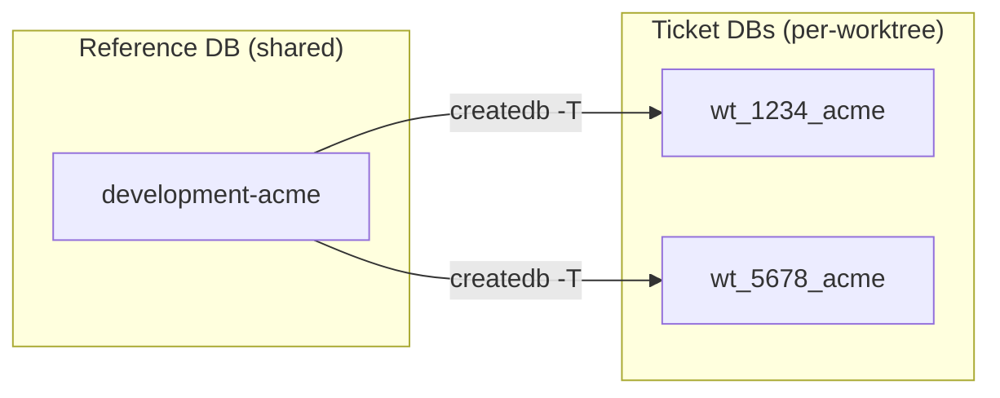
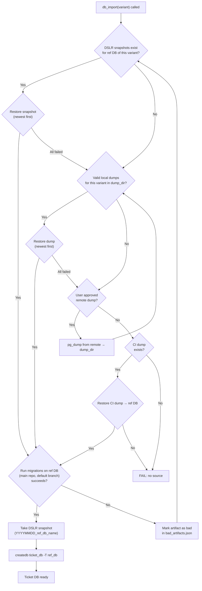
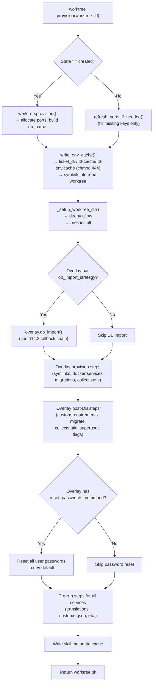
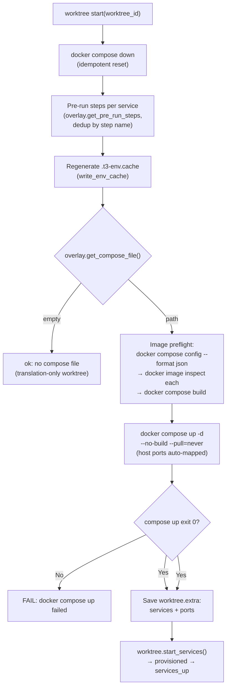
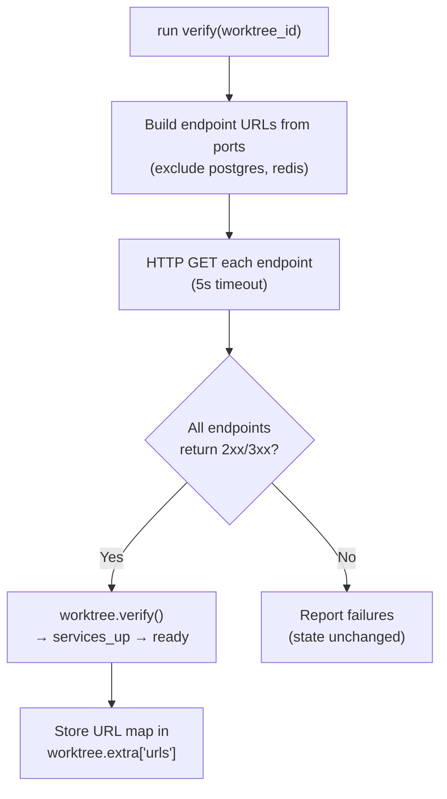
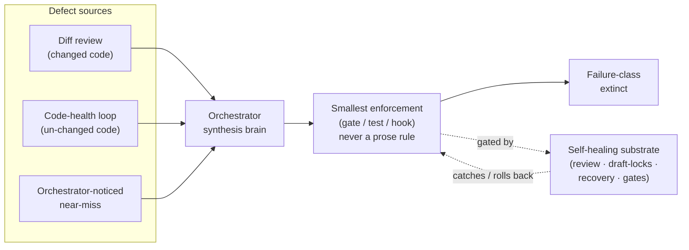

# TeaTree Blueprint

The product spec. Code is an artifact; this file is the product.

If the entire `src/` and `tests/` tree were deleted, this document alone — plus the skills in `skills/` — should be enough to regenerate the project without ambiguity.

**Change policy:** Every code change to teatree must be reflected here. Before modifying this file, always ask the user for approval — this is the source of truth and the user validates every change.

**Status:** current architecture under [#541](https://github.com/souliane/teatree/issues/541). All phases (0–8) shipped.

- Statusline file is the only persistent UI surface (HTML dashboard, ttyd, ASGI/uvicorn, platform autostart helpers removed)
- Code-host + messaging Protocols unified: `SlackBotBackend`/`NoopMessagingBackend` selectable via overlay config
- `t3 setup slack-bot --overlay <name>` walks through Slack app registration
- Fat loop + 10 scanners + dispatcher wired through `t3 loop tick` (review-channel scanning folded into dispatcher's PR-URL detection; `ReviewNagScanner` adds fibonacci-cadence thread-reply nags at +1/+2/+3/+5d on unreviewed MRs posted to the review channel — #1038)
- Headless executor is a deliberately slim `claude -p` swap point for a future Anthropic SDK runtime
- No-overlay-leak grep gate keeps the platform tenant-agnostic

---

## 1. What TeaTree Is

A personal code factory for multi-repo projects. It turns a ticket URL into a merged pull request by coordinating the full lifecycle — intake, coding, testing, review, shipping, delivery — across multiple repositories, worktrees, and agent sessions.

**Target:** service-oriented projects with databases and CI pipelines (any language). Not for docs-only repos or CLI tools.

**Operating mode.** TeaTree runs as a long-lived interactive Claude Code session orchestrated by a fat `/loop` (~10–15 min cadence). The loop fans out to in-session subagents per tick to sweep the user's PRs, auto-review PRs assigned to them, intake assigned issues, watch messaging mentions/DMs, and render a multi-line statusline that is the **only persistent UI surface**. There is no HTML dashboard. The loop runs in the same Claude Code session the user types into, so debugging stays direct.

**Code-host neutrality.** Pull requests are the canonical concept. Both **GitHub** and **GitLab** are first-class in core; GitLab MRs map onto the PR abstraction at the Protocol layer. Overlays declare which code host they target.

**Messaging-backend pluggability.** Mentions, DMs, and outgoing posts go through a `MessagingBackend` Protocol declared per overlay. Slack (Socket Mode bot) is the first implementation. A `Noop` default lets overlays opt out.

**Core principle:** Infrastructure is deterministic code; development work is skill-guided. State management, port allocation, provisioning, task routing, code-host sync, and messaging integration are Python code with >90% branch coverage. The actual development — coding with TDD, debugging, reviewing, shipping — is driven by skills that encode methodology, guardrails, and domain knowledge.

**Core stays generic.** No customer-, tenant-, or product-specific names appear in `src/teatree/` or `docs/`. Per-overlay specifics (Slack channel IDs, customer labels, project paths) live in the overlay package and in `~/.teatree.toml`. A CI grep gate enforces this.

---

## 2. Architecture Principle: Code-First, Not Skills-First

Infrastructure and orchestration are Python code; development methodology is skill-guided prose. The split is load-bearing:

1. **Skills are prose, not code.** Prose produces different results depending on the model, context pressure, and what else is loaded. Python code handles edge cases correctly every time. Anything that must be deterministic — state transitions, port allocation, provisioning, sync, the `/loop` tick — is Python.
2. **Coordination needs transactional guarantees.** Django's FSM + ORM provide atomic transitions and row-locked workers. Coordination through JSON files cannot.
3. **Code is testable; prose is not.** Core logic must reach >90% branch coverage. Anything that requires that coverage lives in Python, not in SKILL.md.
4. **One ABC with a handful of methods beats thirty thin extension points.** Overlay customization goes through `OverlayBase` — typed methods with defaults, no priority system, no plugin registries.

**The split:**

- **Deterministic code** (Django app): state machines, port allocation, provisioning, task routing, code-host + messaging Protocols, sync, `/loop` tick, statusline rendering, CLI
- **Agent skills** (SKILL.md files): development methodology, guardrails, and domain knowledge — TDD discipline, debugging process, review checklists, retro learning, verification rules, coding standards. Skills drive the actual work; they use the CLI for infrastructure.

---

## 3. Package Structure

```
Package name: teatree (double-e)
Repo/CLI name: teatree / t3
Python: >=3.13
License: MIT
Build: uv
Entry point: t3 = teatree.cli:main
```

```
src/teatree/
  __init__.py
  __main__.py
  _overlay_api.py       # __overlay_api_version__ pin + import-time guard for overlays
  paths.py              # XDG-compliant DATA_DIR/CANONICAL_DB; worktree-aware: code run from a git worktree (`.git` is a file) auto-isolates onto a per-worktree DB under the sibling `~/.local/share/teatree-worktrees/<slug>/` root (never nested under the scanned canonical dir, so doctor/stale-DB checks stay clean); resolve_data_dir() returns (path, auto_isolated); an explicit canonical target from a worktree hard-fails (CanonicalDBFromWorktreeError) so unmerged migrations can never corrupt the canonical control DB
  config.py             # ~/.teatree.toml parsing, overlay discovery, UserSettings
  settings.py           # Django settings — auto-discovers overlay apps; seed_isolated_db() takes a consistent SQLite snapshot of the canonical DB into an auto-isolated worktree dir on first use, atomically (temp file + locked rename) and only for the auto-isolated case
  identity.py           # User identity + agent_signature suffix policy
  project.py            # Project root discovery
  triage.py             # Crash-report writers consumed by hooks
  timeouts.py           # Per-CLI subprocess timeouts
  types.py              # Shared TypedDicts / structural types (no deps)
  urls.py               # Django URLConf (admin only — no HTML dashboard)
  skill_map.py          # Phase → companion skills delegation map
  skill_deps.py         # Frontmatter `requires:` parser
  skill_loading.py      # Hook-side skill suggestion + cache
  skill_schema.py       # SKILL.md frontmatter schema
  trigger_parser.py     # `triggers:` regex compiler for skill auto-loading
  url_title_fetcher.py  # PR/issue title prefetch for hook trigger matching
  visual_qa.py          # Pre-push browser sanity gate (Playwright)
  cli_reference.py      # Generates docs/generated/cli-reference.md; command_paths/command_groups SSOT for the SKILL.md t3-invocation validator (#550)
  claude_sessions.py    # Resume helpers for `claude --resume`

  cli/                 # Typer CLI package — bootstrap commands (no Django needed)
    __init__.py         # Top-level `t3` app + overlay subapp registration
    agent.py            # `t3 agent`
    assess.py           # `t3 assess`
    ci.py               # `t3 ci ...`
    config.py           # `t3 config ...`
    doctor.py           # `t3 doctor ...`
    info.py             # `t3 info`, `t3 startoverlay`, `t3 docs`
    infra.py            # `t3 infra ...`
    loop.py             # `t3 loop start|stop|status|tick` (tick delegates to loop_tick mgmt cmd)
    overlay.py          # OverlayAppBuilder — builds the per-overlay subapp
    overlay_dev.py      # `t3 overlay install|uninstall|status` (dev loop)
    review.py           # `t3 review ...`
    review_request.py   # `t3 review-request ...`
    sessions.py         # `t3 sessions`
    setup.py            # `t3 setup ...`
    slack_setup.py      # `t3 setup slack-bot` walkthrough
    update.py           # `t3 update` (sync core + overlays ff-only)
    tools.py            # `t3 tool ...`

  core/                 # Django app: the heart of teatree
    apps.py             # AppConfig with auto-admin registration
    models/             # FSM + supporting models (see §4)
    managers.py         # Custom QuerySet managers
    overlay.py          # OverlayBase ABC + OverlayConfig dataclass (see §6)
    overlay_loader.py   # Entry-point overlay discovery + instantiation
    backend_factory.py  # iter_overlay_backends, OverlayBackends bundles for the loop
    sync.py             # Shared types, SyncBackend ABC, orchestrator (sync_followup) — platform-agnostic
    cleanup.py          # Shared worktree cleanup + squash-merge-aware branch classifier
    clone_paths.py      # Workspace/clone path resolution
    orphan_guard.py     # Detect orphan containers/DBs/dirs after teardown
    provisioners.py     # WorktreeProvisioner — runs overlay provision steps
    readiness.py        # HealthCheck + readiness-probe runner
    reconcile.py        # State reconciler (see §14.11)
    resolve.py          # Worktree-by-branch+repo lookup helper
    e2e_workitem.py     # #794 durable e2e recipe + env ladder + run provenance
    signals.py          # post_transition signals
    skill_cache.py      # Per-overlay skill metadata cache writer
    step_runner.py      # ProvisionStep / PostDbStep / pre-run executor
    tasks.py            # django-tasks workers (execute_provision, execute_ship, ...)
    urls.py             # Admin URLConf
    worktree_env.py     # render_env_cache + drift detection
    worktree_tasks.py   # Worker bodies: provision, ship, retrospect, teardown
    docgen.py           # Overlay/skill documentation generation
    admin.py            # Auto-registered admin
    runners/            # Phase runners (RetroExecutor, ShipExecutor, ...)
    selectors/          # Read-only query helpers used by FSM transitions
    migrations/         # Django migrations
    management/commands/ # django-typer commands (see §8)
      lifecycle.py      # Worktree provisioning
      workspace.py      # Workspace operations
      worktree.py       # Per-worktree operations (provision/start/...)
      db.py             # Database operations
      env.py            # `env set|show|check` for the env cache
      run.py            # Service runner
      followup.py       # PR sync (GitHub + GitLab via CodeHostBackend)
      pr.py             # PR creation and validation
      ticket.py         # Ticket transitions, queries, and tracker comments
      tool.py           # Overlay-declared tool subcommands
      e2e.py            # `e2e run|external|project`
      loop_tick.py      # One tick of the fat loop (scan, dispatch, statusline)
      overlay.py        # Overlay inspection (config, info)
      tasks.py          # Task claiming and execution
      generate_*.py     # generate_all_docs / generate_overlay_docs / generate_skill_docs

  agents/               # Headless executor runtime
    handover.py         # Session handover between runtimes (uses TEATREE_CLAUDE_STATUSLINE_STATE_DIR)
    headless.py         # Headless execution via `claude -p` (kept slim — future SDK swap point)
    prompt.py           # System context and task prompt builders
    skill_bundle.py     # Skill dependency resolution for agent launch
    result_schema.py    # JSON schema for structured agent output

  loop/                 # /loop topology (see §5.6)
    tick.py             # One tick: scan in parallel, dispatch to phase agents when needed, render statusline
    dispatch.py         # Signal → action mapping (statusline / agent / webhook)
    rendering.py        # Classify dispatched actions per overlay; render anchor / action / in-flight rows. Ready zone inlines `(!iid)` after each ticket whose parent MR is known.
    pr_ticket_index.py  # Build mr_url → parent_ticket_number index (PullRequest FK + Closes/Fixes regex)
    statusline.py       # Statusline composition (zones, formatters) and file write
    scanners/           # Pure-Python signal collectors — one file each
      active_tickets.py
      assigned_issues.py
      base.py           # Scanner Protocol + ScanSignal dataclass
      my_prs.py
      notion_view.py
      pending_tasks.py
      reviewer_prs.py
      slack_mentions.py
      ticket_completion.py
      ticket_dispositions.py

  backends/             # Pluggable external service integrations
    protocols.py        # Protocol classes (see §7)
    loader.py           # Per-overlay backend loader (code-host + messaging) with lru_cache
    types.py            # Shared API TypedDicts (RawAPIDict, etc.)
    github.py           # GitHub API client + GitHubCodeHost (implements CodeHostBackend)
    github_sync.py      # GitHubSyncBackend — consumes CodeHostBackend
    gitlab.py           # GitLab API client + GitLabCodeHost (translates MR ↔ PR)
    gitlab_api.py       # Low-level GitLab REST helpers
    gitlab_ci.py        # GitLabCIService — implements CIService
    gitlab_sync.py      # GitLabSyncBackend orchestrator — thin, delegates to modules below
    gitlab_sync_prs.py  # PR building, upserting, discussion parsing
    gitlab_sync_issues.py  # Issue fetching, label resolution, variant extraction
    gitlab_sync_approvals.py / gitlab_sync_terminal.py  # Approval and terminal-state sync helpers
    slack.py            # Slack API client (httpx wrapper for SlackBotBackend)
    slack_bot.py        # SlackBotBackend — Socket Mode messaging client (implements MessagingBackend)
    slack_receiver.py   # Socket Mode receiver — writes inbound events to JSONL queue (t3 slack listen)
    slack_reactions.py  # Reaction helpers used by transition signals
    slack_review_sync.py # Review-thread → Slack post sync
    messaging_noop.py   # NoopMessagingBackend — default for overlays that opt out
    notion.py           # Notion read-only client (page fetch + n8n webhook trigger)
    sentry.py           # Sentry error tracking

  utils/                # Pure utility modules
    git.py, ports.py, run.py, secrets.py, db.py, django_db.py,
    bad_artifacts.py, compose_contract.py, dep_drift.py, redis_container.py

  overlay_init/         # t3 startoverlay helpers
    generator.py        # Scaffold generation logic (called from cli/)

  contrib/              # First-party overlays shipped with the package
    t3_teatree/         # Teatree's own overlay (dogfood)

  docker/               # Shared docker base-image build helpers (see §6.2a)
  templates/overlay/    # Cookiecutter-style scaffold for `t3 startoverlay`

.claude-plugin/         # Plugin manifest
  plugin.json           # Plugin identity (name: t3)
agents/                 # Phase sub-agent definitions (orchestrator + 7 phase agents — see §11.2)
skills/*/               # Workflow skills (SKILL.md + references/)
hooks/                  # Plugin hooks
  hooks.json            # Event → script mapping
  scripts/              # Hook scripts (bootstrap, skill loading, statusline `cat`)
apm.yml                 # APM package manifest
settings.json           # Plugin settings (statusline + permissions allow/deny)
tests/                  # Pytest suite (>90% branch coverage)
scripts/                # Standalone utility scripts
```

---

## 4. Domain Models

Five core lifecycle models in `teatree.core.models/` (split into domain-specific modules), all using `django-fsm` for state machines: **Ticket**, **Worktree**, **Session**, **Task**, **TaskAttempt**. Nine supporting rows live alongside them — `ReviewAssignment` (reaction-driven review audit row keyed `unique(overlay, mr_url, user_id)` — states `pending | approved`; `approve_for_mr(mr_url)` bulk-advances all linked rows when an approve reaction lands, capturing the full reaction → review → approval cycle; #1047), `PullRequest` (denormalized PR cache populated by sync), `TicketTransition` (audit trail of FSM moves), `WorktreeEnvOverride` (user-declared env entries layered onto the env cache), `DailyDigestThread` + `DailyDigestMessage` (one rolling Slack DM thread per digest day — rolls at 08:00 local time, configured `TIME_ZONE`, hour overridable via `TEATREE_DAILY_DIGEST_ROLL_HOUR`, #654 phase 8; `teatree.core.daily_digest.DailyDigest` opens the day's thread on first post (new `DailyDigestThread` row + Slack root message), threads every later message under it, and `close_with_recap()` posts the end-of-day recap and stamps `closed_at`; `DailyDigestMessage.idempotency_key` is unique so a retried post is a no-op. Standalone over the `MessagingBackend` — not routed through `Replier`/`ReplyDispatch` since digest posts have no originating `IncomingEvent`. `MessagingBackend` gained `open_dm`; all implementers (`SlackBotBackend`, `NoopMessagingBackend`) updated), `IncomingEvent` (canonical ingestion record for external webhook traffic — Slack, GitLab, GitHub, Notion, CI; receivers under `POST /hooks/<platform>/` verify the platform-specific authentication (Slack `X-Slack-Signature` HMAC + replay window, GitLab `X-Gitlab-Token` shared secret, GitHub `X-Hub-Signature-256` HMAC) and persist via the shared `IngestionRecord` helper. Post-auth, each receiver consults a process-local per-source token bucket (`teatree.core.views._rate_limit.webhook_rate_limiter`, capacity/refill from `TEATREE_WEBHOOK_RATE_*` settings) and returns `429` once a source's bucket is empty, so a misconfigured-platform retry storm cannot fill the DB. The bucket is per-process — under a multi-worker WSGI server the effective ceiling is `capacity × workers`; teatree assumes the single-process dev/loop topology. It is a DB-bloat guard (bounded trickle, not a precise quota); unauthenticated floods already 401 before any DB write and are intentionally not bucketed. Unique `idempotency_key` makes retries safe; a `processed_at` clock is advanced by the consumer queue), `IntentClassification` (pattern-based verdict on an `IncomingEvent` produced by `teatree.core.intent_classifier.classify_event()` — six intents `task | question | approval | status_update | escalation | noise`, one-to-one with the event, idempotent re-runs), and `ReplyDispatch` (audit row for every outbound message published through a `Replier` — `pending | sent | failed | dead_letter`, unique `idempotency_key` collapsing retries; production `SlackReplier`/`GitLabReplier`/`GitHubReplier` subclass a shared `_BaseReplier` whose idempotent `_send` records `sent` on success or `failed` + `error_message` on any backend exception, with `_deliver` the single per-platform hook; `replier_for(source, *, bot/gitlab/github)` picks the production subclass or falls back to `NoopReplier` when the matching backend is not injected; the row persists `body` + `retry_count`/`next_retry_at` so `teatree.core.reply_retry.sweep_failed_dispatches(resolver=…)` can retry `due_for_retry()` rows via `Replier.redeliver`, backing off `base_delay·2**retry_count` and at `max_retries` marking `dead_letter` + DMing the originating actor — the alert row's `action_name="dead_letter_alert"` is excluded from the sweep so a broken DM channel cannot storm). `core/models/errors.py` and `core/models/types.py` carry shared exceptions and TypedDicts (no DB tables). The pure-function router `teatree.core.event_router.route_event(event, classification)` turns each classified event into a `RoutedAction` (`schedule_task | schedule_merge | alert_user | record_only | drop`) for the loop/agent layer to execute. The `IncomingEventsScanner` (registered alongside `PendingTasksScanner` in `build_default_jobs`) drains the unprocessed queue on every tick — classify → route → execute → mark processed — with a per-event try/except so one corrupt row doesn't block the rest, and four new `_STATUSLINE_ZONE_BY_KIND` entries (`incoming_event.{alert,task_needed,merge_needed,recorded}`) so the emitted signals are visible. The loop dispatcher (`teatree.loop.dispatch`) routes an `incoming_event.task_needed` signal whose phase normalizes (`teatree.core.phases.normalize_phase`) to `answering` to the `t3:answerer` agent plus a statusline mirror (the reviewer dual-dispatch shape, #670); it resolves `require_human_approval_to_answer` once through the standard active-overlay → global → default chain (mirroring `require_human_approval_to_merge` — no env-var layer for this setting) and stamps it into the agent payload as an advisory convenience mirror; the answerer skill re-resolves the setting at task start (`skills/answerer/SKILL.md` § Autonomy Gate) and is the source of truth, so the stamp is a hint, not authoritative. `coding`-phase `task_needed` signals keep their prior statusline-only behaviour (auto ticket creation from inbound chat is a separate decision pass). `SCHEDULE_MERGE` actions first call `OverlayBase.can_auto_merge(target_ref, thread_ref) → MergeGuard` (#654) — the default implementation is permissive (`allowed=True`); overlays that need approval gates or freeze-window checks override it. Three outcomes: `guard.allowed` → `incoming_event.merge_needed`; `not allowed and guard.escalate` → `incoming_event.merge_escalation`; `not allowed` → `incoming_event.merge_blocked`. All three carry the same merge refs in their payload (`event_id`, `target_ref`, `thread_ref`; the two blocking outcomes also carry `reason`) and all three signal kinds are registered in `_STATUSLINE_ZONE_BY_KIND` as `"action_needed"`. `GitLabApprovalsScanner` (#936) is the poll-driven complement to this webhook-driven path — for deployments where Slack Connect blocks the OperCodeReviewBot from joining `#the-review-crew` or the GitLab webhook is not wired up, the scanner polls `CodeHostBackend.get_mr_approvals` per tick and emits the same `incoming_event.merge_{needed,blocked,escalation}` signal through the same `can_auto_merge` guard, so the §17.4 keystone merge transition is the single point of merge-decision regardless of which transport surfaced the approval.

**Transitions own their work.** Every FSM transition composes the runners needed to make its new state true — git, PR I/O, retro writing, cleanup — and enqueues long work to an `@task` worker via `transaction.on_commit`. Transition bodies stay pure (state change + metadata + enqueue); the worker does the I/O, takes a row lock with `select_for_update()`, re-checks the source state for idempotency, and on success calls the next transition to advance the ticket. The single rule: to move the ticket, call the transition; the transition does the rest.

Rationale: at-least-once delivery is safe because workers guard with row-locked state checks; crash recovery is `django-tasks`' job, not ours; tests use `ImmediateBackend` to run workers synchronously. `post_transition` signals remain reserved for lossy cross-cutting side effects (audit log, Slack reactions) — never for the main work of the transition.

### 4.1 Ticket — Core delivery entity

The central entity. One ticket per unit of work (maps to an issue/task in the tracker).

**States:** `not_started` → `scoped` → `started` → `coded` → `tested` → `reviewed` → `shipped` → `in_review` → `merged` → `retrospected` → `delivered`

**Fields:**

| Field | Type | Purpose |
|-------|------|---------|
| `issue_url` | URLField(500) | Link to tracker issue (blank for manual tickets) |
| `overlay` | CharField(255) | Overlay name (entry point name from `teatree.overlays`) |
| `variant` | CharField(100) | Tenant/variant identifier (e.g., "acme") |
| `repos` | JSONField(list) | Repository names involved |
| `state` | FSMField | Current lifecycle state |
| `extra` | JSONField(dict) | Extensible metadata (PRs, labels, test results) |
| `context` | TextField | Append-only durable knowledge store — timestamped notes the agent reuses across sessions (`t3 <overlay> ticket context show\|add\|edit`; rendered collapsed in the `workspace ticket` intake) |

**Transitions:**

| Method | Source → Target | Side effects |
|--------|----------------|--------------|
| `scope(issue_url=, variant=, repos=)` | not_started → scoped | Sets issue_url, variant, repos |
| `start()` | scoped → started | Enqueues `execute_provision` worker. Worker runs `WorktreeProvisioner` and calls `schedule_coding()` on success. |
| `code()` | started → coded | Clean-worktree preflight (see §4 note); calls `schedule_testing()` |
| `test(passed=True)` | coded → tested | Clean-worktree preflight; stores `tests_passed` in extra; calls `schedule_review()` |
| `review()` | tested → reviewed | Condition: reviewing task completed. Clean-worktree preflight. Calls `schedule_shipping()` only if `has_shippable_diff()` returns True (otherwise stamps `extra["shipping_skipped"]` for triage — guards meta-tickets from spurious shipping tasks). |
| `reconcile_reviewed()` | **any non-terminal state** (all states except SHIPPED/MERGED/DELIVERED/IGNORED) → reviewed | **Phase-driven / state-complete** gate catch-up (#694, #798, #799, #808). No reviewing-task condition — the shipping gate verifies the required phases across the union of the ticket's sessions (`Ticket.aggregate_phase_records()`, the single source of truth) before calling this, so `ship()` is legal and `pr create` never raises a raw `TransitionNotAllowed`. No side effects. Invoked via `_ship_fsm.reconcile_fsm_for_ship()` (extracted from `pr.py` by concern, #748) from **both** the gate-passed path **and** the `--skip-validation` path (#748): `--skip-validation` is the user-authorized attestation substitute (the gate-fixer bootstrap exception, /t3:ship §5 #2), so the FSM must follow the authorization — otherwise `ship()` is structurally impossible from a non-REVIEWED state. **#808 made the source state-complete:** it was previously an enumerated allow-list (#798 added pre-REVIEWED states; #799 added `in_review`; `retrospected` and any future unlisted non-terminal state was still rejected), which kept re-introducing the `{'allowed': False, 'missing': []}` denial — the gate aggregated `missing: []` while the FSM couldn't reach `REVIEWED` from the lingering state (e.g. a ticket re-provisioned for a new workstream whose FSM sat at `retrospected`). The source is now **derived** from the terminal set (`Ticket._RECONCILE_SOURCE_STATES` = all states minus `_TERMINAL_STATES` = SHIPPED/MERGED/DELIVERED/IGNORED), with a test asserting the partition is exhaustive, so a newly added non-terminal state can never silently re-break the gate. Terminal states stay non-recoverable: SHIPPED/MERGED/DELIVERED are genuine post-ship success, IGNORED is abandoned. `_ship_fsm.reconcile_fsm_for_ship()` still no-ops at REVIEWED + the terminal set (`_SHIP_RECONCILE_NOOP_STATES`); a defence-in-depth `suppress(TransitionNotAllowed)` keeps the #694 "never a raw raise" invariant. |
| `ship()` | reviewed → shipped | Clean-worktree preflight. Enqueues `execute_ship` worker. Worker runs `ShipExecutor` and calls `request_review()` on success. |
| `request_review()` | shipped → in_review | — |
| `mark_merged()` | in_review → merged | Enqueues `execute_teardown` worker. Worker runs `WorktreeTeardown` (best-effort cleanup of git worktrees, branches, per-worktree DBs, overlay hooks). Errors do NOT block the FSM — `retrospect()` can advance the ticket regardless. |
| `retrospect()` | merged → retrospected | Enqueues `execute_retrospect` worker. Worker runs `RetroExecutor` and calls `mark_delivered()` on success. |
| `mark_delivered()` | retrospected → delivered | — |
| `rework()` | coded/tested/reviewed → started | Clears tests_passed, cancels pending tasks |

**Worker enqueue pattern (BLUEPRINT §4 invariant):** transitions that own long I/O follow one rule — body stays pure (state change + metadata only), then `transaction.on_commit(lambda: execute_X.enqueue(self.pk))`. The state change and the queued work land atomically. Workers take a row lock (`select_for_update()`), re-check the source state, run the runner, and on success call the next transition. At-least-once delivery is safe because the state guard makes redelivery a no-op. See `teatree/core/runners/` for the runner classes and `teatree/core/tasks.py` for the workers.

**Clean-worktree preflight (#884).** `code()`, `test()`, `review()`, and `ship()` call `Ticket._refuse_if_worktree_dirty(phase)` at the top of the transition body, before any scheduling side effect. If any of the ticket's worktrees has uncommitted **tracked** changes, the transition is refused: a loud `DirtyWorktreeError` (an `InvalidTransitionError` subclass — a `ValueError`, *not* django-fsm `TransitionNotAllowed`) is raised naming the dirty worktree. Every production caller wraps the transition body in an *outer* `transaction.atomic()` (the loop: `Task.complete()` → `_advance_ticket` → `_apply_phase_transition`; ship: `_ship_exec._do_ship_transition`), so the raise rolls that whole atomic back — the FSM state change is undone, the ticket stays put, and the task reverts to its pre-`complete()` CLAIMED state (no force-reopen: a cross-transaction durable write cannot survive the caller's rollback, so attempting one would be a false durability claim). **Held-task recovery is the lease-reaper safety net**, not a first-committed reopen: the worker that called the transition stops heartbeating after the exception, the task's lease expires, and `TaskManager.reclaim_orphaned_claims` returns the CLAIMED task to PENDING on the next loop tick so the agent re-runs it and finishes the commit. The ship path surfaces the refusal as the structured `ShippingGateFailure` contract (`_do_ship_transition` catches `InvalidTransitionError` alongside `TransitionNotAllowed`), never as an exception escaping `pr create`. **No auto-stash:** teatree worktrees share one `.git`, so a stash is repo-global and could clobber an unrelated branch's work; refuse-and-let-the-reaper-recover is the owner-resolved default. Untracked-only files do **not** block (the tracked-vs-untracked distinction, mirroring `cli.update._tracked_dirty_paths`); an unresolvable or non-git worktree path fails open (treated as not-dirty) so a legitimately-clean ticket never stalls. The check reuses the existing `git.status_porcelain` helper (`_worktree_tracked_dirty_path`, path resolution mirroring `_worktree_has_commits_ahead`).

**Synchronous ship atomicity (`pr create --sync`, #838, #860).** The inline path (`_ship_sync`) runs the `ship()` FSM transition **and** the inline `execute_ship` inside a *single* `transaction.atomic()` block. A `ShipExecutor.run()` exception — a `git push` precondition failure surfaces as a `CommandFailedError` — then rolls the `ship()` advance back, so the ship is all-or-nothing: either pushed + PR opened + FSM advanced, or the FSM is left untouched (safely re-runnable from `REVIEWED`). The exception is caught and returned as a structured `ShipExecuted` (`ok=False`, real cause in `detail`); pre-#838 it propagated unhandled, committing a partial `SHIPPED` (no push/PR) and crashing the `manage.py` subprocess so the CLI wrapper surfaced only an opaque `rc=1` with the real cause lost. `ShipExecutor.run()` also has *non-raising* precondition exits (`no code host configured`, `no worktree on ticket`, `branch … already merged into base`) that return `RunnerResult(ok=False)`; `execute_ship` then returns a normal `{"ok": False}` dict — no exception. #838 only treated an exception as the rollback trigger, so pre-#860 those structured failures still committed the same partial `SHIPPED`. #860 closes that residual path: a failing `execute_ship` result is re-raised inside the atomic block as `_ShipExecutionError` carrying the real `detail`, so both the raised and the `ok=False` paths share one rollback + structured-surfacing path. This is the synchronous analogue of the worker enqueue pattern's "state change and queued work land atomically" invariant — the async path achieves it via `on_commit`, the sync path via the shared transaction. The block's `on_commit` enqueue fires only on commit (success); `execute_ship`'s own state guard makes a later worker pickup a no-op.

**Auto-scheduling:** each phase transition leads to the next-phase task in a fresh session (bias-free evaluation). `start()` schedules coding indirectly — the provision worker calls `schedule_coding()` once worktrees exist. The remaining auto-schedule edges are direct:

- `start()` → enqueues provision → on success → headless coding task
- `code()` → headless testing task
- `test()` → headless reviewing task
- `review()` → shipping task (execution target gated by `T3_AUTO_SHIP`), gated on `has_shippable_diff()`

`schedule_shipping()` defaults to `ExecutionTarget.INTERACTIVE` so the user must explicitly approve the push. Set `T3_AUTO_SHIP=true` in the environment to make shipping headless.

`Ticket.has_shippable_diff()` returns True iff at least one `Worktree` has commits ahead of its base branch (resolved via `origin/<default>` or local `main` fallback). When False, `review()` advances state but skips `schedule_shipping()` — typical for meta-tracker tickets whose work shipped via sibling PRs. Manual `schedule_shipping()` callers (CLI, tests) remain permissive and bypass the gate.

**`extra` structure** (authoritative schema: `TicketExtra` TypedDict in `core/models/types.py`, validated by `validated_ticket_extra()`):

```python
{
    "tests_passed": bool,
    "pr_urls": ["..."],
    "prs": {
        "<pr_id>": {
            "url": str, "title": str, "branch": str, "draft": bool,
            "repo": str, "iid": int,
            "pipeline_status": str, "pipeline_url": str,
            "review_requested": bool, "reviewer_names": [str],
            "head_sha": str, "last_reviewed_sha": str,
        }
    },
    "pr_title_override": str,
    "branch": str,
    "description": str,
    "provision": {"...": "..."},
    "ignored_from": str,
    "shipping_skipped": str,
    "visual_qa": {"targets": [...], "pages_checked": int, "errors": int, ...},
    "issue_title": str,
    "labels": [str],
    "tracker_status": str,
    "auto_started": bool,
}
```

**Property:** `ticket_number` extracts numeric ID from `issue_url` tail via regex, falls back to `pk`.

### 4.2 Worktree — Per-repo lifecycle (FK → Ticket)

One worktree per repository per ticket.

**States:** `created` → `provisioned` → `services_up` → `ready`

**Fields:**

| Field | Type | Purpose |
|-------|------|---------|
| `ticket` | FK(Ticket) | Parent ticket |
| `overlay` | CharField(255) | Overlay name (entry point name from `teatree.overlays`) |
| `repo_path` | CharField(500) | Repo identifier (e.g. `org/repo` or short slug) — NOT a filesystem path. The on-disk worktree path lives in `extra['worktree_path']` and is exposed as `Worktree.worktree_path`. |
| `branch` | CharField(255) | Git branch name |
| `state` | FSMField | Current lifecycle state |
| `db_name` | CharField(255) | Database name |
| `extra` | JSONField(dict) | Extensible metadata |

**Transitions:**

| Method | Source → Target | Side effects |
|--------|----------------|--------------|
| `provision()` | created → provisioned | Builds db_name |
| `start_services(services=[])` | provisioned → services_up | Stores service list in extra |
| `verify()` | services_up → ready | Builds URL map in extra |
| `db_refresh()` | provisioned/services_up/ready → provisioned | Stores timestamp |
| `teardown()` | * → created | Clears db_name, extra |

**Readiness gate:** ``worktree start``, ``worktree verify``, ``worktree ready``, and ``workspace start`` run ``overlay.get_readiness_probes(worktree)`` after their primary work and exit 1 if any probe fails. Probes are runtime checks against started services (HTTP endpoints, dependency round-trips, content invariants on seeded data); ``HealthCheck`` covers post-provision file/symlink/env invariants instead. See ``teatree.core.readiness``.

**Port allocation (Non-Negotiable — see §16):** Ports are NEVER stored in the database or the `.t3-env.cache` file. The compose override declares container ports with **no host binding** (`ports: ["<container_port>"]`), so Docker auto-maps to a free host port at compose-up time. After `compose up`, `WorktreeStartRunner` queries the running project via `docker compose port <service> <container_port>` and stores the result on `Worktree.extra["ports"]` for downstream callers (URL printing, `worktree status`, E2E discovery). The running containers are the single source of truth.

Canonical container ports (from `teatree.utils.ports.CONTAINER_PORTS`; consumed by `COMPOSE_SERVICE_MAP` to query host ports back):

- `backend`: 8000 (Django runserver in `web` container)
- `frontend`: 80 (nginx-served Angular dist)
- `postgres`: 5432 (shared host postgres; per-worktree isolation via DB names, not ports)
- `redis`: not per-worktree. Overlays opting in via `uses_redis()` share `teatree-redis` on `localhost:6379`; per-ticket isolation comes from `Ticket.redis_db_index` → `REDIS_DB_INDEX` env var; slot count from `teatree.redis_db_count` in `~/.teatree.toml`, default 16.

**Database naming:** `wt_{ticket_number}_{variant}` (variant suffix omitted if empty).

### 4.3 Session — Quality gate tracker (FK → Ticket)

Tracks which workflow phases an agent visited within a conversation, to enforce ordering. The phase records across **all of a ticket's sessions** are the **single source of truth** for the shipping gate (#694): `ticket.state` is reconciled *from* their union (`Ticket.aggregate_phase_records()`), never the reverse. FSM-advancing `visit-phase` forks a fresh session by design, so the required phases are legitimately scattered — the gate consumes the cross-session union, not the latest session alone. Both the loop path (`Task.complete()` records the visited phase via `_record_phase_visit()`) and the CLI path (`lifecycle visit-phase`) write canonical phase tokens here, so the gate and the FSM cannot disagree. **`Ticket.ensure_session()` (#748)** guarantees a loop/coordinator-built ticket — one created via `get_or_create` in the dispatch path, not through `workspace ticket` — still has a durable session, so the gate reconciles real attested work instead of fail-closing on "no session"; it is idempotent and reuses the *earliest* existing session so attestation is never split across a fresh empty one. It is called from the orchestrator dispatch path and the `workspace ticket` command so those entry points converge; the `tasks create` path already materialises a session via its own pre-existing lazy-session logic (`tasks.py` — `Session.objects.filter(...).first() or Session.objects.create(...)`), so it converges independently without needing `ensure_session()`. The read+create is wrapped in `transaction.atomic()` with the ticket row `select_for_update`-locked, so two concurrent loop ticks for the same `issue_url` (the dispatch path has no surrounding transaction) cannot both miss and double-create — the loser blocks, re-reads under the lock, and reuses. **Reaper fix (#748):** `workspace ticket`'s failed-provision rollback (`ticket.delete()`) is guarded — because `Session.ticket` is `on_delete=CASCADE`, deleting a `get_or_create`-shared ticket that a concurrent `lifecycle visit-phase` populated with phase-attestation sessions would cascade-reap that genuine work; the rollback now only discards a ticket whose `aggregate_phase_records()` is empty.

**Phase vocabulary (`teatree.core.phases`).** Skills emit short verbs (`scope`, `code`, `test`, `review`, `ship`, `retro`); older code and `_REQUIRED_PHASES` use gerunds. `normalize_phase()` collapses every spelling to one canonical token (the form stored in `visited_phases`/`_REQUIRED_PHASES`); `phase_transition()` maps a phase to its `Ticket` FSM transition. `lifecycle visit-phase` and `pr create` both resolve the ticket via the shared `Ticket.objects.resolve()` (pk / issue number / issue URL), so callers can pass the forge issue number without hitting a silent `DoesNotExist`. **Cross-DB guard (`teatree.core.db_anchor`, #779).** Both commands call `assert_lifecycle_db_is_canonical(ticket)` before any phase write / gate read. The trip condition is the *live Django connection* being bound to a real per-worktree isolated `db.sqlite3` under `paths.worktree_isolation_root()` — exactly the `uv run manage.py`-from-a-worktree case whose phase write (maker `testing`/`retro`) or gate read (reviewer `reviewing`, `pr create`) never reaches the canonical DB the shipping gate consults. It then raises `WrongWorktreeDBError` naming the isolated DB in use, the canonical DB, the ticket's worktree, and the correct `t3 <ov>` command, instead of silently splitting attestation from the DB the gate reads (the symmetric defect behind #764/#628/#769/#777/#778). `t3 <ov>` proxies through the main clone (canonical DB) and never trips; `:memory:` test DBs are never under the isolation root so the guard is inert under the test runner without a test-only branch — same doctrine as `paths.CanonicalDBFromWorktreeError`.

**Fields:**

| Field | Type | Purpose |
|-------|------|---------|
| `ticket` | FK(Ticket) | Parent ticket |
| `overlay` | CharField(255) | Overlay name (entry point name from `teatree.overlays`) |
| `visited_phases` | JSONField(list) | Phases visited in order |
| `started_at` | DateTimeField | Auto-set |
| `ended_at` | DateTimeField | Set on manual handoff |
| `agent_id` | CharField(255) | Agent identifier |

**Quality gates (hardcoded):**

```python
_REQUIRED_PHASES = {
    "reviewing": ["testing"],
    "shipping": ["testing", "reviewing"],
    "requesting_review": ["shipping"],
}
```

**#837 — retro is orchestrator-only.** The shipping gate no longer requires a per-ticket `retro` visit. Retro is an orchestrator-level periodic synthesis over durable signal (task metadata / snapshots), not a per-ticket sub-agent step; gating shipping on it pushed retro to the least-effective level (a box-tick by the sub-agent that just did the work). `retro` remains a recordable phase (`teatree.core.phases`) for audit — it is simply no longer in the `shipping` required set.

`check_gate(phase, force=False)` raises `QualityGateError` if required phases haven't been visited *on this session*; `force=True` bypasses. `check_gate_across_ticket(phase)` runs the same missing-phase logic over the **union** of the ticket's sessions (`Ticket.aggregate_phase_records()`) — this is what the shipping gate uses. The gate verifies only that the required phases (`testing`, `reviewing`) were recorded for the work. Independence in code review is a property of the **execution context** — the `reviewing` phase is earned by a freshly-spawned `t3:reviewer` sub-agent that has not seen the implementation conversation, and that spawn boundary *is* the independence guarantee, by construction (same-session spawn is fine). There is no `agent_id` comparison: a stored-identity maker≠checker inference added no real independence over the structural spawn boundary and was net-negative (false-denied legitimate same-session work), so it was removed (#833). `phase_visits` is retained as an audit trail of who recorded each phase; it is not consumed for gate enforcement. **`Session.recording_identity(explicit="")`** resolves a guaranteed-non-empty attribution (`explicit` → `Session.agent_id` → `session-<pk>` fallback); both the CLI path (`lifecycle visit-phase --agent-id`) and the loop path (`Task._record_phase_visit`) route through it so neither can stamp a blank again. **`Session.visit_phase` is atomic (#755):** its read-modify-write of the `visited_phases`/`phase_visits` JSON columns runs in `transaction.atomic()` with the row `select_for_update`-locked and re-read from the locked row, so a live maker session and an independent reviewer writing the same `Session` pk concurrently cannot lose-update (clobber) each other's phase (the #748 / `/t3:review` Safety-6 unlocked-RMW class; tracked as #761, fixed here).

**SQLite write serialization makes `select_for_update()` real on prod (#804).** Django's SQLite backend silently *ignores* `select_for_update()` — it is a documented no-op (SQLite has no row-level locks). So the locked-RMW pattern that `Session.visit_phase`, `Task.claim` (§4.4) and ~12 sibling sites rely on for mutual exclusion would, by itself, serialize *nothing* on the production engine (prod and the test DB are both SQLite). The compensating primitive lives at the connection level: `settings.DATABASES["default"]["OPTIONS"]` (the named `SQLITE_WRITE_SERIALIZATION_OPTIONS` constant) sets `transaction_mode="IMMEDIATE"` (Django 5.1+), so every `transaction.atomic()` block opens with `BEGIN IMMEDIATE` and the first writer takes SQLite's reserved write lock at transaction *start* — concurrent writers block on `busy_timeout` (`timeout=30s`) and retry instead of racing, restoring exactly the invariant the `select_for_update()` calls assume. `journal_mode=WAL` lets readers run concurrently with the single writer. The contention is exercised by a real two-writer, file-backed-SQLite regression (`tests/test_sqlite_write_serialization.py`) — the ordinary `:memory:` test DB is per-connection and single-threaded, so it structurally cannot catch this; that test double-claims/`database is locked`s without the OPTIONS and yields exactly one winner with them.

### 4.4 Task — Agent work unit (FK → Ticket, Session)

Represents a unit of work for an agent (headless or interactive).

**States:** `pending` → `claimed` → `completed` / `failed`

**Fields:**

| Field | Type | Purpose |
|-------|------|---------|
| `ticket` | FK(Ticket) | Parent ticket |
| `session` | FK(Session) | Parent session |
| `parent_task` | FK(self, null) | For interactive followups |
| `phase` | CharField(64) | Workflow phase (reviewing, shipping, etc.) |
| `execution_target` | CharField(32) | "headless" or "interactive" |
| `execution_reason` | TextField | Why this task exists |
| `status` | FSMField | pending/claimed/completed/failed |
| `claimed_at` | DateTimeField | When claimed |
| `claimed_by` | CharField(255) | Who claimed it |
| `lease_expires_at` | DateTimeField | Lease expiry for timeout recovery |
| `heartbeat_at` | DateTimeField | Last heartbeat |
| `result_artifact_path` | CharField(500) | Path to result artifact |

**Claiming:** `claim(claimed_by, lease_seconds=300)` uses `select_for_update()` for atomic distributed locking. Raises `InvalidTransitionError` if already claimed with a valid lease.

**Completion flow:** `complete()` → clears claim → calls `_advance_ticket()`, **all inside a single `transaction.atomic()` (#883)**. Pre-#883 the task `save()` and the FSM transition were two separate write boundaries: a process death between them left the task COMPLETED but the ticket on its old state, and because the task was no longer CLAIMED neither `reclaim_orphaned_claims` nor `reap_stale_claims` could rescue it — the loop stalled forever on a half-advanced ticket. One transaction closes that window: either both writes land or neither does. `_advance_ticket()` records the phase visit then delegates the FSM dispatch to `_apply_phase_transition()` — the **single** place that maps a completed phase to an FSM transition, **shared** by the live `complete()` chain and the `TaskQuerySet.replay_orphaned_transitions()` boot/tick recovery sweep (the boot-time safety net for any row that slipped through before the atomic fix shipped, or via a future un-wrapped seam — sibling of `reclaim_orphaned_claims`, run from the same `_reap_stale_task_claims()` hook *before* the claim sweeps). Because replay reuses that exact guarded path it is idempotent and **cannot skip a lifecycle gate**: a COMPLETED `shipping` task on a ticket that never went through code→test→review finds no matching `phase + state` guard and no-ops, so a ticket can never reach a state it did not earn. `_apply_phase_transition()` **normalizes `self.phase` via `normalize_phase()` once** before the FSM dispatch (#750), mirroring `_record_phase_visit()` — a task whose phase is a short verb (`review`/`code`/…, the vocabulary skills emit and `tasks create` stores verbatim) advances the FSM, not just records the session visit; raw comparison previously left `ticket.state` silently desynced from `visited_phases` (one root cause `reconcile_reviewed()` papered over). The phase-keyed branches below match on the **normalized** token:

- If last attempt has `needs_user_input: true`: creates interactive followup task (same phase, parent_task linked, session carries the `agent_session_id` for resume)
- If phase is "scoping" and ticket is SCOPED: calls `ticket.start()` (→ schedules coding)
- If phase is "coding" and ticket is STARTED: calls `ticket.code()` (→ schedules testing)
- If phase is "testing" and ticket is CODED: calls `ticket.test(passed=True)` (→ schedules reviewing)
- If phase is "reviewing" and ticket is TESTED: calls `ticket.review()` (→ schedules shipping)
- If phase is "shipping" and ticket is REVIEWED: calls `ticket.ship()`

Each guard is `phase + state` so repeat calls (parallel child tasks, **or `replay_orphaned_transitions()` re-running an already-applied transition**) find the state mismatch and safely no-op after the first advance.

**Phase task consumption:** Each FSM transition body calls `_consume_pending_phase_tasks(phase)` for the phase it closes. On the task-driven path the task was already marked COMPLETED before the transition fires, so the call is a zero-row no-op. On direct-call paths (e.g. `pr.py` invoking `ticket.ship()` from a CLI command) the previously auto-scheduled phase task is still PENDING/CLAIMED — the call marks it COMPLETED so the dispatcher does not later claim it as a zombie session. Both this consume side (`TaskQuerySet.pending_in_phase`, #769) and the FSM read-side conditions (`TaskQuerySet.completed_in_phase`, #757) match the phase via the shared `phase_spellings()` SSOT, so a short-verb task (`tasks create <id> review`, stored unnormalized as `review`) is matched the same as the canonical `reviewing` — a raw `phase=phase` filter previously missed it.

**Session resume:** Both headless and interactive runners walk the `parent_task` chain to find a previous `agent_session_id`. When found, the CLI is invoked with `--resume <session_id>` to preserve full conversation context across execution mode switches.

**Convenience:** `complete_with_attempt()` creates a TaskAttempt and calls complete/fail based on exit_code.

**Routing:** `route_to_headless(reason=)` and `route_to_interactive(reason=)` change execution_target and reset to PENDING.

### 4.5 TaskAttempt — Execution history (FK → Task)

Records each execution attempt for audit trail.

**Fields:**

| Field | Type | Purpose |
|-------|------|---------|
| `task` | FK(Task) | Parent task |
| `started_at` | DateTimeField | Auto-set |
| `ended_at` | DateTimeField | When execution finished |
| `execution_target` | CharField(32) | headless/interactive |
| `error` | TextField | Error message if failed |
| `exit_code` | IntegerField | 0=success, non-zero=failure |
| `artifact_path` | CharField(500) | Path to output artifact |
| `result` | JSONField(dict) | Structured result (see §5) |
| `launch_url` | URLField(500) | Reserved for interactive task launch URLs |
| `agent_session_id` | CharField(255) | Agent session ID for continuity |

---

## 5. Agent Execution

### 5.1 Structured Result Schema

Agents return JSON matching `AgentResult`:

```python
{
    "summary": str,              # One-line summary
    "files_modified": [{         # Files changed
        "path": str,
        "action": "created"|"modified"|"deleted",
        "lines_added": int,
        "lines_removed": int,
    }],
    "tests_run": [{              # Test results
        "name": str,
        "passed": bool,
        "duration_seconds": float,
        "error": str,
    }],
    "tests_passed": int,
    "tests_failed": int,
    "decisions": [str],          # Design decisions made
    "needs_user_input": bool,    # Triggers interactive followup
    "user_input_reason": str,    # Why human input is needed
    "next_steps": [str],         # Suggested follow-up actions
    "commands_executed": [str],  # Shell commands run
}
```

Schema enforces `additionalProperties: false`. Validation is done without jsonschema library (minimal dependency).

### 5.2 Headless Execution (headless.py)

Runs `claude -p <prompt> --append-system-prompt <context> --output-format json`. Used by the `pending_tasks` scanner (§ 5.6) and by direct calls from the lifecycle FSM workers when a phase task is queued. Kept deliberately small — the swap point for an Anthropic SDK runtime when direct-API execution is desired.

**Flow:**

1. Resolve skill bundle for the task's phase
2. Build task prompt (ticket context, PR metadata, work instructions)
3. Build system context (task ID, skills to load, phase-specific instructions)
4. Execute subprocess, capture stdout/stderr
5. Parse JSON result: `_parse_cli_envelope()` extracts `{session_id, result}` from Claude CLI output
6. `_parse_result()` searches reversed output lines for first `{` (allows progress text before final JSON)
7. Validate result against schema
8. Create TaskAttempt with result, exit_code, agent_session_id
9. Call `task.complete()` which triggers automatic ticket advancement

**Model tiering (#880, #562 §3):** `resolve_phase_model(phase)` (in `agents/model_tiering.py`) maps the task's phase to a Claude model tier. Mechanical phases are downgraded by default (`reviewing`/`testing`/`shipping` → `sonnet`, `retrospecting` → `haiku`); reasoning phases (`coding`, `debugging`) and unmapped phases return `None`, so no `--model` flag is added and the user's default model applies. Overridable per phase via `~/.teatree.toml`:

```toml
[agent]
phase_models.reviewing = "opus"   # pin a phase back to the reasoning tier
phase_models.coding = "sonnet"    # opt a reasoning phase into a cheap tier
phase_models.testing = ""         # opt out — inherit the user's default
```

**Auth:** Uses the `claude` binary (Claude Code session auth — no API key required).

**Stuck-loop / cost-spike watchdog (#882).** The agent runs over `Popen` (via `teatree.utils.run.spawn`) so the heartbeat thread can terminate a runaway mid-flight. On every heartbeat tick `LoopWatchdog.breach_reason()` evaluates the task's wall-clock runtime plus the accumulated `TaskAttempt.num_turns` / `cost_usd` deltas (sampled once on the main thread before the subprocess starts — prior-attempt totals are static for the run). On a ceiling breach the subprocess is killed and a `stuck_loop` `TaskAttempt` failure is recorded with the observed deltas (`task.fail()` runs). The conservative default is a 3h runtime ceiling that only trips on a genuinely runaway subprocess; absolute turn/cost budget caps are deferred to #398-4, so those dimensions default off (`0` = disabled). Overridable via Django settings:

```python
TEATREE_LOOP_WATCHDOG = {
    "max_runtime_seconds": 10800,  # 0 = disabled
    "max_turns": 0,                # 0 = disabled
    "max_cost_usd": 0.0,           # 0 = disabled
}
```

**Per-ticket cost cap (#885 / #398-4).** Where the watchdog above bounds a single in-flight subprocess (it kills a runaway mid-run), `TicketBudget` bounds the *whole ticket's lifetime spend* at dispatch time. Before a task's subprocess is launched, `run_headless` sums `TaskAttempt.cost_usd` across every task under the task's ticket; once the cumulative spend crosses the configured ceiling the subprocess is not launched and a `budget_exceeded` `TaskAttempt` failure is recorded (`task.fail()` runs), surfacing the breach on the failure record so a pathological ticket stops draining budget in unattended batch runs. The conservative default mirrors #882's precedent — the cap is opt-in (`0.0` = disabled), so the consumer changes no behaviour until a ceiling is configured. Overridable via Django settings:

```python
TEATREE_TICKET_BUDGET = {
    "max_cost_usd": 0.0,  # 0 = disabled
}
```

### 5.3 Prompt Building (prompt.py)

**`build_task_prompt(task)`** — Work instructions for the agent:

- Ticket context: number, issue URL, title, labels, phase, execution reason
- PR context: open PRs with URL, title, draft status, pipeline status
- Instructions: check progress → identify remaining work → proceed → request input if blocked → run tests

**`build_system_context(task, skills=[])`** — System prompt for headless agents:

- Task/ticket identifiers, skill loading directives
- Phase-specific instructions (reviewing: thorough code review + /t3:next)
- Mandatory post-execution: run /t3:next for retro + structured result + pipeline handoff
- Fallback JSON schema if /t3:next not available

**`build_interactive_context(task, skills=[])`** — System prompt for interactive sessions:

- Same content as system context, plus user-aware instructions
- **First-message acknowledgement (mandatory):** The agent must begin by stating the project, ticket, current state, and planned next steps
- "Before ending, run /t3:next"

### 5.4 Skill Bundle Resolution (skill_bundle.py)

Resolves which skills to load for a given phase:

1. Look up phase in skill delegation map (§9)
2. Add overlay's companion skills from `get_skill_metadata()`
3. Parse each skill's `requires:` frontmatter field
4. Topological sort for correct load order
5. Return list of skill paths

### 5.5 Skill Delegation Map (skill_map.py)

Default mapping from phase to companion skills loaded alongside overlay skills:

```python
{
    "coding": ("test-driven-development", "verification-before-completion"),
    "debugging": ("systematic-debugging", "verification-before-completion"),
    "reviewing": ("requesting-code-review", "verification-before-completion"),
    "shipping": ("finishing-a-development-branch", "verification-before-completion"),
    "ticket-intake": ("writing-plans",),
}
```

Can be overridden via a markdown file at `references/skill-delegation.md` with `## phase` sections and `- skill-name` lists.

### 5.6 Loop Topology

TeaTree drives the day from a single long-lived Claude Code session running a fat `/loop`. The loop fires on a fixed cadence (default 12 minutes, configured via `[teatree] loop_cadence_seconds`). The tick body is Python code (`teatree.loop.tick.run_tick`), not prose — so it is tested, typed, and version-controlled.

**#786 epic — the immortal-singleton roster model is fully retired (WS1–WS5 + #54, all merged).** The original loop model — a coordinator spawning a fixed roster of long-lived loop sub-agents (`t3-main-loop`/`t3-review-loop`/`t3-cross-review-loop`/`t3-bug-hunt`) it had to keep alive and re-spawn on death/compaction — was the root cause of the recurring "loop died on compaction / had to be re-spawned" toil and the duplicate-on-restart hazard. It is **fully retired**: there is no roster, no `spawn_brief`, no takeover-respawn, no resume-by-agentId anywhere in `src/`, hooks, BLUEPRINT, the loop skill, or generated docs. The replacement satisfies the issue's three acceptance-contract invariants, each delivered by a specific workstream and detailed in the paragraphs below:

- **Invariant 1 — 0 sessions ⇒ nothing runs.** The loop is session-bound (no OS daemon — explicitly rejected); zero open sessions ⇒ the loop is dormant, by design (WS3, see *session-bound* paragraph).
- **Invariant 2 — ≥1 session ⇒ exactly one machine-wide tick.** Driven by the recurring `t3 loop tick` cron; the executor mutex is the WS2 `LoopLease` DB row (backend-agnostic conditional-UPDATE CAS, expiry-reapable — #54 removed the dead renew/heartbeat), and the WS3 single Django-free `_OWNER_LOOP` tick-owner record names which session ticks. Atomic per-unit claim is WS1 `t3 loop claim-next` (claim == spawn boundary; no double-dispatch). A second concurrent tick loses the CAS and SKIPs.
- **Invariant 3 — exactly one TODO-consolidation loop per agent identity, across all sessions.** The WS4 per-agent consolidation self-pump, keyed by `agent_id` in a separate `consolidation-registry.json` (not per-session, not collapsed onto the tick-owner).

**Subsumed issues (WS5 — documented, not closed here).** [#789](https://github.com/souliane/teatree/issues/789) (a non-owner session still arming the tick cron) is **subsumed**: under the WS1 claim/lease a non-owner tick simply finds nothing to claim, so the concern dissolves rather than needing a separate fix — #789 was closed-as-completed when WS3 landed and is **not** reopened. Board task #50 (the per-agent TODO-consolidation loop) is **subsumed by invariant 3 / WS4**; #50 is a project-board card, **not** a repository issue, so it is documented as subsumed here and tracked on the board — there is no repo issue to close. WS5 itself carries no GitHub closing keyword on the #786 umbrella; only an explicitly-authorized epic-completion step does.

**Tick is a machine-wide singleton — guarded by a DB lease, not a flock (#786 WS2).** Every open Claude Code session registers its own `CronCreate` for `t3 loop tick` via the session-start hook, so N concurrent sessions would otherwise fire N overlapping ticks racing on scanner state, the statusline file, and per-row dispatch dedup. The `loop_tick` command acquires the `LoopLease` row named `loop-tick` (`LoopLease.objects.acquire`) before `run_tick` and releases it after. Acquisition is a backend-agnostic atomic compare-and-swap — a single conditional `UPDATE ... WHERE (unowned OR lease expired)` — **not** `select_for_update(skip_locked=True)`, which is a silent no-op on the production SQLite backend (`has_select_for_update_skip_locked` is `False`; the #786 B1 lesson). Exactly one of N concurrent ticks wins the CAS; the losers update 0 rows, print `SKIP`, and exit 0 (the holding tick's cron re-fires next cadence). Unlike the previous `teatree.utils.singleton.singleton("loop-tick")` flock, the lease row is **queryable and reapable by expiry**: a stale lease (owner died / compacted away mid-tick) simply expires, and the next tick's CAS reclaims it — survival is via per-tick fresh acquire + expiry, NOT an in-memory "renew/heartbeat" (#54 removed the dead `LoopLease.renew()` and the write-never-read `heartbeat_at` column the original WS2 wording oversold). The flock `singleton` primitive is still used for `t3 <overlay> worker` and `t3 slack listen` (non-loop, process-scoped); only loop-tick ownership moved to the DB lease.

**The loop is session-bound — zero open sessions ⇒ the loop is DEAD, by design.** This is the deliberate durability model (an OS-scheduler/launchd daemon was explicitly rejected): the loop only runs while at least one Claude Code session is open, because spawning the per-unit sub-agent requires the Agent tool, which only exists inside a live session. **#786 WS3 retired the immortal-singleton roster** (a coordinator spawning long-lived loop sub-agents it had to keep alive / re-spawn on death). The loop is now driven by the recurring `t3 loop tick` cron: each tick the tick-owner session atomically claims the next pending DB unit (`t3 loop claim-next`, WS1 conditional-UPDATE CAS) and spawns ONE fresh, bounded sub-agent for just that unit, which returns. **Statelessness across ticks IS the compaction-proofing** — a worker dying mid-task leaves its `Task` reclaimable and the next tick re-dispatches it; there is no roster to re-spawn. What survives an owner session's death is the *single tick-owner record*: any other open — or newly opened — session prunes the dead owner, becomes tick-owner, and keeps ticking (it does NOT re-spawn N sub-agents from persisted briefs). When no session is open the loop is paused; it resumes on the next session start.

**#959 correction — the self-pump is a SINGLETON bound to the one designated loop-owner session.** WS4's *full* decoupling of the self-pump from the tick-owner singleton (below) was a defect: with no owner gate, `_loop_self_pump` only deduped per agent identity, so a brand-new, unrelated Claude session (a blog-writing session) immediately claimed its own consolidation slot and started pumping `t3 loop tick`/`claim-next` and spawning review sub-agents — the loop leaked into every fresh session. `_loop_self_pump` now gates on `_session_owns_loop(session_id)` (via `_self_pump_suppressed`) as the **first** check, *before* any `pending-spawn` subprocess or registry write: a non-owner session's `Stop` hook is a clean no-op (no tick, no claim, no dispatch, no transcript noise). The single designated owner is the `_OWNER_LOOP` record — set at `SessionStart` (`handle_session_start_bootstrap`: first live session becomes owner; a different live owner ⇒ this session stays idle), released at `SessionEnd`, and **transferable** (close/disown the owner session → the next session's `SessionStart` prunes the dead owner and becomes owner). Immediate in-process mitigation knob: a truthy `T3_LOOP_DISOWN` env var in a session makes even the owner's `Stop` hook a clean no-op (release the loop without ending the session or touching the registry). The per-agent consolidation registry below remains as the **second-layer** cross-session dedup *within* the owner's actor space — it is NOT a substitute for the owner gate. The remainder of this paragraph documents the WS4 per-agent mechanism, which still applies *after* the owner gate passes.

**Per-agent consolidation self-pump (#758 / board #50 / #786 WS4 — invariant 3).** A `Stop` hook (`handle_loop_self_pump`, routed through `hook_router.py`, declared in the plugin `hooks/hooks.json`) fires when the assistant finishes a turn. #786 invariant 3 requires the work-consolidation loop (the issue's "todo-consolidation loop") to be **exactly one per agent/sub-agent identity, deduped across ALL sessions** — the actor key is the Stop payload's `agent_id` (falling back to `session_id` when absent — a session with no separate agent identity is its own actor). Per the #959 correction above, this per-agent dedup applies only *within* the one designated loop-owner session (the owner gate runs first). It consolidates outstanding work via `t3 loop pending-spawn --json` (a pure read-only probe of the dispatch seam — no claim, no new state) and, if work remains, atomically claims the agent's consolidation slot via `_claim_agent_consolidation_slot(actor, session_id)` before returning `{"decision": "block", "reason": …}` to self-continue the loop — the directive instructs repeatedly running `t3 loop claim-next` and spawning one fresh bounded sub-agent per claimed unit (WS1 atomic claim; no separate post-spawn claim step). The consolidation slot is a **separate** machine-wide JSON registry `consolidation-registry.json` (beside `loop-registry.json`, same `T3_LOOP_REGISTRY_DIR` override) keyed by `agent_id`, recording the holding `session_id`/`pid`/`heartbeat_ts`; it reuses the WS3 substrate verbatim — the same `_registry_write_lock` flock, `tmp.replace` publish, and `_prune_dead_owner` pid-liveness prune (no new locking or liveness primitive). A *live, different* session of the same agent already holding the slot ⇒ this Stop does not double-pump (the cross-session per-agent dedup); two concurrent ticks racing to claim one agent cannot both win (the WS3 double-claim TOCTOU, applied per-agent). #810 fail-safe: when `teatree` is unimportable the pid-liveness primitive is unavailable so a stale holder cannot be distinguished from a live one — the claim returns `False` (skip the pump) rather than risk a duplicate loop, matching the `_session_owns_loop` ownership-unknown degradation contract. No pending work ⇒ no block (the session idles and may end — the same accepted "no work ⇒ stop" stance as the zero-session case). Anti-spin: an **actor-keyed** `<agent_id>.pump-armed` marker (so one agent spanning two sessions shares one marker — not the pre-WS4 per-`session_id` marker that let the same agent re-pump in a fresh session) plus an mtime min-interval (`_SELF_PUMP_MIN_INTERVAL`, same shape as `_tick_meta_stale`) so a Stop storm cannot hot-loop; `handle_session_end_self_pump` clears the actor marker and releases this session's consolidation entries on exit. This composes with — does not replace — the `CronCreate` cold-start path and the #718/#748/#786-WS3 tick-owner mechanism: the per-agent self-pump is the *in-session continuous driver* (invariant 3), the CronCreate is the *cold-start re-arm*, the tick-owner record is the *cross-session single-tick-owner guarantee* (invariant 2). This **subsumes** board #50 (per-agent TODO-consolidation loop = invariant 3) and #789 (a non-tick-owner session under claim/lease simply finds nothing to claim).

**Structured-question Stop gate (#807) — a user-directed question must go through the question tool, enforced not remembered.** A second `Stop` gate (`handle_enforce_structured_question`, routed through `hook_router.py`, declared in the plugin `hooks/hooks.json`, registered *before* `handle_loop_self_pump` so the correctness gate wins the single-stdout slot) inspects the **final assistant turn** (every assistant message since the last user message in the `transcript_path` JSONL). If that turn poses a **user-directed decision question inline in prose** and **no `AskUserQuestion` `tool_use`** occurred in the turn, it returns `{"decision": "block", "reason": …}` instructing the agent to re-ask the same question through the structured tool. In an autonomous/loop run an inline question reads as a log line and the decision is lost — the same vigilance-vs-enforcement failure as #730/#762/#804: a rule the agent must *remember* is not a control; only a hook is (persisting it as a soft memory did not change the behaviour). Detection is a precision-tuned heuristic (a missed question is cheaper than a false block on a status turn): fenced code blocks are stripped (so a `?` in a regex/glob is ignored), then the prose must contain a `?` **and** a second-person/decision cue (`want me to`, `should I`, `shall I`, `do you`, `would you like`, `which …`, `… or …?`, `prefer`); a "soft ask" (`let me know if/whether …`) trips the gate without a `?` because that phrasing is the canonical lost-in-a-log-line case. A bare `?` (rhetorical aside, echoing the user, an explanatory sentence) does **not** trip the gate. It is a **non-bypassable gate — no `relax:` escape** (matching the other Stop-time gates); the only short-circuit is the Claude Code `stop_hook_active` re-fire flag, so the gate cannot hot-loop on its own block. Fail-safe: a missing/unreadable/empty transcript or no trailing assistant turn ⇒ no block.

**SessionStart records the single tick-owner session (tick-dispatch, no roster — #786 WS3).** Alongside `bootstrap-cli.sh`, the `SessionStart` event runs `hook_router.py` (`handle_session_start_bootstrap`). #786 WS3 **retired the four-singleton roster** (`t3-main-loop`/`t3-review-loop`/`t3-cross-review-loop`/`t3-bug-hunt`) and the `spawn_brief`/takeover-respawn/resume-by-agentId machinery — there is no fixed set of long-lived loop sub-agents and nothing to re-spawn from a brief. The hook now emits an `additionalContext` *tick-dispatch directive* and records **one** owner record under the `_OWNER_LOOP` key (`t3-loop-tick-owner`) in the machine-wide JSON registry at `${XDG_DATA_HOME:-$HOME/.local/share}/teatree/loop-registry.json` — `session_id`/`agent_id`/`pid`/`heartbeat_ts` only (no per-loop briefs). This record is deliberately a lightweight Django-free marker (the SessionStart/Stop hooks must not bootstrap Django in the hot path) identifying which *session* is the tick-owner so the #758/#810 Stop self-pump can gate on it via `_session_owns_loop`; the actual loop-tick *executor* mutex is the WS2 `LoopLease` DB row. Every registry write is **flock-serialized** (`_registry_write_lock`, kernel `fcntl.flock` released on process death) and the read→decide→write is one flock transaction, so two simultaneous fresh sessions can never both claim ownership (no double tick-owner / double-dispatch). The recorded pid is the **parent** (`os.getppid()`) — the long-lived session process, not the ephemeral hook subprocess — and liveness reuses `teatree.utils.singleton.pid_alive` via `_prune_dead_owner`. The handler decides two cases from the pruned registry: (1) a *different* live session owns it → emit the non-owner "stay idle, do not arm a competing tick" directive (a non-owner tick would find nothing to claim — #789 subsumed), ownership unchanged; (2) no live owner, or *this* session already owns it (incl. the post-compaction same-session restart — nothing to re-spawn, the cron keeps ticking) → this session becomes/stays tick-owner and gets the owner tick-dispatch directive (`t3 loop tick` cron + repeated `t3 loop claim-next` → one fresh bounded sub-agent per claimed unit). A `SessionEnd` handler (`handle_session_end_loop_registry`) releases the single owner record on a clean exit so the next session becomes tick-owner immediately; the registry self-heals on both crash (dead-pid prune) and graceful shutdown. The owner session is told to run `/rename TEATREE LOOP` (UI-only) and gets its terminal tab title set via an OSC escape on the controlling tty (the tty's openability *is* the interactive-TTY guard; non-owner sessions get neither).

**Post-compaction snapshot recovery is bound to this same `SessionStart` handler (#845).** `PreCompact` (`handle_pre_compact` → `_write_precompact_snapshot`) writes a durable-state snapshot (loop assignment, active repos, loaded skills) under `t3-snapshot-<session>-precompact.md` with **zero agent action** — state survival never depends on the agent remembering `/t3:retro` (the retro nudge is advisory only). Recovery does **not** use a `PostCompact` hook: per the Claude Code hook response schema (`docs/claude-code-internals.md` §3, sourced from `claurst/spec/12_constants_types.md` § 24.4), `PostCompact` has no `hookSpecificOutput` entry — the harness discards its output, so a `PostCompact` recovery hook is dead on arrival (the long-standing breakage this issue fixes). The only post-compaction event whose `additionalContext` the harness reads is `SessionStart` with `source == "compact"`. `handle_session_start_bootstrap` therefore, when `data["source"] == "compact"`, prepends the recovered snapshot (`_recover_snapshot_context`) to the same single `additionalContext` stdout write as the tick-dispatch directive — one JSON object on stdout (a second chained handler writing JSON would emit invalid concatenated JSON). `PostCompact` is deliberately absent from `_HANDLERS` and `hooks/hooks.json`, and `handle_post_compact` no longer exists (no dead consumer).

Each tick runs three stages:

1. **Scan** — pure-Python scanners under `teatree.loop.scanners` collect signals from external sources in parallel. Scanners are deterministic, mockable, and fully covered by integration tests against stubbed backends. They never invoke Claude.
2. **Dispatch** — the tick decides what each signal means and either acts inline (mechanical fix-and-push, n8n webhook trigger, statusline note) or delegates to one of the seven phase agents shipped with the plugin (§ 11.2). Phase agents are invoked via the standard Task tool the same way `t3:orchestrator` invokes them today; the loop is just one more caller.
3. **Render** — `teatree.loop.statusline.render` writes `${XDG_DATA_HOME:-$HOME/.local/share}/teatree/statusline.txt` with three zones (§ 5.6.1). The reader-side hook (`hooks/scripts/statusline.sh`) honours `$TEATREE_STATUSLINE_FILE` for tests and overrides; the renderer itself always writes to the default path so the hook and writer can never disagree on location.

**Scanners (`teatree.loop.scanners.*`):**

| Scanner | Signal collected | Typical action |
|---|---|---|
| `my_prs` | Open PRs I authored: pipeline status, draft comments, dismissed approvals, mergeability. | Mechanical fix (lint/type/format) inline; otherwise surface in statusline. |
| `reviewer_prs` | Open PRs where I'm a requested reviewer. Cache lives on `Ticket(role="reviewer").extra` (`reviewed_sha`, `last_review_state`) — same DB row that records the review work. A legacy `loop/reviewer_prs.json` file is imported on first run, then deleted. | Dispatch to the `reviewer` phase agent when `head.sha` ≠ `last_reviewed_sha`, OR when the prior `APPROVED` state has been dismissed (transitioned to `DISMISSED` / `PENDING`) by a force-push or re-request. Backed by `CodeHost.get_review_state(pr_url, reviewer)` on both GitHub and GitLab. The agent posts draft notes via `t3 review post-draft-note` and publishes when its review is complete. |
| `slack_mentions` | New `app_mention` events and DMs from the active overlay's `MessagingBackend`. | The dispatcher folds Slack messages whose text contains a PR URL into a `t3:reviewer` agent action; everything else is surfaced in the statusline (`action_needed` zone) so the user can reply inline or ack. The webhook path (`/hooks/slack/` → `IncomingEvent` → classifier → router → `IncomingEventsScanner`) emits the same review-request dispatch: a Slack message like "can you review <MR url>" classifies as `TASK` and its body rides the `incoming_event.task_needed` payload's `detail`; the dispatcher extracts the PR URL and routes to `t3:reviewer` (the same dual-dispatch shape) instead of dropping to a passive note (#219). The review-request branch precedes the `answering` fallback so a review request routes to a review regardless of the classifier's phase. |
| `slack_dm_inbound` | User reply DMs from the overlay's `MessagingBackend.fetch_dms` (bot-authored messages are pre-filtered by the backend). | Inbound half of the Slack ↔ Claude-Code bidirectional bridge (#1014). Each new user message becomes one `PendingChatInjection` row keyed `(overlay, slack_ts)`; the unique constraint makes over-polling safe. The `handle_inject_pending_chat` `UserPromptSubmit` hook drains unconsumed rows into the next prompt's `additionalContext` formatted as `User replied on Slack at <ts>: <text>` and stamps `consumed_at`, so re-firing is a no-op. Drain eligibility is **any interactive session** (§17.1 invariant 11): the autonomous `t3 loop start` session that owns the `_OWNER_LOOP` record never receives `UserPromptSubmit` events, so an owner-gate on this handler would prevent the queue from ever draining — at-most-once delivery is preserved by `consume()`'s single-use transition and the `(overlay, slack_ts)` unique constraint, not by the gate. The user's Slack DM reaches the agent as if typed in Claude Code chat — closing the inbound side of the BLUEPRINT §17.1 invariant 2 "encode the user's binding as code, not prose" loop for Slack-only readers. |
| `slack_review_intent` | `reaction_added` events on the user's own reactions, drained from `slack-reactions.jsonl` (Socket Mode receiver partitions reaction events into their own JSONL so this scanner's atomic-rename drain doesn't race the `slack_mentions` mention drain). Mentions on MR-bearing messages are co-handled as a side-effect hook in `SlackMentionsScanner` (`record_mention_intent`) so the JSONL gets drained exactly once. | Reaction-driven review auto-assign (#1047). Each fresh trigger creates one `ReviewAssignment` row keyed `unique(overlay, mr_url, user_id)` and emits one `slack.review_intent` signal the dispatcher routes to `t3:reviewer` AND the `action_needed` statusline zone. Reactions don't post `:eyes:` (the user already acked); mentions do. When an MR the user reviewed lands an `approve` transition, `add_approval_reaction` (signals.py) posts `:white_check_mark:` on the announce message AND `ReviewAssignment.approve_for_mr` advances every linked ledger row to `approved`, capturing the full reaction → review → approval cycle in the audit trail. Maker ≠ checker (§ 17.8) is preserved because the reviewer agent runs as a separate dispatch from whatever produced the Slack message. |
| `notion_view` | Notion items assigned to me with no code-host reference field set. | Trigger the existing n8n webhook so the code-host issue is created with project routing + templating. Read-only with respect to Notion. |
| `assigned_issues` | Open issues assigned to me on a configured code host that have reached "ready to work" state. | Create the `Ticket` + worktrees; the ticket FSM's `start()` transition then handles the rest (the orchestrator phase agent picks up coding when the worktrees are provisioned). |
| `pending_tasks` | `Task` rows in `pending` state. | Run via the headless executor (§ 5.2), which dispatches to the appropriate phase agent. The Django `Task` model is resolved lazily through `apps.get_model("core", "Task")` so the scanner module is importable before `django.setup()` runs (the CLI imports the loop subapp at startup). |
| `ticket_dispositions` | Active pre-PR `Ticket` rows whose remote issue has drifted (closed externally, reassigned away, ready-label removed). | Detection-only: emit `ticket.disposition_candidate` signals to the statusline `action_needed` zone — never auto-transition. The user reviews and decides whether to mark the ticket `IGNORED`, run `worktree teardown`, reassign back, etc. Tickets past `REVIEWED` are skipped: once a PR exists, `MyPrsScanner` covers downstream state. |
| `stale_tickets` | Non-terminal `Ticket` rows (states `scoped..in_review`) with no `TaskAttempt`/`TicketTransition` activity for longer than `OverlayConfig.stale_threshold_days` (default 3). | Detection-only: emit `ticket.stale` signals to the statusline `action_needed` zone — never auto-transition. Staleness is measured on *activity* (last `TaskAttempt.started_at`, falling back to `TicketTransition.created_at`), not phase duration: a ticket worked on daily stays fresh. `not_started` and terminal states are excluded. |
| `active_tickets` | Non-terminal `Ticket` rows (any state except `delivered`/`ignored`). | Surface FSM state in the statusline anchors zone, grouped by overlay and state: `[acme] started: #123 #456 · coded: #789`. Noise states (not_started, merged, delivered, shipped, in_review, retrospected) are filtered. For TOML overlays with their own project DB, `ExternalTicketsScanner` reads tickets via raw SQLite. |
| `ticket_completion` | Post-ship `Ticket` rows (shipped/in_review/merged) whose upstream issue is done. | Mechanical inline action: transition the ticket through `request_review → mark_merged → retrospect` toward delivered. "Done" is overlay-configurable via `OverlayBase.is_issue_done()` — default checks GitHub issue state `∈ {closed, completed}`; GitLab overlays check for a process label (e.g. `Process:DEV Review`). This prevents marking multi-repo tickets done when only one MR merges. |
| `gitlab_approvals` | Open GitLab MRs the active user authored: forge-side approval state (`approvals_left`, unresolved resolvable discussion threads) via `CodeHostBackend.get_mr_approvals`. Off by default — opt in with `TEATREE_GITLAB_APPROVAL_SCANNER_ENABLED=1`. | Apply `OverlayBase.can_auto_merge` and emit the same `incoming_event.merge_{needed,blocked,escalation}` signals the webhook path already routes to the §17.4 keystone merge transition (#936). Idempotency cache lives in `Ticket.extra['last_approval_sha']` — a tick with the same head SHA as the last emission is a no-op; a new push re-arms. GitHub PRs are silently skipped (the backend raises `NotImplementedError`). |

**Agent dispatch via DB (not stdout, not files).** Every ``DispatchAction(kind="agent", …)`` produced by the dispatcher is persisted as a ``Ticket`` + initial ``Task`` row by ``teatree.loop.persistence.persist_agent_actions``. ``t3:reviewer`` agent actions create a ``Ticket(role="reviewer", issue_url=<pr_url>)`` plus a ``Task(phase="reviewing")``; ``t3:orchestrator`` auto-start actions create a ``Ticket(role="author")`` plus a ``Task(phase="coding")``. The ``/loop`` slot drains pending Tasks via ``t3 loop claim-next`` (Django queryset, no file IO): each call **atomically claims** the oldest pending dispatchable Task and only then emits its dispatch payload, so the claim boundary IS the spawn boundary — the slot spawns the sub-agent in-session via its ``Agent`` tool for the already-claimed entry. Atomicity is a single conditional ``UPDATE ... WHERE status='pending'`` (compare-and-swap on the status column), **not** ``select_for_update(skip_locked=True)`` — teatree's production DB is SQLite, where ``has_select_for_update_skip_locked`` is ``False`` and that clause is silently dropped; the CAS is correct on SQLite and Postgres, so two concurrent ticks can never double-dispatch one Task (#786 N4/B1). (The older ``pending-spawn``/``spawn-claim`` pair — list-all-then-claim-after — is retained for compatibility but is the spawn-then-claim race ``claim-next`` replaces.) The statusline file is **display-only** and never an orchestration channel; tick stdout is also not used to ferry dispatches. When the reviewing task completes, ``Ticket.mark_reviewed_externally`` short-circuits the reviewer-role ticket to ``DELIVERED`` and writes the reviewed SHA back to ``ReviewerPrsScanner``'s cache, preventing re-spawn at the same SHA.

**Why pure-Python scanners (not subagents):** the scan stage is deterministic I/O — fetch PR statuses, fetch mentions, query the DB. Modeling it as a Claude agent would burn tokens for work a typed Python function does cheaper, more reliably, and with reproducible tests. Claude is invoked only when judgment is needed (review the diff, decide the fix, draft a reply); for that, the loop calls the existing phase agents.

**Why fat-loop, not many small loops:** Claude Code's `/loop` is session-scoped with a 50-task and 7-day expiry. One fat loop calling commands and skills costs one slot; N small loops would saturate the slot budget.

**Multi-overlay scanning.** A user with more than one overlay (e.g. one per code-host identity) sees PRs, issues, and Slack mentions from all of them in one tick. `teatree.core.backend_factory.iter_overlay_backends()` returns one `OverlayBackends` bundle (`hosts`, messaging, `ready_labels`, auto-start config, `identities`) per registered overlay; `run_tick(TickRequest(backends=...))` fans out one set of scanners per overlay through a single thread pool, tags each emitted signal with its overlay name in the payload, and prefixes the rendered statusline lines with `[overlay]`. `t3 loop tick` defaults to scanning every overlay; `--overlay <name>` restricts it to one. Inputs flow through a typed `TickRequest` dataclass (`scanners`, `host`, `messaging`, `backends`, `notion_client`, `ready_labels`) so the call surface stays narrow.

**Multi-host scanning per overlay (#976).** An overlay configured with both a GitHub PAT and a GitLab PAT scans both forges in one tick. `OverlayBackends.hosts` is a tuple of every `CodeHostBackend` whose token resolved; `tick.build_default_jobs` emits one `MyPrsScanner` / `ReviewerPrsScanner` / `AssignedIssuesScanner` / `TicketDispositionScanner` per host so PRs on either platform surface in the statusline. `TicketCompletionScanner` is overlay-scoped (reads the local `Ticket` table) and emits at most once per overlay regardless of host count. `OverlayBackends.host` is a property aliasing `hosts[0]` for legacy single-platform callers — GitHub wins when both tokens are set, mirroring `get_code_host`'s precedence.

**Multi-identity scanning per host (#976).** A user who owns more than one identity on the same forge (a personal GitHub login plus an org-account login under one PAT scope, or different handles on GitHub vs GitLab) configures aliases in `[teatree] user_identity_aliases = ["handle-a", "handle-b", "handle-c"]`. `UserSettings.user_identity_aliases` parses the list and `iter_overlay_backends` threads it onto `OverlayBackends.identities`; `MyPrsScanner` / `ReviewerPrsScanner` / `AssignedIssuesScanner` union-query each alias and dedup the result by URL so a PR returned for two aliases renders once. Empty list (the default) preserves the legacy single-identity behaviour — scanners scan only `host.current_user()`.

**Auto-start on assigned issues.** Each overlay opts in by setting `auto_start_assigned_issues = True` and (optionally) `max_concurrent_auto_starts` on its `OverlayConfig` (base default `1`; the in-repo dogfooding overlay overrides it to `3`). `AssignedIssuesScanner` then dedupes ready issues against active tickets (any state except `delivered`/`ignored`), counts in-flight auto-started tickets (states `not_started..shipped` with `extra.auto_started == True`), and emits at most `max - in_flight` `assigned_issue.ready` signals per tick with `payload.auto_start = True`. The dispatcher routes auto-start signals to the `t3:orchestrator` agent (which chains `coder → tester → reviewer → shipper` and halts at PR creation per the `require_human_approval_to_merge` gate); signals with `auto_start = False` go to the statusline `action_needed` zone for manual triage. Phase failures halt the chain; the failing ticket stays visible via `MyPrsScanner` and the statusline.

**Ticket dispositions (phase 7).** `TicketDispositionScanner` walks active pre-PR `Ticket` rows once per tick — states `not_started..reviewed`, filtered to the active overlay — and calls `CodeHostBackend.get_issue(ticket.issue_url)` to detect drift between local intent and remote reality. Three reasons trigger a `ticket.disposition_candidate` signal: `issue_closed` (remote state ∈ `{closed, completed, cancelled}`, often because a different PR's `Fixes #N` keyword merged and the platform auto-closed the issue), `unassigned` (the active user is no longer in the issue's assignees list), and `label_removed` (none of the configured `ready_labels` remain on the issue). Multiple reasons emit multiple signals so the statusline shows each independently. The scanner is **detection-only**: it never transitions the ticket or tears down worktrees on its own — disposition is a judgment call (was the work superseded? does the colleague's reassignment override mine?) and ticket dispositions are uncommon enough that the cost of asking the operator is low. Tickets past `REVIEWED` are skipped: once a PR exists, the disposition concept no longer applies and `TicketCompletionScanner` covers post-PR state.

**Reassign noise filter (#975).** The same human operator may carry several handles across platforms — a GitHub login, a GitLab username, an internal identifier — and a reassignment between two of those identities is plumbing, not an actionable handoff. `UserSettings.user_identity_aliases` (default `[]`, set in `[teatree]` and per-overlay overridable via `OVERLAY_OVERRIDABLE_SETTINGS`) lists those handles; the disposition scanner drops the `unassigned` signal entirely when `old_owner ∈ aliases` AND every `new_owners` entry ∈ aliases. Reassigns crossing the alias boundary (alias → colleague, colleague → alias, alias → mixed) still render normally — the colleague handoff is the actionable case the operator wants to see. With the default empty list the legacy behaviour is unchanged.

**Ticket completion (phase 8).** `TicketCompletionScanner` covers the gap dispositions leave: post-ship tickets (states `shipped`, `in_review`, `merged`) whose upstream issue indicates all work is done. Unlike dispositions — which are detection-only because pre-PR closure is ambiguous — post-ship completion is mechanical: the user shipped the work, so a closed issue means the work landed. The scanner calls `OverlayBase.is_issue_done(issue_data)` per overlay. The default (GitHub) checks `state ∈ {closed, completed}`. GitLab overlays override to check for a process label (e.g. `Process:DEV Review`), since multi-repo tickets have multiple MRs and the issue stays open until the last one merges. The dispatcher routes `ticket.completion_detected` as a `mechanical` action — the tick itself transitions the ticket through `request_review → mark_merged → retrospect` without agent involvement. `t3 <overlay> ticket sync-completions` runs the same logic as a one-off bulk cleanup.

#### 5.6.1 Statusline rendering

The statusline is the **only persistent UI surface**. It is written to a file by the loop and read by the statusline hook (`hooks/scripts/statusline.sh`). The hook composes a header line (model, context-window %, 5-hour and 7-day rate-limit usage with color-coded thresholds, RAM usage, next-tick countdown, repo freshness, and loaded skills) from Claude's stdin JSON and the `tick-meta.json` sidecar, then `cat`s the loop's pre-rendered zones file, then chains any extra statusline scripts listed in `[teatree] statusline_chain` (glob patterns resolved to the latest match, interpreter inferred from extension). This decouples render speed from content size.

**Header line segments:** `model=Opus 4.6 | ctx=42% | 5h=12% | 7d=3% | ram=64% 15.4/24G | tick in 7m | t3=0(30m) acme=3(2h) | skills: code | review`. All segments are color-coded (green < 80%, yellow 80–94%, red ≥ 95% for percentage-based; dim for labels). The tick countdown is derived from `tick-meta.json` (`next_epoch`, `cadence`, and `freshness`), written atomically by each `run_tick()` call alongside the zones file. Freshness shows commits behind `origin/main` and fetch age for `$T3_REPO` and each overlay with a `path` in `~/.teatree.toml` (green = 0 behind, yellow = 1–5, red = 6+).

**Zones (three, fixed order):**

1. **Anchors** — always shown: active overlay, current ticket (if any), branch, context-window usage.
2. **Action needed** — items requiring my attention this tick: failing pipelines on my PRs, mentions and DMs the loop couldn't auto-handle, PRs with new pushes since my last review, new assigned issues awaiting kickoff.
3. **In flight** — what the loop is doing: PR sweeps in progress, headless tasks claimed, current `/loop` cadence and tick count.

The hook reads the file in <10 ms. The render-to-file pattern means the loop can spend tens of seconds composing the statusline content without slowing the hook.

The render module lives at `src/teatree/loop/statusline.py` (`StatuslineZones` dataclass + `StatuslineEntry(text, url)` for URL-aware lines + `render(zones, target=..., colorize=...)`). The default file path is `${XDG_DATA_HOME:-$HOME/.local/share}/teatree/statusline.txt`; the hook honours `TEATREE_STATUSLINE_FILE` for tests and overrides.

**Color and hyperlinks.** Each zone carries a distinct ANSI color (dim grey for anchors, bright red for action_needed, bright cyan for in_flight). Set `NO_COLOR=1` (or pass `colorize=False` to `render()`) to disable. Signals that include a `url` payload render as OSC 8 terminal hyperlinks (clickable in iTerm2, Kitty, WezTerm, Ghostty); the renderer falls back to `text <url>` when colorize is off so non-OSC8 terminals still receive the URL.

**Per-overlay one-line collapse.** `rendering.py` folds each overlay's action-needed signals onto a single `[ov] …` row rather than one line per item, so the red zone stays one line per colour per overlay. Two readability refinements ride on that row: the `unassigned` disposition carries `old_owner`/`new_owners` (a typed `_DispositionReason` set by `TicketDispositionScanner`) and renders as `reassigned (from <old> → to <new>): #N` instead of a bare `reassigned` (signals lacking owner data still render an unambiguous `reassigned:`); and `StaleTicketsScanner` emits a concise `#N stale (3d)`-shaped summary plus `overlay`/`issue_url`/`stale` payload keys so stale tickets collapse to one `[ov] N stale: #a #b #c` row with every ref a clickable link.

#### 5.6.2 Mode + training-wheel

The loop respects the active overlay's `mode` (§ 10.1, canonical default `interactive`). When an overlay opts into `mode = "auto"`, the training wheel `[teatree] require_human_approval_to_merge = true` (default) keeps merge gated even though push and PR creation run autonomously — merge requires a user reaction (👍 or `/merge`) on the statusline entry or the PR thread. The companion training wheel `[teatree] require_human_approval_to_answer = true` (default) gates the `t3:answerer` capability the same way: the agent drafts a reply to an inbound `question` intent, DMs the user for approval, and posts only on confirmation; set it `false` per-overlay to let answers post directly. A third companion `[teatree] on_behalf_post_mode = "draft_or_ask"` (default) is the tri-state *pre*-gate over every post the agent makes under the user's identity to a colleague/customer surface — a PR/MR comment, an issue comment, a Slack channel/thread message, a Notion post, a PR/MR **approval**, or a reaction on someone else's message. The three modes form an autonomy ramp: `immediate` (gate off, every action publishes directly), `ask` (every action requires an explicit recorded approval before publishing), and `draft_or_ask` (the new default — `t3 review post-draft-note` publishes autonomously because drafts are colleague-invisible and revocable, and the agent DMs the user with the publish/delete commands; every other action collapses to BLOCK identical to `ask`). The legacy boolean `ask_before_post_on_behalf = true/false` keeps working through one deprecation release (true → `ask`, false → `immediate`). The setting is resolved through env (`T3_ON_BEHALF_POST_MODE`) → active-overlay → global → default chain (`teatree.on_behalf_gate.resolve_on_behalf_verdict`); it is the *pre*-gate companion to the notify-*after* path (#949), both ship on, the user flips this one off per-overlay first. The gate is **enforced uniformly** at the three chokepoints that cover every on-behalf publish path — `teatree.core.reply_transport._BaseReplier` (Slack thread reply, Slack channel post, GitLab MR comment, GitHub PR comment), `teatree.cli.review.ReviewService` (post-comment, post-draft-note, publish-draft-notes, reply-to-discussion, resolve-discussion, update-note, delete-discussion), and the `t3 pr post-evidence` command (`teatree.core.management.commands.pr.PrCommand.post_evidence` — gated inline so PR *creation*, which is not an on-behalf colleague-facing post, stays ungated) — and at the two `post_transition` signals that publish reactions on a colleague-facing message (`PullRequest.approve` ✅ on the requester's review-request message, and the ticket-transition emoji signal). The gate is **satisfiable, not pure suppression**: it mirrors the #953 `DbApproval` / §17.4 `MergeClear` shape — a durable, single-use, scoped, maker≠checker `OnBehalfApproval` row that `teatree.core.on_behalf_gate_recorded.require_on_behalf_approval` consumes single-use (writing an `OnBehalfAudit` row) — so a chat-only operator satisfies the gate **without a TTY** by recording one (`t3 review approve-on-behalf <target> <action> --approver <id>`); the next on-behalf attempt then publishes and the row is consumed. Under `draft_or_ask` the `AUTO_DRAFT` verdict additionally records a `BotPing` row keyed by `on_behalf_autodraft:{target}:{action}` so each (target, action) pair generates exactly one user DM regardless of retries. With no recorded approval (BLOCK verdict) the helper raises `OnBehalfPostBlockedError` and the caller surfaces the blocked post — never a silent drop, never an unattended post; the FSM transition itself is never blocked, only the on-behalf side effect. DMs *to the user themselves*, the `Replier.post_dm` path, the DailyDigest user thread, the `AskUserQuestion` Slack mirror, and internal-only orchestration writes (our own backlog issues, durable memory, task bookkeeping, the sanctioned `t3 ticket clear/merge`) are out of scope and remain ungated. The user flips any training wheel to `false` / `immediate` only when comfortable. In `interactive` overlays, every publishing action still prompts; the loop surfaces work but never publishes silently.

**On-behalf gate scope (explicit list).** The pre-gate covers every action that publishes *to a third party* under the user's identity: `post_comment`, `publish_draft_notes`, `reply_to_discussion`, `resolve_discussion`, `update_note`, `delete_discussion`, `post_evidence`, and the two FSM-driven reactions (`PullRequest.approve` ✅ on the requester's review-request message + the ticket-transition emoji signal — both `post_transition` signal handlers). It deliberately does *not* cover: `Replier.post_dm` (a bot→user DM, not on-behalf), the smoke-test self-DM (the agent DMing its own user), the watching-eye 👀 acknowledgement reaction (TBD; reads as bot-identity bookkeeping, may be added later if it begins to read as user-on-behalf to the recipient), and `t3 pr create` / overlay `pr create` (PR creation is authorship, not commentary — the recorded-approval channel does not gate authorship, only the colleague-facing comment paths the author then walks). The scope rule is: "publishing commentary or a reaction on someone else's surface" ⇒ gated; "creating one's own artefact or messaging oneself" ⇒ ungated.

`UserSettings.require_human_approval_to_merge`, `UserSettings.require_human_approval_to_answer`, `UserSettings.loop_cadence_seconds` (default 720), `UserSettings.user_identity_aliases` (default empty; consumed by `TicketDispositionScanner` for reassign-noise filtering, see §5.6 phase 7), and `UserSettings.statusline_chain` (default empty) live in `src/teatree/config.py`; the first four are toml-overridable in `[teatree]` and per-overlay via `[overlays.<name>]` once registered in `OVERLAY_OVERRIDABLE_SETTINGS`. `statusline_chain` is global-only (not per-overlay).

#### 5.6.3 Availability — 24/7 dual question-mode (#58, §17.3 C3)

Single-session 24/7 operation has two question modes (BLUEPRINT §17.1 invariant 9):

- `present` — the user is reachable; `AskUserQuestion` runs interactively the standard way and the §807 Stop gate enforces the structured tool.
- `away` — the user is unreachable; the `handle_route_away_mode_question` PreToolUse hook converts the `AskUserQuestion` tool call into a durable `DeferredQuestion` row and emits a `permissionDecision=deny` whose reason names the recorded row id. The tool_use block still appears in the transcript — the §807 gate sees it and lets the turn complete; the agent then proceeds with any work that does not depend on the answer. The user resolves the question on their own clock with `t3 questions answer <id> <text>` / `t3 questions dismiss <id>`; a `DeferredQuestionAudit` row records the resolution (mirroring the `MergeAudit` / `OnBehalfAudit` / `DbAudit` family).

**Mode resolution is a single deterministic precedence** (each layer is independently testable; the production resolver is `teatree.core.availability.resolve_mode()`):

1. **Manual override (unexpired)** — recorded on disk at `$T3_DATA_DIR/availability_override.json` by `t3 availability away|present|auto [--until ISO8601]`. The write is atomic (`tmp.replace`) so a torn write never leaves a half-encoded override. `auto` deletes the file so the schedule decides again.
2. **Cron-window schedule** — `[teatree.availability].windows` is a list of cron expressions (e.g. `["0 9-16 * * 1-5"]`) evaluated against `[teatree.availability].timezone`. Any one tick inside the current minute means `present`; otherwise `away`. Multiple windows OR together — any active = present.
3. **Default** — `present` (the conservative default: an agent with no configured schedule answers in-band, never silently muted).

The away-mode path **never bypasses the §807 structured-question gate** — it is a *sanctioned destination* for the same `AskUserQuestion` tool call, converted at the `PreToolUse` layer (the recorded `tool_use` block satisfies the gate), never an inline prose fallback. The statusline anchors zone surfaces `mode=away · N queued` when the mode is `away`, so the user sees both the mode and the backlog depth from any terminal consuming the statusline. The agent also sees pending questions in `additionalContext` on every user turn (`handle_inject_pending_questions`), so it can sequence work that does not depend on the deferred answers and never re-ask the same question.

### 5.7 Self-improving monitor (`/loop` Phase 1)

The self-improve monitor (`teatree.loop.self_improve`) is a **detector swarm** that rides the same tick the regular `/loop` runs. It watches for "smells" the rest of the loop cannot self-report — dispatcher silently skipping a phase, a `MergeClear` issued but never reconciled, a statusline entry whose evidence has gone stale — and converts each into a `SelfImproveFiring` row plus a graduated action. It is the legibility substrate the §§ 17.4–17.8 orchestrator-keystone relies on; without it, a wrong-but-confident loop is unobservable.

**Detector → Firing → Action.** Each detector implements the `SelfImproveDetector` protocol (`src/teatree/loop/self_improve/detectors/base.py`): a `scan() -> list[ScanSignal]` for the rendering layer plus a `detect() -> list[DetectorReport]` that carries the dedup contract. A `DetectorReport` is a frozen dataclass of `(detector, dedup_key, state_hash, severity, max_rung, summary, payload, auto_fix)`. The schedule module (`schedule.py`) takes the reports, looks up the existing `SelfImproveFiring` row for `(detector, dedup_key)`, and decides via `fresh_or_escalated(report, firing)` whether to fire fresh (no row), hold (same `state_hash`), or escalate one rung (`state_hash` changed).

**Action ladder (5 rungs, monotonic).** `log → statusline → slack → ticket → auto_fix`. Each detector declares a `max_rung` ceiling: a Phase 1 dispatcher-gap detector caps at `slack`; a forgotten-`MergeClear` detector caps at `ticket`; only the stale-statusline detector is permitted to climb to `auto_fix`. The ladder advances at most one rung per cycle; rungs never regress. The string constants live on `ActionRung` in `detectors/base.py` with a `_RUNG_CHOICES` drift guard so they cannot diverge from `SelfImproveFiring.Action`.

**Dedup + cool-down.** `dedup_key` is the canonical identity (`teatree.loop.self_improve.dedup.canonical_key`); same key + same `state_hash` is suppressed by cool-down so a chronic smell does not spam every cycle. Re-fire only when the evidence changes (different `state_hash`) — the schedule module then advances one rung, never more. The model carries a `UniqueConstraint(detector, dedup_key)` so the dedup invariant survives a process restart.

**Cost-tiered scheduling.** `run_tier(tier: str)` dispatches the detector registry (`detectors/registry.ALL_PHASE_1_DETECTORS`) filtered by tier — `cheap` (Phase 1: pure DB / file-mtime reads), `medium` (Phase 2: subprocess `git`/`gh`), `expensive` (Phase 3: LLM judgment). Phase 1 ships `cheap` only; the dispatcher contract is stable so Phase 2/3 plug in without a schema change.

**Pre-cycle budget gate (§ 5.7.1).** `precheck_budget()` in `budget.py` runs before any detector and skips the cycle on any failing guardrail, in order: RAM ≥ 85 % used → spawn cap (>3 self-improve firings in the trailing hour) → classifier-denial cool-down (≥3 denials in the trailing hour) → token-budget exhaustion (`T3_SELF_IMPROVE_TOKEN_BUDGET` env). A skip is a dim one-line statusline note (never a Slack DM) carrying the structured reason. The probe is platform-native (`sysctl`/`vm_stat` on macOS, `/proc/meminfo` on Linux) so a missing optional library never crashes the cycle; tests inject the percent directly via `ram_used_percent`.

**Auto-fix whitelist (hard).** A structural test (`test_no_auto_fix_outside_whitelist`) asserts that exactly two detectors carry `auto_fix = True`: `StaleStatuslineEntryDetector` (re-render) and `WorktreeCleanupCandidateDetector` (clean a merged worktree). Phase 1 ships only the first. Any other detector that flips `auto_fix = True` fails the structural test — `auto_fix` cannot leak by accident. This whitelist is the load-bearing safety control on top of the action ladder; auto-merge of substrate work is not on it and never will be.

**Global Slack cap.** The `slack` rung consults a global rate limit of one self-improve DM per 30 minutes across all detectors, so a busy cycle cannot displace the regular review-request notifications. When the cap is hit, the cycle still escalates the firing row (the ladder advances) but the DM is suppressed and recorded as `slack_capped` on the action result.

**Singleton + loop-owner gate.** `loop_self_improve` acquires a dedicated `LoopLease("loop-self-improve")` (separate from the regular `loop-tick` lease) so a long self-improve cycle never blocks a fast regular tick. The mgmt command refuses to run when the current session is not the loop owner (reads the same `loop-registry.json` `t3-loop-tick-owner` record `hook_router` writes at `SessionStart`); manual CLI invocations outside a session bypass the gate.

**Hard non-goals.** The self-improve monitor never auto-merges substrate, never bypasses the § 17.4 `MergeClear` reviewer-attestation requirement (the keystone), and never auto-edits memory / skills / `BLUEPRINT.md`. The auto-fix whitelist is the structural enforcement of these non-goals — anything outside the whitelist surfaces via statusline / Slack / ticket and waits for a human.

**Cross-references.** The keystone the monitor underwrites is §§ 17.4–17.8 (`MergeClear` + reviewer-attestation + orchestrator legibility). The regular tick topology this rides on is § 5.6. The rendering surface is § 5.6.1. The mode + training-wheel gating the action ladder respects is § 5.6.2.

---

## 6. Overlay System

An overlay is a downstream Django project that customizes teatree for a specific project/organization.

### 6.0 Overlay Thinness Principle (Non-Negotiable)

**Overlays must be as thin as possible.** Generic workflow logic belongs in teatree core, not in overlays.

Before adding logic to an overlay, ask: "Would a different project using the same framework (Django, Node, etc.) need the same logic?" If yes, it belongs in core — parameterized and configurable. The overlay should only provide:

1. **Configuration values** — repo names, env vars, credentials, file paths, naming conventions
2. **Project-specific glue** — connecting to a proprietary API, custom tenant detection, product-specific feature flags
3. **Truly unique workflows** — steps that no other project would ever need

Everything else — DB provisioning strategies, migration runners, symlink management, service orchestration, dump fallback chains — must be implemented as configurable engines in core. The overlay configures the engine; the overlay does not reimplement the engine.

**Why this matters:** When logic lives in an overlay, it is tested only by that overlay's test suite, invisible to other overlays, and duplicated when a second project needs the same workflow. Core code has >90% branch coverage, is reviewed against the BLUEPRINT, and benefits all overlays.

**Refactoring signal:** If an overlay method exceeds ~30 lines of non-configuration code, it likely contains generic logic that should be extracted to core.

### 6.1 OverlayBase ABC

Defined in `teatree.core.overlay`. All methods receive the `worktree` instance for context.

**Overlay API version pin.** ``teatree.__overlay_api_version__`` (currently ``"1"``) is bumped on any **breaking** change to the overlay-facing API: ``OverlayBase`` method signatures, ``Worktree``/``Ticket`` fields overlays read, the ``teatree.overlays`` entry-point contract, or runner protocols overlays may implement. Overlays assert this at import to fail loudly when teatree diverges from what they were built against — no silent misbehavior, no shim, no deprecation warning. Non-breaking additions (new optional hook, new helper) leave the version alone.

**Abstract methods (must implement):**

| Method | Signature | Purpose |
|--------|-----------|---------|
| `get_repos()` | `→ list[str]` | Declare repositories for provisioning |
| `get_provision_steps(worktree)` | `→ list[ProvisionStep]` | Ordered setup steps |

**Optional methods (override as needed):**

| Method | Signature | Default | Purpose |
|--------|-----------|---------|---------|
| `get_env_extra(worktree)` | `→ dict[str, str]` | `{}` | Extra environment variables |
| `declared_secret_env_keys()` | `→ set[str]` | `set()` | Keys whose values must NOT land in `.t3-env.cache` (still produced by `get_env_extra` so subprocess `env=` callers receive them, but `render_env_cache` filters them out of the on-disk file). Core auto-includes `POSTGRES_PASSWORD` and writes a `POSTGRES_PASSWORD_PASS_KEY` reference instead — runtime callers resolve the literal via `teatree.utils.postgres_secret.resolve_postgres_password`. Use this hook for additional `pass`-sourced credentials. |
| `uses_redis()` | `→ bool` | `False` | Whether the shared `teatree-redis` container should be ensured and a per-ticket DB index allocated. Multi-service overlays with Celery/RQ/cache opt in; single-service overlays leave the default. |
| `get_run_commands(worktree)` | `→ dict[str, str]` | `{}` | Named service run commands |
| `get_test_command(worktree)` | `→ str` | `""` | Test suite command |
| `get_db_import_strategy(worktree)` | `→ DbImportStrategy \| None` | `None` | DB provisioning strategy |
| `get_post_db_steps(worktree)` | `→ list[PostDbStep]` | `[]` | Post-DB-setup callbacks |
| `get_reset_passwords_command(worktree)` | `→ str` | `""` | Dev password reset command |
| `get_symlinks(worktree)` | `→ list[SymlinkSpec]` | `[]` | Extra symlinks |
| `get_services_config(worktree)` | `→ dict[str, ServiceSpec]` | `{}` | Service metadata |
| `get_base_images(worktree)` | `→ list[BaseImageConfig]` | `[]` | Docker base images teatree builds once and shares across worktrees |
| `get_docker_services(worktree)` | `→ set[str]` | `set()` | Service names (keys of `get_services_config`) that MUST run in Docker |
| `validate_pr(title, description)` | `→ ValidationResult` | no errors | PR validation rules |
| `get_followup_repos()` | `→ list[str]` | `[]` | GitLab project paths to sync |
| `get_skill_metadata()` | `→ SkillMetadata` | `{}` | Active skill path + companions |
| `get_ci_project_path()` | `→ str` | `""` | GitLab project path for CI |
| `get_e2e_config()` | `→ dict[str, str]` | `{}` | E2E trigger config |
| `detect_variant()` | `→ str` | `""` | Tenant detection |
| `get_workspace_repos()` | `→ list[str]` | `get_repos()` | Repos for workspace ticket creation |
| `get_tool_commands()` | `→ list[ToolCommand]` | `[]` | Overlay-specific CLI tools |
| `get_visual_qa_targets(changed_files)` | `→ list[str]` | `[]` | URL paths the pre-push browser sanity gate should load |
| `get_e2e_env_extras(env_cache)` | `→ dict[str, str]` | `{}` | Overlay-specific env vars merged into the Playwright environment (e.g. `WT_VARIANT`→`CUSTOMER`) |
| `get_e2e_preflight(customer, base_url)` | `→ list[Callable[[], None]]` | `[]` | Pre-Playwright gates; each callable raises `RuntimeError` on failure |

### 6.2 Supporting TypedDicts

```python
ProvisionStep(name: str, callable: Callable[[], None], required: bool = True, description: str = "")
PostDbStep(name: str, description: str, command: str)           # all total=False
SymlinkSpec(path: str, source: str, mode: str, description: str)
ServiceSpec(shared: bool, service: str, compose_file: str, start_command: str, readiness_check: str, base_image: str)
BaseImageConfig(image_name: str, dockerfile: str, lockfile: str, build_context: Path, env_var: str, build_args: dict[str, str])
DbImportStrategy(kind: str, source_database: str, shared_postgres: bool, snapshot_tool: str, restore_order: list[str], notes: list[str], worktree_repo_path: str)
SkillMetadata(skill_path: str, companion_skills: list[str])
ValidationResult(errors: list[str], warnings: list[str])       # total=True
ToolCommand(name: str, help: str, command: str)                # total=True
```

### 6.2a Docker base-image sharing across worktrees

Teatree builds each `BaseImageConfig` exactly once on the main repo and
reuses it across every worktree that needs it. Worktrees get code-level
isolation via a `.:/app:rw` volume mount; the image itself is shared.

- Image tag is `{image_name}:deps-{sha256(lockfile)[:12]}` — stable while the
  lockfile is unchanged, new tag when dependencies change.
- `teatree.docker.build.ensure_base_image(cfg)` probes via `docker image
  inspect` and skips the build when the tag already exists locally.
- `image_tag_for_lockfile(cfg)` is pure (just reads and hashes the lockfile)
  and safe to call from env-cache rendering and drift detection.
- `worktree provision` calls `ensure_base_image` once per `(image_name,
  build_context)` pair across the ticket's worktrees, then writes each
  `env_var={tag}` into the per-worktree env cache so compose files can
  reference `image: ${MYAPP_BASE_IMAGE}` without knowing the tag in advance.
- `get_docker_services(worktree)` returns a `set[str]` of service names
  (keys of `get_services_config`) that MUST run in Docker; `worktree provision`
  fails fast if any listed service is not also declared in
  `get_services_config`.
- Both hooks default to empty — existing overlays keep working. Core
  enforcement only activates for overlays that opt in.

### 6.3 Scaffold (`t3 startoverlay`)

`t3 startoverlay <name> <dest>` generates a lightweight overlay package. Default overlay app name is `t3_overlay` (the `t3_` prefix is a convention). The skill directory is derived: `t3_overlay` → skill `overlay` (strip `t3_` prefix and `_overlay` suffix, then `t3:` prefix).

Generated structure:

```
<name>/
  src/t3_overlay/__init__.py, overlay.py, apps.py
  skills/overlay/SKILL.md
  pyproject.toml, .editorconfig, .pre-commit-config.yaml, ...
```

No manage.py, settings.py, urls.py, or wsgi/asgi — teatree is the Django project.

### 6.4 Discovery & Loading

**User-level discovery** (`config.py`):

1. `~/.teatree.toml` `[overlays.<name>]` sections (reads `path`, extracts `DJANGO_SETTINGS_MODULE` from `manage.py`)
2. `teatree.overlays` entry-point group from installed packages
3. Toml wins on name conflicts

**Active overlay selection** (`discover_active_overlay()`):

1. Priority 1: `manage.py` in cwd ancestors (developer working inside project)
2. Priority 2: Single installed overlay (exactly one exists)
3. Returns None if ambiguous

**Django-level loading** (`overlay_loader.py`):

- Discovers overlays via `importlib.metadata.entry_points(group="teatree.overlays")`
- Each entry point name is the overlay name; the value is an overlay class path (e.g., `"myapp.overlay:MyOverlay"`)
- Validates each class is a subclass of `OverlayBase`, then instantiates it
- Supports multiple overlays: `get_overlay(name)` returns one by name (or the sole overlay if only one exists), `get_all_overlays()` returns all as a `dict[str, OverlayBase]`
- Cached via `lru_cache(maxsize=1)` on `_discover_overlays()`, resettable via `reset_overlay_cache()`
- No Django settings involved — no `TEATREE_OVERLAY_CLASS`, no `import_string()`

---

## 7. Backend Protocols and ABCs

### 7.1 API Protocols (`backends/protocols.py`)

Each external API concern is a `@runtime_checkable Protocol` in `teatree.backends.protocols`. Request parameters are grouped into frozen dataclasses (e.g. `PullRequestSpec`, `MessageSpec`) so signatures stay small and extensible.

**Naming convention:** PR is the canonical term in core. GitLab implementations translate MR ↔ PR at the API edge — overlay code may use either term internally, but everything inside `src/teatree/` says PR.

| Protocol | Methods | Implementations |
|---|---|---|
| `CodeHostBackend` | `create_pr(PullRequestSpec)`, `current_user()`, `list_my_prs(*, author, updated_after=None)`, `list_review_requested_prs(*, reviewer, updated_after=None)`, `post_pr_comment(*, repo, pr_iid, body)`, `update_pr_comment(*, repo, pr_iid, comment_id, body)`, `list_pr_comments(*, repo, pr_iid)`, `upload_file(*, repo, filepath)`, `get_issue(issue_url)`, `list_assigned_issues(*, assignee)`, `get_review_state(*, pr_url, reviewer)` | `GitHubCodeHost` (in `backends/github.py`), `GitLabCodeHost` (in `backends/gitlab.py`) |
| `CIService` | `cancel_pipelines(*, project, ref)`, `fetch_pipeline_errors(*, project, ref)`, `fetch_failed_tests(*, project, ref)`, `trigger_pipeline(*, project, ref, variables=None)`, `quality_check(*, project, ref)` | `GitLabCIService` (GitHub Actions CI not yet implemented) |
| `MessagingBackend` | `fetch_mentions(*, since="")`, `fetch_dms(*, since="")`, `post_message(*, channel, text, thread_ts="")`, `post_reply(*, channel, ts, text)`, `react(*, channel, ts, emoji)`, `resolve_user_id(handle)` | `SlackBotBackend`, `NoopMessagingBackend` |

`PullRequestSpec(repo, branch, title, description, target_branch="", labels=[], assignee="", draft=False)` and `MessageSpec(channel, text, thread_ts="")` are the two frozen request dataclasses; both are `slots=True`. `repo + pr_iid` is the natural unit on both APIs (GitLab `merge_requests/<iid>`, GitHub `pulls/<number>`) — neither protocol method accepts a free-form PR URL.

`backends.sentry.SentryClient` is a concrete client (no Protocol). The `IssueTracker` and `ChatNotifier` protocols are folded into `CodeHostBackend` (issue methods) and `MessagingBackend` (post methods) respectively — the previous split duplicated state across protocols and forced overlays to configure two backends for one platform.

### 7.2 Code-Host Selection

Per-overlay configuration in `~/.teatree.toml` (see § 10.1) declares which code host an overlay targets via `code_host = "github" | "gitlab"`. The loader resolves the overlay's selected backend with no platform branches in caller code:

```python
def get_code_host(overlay: OverlayBase) -> CodeHostBackend:
    match overlay.config.code_host:
        case "github":
            return GitHubCodeHost(token=overlay.config.get_github_token())
        case "gitlab":
            return GitLabCodeHost(token=overlay.config.get_gitlab_token(), url=overlay.config.gitlab_url)
        case other:
            raise ValueError(f"Unknown code_host: {other!r}")
```

The loop's PR-sweep scanners (§ 5.6) iterate registered overlays, instantiate each overlay's `CodeHostBackend`, and aggregate. Two overlays on the same code host with different tokens (e.g. personal vs. work GitHub) are first-class.

### 7.3 Messaging Selection

Per-overlay `messaging_backend` declaration follows the same pattern. Default is `"noop"` — overlays opt in. A single Slack workspace can serve multiple overlays (one bot, one token, distinct channel routing), or each overlay can declare its own bot via `slack_token_ref` (a `pass` entry name prefix; see § 10.1).

**Inbound events.** `t3 slack listen` runs a global singleton Socket Mode receiver that opens one WebSocket per slack-enabled overlay. Events are partitioned across two append-only JSONL queues so independent scanners each own an atomic-rename drain without racing on a shared inode: `app_mention` / `message.im` go to `$XDG_DATA_HOME/teatree/slack-events.jsonl` (drained by `SlackMentionsScanner`), `reaction_added` goes to `$XDG_DATA_HOME/teatree/slack-reactions.jsonl` (drained by `SlackReviewIntentScanner`, #1047). When the receiver is not running, `fetch_dms` falls back to `conversations.history` API polling. Install the optional `slack_sdk` dependency with `uv tool install --editable '.[slack]'`.

```python
def get_messaging(overlay: OverlayBase) -> MessagingBackend:
    match overlay.config.messaging_backend:
        case "slack":
            return SlackBotBackend(
                bot_token=pass_get(overlay.config.slack_token_ref + "-bot"),
                app_token=pass_get(overlay.config.slack_token_ref + "-app"),
                user_id=overlay.config.slack_user_id,
            )
        case "noop" | "":
            return NoopMessagingBackend()
        case other:
            raise ValueError(f"Unknown messaging_backend: {other!r}")
```

### 7.4 Sync ABC (`core/sync.py`)

`SyncBackend` is an ABC defined in `teatree.core.sync`. Every file under `backends/` that performs data sync into the Django DB must implement it.

```python
class SyncBackend(ABC):
    def is_configured(self, overlay: object) -> bool: ...   # has credentials?
    def sync(self, overlay: object) -> SyncResult: ...      # run the sync
```

Implementations: `GitHubSyncBackend` (`backends/github_sync.py`), `GitLabSyncBackend` (`backends/gitlab_sync.py`). Both consume the `CodeHostBackend` Protocol — the platform-specific code lives only in the Protocol implementation, not in the sync logic.

**Convention:** `sync()` and `is_configured()` are instance methods. All internal helpers are `@classmethod` (no instance state needed).

**Loading** (`loader.py`): Each backend has a `get_<concern>(overlay)` function decorated with `@lru_cache(maxsize=1)` keyed on the overlay's identity. These functions auto-configure from `overlay.config` — no `TEATREE_*` settings or `import_string()` involved.

**Cache reset:** `reset_backend_caches()` clears all lru_cache entries (used in testing).

---

## 8. Command Tiers

| Tier | Tool | Needs Django? | Examples |
|------|------|---------------|----------|
| Runtime commands | django-typer management commands | Yes | `worktree provision`, `tasks work-next-sdk`, `followup refresh` |
| Bootstrap commands | Typer CLI (`t3`) | No | `t3 startoverlay`, `t3 info`, `t3 ci cancel` |
| Overlay commands | Typer CLI delegating to manage.py | Via subprocess | `t3 acme start-ticket`, `t3 acme worktree start` |

Internal utilities (`utils/`) — port allocation, git helpers, DB ops — are Python modules, not CLI-facing commands. They underpin all three tiers but are not a tier themselves.

### 8.1 Management Commands (django-typer)

**lifecycle** — Worktree provisioning:

- `setup(ticket_id, repo_path, branch)` → creates Worktree, calls `provision()`, runs overlay provision_steps
- `start(worktree_id)` → calls `start_services()`
- `status(worktree_id)` → returns state dict
- `teardown(worktree_id)` → calls `teardown()`
- `clean(worktree_id)` → full teardown + state cleanup
- `diagram(model="worktree"|"ticket"|"task")` → Mermaid state diagram from FSM transitions

**tasks** — Task routing and execution:

- `create(ticket, phase, reason | reason-file, interactive=False)` → enqueues the next-phase task (used by `/t3:next` for phase handoff; headless by default so a worker claims immediately)
- `claim(execution_target, claimed_by, lease_seconds=120)` → claims next pending task
- `work-next-sdk(claimed_by)` → executes headless task via `claude -p`
- `start(task_id?, claimed_by)` → claims an interactive task and execs `claude` in the current terminal

**followup** — GitLab sync:

- `refresh()` → counts pending tasks and tickets
- `remind(channel)` → sends reminders
- `sync()` → calls `sync_followup()` to create/update tickets from PRs
- `discover-prs()` → discover open PRs awaiting review

**workspace** — Workspace operations (ticket setup, status, finalize, cleanup)
**worktree** — Per-worktree commands (`provision`, `start`, `verify`, `teardown`, `clean`, `ready`, `status`)
**db** — Database operations (`refresh`, `restore-ci`, `reset-passwords`, `query`, `shell`). `query "<sql>"` runs a read-only SQL statement against the live Django connection (the *same* control DB the gate reads — `teatree.paths.CANONICAL_DB` decides canonical-vs-worktree-isolated once at settings-load, so introspection cannot drift from `pr create` / `lifecycle visit-phase`) and emits rows as JSON; read-only is enforced in two layers — a best-effort leading-keyword pre-filter (`select`/`pragma`/`explain` only, PRAGMA setters rejected) plus a binding enforced read-only transaction (Postgres `SET TRANSACTION READ ONLY`, SQLite `PRAGMA query_only=ON`). `shell` delegates to Django's own shell against that same connection (#774)
**env** — Read/write the env cache (`set`, `show`, `check`, `migrate-secrets`). `migrate-secrets` moves any `POSTGRES_PASSWORD=<literal>` line out of `.t3-env.cache` into the local `pass` store under `teatree/wt/<ticket_id>/postgres` so the on-disk cache only carries the symbolic `POSTGRES_PASSWORD_PASS_KEY` reference.
**run** — Service runner (uses `lifecycle.compose_project()` shared helper)
**pr** — PR creation and validation
**ticket** — Ticket transitions and queries (`list`, `transition`, `sync-completions`, `comment`). `comment <issue_url> --body/--body-file` posts a tracker comment via the per-URL `CodeHostBackend` (GitLab issues + work items, GitHub issues).
**tool** — Overlay-declared tool subcommands (declared via `OverlayBase.get_tool_commands()`)
**e2e** — `e2e run|external|project` (Playwright dispatcher)
**overlay** — Overlay inspection (`config`, `info`)
**generate_all_docs / generate_overlay_docs / generate_skill_docs** — internal docgen entry points (called from pre-commit hooks)

### 8.2 Global CLI Commands (`t3`)

Typer-based, work without Django:

- `t3 startoverlay` — scaffold a new overlay package (see §6.3)
- `t3 agent` — launch Claude Code with teatree context (for developing teatree itself)
- `t3 info` — show entry point, sources, editable status, discovered overlays (with project paths), Claude plugin install, and agent runtime skill dirs
- `t3 sessions` — list/resume Claude conversation sessions
- `t3 docs` — serve mkdocs documentation (requires `docs` dependency group)
- `t3 ci {cancel,divergence,fetch-errors,fetch-failed-tests,trigger-e2e,quality-check}` — CI helpers
- `t3 <overlay> e2e run [<work-item>] [<test-path>] [--at last-green|main] [--target dev|local]` — run E2E tests; dispatches to the project runner (in-repo pytest-playwright) or the external runner (remote Playwright repo) based on the overlay's `get_e2e_config()` — same command across overlays. With a `<work-item>` (a Ticket pk / issue number / issue URL — the #794 keystone) it resolves the work item by its Ticket natural key, applies the **default environment ladder** (existing workspace on disk → recorded last-green SHA-set → `origin/main`; `--at last-green|main` overrides), runs, and records `{result, timestamp, per_repo_shas}` to the DB-durable recipe at `Ticket.extra['e2e_recipe']` so a rerun never re-discovers prerequisites serially. Reconcile-on-read drops a `Worktree` row whose recorded path is gone (never "DB says X, disk says Y, run anyway"). Deterministic outcome: the e2e result, or a precise readiness failure naming the exact provisioning gap (which repo at which ref). On green the run's SHA-set becomes the new last-green baseline; a failed run records provenance but never moves the baseline. See `teatree.core.e2e_workitem`
- `t3 <overlay> e2e external [--repo <name>] [--target dev|local] [<test-path>]` — explicit external runner: Playwright from `T3_PRIVATE_TESTS` or a named `[e2e_repos.<name>]` git repo; skips port discovery when `BASE_URL` is already set (DEV/staging mode)
- `t3 <overlay> e2e project [<test-path>] [--target dev|local] [--update-snapshots]` — explicit project runner: pytest-playwright in the overlay's own test dir, executed in the canonical Docker image by default
- `--target dev|local` — dual-env selector (omitted = back-compat inference from `BASE_URL`). Exported as `T3_E2E_TARGET`; a dual-mode spec branches on it rather than a `BASE_URL` host regex. `local` always discovers the local frontend so it can never silently hit a deployed env
- `t3 review {post-draft-note,post-comment,delete-draft-note,delete-discussion,list-draft-notes,publish-draft-notes,update-note,reply-to-discussion,resolve-discussion,approve,unapprove}` — code-host draft notes (post/delete/list/publish), in-place edits of draft or published notes, removal of *published* discussions (`delete-discussion`, gated — distinct from `delete-draft-note` which is pre-publication and ungated), immediate replies on existing discussion threads and resolve/unresolve toggle, plus the GIVE-review `approve` / `unapprove` actions. `approve` enforces a review-first precondition (refuses unless a review note authored by the approving identity already exists on the MR), and both approve/unapprove respect the `on_behalf_post_mode` pre-gate (souliane/teatree#960, BLOCK under `ask` / `draft_or_ask`).
- `t3 review-request discover` — discover open PRs awaiting review
- `t3 tool {privacy-scan,analyze-video,bump-deps,label-issues,find-duplicates,triage-issues,audit-memory}` — standalone utilities
- `t3 config write-skill-cache` — write overlay skill metadata to cache
- `t3 doctor {check,repair}` — health checks and symlink repair
- `t3 doctor authorizations` — read-only: detect which generic recommended auto-mode authorizations are absent from the user's resolved `~/.claude/settings.json` `autoMode.allow` and print the paste-ready sentence for each missing one. Teatree ships **no** classifier whitelist of its own (§11.4 — classifier rules always remain per-user); this only *suggests*, never writes the user's settings. The recommended set + render logic lives in `teatree.cli.recommended_authorizations`; it is also surfaced by `t3 doctor check` and at the end of `t3 setup`. User-specific items (VPS hosts, dev-DB creds, exact paths) are deliberately not part of the generic set.
- `t3 update` — fetch + fast-forward (ff-only) teatree core and every registered overlay repo to its default branch, reinstall advanced editable installs, then re-run the idempotent `t3 setup`. A dirty tree, a non-default-branch checkout, or a missing upstream is skipped with a reason (never stashed/reset/clobbered); exit is non-zero only on a hard fetch/pull failure, not a skip. Kept separate from `t3 setup` so routine bootstrap can never silently jump the running code to newer `main`.
- `t3 setup slack-bot --overlay <name>` — interactive walkthrough to register a Slack bot for an overlay; opens the app-manifest URL, captures bot+app tokens, stores them via `pass`, writes `slack_user_id` into `~/.teatree.toml`, smoke-tests with a round-trip DM (see § 10.1 for the manifest template and scopes). Subcommands of `t3 setup` short-circuit the global skill-install callback so the walkthrough runs without requiring `T3_REPO`.
- `t3 assess` — codebase health check (ruff, coverage, complexity, dependency staleness)
- `t3 infra` — infrastructure helpers (e.g. shared docker container management)
- `t3 loop {start,stop,status,tick}` — manage the long-lived `/loop`. `start` registers the loop in the active Claude Code session; `tick` runs one tick out-of-band (used by tests and by manual investigation). `--overlay <name>` restricts a tick to a single overlay (default: scan every registered overlay).

### 8.3 Overlay Commands (`t3 <overlay> ...`)

Each registered overlay gets a subcommand group (e.g., `t3 acme`). Commands delegate to `manage.py` via subprocess — the overlay's Django settings are used automatically.

**Shortcuts:**

- `t3 <overlay> start-ticket <URL>` — create ticket, provision, start services
- `t3 <overlay> ship <ID>` — create PR for a ticket
- `t3 <overlay> daily` — sync PRs, check gates, remind reviewers
- `t3 <overlay> full-status` — ticket/worktree/session summary
- `t3 <overlay> agent [TASK]` — launch Claude Code with overlay context
- `t3 <overlay> resetdb` — drop and recreate SQLite database
- `t3 <overlay> worker` — start background task workers (singleton — refuses a second instance while one is alive; uses `teatree.utils.singleton`, a non-blocking `flock` over `$XDG_DATA_HOME/teatree/teatree-worker.pid`)

**Management command groups** (each exposed as a sub-typer):

`lifecycle`, `workspace`, `run`, `db`, `pr`, `tasks`, `followup` — see §8.1 for details.

### 8.4 Overlay Contract Check (`t3 overlay contract-check`)

`contract-check --compose <paths>` reads every `${VAR}` reference in the listed docker-compose files and fails if any reference is neither defaulted (`${VAR:-x}`, `${VAR:?x}`) nor declared by core (`_declared_core_keys()`) or the active overlay (`OverlayBase.declared_env_keys()`). Stops the "compose references a missing key, substitutes empty string, something misbehaves quietly" class of bug at CI time. Overlay repos wire this into their own prek hook. The underlying utility is `teatree.utils.compose_contract` — same logic lives in `tests/test_env_contract.py` for the core repo's own compose files.

### 8.5 Overlay Dev Loop (`t3 overlay install|uninstall|status`)

Ships alongside the three-tier split above. Purpose: in a teatree feature worktree (never the main clone), editable-install a sibling overlay checkout so the `t3` CLI and agents immediately see unreleased teatree code plus the overlay that exercises it.

- `install <name>` walks up from `cwd` to find the teatree worktree, resolves the overlay main clone via `[overlays.<name>].path` in `~/.teatree.toml`, adds a sibling `git worktree` matching the teatree branch (falls back to the overlay's default branch), then runs `uv pip install --editable --no-deps <sibling>` against the teatree worktree venv. State is persisted in `.t3.local.json` (gitignored).
- `uninstall <name>` removes the overlay from the venv and state file.
- `status` lists overlays tracked in `.t3.local.json`.

Refuses to run in the main clone (detected via a real `.git` directory). Tests in the teatree worktree stay deterministic because `tests/conftest.py` pins `T3_OVERLAY_NAME=t3-teatree`.

`TeatreeOverlay.get_provision_steps()` automates the same install for discovered overlays: after `uv sync`, an `install-overlays-editable` step iterates `discover_overlays()` and runs `uv pip install -e <overlay_worktree>` for each entry whose main `project_path` resolves inside the user's `workspace_dir`. Overlays outside `workspace_dir`, overlays without a sibling worktree under the ticket dir, and the teatree overlay itself (already handled by `uv sync`) are silently skipped — the installed package is the fallback.

### 8.6 Teatree Source Resolution in Overlay Projects

Overlay projects depend on `teatree` as a Python package. The `[tool.uv.sources]` entry in `pyproject.toml` always points to a **local relative path**:

```toml
[tool.uv.sources]
teatree = { path = "../../souliane/teatree", editable = true }
```

This is the committed default — no SHA pinning, no mode switching.

**Local dev:** teatree is already checked out at the expected relative path (`../../souliane/teatree` from the overlay project root). `uv sync` resolves it as an editable install. Changes to teatree code are immediately visible without re-installing.

**CI:** the overlay's CI workflow clones teatree at the same relative path before `uv sync`:

```yaml
# .github/workflows/ci.yml — add to every job, before setup-uv
- uses: actions/checkout@v6
  with:
    repository: souliane/teatree
    path: teatree-upstream
- run: mkdir -p ../../souliane && ln -s "$GITHUB_WORKSPACE/teatree-upstream" ../../souliane/teatree
```

CI always tests against teatree's latest `main`. There is no pinned SHA to bump — overlay CI tracks teatree head, and local dev uses whatever is checked out locally.

**Picking up new teatree changes (local):**

```bash
cd ../../souliane/teatree && git pull
cd - && uv lock && uv sync
```

If `uv.lock` changes because teatree's dependencies shifted, commit the lock file.

**Why not a git rev pin?**

The previous approach (`teatree = { git = "...", rev = "<SHA>" }` committed, `skip-worktree` locally) caused persistent friction:

- The SHA went stale within days, requiring manual bumps.
- `skip-worktree` / `assume-unchanged` flags were invisible and easy to forget, leading to accidental commits of local paths or accidental reversions to stale SHAs.
- `t3 doctor make_editable()` existed to auto-fix but wasn't reliably triggered.
- Debugging "which teatree version is this?" required checking both the committed SHA and the local override state.

The local-path-first approach eliminates all of these. CI clones fresh on every run, so determinism comes from the CI workflow (always `main` HEAD), not from a pinned SHA that drifts.

**Pitfalls:**

- `path = "."` is wrong — it points at the overlay itself, causing a name mismatch error.
- `pyproject-fmt` may reformat the source entry — verify after running pre-commit.
- The relative path `../../souliane/teatree` assumes the standard workspace layout where both repos live under the same parent. Adjust if the layout differs.
- For private overlays on GitHub Actions, the teatree checkout step needs no extra auth (teatree is public). For private teatree forks, add a PAT to the checkout step.

---

## 9. Code Host Sync (sync.py)

`sync_followup()` → `SyncResult`:

Runs all configured backends and merges results via `_merge_results()`. Iterates registered overlays; for each, instantiates the overlay's `CodeHostBackend` (§ 7.2) and runs the corresponding `SyncBackend.sync()`. Both `GitHubSyncBackend` and `GitLabSyncBackend` are first-class — selection is per-overlay, not global.

**Common sync flow** (platform-agnostic, lives in `core/sync.py`):

1. Resolve the overlay's `CodeHostBackend`
2. Fetch all open PRs authored by the current user (incremental via cached `updated_after` timestamp)
3. For each PR: `_upsert_ticket_from_pr()`:
   - Extract `issue_url` from PR description/title via regex
   - Enrich non-draft PRs with pipeline status, approvals, review threads
   - Infer ticket state from PR data via `_infer_state_from_prs()`
   - Upsert ticket by issue_url (or PR URL if no issue linked)
4. `_fetch_issue_metadata()`: fetch issue details, store `tracker_status` (from `Process::` labels or platform-specific status widget) and `issue_title`
5. `_detect_merged_prs()`: find recently merged PRs and advance matching tickets to `merged`
6. Return `SyncResult(prs_found, tickets_created, tickets_updated, labels_fetched, prs_merged, errors)`

The platform-specific code (work-item API shape, label syntax, draft-detection rules) lives only in the `CodeHostBackend` implementation; `core/sync.py` is platform-agnostic.

**State inference:** `_infer_state_from_prs()` derives a minimum ticket state from PR metadata, bypassing FSM transitions (which have side effects like task creation). On creation, the inferred state becomes the default. On update, the ticket advances forward only — never regresses.

| PR data | Inferred state |
|---------|---------------|
| Draft PR | `started` |
| Non-draft PR | `shipped` |
| Non-draft + review requested or approvals > 0 | `in_review` |

Multiple PRs: the highest inferred state wins.

**Review-thread classification:** `_classify_review_threads()` categorizes PR threads as `waiting_reviewer` (last comment is mine), `needs_reply` (last comment is theirs), or `addressed` (all resolved).

**Draft comments detection:** During sync, `get_draft_notes_count()` checks each non-draft PR for unpublished draft notes (GitLab "draft notes" / GitHub "pending review"). When present, `draft_comments_pending: true` and `draft_comments_count: N` are set on the PR entry. The statusline's "Action needed" zone shows a `review_draft` item prompting the user to review and publish the loop's draft comments.

---

## 10. Configuration

### 10.1 ~/.teatree.toml

```toml
[teatree]
workspace_dir = "~/workspace"
branch_prefix = ""
privacy = "strict"
mode = "interactive"                       # global default — confirm before publishing actions. Per-overlay override to "auto" enables loop-driven autonomy.
loop_cadence_seconds = 720                 # /loop tick interval (default 12 min)
require_human_approval_to_merge = true     # training-wheel for `auto` overlays: push + PR create autonomous, merge stays gated
require_human_approval_to_answer = true    # training-wheel: t3:answerer drafts + DMs for approval, posts only on confirm
on_behalf_post_mode = "draft_or_ask"       # tri-state pre-gate (#960): draft_or_ask (default; draft notes publish autonomously, every other action BLOCKs identical to ask) | ask (every action BLOCKs) | immediate (gate off)

[user]
claude_chrome = true   # spawn `claude` with --chrome so sessions can drive the browser
agent_signature = false  # never append agent identity (Co-Authored-By, "Sent using …") to user-on-behalf posts

[overlays.myproject]
path = "~/workspace/myproject"
code_host = "github"                       # "github" | "gitlab"
messaging_backend = "slack"                # "slack" | "noop" (default)
slack_token_ref = "teatree/slack/myproject"   # `pass` entry prefix; -bot and -app suffixes resolve the two tokens
user_token_ref = "slack/user-oauth-token"  # optional; `pass` entry holding the human's xoxp token (routes reactions on Slack-Connect channels where the bot token is rejected)
slack_user_id = "U01ABCD1234"              # my Slack user ID (used to filter mentions/DMs)

[overlays.another-project]
path = "~/workspace/another-project"
code_host = "gitlab"
messaging_backend = "slack"
slack_token_ref = "teatree/slack/another-project"
slack_user_id = "U01ABCD1234"

# External Playwright E2E repos — used by `t3 e2e external --repo <name>`
# Teatree clones/updates the repo to ~/.local/share/teatree/e2e-repos/<name>/
# and runs Playwright from <clone>/<e2e_dir>.
[e2e_repos.my-service]
url = "git@gitlab.com:org/my-service.git"
branch = "feature/e2e-tests"
e2e_dir = "e2e"  # subdirectory containing playwright.config.ts (default: "e2e")
```

**Slack bot setup** (`t3 setup slack-bot --overlay <name>`): an interactive walkthrough scaffolds the per-overlay Slack app and stores its tokens. Steps:

1. Print the manifest JSON (with `messages_tab_enabled`, `app_mentions:read` scope, Socket Mode, bot events `app_mention` + `message.im`) and open the Slack app creation page. The user pastes the manifest, creates the app, installs it to the workspace, and generates an app-level token with `connections:write` scope.
2. Capture the bot token (`xoxb-…`) and app-level token (`xapp-…`) into `pass` entries `<slack_token_ref>-bot` and `<slack_token_ref>-app`.
3. Auto-detect the user's Slack ID from `git config user.email` via the Slack API. Falls back to a manual prompt when detection fails.
4. Write `messaging_backend`, `slack_user_id`, and `slack_token_ref` to `[overlays.<name>]` in `~/.teatree.toml`.
5. Smoke-test by sending a DM via the bot and waiting for the user to react with ✅.

The walkthrough never writes a bot token to disk in plaintext; tokens always go via `pass`. Re-running `t3 setup slack-bot --overlay <name> --reset` rotates both tokens.

**Socket Mode listener** (`t3 slack listen`): a global singleton process that opens one WebSocket per slack-enabled overlay. Events are written to `$XDG_DATA_HOME/teatree/slack-events.jsonl` in real time. `t3 slack status` checks if the listener is running. `t3 slack check` drains the queue and prints user messages as JSON (exit 0 = messages found, 1 = empty) — designed for a fast cron (30s–1min). The listener uses the shared `teatree.utils.singleton` flock primitive (kernel-enforced, crash-safe) — only one instance runs at a time. Start it as a background process or let the SessionStart hook manage its lifecycle.

**Operating mode (`teatree.mode`, env: `T3_MODE`)** — controls whether the agent
pauses for confirmation on publishing actions (push, PR create, PR merge, messaging-backend
posts, remote branch deletion):

| Mode | Default | Meaning |
|------|---------|---------|
| `interactive` | ✅ | Canonical default. Confirm before push, PR create, messaging-backend posts, any remote write. Always-gated destructive ops (force-push to default branches, history rewrites on shared defaults, destructive DB ops on non-ticket schemas, unauthorized external writes) stay gated regardless of mode. |
| `auto` |  | Opt-in per overlay. End-to-end autonomy: push, PR create, clean-all's branch pruning, retro writes, overlay-approved messaging-backend posts run without prompts. Merge is gated by `require_human_approval_to_merge` (default `true`). Always-gated destructive ops still apply. Recommended for personal dogfooding overlays where the user accepts the trust boundary; use `interactive` for client / shared-team overlays. |

The env var `T3_MODE` overrides the toml setting. Unknown values raise
`ValueError` — typos never silently downgrade to a less-safe mode.

### 10.1.1 Per-Overlay Setting Overrides

A subset of `[teatree]` keys can be overridden per-overlay in
`[overlays.<name>]`. The resolution chain (first match wins):

1. `T3_*` env var (currently only `T3_MODE` is wired as a one-off).
2. Active overlay's override from `[overlays.<name>]`.
3. Global `[teatree]` value.
4. `UserSettings` dataclass default.

The active overlay is resolved via (in order): `T3_OVERLAY_NAME` env var
(runtime truth; matches `get_overlay()`), cwd-based discovery, then the
single installed overlay.

Overridable keys live in `OVERLAY_OVERRIDABLE_SETTINGS` in
`src/teatree/config.py`:

| Key | Why overridable |
|-----|------------------|
| `mode` | `auto` for a personal dogfooding overlay, `interactive` for a client overlay |
| `branch_prefix` | Different prefix conventions per project |
| `privacy` | Stricter for client code, looser for personal |
| `contribute` | Contribute to one overlay's skills but not another |
| `excluded_skills` | Project-specific skill exclusions |

Callers use `get_effective_settings()` (returns a `UserSettings` with the
active overlay's overrides applied) instead of reaching into
`load_config().user` directly. Adding a new overridable key is a
one-line change to the registry — the resolver picks it up via
`dataclasses.replace`, no per-setting getter needed.

```toml
[teatree]
mode = "interactive"         # global default
branch_prefix = "ac"

[overlays.teatree]
mode = "auto"                # auto-mode for teatree dogfooding

[overlays.client-project]
mode = "interactive"         # stay gated on client code
privacy = "strict"
```

### 10.2 Django Settings (framework-level, in teatree's settings.py)

| Setting | Type | Purpose |
|---------|------|---------|
| `TEATREE_HEADLESS_RUNTIME` | str | Runtime for headless tasks (default: "claude-code") |
| `TEATREE_CLAUDE_STATUSLINE_STATE_DIR` | str | Directory for Claude Code's per-session statusline state files used by `agents/handover.py` (default: `/tmp/claude-statusline`). Distinct from the loop's rendered statusline file — see env var `TEATREE_STATUSLINE_FILE` below. |
| `TEATREE_EDITABLE` | bool | Declare teatree is editable (verified by `t3 doctor check`) |
| `OVERLAY_EDITABLE` | bool | Declare overlay is editable (verified by `t3 doctor check`) |

### 10.2.1 OverlayBase Config Methods (`OverlayConfig`)

Overlay-specific configuration lives on `overlay.config` (an `OverlayConfig` dataclass attribute on `OverlayBase`) and on a few overlay-class properties. Backends auto-configure from these (see § 7).

**Code host** — exactly one of `github` / `gitlab` is configured per overlay:

| Method / property | Return type | Default | Purpose |
|---|---|---|---|
| `code_host` | `Literal["github", "gitlab"]` | (required) | Selects which `CodeHostBackend` implementation the loader returns |
| `get_github_token()` | `str` | `""` | GitHub PAT (used when `code_host == "github"`) |
| `get_gitlab_token()` | `str` | `""` | GitLab PAT (used when `code_host == "gitlab"`) |
| `gitlab_url` | `str` | `"https://gitlab.com/api/v4"` | GitLab API base URL (only set for self-hosted) |
| `get_username()` | `str` | `""` | The user's handle on the active code host (used to filter "my PRs") |
| `pr_auto_labels` | `list[str]` | `[]` | Labels to apply when creating PRs |

**Messaging:**

| Method / property | Return type | Default | Purpose |
|---|---|---|---|
| `messaging_backend` | `Literal["slack", "noop"]` | `"noop"` | Selects which `MessagingBackend` the loader returns |
| `slack_token_ref` | `str` | `""` | `pass` entry prefix; `<ref>-bot` and `<ref>-app` resolve the two tokens |
| `slack_user_id` | `str` | `""` | The user's Slack ID (used to filter mentions/DMs) |
| `get_review_channel()` | `tuple[str, str]` | `("", "")` | (channel name, channel ID) for review-request messages |
| `get_transition_emojis()` | `dict[str, str]` | `DEFAULT_TRANSITION_EMOJIS` | Emoji reactions per ticket-state transition |

**Other:**

| Method / property | Return type | Default | Purpose |
|---|---|---|---|
| `known_variants` | `list[str]` | `[]` | Known tenant identifiers for `detect_variant()` |
| `frontend_repos` | `list[str]` | `[]` | Repos whose changes trigger frontend-flavored CI gates |
| `dev_env_url` | `str` | `""` | Dev/staging environment URL (used in PR descriptions) |

### 10.3 Logging

`default_logging(namespace)` in `config.py` returns a Django `LOGGING` dict writing to `~/.local/share/teatree/<namespace>/logs/teatree.log` with rotation (5MB, 3 backups).

### 10.4 Data Storage

`~/.local/share/teatree/<namespace>/` — namespaced data directories created by `get_data_dir()`.

### 10.5 State Placement Rule — Cache vs Intent (#628)

**The text files are the source of truth for user *intent*; the DB caches *derived* state.** A datum may live DB-only **iff it can be deleted and deterministically rebuilt** from the text files (`~/.teatree.toml`, overlay config) plus repo state — deleting the DB must lose no user intent. If losing a datum would lose user intent, it stays text-file source-of-truth (the DB may cache a read view, never own it). The DB stays rebuildable from the text files indefinitely — no one-way migration.

Consequences: bootstrap config (DB path, log level, the `mode` resolution chain) and user-authored intent (push mode, contribute, banned terms) stay in text files — they must resolve with the DB absent. Derived/observational state (cached env values, last-seen branch, lifecycle phase history) is DB-as-cache and carries a regeneration path. A DB-only user-*intent* field (e.g. #627 `Ticket.context`) is permitted **only** with a round-trip affordance so the `cat ~/.teatree.toml` affordance is not lost — `t3 config show` is that affordance: a read-only view partitioning text-file intent from DB regenerable cache, working with the DB absent.

---

## 11. Skills & Plugin Architecture

### 11.1 Skills

Skills live in `skills/*/`. Each skill is a `SKILL.md` file with optional `references/` directory. When installed as a plugin, skills are namespaced under `t3:` (e.g., `/t3:code`).

**Skills drive the development work — coding methodology, debugging process, review standards, retro learning. The CLI handles infrastructure (worktrees, databases, ports, CI).**

| Skill | Purpose |
|-------|---------|
| `code` | TDD methodology, coding guidelines |
| `contribute` | Push improvements to fork, open upstream issues |
| `debug` | Troubleshooting and fixing |
| `followup` | Daily follow-up, batch tickets, PR reminders |
| `handover` | Transfer in-flight tasks to another runtime |
| `next` | Session wrap-up: retro, structured result, pipeline handoff |
| `platforms` | Platform-specific API recipes (GitLab, GitHub, Slack) |
| `retro` | Conversation retrospective and skill improvement |
| `review` | Code review (self, giving, receiving) |
| `review-request` | Batch review requests |
| `rules` | Cross-cutting agent safety rules |
| `setup` | Bootstrap and validate teatree for local use |
| `ship` | Committing, pushing, PR creation, pipeline |
| `test` | Testing, QA, CI |
| `ticket` | Ticket intake and kickoff |
| `workspace` | Worktree creation, setup, servers, cleanup |

Skills declare dependencies via `requires:` in YAML frontmatter. The skill bundle resolver performs topological sort for correct load order. Skills can also declare `companions:` — optional dependencies that are included when available but only warn (not fail) when missing.

#### Third-Party Skill Integration

Teatree integrates with third-party skill frameworks (notably [superpowers](https://github.com/obra/superpowers)) via the `companions:` mechanism and APM dependency management. The approach is:

- **Absorb, don't delegate.** When a third-party skill covers a universal concern (skill-loading discipline, verification before completion), the best content is distilled into teatree's own `rules` skill — which is always loaded via `requires:`. This avoids context waste from loading both teatree and third-party versions of the same guidance.
- **Companion for domain skills.** Third-party skills that cover specific domains (TDD methodology, plan execution, brainstorming) are declared as `companions:` on the relevant lifecycle skill. They load alongside teatree skills when installed, adding depth without duplication.
- **Exclude conflicting skills.** Skills that duplicate teatree's core infrastructure (worktree management, skill loading) are excluded during `t3 setup` via `CORE_EXCLUDED_SKILLS`. This prevents conflicting instructions — teatree's `t3 workspace` subsystem replaces generic worktree skills entirely.

Attribution: the `rules` skill's "Invoke Skills Before ANY Response" and "Verification Before Completion" sections are adapted from superpowers' `using-superpowers` and `verification-before-completion` skills respectively.

### 11.2 Sub-Agent Architecture

Eight phase agents live in `agents/` (the plugin directory, shipped as part of the local clone, loaded via symlink). Each is a thin YAML+description wrapper that references skills via `skills:` frontmatter — no content duplication. Phase agents are invoked via the standard Task tool by lifecycle skills, by the headless executor (§ 5.2) when a phase task is claimed, and by the loop tick (§ 5.6) when a scanner signal calls for agent judgment.

| Agent | Skills | Role |
|-------|--------|------|
| `orchestrator` | rules, workspace | Routes phase tasks to specific agents |
| `coder` | rules, workspace, code | Implements features with TDD |
| `tester` | rules, workspace, test, platforms | Runs tests, analyzes CI |
| `e2e` | rules, workspace, test, e2e, platforms | Playwright E2E tests and visual QA |
| `reviewer` | rules, platforms, review, code | Read-only code review |
| `shipper` | rules, workspace, platforms, ship, review-request | Delivery workflow |
| `debugger` | rules, workspace, debug | Troubleshooting and fixes |
| `followup` | rules, platforms, followup | PR/issue sync and reminders |

The loop ships no additional agents — its scanners (§ 5.6) are pure Python, and its dispatch stage delegates to these same eight agents. This keeps the agent surface small enough to audit and works identically whether teatree is installed editable or via `uv tool install`.

Interactive-only skills (no agent): `retro`, `next`, `contribute`, `setup`.

### 11.3 Distribution

Two install paths, one source of truth:

- **APM**: `apm install souliane/teatree` — deploys to any supported agent
- **CLI-first**: `git clone … && uv tool install --editable . && t3 setup` — bootstraps from a local clone (runs APM install, syncs skill symlinks, and creates the plugin symlink `~/.claude/plugins/t3 → <clone>` in one step). `t3 setup` also auto-runs `uv tool install --editable <repo>` when the global `t3` binary is missing, so `uv run t3 setup` from a fresh checkout upgrades itself in-place. On every run it additionally reads `[project].dependencies` from the resolved main clone, compares against `importlib.metadata.distributions()`, and — when an editable install is missing a declared dep — re-runs `uv tool install --editable <source> --reinstall` and `execv`-restarts itself against the refreshed venv (see `teatree.utils.dep_drift` and `cli/setup.py:_repair_dep_drift`). Closes the catch-22 where adding a new top-level teatree dep used to break every existing editable install until the user manually reinstalled.

The agent-facing hook layer (`hooks/scripts/hook_router.py`) blocks `uv run t3` Bash invocations and directs agents to call the globally installed `t3` instead.

`UserPromptSubmit` skill detection (`scripts/lib/skill_loader.py`) enriches the prompt with linked PR/issue titles before keyword matching via `teatree.url_title_fetcher`. This lets a domain skill auto-load when the prompt contains only a bare PR URL whose *title* — not its URL — carries the trigger keyword. Titles are fetched in parallel via `glab`/`gh` (1.5s per fetch, 4.0s total budget) and cached at `~/.cache/teatree/url-titles.json`. Disable with `T3_HOOK_FETCH_TITLES=0`.

### 11.4 Bash Permissions

The plugin's `settings.json` ships a **comprehensive** `permissions.allow` list so every command teatree and its overlays legitimately invoke matches a static rule — the auto-mode classifier is never consulted for normal workflow. This keeps day-to-day work friction-free: no surprise prompts, no classifier false-denials on routine operations.

The design is **broad allow, narrow deny**:

- **Allow** — every tool family the workflow touches:
  - **Core t3 / Python / packaging:** `t3`, `uv`, `uvx`, `pip`, `pipenv`, `python`, `python3`, `pytest`, `ruff`, `mypy`, `ty`, `prek`, `pre-commit`, `make`, `black`, `isort`, `flake8`.
  - **Git & hosting:** `git`, `gh`, `glab`.
  - **Node / frontend:** `node`, `npm`, `npx`, `yarn`, `pnpm`, `nx`, `ng`.
  - **Infra:** `docker`, `docker compose`, `docker-compose`, `docker exec`, `psql`, `createdb`, `dropdb`, `pg_dump`, `pg_restore`, `pg_isready`, `redis-cli`.
  - **POSIX utilities & file ops:** `ls`, `cat`, `head`, `tail`, `grep`, `rg`, `find`, `sed`, `awk`, `jq`, `yq`, `xargs`, `wc`, `tree`, `file`, `which`, `env`, `cp`, `mv`, `ln`, `mkdir`, `rmdir`, `touch`, `chmod`, `chown`, `tar`, `gzip`, `zip`, `rm`, plus `readlink`, `realpath`, `basename`, `dirname`, `cut`, `sort`, `uniq`, `diff`, `date`, `df`, `du`, `tee`, `mktemp`.
  - **Network & process:** `curl`, `wget`, `ps`, `pkill`, `kill`, `lsof`, `nc`, `fuser`.
  - **Platform:** `launchctl`, `systemctl`, `brew`, `open`, `osascript`, `pass show`.
- **Deny** — the load-bearing non-negotiables that take precedence over any allow wildcard:
  - `git push` to default branches (`main`/`master`/`development`/`develop`/`release`/`trunk`)
  - `git push --force` / `-f` / `--force-with-lease` (any branch)
  - `--no-verify` on any git command
  - `git config --global` / `--system`, `git filter-branch`, `git update-ref -d`
  - `gh/glab repo delete`, `release delete`, `gist delete`, `auth logout`
  - `curl/wget | bash/sh`
  - `rm -rf` rooted at `/`, `~`, `$HOME`, `.`, `..`

**Why this shape.** The `t3` CLI is the workflow's safety wrapper — it enforces worktree isolation, branch naming, ticket gates, and push gates. Blocking commands inside the CLI is the wrong layer; we allow tool families broadly and let `t3` decide which invocations are legitimate. The classifier stays available for novel patterns that neither list covers, but in the common case a teatree session runs end-to-end without a single classifier prompt.

**Users still get the final say.** A user's own `~/.claude/settings.json` (or equivalent) can expand this further or tighten it — nothing in the plugin prevents an individual from locking down their environment. To make a session friction-free without the plugin ever shipping a classifier whitelist, teatree documents a generic, parameterized **recommended** auto-mode set and detects (read-only — never applies) which entries are absent: `t3 doctor authorizations` (also surfaced by `t3 doctor check` and `t3 setup`) prints the paste-ready sentence for each missing rule. The set lives in `teatree.cli.recommended_authorizations` and `skills/setup/references/recommended-automode-authorizations.md`; user-specific items (hosts, creds, paths) are deliberately the user's to add.

The full config surface for instance-specific agent behaviour — operating mode (`[teatree] mode` vs. `[overlays.<name>] mode` vs. `T3_MODE`), the `auto`-mode training wheels, how overlays declare their MCP/messaging integration via `OverlayConfig`, and why no `mcp__*` / `defaultMode` block ships in the plugin — is consolidated, with each knob mapped to its owning module, in `skills/setup/references/agent-mode-and-mcp-config.md`.

**Plugin config is not self-modifiable by the agent.** Claude Code's autonomy guardrail rejects edits to the plugin's `settings.json` allow-list — and to standing pre-authorization clauses in `CLAUDE.md` — as "Self-Modification / classifier bypass". This is by design: an agent that can grant itself standing high-impact permissions (e.g. `Bash(gh pr merge:*)`, "merge auth carries through") would defeat the purpose of the classifier. When per-call confirmation on `gh pr merge` / `gh pr update-branch` is too noisy for a session, the right knob is the **user's own** `~/.claude/settings.json` (user-scoped, not plugin-scoped) — or a single compound bash invocation that bundles the status check and merge into one intent.

**Classifier denial = immediate session blocker.** When the classifier denies a tool call mid-workflow (Bash rejected, MCP call refused, etc.), the agent must stop, inform the user, and use `AskUserQuestion` to ask whether to relax the classifier or proceed differently. If the user opts to relax, the agent **attempts the edit to `~/.claude/settings.json` itself** (zero manual steps for the user); only if the harness self-modification guardrail blocks the write does the agent fall back to a paste-ready snippet for the user to apply. Silent workarounds (alternate command shape, alternate tool, decomposed invocations) are forbidden. The full agent-facing protocol lives in `skills/rules/SKILL.md` § "Classifier Denial Protocol (Non-Negotiable)" — that section is the canonical source; this paragraph is just a pointer. Teatree defines the protocol but never modifies the user's classifier permissivity itself.

---

## 12. Testing

### 12.1 Coverage Gate

**>90% branch coverage, non-negotiable.** Enforced by pytest-cov with `fail_under = 93, branch = true`. Omits only migrations.

### 12.2 Django Test Settings

- In-memory SQLite (`:memory:`) for isolation and speed
- `django_tasks.backends.immediate` for synchronous task execution

### 12.3 Test Isolation

- `conftest.py` monkeypatches `HOME`, `XDG_CACHE_HOME`, `XDG_CONFIG_HOME`, `XDG_DATA_HOME` to `tmp_path`
- `_strip_git_hook_env()` removes `GIT_*` env vars to prevent index corruption
- Auto-use fixtures: `_clean_registry` (admin), `_no_system_port_checks`, `_isolate_env`
- `reset_overlay_cache()` and `reset_backend_caches()` prevent cross-test contamination

### 12.4 Test Organization

```
tests/
  conftest.py             # XDG isolation, port stubs, overlay env strip, immediate task backend
  django_settings.py      # In-memory SQLite test settings
  assets/                 # Test fixtures (sample dumps, snapshots, ...)
  teatree_core/           # Core model, transition, manager, runner, selector tests
  teatree_agents/         # Agent execution + prompt + skill bundle tests
  teatree_backends/       # Backend integration tests (GitHub, GitLab, Slack, Notion)
  teatree_loop/           # Loop tick + scanner + dispatch + statusline tests
  test_config.py / test_cli_*.py / test_skill_*.py / test_*_hook.py / ... — top-level
                          # cross-cutting suites for config, CLI, hooks, schemas, contrib
```

`pytest -k <pattern>` is the usual filter; `pytest tests/teatree_loop/` runs the loop suite alone.

### 12.5 E2E Tests

Core has no Playwright suite — there is no UI to E2E-test. Overlays may declare their own Playwright suites via `get_e2e_config()` (typically pointing at the application's own UI), and `t3 <overlay> e2e {run,external,project}` runs them.

---

## 13. Quality Gates

| Tool | What it checks | Config |
|------|----------------|--------|
| pytest + pytest-cov | >90% branch coverage (`fail_under = 93`) | `pyproject.toml [tool.coverage]` |
| ruff | ALL rules enabled, specific ignores justified | `pyproject.toml [tool.ruff]` |
| ty | Static type checker with `error-on-warning = true` | `pyproject.toml [tool.ty]` |
| import-linter | Dependency boundaries | `pyproject.toml [tool.importlinter]` |
| codespell | Spell check | `pyproject.toml [tool.codespell]` |
| prek | Runs all above on commit | `.pre-commit-config.yaml` |

**Key ruff decisions:**

- ALL rules selected, then specific ignores with justification
- D1xx disabled (no docstrings — self-documenting code)
- `from __future__ import annotations` banned (use native 3.13 syntax)
- Per-file ignores for tests, scripts, management commands, migrations, views, overlay

---

## 14. Django Project Workflows

Teatree provides a generic Django database provisioning engine in `teatree.utils.django_db`. This engine handles the full lifecycle of creating, importing, and maintaining per-worktree databases for Django projects. Overlays configure the engine; they do not reimplement it.

### 14.1 Reference DB Architecture

Teatree uses a **two-tier database pattern** for Django projects:

1. **Reference DB** — a long-lived local database (e.g., `development-acme`) that mirrors the dev/staging environment. Shared across all worktrees for the same variant. Updated infrequently (when a fresh dump is fetched or DSLR snapshot is taken).
2. **Ticket DB** — a per-worktree database (e.g., `wt_1234_acme`) created as a **Postgres template copy** (`createdb -T`) of the reference DB. Instant creation, full isolation.



**Why template copy:** `createdb -T` is a filesystem-level copy inside Postgres — it takes seconds regardless of DB size, versus minutes for a full dump-and-restore. Branch-specific migrations then run only on the ticket DB.

### 14.2 Import Fallback Chain

All operations are **scoped to a single variant** (e.g., `development-acme`). Each variant has its own reference DB, DSLR snapshots, and dump files. Different variants never share database artifacts.

The engine tries multiple sources to populate the reference DB, stopping at the first success:



**Uniform post-restore pipeline:** Every successful restore — whether from DSLR snapshot, local dump, remote dump, or CI dump — goes through the same pipeline: run `manage.py migrate` on the ref DB (bringing it to the current default branch level). If migrations fail, the engine warns the user to delete the bad artifact, then loops back to try the next available source. On success: take a fresh DSLR snapshot (capturing the migrated state), then `createdb -T` template copy to the ticket DB.

**Retry within strategy:** When a snapshot or dump fails (restore error or migration failure), the engine tries older ones for the same variant before falling through to the next strategy. This avoids expensive remote dumps when an older local artifact is still usable.

**Bad artifact tracking:** When an artifact fails (restore or migration), the engine marks it in `~/.local/share/teatree/bad_artifacts.json` and skips it on future runs. DSLR snapshots are keyed as `dslr:<name>`, dump files by absolute path. The engine prints the deletion command for each bad artifact. Cleanup of the actual files is deferred to an interactive task (see GitHub issue).

**Remote dump requires approval:** Fetching a fresh dump from a remote database (strategy 3) is slow and network-dependent. The engine only attempts this when the caller explicitly enables it (e.g., via `--force` or an interactive confirmation). Automated provisioning skips this strategy.

**Strategy details:**

| # | Strategy | Source | Speed | When used |
|---|----------|--------|-------|-----------|
| 1 | DSLR snapshot | Local DSLR store | ~5s + migrate | Default — fastest path after first import |
| 2 | Local dump | `{dump_dir}/*{ref_db}*.pgsql` | ~2min + migrate | After a manual dump download or previous remote fetch |
| 3 | Remote dump | `pg_dump` from dev/staging DB | ~5-15min + migrate | Requires explicit user approval (`allow_remote_dump=True`) |
| 4 | CI dump | `{ci_dump_glob}` in repo | ~2min + migrate | Last resort — often outdated but always available |

After **every** successful restore (including DSLR snapshots), the engine runs the same pipeline:

1. Runs `manage.py migrate` on the reference DB using the **main repo** (default branch) — bringing it to the latest master migration level
2. Takes a fresh DSLR snapshot — capturing the migrated state for instant restores next time
3. Creates the ticket DB via template copy

DSLR snapshots are not exempt from migrations — they may be days old while master has moved forward. Treating snapshots as "just a faster kind of dump" keeps the pipeline uniform and prevents stale-schema bugs.

### 14.3 Migration Retry with Selective Faking

Dev environment dumps often have schema ahead of the recorded `django_migrations` state (migrations applied directly on dev that the branch hasn't caught up with). The engine handles this:

1. Run `manage.py migrate --no-input`
2. If it fails with "already exists" or "does not exist" → extract the failing migration name → `migrate <app> <migration> --fake` → retry
3. If it fails with config errors (`ModuleNotFoundError`, `ImproperlyConfigured`) → abort (environment problem, not data problem)
4. Retry up to 20 times (handles cascading fake-then-retry chains)
5. `--fake` is **never** used for other failure types — those fail loudly

### 14.4 Post-Import Steps

After the ticket DB is created, the overlay's `get_post_db_steps()` run in order. Typical Django post-import steps:

1. **Branch migrations** — `manage.py migrate` on the ticket DB (applies branch-specific migrations on top of the master-level snapshot)
2. **Collectstatic** — `manage.py collectstatic --noinput` for admin assets
3. **Password reset** — reset all user passwords to a known dev value (so you can log in)
4. **Superuser** — ensure a local superuser exists
5. **Seed data** — project-specific feature flags, reference data, etc.

### 14.5 DjangoDbImportConfig (Configuration)

The engine is configured via a `DjangoDbImportConfig` dataclass. Overlays construct this in their `db_import()` method:

```python
@dataclass(frozen=True)
class DjangoDbImportConfig:
    ref_db_name: str                      # e.g., "development-acme"
    ticket_db_name: str                   # e.g., "wt_1234_acme"
    main_repo_path: str                   # path to main repo clone (for migrations)
    dump_dir: str                         # directory containing local dumps
    dump_glob: str                        # glob pattern for dump files, e.g., "*development-acme*.pgsql"
    ci_dump_glob: str                     # glob pattern for CI dumps, e.g., ".gitlab/dump_after_migration.*.sql.gz"
    snapshot_tool: str = "dslr"           # snapshot tool ("dslr" or "")
    remote_db_url: str = ""               # pg_dump source URL (empty = skip remote strategy)
    migrate_env_extra: dict[str, str] = field(default_factory=dict)  # extra env for migrate
    dump_timeout: int = 1800              # pg_dump timeout in seconds
```

**Calling convention:**

```python
django_db_import(cfg, skip_dslr=False, allow_remote_dump=False)
```

- `skip_dslr=True` — skip DSLR snapshots (used with `--force` to get a fresh dump)
- `allow_remote_dump=True` — enable the remote pg_dump strategy. Set **only** after a successful per-invocation approval (#777): `t3 <overlay> db refresh --fresh-dump` calls `teatree.core.db_approval_gate.require_approval` (the single approval entry point; the pure interactive-TTY primitive `require_interactive_approval` stays in `teatree.utils.approval`, with the recorded-approval orchestration in `teatree.core.db_approval_gate` because it depends on the `DbApproval`/`DbAudit` ORM models), which states the env + tenant + target DB. That one gate has **two sanctioned channels of the same approval** — not a gate plus a bypass:
  1. **Interactive TTY** (`require_interactive_approval`, unchanged) — a human at a real terminal confirms with `yes`. An unattended agent has no TTY and so cannot self-approve this channel.
  2. **Recorded per-invocation user approval** (`DbApproval`/`DbAudit`, #953) — a user records an explicit `DbApproval` row scoped to exactly this `op`+`tenant`; the caller re-presents it via `--user-authorized <id>` and a non-TTY caller may then execute that one op. This mirrors the `MergeClear`/`MergeAudit` keystone 1:1: the guarded `DbApproval.record` factory refuses a maker/coding-agent/loop approver id (the agent can never self-authorize — the same maker≠checker `is_non_reviewer_role()` guard as `MergeClear.issue`), the approval is `consumed_at` single-use (no standing approval survives one op), the scope is exact (an approval for one op+tenant authorizes nothing else), and a `DbAudit` row (who approved + op + tenant + timestamp) is written on use. No valid recorded approval ⇒ fall back to channel 1 unchanged.
  Both replace the old blanket `T3_ALLOW_REMOTE_DUMP` env-var prohibition (a defunct, now-blocked bypass).

**Overlay responsibility:** Provide the config values and forward the **existing** `approve_remote_dump` boolean (the post-approval flag from core's `db refresh --fresh-dump` gate) into `django_db_import(..., allow_remote_dump=...)`. The overlay must not hardcode the value or invent its own gate — the single sanctioned gate is core's `require_approval`, satisfiable through either of its two channels above. The recorded-approval decision is resolved **entirely in core's command layer**: the `db refresh` command builds an `ApprovalScope` from `--user-authorized` and passes it to `require_approval(...)`, which consumes the single-use `DbApproval` and writes the `DbAudit` row *before* the command ever calls `overlay.db_import(...)`. `--user-authorized` therefore never reaches the overlay, and `OverlayBase.db_import`'s signature is unchanged — it still receives only the pre-existing post-gate `approve_remote_dump` boolean (the same `approve_remote_dump` split as #130/#131), with no new parameter added by #953. The overlay invents no gate and threads no new `--user-authorized` value: that one already-present boolean carries the decision regardless of which sanctioned channel (interactive TTY or recorded `DbApproval`) satisfied core's `require_approval`.

### 14.6 DSLR Integration

[DSLR](https://github.com/mixxorz/DSLR) is a Postgres snapshot tool that creates/restores instant snapshots using filesystem-level copies. The engine uses it as an acceleration layer:

- **After every dump restore + migrate:** take a DSLR snapshot (keyed by date + ref DB name)
- **On subsequent imports:** restore from the latest matching snapshot (skips the slow restore + migrate cycle)
- **Snapshot naming:** `YYYYMMDD_{ref_db_name}` (e.g., `20260326_development-acme`)
- **Discovery:** `dslr list` → parse Rich table output → match by suffix → sort descending → take first

DSLR is optional. If not installed, the engine skips snapshot strategies and always does full restores.

### 14.7 Validation

Validation happens at two levels:

**Pre-checks (fast, before restore):**

- **Dump file size** — 0-byte files are skipped with a warning (failed downloads, VPN issues)
- **Dump integrity** — `pg_restore -l` detects truncated files before attempting a full restore

**Real validation (during restore):**

- **`manage.py migrate`** — this is the definitive check. A snapshot or dump that looks valid at the file level may contain incompatible schema, missing tables, or corrupt data that only surfaces when Django tries to apply migrations. When migrations fail (after exhausting the retry/fake loop), the engine tries the next older snapshot or dump for the same variant.
- **Template copy success** — verify `createdb -T` exit code

Invalid artifacts are reported with actionable messages ("delete and re-fetch"). On failure, the engine tries older artifacts before falling through to the next strategy.

### 14.8 Worktree Setup Workflow (`worktree provision`)

The `worktree provision` command provisions a worktree from scratch — allocating ports, writing env files, importing the database, and running overlay-specific preparation steps. This is the full pipeline from `created` to `provisioned`:



**Port allocation** is delegated to Docker. The overlay's compose override declares container ports with no host binding (`ports: ["<container_port>"]`), so Docker picks a free host port at compose-up time. After `compose up`, `WorktreeStartRunner` queries the running project via `docker compose -p <project> port <service> <container_port>` and stores the result on `Worktree.extra["ports"]` for downstream callers. Inter-service traffic uses compose service DNS (`web:8000`, `docgen:8080`) and never goes through the host port. Ports are **never written to files or the database** — the running containers are the single source of truth. Single-service overlays (CLI tools, doc generators, teatree itself) declare no compose services and skip the host-port query entirely. Redis is gated behind `OverlayBase.uses_redis() -> bool` (default `False`); overlays that opt in share the `teatree-redis` container on `localhost:6379`, with `Ticket.redis_db_index` providing logical isolation via Redis DBs 0..N-1.

**`.t3-env.cache` contents** (generated by `write_env_cache()`):

```
# GENERATED — regenerated on every `t3 <overlay> worktree start`.
# Edit the database via `t3 <overlay> env set` instead.  This file is chmod 444.
# Source of truth: the Django DB (Ticket, Worktree, WorktreeEnvOverride).
# Drift detection: `t3 <overlay> worktree start` refuses if file != DB render.
#
WT_VARIANT=<variant>
TICKET_DIR=<ticket_dir>
TICKET_URL=<issue_url>
WT_DB_NAME=<db_name>
COMPOSE_PROJECT_NAME=<repo_path>-wt<ticket_number>
# + overlay.get_env_extra() entries
# + WorktreeEnvOverride rows (user-declared via `t3 env set`)
```

**No port variables appear in the cache.** Ports are ephemeral runtime state, not configuration. Storing them in files causes stale-port bugs when services restart on different ports.

The file lives at `<ticket_dir>/.t3-cache/.t3-env.cache` (hidden directory, gitignored) and is **symlinked** into each repo worktree as `.t3-env.cache`. Sibling worktrees for different repos in the same ticket share the same cache file. The file is:

- **chmod 444** (read-only) after every write, to discourage manual edits.
- **Regenerated on every `t3 <overlay> worktree start`**, so manual edits are transient.
- **Drift-checked** by `t3 env check` (and at `worktree start`) — the command fails if the file diverges from a fresh DB render.
- **Read only by shell/direnv/docker-compose**. Python code should always call `render_env_cache(worktree)` (or `t3 env show`) against the DB, never parse the file.

### 14.9 Server Startup Workflow (`worktree start`)

The `worktree start` command brings up Docker infrastructure and application servers, transitioning the worktree from `provisioned` to `services_up`:



**Docker services** are started by `docker compose up` — Postgres and Redis live in the shared global containers (out of scope here), and per-worktree services (backend, sidecars, the pre-built frontend served by `nginx:alpine`) come up together from the worktree's compose file + override. The overlay's `get_services_config()` declares what must be in compose; the runner does not spawn anything on the host.

**Image preflight** (landed in [#660](https://github.com/souliane/teatree/pull/660)) catches the first-start case where a compose service builds from a sibling Dockerfile and its image isn't on the daemon yet. `compose config --format json` enumerates services that have a `build:` section, `docker image inspect` checks each image tag, and the runner runs `docker compose build <missing>` before the `up --no-build --pull=never` call. Best-effort: any failure of `compose config` falls through to the normal `up` path.

**Run-command metadata.** `OverlayBase.get_run_commands(worktree)` returns argv + cwd entries per service, used by other CLI verbs (`t3 <overlay> run tests`, `t3 <overlay> run backend`, `t3 <overlay> run build-frontend`). The runner does not iterate this dict to spawn host processes — that mode (`RunCommand(host=True)`, plus the `t3 <overlay> run frontend` host-spawn verb) was retired when overlays switched to pre-built frontends served by nginx in compose.

**Verification** is a separate step (`run verify`):



### 14.10 Module Location

```
teatree/utils/django_db.py      # DjangoDbImportConfig + import engine
teatree/utils/db.py             # Low-level pg helpers (db_restore, db_exists, pg_env)
teatree/utils/bad_artifacts.py  # Bad artifact cache (~/.local/share/teatree/bad_artifacts.json)
```

The `django_db` module depends only on `utils/db` and stdlib. It has no Django imports — it shells out to `manage.py` as a subprocess, so it works regardless of the overlay's Django settings.

### 14.11 State Reconciler (`t3 workspace doctor`)

`teatree.core.reconcile` walks every state store and returns a typed `Drift` bundle.
Seven finding dataclasses — `OrphanContainer`, `OrphanDB`, `StaleWorktreeDir`,
`MissingWorktreeDir`, `MissingEnvCache`, `EnvCacheDrift`, `MissingDB` — cover the
divergences between the Django models and the on-disk / docker / postgres world.

`reconcile_ticket(ticket)` checks, for each `Worktree` row:

- the claimed `worktree_path` exists on disk,
- the env cache file is present and matches a fresh render (`detect_drift`),
- `db_name` resolves to a real postgres database,
- docker containers for the compose project exist only while the worktree is live
  (post-teardown containers → orphan), and
- `git worktree list` doesn't carry stale paths for the ticket number.

`t3 workspace doctor [--ticket N] [--fix]` is the user-facing entry point. Without
`--fix` it prints `Drift.format()` and exits non-zero. With `--fix` it loudly
removes orphan containers (`run_checked`), drops missing DB records, regenerates
missing env caches, and clears stale `worktree_path` values.

`teatree.core.cleanup.cleanup_worktree` propagates overlay-step exceptions:
failures are collected into a `[with errors: ...]` suffix on the return label so
the caller can see exactly which step went wrong.

Before the destructive `git worktree remove`, `_remove_git_worktree` calls
`teatree.core.worktree_recovery.capture_recovery_artifact` (#835). When the
worktree has uncommitted changes OR unpushed commits — the `force=True`
`clean-all` / abandon reaping path that once destroyed a completed-but-uncommitted
change set — it writes a self-contained, restorable artifact to
`<system tempdir>/t3-recover-<ticket>-<UTC>-<rand>/`: a `git bundle` of the
branch (`branch.bundle`) plus a single `git diff` patch covering staged,
unstaged, and untracked changes (`working-tree.diff`). A clean, fully-pushed
worktree captures nothing — the hard-delete path is unchanged. A bundle is
preferred over relocating the worktree dir (a moved worktree leaves git's
worktree admin pointing at a stale path; a bundle restores via `git clone` /
`git fetch`). Capture failure is logged and surfaced in the label but never
blocks the prune — blocking would re-create the stuck-cleanup state #835
rejects. No TTL/quota/purge: artifacts live in the OS temp dir and are reaped by
the OS's own lifecycle.

---

## 15. Dependencies

```toml
django>=5.2,<6.1
django-tasks-db>=0.12
django-fsm-2>=4
django-rich>=2.2
django-tasks>=0.9
django-typer>=3.3
httpx>=0.27
```

Dev dependencies: ruff, pytest, pytest-cov, pytest-django, ty, import-linter, prek, safety, typer, django-types.

---

## 16. Key Conventions

- Python 3.13+. Use `X | Y` union syntax, never `Optional`.
- `from __future__ import annotations` is banned.
- No docstrings on classes/methods by policy. Self-documenting code.
- Management commands use `django-typer`, not `BaseCommand`.
- Package is `teatree` (double-e), repo/CLI is `teatree`/`t3`.
- `DJANGO_SETTINGS_MODULE` is stripped from env when running `_managepy()` so the overlay's own settings win.
- **Port allocation is ephemeral (Non-Negotiable).** Host ports are **auto-mapped by Docker** at `worktree start` — the compose override declares container ports with no host binding (`ports: ["<container_port>"]`). After compose up, `WorktreeStartRunner` queries the running project via `docker compose port` and stores the result on `Worktree.extra["ports"]`. Ports are **never** written to `.t3-cache/.t3-env.cache`, the database, or any other persistent store. Docker services are discoverable via `docker compose port` (single source of truth). Inter-service traffic uses compose service DNS — no host port involved.
- Coverage omits only migrations. Everything else must be covered.
- `claude -p` is headless (exits immediately). The user's interactive session running `/loop` is the only persistent Claude Code session.
- Statusline state is rendered to a file (`${XDG_DATA_HOME:-$HOME/.local/share}/teatree/statusline.txt`, override via `TEATREE_STATUSLINE_FILE`) by the loop and `cat`-ed by the hook — the hook itself does no DB or network I/O. The file lives under XDG data, not `~/.teatree` (which is the user's shell config file, not a directory).
- Overlay-specific names (customer, tenant, product) **must not appear** in `src/teatree/` or `docs/`. The CI grep gate (`scripts/hooks/check_no_overlay_leak.py`) enforces this — forbidden terms are loaded at runtime from `$TEATREE_OVERLAY_LEAK_TERMS` or `~/.teatree.toml` `[overlay_leak].terms` so the public repo never holds tenant names.
- E2E tests (when overlays declare them) use file-based SQLite (not `:memory:`) because Playwright spawns a separate server process.

---

## 17. The Self-Improving Factory Architecture

Teatree is a durable self-healing **and** self-improving development factory. This section is the lasting architectural reference for that property; it is the umbrella under [#836](https://github.com/souliane/teatree/issues/836), and each component below is a separately tracked ticket implemented as deterministic teatree code (not skill prose).

The reason this architecture exists, observed repeatedly: durability comes from **enforcement encoded in code/structure**, not prose that decays. A behavioural rule kept in memory/skills and relied on by vigilance recurs anyway; the same rule encoded as a gate/test/hook does not. The invariants below are the structural form of that lesson — they are load-bearing and bind every change to teatree itself.

### 17.1 Invariants

1. **Two layers, never conflated.** *Self-healing* (independent review, draft-locks, recovery, gates) is the substrate. *Self-improvement* runs on top: each caught failure-class is converted into the smallest enforcement artifact that makes the class structurally impossible. Self-improvement is **gated by** self-healing — the system is never changed in a way the healing layer cannot catch or roll back.

2. **The flywheel.** A defect (from diff review, OR the code-health loop on un-changed code, OR an orchestrator-noticed near-miss) → the orchestrator synthesises → the output is the *smallest enforcement* (gate/test/hook), never a prose rule → the failure-class is extinct. A repeat failure whose only output is memory/prose is a flywheel failure.

3. **Topology.** The orchestrator is the synthesis brain (retro synthesis, code-health triage, enforcement escalation, merge/clear decisions). Sub-agents are sensors/hands that emit structured signal into durable state and never self-judge. Skills carry judgment/methodology. Teatree code carries the deterministic loops, gates, and intake. Corollary: mechanics → code, judgment → skill.

4. **Blast-radius rule.** Changes to the healing/gate substrate itself require an explicit recorded human approval (`MergeClear.human_authorizer`) and are draft-locked by default. Approval is the gate — the agent then executes the merge via `t3 <overlay> ticket merge <clear_id> --human-authorized <id>` (§17.4.3). The human never performs the merge action; only the approval is human.

5. **Durability discipline is load-bearing.** Durable task/state plus pre-compaction snapshots are what let the orchestrator brain survive compaction/restart; keep them.

6. **Enforcement over prose, as a standing audit.** Invariant 2 already says the *output* of the flywheel is a gate, never prose. This invariant makes the *standing posture* explicit: every user behavioural directive ("you should do X", "the agent shouldn't Y") MUST be (a) codified in teatree and (b) enforced by deterministic code/gates wherever it is mechanizable; skill prose is reduced to the judgment that genuinely cannot be mechanized. The intended consequence is that skills get **lighter** over time, not heavier. This is not a one-time conversion — it is a recurring retro/review responsibility (the same proactive-audit family as the retro skill's *Simplification Pass*, `retro/SKILL.md` § "3b. Simplification Pass (Auto-Cleaning)"; referenced, not duplicated). The enforcement gate (§17.6 / [#850](https://github.com/souliane/teatree/issues/850)) is the mechanism by which a mechanizable rule becomes a gate; the recurring audit is what keeps reclassifying prose rules → code gates so the prose corpus shrinks. Detail and the testable form: §17.7. The retroactive backfill of the pre-invariant corpus is tracked under [#855](https://github.com/souliane/teatree/issues/855).

7. **Consolidation over drift.** Any behavior encoded outside the teatree framework — personal `settings.json` hooks, dotfiles automation, overlay-local ad-hoc config, personal memory guardrails — must be considered for promotion into teatree on every retro/review pass. If different instances genuinely need different behavior, that variance must be modelled as a documented teatree setting or config knob; undocumented divergence silently drifts and violates invariant 2. The retro skill (`retro/SKILL.md` § "9. Consolidation over Drift") owns the classification rule (Promote / Model as config / Keep personal) and is the canonical home for this invariant.

8. **All FSM state transitions go through the `t3` CLI.** The pre-condition and pre/post transition hooks are the coherence mechanism (ledger update, attestation-binding to the HEAD/workstream the phase was earned against, privacy/AI-signature scan, `mark_merged()`). Out-of-band state mutation — raw `gh pr merge` / `glab mr merge`, or hand-editing the phase ledger / FSM state — is prohibited and **mechanically guarded** (the prohibition is encoded in `hook_router._BLOCKED_COMMANDS`, the same hook layer as the draft-lock and structured-question gates — invariant 2: code, not prose). The keystone IN_REVIEW → MERGED transition this protects is specified in §17.4 (orchestrator-decides / loop-executes, the per-diff `MergeClear`, `expected_head_oid` SHA-binding); the enforcement-gate placement that makes it non-bypassable is §17.6.3. The two sanctioned escapes for legitimately stale state — clearing a reused ticket's phase ledger and recording an independent reviewer attestation — are themselves `t3` commands (`lifecycle clear-ledger`, the hardened `lifecycle visit-phase … reviewing --agent-id`), never manual edits, so the prohibition has no "but I had to" exception.

9. **Every user-directed question is captured — sync or durable.** A user-directed question must either (a) call `AskUserQuestion` with the user reachable for an answer this turn, or (b) be recorded as a `DeferredQuestion` row when the resolved availability mode is `away`. Mode resolution is a single deterministic precedence — unexpired manual override → `[teatree.availability]` cron-window match → `present` (default) — exposed by `t3 availability` and observable in the statusline. Manual override has authoritative precedence over schedule. The away-mode path never bypasses the §807 structured-question gate: it is a *sanctioned destination* for the same `AskUserQuestion` tool call, converted at the `PreToolUse` layer, never an inline prose fallback. Component: §17.3 C3.

10. **Orchestrator never executes work directly — every implementation, review, test, debug, and ship action is dispatched to a sub-agent.** The orchestrator's role is synthesis, classification, dispatch, and CLEAR issuance (invariant 3, §17.4.1, §17.8 clause 3); the *hands* are sub-agents (`t3:code`, `t3:review`, `t3:test`, `t3:debug`, `t3:shipper`, `/teatree-batch`'s singleton delivery sub-agent) and the durable loop (§17.4.3). The orchestrator inlining implementation work — even a "trivial" Edit/Write to fix a typo, a Bash run to re-do a sub-agent's job because re-dispatch felt slow, a quick local test cycle to avoid spawning `t3:test`, or background work it executes itself instead of dispatching — is the named anti-pattern: it conflates judgment with execution (the same conflation §17.4 forecloses for merges), denies the maker≠checker independence the flywheel depends on (the orchestrator cannot independently review what it itself wrote), and concentrates the very compaction/restart risk the topology was designed to spread across durable handoffs. **Narrow exceptions** are: (a) read-only orientation in the orchestrator's own session — a single `Read`/`Grep` to route the next dispatch, a `gh pr view` / `glab mr view` / `git status` to re-verify cross-agent state (`rules/SKILL.md` § "Re-Verify Cross-Agent State Before Reporting a Dependent Request"), an `AskUserQuestion` call, sanctioned messaging-send/view; (b) the sanctioned `t3 …` invocations the orchestrator owns (issuing a `MergeClear`, recording an attestation, dispatching the next sub-agent); (c) pure conversational replies to the user that produce no repo mutation. Anything that *changes a file, mutates remote state, or performs the substantive work of a phase* is sub-agent territory, full stop. The personal-memory rule [[feedback-autonomous-self-improving-factory-mission]] is the user-side statement of this same posture (rules 5 "parallel sub-agent dispatch" and 6 "surface only when irreducible"); the two MUST stay aligned — a change to one is reviewed against the other. This is mechanizable today as the gate-2 candidate in §17.6.4 (the `handle_enforce_orchestrator_boundary` `PreToolUse` deny, distinguishing main agent vs. sub-agent via the transcript's `isSidechain` marker); landing that gate retires this invariant from the prose-vigilance budget (invariant 6 — enforcement over prose).

11. **Any interactive Claude Code session that mounts this teatree install MAY drain the `PendingChatInjection` queue.** The §17.1 invariant 2 inbound-Slack bridge (#1014) records each user DM as a `PendingChatInjection` row; the `handle_inject_pending_chat` `UserPromptSubmit` hook drains unconsumed rows into the next prompt's `additionalContext`. Drain eligibility is **decoupled from loop ownership**: the autonomous `t3 loop start` session that holds the `_OWNER_LOOP` record never receives `UserPromptSubmit` events, so a self-pump-style `_session_owns_loop` gate on this handler is the wrong invariant — it prevents *every* user reply from reaching *any* interactive session (32 unconsumed rows observed in production before the gate was dropped). At-most-once delivery is preserved by primitives orthogonal to ownership: the `PendingChatInjection.consume()` single-use durable transition (`UPDATE … WHERE consumed_at IS NULL` — a concurrent second drain emits nothing), and the `(overlay, slack_ts)` `UniqueConstraint` (the scanner can over-poll safely). The loop-owner gate is correct for the §5.6 self-pump (which must be singleton) and stays there; it does **not** belong on inbound message drains, where the whole point is that the user's queued replies must reach the interactive session that *can* surface them.

### 17.2 The flywheel



Self-improvement (the upper path: defect → synthesis → enforcement) only ever lands through the self-healing substrate (invariant 1). The substrate both feeds the flywheel (review caught the defect) and bounds it (it can catch or roll back the change the flywheel produces).

### 17.3 Components

Each component is its own tracked ticket, implemented as teatree code with TDD plus independent review; substrate-touching components require an explicit recorded human approval and are draft-locked (invariant 4) — the agent executes the merge once approval is recorded.

- **C1 — Retro → orchestrator-only, and remove the per-ticket retro phase-gate.** Sub-agents emit raw signal into durable state; the orchestrator does periodic synthesis biased to enforcement output. This removes the per-ticket retro ceremony (the bureaucracy) and catches systemic patterns only the orchestrator can see across tickets. (The per-ticket retro phase-gate and shipping-gate wording elsewhere in this document are owned by a separate ticket — [#837](https://github.com/souliane/teatree/issues/837) — not by the factory-architecture section.)

- **C2 — Code-health loop.** Extract *only* the deterministic *harness* — scoped scan + dedupe-against-open-tickets + severity-gating + ticket intake + pacing — into teatree code; the review *judgment* stays in the existing review skill (invariant 3: mechanics → code, judgment → skill). This is the latent-code sensor feeding the same flywheel on code no diff touched. It must be paced and deduped or it floods the backlog.

- **C3 — Availability (24/7 single-session).** Two question modes (ask-now vs. pile-while-away) plus a work-hours auto-switch and a manual toggle. Away-mode routes a would-be question into the durable backlog (`DeferredQuestion`); it never bypasses the structured-question gate (§ 5.6, `handle_enforce_structured_question`). This keeps the orchestrator brain available around the clock. **Status: shipped under [#58](https://github.com/souliane/teatree/issues/58)** — implementation owns the §17.1 invariant 9 guarantee, the cron-window schedule + manual-override resolver (`teatree.core.availability.resolve_mode`), and the durable `DeferredQuestion` + `DeferredQuestionAudit` rows. Full spec lives in §5.6.3.

### 17.4 Orchestrator-decides / loop-executes topology

This subsection formalises the division between *deciding to merge* and *executing a merge*, which are two distinct responsibilities that must not be held by the same agent.

**The anti-pattern this replaces.** In the previous arrangement the orchestrator both synthesised a merge decision and immediately ran the merge (gh merge / git push). This conflates judgment with execution, removes the independent post-merge audit, and makes the whole merge path as fragile as the orchestrator's compaction/restart window. That conflation is the named anti-pattern.

**Confirmed invariant: orchestrator never pushes.** Pushing and pre-push hooks are already fully delegated to `t3:shipper` sub-agents. The amendment below extends the same delegation principle to merge execution.

#### 17.4.1 Role boundaries

| Role | Responsibility | What it must NOT do |
|---|---|---|
| **Orchestrator** | Review synthesis; issue per-diff CLEARs; make merge decisions | Execute the merge; run gh/git commands post-CLEAR; self-issue a CLEAR on code it already reviewed in the same session |
| **Durable loop** | Receive CLEARs from orchestrator; validate them at merge time; execute merge; emit post-merge audit signal | Self-invoke a CLEAR; merge without a valid CLEAR; proceed on stale CLEAR |
| **t3:shipper** | Push branches, run pre-push hooks | Issue merge decisions; write CLEARs |

The loop is kept separate from the orchestrator **deliberately**: it survives compaction and restart independently (durability), it cannot be asked to rubber-stamp its own CLEARs (separation of concerns), and its audit signal is structurally independent of the orchestrator's synthesis (invariant 1: self-healing substrate catches/rolls back self-improvement).

#### 17.4.2 Per-diff CLEAR record

A CLEAR is a durable record that authorises execution of exactly one merge. It is **a dedicated Django DB row** — a `MergeClear` model alongside the other lifecycle models (§4.1), persisted through the same `transaction.atomic()` path that gets `BEGIN IMMEDIATE` write-serialization on the production SQLite engine (§4.3). It is explicitly **not** a session-volatile JSON file: the orchestrator that issued it may be compacted or restarted before the loop acts on it, so the record must survive in the canonical, compaction-surviving tier — the DB — exactly like `Ticket`/`Session`/`Task`. The loop re-reads the `MergeClear` row from the DB at merge time; it never trusts an in-memory copy carried across the handoff.

A `MergeClear` row must contain all of the following fields:

| Field | Content |
|---|---|
| `pr_id` | GitHub PR number (integer) |
| `reviewed_sha` | Exact HEAD SHA the orchestrator reviewed — not a branch ref |
| `reviewer_identity` | Reviewer agent/session identity string (non-empty) |
| `gh_verify_result` | **Audit-only snapshot** of `gh pr checks` at review time: `green`, `pending`, or the specific check name(s) that failed. This field records what the reviewer saw; it is **not** consulted as the merge-time gate (see §17.4.3 — re-validation is against GitHub's live required-checks list, not this saved value). |
| `blast_class` | One of: `substrate` (healing/gate substrate), `logic` (non-substrate business logic), `docs` (documentation/spec only) |
| `human_authorizer` | Empty for every non-substrate CLEAR and for an un-authorised substrate CLEAR. Set **only** for a substrate CLEAR a human/owner explicitly approved for merge — the recorded id is re-presented at merge time (§17.4.3 step 5). It never auto-unlocks anything; it is the durable record of *who approved* the substrate merge (the gate) — the agent still executes the merge — so the FSM/audit stays coherent (invariant 8). |
| `issued_at` | ISO-8601 timestamp of when the orchestrator issued the CLEAR |

No partial CLEAR is actionable. A `MergeClear` row missing any field is treated as absent.

**The issuance seam.** A CLEAR is created exclusively through the guarded factory `MergeClear.issue(ClearRequest)`, exposed as `t3 <overlay> ticket clear <pr_id> <slug> <reviewed_sha> --reviewer-identity <id> --blast-class <substrate|logic|docs> [--ticket-id N] [--human-authorize <id>]`. This is the orchestrator's *only* merge output (§17.8 clause 3). The factory enforces the contract before any row is written and refuses (raising `ClearIssuanceError`, no partial row) when: `blast_class`/`gh_verify_result` is unknown; `reviewer_identity` is empty, equals the executing-loop identity, or is a maker/coding-agent/loop role (the author cannot self-attest its own review); `reviewed_sha` is not a hex commit id (a branch ref would not bind to the reviewed tree); or `--human-authorize` is given for a non-substrate `blast_class`. The maker/loop-role predicate is shared single-source with the `reviewing`-attestation guard (§17.6 candidate 13) so the two cannot drift.

#### 17.4.3 Loop validation before merge

Before executing any merge the loop **must** perform all of the following checks in order:

0. **Branch-currency** ([#940](https://github.com/souliane/teatree/issues/940)) — the feature branch must not trail the target branch. Implemented by `teatree.core.branch_currency.require_current_branch`: re-fetches the target, and on a zero-conflict gap auto-merges target into the branch so the cold reviewer's attestation in step 1 binds to the post-merge SHA. On a conflicting overlap the gate refuses cleanly (`git merge --abort` restores the worktree) and the loop must not proceed — re-running after manual merge + resolution is the documented remediation. Placement before step 1 is load-bearing: a stale base would otherwise let the reviewer attest a tree missing target-branch fixes, and the release pipeline would certify it.
1. **CLEAR exists** — a `MergeClear` row is present for this PR, re-read from the DB (not an in-memory copy), all fields populated.
2. **SHA still matches** — re-fetch the PR's current HEAD SHA from GitHub; it must equal `reviewed_sha`. If the branch has been force-pushed or new commits added, the CLEAR is stale.
3. **CI still green** — re-evaluate against **GitHub's live branch-protection required-checks list** for the target branch (the authoritative set at merge time), not the `gh_verify_result` snapshot saved on the `MergeClear` row. All currently-required checks must pass at the moment of merge execution, not just at CLEAR issuance. (A required check may have been added to branch protection after the CLEAR was issued; the live list is the source of truth.)
4. **Not draft** — the PR must not be in draft state.
5. **blast_class respected** — the loop never auto-merges a `blast_class == substrate` CLEAR regardless of CLEAR validity (invariant 4). A substrate CLEAR merges only with an explicit recorded human approval, and it still goes through this same `t3` keystone transition (invariant 8 — never raw `gh`): the orchestrator/owner issues the CLEAR with `--human-authorize <owner-id>` (the recorded approval — the gate), then **the agent executes** `t3 <overlay> ticket merge <clear_id> --human-authorized <owner-id>`. The human approves; the agent merges — the user operates write-only and never performs the merge action. The merge proceeds only when the re-presented id exactly matches the CLEAR's recorded `human_authorizer`; it then runs the identical SHA-bound, audited transition (the approval decision is durable on the CLEAR + `MergeAudit`). `--human-authorized` can never unlock a non-substrate CLEAR, so it cannot be used to bypass independent loop review of logic/docs PRs. A loop-driven merge always passes an empty `--human-authorized`, so the loop's substrate refusal is unconditional.

**Atomic merge — closing the TOCTOU window.** There is a time-of-check-to-time-of-use gap between step 2 (SHA re-check) and the actual merge call: a force-push landing in that window could otherwise slip a stale, unreviewed tree through. The loop **must** bind the merge call to the exact verified SHA so the merge is rejected if the head moved — concretely, the GitHub merge API `expected_head_oid` parameter (the Pull Request `merge` mutation / `PUT .../merges` with the SHA the loop verified in step 2). If GitHub reports the head moved (the `expected_head_oid` no longer matches), the merge is refused by GitHub and the loop treats it as a failed check, not a retry-with-new-head. This is the same staleness/replay class as the §4-family E10-style findings and is closed the same way: **bind execution to the exact verified SHA, fail closed** — never re-resolve the head and proceed.

If any check fails, or the atomic merge is rejected for a moved head: the loop writes a re-escalation entry into the **durable task backlog** (a `Task`/queue row, per §17.3 C3 — durable, not an in-memory signal), recording which check failed and the current observed state, and does **not** merge. The durable write is required precisely because the orchestrator may be compacted, restarted, or in away-mode and unreachable at that instant; the escalation must outlive that and be picked up when the orchestrator brain is next available. The loop never self-issues a replacement CLEAR.

#### 17.4.4 Post-merge audit

After every merge the loop writes a structured audit record to the same canonical DB tier (a `MergeAudit` row, or an audit FK off `MergeClear`) containing: merged SHA, merge timestamp, CLEAR reference (`pr_id` + `reviewed_sha`), and the re-verified live-required-checks status at merge time. The orchestrator may read these rows during retro synthesis; they are the loop's independent signal back into the flywheel and survive the orchestrator's compaction/restart by construction.

### 17.5 TODO-consolidation quick-wins triage

The per-session TODO-consolidation pass collects all open items (from the backlog, code-health loop, retro synthesis, and ad-hoc observations) and classifies each before acting. The classification drives whether the item is auto-dispatched immediately or escalated to the orchestrator.

#### 17.5.1 Classification axes

Every item is scored on two axes:

**Effort.** Estimated implementation scope:

- `low`: a single file change, no migration, no new dependency, implementation obviously fits in one short sub-agent session
- `high`: anything else — multi-file, schema change, new dependency, uncertain scope, requires coordination

**Blast radius.** Scope of potential harm if the item is wrong, defined in concrete module-scope terms (not the circular "caught by CI"):

- `low`: the change does **not** touch any of `teatree.loop`, `teatree.core` (lifecycle models, gates, FSM), the CLEAR/`MergeClear` path, `hooks.json`/pre-commit hook scripts, or any shared DB schema; and it does **not** modify state readable by another concurrent session. Typical members: a single non-substrate leaf module, a test file, a docstring, a doc page.
- `high`: touches the self-healing substrate (gates, locks, the `MergeClear`/CLEAR path, `teatree.loop`, `teatree.core` FSM/models, `hooks.json` or hook scripts, intake), shared state readable by other sessions, or anything subject to invariant 4

#### 17.5.2 Dispatch rule

| Effort | Blast radius | Action |
|---|---|---|
| `low` | `low` | **Auto-dispatch immediately** — create a coder sub-agent task without escalating to orchestrator. Drain bias: prefer dispatching these now over deferring. |
| `low` | `high` | **Escalate** — present to orchestrator with classification and rationale; do not auto-dispatch. |
| `high` | `low` | **Escalate** — scope is uncertain; orchestrator decides priority and sequencing. |
| `high` | `high` | **Escalate immediately** — block on orchestrator judgment; treat as substrate change candidate (invariant 4). |

The drain bias in the `low/low` quadrant is explicit: items that clear the classification gate are dispatched in the same pass that found them, not deferred to a future session. Accumulating safe quick wins wastes the pacing capacity the code-health loop already enforces.

Items that cannot be classified with confidence (ambiguous blast radius, unclear effort boundary) are treated as `high/high` until the orchestrator resolves the ambiguity.

### 17.6 Enforcement gate: anti-relaxation and sound module boundaries

This section is a design spec for the gate that protects code quality from two known failure modes: incremental relaxation of linting/coverage constraints, and tach configurations that appear clean without actually enforcing real module boundaries.

This is spec-only. The implementation is tracked as a separate ticket (see issues referenced at the end of this section).

#### 17.6.1 Anti-relaxation checks

The gate runs on every PR diff and blocks merge if any of the following are present **beyond the established boilerplate baseline**:

| Check | Trigger |
|---|---|
| New `# noqa` annotation | Any `# noqa` without an inline justification comment explaining *why* suppression is correct for this specific site |
| New per-file lint-rule ignore | Any addition to `[tool.ruff.lint.per-file-ignores]` in `pyproject.toml` or `ruff.toml` |
| Complexity suppression | Any new `# noqa: C901` or `# noqa: PLR09xx` annotation |
| Coverage omit addition | Any new entry in `[tool.coverage.report] omit` |
| Coverage floor lowering | Any reduction to `fail_under` in `[tool.coverage.report]` |
| `--no-verify` usage | Any occurrence of `--no-verify` in committed shell scripts, Makefile targets, or CI config |
| Test vacuity | A regression test that contains no assertions, or whose structure guarantees it passes regardless of the code under test (e.g., only `assert True`, empty test body, assertion unreachable due to early return) |

The "boilerplate baseline" is the set of `# noqa` / `per-file-ignores` / `omit` entries present in the repository at the time the gate is first deployed. New entries require an explicit justification accepted by a human reviewer before the gate is updated. The gate is not self-updating.

#### 17.6.2 Sound tach module boundaries

A `tach check` passing is a necessary condition for merge, but it is not sufficient. A tach configuration that passes its own check while being trivially permissive is not sound. The gate must distinguish between the two.

**Unsound patterns that must be blocked:**

- Any module with `interfaces = []` (empty public API) — this means tach enforces no actual encapsulation; the module's internals are effectively public
- Any dependency cycle laundered through a `tach.toml` exclusion or `ignore_type_checking_imports = true` blanket — cycles that the config hides rather than removes
- A dependency direction that violates the declared level ordering — an import from a lower layer to a higher layer (e.g., `teatree.config` importing from `teatree.cli`) without an explicit architectural justification in a comment. The level ordering is read from tach's own `layers:` directive in `tach.toml` (established as the level-ordering source under [#724](https://github.com/souliane/teatree/issues/724)); the gate does not invent its own ordering, it enforces the one tach already declares.

**What the gate requires:**

1. `tach check` passes (necessary but not sufficient)
2. The dependency graph is acyclic after removing any `ignore_type_checking_imports` exemptions
3. Any new `ignore_type_checking_imports = true` entry added in the diff is accompanied by a comment in `tach.toml` explaining why the TYPE_CHECKING-only import is unavoidable
4. The `layers:` ordering in `tach.toml` is respected (no lower→higher import without a justifying comment)

**Phasing of the non-empty-`interfaces` requirement (not a day-1 repo-wide block).** Requiring every public module to declare a non-empty `interfaces` list cannot be a day-1 gate: the existing modules do not yet have it, and defining those real interfaces is exactly the substantive work tracked under [#724](https://github.com/souliane/teatree/issues/724) and [#725](https://github.com/souliane/teatree/issues/725). A day-1 repo-wide enforcement would block the whole repo. The gate is therefore phased:

- **On deployment:** the non-empty-`interfaces` requirement applies **only to modules added or modified in the PR diff** — new code must declare its public API; touched code must not regress to an empty interface. Pre-existing modules without `interfaces` are not blocked.
- **As #724/#725 land:** each module that gets a real interface defined is moved from the grace list into full enforcement. The gate carries an explicit, shrinking allow-list of "interface-not-yet-defined" modules seeded from the repo state at deploy time; an item leaves the list only when its interface is genuinely defined (not when it is silenced). The end state — every public module enforced — is reached when #724/#725 complete, not on day one.

This gate protects the #724/#725 work from regressing once done and ratchets coverage forward as that work lands; it does not duplicate it and does not front-run it with a repo-wide block.

#### 17.6.3 Gate placement

The anti-relaxation and tach-soundness checks run as a pre-merge gate (same layer as the existing draft-lock and structured-question gates). They are code, not prose rules, per invariant 2. A PR that triggers either check is returned to draft automatically; the author must resolve the finding before re-requesting review.

**Branch-currency (#940) is the exit-point sibling of the clone-currency entry-point gate ([#948](https://github.com/souliane/teatree/issues/948), `teatree.core.clone_guard`).** Both refuse-and-explain on staleness; both auto-merge / auto-sync the safe (zero-conflict) case. The entry-point gate fires before bug investigation reads any file; the exit-point gate fires before cold review / ship reads or pushes any commit. Same posture, different position in the flow: investigative stale base poisons the root-cause hypothesis; review/ship stale base poisons the attestation and release-pipeline certification. The two together cover both ends of the loop.

The same pre-merge placement applies to the per-diff coverage + mutation/revert gate (gate 12, §17.6.4): its `hook_router.py` `PreToolUse` handler (`handle_block_uncovered_diff`, [#937](https://github.com/souliane/teatree/issues/937)) intercepts the merge-class mutations that move a PR toward review (`gh pr ready` un-drafting, a non-draft `gh pr create` / `glab mr create`) and `deny`s when `t3 tool diff-coverage` fails — so the author resolves the finding and re-marks the PR ready (`gh pr ready --undo` is the return-to-draft remediation, never itself blocked). Draft creation and `git commit` are deliberately not triggers — gate 12 is pre-*merge*, not pre-commit.

The gate implementation is tracked under the issues referenced below.

#### 17.6.4 Shipped gates in this family

The anti-relaxation/tach-soundness gate above (#850) is one member of the §17.6 enforcement-gate family under [#836](https://github.com/souliane/teatree/issues/836). Two further deterministic gates in the same family are implemented and run at the same pre-merge / pr-create-time layer (the `hook_router.py` `PreToolUse` chain and `t3 tool` commands), each converting a previously prose-only rule into code per invariant 2:

- **PR-body / commit AI-signature & banned-trailer scan.** `t3 tool ai-sig-scan` (`scripts/ai_signature_scan.py`) plus the `handle_block_ai_signature` `PreToolUse` gate refuse a `gh pr create` / `glab mr create`-update / `git commit` / MR-MCP mutation whose body or message carries an AI-signature trailer (`Generated with [Claude Code]`, a model/Anthropic `Co-Authored-By:`, `via Claude`, an emoji-bot footer). The matcher targets *trailer/footer position* (line-leading, inline-code blanked), so a doc that *describes* the banned trailer — including this rule's own definition — does not self-block. This codifies the "No AI Signature on Posts Made on the User's Behalf" rule that was prose-only in `/t3:rules` and unenforced at the PR-body layer.
- **Per-diff coverage + mutation/revert gate.** `t3 tool diff-coverage` (`teatree.utils.diff_coverage`) plus the `handle_block_uncovered_diff` `PreToolUse` gate ([#937](https://github.com/souliane/teatree/issues/937)) — which `deny`s a `gh pr ready` / non-draft `gh pr create` / `glab mr create` whose diff fails the gate, automatically holding the PR out of review (§17.6.3) until the finding is resolved. The check measures coverage on the *diff's* added production lines (scoped to the project's `[tool.coverage.run] source`/`omit`, so subprocess-only scripts are out of scope exactly as for the global floor) instead of trusting the global `fail_under`, and additionally requires every new/changed public top-level production symbol to be imported by a changed test (the structural anti-vacuity check). The structural check catches the "test-a-local-copy" mechanism a coverage gate alone cannot: a test that redefines the logic locally and never imports the shipped symbol stays red-flagged because reverting production would not turn it red. The symbol check is deliberately only an *import* check, paired with the line-coverage half: "imported-but-never-called" is intentionally left to the line-coverage check (an uncalled symbol's body lines stay uncovered), so the two halves are complementary by design — the import check defeats test-a-local-copy, the line-coverage check defeats import-without-exercise, and `measure_diff_coverage` always runs both because neither alone is sufficient.

Three further mechanizable gates in the same family, each replacing a prose-only rule (invariant 2):

- **§17.1 invariant-numbering integrity (gate 1).** `scripts/hooks/check_blueprint_invariant_numbering.py` parses the numbered invariant list under `### 17.1 Invariants` and fails the commit-msg/prek stage (same layer as `blueprint-sync`) when the numbers are not a gapless `1..N` with no repeats, evaluated on the tree being committed (including a merge result). This extinguishes a recurring collision class: concurrent PRs each appended "the next" §17.1 number against a stale base, so the merge silently duplicated or dropped one.
- **Orchestrator-execution-boundary guard (gate 2).** `handle_enforce_orchestrator_boundary` (`hook_router.py` `PreToolUse`) blocks the MAIN agent invoking a non-orchestration investigative/implementation tool (`Edit`/`Write`/`NotebookEdit`, an investigative `Read`/`Grep`/`Glob`, or an investigative/mutating `Bash` — including file-content reads like `cat <path>` / `rg <pat> <path>` / `grep -r` / `head` / `tail` / `awk` / `sed` at the head of the command, closed under [#942](https://github.com/souliane/teatree/issues/942)). Sanctioned orchestration verbs (Task/Agent dispatch, `AskUserQuestion`, messaging-send/`*view*` MCP reads, `t3 …`, read-only `gh/glab/git …view/list/status`, pure-orientation shell — `echo`/`printf`/`pwd`/`which`/`env`/`ls`/`date`/`whoami`) pass; a read-only primary piped to a filter (`gh pr view … | grep state`) is allowed because the allow-list anchors on the *start* of the command. Sub-agents — the hands that implement — are unaffected. The main-vs-sub-agent signal is the transcript's `isSidechain` marker (Claude Code logs sub-agent turns with `isSidechain: true`); when that signal is unavailable the gate fails open (no false block — a missed flag, never a wrongful block). This codifies the §17.4 / §17.8 orchestrator-decides / loop-executes topology at the tool layer.
- **AI-signature glued-short-flag hardening (gate 3).** `hook_router`'s file-based message-arg matcher (`_MSG_FILE_FLAG_RE`) now also matches the glued short form git's getopt accepts — `git commit -F<path>` / `-C<path>` with no space or `=` separator — closing a residual the gate-15 cold review found (the space/`=`-only matcher let a glued short flag carrying a banned trailer slip past). Long flags still require a separator.

All are anti-vacuous by construction (reverting the production logic turns their own regression tests red, verified) and self-applied (the per-diff gate passes on its own diff; the §17.1 gate passes on this document's own contiguous list).

### 17.7 Enforcement-over-prose as a standing audit

This subsection is the detail behind invariant 6.

**The rule.** A user behavioural directive is any statement of the form "you should do X" / "the agent shouldn't Y" / "always Z" about agent behaviour. For each such directive:

1. **Codify it in teatree.** It must have a written home in the repo (skill, BLUEPRINT, or AGENTS/CLAUDE instruction file) — not live only in a chat transcript or one agent's personal memory.
2. **Mechanize it where mechanizable.** If the directive can be expressed as a deterministic check — a pre-commit/CI gate, a hook deny, an FSM condition, a CLI rejection, or a regression test — that check is the canonical enforcement, and the prose is reduced to a one-line pointer at the gate. A directive is "mechanizable" when a deterministic predicate over the repo/diff/command can decide compliance without judgment.
3. **Keep as prose only the genuinely-unmechanizable judgment.** Tone, design taste, "ask when ambiguous", and similar judgment calls stay as prose because no deterministic predicate captures them. These are the residue, not the default.

**Skills get lighter, not heavier.** The success metric is a *shrinking* prose corpus: each audit pass should convert at least the newly-added mechanizable directives into gates and leave the skill files smaller or pointer-only for those rules. A pass that only adds prose and mechanizes nothing is a flywheel failure (invariant 2).

**Standing responsibility, not a one-off.** This is a recurring retro/review duty in the same proactive-audit family as the retro skill's Simplification Pass (`retro/SKILL.md` § "3b. Simplification Pass (Auto-Cleaning)"). That section already governs *consolidating duplicate prose*; this invariant adds the orthogonal direction — *reclassifying mechanizable prose into a gate*. The two are referenced, not duplicated: consolidation removes redundancy, enforcement-over-prose removes the need for the prose at all by making the rule structural.

**Testable form (enumerable, not aspirational):**

- Every behavioural directive added to a skill/instruction file in a diff is, in the same change, either (a) accompanied by a deterministic gate that enforces it, or (b) explicitly tagged as judgment-only with a one-line reason it cannot be mechanized.
- The enforcement gate (§17.6, [#850](https://github.com/souliane/teatree/issues/850)) is the mechanism for (a); the `skill-prose-ban`-style hook is the structural check that a new imperative rule ships with companion code.
- The recurring audit ([#855](https://github.com/souliane/teatree/issues/855) for the existing-corpus backfill) re-walks the prose corpus and files the reclassification for any mechanizable rule still living only as prose.

### 17.8 Orchestrator-as-keystone contract

The orchestrator is the human-replacement keystone of the factory: the last human-equivalent piece in the loop before the system self-rolls a change. The deterministic loops and gates do the mechanical work; the orchestrator supplies the judgment they structurally cannot — architectural intent, blast-radius classification, staleness/replay reasoning, and the decision to *not* ship weak work. This subsection states that role as a contract with enumerable guarantees, so conformance is checkable rather than a matter of trust.

This is a contract, not a claim of superiority. The orchestrator is "keystone" only in the load-bearing sense — remove it and the arch (deterministic loops + gates) has no piece holding the judgment slot — not in any sense of being smarter than the people or tools around it.

**The contract (each clause is independently testable):**

1. **Holds architectural intent.** The orchestrator is the single place where "what this change is for" and "which invariant it must not violate" is reasoned about before a CLEAR is issued. Testable: every `MergeClear` row carries a `blast_class` set by orchestrator judgment (§17.4.2); a CLEAR without it is invalid.
2. **Performs the judgment the loops lack.** Synthesis (retro → smallest enforcement), blast-radius classification, and staleness/replay reasoning (the E10-class TOCTOU analysis in §17.4.3) are orchestrator responsibilities; the loop only executes deterministic checks. Testable: the loop has no synthesis or classification code path — it reads `blast_class`, it does not compute it.
3. **Issues per-diff CLEARs; never executes its own merges or pushes.** This is the §17.4 topology restated as a guarantee: the orchestrator's only merge output is a `MergeClear` row. Testable (enumerable): the orchestrator role has zero `gh pr merge` / `git push` / `git merge` call sites; pushing is `t3:shipper` (§17.4.1), merging is the durable loop (§17.4.3). Each CLEAR it issues is independently-reviewed (a `reviewer_identity` distinct from the executing loop), gh-verified (a `gh_verify_result` snapshot recorded), and blast-classed (`blast_class` set).
4. **Refuses weak work under pressure — explicitly.** Deadline or backlog pressure is not a reason to issue a CLEAR for work that fails review, has a stale SHA, or trips the enforcement gate (§17.6). "Refuse under pressure" is an explicit clause, not an implied virtue: the orchestrator does not relax the bar to drain a queue. Testable: there is no priority/urgency field that, when set, bypasses any §17.4.3 loop check or any §17.6 gate — the gates are unconditional, and a CLEAR issued against a still-red gate is invalid by construction, regardless of how the work was prioritized.

The contract is consistent with §17.4 (orchestrator-decides / loop-executes): §17.4 specifies the *mechanism* of the handoff; §17.8 states the *guarantees* the orchestrator side of that handoff must satisfy. Clause 3 is the same invariant as §17.4.1 viewed as a testable enumeration; clause 4 is what makes the enforcement gate (§17.6) non-negotiable in practice rather than only on paper.

---

*Implementation tickets for §17.4–§17.8 (spec only here; implementation is separate):*

- Orchestrator→loop merge-execution handoff: [#848](https://github.com/souliane/teatree/issues/848)
- Quick-wins triage in TODO-consolidation: [#849](https://github.com/souliane/teatree/issues/849)
- Anti-relaxation + tach enforcement gate: [#850](https://github.com/souliane/teatree/issues/850)
- Enforcement-over-prose backfill audit (existing-corpus reclassification): [#855](https://github.com/souliane/teatree/issues/855)

## Module Dependency Graph

```mermaid
graph TD
    teatree.config --> teatree.paths
    teatree.config --> teatree.utils
    teatree.utils --> teatree.paths
    teatree.timeouts --> teatree.config
    teatree.repo_mode --> teatree.paths
    teatree.repo_mode --> teatree.utils
    teatree.repo_mode --> teatree.config
    teatree.skill_loading --> teatree.types
    teatree.skill_loading --> teatree.utils
    teatree.skill_loading --> teatree.skill_deps
    teatree.core --> teatree.types
    teatree.core --> teatree.paths
    teatree.core --> teatree.config
    teatree.core --> teatree.utils
    teatree.core --> teatree.timeouts
    teatree.core --> teatree.skill_schema
    teatree.core --> teatree.skill_deps
    teatree.core --> teatree.skill_map
    teatree.core --> teatree.trigger_parser
    teatree.core --> teatree.agents
    teatree.core --> teatree.backends
    teatree.core --> teatree.on_behalf_gate
    teatree.core --> teatree.slack_mrkdwn
    teatree.agents --> teatree.types
    teatree.agents --> teatree.core
    teatree.agents --> teatree.skill_loading
    teatree.agents --> teatree.utils
    teatree.agents --> teatree.config
    teatree.backends --> teatree.types
    teatree.backends --> teatree.utils
    teatree.backends --> teatree.core
    teatree.backends --> teatree.identity
    teatree.contrib --> teatree.types
    teatree.contrib --> teatree.core
    teatree.contrib --> teatree.config
    teatree.contrib --> teatree.utils
    teatree.contrib --> teatree.visual_qa
    teatree.cli --> teatree.paths
    teatree.cli --> teatree.config
    teatree.cli --> teatree.core
    teatree.cli --> teatree.agents
    teatree.cli --> teatree.backends
    teatree.cli --> teatree.skill_loading
    teatree.cli --> teatree.skill_schema
    teatree.cli --> teatree.claude_sessions
    teatree.cli --> teatree.overlay_init
    teatree.cli --> teatree.loop
    teatree.cli --> teatree.notify
    teatree.cli --> teatree.utils
    teatree.cli --> teatree.repo_mode
    teatree.cli --> teatree.triage
    teatree.cli --> teatree.skill_deps
    teatree.cli --> teatree.memory_audit
    teatree.cli --> teatree.on_behalf_gate
    teatree.cli --> teatree.outbound_claim
    teatree.core.management --> teatree.core
    teatree.core.management --> teatree.agents
    teatree.core.management --> teatree.backends
    teatree.core.management --> teatree.config
    teatree.core.management --> teatree.docker
    teatree.core.management --> teatree.loop
    teatree.core.management --> teatree.paths
    teatree.core.management --> teatree.types
    teatree.core.management --> teatree.utils
    teatree.core.management --> teatree.visual_qa
    teatree.loop --> teatree.types
    teatree.loop --> teatree.paths
    teatree.loop --> teatree.utils
    teatree.loop --> teatree.config
    teatree.loop --> teatree.core
    teatree.loop --> teatree.backends
    teatree.loop --> teatree.notify
    teatree.docker --> teatree.types
    teatree.docker --> teatree.utils
    teatree.visual_qa --> teatree.core
    teatree.visual_qa --> teatree.utils
    teatree.identity --> teatree.config
    teatree.on_behalf_gate --> teatree.config
    teatree.notify --> teatree.core
    teatree.outbound_claim --> teatree.core
    teatree.settings --> teatree.config
    teatree.settings --> teatree.paths
    teatree.cli_reference --> teatree.cli
    teatree.triage --> teatree.utils
    teatree.url_title_fetcher --> teatree.utils
    teatree.paths
    teatree.types
    teatree.templates
    teatree.claude_sessions
    teatree.overlay_init
    teatree.skill_schema
    teatree.slack_mrkdwn
    teatree.skill_deps
    teatree.skill_map
    teatree.memory_audit
    teatree.trigger_parser
```

<!-- tach-dependency-graph:start -->



<!-- tach-dependency-graph:end -->
