# TeaTree Blueprint

The product spec. Code is an artifact; this file is the product.

If the entire `src/` and `tests/` tree were deleted, this document — plus the three architectural appendices linked below and the skills in `skills/` — should be enough to regenerate the project without ambiguity.

**Tone.** This blueprint is functional and architectural. It names classes and files where the structure carries the design, but it is deliberately language-agnostic — a competent engineer should be able to reimplement teatree in another language with this file alone. Prose-of-code (paragraph descriptions of method bodies, ticket-history rationale, line-by-line walkthroughs) does not belong here. The code itself is the source of truth for implementation; this file is the source of truth for architecture.

**Change policy.** Every code change to teatree must keep this file consistent with the architecture. Implementation details — new flags, new error messages, why a particular regex was tightened — belong in docstrings, commit messages, or the issue tracker, not here. Before modifying this file (or any of the three appendices) please ask the user for approval — this is the source of truth and the user validates every change.

**Status:** current architecture under [#541](https://github.com/souliane/teatree/issues/541). All phases (0–8) shipped.

- Statusline file is the only persistent UI surface (no HTML dashboard, no daemon, no ASGI server)
- Code-host + messaging Protocols unified; backends are selectable per overlay
- Fat loop + scanners + dispatcher; `claude -p` is the headless executor and the SDK swap point
- No-overlay-leak grep gate keeps the platform tenant-agnostic

The §17.1 Invariants list is parsed by `scripts/hooks/check_blueprint_invariant_numbering.py` (gapless 1..N — do not renumber, do not delete). The §5.6 Loop Topology summary is scanned by `tests/test_blueprint_loop_epic_alignment.py`.

---

## 1. What TeaTree Is

A personal code factory for multi-repo projects. It turns a ticket URL into a merged pull request by coordinating the full lifecycle — intake, coding, testing, review, shipping, delivery — across multiple repositories, worktrees, and agent sessions.

**Target:** service-oriented projects with databases and CI pipelines (any language). Not for docs-only repos or CLI tools.

**Operating mode.** TeaTree runs as a long-lived interactive Claude Code session orchestrated by a fat `/loop` (~10–15 min cadence). The loop fans out to in-session subagents per tick to sweep PRs, auto-review PRs assigned to the user, intake assigned issues, watch messaging mentions/DMs, and render a multi-line statusline that is the **only persistent UI surface**. There is no HTML dashboard. The loop runs in the same session the user types into, so debugging stays direct.

**Code-host neutrality.** Pull requests are the canonical concept. Both **GitHub** and **GitLab** are first-class in core; GitLab MRs map onto the PR abstraction at the Protocol layer.

**Messaging-backend pluggability.** Mentions, DMs, and outgoing posts go through a `MessagingBackend` Protocol declared per overlay. Slack (Socket Mode bot) is the first implementation. A `Noop` default lets overlays opt out.

**Core principle.** Infrastructure is deterministic code; development work is skill-guided. State management, port allocation, provisioning, task routing, code-host sync, and messaging integration are Python code with >90% branch coverage. The actual development — coding with TDD, debugging, reviewing, shipping — is driven by skills that encode methodology, guardrails, and domain knowledge.

**Core stays generic.** No customer-, tenant-, or product-specific names appear in `src/teatree/` or `docs/`. Per-overlay specifics live in the overlay package and in `~/.teatree.toml`. A CI grep gate (`scripts/hooks/check_no_overlay_leak.py`) enforces this — cited as `BLUEPRINT § 1` from `tests/test_no_overlay_leak_hook.py`.

---

## 2. Architecture Principle: Code-First, Not Skills-First

Infrastructure and orchestration are code; development methodology is skill-guided prose. The split is load-bearing:

1. **Skills are prose, not code.** Prose produces different results depending on model, context, and what else is loaded. Anything that must be deterministic — state transitions, port allocation, provisioning, sync, the `/loop` tick — is code.
2. **Coordination needs transactional guarantees.** An FSM + ORM provide atomic transitions and row-locked workers. Coordination through JSON files cannot.
3. **Code is testable; prose is not.** Core logic must reach >90% branch coverage.
4. **One ABC with a handful of methods beats thirty thin extension points.** Overlay customization goes through `OverlayBase` — typed methods with defaults, no priority system, no plugin registries.

---

## 3. Package Structure

Package name: `teatree` (double-e). Repo/CLI: `teatree` / `t3`. Python: 3.13+. License: MIT. Build: `uv`. Entry point: `t3 = t3_bootstrap:main` — a top-level shim that bootstraps Django settings before importing `teatree.cli`.

Top-level layout under `src/teatree/`:

```
cli/         # Typer CLI — bootstrap commands (no Django needed)
core/        # Django app — models, FSM, managers, sync, runners, management commands
agents/      # Headless executor runtime (claude -p swap point)
loop/        # /loop topology — tick, scanners, dispatch, statusline
backends/    # Pluggable external service integrations (GitHub, GitLab, Slack, Notion, Sentry)
utils/       # Pure utilities (git, ports, db, secrets, compose contract, ...)
overlay_init/, contrib/, docker/, templates/overlay/
```

Plus top-level: `agents/` (phase sub-agent definitions), `skills/*/` (workflow skills), `hooks/` (plugin hooks), `tests/` (pytest suite), `scripts/` (utility scripts), `.claude-plugin/`, `apm.yml`, `settings.json`.

Per-overlay Slack bot setup (`t3 setup slack-bot --overlay <name>`) is detailed in [docs/blueprint/configuration.md](docs/blueprint/configuration.md) §10.1 "Slack bot setup" — cited from `src/teatree/backends/slack_bot.py` and `src/teatree/cli/slack_setup.py` as `BLUEPRINT §3.6`.

---

## 4. Domain Models

Five core lifecycle models in `teatree.core.models/`, all FSM-driven (`django-fsm`): **Ticket**, **Worktree**, **Session**, **Task**, **TaskAttempt**. Around them, supporting rows under the same package: `BotPing`, `DailyDigestThread`/`DailyDigestMessage`, `DbApproval`, `DeferredQuestion`, `IncomingEvent`, `IntentClassification`, `LivePostApproval`, `LoopLease`, `MergeClear`, `OnBehalfApproval`, `OutboundClaim`, `PendingChatInjection`, `PullRequest`, `RedCardSignal`, `ReplyDispatch`, `ReviewAssignment`, `ReviewRequestPost`, `ScannedBroadcast`, `SelfImproveFiring`, `TicketTransition`, `WorktreeEnvOverride`. The supporting set is enumerative — every row name above is cited by name from §5.6, §17.1, or §17.4 prose.

`Ticket` also carries a `Role` enum (`AUTHOR` / `REVIEWER`) orthogonal to its state. The reviewer role drives the §5.6 `reviewer_prs` scanner (`Ticket(role="reviewer", issue_url=<pr_url>)`) and short-circuits to `delivered` once the review work completes; the author role is the default lifecycle.

**State machines** (one row per `Ticket` is the unit of work):

| Model | States |
|---|---|
| `Ticket` | `not_started → scoped → started → coded → tested → reviewed → shipped → in_review → merged → retrospected → delivered` (plus terminal `ignored`) |
| `Worktree` | `created → provisioned → services_up → ready → torn_down` |
| `Session` | per-phase quality-gate tracker keyed `(ticket, phase, agent_id)` |
| `Task` | `pending → claimed → in_progress → completed / failed` |
| `TaskAttempt` | execution history rows (immutable) |

**§4 invariant — worker enqueue pattern (load-bearing).** Transitions that own long I/O follow one rule:

- Transition body stays pure: state change + metadata only, then `transaction.on_commit(lambda: execute_X.enqueue(self.pk))`. The state change and the queued work land atomically.
- Workers take a row lock (`select_for_update()`), re-check the source state, run the runner, and on success call the next transition.
- At-least-once delivery is safe because the state guard makes redelivery a no-op.
- `post_transition` signals are reserved for lossy cross-cutting side effects (audit log, Slack reactions) — never for the main work of the transition.

Auto-scheduling chains the phases: `start → provision worker → schedule_coding`, `code → schedule_testing`, `test → schedule_review`, `review → schedule_shipping` (gated on `has_shippable_diff()`). The runner classes live in `core/runners/`; the workers in `core/tasks.py` and `core/worktree_tasks.py`.

**Clean-worktree preflight (#884).** `code()`, `test()`, `review()`, `ship()` refuse the transition if any worktree has tracked uncommitted changes. The refusal raises a `DirtyWorktreeError` (an `InvalidTransitionError` subclass, **not** `TransitionNotAllowed`) inside the caller's outer atomic block, so the FSM state change is rolled back and the lease reaper returns the CLAIMED task to PENDING on the next tick. No auto-stash — worktrees share one `.git`, so a stash is repo-global and could clobber an unrelated branch's work.

---

## 5. Agent Execution

The agent layer is `teatree.agents` (headless executor + prompt + skill bundle + structured result schema) and `teatree.loop` (the /loop topology). The orchestrator-as-keystone contract is §17.8 — every implementation, review, test, debug, and ship action is dispatched to a sub-agent; the orchestrator's job is synthesis and dispatch, not execution.

**Headless executor (`agents/headless.py`).** Runs `claude -p <prompt> --append-system-prompt <context> --output-format json`. Kept deliberately slim — the swap point for an Anthropic SDK runtime. A heartbeat-driven `LoopWatchdog` bounds runaway subprocesses; a per-ticket `TicketBudget` caps cumulative cost.

**Structured result schema (`agents/result_schema.py`).** Agents return JSON: `summary`, `files_modified`, `tests_run`, `tests_passed`, `tests_failed`, `decisions`, `needs_user_input`, `user_input_reason`, `next_steps`, `commands_executed`. `additionalProperties: false`. Validated without the `jsonschema` library to keep the dep tree small.

**Skill bundle (`agents/skill_bundle.py`) + delegation map (`skill_map.py`).** A phase → companion-skills map (e.g. `coding → test-driven-development + verification-before-completion`), plus topo-sorted `requires:` resolution, plus per-overlay `companion_skills` (#1132). Reviewer-dispatch gains a dedicated per-overlay `pr_review_companion` field (#1135, default `code-review`): when a sub-agent runs in the `reviewing` phase, the companion's SKILL.md is inlined into the dispatched prompt alongside `/t3:review` so the reviewer gets the project's review-quality bar without needing to know to load it (sub-agents do not auto-load skills).

**Model tiering.** `agents/model_tiering.resolve_phase_model(phase)` downgrades mechanical phases (`reviewing`/`testing`/`shipping` → sonnet, `retrospecting` → haiku) by default; reasoning phases (`coding`, `debugging`) inherit the user's default. Per-phase overrides via `[agent] phase_models` in `~/.teatree.toml`.

### 5.6 Loop Topology

TeaTree drives the day from a single long-lived Claude Code session running a fat `/loop`. The loop fires on a fixed cadence (default 12 minutes via `[teatree] loop_cadence_seconds`). The tick body is `teatree.loop.tick.run_tick` — code, not prose, so it is tested, typed, and version-controlled.

**#786 epic — the immortal-singleton roster model is fully retired (WS1–WS5 + #54, all merged).** The original loop model — a coordinator spawning a fixed roster of long-lived loop sub-agents it had to keep alive and re-spawn on death/compaction — was the root cause of the recurring "loop died on compaction / had to be re-spawned" toil and the duplicate-on-restart hazard. It is **fully retired**: no roster, no `spawn_brief`, no takeover-respawn, no resume-by-agentId. The replacement satisfies three acceptance-contract invariants, each delivered by a specific workstream and detailed in the appendix:

- **Invariant 1 — 0 sessions ⇒ nothing runs.** The loop is session-bound; zero open sessions ⇒ the loop is dormant, by design (WS3). The optional macOS LaunchAgent installed by `t3 loop install-watchdog` ([#1139](https://github.com/souliane/teatree/issues/1139)) is a session-watchdog, not an OS daemon: it re-runs `t3 loop spawn-headless` on Claude Code exit and after `/login` account switches so a session is normally available; the loop itself still runs only inside an open session.
- **Invariant 2 — ≥1 session ⇒ exactly one machine-wide tick.** Driven by the recurring `t3 loop tick` cron; the executor mutex is the WS2 `LoopLease` DB row (backend-agnostic conditional-UPDATE CAS, expiry-reapable — #54 removed the dead renew/heartbeat), and the WS3 single Django-free `_OWNER_LOOP` tick-owner record names which session ticks. Atomic per-unit claim is WS1 `t3 loop claim-next` (claim == spawn boundary; no double-dispatch). A second concurrent tick loses the CAS and SKIPs.
- **Invariant 3 — exactly one TODO-consolidation loop per agent identity, across all sessions.** The WS4 per-agent consolidation self-pump, keyed by `agent_id` in a separate consolidation-registry.

**Subsumed issues (WS5 — documented, not closed here).** [#789](https://github.com/souliane/teatree/issues/789) (a non-owner session still arming the tick cron) is **subsumed**: under the WS1 claim/lease a non-owner tick simply finds nothing to claim, so the concern dissolves rather than needing a separate fix — #789 was closed-as-completed when WS3 landed and is **not** reopened. Board task #50 (the per-agent TODO-consolidation loop) is **subsumed by invariant 3 / WS4**; #50 is a project-board card, **not** a repository issue, so it is documented as subsumed here and tracked on the board — there is no repo issue to close. WS5 itself carries no GitHub closing keyword on the #786 umbrella; only an explicitly-authorized epic-completion step does.

**Deep mechanics live in the appendix.** The DB-lease singleton, the session-scoped loop-owner claim, the per-agent self-pump, the Stop-gate family (structured-question / answered-question), the `SessionStart` tick-owner record, the post-compaction snapshot recovery, the three-stage tick (scan → dispatch → render), the scanner set (including the periodic `architectural_review` cadence-and-merge-count scanner — a teatree-CORE always-on platform behaviour applied uniformly to every registered overlay, configured via `[teatree]` in `~/.teatree.toml` with an `architectural_review_disabled` escape hatch — and the [#1191](https://github.com/souliane/teatree/issues/1191) daily `scanning_news` scanner that dispatches the `t3:scanning-news` skill once every 24h, anchored on the `teatree` overlay placeholder ticket and gated by the `scanning_news_disabled` escape hatch), the multi-overlay / multi-host / multi-identity scanning, and the auto-start / dispositions / completion phases — all live in [docs/blueprint/loop-topology.md](docs/blueprint/loop-topology.md), which also carries §5.6.1 Statusline rendering (including the #1156 follow-ups: AI-generated `Ticket.short_description` lazily produced via `manage.py ticket_short_describe`, and MR refs rendered as `!N (MR title)`), §5.6.2 Mode + training-wheel, and §5.6.3 Availability (24/7 dual question-mode).

### 5.7 Self-Improving Monitor

A detector swarm that rides the same tick the regular `/loop` runs. It watches for smells the rest of the loop cannot self-report — dispatcher silently skipping a phase, a `MergeClear` issued but never reconciled, a statusline entry whose evidence has gone stale — and converts each into a `SelfImproveFiring` row plus a graduated action (`log → statusline → slack → ticket → auto_fix`, monotonic ladder). It is the legibility substrate §§17.4–17.8 relies on. Auto-fix is whitelisted: today only `StaleStatuslineEntryDetector` carries `auto_fix = True` (it re-renders the statusline from durable state). The currently shipped detector set (`detectors/registry.py`) is `DispatchGapDetector`, `ForgottenMergeDetector`, `StaleStatuslineEntryDetector`. Sitting alongside the swarm — as a sibling loop scanner under `loop/scanners/pr_sweep.py` rather than a `SelfImprove` detector — `PrSweepScanner` ([#1248](https://github.com/souliane/teatree/issues/1248), wired in [#1257](https://github.com/souliane/teatree/issues/1257)) closes the gap `ForgottenMergeDetector` only surfaces: it walks open PRs on the configured repos every tick and invokes the §17.4 keystone merge for any PR whose `MergeClear` row is actionable, head SHA matches, and required checks are green (with a documented `--fallback-uv-audit` escalation when the only red check is `uv-audit` and `main` is red on the same job). Its channel-poll sibling `SlackBroadcastsScanner` ([#1131](https://github.com/souliane/teatree/issues/1131), wired in [#1255](https://github.com/souliane/teatree/issues/1255)) closes the inbound half: it polls the overlay's review channel for MR-link broadcasts and dispatches reviewer work through `slack.review_intent` so the agent reacts `:eyes:` + assigns review tickets without waiting for an explicit reaction. Additional `auto_fix` slots (e.g. a worktree-cleanup detector) are spec-only and will land with their own structural whitelist test. The monitor never auto-merges substrate, never bypasses the §17.4 `MergeClear` reviewer-attestation requirement, and never auto-edits memory / skills / `BLUEPRINT.md`.

### 5.8 Reactive Slack-Answer Loop

A tight-cadence (default 20s), token-cheap third `/loop` slot that answers user DMs out-of-band so a quick ack / status question gets a reply in seconds, not at the next fat tick. Coalesces consecutive same-user messages into one logical turn, classifies (pure Python) into `ACK_ONLY` / `SIMPLE` / `NEEDS_WORK`, and either reacts, posts a threaded reply, or delegates to the `t3:answerer` sub-agent.

---

## 6. Overlay System

An overlay is a downstream Django project that customizes teatree for a specific project/organization.

**§6.0 Overlay Thinness Principle (Non-Negotiable).** Generic workflow logic belongs in core, not in overlays. Before adding logic to an overlay, ask: "Would a different project using the same framework need the same logic?" If yes, it belongs in core — parameterized and configurable. Overlays should provide only: (1) configuration values, (2) project-specific glue, (3) truly unique workflows. Everything else — DB provisioning strategies, migration runners, symlink management, service orchestration — is a configurable engine in core. The overlay configures the engine; the overlay does not reimplement the engine. If an overlay method exceeds ~30 lines of non-configuration code, it likely contains generic logic that should be extracted.

**OverlayBase ABC (`teatree.core.overlay`).** Composition over inheritance: `overlay.config` is an `OverlayConfig` dataclass; `overlay.metadata` an `OverlayMetadata`. All methods take a `worktree` for context.

| Required | Returns | Purpose |
|---|---|---|
| `get_repos()` | `list[str]` | Repositories to provision |
| `get_provision_steps(worktree)` | `list[ProvisionStep]` | Ordered setup steps |

Optional hooks cover env, services, Docker base images, DB import strategy, post-DB steps, symlinks, PR validation, sync targets, skill metadata, CI config, E2E config, variant detection, tool subcommands, visual QA targets, E2E env extras + preflight, and the auto-merge guard (`can_auto_merge` → `MergeGuard`). All default to empty / permissive so existing overlays keep working — core enforcement only activates for overlays that opt in.

**Overlay API version pin.** `teatree.__overlay_api_version__` is bumped on any breaking change to the overlay-facing API. Overlays assert this at import to fail loudly when teatree diverges from what they were built against.

**Docker base-image sharing (§6.2a).** Teatree builds each `BaseImageConfig` exactly once per `(image_name, lockfile-hash)` and shares the image across every worktree that needs it. Code isolation is volume-mount level; the image itself is shared.

**`t3 startoverlay <name> <dest>`** scaffolds a lightweight overlay package: `src/<name>/{__init__,overlay,apps}.py`, `skills/overlay/SKILL.md`, `pyproject.toml`. No `manage.py`/`settings.py`/`urls.py` — teatree is the Django project.

**Discovery:** `~/.teatree.toml [overlays.<name>]` wins over `teatree.overlays` entry points on name conflicts. `discover_active_overlay()` returns the unique overlay if one exists, else the one whose `manage.py` is in cwd ancestors.

---

## 7. Backend Protocols and ABCs

Every external API concern is a `@runtime_checkable Protocol` in `teatree.backends.protocols`. PR is the canonical term in core; GitLab MRs are translated at the API edge.

| Protocol | Implementations |
|---|---|
| `CodeHostBackend` — PR/issue/comment/upload/review-state | `GitHubCodeHost`, `GitLabCodeHost` |
| `CIService` — pipeline cancel/trigger/quality-check | `GitLabCIService` |
| `MessagingBackend` — mentions/DMs/post/reply/react | `SlackBotBackend`, `NoopMessagingBackend` |

Request parameters are grouped into frozen `slots=True` dataclasses (`PullRequestSpec`, `MessageSpec`). `repo + pr_iid` is the natural unit on both code hosts — protocol methods never accept free-form PR URLs.

**Selection.** Per-overlay configuration (`~/.teatree.toml`) declares `code_host = "github" | "gitlab"` and `messaging_backend = "slack" | "noop"`. The loader (`backends/loader.py`) resolves the overlay's selected backend with no platform branches in caller code, cached `lru_cache(maxsize=1)` per overlay identity.

**Inbound events.** `t3 slack listen` runs a Socket Mode receiver that writes events to append-only JSONL queues (`slack-events.jsonl`, `slack-reactions.jsonl`) so scanners can drain atomically without racing.

**Sync ABC (`core/sync.py`).** `SyncBackend` is an ABC with `is_configured(overlay)` and `sync(overlay) → SyncResult`. Implementations: `GitHubSyncBackend`, `GitLabSyncBackend`. Both consume `CodeHostBackend` — platform-specific code lives only in the Protocol implementation, not in sync logic.

---

## 8. Command Tiers

| Tier | Tool | Needs Django? | Examples |
|---|---|---|---|
| Runtime | django-typer management commands | Yes | `worktree provision`, `tasks work-next-sdk`, `followup sync` |
| Bootstrap | Typer CLI (`t3`) | No | `t3 startoverlay`, `t3 info`, `t3 ci cancel` |
| Overlay | Typer CLI delegating to `manage.py` via subprocess | Indirectly | `t3 <overlay> start-ticket`, `t3 <overlay> worktree start` |

Internal utilities (`utils/`) are Python modules, not a CLI tier.

**Runtime commands** (`core/management/commands/`): `lifecycle`, `tasks`, `followup`, `workspace`, `worktree`, `db`, `env`, `run`, `pr`, `ticket`, `tool`, `e2e`, `overlay`, `loop_tick`, `generate_*_docs`. Each is a django-typer command group with subcommands. `db query` and `db shell` enforce read-only at two layers (leading-keyword filter + transaction `READ ONLY` / `query_only=ON`).

**Global CLI** (`cli/`): `t3 startoverlay`, `t3 agent`, `t3 info`, `t3 sessions`, `t3 docs`, `t3 ci ...`, `t3 review ...`, `t3 review-request ...`, `t3 tool ...`, `t3 config ...`, `t3 doctor ...`, `t3 update`, `t3 setup ...`, `t3 assess`, `t3 infra ...`, `t3 loop {start,stop,status,tick,slack-answer,claim-next}`, `t3 overlay {install,uninstall,status,contract-check}`. The dev-loop install commands (`t3 overlay install <name>`) editable-install a sibling overlay checkout into a teatree feature worktree — refuses to run in the main clone.

**Overlay contract check** (`t3 overlay contract-check --compose <paths>`) reads every `${VAR}` reference in compose files and fails if any is neither defaulted nor declared by core (`_declared_core_keys()`) or the active overlay (`OverlayBase.declared_env_keys()`).

**Teatree source resolution in overlays.** `[tool.uv.sources] teatree = { path = "../../souliane/teatree", editable = true }` is the committed default — no SHA pinning, no mode switching. CI clones teatree at the same relative path before `uv sync`. Local dev uses whatever is checked out locally.

---

## 9. Code Host Sync

`teatree.core.sync.sync_followup() → SyncResult` is platform-agnostic. Per-overlay it resolves the overlay's `CodeHostBackend`, fetches open PRs authored by the current user (incremental via cached `updated_after`), upserts tickets by `issue_url` (or PR URL if no issue linked), enriches non-draft PRs with pipeline + approvals + review threads, infers ticket state from PR data (`_infer_state_from_prs()` advances forward only, never regresses), and detects merged PRs.

| PR data | Inferred state |
|---|---|
| Draft | `started` |
| Non-draft | `shipped` |
| Non-draft + review-requested or approvals > 0 | `in_review` |

Review threads are classified `waiting_reviewer` / `needs_reply` / `addressed`. Draft notes (GitLab) / pending reviews (GitHub) surface as a statusline `review_draft` prompt to publish.

Posting discipline (#1207): `t3 review post-comment` defaults to creating a DRAFT and DMs the user the link; the colleague-visible `--live` path is gated on a single-use, MR-URL-scoped `LivePostApproval` minted by `t3 review approve-live-post <mr-url> --slack-ts <ts>` after the Slack DM at that timestamp is verified (from the user, recent within 15 min, contains an explicit approval phrase). The historical immediate-post default is retired; CLI enforces draft-by-default rather than relying on prose discipline.

Review-shape audit (#1206): `t3 review run <MR_URL>` is the read-only entry point reviewer sub-agents call before scanning a diff. It fetches MR metadata, classifies complexity, counts existing-review state (open discussions + draft notes + approvals), and emits a structured JSON summary so every reviewer starts from the same shape rather than improvising. The command never publishes — it stays outside the on-behalf surface. GitHub PR URLs return `unsupported_forge` (exit 2) deterministically until a parallel GitHub backend lands.

---

## 10. Configuration

The resolved-order config chain (`~/.teatree.toml` global → `[overlays.<name>]` override → env), Django settings, `OverlayConfig` methods, logging, data storage, and the state-placement rule (cache vs intent, #628) live in [docs/blueprint/configuration.md](docs/blueprint/configuration.md). The `### 10.1 ~/.teatree.toml` subsection cited from `src/teatree/core/management/commands/followup.py` is preserved there.

---

## 11. Skills & Plugin Architecture

Skills live in `skills/*/` — one `SKILL.md` + optional `references/` per skill. When installed as a plugin, skills are namespaced under `t3:` (e.g. `/t3:code`). The lifecycle skill set is `code`, `debug`, `test`, `review`, `review-request`, `ship`, `ticket`, `workspace`, `followup`, `handover`, `next`, `retro`, `contribute`, `setup`, `platforms`, `rules`.

Skills declare dependencies via YAML frontmatter `requires:` (transitive, topo-sorted) and optional `companions:` (best-effort, warn on miss). Third-party skill frameworks (e.g. superpowers) are absorbed into the `rules` skill rather than delegated, to avoid context duplication.

**Sub-agents (`agents/`).** Eight phase agents wrap skill bundles: `orchestrator`, `coder`, `tester`, `e2e`, `reviewer`, `shipper`, `debugger`, `followup`. Each is a YAML+description wrapper that references skills via `skills:` frontmatter — no content duplication. Phase agents are invoked by lifecycle skills, by the headless executor (§5.2) when a phase task is claimed, and by the loop tick (§5.6) when a scanner signal calls for agent judgment. Interactive-only skills (no agent): `retro`, `next`, `contribute`, `setup`.

**Distribution.** Two install paths, one source of truth:

- **APM**: `apm install souliane/teatree`
- **CLI-first**: `git clone … && uv tool install --editable . && t3 setup` — also creates the plugin symlink `~/.claude/plugins/t3 → <clone>`

On every `t3 setup` run, `dep_drift` checks `[project].dependencies` against the editable install and reinstalls + `execv`-restarts if a declared dep is missing.

**§11.4 Bash Permissions.** The plugin ships a **broad allow, narrow deny** `permissions.allow` list — every tool family the workflow legitimately touches is allowed, with load-bearing denies (`git push` to default branches, `--force`, `--no-verify`, `rm -rf` rooted at `/`, `~`, `.`, `..`, `curl|bash`, `gh repo delete`, etc.) taking precedence. The `t3` CLI is the workflow's safety wrapper — blocking inside the CLI is the wrong layer.

**Plugin config is not self-modifiable by the agent.** Edits to the plugin's `settings.json` allow-list are rejected by Claude Code's autonomy guardrail. When the classifier denies a tool call mid-workflow the agent must stop and ask via `AskUserQuestion`. The full protocol lives in `skills/rules/SKILL.md` § "Classifier Denial Protocol".

`t3 doctor authorizations` is read-only — it detects which generic recommended auto-mode authorizations are absent from the user's `~/.claude/settings.json` and prints the paste-ready sentence. Teatree ships **no** classifier whitelist of its own; recommendations only suggest.

---

## 12. Testing

**>90% branch coverage, non-negotiable** (`fail_under = 93, branch = true`). Omits only migrations.

- In-memory SQLite (`:memory:`) for isolation and speed; `django_tasks.backends.immediate` for synchronous task execution
- `conftest.py` monkeypatches `HOME`, `XDG_*` to `tmp_path`, strips `GIT_*` env vars, isolates overlay env, resets backend + overlay caches between tests
- Tests mirror `src/` paths under `tests/teatree_core/`, `tests/teatree_agents/`, `tests/teatree_backends/`, `tests/teatree_loop/`, plus top-level cross-cutting suites
- New tests lean integration / E2E / functional — Django test client, `call_command`, real `git` under `tmp_path`. Unit tests are reserved for pure logic. Mock only unstoppable externals
- Core has no Playwright suite (no UI). Overlays declare their own via `get_e2e_config()`; `t3 <overlay> e2e {run,external,project}` runs them

---

## 13. Quality Gates

| Tool | What it checks |
|---|---|
| `pytest` + `pytest-cov` | >90% branch coverage |
| `ruff` | All rules enabled, specific ignores justified (`# noqa` requires approval) |
| `ty` | Static type checker with `error-on-warning = true` |
| `import-linter` | Dependency boundaries (tach module map) |
| `codespell` | Spell check |
| `prek` | Runs all above on commit |

Key ruff decisions: ALL rules selected then specific ignores; D1xx disabled (no docstrings — self-documenting code); `from __future__ import annotations` banned (use native 3.13 syntax).

---

## 14. Django Project Workflows

Reference DB architecture, the import fallback chain (`DjangoDbImportConfig` strategy + selective fake-migration retry + post-import steps), DSLR integration, the worktree provisioning workflow (`worktree provision`), the server startup workflow (`worktree start`), and the state reconciler (`t3 workspace doctor`) are implementation details — they live in code under `teatree.core.runners`, `teatree.utils.db`, `teatree.utils.django_db`, `teatree.core.reconcile`, and the `lifecycle` / `worktree` / `workspace` management commands. The architectural contract:

- **One reference DB per overlay** (canonical control DB at `teatree.paths.CANONICAL_DB`; worktree-aware code auto-isolates onto a per-worktree DB under `~/.local/share/teatree-worktrees/<slug>/`)
- **Configurable import strategy per overlay** (`get_db_import_strategy(worktree) → DbImportStrategy | None`) — overlays declare *what* to import; core runs the engine
- **Migration retry with selective faking** for known-stuck migrations, declared per overlay
- **Post-DB steps** run after import (password reset, fixtures, …) — declared per overlay
- **State reconciler** (`t3 workspace doctor`) reconciles DB ↔ disk ↔ docker drift on demand

---

## 15. Dependencies

Runtime:

```toml
croniter>=6.2.2
django>=5.2,<6.1
django-fsm-2>=4
django-rich>=2.2
django-tasks>=0.9
django-tasks-db>=0.12
django-typer>=3.3
httpx>=0.27
tomlkit>=0.13
```

`croniter` parses the `[teatree.availability].windows` cron expressions (§5.6.3 / §17.1 invariant 9); `tomlkit` round-trips `~/.teatree.toml` for `t3 setup` and `t3 config` edits.

Optional extras (installed on demand):

```toml
notion = ["browser-cookie3>=0.20"]
slack  = ["slack-sdk>=3.35"]
```

Dev: `ruff`, `pytest`, `pytest-cov`, `pytest-django`, `ty`, `import-linter`, `prek`, `safety`, `typer`, `django-types`.

---

## 16. Key Conventions

- Python 3.13+. Use `X | Y` union syntax. Never `Optional`.
- `from __future__ import annotations` is banned.
- No docstrings on classes/methods by policy. Self-documenting code (names + types are the documentation).
- Management commands use `django-typer`, not `BaseCommand`.
- `DJANGO_SETTINGS_MODULE` is stripped from env when running `_managepy()` so the overlay's own settings win.
- **Port allocation is ephemeral (Non-Negotiable).** Host ports are auto-mapped by Docker at `worktree start`; never written to `.t3-cache/.t3-env.cache`, the DB, or any other persistent store. Inter-service traffic uses compose service DNS.
- Coverage omits only migrations.
- `claude -p` is headless (exits immediately). The user's interactive `/loop` session is the only persistent Claude Code session.
- Statusline state is rendered to a file (`${XDG_DATA_HOME:-$HOME/.local/share}/teatree/statusline.txt`, override via `TEATREE_STATUSLINE_FILE`) by the loop and `cat`-ed by the hook. The hook itself does no DB or network I/O.
- **Overlay-specific names must not appear in `src/teatree/` or `docs/`.** The CI grep gate (`scripts/hooks/check_no_overlay_leak.py`) enforces this — `BLUEPRINT § 1`. Forbidden terms are loaded at runtime from `$TEATREE_OVERLAY_LEAK_TERMS` or `~/.teatree.toml` `[overlay_leak].terms` so the public repo never holds tenant names.
- E2E tests use file-based SQLite (not `:memory:`) because Playwright spawns a separate server process.

---

## 17. The Self-Improving Factory Architecture

Teatree is a durable self-healing **and** self-improving development factory. This section is the lasting architectural reference; it is the umbrella under [#836](https://github.com/souliane/teatree/issues/836), and each component below is a separately tracked ticket implemented as deterministic teatree code (not skill prose).

The reason this architecture exists, observed repeatedly: durability comes from **enforcement encoded in code/structure**, not prose that decays. A behavioural rule kept in memory/skills and relied on by vigilance recurs anyway; the same rule encoded as a gate/test/hook does not. The invariants below are the structural form of that lesson — they are load-bearing and bind every change to teatree itself.

### 17.1 Invariants

1. **Two layers, never conflated.** *Self-healing* (independent review, draft-locks, recovery, gates) is the substrate. *Self-improvement* runs on top: each caught failure-class is converted into the smallest enforcement artifact that makes the class structurally impossible. Self-improvement is **gated by** self-healing — the system is never changed in a way the healing layer cannot catch or roll back.

2. **The flywheel.** A defect (from diff review, OR the code-health loop on un-changed code, OR an orchestrator-noticed near-miss) → the orchestrator synthesises → the output is the *smallest enforcement* (gate/test/hook), never a prose rule → the failure-class is extinct. A repeat failure whose only output is memory/prose is a flywheel failure.

3. **Topology.** The orchestrator is the synthesis brain (retro synthesis, code-health triage, enforcement escalation, merge/clear decisions). Sub-agents are sensors/hands that emit structured signal into durable state and never self-judge. Skills carry judgment/methodology. Teatree code carries the deterministic loops, gates, and intake. Corollary: mechanics → code, judgment → skill.

4. **Blast-radius rule.** Changes to the healing/gate substrate itself require an explicit recorded human approval (`MergeClear.human_authorizer`) and are draft-locked by default. Approval is the gate — the agent then executes the merge via `t3 <overlay> ticket merge <clear_id> --human-authorized <id>` (§17.4.3). The human never performs the merge action; only the approval is human.

5. **Durability discipline is load-bearing.** Durable task/state plus pre-compaction snapshots are what let the orchestrator brain survive compaction/restart; keep them.

6. **Enforcement over prose, as a standing audit.** Invariant 2 already says the *output* of the flywheel is a gate, never prose. This invariant makes the *standing posture* explicit: every user behavioural directive ("you should do X", "the agent shouldn't Y") MUST be (a) codified in teatree and (b) enforced by deterministic code/gates wherever it is mechanizable; skill prose is reduced to the judgment that genuinely cannot be mechanized. The intended consequence is that skills get **lighter** over time, not heavier. This is not a one-time conversion — it is a recurring retro/review responsibility. The enforcement gate (§17.6 / [#850](https://github.com/souliane/teatree/issues/850)) is the mechanism by which a mechanizable rule becomes a gate; the recurring audit is what keeps reclassifying prose rules → code gates so the prose corpus shrinks. The retroactive backfill is tracked under [#855](https://github.com/souliane/teatree/issues/855).

7. **Consolidation over drift.** Any behavior encoded outside the teatree framework — personal `settings.json` hooks, dotfiles automation, overlay-local ad-hoc config, personal memory guardrails — must be considered for promotion into teatree on every retro/review pass. If different instances genuinely need different behavior, that variance must be modelled as a documented teatree setting or config knob; undocumented divergence silently drifts and violates invariant 2.

8. **All FSM state transitions go through the `t3` CLI.** The pre-condition and pre/post transition hooks are the coherence mechanism (ledger update, attestation-binding to the HEAD/workstream the phase was earned against, privacy/AI-signature scan, `mark_merged()`). Out-of-band state mutation — raw `gh pr merge` / `glab mr merge`, or hand-editing the phase ledger / FSM state — is prohibited and **mechanically guarded** (encoded in `hook_router._BLOCKED_COMMANDS`, the same hook layer as the draft-lock and structured-question gates — invariant 2: code, not prose). The keystone IN_REVIEW → MERGED transition this protects is specified in §17.4; the enforcement-gate placement that makes it non-bypassable is §17.6.3. The two sanctioned escapes for legitimately stale state — clearing a reused ticket's phase ledger and recording an independent reviewer attestation — are themselves `t3` commands (`lifecycle clear-ledger`, the hardened `lifecycle visit-phase … reviewing --agent-id`), never manual edits.

9. **Every user-directed question is captured — sync or durable.** A user-directed question must either (a) call `AskUserQuestion` with the user reachable for an answer this turn, or (b) be recorded as a `DeferredQuestion` row when the resolved availability mode is `away`. Mode resolution is a single deterministic precedence — unexpired manual override → `[teatree.availability]` cron-window match → `present` (default) — exposed by `t3 availability` and observable in the statusline. Manual override has authoritative precedence over schedule. The away-mode path never bypasses the §807 structured-question gate: it is a *sanctioned destination* for the same `AskUserQuestion` tool call, converted at the `PreToolUse` layer, never an inline prose fallback. Component: §17.3 C3.

10. **Orchestrator never executes work directly — every implementation, review, test, debug, and ship action is dispatched to a sub-agent.** The orchestrator's role is synthesis, classification, dispatch, and CLEAR issuance (invariant 3, §17.4.1, §17.8 clause 3); the *hands* are sub-agents (`t3:code`, `t3:review`, `t3:test`, `t3:debug`, `t3:shipper`, `/teatree-batch`'s singleton delivery sub-agent) and the durable loop (§17.4.3). The orchestrator inlining implementation work — even a "trivial" Edit/Write to fix a typo, a Bash run to re-do a sub-agent's job because re-dispatch felt slow, a quick local test cycle to avoid spawning `t3:test`, or background work it executes itself instead of dispatching — is the named anti-pattern: it conflates judgment with execution (the same conflation §17.4 forecloses for merges), denies the maker≠checker independence the flywheel depends on, and concentrates the very compaction/restart risk the topology was designed to spread across durable handoffs. **Narrow exceptions** are: (a) read-only orientation in the orchestrator's own session — a single `Read`/`Grep` to route the next dispatch, a `gh pr view` / `glab mr view` / `git status` to re-verify cross-agent state, an `AskUserQuestion` call, sanctioned messaging-send/view; (b) the sanctioned `t3 …` invocations the orchestrator owns (issuing a `MergeClear`, recording an attestation, dispatching the next sub-agent); (c) pure conversational replies to the user that produce no repo mutation. Anything that *changes a file, mutates remote state, or performs the substantive work of a phase* is sub-agent territory, full stop. This is mechanizable today as the gate-2 candidate in §17.6.4 (the `handle_enforce_orchestrator_boundary` `PreToolUse` deny, distinguishing main agent vs. sub-agent via the transcript's `isSidechain` marker); landing that gate retires this invariant from the prose-vigilance budget (invariant 6 — enforcement over prose).

11. **Any interactive Claude Code session that mounts this teatree install MAY drain the `PendingChatInjection` queue.** The §17.1 invariant 2 inbound-Slack bridge (#1014) records each user DM as a `PendingChatInjection` row; the `handle_inject_pending_chat` `UserPromptSubmit` hook drains unconsumed rows into the next prompt's `additionalContext`. Drain eligibility is **decoupled from loop ownership**: the autonomous `t3 loop start` session that holds the `_OWNER_LOOP` record never receives `UserPromptSubmit` events, so a self-pump-style `_session_owns_loop` gate on this handler is the wrong invariant — it prevents *every* user reply from reaching *any* interactive session. At-most-once delivery is preserved by primitives orthogonal to ownership: the `PendingChatInjection.consume()` single-use durable transition (`UPDATE … WHERE consumed_at IS NULL` — a concurrent second drain emits nothing), and the `(overlay, slack_ts)` `UniqueConstraint` (the scanner can over-poll safely). The loop-owner gate is correct for the §5.6 self-pump (which must be singleton) and stays there; it does **not** belong on inbound message drains, where the whole point is that the user's queued replies must reach the interactive session that *can* surface them.

### 17.2 The flywheel — 17.8 Orchestrator-as-keystone contract

The flywheel diagram, components (C1 Retro / C2 Code-health loop / C3 Availability), §17.4 Orchestrator-decides / loop-executes topology (role boundaries, per-diff `MergeClear` record, loop validation before merge, post-merge audit), §17.5 TODO-consolidation quick-wins triage, §17.6 Enforcement gate (anti-relaxation, sound tach module boundaries, gate placement, shipped gates — incl. the §17.6.4 plan-gate, [#1133](https://github.com/souliane/teatree/issues/1133), opt-in per overlay via `OverlayConfig.plan_gate`), §17.7 Enforcement-over-prose as a standing audit, and §17.8 Orchestrator-as-keystone contract — all live in [docs/blueprint/factory-architecture.md](docs/blueprint/factory-architecture.md). Section headings (`### 17.2`–`### 17.8`, including `### 17.4.2`, `### 17.6.3`) are preserved there for consumer cross-references.

---

## Architectural Appendices

This file holds the architecture. Three appendices carry detail that is genuinely architectural and too long to inline:

| Appendix | Why it stays an appendix |
|---|---|
| [factory-architecture.md](docs/blueprint/factory-architecture.md) | §17.2–§17.8 — flywheel, components, orchestrator-decides / loop-executes topology, enforcement-gate family. Each subsection is cross-referenced from code (e.g. `hook_router.py` cites §17.4 / §17.6 / §17.8). |
| [loop-topology.md](docs/blueprint/loop-topology.md) | §5.6 deep mechanics — lease + owner-record interplay, scanner roster, three-stage tick, statusline rendering, availability dual-mode. Cited from `tests/test_blueprint_loop_epic_alignment.py`. |
| [configuration.md](docs/blueprint/configuration.md) | §10 — resolved-order config chain (`~/.teatree.toml` global → per-overlay → env), Django settings, `OverlayConfig` methods, logging, data storage, state-placement rule. `### 10.1` is cited from `commands/followup.py`; `### 11.4` recommended-authorizations from `cli/recommended_authorizations.py`. |

Implementation details that previously lived in nine prose-of-code appendices (`agent-execution`, `architecture-and-package`, `backends-and-sync`, `command-tiers`, `dependencies-and-conventions`, `django-workflows`, `domain-models`, `overlay-system`, `skills-testing-gates`) have been folded into the sections above or moved to their true home — model docstrings, `OverlayBase` method docstrings, typer `--help` text, `CLAUDE.md` / `AGENTS.md`, or kept in code where they were always the canonical source. See [#1128](https://github.com/souliane/teatree/issues/1128).

---

## Module Dependency Graph

```mermaid
graph TD
    teatree.config --> teatree.paths
    teatree.config --> teatree.utils
    teatree.config --> teatree.update_check
    teatree.update_check --> teatree.paths
    teatree.update_check --> teatree.utils
    teatree.utils --> teatree.paths
    teatree.timeouts --> teatree.config
    teatree.repo_mode --> teatree.paths
    teatree.repo_mode --> teatree.utils
    teatree.repo_mode --> teatree.config
    teatree.skill_loading --> teatree.types
    teatree.skill_loading --> teatree.utils
    teatree.skill_loading --> teatree.skill_deps
    teatree.core --> teatree.types
    teatree.core --> teatree.paths
    teatree.core --> teatree.config
    teatree.core --> teatree.utils
    teatree.core --> teatree.timeouts
    teatree.core --> teatree.skill_schema
    teatree.core --> teatree.skill_deps
    teatree.core --> teatree.skill_map
    teatree.core --> teatree.trigger_parser
    teatree.core --> teatree.agents
    teatree.core --> teatree.backends
    teatree.core --> teatree.on_behalf_gate
    teatree.core --> teatree.slack_mrkdwn
    teatree.agents --> teatree.types
    teatree.agents --> teatree.core
    teatree.agents --> teatree.skill_loading
    teatree.agents --> teatree.utils
    teatree.agents --> teatree.config
    teatree.backends --> teatree.types
    teatree.backends --> teatree.utils
    teatree.backends --> teatree.core
    teatree.backends --> teatree.identity
    teatree.contrib --> teatree.types
    teatree.contrib --> teatree.core
    teatree.contrib --> teatree.config
    teatree.contrib --> teatree.utils
    teatree.contrib --> teatree.visual_qa
    teatree.cli --> teatree.paths
    teatree.cli --> teatree.config
    teatree.cli --> teatree.core
    teatree.cli --> teatree.agents
    teatree.cli --> teatree.backends
    teatree.cli --> teatree.skill_loading
    teatree.cli --> teatree.skill_schema
    teatree.cli --> teatree.claude_sessions
    teatree.cli --> teatree.overlay_init
    teatree.cli --> teatree.loop
    teatree.cli --> teatree.utils
    teatree.cli --> teatree.repo_mode
    teatree.cli --> teatree.triage
    teatree.cli --> teatree.skill_deps
    teatree.cli --> teatree.memory_audit
    teatree.cli --> teatree.on_behalf_gate
    teatree.cli --> teatree.outbound_claim
    teatree.core.management --> teatree.core
    teatree.core.management --> teatree.agents
    teatree.core.management --> teatree.backends
    teatree.core.management --> teatree.config
    teatree.core.management --> teatree.docker
    teatree.core.management --> teatree.loop
    teatree.core.management --> teatree.paths
    teatree.core.management --> teatree.types
    teatree.core.management --> teatree.utils
    teatree.core.management --> teatree.visual_qa
    teatree.loop --> teatree.types
    teatree.loop --> teatree.paths
    teatree.loop --> teatree.utils
    teatree.loop --> teatree.config
    teatree.loop --> teatree.core
    teatree.loop --> teatree.backends
    teatree.loop --> teatree.notify
    teatree.docker --> teatree.types
    teatree.docker --> teatree.utils
    teatree.visual_qa --> teatree.core
    teatree.visual_qa --> teatree.utils
    teatree.identity --> teatree.config
    teatree.on_behalf_gate --> teatree.config
    teatree.notify --> teatree.core
    teatree.outbound_claim --> teatree.core
    teatree.settings --> teatree.config
    teatree.settings --> teatree.paths
    teatree.cli_reference --> teatree.cli
    teatree.triage --> teatree.utils
    teatree.url_title_fetcher --> teatree.utils
    teatree.paths
    teatree.types
    teatree.templates
    teatree.claude_sessions
    teatree.overlay_init
    teatree.skill_schema
    teatree.slack_mrkdwn
    teatree.skill_deps
    teatree.skill_map
    teatree.memory_audit
    teatree.trigger_parser
```

<!-- tach-dependency-graph:start -->



<!-- tach-dependency-graph:end -->
