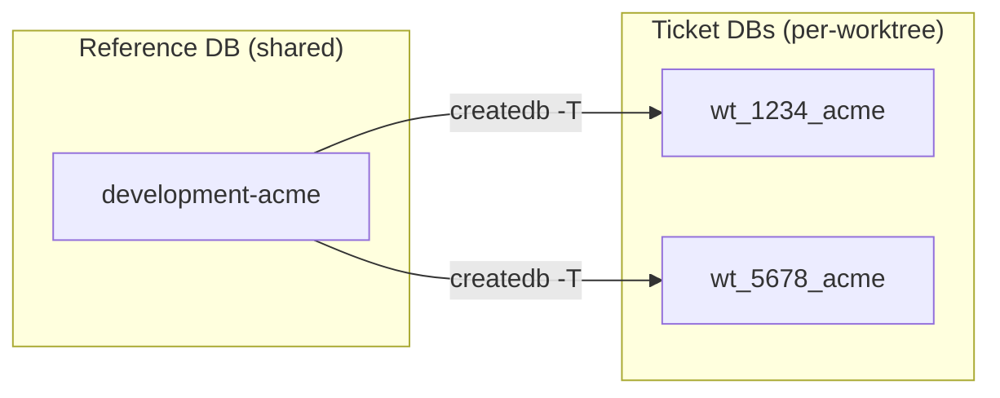
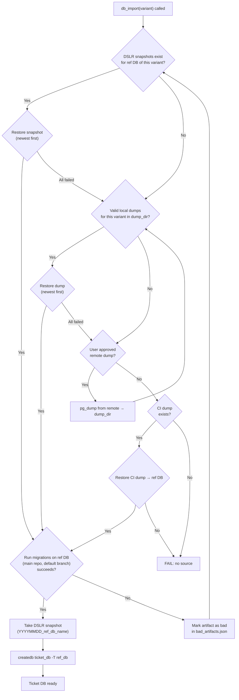
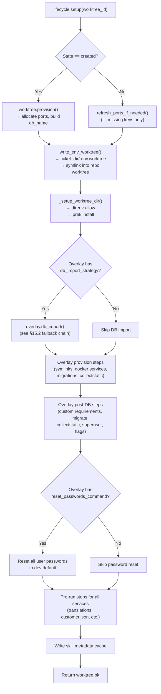
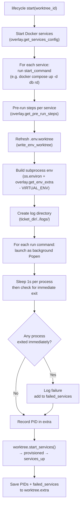
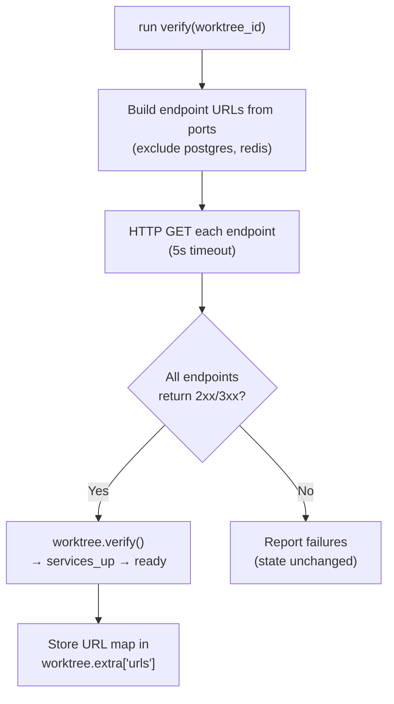
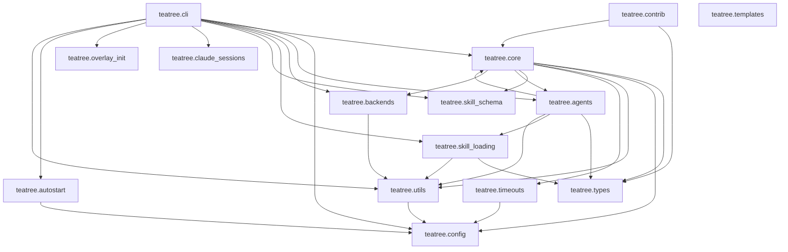

# TeaTree Blueprint

The product spec. Code is an artifact; this file is the product.

If the entire `src/` and `tests/` tree were deleted, this document alone — plus the skills in `skills/` — should be enough to regenerate the project without ambiguity.

**Change policy:** Every code change to teatree must be reflected here. Before modifying this file, always ask the user for approval — this is the source of truth and the user validates every change.

---

## 1. What TeaTree Is

A multi-repo worktree lifecycle manager for AI-assisted development. It manages the full lifecycle of a development ticket: from intake through coding, testing, review, shipping, and delivery — coordinating across multiple repositories, worktrees, and agent sessions.

**Target:** service-oriented projects with databases and CI pipelines (any language). Not for docs-only repos or CLI tools.

**Core principle:** Infrastructure is deterministic code; development work is skill-guided. State management, port allocation, provisioning, and task routing are Python code with >90% branch coverage. The actual development — coding with TDD, debugging, reviewing, shipping — is driven by skills that encode methodology, guardrails, and domain knowledge.

---

## 2. Architecture Decision: Code-First, Not Skills-First

TeaTree was originally built as a skills-first system where SKILL.md files drove behavior and the CLI dispatched to skills based on intent detection. That architecture was replaced because:

1. **Skills are prose, not code.** Prose produces different results depending on the model, context pressure, and what else is loaded. Python code handles edge cases correctly every time.
2. **Coordination through JSON files is fragile.** Three independent state machines stored in JSON with no transactional guarantees. Django FSM provides atomic transitions.
3. **Prose can't be tested deterministically.** The old architecture's core logic lived in SKILL.md. You can't enforce 100% branch coverage on markdown.
4. **Extension points exploded.** 30+ thin functions with a 3-layer priority system, when only one downstream project existed. One ABC with a handful of methods is simpler and sufficient.

**Current split:**

- **Deterministic code** (Django app): state machines, port allocation, provisioning, task routing, dashboard, sync, CLI
- **Agent skills** (SKILL.md files): development methodology, guardrails, and domain knowledge — TDD discipline, debugging process, review checklists, retro learning, verification rules, coding standards. Skills drive the actual work; they use the CLI for infrastructure.

---

## 3. Package Structure

```
Package name: teatree (double-e)
Repo/CLI name: teatree / t3
Python: >=3.13
License: MIT
Build: uv
Entry point: t3 = teatree.cli:main
```

```
src/teatree/
  __init__.py
  cli/                 # Typer CLI package — bootstrap commands (no Django needed)
  config.py             # ~/.teatree.toml parsing, overlay discovery
  skill_map.py          # Phase → companion skills delegation map
  dev_settings.py       # Development Django settings
  autostart.py          # Platform-native daemon management (launchd/systemd)

  core/                 # Django app: the heart of teatree
    apps.py             # AppConfig with auto-admin registration
    models/             # 5 FSM models (see §4)
    managers.py         # Custom QuerySet managers
    selectors.py        # Dashboard data selectors (no domain logic in views)
    overlay.py          # OverlayBase ABC (see §6)
    overlay_loader.py   # Settings-driven overlay instantiation
    sync.py             # GitLab MR sync and ticket upsert
    tasks.py            # django-tasks integration
    docgen.py           # Overlay/skill documentation generation
    urls.py             # URL routing
    admin.py            # Auto-registered admin
    management/commands/ # django-typer commands (see §8)
      lifecycle.py      # Worktree provisioning
      workspace.py      # Workspace operations
      db.py             # Database operations
      run.py            # Service runner
      followup.py       # GitLab sync and notifications
      pr.py             # MR creation and validation
      tasks.py          # Task claiming and execution
    views/
      dashboard.py      # Dashboard page + HTMX panel refresh
      sse.py            # SSE endpoint for real-time dashboard updates
      launch.py         # Task launch (headless execute / interactive ttyd)
      actions.py        # Task cancel, ticket task creation
      history.py        # Session history endpoint
    templates/teatree/  # HTMX dashboard templates
      dashboard.html
      partials/         # One partial per dashboard panel

  agents/               # Agent execution runtime
    headless.py         # Headless SDK execution via `claude -p`
    web_terminal.py     # Interactive execution via ttyd
    prompt.py           # System context and task prompt builders
    skill_bundle.py     # Skill dependency resolution for agent launch
    result_schema.py    # JSON schema for structured agent output
    sdk.py              # SDK runtime adapter registry
    terminal.py         # Interactive runtime adapter
    services.py         # Runtime registry, settings readers

  backends/             # Pluggable external service integrations
    protocols.py        # Protocol classes (see §7)
    loader.py           # Settings-driven backend loader with lru_cache
    gitlab.py           # GitLab API client (httpx)
    gitlab_ci.py        # GitLab CI pipeline operations
    slack.py            # Slack notifications
    notion.py           # Notion integration
    sentry.py           # Sentry error tracking

  utils/                # Pure utility modules
    (git helpers, port allocation, subprocess wrappers)

  overlay_init/         # t3 startoverlay helpers
    generator.py        # Scaffold generation logic (called from cli/)

.claude-plugin/         # Plugin manifest
  plugin.json           # Plugin identity (name: t3)
  marketplace.json      # Self-hosted marketplace
agents/                 # Sub-agent definitions (orchestrator + 6 phase agents)
skills/*/               # Workflow skills (SKILL.md + references/)
hooks/                  # Plugin hooks
  hooks.json            # Event → script mapping
  scripts/              # Hook scripts (bootstrap, skill loading, statusline)
apm.yml                 # APM package manifest
settings.json           # Plugin settings (statusline)
tests/                  # Pytest suite (>90% branch coverage)
e2e/                    # Playwright E2E tests for dashboard
scripts/                # Standalone utility scripts
```

---

## 4. Domain Models

Five models in `teatree.core.models/` (split into domain-specific modules), all using `django-fsm` for state machines.

**No FSM signals for external sync.** django-fsm-2 provides `post_transition` signals that could auto-update external systems (GitLab labels, Notion statuses) on every state change. We deliberately don't use them — external sync is the caller's responsibility, not the state machine's. This keeps FSM transitions fast, testable, and free of side-channel I/O.

### 4.1 Ticket — Core delivery entity

The central entity. One ticket per unit of work (maps to an issue/task in the tracker).

**States:** `not_started` → `scoped` → `started` → `coded` → `tested` → `reviewed` → `shipped` → `in_review` → `merged` → `delivered`

**Fields:**

| Field | Type | Purpose |
|-------|------|---------|
| `issue_url` | URLField(500) | Link to tracker issue (blank for manual tickets) |
| `overlay` | CharField(255) | Overlay name (entry point name from `teatree.overlays`) |
| `variant` | CharField(100) | Tenant/variant identifier (e.g., "acme") |
| `repos` | JSONField(list) | Repository names involved |
| `state` | FSMField | Current lifecycle state |
| `extra` | JSONField(dict) | Extensible metadata (MRs, labels, test results) |

**Transitions:**

| Method | Source → Target | Side effects |
|--------|----------------|--------------|
| `scope(issue_url=, variant=, repos=)` | not_started → scoped | Sets issue_url, variant, repos |
| `start()` | scoped → started | — |
| `code()` | started → coded | — |
| `test(passed=True)` | coded → tested | Stores `tests_passed` in extra; calls `schedule_review()` |
| `review()` | tested → reviewed | Condition: reviewing task completed. Calls `schedule_shipping()` |
| `ship(mr_urls=[])` | reviewed → shipped | Stores MR URLs in extra |
| `request_review()` | shipped → in_review | — |
| `mark_merged()` | in_review → merged | — |
| `mark_delivered()` | merged → delivered | — |
| `rework()` | coded/tested/reviewed → started | Clears tests_passed, cancels pending tasks |

**Auto-scheduling:** `test()` auto-creates a headless reviewing task. `review()` auto-creates a headless shipping task. Both use fresh sessions (bias-free evaluation).

**`extra` structure:**

```python
{
    "tests_passed": bool,
    "mr_urls": ["..."],
    "mrs": {
        "<mr_iid>": {
            "url": str, "title": str, "branch": str, "draft": bool,
            "repo": str, "iid": int,
            "pipeline_status": str, "pipeline_url": str,
            "approvals": {"required": int, "count": int},
            "discussions": [{"status": str, "detail": str}],
            "review_requested": bool, "reviewer_names": [str],
        }
    },
    "issue_title": str,
    "labels": [str],
    "tracker_status": str,  # Inferred from "Process::" labels
}
```

**Property:** `ticket_number` extracts numeric ID from `issue_url` tail via regex, falls back to `pk`.

### 4.2 Worktree — Per-repo lifecycle (FK → Ticket)

One worktree per repository per ticket.

**States:** `created` → `provisioned` → `services_up` → `ready`

**Fields:**

| Field | Type | Purpose |
|-------|------|---------|
| `ticket` | FK(Ticket) | Parent ticket |
| `overlay` | CharField(255) | Overlay name (entry point name from `teatree.overlays`) |
| `repo_path` | CharField(500) | Filesystem path to the worktree |
| `branch` | CharField(255) | Git branch name |
| `state` | FSMField | Current lifecycle state |
| `db_name` | CharField(255) | Database name |
| `extra` | JSONField(dict) | Extensible metadata |

**Transitions:**

| Method | Source → Target | Side effects |
|--------|----------------|--------------|
| `provision()` | created → provisioned | Builds db_name |
| `start_services(services=[])` | provisioned → services_up | Stores service list in extra |
| `verify()` | services_up → ready | Builds URL map in extra |
| `db_refresh()` | provisioned/services_up/ready → provisioned | Stores timestamp |
| `teardown()` | * → created | Clears db_name, extra |

**Port allocation (Non-Negotiable — see §17):** Ports are NEVER stored in the database or in `.env.worktree` files. They are allocated fresh at `lifecycle start` time via `find_free_ports()` and passed as environment variables to `docker compose`. Discovery uses `docker compose port` at runtime — the running containers are the single source of truth.

- Backend: 8001+
- Frontend: 4201+
- Postgres: 5433+
- Redis: 6379 (shared)

**Database naming:** `wt_{ticket_number}_{variant}` (variant suffix omitted if empty).

### 4.3 Session — Quality gate tracker (FK → Ticket)

Tracks which workflow phases an agent visited within a conversation, to enforce ordering.

**Fields:**

| Field | Type | Purpose |
|-------|------|---------|
| `ticket` | FK(Ticket) | Parent ticket |
| `overlay` | CharField(255) | Overlay name (entry point name from `teatree.overlays`) |
| `visited_phases` | JSONField(list) | Phases visited in order |
| `started_at` | DateTimeField | Auto-set |
| `ended_at` | DateTimeField | Set on manual handoff |
| `agent_id` | CharField(255) | Agent identifier |

**Quality gates (hardcoded):**

```python
_REQUIRED_PHASES = {
    "reviewing": ["testing"],
    "shipping": ["testing", "reviewing"],
    "requesting_review": ["shipping"],
}
```

`check_gate(phase, force=False)` raises `QualityGateError` if required phases haven't been visited. `force=True` bypasses.

### 4.4 Task — Agent work unit (FK → Ticket, Session)

Represents a unit of work for an agent (headless or interactive).

**States:** `pending` → `claimed` → `completed` / `failed`

**Fields:**

| Field | Type | Purpose |
|-------|------|---------|
| `ticket` | FK(Ticket) | Parent ticket |
| `session` | FK(Session) | Parent session |
| `parent_task` | FK(self, null) | For interactive followups |
| `phase` | CharField(64) | Workflow phase (reviewing, shipping, etc.) |
| `execution_target` | CharField(32) | "headless" or "interactive" |
| `execution_reason` | TextField | Why this task exists |
| `status` | FSMField | pending/claimed/completed/failed |
| `claimed_at` | DateTimeField | When claimed |
| `claimed_by` | CharField(255) | Who claimed it |
| `lease_expires_at` | DateTimeField | Lease expiry for timeout recovery |
| `heartbeat_at` | DateTimeField | Last heartbeat |
| `result_artifact_path` | CharField(500) | Path to result artifact |

**Claiming:** `claim(claimed_by, lease_seconds=300)` uses `select_for_update()` for atomic distributed locking. Raises `InvalidTransitionError` if already claimed with a valid lease.

**Completion flow:** `complete()` → clears claim → calls `_advance_ticket()`:

- If last attempt has `needs_user_input: true`: creates interactive followup task (same phase, parent_task linked, session carries the `agent_session_id` for resume)
- If phase is "reviewing" and ticket is TESTED: calls `ticket.review()`
- If phase is "shipping" and ticket is REVIEWED: calls `ticket.ship()`

**Session resume:** Both headless and interactive runners walk the `parent_task` chain to find a previous `agent_session_id`. When found, the CLI is invoked with `--resume <session_id>` to preserve full conversation context across execution mode switches.

**Convenience:** `complete_with_attempt()` creates a TaskAttempt and calls complete/fail based on exit_code.

**Routing:** `route_to_headless(reason=)` and `route_to_interactive(reason=)` change execution_target and reset to PENDING.

### 4.5 TaskAttempt — Execution history (FK → Task)

Records each execution attempt for audit trail.

**Fields:**

| Field | Type | Purpose |
|-------|------|---------|
| `task` | FK(Task) | Parent task |
| `started_at` | DateTimeField | Auto-set |
| `ended_at` | DateTimeField | When execution finished |
| `execution_target` | CharField(32) | headless/interactive |
| `error` | TextField | Error message if failed |
| `exit_code` | IntegerField | 0=success, non-zero=failure |
| `artifact_path` | CharField(500) | Path to output artifact |
| `result` | JSONField(dict) | Structured result (see §5) |
| `launch_url` | URLField(500) | For interactive tasks (ttyd URL) |
| `agent_session_id` | CharField(255) | Agent session ID for continuity |

---

## 5. Agent Execution

### 5.1 Structured Result Schema

Agents return JSON matching `AgentResult`:

```python
{
    "summary": str,              # One-line summary
    "files_modified": [{         # Files changed
        "path": str,
        "action": "created"|"modified"|"deleted",
        "lines_added": int,
        "lines_removed": int,
    }],
    "tests_run": [{              # Test results
        "name": str,
        "passed": bool,
        "duration_seconds": float,
        "error": str,
    }],
    "tests_passed": int,
    "tests_failed": int,
    "decisions": [str],          # Design decisions made
    "needs_user_input": bool,    # Triggers interactive followup
    "user_input_reason": str,    # Why human input is needed
    "next_steps": [str],         # Suggested follow-up actions
    "commands_executed": [str],  # Shell commands run
}
```

Schema enforces `additionalProperties: false`. Validation is done without jsonschema library (minimal dependency).

### 5.2 Headless Execution (headless.py)

Runs `claude -p <prompt> --append-system-prompt <context> --output-format json`.

**Flow:**

1. Resolve skill bundle for the task's phase
2. Build task prompt (ticket context, MR metadata, work instructions)
3. Build system context (task ID, skills to load, phase-specific instructions)
4. Execute subprocess, capture stdout/stderr
5. Parse JSON result: `_parse_cli_envelope()` extracts `{session_id, result}` from Claude CLI output
6. `_parse_result()` searches reversed output lines for first `{` (allows progress text before final JSON)
7. Validate result against schema
8. Create TaskAttempt with result, exit_code, agent_session_id
9. Call `task.complete()` which triggers automatic ticket advancement

**When `TEATREE_SDK_USE_CLI = True`:** Uses `claude` binary (no API key needed, uses Claude Code session auth).

### 5.3 Interactive Execution (web_terminal.py)

Launches ttyd (browser-based terminal) wrapping `claude --append-system-prompt <context>`.

**Requirements:** ttyd must be installed (`brew install ttyd`) and spawned with `--writable`.

**Flow:** POST `/tasks/<id>/launch/` → ttyd process started → returns `{"launch_url": "http://localhost:<port>"}` → dashboard opens in new tab.

### 5.4 Prompt Building (prompt.py)

**`build_task_prompt(task)`** — Work instructions for the agent:

- Ticket context: number, issue URL, title, labels, phase, execution reason
- MR context: open MRs with URL, title, draft status, pipeline status
- Instructions: check progress → identify remaining work → proceed → request input if blocked → run tests

**`build_system_context(task, skills=[])`** — System prompt for headless agents:

- Task/ticket identifiers, skill loading directives
- Phase-specific instructions (reviewing: thorough code review + /t3:next)
- Mandatory post-execution: run /t3:next for retro + structured result + pipeline handoff
- Fallback JSON schema if /t3:next not available

**`build_interactive_context(task, skills=[])`** — System prompt for interactive sessions:

- Same content as system context, plus user-aware instructions
- **First-message acknowledgement (mandatory):** The agent must begin by stating the project, ticket, current state, and planned next steps
- "Before ending, run /t3:next"

### 5.5 Skill Bundle Resolution (skill_bundle.py)

Resolves which skills to load for a given phase:

1. Look up phase in skill delegation map (§9)
2. Add overlay's companion skills from `get_skill_metadata()`
3. Parse each skill's `requires:` frontmatter field
4. Topological sort for correct load order
5. Return list of skill paths

### 5.6 Skill Delegation Map (skill_map.py)

Default mapping from phase to companion skills loaded alongside overlay skills:

```python
{
    "coding": ("test-driven-development", "verification-before-completion"),
    "debugging": ("systematic-debugging", "verification-before-completion"),
    "reviewing": ("requesting-code-review", "verification-before-completion"),
    "shipping": ("finishing-a-development-branch", "verification-before-completion"),
    "ticket-intake": ("writing-plans",),
}
```

Can be overridden via a markdown file at `references/skill-delegation.md` with `## phase` sections and `- skill-name` lists.

---

## 6. Overlay System

An overlay is a downstream Django project that customizes teatree for a specific project/organization.

### 6.0 Overlay Thinness Principle (Non-Negotiable)

**Overlays must be as thin as possible.** Generic workflow logic belongs in teatree core, not in overlays.

Before adding logic to an overlay, ask: "Would a different project using the same framework (Django, Node, etc.) need the same logic?" If yes, it belongs in core — parameterized and configurable. The overlay should only provide:

1. **Configuration values** — repo names, env vars, credentials, file paths, naming conventions
2. **Project-specific glue** — connecting to a proprietary API, custom tenant detection, product-specific feature flags
3. **Truly unique workflows** — steps that no other project would ever need

Everything else — DB provisioning strategies, migration runners, symlink management, service orchestration, dump fallback chains — must be implemented as configurable engines in core. The overlay configures the engine; the overlay does not reimplement the engine.

**Why this matters:** When logic lives in an overlay, it is tested only by that overlay's test suite, invisible to other overlays, and duplicated when a second project needs the same workflow. Core code has >90% branch coverage, is reviewed against the BLUEPRINT, and benefits all overlays.

**Refactoring signal:** If an overlay method exceeds ~30 lines of non-configuration code, it likely contains generic logic that should be extracted to core.

### 6.1 OverlayBase ABC

Defined in `teatree.core.overlay`. All methods receive the `worktree` instance for context.

**Abstract methods (must implement):**

| Method | Signature | Purpose |
|--------|-----------|---------|
| `get_repos()` | `→ list[str]` | Declare repositories for provisioning |
| `get_provision_steps(worktree)` | `→ list[ProvisionStep]` | Ordered setup steps |

**Optional methods (override as needed):**

| Method | Signature | Default | Purpose |
|--------|-----------|---------|---------|
| `get_env_extra(worktree)` | `→ dict[str, str]` | `{}` | Extra environment variables |
| `get_run_commands(worktree)` | `→ dict[str, str]` | `{}` | Named service run commands |
| `get_test_command(worktree)` | `→ str` | `""` | Test suite command |
| `get_db_import_strategy(worktree)` | `→ DbImportStrategy \| None` | `None` | DB provisioning strategy |
| `get_post_db_steps(worktree)` | `→ list[PostDbStep]` | `[]` | Post-DB-setup callbacks |
| `get_reset_passwords_command(worktree)` | `→ str` | `""` | Dev password reset command |
| `get_symlinks(worktree)` | `→ list[SymlinkSpec]` | `[]` | Extra symlinks |
| `get_services_config(worktree)` | `→ dict[str, ServiceSpec]` | `{}` | Service metadata |
| `validate_mr(title, description)` | `→ ValidationResult` | no errors | MR validation rules |
| `get_followup_repos()` | `→ list[str]` | `[]` | GitLab project paths to sync |
| `get_skill_metadata()` | `→ SkillMetadata` | `{}` | Active skill path + companions |
| `get_ci_project_path()` | `→ str` | `""` | GitLab project path for CI |
| `get_e2e_config()` | `→ dict[str, str]` | `{}` | E2E trigger config |
| `detect_variant()` | `→ str` | `""` | Tenant detection |
| `get_workspace_repos()` | `→ list[str]` | `get_repos()` | Repos for workspace ticket creation |
| `get_tool_commands()` | `→ list[ToolCommand]` | `[]` | Overlay-specific CLI tools |

### 6.2 Supporting TypedDicts

```python
ProvisionStep(name: str, callable: Callable[[], None], required: bool = True, description: str = "")
PostDbStep(name: str, description: str, command: str)           # all total=False
SymlinkSpec(path: str, source: str, mode: str, description: str)
ServiceSpec(shared: bool, service: str, compose_file: str, start_command: str, readiness_check: str)
DbImportStrategy(kind: str, source_database: str, shared_postgres: bool, snapshot_tool: str, restore_order: list[str], notes: list[str], worktree_repo_path: str)
SkillMetadata(skill_path: str, companion_skills: list[str])
ValidationResult(errors: list[str], warnings: list[str])       # total=True
ToolCommand(name: str, help: str, command: str)                # total=True
```

### 6.3 Scaffold (`t3 startoverlay`)

`t3 startoverlay <name> <dest>` generates a lightweight overlay package. Default overlay app name is `t3_overlay` (the `t3_` prefix is a convention). The skill directory is derived: `t3_overlay` → skill `overlay` (strip `t3_` prefix and `_overlay` suffix, then `t3-` prefix).

Generated structure:

```
<name>/
  src/t3_overlay/__init__.py, overlay.py, apps.py
  skills/overlay/SKILL.md
  pyproject.toml, .editorconfig, .pre-commit-config.yaml, ...
```

No manage.py, settings.py, urls.py, or wsgi/asgi — teatree is the Django project.

### 6.4 Discovery & Loading

**User-level discovery** (`config.py`):

1. `~/.teatree.toml` `[overlays.<name>]` sections (reads `path`, extracts `DJANGO_SETTINGS_MODULE` from `manage.py`)
2. `teatree.overlays` entry-point group from installed packages
3. Toml wins on name conflicts

**Active overlay selection** (`discover_active_overlay()`):

1. Priority 1: `manage.py` in cwd ancestors (developer working inside project)
2. Priority 2: Single installed overlay (exactly one exists)
3. Returns None if ambiguous

**Django-level loading** (`overlay_loader.py`):

- Discovers overlays via `importlib.metadata.entry_points(group="teatree.overlays")`
- Each entry point name is the overlay name; the value is an overlay class path (e.g., `"myapp.overlay:MyOverlay"`)
- Validates each class is a subclass of `OverlayBase`, then instantiates it
- Supports multiple overlays: `get_overlay(name)` returns one by name (or the sole overlay if only one exists), `get_all_overlays()` returns all as a `dict[str, OverlayBase]`
- Cached via `lru_cache(maxsize=1)` on `_discover_overlays()`, resettable via `reset_overlay_cache()`
- No Django settings involved — no `TEATREE_OVERLAY_CLASS`, no `import_string()`

---

## 7. Backend Protocols

Each external concern is a `@runtime_checkable Protocol` in `teatree.backends.protocols`.

| Protocol | Methods |
|----------|---------|
| `CodeHost` | `create_pr()`, `list_open_prs()`, `post_mr_note()` |
| `CIService` | `cancel_pipelines()`, `fetch_pipeline_errors()`, `fetch_failed_tests()`, `trigger_pipeline()`, `quality_check()` |
| `IssueTracker` | `get_issue()` |
| `ChatNotifier` | `send()` |
| `ErrorTracker` | `get_top_issues()` |

**Loading** (`loader.py`): Each backend has a `get_<concern>()` function decorated with `@lru_cache(maxsize=1)`. These functions auto-configure from overlay methods — e.g., `get_code_host()` calls `get_overlay()` and checks `overlay.get_gitlab_token()` to decide whether to instantiate `GitLabCodeHost`. No `TEATREE_*` settings or `import_string()` involved.

**Auto-detection:** `get_code_host()` and `get_ci_service()` auto-instantiate the GitLab implementations when `overlay.get_gitlab_token()` returns a non-empty value.

**Cache reset:** `reset_backend_caches()` clears all lru_cache entries (used in testing).

---

## 8. Three-Tier Command Split

| Tier | Tool | Needs Django? | Examples |
|------|------|---------------|----------|
| Runtime commands | django-typer management commands | Yes | `lifecycle setup`, `tasks work-next-sdk`, `followup refresh` |
| Bootstrap commands | Typer CLI (`t3`) | No | `t3 startoverlay`, `t3 info`, `t3 ci cancel` |
| Overlay commands | Typer CLI delegating to manage.py | Via subprocess | `t3 acme start-ticket`, `t3 acme dashboard` |
| Internal utilities | Python modules in `utils/` | No | Port allocation, git helpers, DB ops |

### 8.1 Management Commands (django-typer)

**lifecycle** — Worktree provisioning:

- `setup(ticket_id, repo_path, branch)` → creates Worktree, calls `provision()`, runs overlay provision_steps
- `start(worktree_id)` → calls `start_services()`
- `status(worktree_id)` → returns state dict
- `teardown(worktree_id)` → calls `teardown()`
- `clean(worktree_id)` → full teardown + state cleanup
- `diagram(model="worktree"|"ticket"|"task")` → Mermaid state diagram from FSM transitions

**tasks** — Task routing and execution:

- `claim(execution_target, claimed_by, lease_seconds=120)` → claims next pending task
- `work-next-sdk(claimed_by)` → executes headless task via `claude -p`
- `work-next-user-input(claimed_by)` → creates interactive ttyd session

**followup** — GitLab sync:

- `refresh()` → counts pending tasks and tickets
- `remind(channel)` → sends reminders
- `sync()` → calls `sync_followup()` to create/update tickets from MRs
- `discover-mrs()` → discover open MRs awaiting review

**workspace** — Workspace operations
**db** — Database operations
**run** — Service runner
**pr** — MR creation and validation

### 8.2 Global CLI Commands (`t3`)

Typer-based, work without Django:

- `t3 startoverlay` — scaffold a new overlay package (see §6.3)
- `t3 agent` — launch Claude Code with teatree context (for developing teatree itself)
- `t3 info` — show entry point, sources, editable status
- `t3 sessions` — list/resume Claude conversation sessions
- `t3 overlays` — list discovered overlays
- `t3 docs` — serve mkdocs documentation (requires `docs` dependency group)
- `t3 ci {cancel,divergence,fetch-errors,fetch-failed-tests,trigger-e2e,quality-check}` — CI helpers
- `t3 review {post-draft-note,delete-draft-note,list-draft-notes}` — GitLab draft notes
- `t3 review-request discover` — discover open MRs
- `t3 tool {privacy-scan,analyze-video,bump-deps}` — standalone utilities
- `t3 config write-skill-cache` — write overlay skill metadata to cache
- `t3 doctor {check,repair}` — health checks and symlink repair

### 8.3 Overlay Commands (`t3 <overlay> ...`)

Each registered overlay gets a subcommand group (e.g., `t3 acme`). Commands delegate to `manage.py` via subprocess — the overlay's Django settings are used automatically.

**Shortcuts:**

- `t3 <overlay> start-ticket <URL>` — create ticket, provision, start services
- `t3 <overlay> ship <ID>` — create MR for a ticket
- `t3 <overlay> daily` — sync MRs, check gates, remind reviewers
- `t3 <overlay> full-status` — ticket/worktree/session summary
- `t3 <overlay> agent [TASK]` — launch Claude Code with overlay context
- `t3 dashboard [--project PATH]` — start dashboard via uvicorn (use `--project` to serve from a worktree)
- `t3 <overlay> resetdb` — drop and recreate SQLite database
- `t3 <overlay> worker` — start background task workers

**Management command groups** (each exposed as a sub-typer):

`lifecycle`, `workspace`, `run`, `db`, `pr`, `tasks`, `followup` — see §8.1 for details.

---

## 9. Dashboard

Selector-backed views with django-htmx. **No domain logic in views** — all data aggregation lives in `selectors.py`.

### 9.1 Endpoints

| Endpoint | Method | Purpose |
|----------|--------|---------|
| `GET /` | — | Full dashboard page |
| `GET /dashboard/events/` | SSE | Server-Sent Events stream for real-time updates |
| `GET /dashboard/panels/<panel>/` | HTMX | Panel refresh (requires HX-Request header) |
| `POST /dashboard/sync/` | — | Trigger followup sync |
| `POST /tasks/<id>/launch/` | — | Claim + execute (headless) or launch ttyd (interactive) |
| `POST /tasks/<id>/cancel/` | — | Cancel task (sets to FAILED) |
| `POST /tickets/<id>/create-task/` | — | Create headless or interactive task |
| `GET /sessions/<id>/history/` | HTMX | Session history |

### 9.2 Real-Time Updates (SSE)

The dashboard uses Server-Sent Events for push-based updates instead of blind polling. Zero additional dependencies — built on Django's async `StreamingHttpResponse`.

**Architecture:**

1. `DashboardSSEView` (async view in `views/sse.py`) opens a persistent HTTP connection
2. Server polls the SQLite database file's `mtime` every 2 seconds
3. When the file changes, it emits named SSE events for all panels (e.g., `event: summary`, `event: sessions`)
4. The HTMX SSE extension (`htmx-ext-sse`) on the client listens to these events and triggers panel `hx-get` refreshes
5. A comment-based heartbeat (`: heartbeat\n\n`) is sent every ~16 seconds of inactivity to keep the connection alive

**Fallback:** Each panel retains a long-interval polling trigger (60–600s) as fallback if SSE disconnects. The HTMX SSE extension handles automatic reconnection with exponential backoff.

**Connection status:** A small status dot next to "TeaTree Runtime" reflects SSE state (green = connected, red/pulsing = reconnecting, gray = disconnected) via `htmx:sseOpen`, `htmx:sseError`, and `htmx:sseClose` events.

**ASGI requirement:** SSE requires an ASGI server (uvicorn) to stream async generators. The `t3 <overlay> dashboard` CLI launches uvicorn instead of `manage.py runserver`. The `_uvicorn()` helper derives the ASGI module from `DJANGO_SETTINGS_MODULE` and launches with `--reload` for file-watching DX.

### 9.3 Panels

| Panel | Selector | Content | SSE Event | Fallback Interval |
|-------|----------|---------|-----------|-------------------|
| summary | `build_dashboard_summary()` | Counter cards | `summary` | 120s |
| automation | `build_automation_summary()` | Headless task stats (running, completed/succeeded/failed 24h) | `automation` | 120s |
| tickets | `build_dashboard_ticket_rows()` | In-flight tickets table | `tickets` | 600s |
| worktrees | — | Active worktrees with state and ports | `worktrees` | 600s |
| headless_queue | `build_headless_queue()` | Pending headless tasks | `headless_queue` | 600s |
| queue | `build_interactive_queue()` | Pending interactive tasks | `queue` | 600s |
| sessions | `build_active_sessions()` | Running Claude processes | `sessions` | 60s |
| activity | `build_recent_activity()` | Recent task completions/failures | `activity` | 120s |

---

## 10. Code Host Sync (sync.py)

`sync_followup()` → `SyncResult`:

Runs all configured backends and merges results via `_merge_results()`. When both GitHub and GitLab tokens are present, both syncs run.

**GitHub path** (`_sync_github`): fetches items from a GitHub Projects v2 board and upserts tickets by issue URL.

**GitLab path** (`_sync_gitlab`):

1. Creates GitLab API client from `overlay.config.get_gitlab_token()`
2. Fetches all open MRs for the current user (incremental via cached `updated_after` timestamp)
3. For each MR: `_upsert_ticket_from_mr()`:
   - Extracts `issue_url` from MR description/title via regex
   - Enriches non-draft MRs with pipeline status, approvals, discussions
   - Infers ticket state from MR data via `_infer_state_from_mrs()`
   - Upserts ticket by issue_url (or web_url if no issue linked)
4. `_fetch_issue_labels()`: fetches issue details from GitLab work items, stores `tracker_status` (from `Process::` labels or Status widget) and `issue_title`
5. `_detect_merged_mrs()`: finds recently merged MRs and advances matching tickets to `merged`
6. Returns `SyncResult(mrs_found, tickets_created, tickets_updated, labels_fetched, mrs_merged, errors)`

**State inference:** `_infer_state_from_mrs()` derives a minimum ticket state from MR metadata, bypassing FSM transitions (which have side effects like task creation). On creation, the inferred state becomes the default. On update, the ticket advances forward only — never regresses.

| MR data | Inferred state |
|---------|---------------|
| Draft MR | `started` |
| Non-draft MR | `shipped` |
| Non-draft + review requested or approvals > 0 | `in_review` |

Multiple MRs: the highest inferred state wins.

**Discussion classification:** `_classify_discussions()` categorizes MR threads as `waiting_reviewer` (last comment is mine), `needs_reply` (last comment is theirs), or `addressed` (all resolved).

---

## 11. Configuration

### 11.1 ~/.teatree.toml

```toml
[teatree]
workspace_dir = "~/workspace"
branch_prefix = ""
privacy = "strict"

[overlays.myproject]
path = "~/workspace/myproject"
```

### 11.2 Django Settings (framework-level, in teatree's settings.py)

| Setting | Type | Purpose |
|---------|------|---------|
| `TEATREE_HEADLESS_RUNTIME` | str | Runtime for headless tasks (default: "claude-code") |
| `TEATREE_INTERACTIVE_RUNTIME` | str | Runtime for interactive tasks (default: "codex") |
| `TEATREE_TERMINAL_MODE` | str | Terminal strategy (default: "same-terminal") |
| `TEATREE_SDK_USE_CLI` | bool | Use `claude` binary instead of API (default: True) |
| `TEATREE_CLAUDE_STATUSLINE_STATE_DIR` | str | Directory for Claude statusline state files |
| `TEATREE_AGENT_HANDOVER` | list | Agent handover configuration |
| `TEATREE_EDITABLE` | bool | Declare teatree is editable (verified by `t3 doctor check`) |
| `OVERLAY_EDITABLE` | bool | Declare overlay is editable (verified by `t3 doctor check`) |

### 11.2.1 OverlayBase Config Methods (replaces per-overlay Django settings)

Overlay-specific configuration that previously lived in `TEATREE_*` Django settings now lives on `OverlayBase` methods. Backends auto-configure from these methods (see section 7).

| Method | Return type | Default | Replaces |
|--------|-------------|---------|----------|
| `get_gitlab_token()` | `str` | `""` | `TEATREE_GITLAB_TOKEN` |
| `gitlab_url` | `str` | `"https://gitlab.com/api/v4"` | — |
| `get_gitlab_username()` | `str` | `""` | `TEATREE_GITLAB_USERNAME` |
| `get_slack_token()` | `str` | `""` | `TEATREE_SLACK_TOKEN` |
| `get_review_channel()` | `tuple[str, str]` | `("", "")` | `TEATREE_REVIEW_CHANNEL` + `TEATREE_REVIEW_CHANNEL_ID` |
| `known_variants` | `list[str]` | `[]` | `TEATREE_KNOWN_VARIANTS` |
| `mr_auto_labels` | `list[str]` | `[]` | `TEATREE_MR_AUTO_LABELS` |
| `frontend_repos` | `list[str]` | `[]` | `TEATREE_FRONTEND_REPOS` |
| `dev_env_url` | `str` | `""` | `TEATREE_DEV_ENV_URL` |
| `dashboard_logo` | `str` | `""` | `TEATREE_DASHBOARD_LOGO` |

### 11.3 Logging

`default_logging(namespace)` in `config.py` returns a Django `LOGGING` dict writing to `~/.local/share/teatree/<namespace>/logs/dashboard.log` with rotation (5MB, 3 backups).

### 11.4 Data Storage

`~/.local/share/teatree/<namespace>/` — namespaced data directories created by `get_data_dir()`.

---

## 12. Skills & Plugin Architecture

### 12.1 Skills

Skills live in `skills/*/`. Each skill is a `SKILL.md` file with optional `references/` directory. When installed as a plugin, skills are namespaced under `t3:` (e.g., `/t3:code`).

**Skills drive the development work — coding methodology, debugging process, review standards, retro learning. The CLI handles infrastructure (worktrees, databases, ports, CI).**

| Skill | Purpose |
|-------|---------|
| `code` | TDD methodology, coding guidelines |
| `contribute` | Push improvements to fork, open upstream issues |
| `debug` | Troubleshooting and fixing |
| `followup` | Daily follow-up, batch tickets, MR reminders |
| `handover` | Transfer in-flight tasks to another runtime |
| `next` | Session wrap-up: retro, structured result, pipeline handoff |
| `platforms` | Platform-specific API recipes (GitLab, GitHub, Slack) |
| `retro` | Conversation retrospective and skill improvement |
| `review` | Code review (self, giving, receiving) |
| `review-request` | Batch review requests |
| `rules` | Cross-cutting agent safety rules |
| `setup` | Bootstrap and validate teatree for local use |
| `ship` | Committing, pushing, MR creation, pipeline |
| `test` | Testing, QA, CI |
| `ticket` | Ticket intake and kickoff |
| `workspace` | Worktree creation, setup, servers, cleanup |

Skills declare dependencies via `requires:` in YAML frontmatter. The skill bundle resolver performs topological sort for correct load order. Skills can also declare `companions:` — optional dependencies that are included when available but only warn (not fail) when missing.

#### Third-Party Skill Integration

Teatree integrates with third-party skill frameworks (notably [superpowers](https://github.com/obra/superpowers)) via the `companions:` mechanism and APM dependency management. The approach is:

- **Absorb, don't delegate.** When a third-party skill covers a universal concern (skill-loading discipline, verification before completion), the best content is distilled into teatree's own `rules` skill — which is always loaded via `requires:`. This avoids context waste from loading both teatree and third-party versions of the same guidance.
- **Companion for domain skills.** Third-party skills that cover specific domains (TDD methodology, plan execution, brainstorming) are declared as `companions:` on the relevant lifecycle skill. They load alongside teatree skills when installed, adding depth without duplication.
- **Exclude conflicting skills.** Skills that duplicate teatree's core infrastructure (worktree management, skill loading) are excluded during `t3 setup` via `CORE_EXCLUDED_SKILLS`. This prevents conflicting instructions — teatree's `t3 workspace` subsystem replaces generic worktree skills entirely.

Attribution: the `rules` skill's "Invoke Skills Before ANY Response" and "Verification Before Completion" sections are adapted from superpowers' `using-superpowers` and `verification-before-completion` skills respectively.

### 12.2 Sub-Agent Architecture

Seven agent definitions in `agents/`. Each is a thin YAML+description wrapper that references skills via `skills:` frontmatter — no content duplication.

| Agent | Skills | Role |
|-------|--------|------|
| `orchestrator` | rules, workspace | Routes tasks to phase-specific agents |
| `coder` | rules, workspace, code | Implements features with TDD |
| `tester` | rules, workspace, test, platforms | Runs tests, analyzes CI |
| `reviewer` | rules, platforms, review, code | Read-only code review |
| `shipper` | rules, workspace, platforms, ship, review-request | Delivery workflow |
| `debugger` | rules, workspace, debug | Troubleshooting and fixes |
| `followup` | rules, platforms, followup | Daily MR sync and reminders |

Interactive-only skills (no agent): `retro`, `next`, `contribute`, `handover`, `setup`.

### 12.3 Distribution

Three install paths, one source of truth:

- **APM**: `apm install souliane/teatree` — deploys to any supported agent
- **Claude Code plugin**: `/plugin install t3@souliane-teatree` — Claude-specific
- **CLI-first**: `uv tool install teatree && t3 plugin install` — bootstraps from Python

---

## 13. Testing

### 13.1 Coverage Gate

**>90% branch coverage, non-negotiable.** Enforced by pytest-cov with `fail_under = 93, branch = true`. Omits only migrations.

### 13.2 Django Test Settings

- In-memory SQLite (`:memory:`) for isolation and speed
- `django_tasks.backends.immediate` for synchronous task execution
- `django-htmx` middleware for `request.htmx` attribute

### 13.3 Test Isolation

- `conftest.py` monkeypatches `HOME`, `XDG_CACHE_HOME`, `XDG_CONFIG_HOME`, `XDG_DATA_HOME` to `tmp_path`
- `_strip_git_hook_env()` removes `GIT_*` env vars to prevent index corruption
- Auto-use fixtures: `_clean_registry` (admin), `_no_system_port_checks`, `_isolate_env`
- `reset_overlay_cache()` and `reset_backend_caches()` prevent cross-test contamination

### 13.4 Test Organization

```
tests/
  teatree_core/       # Core model, view, command tests
  teatree_agents/     # Agent execution tests
  teatree_backends/   # Backend integration tests
  test_config.py      # Config/overlay discovery
  test_cli_agent_skills.py  # CLI + skill bundle tests
  test_startproject.py      # Overlay scaffold tests
  test_utils.py       # Utility module tests
```

### 13.5 E2E Tests

Playwright tests in `e2e/` with separate settings (`e2e.settings`) using file-based SQLite. Cover dashboard loading, task launching, panel refresh.

---

## 14. Quality Gates

| Tool | What it checks | Config |
|------|----------------|--------|
| pytest + pytest-cov | >90% branch coverage (`fail_under = 93`) | `pyproject.toml [tool.coverage]` |
| ruff | ALL rules enabled, specific ignores justified | `pyproject.toml [tool.ruff]` |
| ty | Static type checker with `error-on-warning = true` | `pyproject.toml [tool.ty]` |
| import-linter | Dependency boundaries | `pyproject.toml [tool.importlinter]` |
| codespell | Spell check | `pyproject.toml [tool.codespell]` |
| prek | Runs all above on commit | `.pre-commit-config.yaml` |

**Key ruff decisions:**

- ALL rules selected, then specific ignores with justification
- D1xx disabled (no docstrings — self-documenting code)
- `from __future__ import annotations` banned (use native 3.13 syntax)
- Per-file ignores for tests, scripts, management commands, migrations, views, overlay

---

## 15. Django Project Workflows

Teatree provides a generic Django database provisioning engine in `teatree.utils.django_db`. This engine handles the full lifecycle of creating, importing, and maintaining per-worktree databases for Django projects. Overlays configure the engine; they do not reimplement it.

### 15.1 Reference DB Architecture

Teatree uses a **two-tier database pattern** for Django projects:

1. **Reference DB** — a long-lived local database (e.g., `development-acme`) that mirrors the dev/staging environment. Shared across all worktrees for the same variant. Updated infrequently (when a fresh dump is fetched or DSLR snapshot is taken).
2. **Ticket DB** — a per-worktree database (e.g., `wt_1234_acme`) created as a **Postgres template copy** (`createdb -T`) of the reference DB. Instant creation, full isolation.



**Why template copy:** `createdb -T` is a filesystem-level copy inside Postgres — it takes seconds regardless of DB size, versus minutes for a full dump-and-restore. Branch-specific migrations then run only on the ticket DB.

### 15.2 Import Fallback Chain

All operations are **scoped to a single variant** (e.g., `development-acme`). Each variant has its own reference DB, DSLR snapshots, and dump files. Different variants never share database artifacts.

The engine tries multiple sources to populate the reference DB, stopping at the first success:



**Uniform post-restore pipeline:** Every successful restore — whether from DSLR snapshot, local dump, remote dump, or CI dump — goes through the same pipeline: run `manage.py migrate` on the ref DB (bringing it to the current default branch level). If migrations fail, the engine warns the user to delete the bad artifact, then loops back to try the next available source. On success: take a fresh DSLR snapshot (capturing the migrated state), then `createdb -T` template copy to the ticket DB.

**Retry within strategy:** When a snapshot or dump fails (restore error or migration failure), the engine tries older ones for the same variant before falling through to the next strategy. This avoids expensive remote dumps when an older local artifact is still usable.

**Bad artifact tracking:** When an artifact fails (restore or migration), the engine marks it in `~/.local/share/teatree/bad_artifacts.json` and skips it on future runs. DSLR snapshots are keyed as `dslr:<name>`, dump files by absolute path. The engine prints the deletion command for each bad artifact. Cleanup of the actual files is deferred to an interactive task (see GitHub issue).

**Remote dump requires approval:** Fetching a fresh dump from a remote database (strategy 3) is slow and network-dependent. The engine only attempts this when the caller explicitly enables it (e.g., via `--force` or an interactive confirmation). Automated provisioning skips this strategy.

**Strategy details:**

| # | Strategy | Source | Speed | When used |
|---|----------|--------|-------|-----------|
| 1 | DSLR snapshot | Local DSLR store | ~5s + migrate | Default — fastest path after first import |
| 2 | Local dump | `{dump_dir}/*{ref_db}*.pgsql` | ~2min + migrate | After a manual dump download or previous remote fetch |
| 3 | Remote dump | `pg_dump` from dev/staging DB | ~5-15min + migrate | Requires explicit user approval (`allow_remote_dump=True`) |
| 4 | CI dump | `{ci_dump_glob}` in repo | ~2min + migrate | Last resort — often outdated but always available |

After **every** successful restore (including DSLR snapshots), the engine runs the same pipeline:

1. Runs `manage.py migrate` on the reference DB using the **main repo** (default branch) — bringing it to the latest master migration level
2. Takes a fresh DSLR snapshot — capturing the migrated state for instant restores next time
3. Creates the ticket DB via template copy

DSLR snapshots are not exempt from migrations — they may be days old while master has moved forward. Treating snapshots as "just a faster kind of dump" keeps the pipeline uniform and prevents stale-schema bugs.

### 15.3 Migration Retry with Selective Faking

Dev environment dumps often have schema ahead of the recorded `django_migrations` state (migrations applied directly on dev that the branch hasn't caught up with). The engine handles this:

1. Run `manage.py migrate --no-input`
2. If it fails with "already exists" or "does not exist" → extract the failing migration name → `migrate <app> <migration> --fake` → retry
3. If it fails with config errors (`ModuleNotFoundError`, `ImproperlyConfigured`) → abort (environment problem, not data problem)
4. Retry up to 20 times (handles cascading fake-then-retry chains)
5. `--fake` is **never** used for other failure types — those fail loudly

### 15.4 Post-Import Steps

After the ticket DB is created, the overlay's `get_post_db_steps()` run in order. Typical Django post-import steps:

1. **Branch migrations** — `manage.py migrate` on the ticket DB (applies branch-specific migrations on top of the master-level snapshot)
2. **Collectstatic** — `manage.py collectstatic --noinput` for admin assets
3. **Password reset** — reset all user passwords to a known dev value (so you can log in)
4. **Superuser** — ensure a local superuser exists
5. **Seed data** — project-specific feature flags, reference data, etc.

### 15.5 DjangoDbImportConfig (Configuration)

The engine is configured via a `DjangoDbImportConfig` dataclass. Overlays construct this in their `db_import()` method:

```python
@dataclass(frozen=True)
class DjangoDbImportConfig:
    ref_db_name: str                      # e.g., "development-acme"
    ticket_db_name: str                   # e.g., "wt_1234_acme"
    main_repo_path: str                   # path to main repo clone (for migrations)
    dump_dir: str                         # directory containing local dumps
    dump_glob: str                        # glob pattern for dump files, e.g., "*development-acme*.pgsql"
    ci_dump_glob: str                     # glob pattern for CI dumps, e.g., ".gitlab/dump_after_migration.*.sql.gz"
    snapshot_tool: str = "dslr"           # snapshot tool ("dslr" or "")
    remote_db_url: str = ""               # pg_dump source URL (empty = skip remote strategy)
    migrate_env_extra: dict[str, str] = field(default_factory=dict)  # extra env for migrate
    dump_timeout: int = 1800              # pg_dump timeout in seconds
```

**Calling convention:**

```python
django_db_import(cfg, skip_dslr=False, allow_remote_dump=False)
```

- `skip_dslr=True` — skip DSLR snapshots (used with `--force` to get a fresh dump)
- `allow_remote_dump=True` — enable the remote pg_dump strategy (requires explicit user approval)

**Overlay responsibility:** Provide the config values and decide when to set `allow_remote_dump=True` (typically gated behind `--force` or an interactive prompt).

### 15.6 DSLR Integration

[DSLR](https://github.com/mixxorz/DSLR) is a Postgres snapshot tool that creates/restores instant snapshots using filesystem-level copies. The engine uses it as an acceleration layer:

- **After every dump restore + migrate:** take a DSLR snapshot (keyed by date + ref DB name)
- **On subsequent imports:** restore from the latest matching snapshot (skips the slow restore + migrate cycle)
- **Snapshot naming:** `YYYYMMDD_{ref_db_name}` (e.g., `20260326_development-acme`)
- **Discovery:** `dslr list` → parse Rich table output → match by suffix → sort descending → take first

DSLR is optional. If not installed, the engine skips snapshot strategies and always does full restores.

### 15.7 Validation

Validation happens at two levels:

**Pre-checks (fast, before restore):**

- **Dump file size** — 0-byte files are skipped with a warning (failed downloads, VPN issues)
- **Dump integrity** — `pg_restore -l` detects truncated files before attempting a full restore

**Real validation (during restore):**

- **`manage.py migrate`** — this is the definitive check. A snapshot or dump that looks valid at the file level may contain incompatible schema, missing tables, or corrupt data that only surfaces when Django tries to apply migrations. When migrations fail (after exhausting the retry/fake loop), the engine tries the next older snapshot or dump for the same variant.
- **Template copy success** — verify `createdb -T` exit code

Invalid artifacts are reported with actionable messages ("delete and re-fetch"). On failure, the engine tries older artifacts before falling through to the next strategy.

### 15.8 Worktree Setup Workflow (`lifecycle setup`)

The `lifecycle setup` command provisions a worktree from scratch — allocating ports, writing env files, importing the database, and running overlay-specific preparation steps. This is the full pipeline from `created` to `provisioned`:



**Port allocation** uses a file lock (`$T3_WORKSPACE_DIR/.port-allocation.lock`) to prevent races when multiple worktrees start simultaneously. The allocator checks which ports are free via socket bind, then finds the next available port starting from each base (backend: 8001, frontend: 4201, postgres: 5433, redis: 6379). Allocated ports are passed as environment variables (`BACKEND_HOST_PORT`, `FRONTEND_HOST_PORT`, `POSTGRES_HOST_PORT`, `REDIS_HOST_PORT`) to `docker compose up`. They are **never written to files or the database** — discovery uses `docker compose port <service> <container_port>` at runtime.

**`.env.worktree` contents** (generated by `write_env_worktree()`):

```
WT_VARIANT=<variant>
TICKET_DIR=<ticket_dir>
TICKET_URL=<issue_url>
WT_DB_NAME=<db_name>
COMPOSE_PROJECT_NAME=<repo_path>-wt<ticket_number>
# + overlay.get_env_extra() entries
```

**No port variables appear in `.env.worktree`.** Ports are ephemeral runtime state, not configuration. Storing them in files causes stale-port bugs when services restart on different ports.

The file is written to the **ticket directory** (parent of the repo worktree) and **symlinked** into the repo worktree. This way, sibling worktrees for different repos in the same ticket share the same env file.

### 15.9 Server Startup Workflow (`lifecycle start`)

The `lifecycle start` command brings up Docker infrastructure and application servers, transitioning the worktree from `provisioned` to `services_up`:



**Docker services** are started first (typically Postgres and Redis) — these are long-lived shared containers identified by the overlay's `get_services_config()`. Each spec includes a `start_command` (e.g., `docker compose up -d --no-build db`).

**Application servers** (backend, frontend) are launched as background processes via `Popen`, with stdout/stderr redirected to per-service log files. The overlay's `get_run_commands()` provides the shell commands (e.g., `manage.py runserver`, `npx nx serve`).

**Verification** is a separate step (`run verify`):



### 15.10 Module Location

```
teatree/utils/django_db.py      # DjangoDbImportConfig + import engine
teatree/utils/db.py             # Low-level pg helpers (db_restore, db_exists, pg_env)
teatree/utils/bad_artifacts.py  # Bad artifact cache (~/.local/share/teatree/bad_artifacts.json)
```

The `django_db` module depends only on `utils/db` and stdlib. It has no Django imports — it shells out to `manage.py` as a subprocess, so it works regardless of the overlay's Django settings.

---

## 16. Dependencies

```toml
django>=5.2,<6.1
django-tasks-db>=0.12
django-fsm-2>=4
django-htmx>=1.27
django-rich>=2.2
django-tasks>=0.9
django-typer>=3.3
httpx>=0.27
```

Dev dependencies: ruff, pytest, pytest-cov, pytest-django, ty, import-linter, prek, safety, typer, django-types.

---

## 17. Key Conventions

- Python 3.13+. Use `X | Y` union syntax, never `Optional`.
- `from __future__ import annotations` is banned.
- No docstrings on classes/methods by policy. Self-documenting code.
- Management commands use `django-typer`, not `BaseCommand`.
- Package is `teatree` (double-e), repo/CLI is `teatree`/`t3`.
- `DJANGO_SETTINGS_MODULE` is stripped from env when running `_managepy()` so the overlay's own settings win.
- **Port allocation is ephemeral (Non-Negotiable).** Ports are allocated at `lifecycle start` via `find_free_ports()` (file-locked in `teatree.utils.ports`), passed as env vars to `docker compose`, and discovered at runtime via `docker compose port`. Ports are **never** written to `.env.worktree`, the database, or any other persistent store. Docker services are discoverable via `docker compose port` (single source of truth). Host-process services (e.g. frontend dev servers) use the allocated port directly.
- Coverage omits only migrations. Everything else must be covered.
- ttyd without `--writable` = read-only terminal = agent can't work.
- `claude -p` is headless (exits immediately). Interactive sessions use `claude` without `-p`.
- Dashboard requires uvicorn (ASGI) for SSE streaming — overlays must add `uvicorn[standard]` to their dependencies.
- E2E tests use file-based SQLite (not `:memory:`) because Playwright spawns a separate server process.

## Module Dependency Graph

<!-- tach-dependency-graph:start -->



<!-- tach-dependency-graph:end -->
