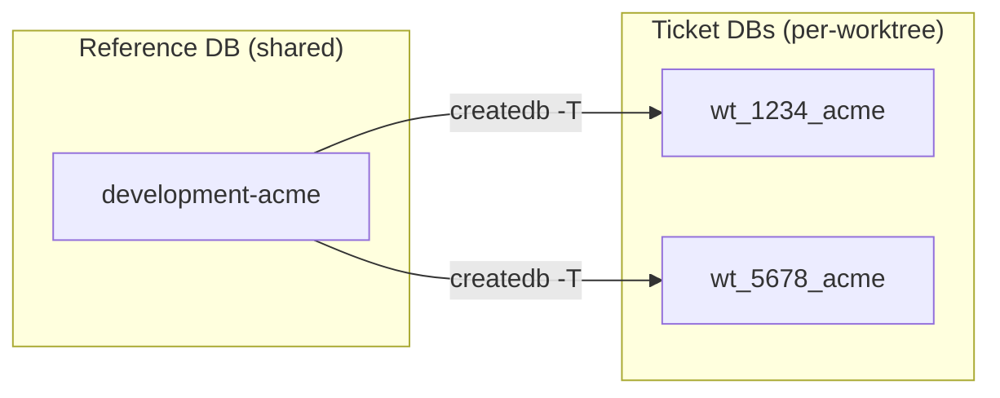
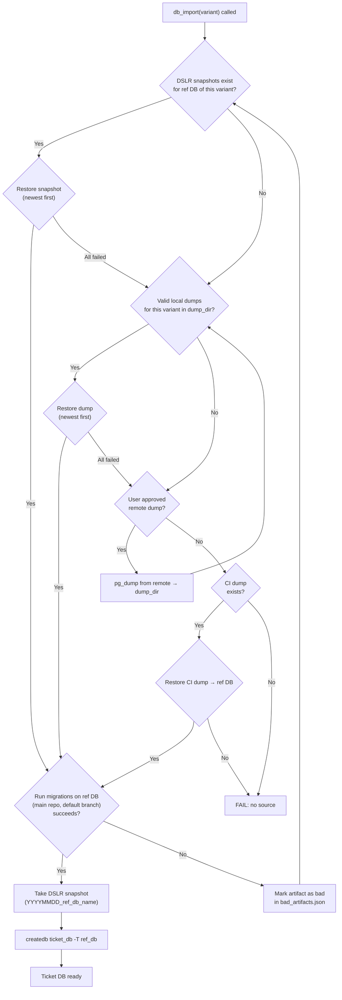
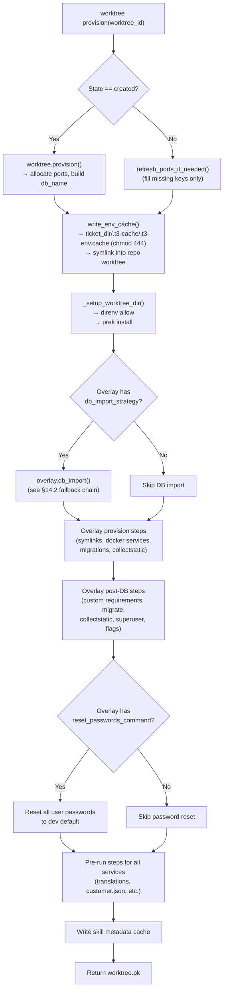
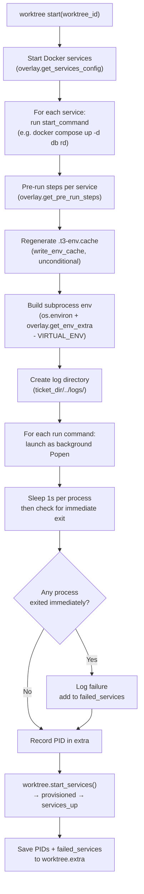
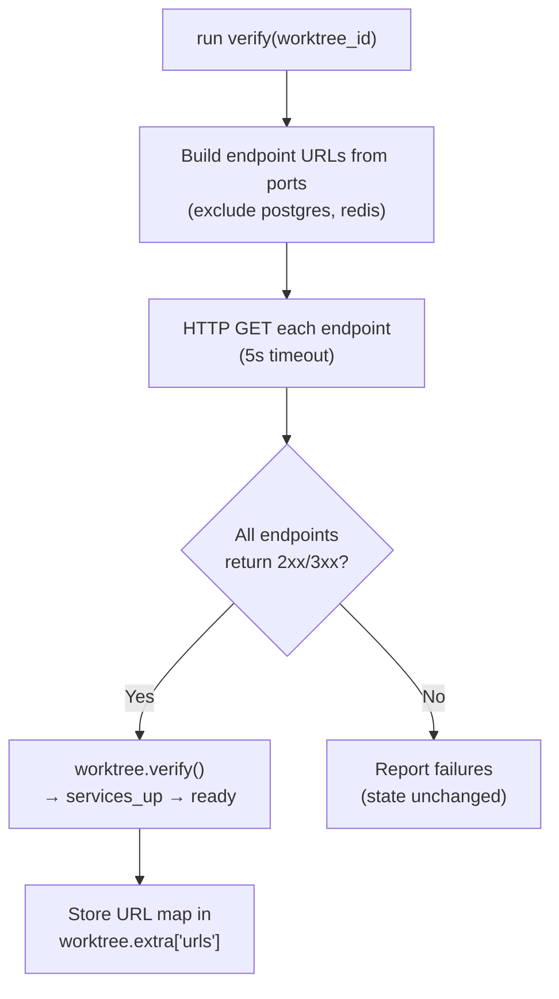
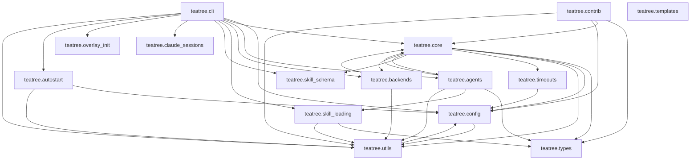

# TeaTree Blueprint

The product spec. Code is an artifact; this file is the product.

If the entire `src/` and `tests/` tree were deleted, this document alone — plus the skills in `skills/` — should be enough to regenerate the project without ambiguity.

**Change policy:** Every code change to teatree must be reflected here. Before modifying this file, always ask the user for approval — this is the source of truth and the user validates every change.

**Status:** This BLUEPRINT describes the **target** architecture under issue [#541](https://github.com/souliane/teatree/issues/541). Phases 1–2 are done in the active branch — the statusline file is the persistent UI surface, the HTML dashboard, ttyd web terminal, ASGI/uvicorn scaffolding, and platform autostart helpers are gone. Phases 3–8 (code-host + messaging Protocols, fat loop + scanners, slim headless executor, auto-mode defaults, ticket dispositions, no-overlay-leak gate) ship in the same PR. When this BLUEPRINT and the code disagree on later phases, treat this file as the destination, not the present.

---

## 1. What TeaTree Is

A personal code factory for multi-repo projects. It turns a ticket URL into a merged pull request by coordinating the full lifecycle — intake, coding, testing, review, shipping, delivery — across multiple repositories, worktrees, and agent sessions.

**Target:** service-oriented projects with databases and CI pipelines (any language). Not for docs-only repos or CLI tools.

**Operating mode.** TeaTree runs as a long-lived interactive Claude Code session orchestrated by a fat `/loop` (~10–15 min cadence). The loop fans out to in-session subagents per tick to sweep the user's PRs, auto-review PRs assigned to them, intake assigned issues, watch messaging mentions/DMs, and render a multi-line statusline that is the **only persistent UI surface**. There is no HTML dashboard. The loop runs in the same Claude Code session the user types into, so debugging stays direct.

**Code-host neutrality.** Pull requests are the canonical concept. Both **GitHub** and **GitLab** are first-class in core; GitLab MRs map onto the PR abstraction at the Protocol layer. Overlays declare which code host they target.

**Messaging-backend pluggability.** Mentions, DMs, and outgoing posts go through a `MessagingBackend` Protocol declared per overlay. Slack (Socket Mode bot) is the first implementation. A `Noop` default lets overlays opt out.

**Core principle:** Infrastructure is deterministic code; development work is skill-guided. State management, port allocation, provisioning, task routing, code-host sync, and messaging integration are Python code with >90% branch coverage. The actual development — coding with TDD, debugging, reviewing, shipping — is driven by skills that encode methodology, guardrails, and domain knowledge.

**Core stays generic.** No customer-, tenant-, or product-specific names appear in `src/teatree/` or `docs/`. Per-overlay specifics (Slack channel IDs, customer labels, project paths) live in the overlay package and in `~/.teatree.toml`. A CI grep gate enforces this.

---

## 2. Architecture Principle: Code-First, Not Skills-First

Infrastructure and orchestration are Python code; development methodology is skill-guided prose. The split is load-bearing:

1. **Skills are prose, not code.** Prose produces different results depending on the model, context pressure, and what else is loaded. Python code handles edge cases correctly every time. Anything that must be deterministic — state transitions, port allocation, provisioning, sync, the `/loop` tick — is Python.
2. **Coordination needs transactional guarantees.** Django's FSM + ORM provide atomic transitions and row-locked workers. Coordination through JSON files cannot.
3. **Code is testable; prose is not.** Core logic must reach >90% branch coverage. Anything that requires that coverage lives in Python, not in SKILL.md.
4. **One ABC with a handful of methods beats thirty thin extension points.** Overlay customization goes through `OverlayBase` — typed methods with defaults, no priority system, no plugin registries.

**The split:**

- **Deterministic code** (Django app): state machines, port allocation, provisioning, task routing, code-host + messaging Protocols, sync, `/loop` tick, statusline rendering, CLI
- **Agent skills** (SKILL.md files): development methodology, guardrails, and domain knowledge — TDD discipline, debugging process, review checklists, retro learning, verification rules, coding standards. Skills drive the actual work; they use the CLI for infrastructure.

---

## 3. Package Structure

```
Package name: teatree (double-e)
Repo/CLI name: teatree / t3
Python: >=3.13
License: MIT
Build: uv
Entry point: t3 = teatree.cli:main
```

```
src/teatree/
  __init__.py
  cli/                 # Typer CLI package — bootstrap commands (no Django needed)
  config.py             # ~/.teatree.toml parsing, overlay discovery
  skill_map.py          # Phase → companion skills delegation map
  dev_settings.py       # Development Django settings

  core/                 # Django app: the heart of teatree
    apps.py             # AppConfig with auto-admin registration
    models/             # 5 FSM models (see §4)
    managers.py         # Custom QuerySet managers
    overlay.py          # OverlayBase ABC + OverlayConfig dataclass (see §6)
    overlay_loader.py   # Settings-driven overlay instantiation
    sync.py             # Shared types, SyncBackend ABC, orchestrator (sync_followup) — platform-agnostic
    cleanup.py          # Shared worktree cleanup + squash-merge-aware branch classifier
    tasks.py            # django-tasks integration
    docgen.py           # Overlay/skill documentation generation
    admin.py            # Auto-registered admin
    management/commands/ # django-typer commands (see §8)
      lifecycle.py      # Worktree provisioning
      workspace.py      # Workspace operations
      db.py             # Database operations
      run.py            # Service runner
      followup.py       # PR sync (GitHub + GitLab via CodeHostBackend)
      pr.py             # PR creation and validation
      overlay.py        # Overlay inspection (config, info)
      tasks.py          # Task claiming and execution
      loop.py           # /loop start/stop/status/tick management

  agents/               # Headless executor runtime
    headless.py         # Headless execution via `claude -p` (kept slim — future SDK swap point)
    prompt.py           # System context and task prompt builders
    skill_bundle.py     # Skill dependency resolution for agent launch
    result_schema.py    # JSON schema for structured agent output

  loop/                 # /loop topology (see §5.6)
    tick.py             # One tick: scan in parallel, dispatch to phase agents when needed, render statusline
    scanners/           # Pure-Python signal collectors — one file each
      my_prs.py
      reviewer_prs.py
      review_channels.py
      slack_mentions.py
      notion_view.py
      assigned_issues.py
      pending_tasks.py
    statusline.py       # Statusline composition (zones, formatters) and file write

  backends/             # Pluggable external service integrations
    protocols.py        # Protocol classes (see §7)
    loader.py           # Per-overlay backend loader (code-host + messaging) with lru_cache
    github.py           # GitHub API client (httpx)
    github_codehost.py  # GitHubCodeHost — implements CodeHostBackend
    github_sync.py      # GitHubSyncBackend — consumes CodeHostBackend
    gitlab.py           # GitLab API client (httpx)
    gitlab_ci.py        # GitLab CI pipeline operations
    gitlab_codehost.py  # GitLabCodeHost — implements CodeHostBackend (translates MR ↔ PR)
    gitlab_sync.py      # GitLabSyncBackend — consumes CodeHostBackend
    slack_bot.py        # SlackBotBackend — Socket Mode messaging client (implements MessagingBackend)
    messaging_noop.py   # NoopMessagingBackend — default for overlays that opt out
    notion.py           # Notion read-only client (page fetch + n8n webhook trigger)
    sentry.py           # Sentry error tracking

  utils/                # Pure utility modules
    (git helpers, port allocation, subprocess wrappers)

  overlay_init/         # t3 startoverlay helpers
    generator.py        # Scaffold generation logic (called from cli/)

.claude-plugin/         # Plugin manifest
  plugin.json           # Plugin identity (name: t3)
  marketplace.json      # Self-hosted marketplace
agents/                 # Phase sub-agent definitions (orchestrator + 6 phase agents — see §11.2)
skills/*/               # Workflow skills (SKILL.md + references/)
hooks/                  # Plugin hooks
  hooks.json            # Event → script mapping
  scripts/              # Hook scripts (bootstrap, skill loading, statusline `cat`)
apm.yml                 # APM package manifest
settings.json           # Plugin settings (statusline + permissions allow/deny)
tests/                  # Pytest suite (>90% branch coverage)
scripts/                # Standalone utility scripts
```

---

## 4. Domain Models

Five models in `teatree.core.models/` (split into domain-specific modules), all using `django-fsm` for state machines.

**Transitions own their work.** Every FSM transition composes the runners needed to make its new state true — git, PR I/O, retro writing, cleanup — and enqueues long work to an `@task` worker via `transaction.on_commit`. Transition bodies stay pure (state change + metadata + enqueue); the worker does the I/O, takes a row lock with `select_for_update()`, re-checks the source state for idempotency, and on success calls the next transition to advance the ticket. The single rule: to move the ticket, call the transition; the transition does the rest.

Rationale: at-least-once delivery is safe because workers guard with row-locked state checks; crash recovery is `django-tasks`' job, not ours; tests use `ImmediateBackend` to run workers synchronously. `post_transition` signals remain reserved for lossy cross-cutting side effects (audit log, Slack reactions) — never for the main work of the transition.

### 4.1 Ticket — Core delivery entity

The central entity. One ticket per unit of work (maps to an issue/task in the tracker).

**States:** `not_started` → `scoped` → `started` → `coded` → `tested` → `reviewed` → `shipped` → `in_review` → `merged` → `retrospected` → `delivered`

**Fields:**

| Field | Type | Purpose |
|-------|------|---------|
| `issue_url` | URLField(500) | Link to tracker issue (blank for manual tickets) |
| `overlay` | CharField(255) | Overlay name (entry point name from `teatree.overlays`) |
| `variant` | CharField(100) | Tenant/variant identifier (e.g., "acme") |
| `repos` | JSONField(list) | Repository names involved |
| `state` | FSMField | Current lifecycle state |
| `extra` | JSONField(dict) | Extensible metadata (PRs, labels, test results) |

**Transitions:**

| Method | Source → Target | Side effects |
|--------|----------------|--------------|
| `scope(issue_url=, variant=, repos=)` | not_started → scoped | Sets issue_url, variant, repos |
| `start()` | scoped → started | Enqueues `execute_provision` worker. Worker runs `WorktreeProvisioner` and calls `schedule_coding()` on success. |
| `code()` | started → coded | Calls `schedule_testing()` |
| `test(passed=True)` | coded → tested | Stores `tests_passed` in extra; calls `schedule_review()` |
| `review()` | tested → reviewed | Condition: reviewing task completed. Calls `schedule_shipping()` only if `has_shippable_diff()` returns True (otherwise stamps `extra["shipping_skipped"]` for triage — guards meta-tickets from spurious shipping tasks). |
| `ship()` | reviewed → shipped | Enqueues `execute_ship` worker. Worker runs `ShipExecutor` and calls `request_review()` on success. |
| `request_review()` | shipped → in_review | — |
| `mark_merged()` | in_review → merged | Enqueues `execute_teardown` worker. Worker runs `WorktreeTeardown` (best-effort cleanup of git worktrees, branches, per-worktree DBs, overlay hooks). Errors do NOT block the FSM — `retrospect()` can advance the ticket regardless. |
| `retrospect()` | merged → retrospected | Enqueues `execute_retrospect` worker. Worker runs `RetroExecutor` and calls `mark_delivered()` on success. |
| `mark_delivered()` | retrospected → delivered | — |
| `rework()` | coded/tested/reviewed → started | Clears tests_passed, cancels pending tasks |

**Worker enqueue pattern (BLUEPRINT §4 invariant):** transitions that own long I/O follow one rule — body stays pure (state change + metadata only), then `transaction.on_commit(lambda: execute_X.enqueue(self.pk))`. The state change and the queued work land atomically. Workers take a row lock (`select_for_update()`), re-check the source state, run the runner, and on success call the next transition. At-least-once delivery is safe because the state guard makes redelivery a no-op. See `teatree/core/runners/` for the runner classes and `teatree/core/tasks.py` for the workers.

**Auto-scheduling:** each phase transition leads to the next-phase task in a fresh session (bias-free evaluation). `start()` schedules coding indirectly — the provision worker calls `schedule_coding()` once worktrees exist. The remaining auto-schedule edges are direct:

- `start()` → enqueues provision → on success → headless coding task
- `code()` → headless testing task
- `test()` → headless reviewing task
- `review()` → shipping task (execution target gated by `T3_AUTO_SHIP`), gated on `has_shippable_diff()`

`schedule_shipping()` defaults to `ExecutionTarget.INTERACTIVE` so the user must explicitly approve the push. Set `T3_AUTO_SHIP=true` in the environment to make shipping headless.

`Ticket.has_shippable_diff()` returns True iff at least one `Worktree` has commits ahead of its base branch (resolved via `origin/<default>` or local `main` fallback). When False, `review()` advances state but skips `schedule_shipping()` — typical for meta-tracker tickets whose work shipped via sibling PRs. Manual `schedule_shipping()` callers (CLI, tests) remain permissive and bypass the gate.

**`extra` structure:**

```python
{
    "tests_passed": bool,
    "pr_urls": ["..."],
    "prs": {
        "<pr_id>": {
            "url": str, "title": str, "branch": str, "draft": bool,
            "repo": str, "id": int,
            "pipeline_status": str, "pipeline_url": str,
            "approvals": {"required": int, "count": int},
            "review_threads": [{"status": str, "detail": str}],
            "review_requested": bool, "reviewer_names": [str],
            "head_sha": str, "last_reviewed_sha": str,
        }
    },
    "issue_title": str,
    "labels": [str],
    "tracker_status": str,  # Inferred from "Process::" labels
}
```

**Property:** `ticket_number` extracts numeric ID from `issue_url` tail via regex, falls back to `pk`.

### 4.2 Worktree — Per-repo lifecycle (FK → Ticket)

One worktree per repository per ticket.

**States:** `created` → `provisioned` → `services_up` → `ready`

**Fields:**

| Field | Type | Purpose |
|-------|------|---------|
| `ticket` | FK(Ticket) | Parent ticket |
| `overlay` | CharField(255) | Overlay name (entry point name from `teatree.overlays`) |
| `repo_path` | CharField(500) | Repo identifier (e.g. `org/repo` or short slug) — NOT a filesystem path. The on-disk worktree path lives in `extra['worktree_path']` and is exposed as `Worktree.worktree_path`. |
| `branch` | CharField(255) | Git branch name |
| `state` | FSMField | Current lifecycle state |
| `db_name` | CharField(255) | Database name |
| `extra` | JSONField(dict) | Extensible metadata |

**Transitions:**

| Method | Source → Target | Side effects |
|--------|----------------|--------------|
| `provision()` | created → provisioned | Builds db_name |
| `start_services(services=[])` | provisioned → services_up | Stores service list in extra |
| `verify()` | services_up → ready | Builds URL map in extra |
| `db_refresh()` | provisioned/services_up/ready → provisioned | Stores timestamp |
| `teardown()` | * → created | Clears db_name, extra |

**Readiness gate:** ``worktree start``, ``worktree verify``, ``worktree ready``, and ``workspace start`` run ``overlay.get_readiness_probes(worktree)`` after their primary work and exit 1 if any probe fails. Probes are runtime checks against started services (HTTP endpoints, dependency round-trips, content invariants on seeded data); ``HealthCheck`` covers post-provision file/symlink/env invariants instead. See ``teatree.core.readiness``.

**Port allocation (Non-Negotiable — see §16):** Ports are NEVER stored in the database or in the `.t3-env.cache` file. They are allocated fresh at `worktree start` time via `find_free_ports(workspace, overlay.get_required_ports(worktree))` and exported via `overlay.get_port_env(ports)` to `docker compose`. Discovery uses `docker compose port` at runtime — the running containers are the single source of truth. Overlays that need no docker-compose ports return `set()` and the allocator yields an empty dict.

Default starting ports for the conventional keys (overlays may declare additional keys, allocated from `9001+`):

- `backend`: 8001+
- `frontend`: 4201+
- `postgres`: 5432+
- `redis`: not per-worktree. Overlays opting in via `uses_redis()` share `teatree-redis` on `localhost:6379`; per-ticket isolation comes from `Ticket.redis_db_index` → `REDIS_DB_INDEX` env var; slot count from `teatree.redis_db_count` in `~/.teatree.toml`, default 16.

**Database naming:** `wt_{ticket_number}_{variant}` (variant suffix omitted if empty).

### 4.3 Session — Quality gate tracker (FK → Ticket)

Tracks which workflow phases an agent visited within a conversation, to enforce ordering.

**Fields:**

| Field | Type | Purpose |
|-------|------|---------|
| `ticket` | FK(Ticket) | Parent ticket |
| `overlay` | CharField(255) | Overlay name (entry point name from `teatree.overlays`) |
| `visited_phases` | JSONField(list) | Phases visited in order |
| `started_at` | DateTimeField | Auto-set |
| `ended_at` | DateTimeField | Set on manual handoff |
| `agent_id` | CharField(255) | Agent identifier |

**Quality gates (hardcoded):**

```python
_REQUIRED_PHASES = {
    "reviewing": ["testing"],
    "shipping": ["testing", "reviewing", "retro"],
    "requesting_review": ["shipping"],
}
```

`check_gate(phase, force=False)` raises `QualityGateError` if required phases haven't been visited. `force=True` bypasses.

### 4.4 Task — Agent work unit (FK → Ticket, Session)

Represents a unit of work for an agent (headless or interactive).

**States:** `pending` → `claimed` → `completed` / `failed`

**Fields:**

| Field | Type | Purpose |
|-------|------|---------|
| `ticket` | FK(Ticket) | Parent ticket |
| `session` | FK(Session) | Parent session |
| `parent_task` | FK(self, null) | For interactive followups |
| `phase` | CharField(64) | Workflow phase (reviewing, shipping, etc.) |
| `execution_target` | CharField(32) | "headless" or "interactive" |
| `execution_reason` | TextField | Why this task exists |
| `status` | FSMField | pending/claimed/completed/failed |
| `claimed_at` | DateTimeField | When claimed |
| `claimed_by` | CharField(255) | Who claimed it |
| `lease_expires_at` | DateTimeField | Lease expiry for timeout recovery |
| `heartbeat_at` | DateTimeField | Last heartbeat |
| `result_artifact_path` | CharField(500) | Path to result artifact |

**Claiming:** `claim(claimed_by, lease_seconds=300)` uses `select_for_update()` for atomic distributed locking. Raises `InvalidTransitionError` if already claimed with a valid lease.

**Completion flow:** `complete()` → clears claim → calls `_advance_ticket()`:

- If last attempt has `needs_user_input: true`: creates interactive followup task (same phase, parent_task linked, session carries the `agent_session_id` for resume)
- If phase is "scoping" and ticket is SCOPED: calls `ticket.start()` (→ schedules coding)
- If phase is "coding" and ticket is STARTED: calls `ticket.code()` (→ schedules testing)
- If phase is "testing" and ticket is CODED: calls `ticket.test(passed=True)` (→ schedules reviewing)
- If phase is "reviewing" and ticket is TESTED: calls `ticket.review()` (→ schedules shipping)
- If phase is "shipping" and ticket is REVIEWED: calls `ticket.ship()`

Each guard is `phase + state` so repeat calls (e.g. from parallel child tasks) find the state mismatch and safely no-op after the first advance.

**Phase task consumption:** Each FSM transition body calls `_consume_pending_phase_tasks(phase)` for the phase it closes. On the task-driven path the task was already marked COMPLETED before the transition fires, so the call is a zero-row no-op. On direct-call paths (e.g. `pr.py` invoking `ticket.ship()` from a CLI command) the previously auto-scheduled phase task is still PENDING/CLAIMED — the call marks it COMPLETED so the dispatcher does not later claim it as a zombie session.

**Session resume:** Both headless and interactive runners walk the `parent_task` chain to find a previous `agent_session_id`. When found, the CLI is invoked with `--resume <session_id>` to preserve full conversation context across execution mode switches.

**Convenience:** `complete_with_attempt()` creates a TaskAttempt and calls complete/fail based on exit_code.

**Routing:** `route_to_headless(reason=)` and `route_to_interactive(reason=)` change execution_target and reset to PENDING.

### 4.5 TaskAttempt — Execution history (FK → Task)

Records each execution attempt for audit trail.

**Fields:**

| Field | Type | Purpose |
|-------|------|---------|
| `task` | FK(Task) | Parent task |
| `started_at` | DateTimeField | Auto-set |
| `ended_at` | DateTimeField | When execution finished |
| `execution_target` | CharField(32) | headless/interactive |
| `error` | TextField | Error message if failed |
| `exit_code` | IntegerField | 0=success, non-zero=failure |
| `artifact_path` | CharField(500) | Path to output artifact |
| `result` | JSONField(dict) | Structured result (see §5) |
| `launch_url` | URLField(500) | Reserved for interactive task launch URLs |
| `agent_session_id` | CharField(255) | Agent session ID for continuity |

---

## 5. Agent Execution

### 5.1 Structured Result Schema

Agents return JSON matching `AgentResult`:

```python
{
    "summary": str,              # One-line summary
    "files_modified": [{         # Files changed
        "path": str,
        "action": "created"|"modified"|"deleted",
        "lines_added": int,
        "lines_removed": int,
    }],
    "tests_run": [{              # Test results
        "name": str,
        "passed": bool,
        "duration_seconds": float,
        "error": str,
    }],
    "tests_passed": int,
    "tests_failed": int,
    "decisions": [str],          # Design decisions made
    "needs_user_input": bool,    # Triggers interactive followup
    "user_input_reason": str,    # Why human input is needed
    "next_steps": [str],         # Suggested follow-up actions
    "commands_executed": [str],  # Shell commands run
}
```

Schema enforces `additionalProperties: false`. Validation is done without jsonschema library (minimal dependency).

### 5.2 Headless Execution (headless.py)

Runs `claude -p <prompt> --append-system-prompt <context> --output-format json`. Used by the `pending_tasks` scanner (§ 5.6) and by direct calls from the lifecycle FSM workers when a phase task is queued. Kept deliberately small — the swap point for an Anthropic SDK runtime when direct-API execution is desired.

**Flow:**

1. Resolve skill bundle for the task's phase
2. Build task prompt (ticket context, PR metadata, work instructions)
3. Build system context (task ID, skills to load, phase-specific instructions)
4. Execute subprocess, capture stdout/stderr
5. Parse JSON result: `_parse_cli_envelope()` extracts `{session_id, result}` from Claude CLI output
6. `_parse_result()` searches reversed output lines for first `{` (allows progress text before final JSON)
7. Validate result against schema
8. Create TaskAttempt with result, exit_code, agent_session_id
9. Call `task.complete()` which triggers automatic ticket advancement

**Auth:** Uses the `claude` binary (Claude Code session auth — no API key required).

### 5.3 Prompt Building (prompt.py)

**`build_task_prompt(task)`** — Work instructions for the agent:

- Ticket context: number, issue URL, title, labels, phase, execution reason
- PR context: open PRs with URL, title, draft status, pipeline status
- Instructions: check progress → identify remaining work → proceed → request input if blocked → run tests

**`build_system_context(task, skills=[])`** — System prompt for headless agents:

- Task/ticket identifiers, skill loading directives
- Phase-specific instructions (reviewing: thorough code review + /t3:next)
- Mandatory post-execution: run /t3:next for retro + structured result + pipeline handoff
- Fallback JSON schema if /t3:next not available

**`build_interactive_context(task, skills=[])`** — System prompt for interactive sessions:

- Same content as system context, plus user-aware instructions
- **First-message acknowledgement (mandatory):** The agent must begin by stating the project, ticket, current state, and planned next steps
- "Before ending, run /t3:next"

### 5.4 Skill Bundle Resolution (skill_bundle.py)

Resolves which skills to load for a given phase:

1. Look up phase in skill delegation map (§9)
2. Add overlay's companion skills from `get_skill_metadata()`
3. Parse each skill's `requires:` frontmatter field
4. Topological sort for correct load order
5. Return list of skill paths

### 5.5 Skill Delegation Map (skill_map.py)

Default mapping from phase to companion skills loaded alongside overlay skills:

```python
{
    "coding": ("test-driven-development", "verification-before-completion"),
    "debugging": ("systematic-debugging", "verification-before-completion"),
    "reviewing": ("requesting-code-review", "verification-before-completion"),
    "shipping": ("finishing-a-development-branch", "verification-before-completion"),
    "ticket-intake": ("writing-plans",),
}
```

Can be overridden via a markdown file at `references/skill-delegation.md` with `## phase` sections and `- skill-name` lists.

### 5.6 Loop Topology

TeaTree drives the day from a single long-lived Claude Code session running a fat `/loop`. The loop fires on a fixed cadence (default 12 minutes, configured via `[teatree] loop_cadence_seconds`). The tick body is Python code (`teatree.loop.tick.run_tick`), not prose — so it is tested, typed, and version-controlled.

Each tick runs three stages:

1. **Scan** — pure-Python scanners under `teatree.loop.scanners` collect signals from external sources in parallel. Scanners are deterministic, mockable, and fully covered by integration tests against stubbed backends. They never invoke Claude.
2. **Dispatch** — the tick decides what each signal means and either acts inline (mechanical fix-and-push, n8n webhook trigger, statusline note) or delegates to one of the seven phase agents shipped with the plugin (§ 11.2). Phase agents are invoked via the standard Task tool the same way `t3:orchestrator` invokes them today; the loop is just one more caller.
3. **Render** — `teatree.loop.statusline.render` writes `~/.teatree/statusline.txt` with three zones (§ 5.6.1).

**Scanners (`teatree.loop.scanners.*`):**

| Scanner | Signal collected | Typical action |
|---|---|---|
| `my_prs` | Open PRs I authored: pipeline status, draft comments, dismissed approvals, mergeability. | Mechanical fix (lint/type/format) inline; otherwise surface in statusline. |
| `reviewer_prs` | Open PRs where I'm a requested reviewer + cached `last_reviewed_sha` per PR. | Dispatch to the `reviewer` phase agent when `head.sha` ≠ `last_reviewed_sha`. The agent posts draft notes via `t3 review post-draft-note` and publishes when its review is complete. |
| `review_channels` | New review-request messages from the active overlay's `MessagingBackend`. | Route to `reviewer_prs` queue (no separate agent invocation). |
| `slack_mentions` | New `app_mention` events and DMs from the active overlay's `MessagingBackend`. | Reply inline when answerable from session context; otherwise ack with 👀 and surface in statusline. |
| `notion_view` | Notion items assigned to me with no code-host reference field set. | Trigger the existing n8n webhook so the code-host issue is created with project routing + templating. Read-only with respect to Notion. |
| `assigned_issues` | Open issues assigned to me on a configured code host that have reached "ready to work" state. | Create the `Ticket` + worktrees; the ticket FSM's `start()` transition then handles the rest (the orchestrator phase agent picks up coding when the worktrees are provisioned). |
| `pending_tasks` | `Task` rows in `pending` state. | Run via the headless executor (§ 5.2), which dispatches to the appropriate phase agent. |

**Why pure-Python scanners (not subagents):** the scan stage is deterministic I/O — fetch PR statuses, fetch mentions, query the DB. Modeling it as a Claude agent would burn tokens for work a typed Python function does cheaper, more reliably, and with reproducible tests. Claude is invoked only when judgment is needed (review the diff, decide the fix, draft a reply); for that, the loop calls the existing phase agents.

**Why fat-loop, not many small loops:** Claude Code's `/loop` is session-scoped with a 50-task and 7-day expiry. One fat loop calling commands and skills costs one slot; N small loops would saturate the slot budget.

#### 5.6.1 Statusline rendering

The statusline is the **only persistent UI surface**. It is written to a file by the loop and read by the statusline hook (`hooks/scripts/statusline.sh`) which is just a `cat`. This decouples render speed from content size.

**Zones (three, fixed order):**

1. **Anchors** — always shown: active overlay, current ticket (if any), branch, last-tick timestamp, context-window usage.
2. **Action needed** — items requiring my attention this tick: failing pipelines on my PRs, mentions and DMs the loop couldn't auto-handle, PRs with new pushes since my last review, new assigned issues awaiting kickoff.
3. **In flight** — what the loop is doing: PR sweeps in progress, headless tasks claimed, current `/loop` cadence and tick count.

The hook reads the file in <10 ms. The render-to-file pattern means the loop can spend tens of seconds composing the statusline content without slowing the hook.

The render module lives at `src/teatree/loop/statusline.py` (`StatuslineZones` dataclass + `render(zones, target=...)`). The default file path is `${XDG_DATA_HOME:-$HOME/.local/share}/teatree/statusline.txt`; the hook honours `TEATREE_STATUSLINE_FILE` for tests and overrides.

#### 5.6.2 Mode + training-wheel

The loop respects the active overlay's `mode` (§ 10.1, canonical default `interactive`). When an overlay opts into `mode = "auto"`, the training wheel `[teatree] require_human_approval_to_merge = true` (default) keeps merge gated even though push and PR creation run autonomously — merge requires a user reaction (👍 or `/merge`) on the statusline entry or the PR thread. The user flips the training wheel to `false` only when comfortable. In `interactive` overlays, every publishing action still prompts; the loop surfaces work but never publishes silently.

`UserSettings.require_human_approval_to_merge` and `UserSettings.loop_cadence_seconds` (default 720) live in `src/teatree/config.py`; both are toml-overridable in `[teatree]` and per-overlay via `[overlays.<name>]` once registered in `OVERLAY_OVERRIDABLE_SETTINGS`.

---

## 6. Overlay System

An overlay is a downstream Django project that customizes teatree for a specific project/organization.

### 6.0 Overlay Thinness Principle (Non-Negotiable)

**Overlays must be as thin as possible.** Generic workflow logic belongs in teatree core, not in overlays.

Before adding logic to an overlay, ask: "Would a different project using the same framework (Django, Node, etc.) need the same logic?" If yes, it belongs in core — parameterized and configurable. The overlay should only provide:

1. **Configuration values** — repo names, env vars, credentials, file paths, naming conventions
2. **Project-specific glue** — connecting to a proprietary API, custom tenant detection, product-specific feature flags
3. **Truly unique workflows** — steps that no other project would ever need

Everything else — DB provisioning strategies, migration runners, symlink management, service orchestration, dump fallback chains — must be implemented as configurable engines in core. The overlay configures the engine; the overlay does not reimplement the engine.

**Why this matters:** When logic lives in an overlay, it is tested only by that overlay's test suite, invisible to other overlays, and duplicated when a second project needs the same workflow. Core code has >90% branch coverage, is reviewed against the BLUEPRINT, and benefits all overlays.

**Refactoring signal:** If an overlay method exceeds ~30 lines of non-configuration code, it likely contains generic logic that should be extracted to core.

### 6.1 OverlayBase ABC

Defined in `teatree.core.overlay`. All methods receive the `worktree` instance for context.

**Overlay API version pin.** ``teatree.__overlay_api_version__`` (currently ``"1"``) is bumped on any **breaking** change to the overlay-facing API: ``OverlayBase`` method signatures, ``Worktree``/``Ticket`` fields overlays read, the ``teatree.overlays`` entry-point contract, or runner protocols overlays may implement. Overlays assert this at import to fail loudly when teatree diverges from what they were built against — no silent misbehavior, no shim, no deprecation warning. Non-breaking additions (new optional hook, new helper) leave the version alone.

**Abstract methods (must implement):**

| Method | Signature | Purpose |
|--------|-----------|---------|
| `get_repos()` | `→ list[str]` | Declare repositories for provisioning |
| `get_provision_steps(worktree)` | `→ list[ProvisionStep]` | Ordered setup steps |

**Optional methods (override as needed):**

| Method | Signature | Default | Purpose |
|--------|-----------|---------|---------|
| `get_env_extra(worktree)` | `→ dict[str, str]` | `{}` | Extra environment variables |
| `get_required_ports(worktree)` | `→ set[str]` | `set()` | Port keys to allocate per worktree (e.g. `{"backend", "frontend", "postgres"}`). Empty set means no docker-compose ports — single-service overlays opt out. |
| `get_port_env(ports)` | `→ dict[str, str]` | `{KEY_HOST_PORT: ...}` | Env vars exported to compose for allocated host ports. Default renders `${KEY}_HOST_PORT` for each key; overlays override to add convention-specific aliases (e.g. `POSTGRES_PORT`, `CORS_WHITE_FRONT`). |
| `uses_redis()` | `→ bool` | `False` | Whether the shared `teatree-redis` container should be ensured and a per-ticket DB index allocated. Multi-service overlays with Celery/RQ/cache opt in; single-service overlays leave the default. |
| `get_run_commands(worktree)` | `→ dict[str, str]` | `{}` | Named service run commands |
| `get_test_command(worktree)` | `→ str` | `""` | Test suite command |
| `get_db_import_strategy(worktree)` | `→ DbImportStrategy \| None` | `None` | DB provisioning strategy |
| `get_post_db_steps(worktree)` | `→ list[PostDbStep]` | `[]` | Post-DB-setup callbacks |
| `get_reset_passwords_command(worktree)` | `→ str` | `""` | Dev password reset command |
| `get_symlinks(worktree)` | `→ list[SymlinkSpec]` | `[]` | Extra symlinks |
| `get_services_config(worktree)` | `→ dict[str, ServiceSpec]` | `{}` | Service metadata |
| `get_base_images(worktree)` | `→ list[BaseImageConfig]` | `[]` | Docker base images teatree builds once and shares across worktrees |
| `get_docker_services(worktree)` | `→ set[str]` | `set()` | Service names (keys of `get_services_config`) that MUST run in Docker |
| `validate_pr(title, description)` | `→ ValidationResult` | no errors | PR validation rules |
| `get_followup_repos()` | `→ list[str]` | `[]` | GitLab project paths to sync |
| `get_skill_metadata()` | `→ SkillMetadata` | `{}` | Active skill path + companions |
| `get_ci_project_path()` | `→ str` | `""` | GitLab project path for CI |
| `get_e2e_config()` | `→ dict[str, str]` | `{}` | E2E trigger config |
| `detect_variant()` | `→ str` | `""` | Tenant detection |
| `get_workspace_repos()` | `→ list[str]` | `get_repos()` | Repos for workspace ticket creation |
| `get_tool_commands()` | `→ list[ToolCommand]` | `[]` | Overlay-specific CLI tools |
| `get_visual_qa_targets(changed_files)` | `→ list[str]` | `[]` | URL paths the pre-push browser sanity gate should load |
| `get_e2e_preflight(customer, base_url)` | `→ list[Callable[[], None]]` | `[]` | Pre-Playwright gates; each callable raises `RuntimeError` on failure |

### 6.2 Supporting TypedDicts

```python
ProvisionStep(name: str, callable: Callable[[], None], required: bool = True, description: str = "")
PostDbStep(name: str, description: str, command: str)           # all total=False
SymlinkSpec(path: str, source: str, mode: str, description: str)
ServiceSpec(shared: bool, service: str, compose_file: str, start_command: str, readiness_check: str, base_image: str)
BaseImageConfig(image_name: str, dockerfile: str, lockfile: str, build_context: Path, env_var: str, build_args: dict[str, str])
DbImportStrategy(kind: str, source_database: str, shared_postgres: bool, snapshot_tool: str, restore_order: list[str], notes: list[str], worktree_repo_path: str)
SkillMetadata(skill_path: str, companion_skills: list[str])
ValidationResult(errors: list[str], warnings: list[str])       # total=True
ToolCommand(name: str, help: str, command: str)                # total=True
```

### 6.2a Docker base-image sharing across worktrees

Teatree builds each `BaseImageConfig` exactly once on the main repo and
reuses it across every worktree that needs it. Worktrees get code-level
isolation via a `.:/app:rw` volume mount; the image itself is shared.

- Image tag is `{image_name}:deps-{sha256(lockfile)[:12]}` — stable while the
  lockfile is unchanged, new tag when dependencies change.
- `teatree.docker.build.ensure_base_image(cfg)` probes via `docker image
  inspect` and skips the build when the tag already exists locally.
- `image_tag_for_lockfile(cfg)` is pure (just reads and hashes the lockfile)
  and safe to call from env-cache rendering and drift detection.
- `worktree provision` calls `ensure_base_image` once per `(image_name,
  build_context)` pair across the ticket's worktrees, then writes each
  `env_var={tag}` into the per-worktree env cache so compose files can
  reference `image: ${MYAPP_BASE_IMAGE}` without knowing the tag in advance.
- `get_docker_services(worktree)` returns a `set[str]` of service names
  (keys of `get_services_config`) that MUST run in Docker; `worktree provision`
  fails fast if any listed service is not also declared in
  `get_services_config`.
- Both hooks default to empty — existing overlays keep working. Core
  enforcement only activates for overlays that opt in.

### 6.3 Scaffold (`t3 startoverlay`)

`t3 startoverlay <name> <dest>` generates a lightweight overlay package. Default overlay app name is `t3_overlay` (the `t3_` prefix is a convention). The skill directory is derived: `t3_overlay` → skill `overlay` (strip `t3_` prefix and `_overlay` suffix, then `t3:` prefix).

Generated structure:

```
<name>/
  src/t3_overlay/__init__.py, overlay.py, apps.py
  skills/overlay/SKILL.md
  pyproject.toml, .editorconfig, .pre-commit-config.yaml, ...
```

No manage.py, settings.py, urls.py, or wsgi/asgi — teatree is the Django project.

### 6.4 Discovery & Loading

**User-level discovery** (`config.py`):

1. `~/.teatree.toml` `[overlays.<name>]` sections (reads `path`, extracts `DJANGO_SETTINGS_MODULE` from `manage.py`)
2. `teatree.overlays` entry-point group from installed packages
3. Toml wins on name conflicts

**Active overlay selection** (`discover_active_overlay()`):

1. Priority 1: `manage.py` in cwd ancestors (developer working inside project)
2. Priority 2: Single installed overlay (exactly one exists)
3. Returns None if ambiguous

**Django-level loading** (`overlay_loader.py`):

- Discovers overlays via `importlib.metadata.entry_points(group="teatree.overlays")`
- Each entry point name is the overlay name; the value is an overlay class path (e.g., `"myapp.overlay:MyOverlay"`)
- Validates each class is a subclass of `OverlayBase`, then instantiates it
- Supports multiple overlays: `get_overlay(name)` returns one by name (or the sole overlay if only one exists), `get_all_overlays()` returns all as a `dict[str, OverlayBase]`
- Cached via `lru_cache(maxsize=1)` on `_discover_overlays()`, resettable via `reset_overlay_cache()`
- No Django settings involved — no `TEATREE_OVERLAY_CLASS`, no `import_string()`

---

## 7. Backend Protocols and ABCs

### 7.1 API Protocols (`backends/protocols.py`)

Each external API concern is a `@runtime_checkable Protocol` in `teatree.backends.protocols`. Request parameters are grouped into frozen dataclasses (e.g. `PullRequestSpec`, `MessageSpec`) so signatures stay small and extensible.

**Naming convention:** PR is the canonical term in core. GitLab implementations translate MR ↔ PR at the API edge — overlay code may use either term internally, but everything inside `src/teatree/` says PR.

| Protocol | Methods | Implementations |
|---|---|---|
| `CodeHostBackend` | `list_my_prs(*, author)`, `list_review_requested_prs(*, reviewer)`, `get_pr(pr_url)`, `get_pr_pipeline_status(pr_url)`, `get_pr_review_threads(pr_url)`, `post_pr_comment(pr_url, body)`, `post_pr_review(pr_url, comments)`, `create_pr(PullRequestSpec)`, `merge_pr(pr_url)`, `list_assigned_issues(*, assignee)`, `get_issue(issue_url)` | `GitHubCodeHost`, `GitLabCodeHost` |
| `CIService` | `cancel_pipelines()`, `fetch_pipeline_errors()`, `fetch_failed_tests()`, `trigger_pipeline()`, `quality_check()` | `GitHubActionsCI`, `GitLabCI` |
| `MessagingBackend` | `fetch_mentions(*, since)`, `fetch_dms(*, since)`, `post_message(channel, text, *, thread_ts)`, `post_reply(channel, ts, text)`, `react(channel, ts, emoji)`, `resolve_user_id(handle)` | `SlackBotBackend`, `NoopMessagingBackend` |
| `ErrorTracker` | `get_top_issues()` | `SentryErrorTracker` |

The `IssueTracker` and `ChatNotifier` protocols are folded into `CodeHostBackend` (issue methods) and `MessagingBackend` (post methods) respectively — the previous split duplicated state across protocols and forced overlays to configure two backends for one platform.

### 7.2 Code-Host Selection

Per-overlay configuration in `~/.teatree.toml` (see § 10.1) declares which code host an overlay targets via `code_host = "github" | "gitlab"`. The loader resolves the overlay's selected backend with no platform branches in caller code:

```python
def get_code_host(overlay: OverlayBase) -> CodeHostBackend:
    match overlay.config.code_host:
        case "github":
            return GitHubCodeHost(token=overlay.config.get_github_token())
        case "gitlab":
            return GitLabCodeHost(token=overlay.config.get_gitlab_token(), url=overlay.config.gitlab_url)
        case other:
            raise ValueError(f"Unknown code_host: {other!r}")
```

The loop's PR-sweep scanners (§ 5.6) iterate registered overlays, instantiate each overlay's `CodeHostBackend`, and aggregate. Two overlays on the same code host with different tokens (e.g. personal vs. work GitHub) are first-class.

### 7.3 Messaging Selection

Per-overlay `messaging_backend` declaration follows the same pattern. Default is `"noop"` — overlays opt in. A single Slack workspace can serve multiple overlays (one bot, one token, distinct channel routing), or each overlay can declare its own bot via `slack_bot_token_ref` (a `pass` entry name; see § 10.1).

```python
def get_messaging(overlay: OverlayBase) -> MessagingBackend:
    match overlay.config.messaging_backend:
        case "slack":
            return SlackBotBackend(
                bot_token=pass_get(overlay.config.slack_bot_token_ref + "-bot"),
                app_token=pass_get(overlay.config.slack_bot_token_ref + "-app"),
                user_id=overlay.config.slack_user_id,
            )
        case "noop" | "":
            return NoopMessagingBackend()
        case other:
            raise ValueError(f"Unknown messaging_backend: {other!r}")
```

### 7.4 Sync ABC (`core/sync.py`)

`SyncBackend` is an ABC defined in `teatree.core.sync`. Every file under `backends/` that performs data sync into the Django DB must implement it.

```python
class SyncBackend(ABC):
    def is_configured(self, overlay: object) -> bool: ...   # has credentials?
    def sync(self, overlay: object) -> SyncResult: ...      # run the sync
```

Implementations: `GitHubSyncBackend` (`backends/github_sync.py`), `GitLabSyncBackend` (`backends/gitlab_sync.py`). Both consume the `CodeHostBackend` Protocol — the platform-specific code lives only in the Protocol implementation, not in the sync logic.

**Convention:** `sync()` and `is_configured()` are instance methods. All internal helpers are `@classmethod` (no instance state needed).

**Loading** (`loader.py`): Each backend has a `get_<concern>(overlay)` function decorated with `@lru_cache(maxsize=1)` keyed on the overlay's identity. These functions auto-configure from `overlay.config` — no `TEATREE_*` settings or `import_string()` involved.

**Cache reset:** `reset_backend_caches()` clears all lru_cache entries (used in testing).

---

## 8. Three-Tier Command Split

| Tier | Tool | Needs Django? | Examples |
|------|------|---------------|----------|
| Runtime commands | django-typer management commands | Yes | `worktree provision`, `tasks work-next-sdk`, `followup refresh` |
| Bootstrap commands | Typer CLI (`t3`) | No | `t3 startoverlay`, `t3 info`, `t3 ci cancel` |
| Overlay commands | Typer CLI delegating to manage.py | Via subprocess | `t3 acme start-ticket`, `t3 acme worktree start` |
| Internal utilities | Python modules in `utils/` | No | Port allocation, git helpers, DB ops |

### 8.1 Management Commands (django-typer)

**lifecycle** — Worktree provisioning:

- `setup(ticket_id, repo_path, branch)` → creates Worktree, calls `provision()`, runs overlay provision_steps
- `start(worktree_id)` → calls `start_services()`
- `status(worktree_id)` → returns state dict
- `teardown(worktree_id)` → calls `teardown()`
- `clean(worktree_id)` → full teardown + state cleanup
- `diagram(model="worktree"|"ticket"|"task")` → Mermaid state diagram from FSM transitions

**tasks** — Task routing and execution:

- `create(ticket, phase, reason | reason-file, interactive=False)` → enqueues the next-phase task (used by `/t3:next` for phase handoff; headless by default so a worker claims immediately)
- `claim(execution_target, claimed_by, lease_seconds=120)` → claims next pending task
- `work-next-sdk(claimed_by)` → executes headless task via `claude -p`
- `start(task_id?, claimed_by)` → claims an interactive task and execs `claude` in the current terminal

**followup** — GitLab sync:

- `refresh()` → counts pending tasks and tickets
- `remind(channel)` → sends reminders
- `sync()` → calls `sync_followup()` to create/update tickets from PRs
- `discover-prs()` → discover open PRs awaiting review

**workspace** — Workspace operations
**db** — Database operations
**run** — Service runner (uses `lifecycle.compose_project()` shared helper)
**pr** — PR creation and validation
**overlay** — Overlay inspection (`config`, `info`)

### 8.2 Global CLI Commands (`t3`)

Typer-based, work without Django:

- `t3 startoverlay` — scaffold a new overlay package (see §6.3)
- `t3 agent` — launch Claude Code with teatree context (for developing teatree itself)
- `t3 info` — show entry point, sources, editable status, discovered overlays (with project paths), Claude plugin install, and agent runtime skill dirs
- `t3 sessions` — list/resume Claude conversation sessions
- `t3 docs` — serve mkdocs documentation (requires `docs` dependency group)
- `t3 ci {cancel,divergence,fetch-errors,fetch-failed-tests,trigger-e2e,quality-check}` — CI helpers
- `t3 <overlay> e2e run [<test-path>]` — run E2E tests; dispatches to the project runner (in-repo pytest-playwright) or the external runner (remote Playwright repo) based on the overlay's `get_e2e_config()` — same command across overlays
- `t3 <overlay> e2e external [--repo <name>] [<test-path>]` — explicit external runner: Playwright from `T3_PRIVATE_TESTS` or a named `[e2e_repos.<name>]` git repo; skips port discovery when `BASE_URL` is already set (DEV/staging mode)
- `t3 <overlay> e2e project [<test-path>] [--update-snapshots]` — explicit project runner: pytest-playwright in the overlay's own test dir, executed in the canonical Docker image by default
- `t3 review {post-draft-note,delete-draft-note,list-draft-notes,publish-draft-notes,update-note,reply-to-discussion,resolve-discussion}` — code-host draft notes (post/delete/list/publish), in-place edits of draft or published notes, plus immediate replies on existing discussion threads and resolve/unresolve toggle. Routes to GitHub or GitLab via the active overlay's `CodeHostBackend`.
- `t3 review-request discover` — discover open PRs awaiting review
- `t3 tool {privacy-scan,analyze-video,bump-deps,label-issues,find-duplicates}` — standalone utilities
- `t3 config write-skill-cache` — write overlay skill metadata to cache
- `t3 doctor {check,repair}` — health checks and symlink repair
- `t3 setup slack-bot --overlay <name>` — interactive walkthrough to register a Slack bot for an overlay; opens the app-manifest URL, captures bot+app tokens, stores them via `pass`, writes `slack_user_id` into `~/.teatree.toml`, smoke-tests with a round-trip DM (see § 10.1 for the manifest template and scopes)
- `t3 graph <kind>` — render mermaid diagrams on demand. `<kind>` ∈ `{ticket, worktree, task, modules, loop}`. Prints to stdout; pipe to a viewer or paste into a markdown buffer.
- `t3 loop {start,stop,status,tick}` — manage the long-lived `/loop`. `start` registers the loop in the active Claude Code session; `tick` runs one tick out-of-band (used by tests and by manual investigation).

### 8.3 Overlay Commands (`t3 <overlay> ...`)

Each registered overlay gets a subcommand group (e.g., `t3 acme`). Commands delegate to `manage.py` via subprocess — the overlay's Django settings are used automatically.

**Shortcuts:**

- `t3 <overlay> start-ticket <URL>` — create ticket, provision, start services
- `t3 <overlay> ship <ID>` — create PR for a ticket
- `t3 <overlay> daily` — sync PRs, check gates, remind reviewers
- `t3 <overlay> full-status` — ticket/worktree/session summary
- `t3 <overlay> agent [TASK]` — launch Claude Code with overlay context
- `t3 <overlay> resetdb` — drop and recreate SQLite database
- `t3 <overlay> worker` — start background task workers

**Management command groups** (each exposed as a sub-typer):

`lifecycle`, `workspace`, `run`, `db`, `pr`, `tasks`, `followup` — see §8.1 for details.

### 8.4 Overlay Contract Check (`t3 overlay contract-check`)

`contract-check --compose <paths>` reads every `${VAR}` reference in the listed docker-compose files and fails if any reference is neither defaulted (`${VAR:-x}`, `${VAR:?x}`) nor declared by core (`_declared_core_keys()`) or the active overlay (`OverlayBase.declared_env_keys()`). Stops the "compose references a missing key, substitutes empty string, something misbehaves quietly" class of bug at CI time. Overlay repos wire this into their own prek hook. The underlying utility is `teatree.utils.compose_contract` — same logic lives in `tests/test_env_contract.py` for the core repo's own compose files.

### 8.5 Overlay Dev Loop (`t3 overlay install|uninstall|status`)

Ships alongside the three-tier split above. Purpose: in a teatree feature worktree (never the main clone), editable-install a sibling overlay checkout so the `t3` CLI and agents immediately see unreleased teatree code plus the overlay that exercises it.

- `install <name>` walks up from `cwd` to find the teatree worktree, resolves the overlay main clone via `[overlays.<name>].path` in `~/.teatree.toml`, adds a sibling `git worktree` matching the teatree branch (falls back to the overlay's default branch), then runs `uv pip install --editable --no-deps <sibling>` against the teatree worktree venv. State is persisted in `.t3.local.json` (gitignored).
- `uninstall <name>` removes the overlay from the venv and state file.
- `status` lists overlays tracked in `.t3.local.json`.

Refuses to run in the main clone (detected via a real `.git` directory). Tests in the teatree worktree stay deterministic because `tests/conftest.py` pins `T3_OVERLAY_NAME=t3-teatree`.

`TeatreeOverlay.get_provision_steps()` automates the same install for discovered overlays: after `uv sync`, an `install-overlays-editable` step iterates `discover_overlays()` and runs `uv pip install -e <overlay_worktree>` for each entry whose main `project_path` resolves inside the user's `workspace_dir`. Overlays outside `workspace_dir`, overlays without a sibling worktree under the ticket dir, and the teatree overlay itself (already handled by `uv sync`) are silently skipped — the installed package is the fallback.

---

## 9. Code Host Sync (sync.py)

`sync_followup()` → `SyncResult`:

Runs all configured backends and merges results via `_merge_results()`. Iterates registered overlays; for each, instantiates the overlay's `CodeHostBackend` (§ 7.2) and runs the corresponding `SyncBackend.sync()`. Both `GitHubSyncBackend` and `GitLabSyncBackend` are first-class — selection is per-overlay, not global.

**Common sync flow** (platform-agnostic, lives in `core/sync.py`):

1. Resolve the overlay's `CodeHostBackend`
2. Fetch all open PRs authored by the current user (incremental via cached `updated_after` timestamp)
3. For each PR: `_upsert_ticket_from_pr()`:
   - Extract `issue_url` from PR description/title via regex
   - Enrich non-draft PRs with pipeline status, approvals, review threads
   - Infer ticket state from PR data via `_infer_state_from_prs()`
   - Upsert ticket by issue_url (or PR URL if no issue linked)
4. `_fetch_issue_metadata()`: fetch issue details, store `tracker_status` (from `Process::` labels or platform-specific status widget) and `issue_title`
5. `_detect_merged_prs()`: find recently merged PRs and advance matching tickets to `merged`
6. Return `SyncResult(prs_found, tickets_created, tickets_updated, labels_fetched, prs_merged, errors)`

The platform-specific code (work-item API shape, label syntax, draft-detection rules) lives only in the `CodeHostBackend` implementation; `core/sync.py` is platform-agnostic.

**State inference:** `_infer_state_from_prs()` derives a minimum ticket state from PR metadata, bypassing FSM transitions (which have side effects like task creation). On creation, the inferred state becomes the default. On update, the ticket advances forward only — never regresses.

| PR data | Inferred state |
|---------|---------------|
| Draft PR | `started` |
| Non-draft PR | `shipped` |
| Non-draft + review requested or approvals > 0 | `in_review` |

Multiple PRs: the highest inferred state wins.

**Review-thread classification:** `_classify_review_threads()` categorizes PR threads as `waiting_reviewer` (last comment is mine), `needs_reply` (last comment is theirs), or `addressed` (all resolved).

**Draft comments detection:** During sync, `get_draft_notes_count()` checks each non-draft PR for unpublished draft notes (GitLab "draft notes" / GitHub "pending review"). When present, `draft_comments_pending: true` and `draft_comments_count: N` are set on the PR entry. The statusline's "Action needed" zone shows a `review_draft` item prompting the user to review and publish the loop's draft comments.

---

## 10. Configuration

### 10.1 ~/.teatree.toml

```toml
[teatree]
workspace_dir = "~/workspace"
branch_prefix = ""
privacy = "strict"
mode = "interactive"                       # global default — confirm before publishing actions. Per-overlay override to "auto" enables loop-driven autonomy.
loop_cadence_seconds = 720                 # /loop tick interval (default 12 min)
require_human_approval_to_merge = true     # training-wheel for `auto` overlays: push + PR create autonomous, merge stays gated

[user]
claude_chrome = true   # spawn `claude` with --chrome so sessions can drive the browser
agent_signature = false  # never append agent identity (Co-Authored-By, "Sent using …") to user-on-behalf posts

[overlays.myproject]
path = "~/workspace/myproject"
code_host = "github"                       # "github" | "gitlab"
messaging_backend = "slack"                # "slack" | "noop" (default)
slack_bot_token_ref = "teatree/slack/myproject"   # `pass` entry prefix; -bot and -app suffixes resolve the two tokens
slack_user_id = "U01ABCD1234"              # my Slack user ID (used to filter mentions/DMs)

[overlays.another-project]
path = "~/workspace/another-project"
code_host = "gitlab"
messaging_backend = "slack"
slack_bot_token_ref = "teatree/slack/another-project"
slack_user_id = "U01ABCD1234"

# External Playwright E2E repos — used by `t3 e2e external --repo <name>`
# Teatree clones/updates the repo to ~/.local/share/teatree/e2e-repos/<name>/
# and runs Playwright from <clone>/<e2e_dir>.
[e2e_repos.my-service]
url = "git@gitlab.com:org/my-service.git"
branch = "feature/e2e-tests"
e2e_dir = "e2e"  # subdirectory containing playwright.config.ts (default: "e2e")
```

**Slack bot setup** (`t3 setup slack-bot --overlay <name>`): an interactive walkthrough scaffolds the per-overlay Slack app and stores its tokens. Steps:

1. Open the Slack-side "Create app from manifest" URL with a teatree-owned manifest pre-filled. The manifest declares Socket Mode (no public webhook needed), the standard scope set (`channels:history`, `channels:read`, `chat:write`, `groups:history`, `groups:read`, `im:history`, `im:read`, `im:write`, `mpim:history`, `mpim:read`, `reactions:read`, `reactions:write`, `users:read`), and bot events (`app_mention`, `message.im`).
2. After the user installs the app to their workspace, capture the bot token (`xoxb-…`) and the app-level token (`xapp-…`) into `pass` entries `<slack_bot_token_ref>-bot` and `<slack_bot_token_ref>-app`.
3. Capture the user's Slack ID (`U01ABCD1234`) and write it to `[overlays.<name>] slack_user_id` in `~/.teatree.toml`. The walkthrough mutates only the per-overlay block; nothing else in the file is touched.
4. Smoke-test by sending a DM via the bot and waiting for the user to react with ✅ on the message.

The walkthrough never writes a bot token to disk in plaintext; tokens always go via `pass`. Re-running `t3 setup slack-bot --overlay <name> --reset` rotates both tokens.

**Operating mode (`teatree.mode`, env: `T3_MODE`)** — controls whether the agent
pauses for confirmation on publishing actions (push, PR create, PR merge, messaging-backend
posts, remote branch deletion):

| Mode | Default | Meaning |
|------|---------|---------|
| `interactive` | ✅ | Canonical default. Confirm before push, PR create, messaging-backend posts, any remote write. Always-gated destructive ops (force-push to default branches, history rewrites on shared defaults, destructive DB ops on non-ticket schemas, unauthorized external writes) stay gated regardless of mode. |
| `auto` |  | Opt-in per overlay. End-to-end autonomy: push, PR create, clean-all's branch pruning, retro writes, overlay-approved messaging-backend posts run without prompts. Merge is gated by `require_human_approval_to_merge` (default `true`). Always-gated destructive ops still apply. Recommended for personal dogfooding overlays where the user accepts the trust boundary; use `interactive` for client / shared-team overlays. |

The env var `T3_MODE` overrides the toml setting. Unknown values raise
`ValueError` — typos never silently downgrade to a less-safe mode.

### 10.1.1 Per-Overlay Setting Overrides

A subset of `[teatree]` keys can be overridden per-overlay in
`[overlays.<name>]`. The resolution chain (first match wins):

1. `T3_*` env var (currently only `T3_MODE` is wired as a one-off).
2. Active overlay's override from `[overlays.<name>]`.
3. Global `[teatree]` value.
4. `UserSettings` dataclass default.

The active overlay is resolved via (in order): `T3_OVERLAY_NAME` env var
(runtime truth; matches `get_overlay()`), cwd-based discovery, then the
single installed overlay.

Overridable keys live in `OVERLAY_OVERRIDABLE_SETTINGS` in
`src/teatree/config.py`:

| Key | Why overridable |
|-----|------------------|
| `mode` | `auto` for a personal dogfooding overlay, `interactive` for a client overlay |
| `branch_prefix` | Different prefix conventions per project |
| `privacy` | Stricter for client code, looser for personal |
| `contribute` | Contribute to one overlay's skills but not another |
| `excluded_skills` | Project-specific skill exclusions |

Callers use `get_effective_settings()` (returns a `UserSettings` with the
active overlay's overrides applied) instead of reaching into
`load_config().user` directly. Adding a new overridable key is a
one-line change to the registry — the resolver picks it up via
`dataclasses.replace`, no per-setting getter needed.

```toml
[teatree]
mode = "interactive"         # global default
branch_prefix = "ac"

[overlays.teatree]
mode = "auto"                # auto-mode for teatree dogfooding

[overlays.client-project]
mode = "interactive"         # stay gated on client code
privacy = "strict"
```

### 10.2 Django Settings (framework-level, in teatree's settings.py)

| Setting | Type | Purpose |
|---------|------|---------|
| `TEATREE_HEADLESS_RUNTIME` | str | Runtime for headless tasks (default: "claude-code") |
| `TEATREE_CLAUDE_STATUSLINE_STATE_DIR` | str | Directory for the loop's rendered statusline file (default: `~/.teatree/`) |
| `TEATREE_EDITABLE` | bool | Declare teatree is editable (verified by `t3 doctor check`) |
| `OVERLAY_EDITABLE` | bool | Declare overlay is editable (verified by `t3 doctor check`) |

### 10.2.1 OverlayBase Config Methods (`OverlayConfig`)

Overlay-specific configuration lives on `overlay.config` (an `OverlayConfig` dataclass attribute on `OverlayBase`) and on a few overlay-class properties. Backends auto-configure from these (see § 7).

**Code host** — exactly one of `github` / `gitlab` is configured per overlay:

| Method / property | Return type | Default | Purpose |
|---|---|---|---|
| `code_host` | `Literal["github", "gitlab"]` | (required) | Selects which `CodeHostBackend` implementation the loader returns |
| `get_github_token()` | `str` | `""` | GitHub PAT (used when `code_host == "github"`) |
| `get_gitlab_token()` | `str` | `""` | GitLab PAT (used when `code_host == "gitlab"`) |
| `gitlab_url` | `str` | `"https://gitlab.com/api/v4"` | GitLab API base URL (only set for self-hosted) |
| `get_username()` | `str` | `""` | The user's handle on the active code host (used to filter "my PRs") |
| `pr_auto_labels` | `list[str]` | `[]` | Labels to apply when creating PRs |

**Messaging:**

| Method / property | Return type | Default | Purpose |
|---|---|---|---|
| `messaging_backend` | `Literal["slack", "noop"]` | `"noop"` | Selects which `MessagingBackend` the loader returns |
| `slack_bot_token_ref` | `str` | `""` | `pass` entry prefix; `<ref>-bot` and `<ref>-app` resolve the two tokens |
| `slack_user_id` | `str` | `""` | The user's Slack ID (used to filter mentions/DMs) |
| `get_review_channel()` | `tuple[str, str]` | `("", "")` | (channel name, channel ID) for review-request messages |
| `get_transition_emojis()` | `dict[str, str]` | `DEFAULT_TRANSITION_EMOJIS` | Emoji reactions per ticket-state transition |

**Other:**

| Method / property | Return type | Default | Purpose |
|---|---|---|---|
| `known_variants` | `list[str]` | `[]` | Known tenant identifiers for `detect_variant()` |
| `frontend_repos` | `list[str]` | `[]` | Repos whose changes trigger frontend-flavored CI gates |
| `dev_env_url` | `str` | `""` | Dev/staging environment URL (used in PR descriptions) |

### 10.3 Logging

`default_logging(namespace)` in `config.py` returns a Django `LOGGING` dict writing to `~/.local/share/teatree/<namespace>/logs/teatree.log` with rotation (5MB, 3 backups).

### 10.4 Data Storage

`~/.local/share/teatree/<namespace>/` — namespaced data directories created by `get_data_dir()`.

---

## 11. Skills & Plugin Architecture

### 11.1 Skills

Skills live in `skills/*/`. Each skill is a `SKILL.md` file with optional `references/` directory. When installed as a plugin, skills are namespaced under `t3:` (e.g., `/t3:code`).

**Skills drive the development work — coding methodology, debugging process, review standards, retro learning. The CLI handles infrastructure (worktrees, databases, ports, CI).**

| Skill | Purpose |
|-------|---------|
| `code` | TDD methodology, coding guidelines |
| `contribute` | Push improvements to fork, open upstream issues |
| `debug` | Troubleshooting and fixing |
| `followup` | Daily follow-up, batch tickets, PR reminders |
| `handover` | Transfer in-flight tasks to another runtime |
| `next` | Session wrap-up: retro, structured result, pipeline handoff |
| `platforms` | Platform-specific API recipes (GitLab, GitHub, Slack) |
| `retro` | Conversation retrospective and skill improvement |
| `review` | Code review (self, giving, receiving) |
| `review-request` | Batch review requests |
| `rules` | Cross-cutting agent safety rules |
| `setup` | Bootstrap and validate teatree for local use |
| `ship` | Committing, pushing, PR creation, pipeline |
| `test` | Testing, QA, CI |
| `ticket` | Ticket intake and kickoff |
| `workspace` | Worktree creation, setup, servers, cleanup |

Skills declare dependencies via `requires:` in YAML frontmatter. The skill bundle resolver performs topological sort for correct load order. Skills can also declare `companions:` — optional dependencies that are included when available but only warn (not fail) when missing.

#### Third-Party Skill Integration

Teatree integrates with third-party skill frameworks (notably [superpowers](https://github.com/obra/superpowers)) via the `companions:` mechanism and APM dependency management. The approach is:

- **Absorb, don't delegate.** When a third-party skill covers a universal concern (skill-loading discipline, verification before completion), the best content is distilled into teatree's own `rules` skill — which is always loaded via `requires:`. This avoids context waste from loading both teatree and third-party versions of the same guidance.
- **Companion for domain skills.** Third-party skills that cover specific domains (TDD methodology, plan execution, brainstorming) are declared as `companions:` on the relevant lifecycle skill. They load alongside teatree skills when installed, adding depth without duplication.
- **Exclude conflicting skills.** Skills that duplicate teatree's core infrastructure (worktree management, skill loading) are excluded during `t3 setup` via `CORE_EXCLUDED_SKILLS`. This prevents conflicting instructions — teatree's `t3 workspace` subsystem replaces generic worktree skills entirely.

Attribution: the `rules` skill's "Invoke Skills Before ANY Response" and "Verification Before Completion" sections are adapted from superpowers' `using-superpowers` and `verification-before-completion` skills respectively.

### 11.2 Sub-Agent Architecture

Seven phase agents live in `agents/` (the plugin directory, shipped via APM and `/plugin install`). Each is a thin YAML+description wrapper that references skills via `skills:` frontmatter — no content duplication. Phase agents are invoked via the standard Task tool by lifecycle skills, by the headless executor (§ 5.2) when a phase task is claimed, and by the loop tick (§ 5.6) when a scanner signal calls for agent judgment.

| Agent | Skills | Role |
|-------|--------|------|
| `orchestrator` | rules, workspace | Routes phase tasks to specific agents |
| `coder` | rules, workspace, code | Implements features with TDD |
| `tester` | rules, workspace, test, platforms | Runs tests, analyzes CI |
| `reviewer` | rules, platforms, review, code | Read-only code review |
| `shipper` | rules, workspace, platforms, ship, review-request | Delivery workflow |
| `debugger` | rules, workspace, debug | Troubleshooting and fixes |
| `followup` | rules, platforms, followup | PR/issue sync and reminders |

The loop ships no additional agents — its scanners (§ 5.6) are pure Python, and its dispatch stage delegates to these same seven agents. This keeps the agent surface small enough to audit and works identically whether teatree is installed editable, via `pip install`, or via `uv tool install`.

Interactive-only skills (no agent): `retro`, `next`, `contribute`, `setup`.

### 11.3 Distribution

Three install paths, one source of truth:

- **APM**: `apm install souliane/teatree` — deploys to any supported agent
- **Claude Code plugin**: `/plugin install t3@souliane-teatree` — Claude-specific
- **CLI-first**: `uv tool install teatree && t3 setup` — bootstraps from Python (runs APM install, syncs skill symlinks, and registers the Claude plugin in one step). `t3 setup` also auto-runs `uv tool install --editable <repo>` when the global `t3` binary is missing, so `uv run t3 setup` from a fresh checkout upgrades itself in-place.

The agent-facing hook layer (`hooks/scripts/hook_router.py`) blocks `uv run t3` Bash invocations and directs agents to call the globally installed `t3` instead.

`UserPromptSubmit` skill detection (`scripts/lib/skill_loader.py`) enriches the prompt with linked PR/issue titles before keyword matching via `teatree.url_title_fetcher`. This lets a domain skill auto-load when the prompt contains only a bare PR URL whose *title* — not its URL — carries the trigger keyword. Titles are fetched in parallel via `glab`/`gh` (1.5s per fetch, 4.0s total budget) and cached at `~/.cache/teatree/url-titles.json`. Disable with `T3_HOOK_FETCH_TITLES=0`.

### 11.4 Bash Permissions

The plugin's `settings.json` ships a **comprehensive** `permissions.allow` list so every command teatree and its overlays legitimately invoke matches a static rule — the auto-mode classifier is never consulted for normal workflow. This keeps day-to-day work friction-free: no surprise prompts, no classifier false-denials on routine operations.

The design is **broad allow, narrow deny**:

- **Allow** — every tool family the workflow touches:
  - **Core t3 / Python / packaging:** `t3`, `uv`, `uvx`, `pip`, `pipenv`, `python`, `python3`, `pytest`, `ruff`, `mypy`, `ty`, `prek`, `pre-commit`, `make`, `black`, `isort`, `flake8`.
  - **Git & hosting:** `git`, `gh`, `glab`.
  - **Node / frontend:** `node`, `npm`, `npx`, `yarn`, `pnpm`, `nx`, `ng`.
  - **Infra:** `docker`, `docker compose`, `docker-compose`, `docker exec`, `psql`, `createdb`, `dropdb`, `pg_dump`, `pg_restore`, `pg_isready`, `redis-cli`.
  - **POSIX utilities & file ops:** `ls`, `cat`, `head`, `tail`, `grep`, `rg`, `find`, `sed`, `awk`, `jq`, `yq`, `xargs`, `wc`, `tree`, `file`, `which`, `env`, `cp`, `mv`, `ln`, `mkdir`, `rmdir`, `touch`, `chmod`, `chown`, `tar`, `gzip`, `zip`, `rm`, plus `readlink`, `realpath`, `basename`, `dirname`, `cut`, `sort`, `uniq`, `diff`, `date`, `df`, `du`, `tee`, `mktemp`.
  - **Network & process:** `curl`, `wget`, `ps`, `pkill`, `kill`, `lsof`, `nc`, `fuser`.
  - **Platform:** `launchctl`, `systemctl`, `brew`, `open`, `osascript`, `pass show`.
- **Deny** — the load-bearing non-negotiables that take precedence over any allow wildcard:
  - `git push` to default branches (`main`/`master`/`development`/`develop`/`release`/`trunk`)
  - `git push --force` / `-f` / `--force-with-lease` (any branch)
  - `--no-verify` on any git command
  - `git config --global` / `--system`, `git filter-branch`, `git update-ref -d`
  - `gh/glab repo delete`, `release delete`, `gist delete`, `auth logout`
  - `curl/wget | bash/sh`
  - `rm -rf` rooted at `/`, `~`, `$HOME`, `.`, `..`

**Why this shape.** The `t3` CLI is the workflow's safety wrapper — it enforces worktree isolation, branch naming, ticket gates, and push gates. Blocking commands inside the CLI is the wrong layer; we allow tool families broadly and let `t3` decide which invocations are legitimate. The classifier stays available for novel patterns that neither list covers, but in the common case a teatree session runs end-to-end without a single classifier prompt.

**Users still get the final say.** A user's own `~/.claude/settings.json` (or equivalent) can expand this further or tighten it — nothing in the plugin prevents an individual from locking down their environment.

**Plugin config is not self-modifiable by the agent.** Claude Code's autonomy guardrail rejects edits to the plugin's `settings.json` allow-list — and to standing pre-authorization clauses in `CLAUDE.md` — as "Self-Modification / classifier bypass". This is by design: an agent that can grant itself standing high-impact permissions (e.g. `Bash(gh pr merge:*)`, "merge auth carries through") would defeat the purpose of the classifier. When per-call confirmation on `gh pr merge` / `gh pr update-branch` is too noisy for a session, the right knob is the **user's own** `~/.claude/settings.json` (user-scoped, not plugin-scoped) — or a single compound bash invocation that bundles the status check and merge into one intent.

**Classifier denial = immediate session blocker.** When the classifier denies a tool call mid-workflow (Bash rejected, MCP call refused, etc.), the agent must stop, inform the user, and use `AskUserQuestion` to ask whether to relax the classifier or proceed differently. If the user opts to relax, the agent **attempts the edit to `~/.claude/settings.json` itself** (zero manual steps for the user); only if the harness self-modification guardrail blocks the write does the agent fall back to a paste-ready snippet for the user to apply. Silent workarounds (alternate command shape, alternate tool, decomposed invocations) are forbidden. The full agent-facing protocol lives in `skills/rules/SKILL.md` § "Classifier Denial Protocol (Non-Negotiable)" — that section is the canonical source; this paragraph is just a pointer. Teatree defines the protocol but never modifies the user's classifier permissivity itself.

---

## 12. Testing

### 12.1 Coverage Gate

**>90% branch coverage, non-negotiable.** Enforced by pytest-cov with `fail_under = 93, branch = true`. Omits only migrations.

### 12.2 Django Test Settings

- In-memory SQLite (`:memory:`) for isolation and speed
- `django_tasks.backends.immediate` for synchronous task execution

### 12.3 Test Isolation

- `conftest.py` monkeypatches `HOME`, `XDG_CACHE_HOME`, `XDG_CONFIG_HOME`, `XDG_DATA_HOME` to `tmp_path`
- `_strip_git_hook_env()` removes `GIT_*` env vars to prevent index corruption
- Auto-use fixtures: `_clean_registry` (admin), `_no_system_port_checks`, `_isolate_env`
- `reset_overlay_cache()` and `reset_backend_caches()` prevent cross-test contamination

### 12.4 Test Organization

```
tests/
  teatree_core/       # Core model, view, command tests
  teatree_agents/     # Agent execution tests
  teatree_backends/   # Backend integration tests
  test_config.py      # Config/overlay discovery
  test_cli_agent_skills.py  # CLI + skill bundle tests
  test_startproject.py      # Overlay scaffold tests
  test_utils.py       # Utility module tests
```

### 12.5 E2E Tests

Core has no Playwright suite — there is no UI to E2E-test. Overlays may declare their own Playwright suites via `get_e2e_config()` (typically pointing at the application's own UI), and `t3 <overlay> e2e {run,external,project}` runs them.

---

## 13. Quality Gates

| Tool | What it checks | Config |
|------|----------------|--------|
| pytest + pytest-cov | >90% branch coverage (`fail_under = 93`) | `pyproject.toml [tool.coverage]` |
| ruff | ALL rules enabled, specific ignores justified | `pyproject.toml [tool.ruff]` |
| ty | Static type checker with `error-on-warning = true` | `pyproject.toml [tool.ty]` |
| import-linter | Dependency boundaries | `pyproject.toml [tool.importlinter]` |
| codespell | Spell check | `pyproject.toml [tool.codespell]` |
| prek | Runs all above on commit | `.pre-commit-config.yaml` |

**Key ruff decisions:**

- ALL rules selected, then specific ignores with justification
- D1xx disabled (no docstrings — self-documenting code)
- `from __future__ import annotations` banned (use native 3.13 syntax)
- Per-file ignores for tests, scripts, management commands, migrations, views, overlay

---

## 14. Django Project Workflows

Teatree provides a generic Django database provisioning engine in `teatree.utils.django_db`. This engine handles the full lifecycle of creating, importing, and maintaining per-worktree databases for Django projects. Overlays configure the engine; they do not reimplement it.

### 14.1 Reference DB Architecture

Teatree uses a **two-tier database pattern** for Django projects:

1. **Reference DB** — a long-lived local database (e.g., `development-acme`) that mirrors the dev/staging environment. Shared across all worktrees for the same variant. Updated infrequently (when a fresh dump is fetched or DSLR snapshot is taken).
2. **Ticket DB** — a per-worktree database (e.g., `wt_1234_acme`) created as a **Postgres template copy** (`createdb -T`) of the reference DB. Instant creation, full isolation.



**Why template copy:** `createdb -T` is a filesystem-level copy inside Postgres — it takes seconds regardless of DB size, versus minutes for a full dump-and-restore. Branch-specific migrations then run only on the ticket DB.

### 14.2 Import Fallback Chain

All operations are **scoped to a single variant** (e.g., `development-acme`). Each variant has its own reference DB, DSLR snapshots, and dump files. Different variants never share database artifacts.

The engine tries multiple sources to populate the reference DB, stopping at the first success:



**Uniform post-restore pipeline:** Every successful restore — whether from DSLR snapshot, local dump, remote dump, or CI dump — goes through the same pipeline: run `manage.py migrate` on the ref DB (bringing it to the current default branch level). If migrations fail, the engine warns the user to delete the bad artifact, then loops back to try the next available source. On success: take a fresh DSLR snapshot (capturing the migrated state), then `createdb -T` template copy to the ticket DB.

**Retry within strategy:** When a snapshot or dump fails (restore error or migration failure), the engine tries older ones for the same variant before falling through to the next strategy. This avoids expensive remote dumps when an older local artifact is still usable.

**Bad artifact tracking:** When an artifact fails (restore or migration), the engine marks it in `~/.local/share/teatree/bad_artifacts.json` and skips it on future runs. DSLR snapshots are keyed as `dslr:<name>`, dump files by absolute path. The engine prints the deletion command for each bad artifact. Cleanup of the actual files is deferred to an interactive task (see GitHub issue).

**Remote dump requires approval:** Fetching a fresh dump from a remote database (strategy 3) is slow and network-dependent. The engine only attempts this when the caller explicitly enables it (e.g., via `--force` or an interactive confirmation). Automated provisioning skips this strategy.

**Strategy details:**

| # | Strategy | Source | Speed | When used |
|---|----------|--------|-------|-----------|
| 1 | DSLR snapshot | Local DSLR store | ~5s + migrate | Default — fastest path after first import |
| 2 | Local dump | `{dump_dir}/*{ref_db}*.pgsql` | ~2min + migrate | After a manual dump download or previous remote fetch |
| 3 | Remote dump | `pg_dump` from dev/staging DB | ~5-15min + migrate | Requires explicit user approval (`allow_remote_dump=True`) |
| 4 | CI dump | `{ci_dump_glob}` in repo | ~2min + migrate | Last resort — often outdated but always available |

After **every** successful restore (including DSLR snapshots), the engine runs the same pipeline:

1. Runs `manage.py migrate` on the reference DB using the **main repo** (default branch) — bringing it to the latest master migration level
2. Takes a fresh DSLR snapshot — capturing the migrated state for instant restores next time
3. Creates the ticket DB via template copy

DSLR snapshots are not exempt from migrations — they may be days old while master has moved forward. Treating snapshots as "just a faster kind of dump" keeps the pipeline uniform and prevents stale-schema bugs.

### 14.3 Migration Retry with Selective Faking

Dev environment dumps often have schema ahead of the recorded `django_migrations` state (migrations applied directly on dev that the branch hasn't caught up with). The engine handles this:

1. Run `manage.py migrate --no-input`
2. If it fails with "already exists" or "does not exist" → extract the failing migration name → `migrate <app> <migration> --fake` → retry
3. If it fails with config errors (`ModuleNotFoundError`, `ImproperlyConfigured`) → abort (environment problem, not data problem)
4. Retry up to 20 times (handles cascading fake-then-retry chains)
5. `--fake` is **never** used for other failure types — those fail loudly

### 14.4 Post-Import Steps

After the ticket DB is created, the overlay's `get_post_db_steps()` run in order. Typical Django post-import steps:

1. **Branch migrations** — `manage.py migrate` on the ticket DB (applies branch-specific migrations on top of the master-level snapshot)
2. **Collectstatic** — `manage.py collectstatic --noinput` for admin assets
3. **Password reset** — reset all user passwords to a known dev value (so you can log in)
4. **Superuser** — ensure a local superuser exists
5. **Seed data** — project-specific feature flags, reference data, etc.

### 14.5 DjangoDbImportConfig (Configuration)

The engine is configured via a `DjangoDbImportConfig` dataclass. Overlays construct this in their `db_import()` method:

```python
@dataclass(frozen=True)
class DjangoDbImportConfig:
    ref_db_name: str                      # e.g., "development-acme"
    ticket_db_name: str                   # e.g., "wt_1234_acme"
    main_repo_path: str                   # path to main repo clone (for migrations)
    dump_dir: str                         # directory containing local dumps
    dump_glob: str                        # glob pattern for dump files, e.g., "*development-acme*.pgsql"
    ci_dump_glob: str                     # glob pattern for CI dumps, e.g., ".gitlab/dump_after_migration.*.sql.gz"
    snapshot_tool: str = "dslr"           # snapshot tool ("dslr" or "")
    remote_db_url: str = ""               # pg_dump source URL (empty = skip remote strategy)
    migrate_env_extra: dict[str, str] = field(default_factory=dict)  # extra env for migrate
    dump_timeout: int = 1800              # pg_dump timeout in seconds
```

**Calling convention:**

```python
django_db_import(cfg, skip_dslr=False, allow_remote_dump=False)
```

- `skip_dslr=True` — skip DSLR snapshots (used with `--force` to get a fresh dump)
- `allow_remote_dump=True` — enable the remote pg_dump strategy (requires explicit user approval)

**Overlay responsibility:** Provide the config values and decide when to set `allow_remote_dump=True` (typically gated behind `--force` or an interactive prompt).

### 14.6 DSLR Integration

[DSLR](https://github.com/mixxorz/DSLR) is a Postgres snapshot tool that creates/restores instant snapshots using filesystem-level copies. The engine uses it as an acceleration layer:

- **After every dump restore + migrate:** take a DSLR snapshot (keyed by date + ref DB name)
- **On subsequent imports:** restore from the latest matching snapshot (skips the slow restore + migrate cycle)
- **Snapshot naming:** `YYYYMMDD_{ref_db_name}` (e.g., `20260326_development-acme`)
- **Discovery:** `dslr list` → parse Rich table output → match by suffix → sort descending → take first

DSLR is optional. If not installed, the engine skips snapshot strategies and always does full restores.

### 14.7 Validation

Validation happens at two levels:

**Pre-checks (fast, before restore):**

- **Dump file size** — 0-byte files are skipped with a warning (failed downloads, VPN issues)
- **Dump integrity** — `pg_restore -l` detects truncated files before attempting a full restore

**Real validation (during restore):**

- **`manage.py migrate`** — this is the definitive check. A snapshot or dump that looks valid at the file level may contain incompatible schema, missing tables, or corrupt data that only surfaces when Django tries to apply migrations. When migrations fail (after exhausting the retry/fake loop), the engine tries the next older snapshot or dump for the same variant.
- **Template copy success** — verify `createdb -T` exit code

Invalid artifacts are reported with actionable messages ("delete and re-fetch"). On failure, the engine tries older artifacts before falling through to the next strategy.

### 14.8 Worktree Setup Workflow (`worktree provision`)

The `worktree provision` command provisions a worktree from scratch — allocating ports, writing env files, importing the database, and running overlay-specific preparation steps. This is the full pipeline from `created` to `provisioned`:



**Port allocation** uses a file lock (`$T3_WORKSPACE_DIR/.port-allocation.lock`) to prevent races when multiple worktrees start simultaneously. Each overlay declares its required ports via `get_required_ports(worktree) -> set[str]`; the allocator returns a dict scoped to those keys. Known keys (`backend`, `frontend`, `postgres`) start from convention-aligned bases (8001, 4201, 5432); unknown keys start from `DEFAULT_START_PORT` (9001). Allocated ports become env vars via `overlay.get_port_env(ports)` — by default each `KEY` is exposed as `${KEY}_HOST_PORT`; overlays override to add aliases like `POSTGRES_PORT` or `CORS_WHITE_FRONT`. They are **never written to files or the database** — discovery uses `docker compose port <service> <container_port>` at runtime. Single-service overlays (CLI tools, doc generators, teatree itself) declare `set()` and skip docker-compose port allocation entirely. Redis is gated behind `OverlayBase.uses_redis() -> bool` (default `False`); overlays that opt in share the `teatree-redis` container on `localhost:6379`, with `Ticket.redis_db_index` providing logical isolation via Redis DBs 0..N-1.

**`.t3-env.cache` contents** (generated by `write_env_cache()`):

```
# GENERATED — regenerated on every `t3 <overlay> worktree start`.
# Edit the database via `t3 <overlay> env set` instead.  This file is chmod 444.
# Source of truth: the Django DB (Ticket, Worktree, WorktreeEnvOverride).
# Drift detection: `t3 <overlay> worktree start` refuses if file != DB render.
#
WT_VARIANT=<variant>
TICKET_DIR=<ticket_dir>
TICKET_URL=<issue_url>
WT_DB_NAME=<db_name>
COMPOSE_PROJECT_NAME=<repo_path>-wt<ticket_number>
# + overlay.get_env_extra() entries
# + WorktreeEnvOverride rows (user-declared via `t3 env set`)
```

**No port variables appear in the cache.** Ports are ephemeral runtime state, not configuration. Storing them in files causes stale-port bugs when services restart on different ports.

The file lives at `<ticket_dir>/.t3-cache/.t3-env.cache` (hidden directory, gitignored) and is **symlinked** into each repo worktree as `.t3-env.cache`. Sibling worktrees for different repos in the same ticket share the same cache file. The file is:

- **chmod 444** (read-only) after every write, to discourage manual edits.
- **Regenerated on every `t3 <overlay> worktree start`**, so manual edits are transient.
- **Drift-checked** by `t3 env check` (and at `worktree start`) — the command fails if the file diverges from a fresh DB render.
- **Read only by shell/direnv/docker-compose**. Python code should always call `render_env_cache(worktree)` (or `t3 env show`) against the DB, never parse the file.

### 14.9 Server Startup Workflow (`worktree start`)

The `worktree start` command brings up Docker infrastructure and application servers, transitioning the worktree from `provisioned` to `services_up`:



**Docker services** are started first (typically Postgres and Redis) — these are long-lived shared containers identified by the overlay's `get_services_config()`. Each spec includes a `start_command` (e.g., `docker compose up -d --no-build db`).

**Application servers** (backend, frontend) are launched as background processes via `Popen`, with stdout/stderr redirected to per-service log files. The overlay's `get_run_commands()` provides the shell commands (e.g., `manage.py runserver`, `npx nx serve`).

**Verification** is a separate step (`run verify`):



### 14.10 Module Location

```
teatree/utils/django_db.py      # DjangoDbImportConfig + import engine
teatree/utils/db.py             # Low-level pg helpers (db_restore, db_exists, pg_env)
teatree/utils/bad_artifacts.py  # Bad artifact cache (~/.local/share/teatree/bad_artifacts.json)
```

The `django_db` module depends only on `utils/db` and stdlib. It has no Django imports — it shells out to `manage.py` as a subprocess, so it works regardless of the overlay's Django settings.

### 14.11 State Reconciler (`t3 workspace doctor`)

`teatree.core.reconcile` walks every state store and returns a typed `Drift` bundle.
Seven finding dataclasses — `OrphanContainer`, `OrphanDB`, `StaleWorktreeDir`,
`MissingWorktreeDir`, `MissingEnvCache`, `EnvCacheDrift`, `MissingDB` — cover the
divergences between the Django models and the on-disk / docker / postgres world.

`reconcile_ticket(ticket)` checks, for each `Worktree` row:

- the claimed `worktree_path` exists on disk,
- the env cache file is present and matches a fresh render (`detect_drift`),
- `db_name` resolves to a real postgres database,
- docker containers for the compose project exist only while the worktree is live
  (post-teardown containers → orphan), and
- `git worktree list` doesn't carry stale paths for the ticket number.

`t3 workspace doctor [--ticket N] [--fix]` is the user-facing entry point. Without
`--fix` it prints `Drift.format()` and exits non-zero. With `--fix` it loudly
removes orphan containers (`run_checked`), drops missing DB records, regenerates
missing env caches, and clears stale `worktree_path` values.

`teatree.core.cleanup.cleanup_worktree` propagates overlay-step exceptions:
failures are collected into a `[with errors: ...]` suffix on the return label so
the caller can see exactly which step went wrong.

---

## 15. Dependencies

```toml
django>=5.2,<6.1
django-tasks-db>=0.12
django-fsm-2>=4
django-rich>=2.2
django-tasks>=0.9
django-typer>=3.3
httpx>=0.27
```

Dev dependencies: ruff, pytest, pytest-cov, pytest-django, ty, import-linter, prek, safety, typer, django-types.

---

## 16. Key Conventions

- Python 3.13+. Use `X | Y` union syntax, never `Optional`.
- `from __future__ import annotations` is banned.
- No docstrings on classes/methods by policy. Self-documenting code.
- Management commands use `django-typer`, not `BaseCommand`.
- Package is `teatree` (double-e), repo/CLI is `teatree`/`t3`.
- `DJANGO_SETTINGS_MODULE` is stripped from env when running `_managepy()` so the overlay's own settings win.
- **Port allocation is ephemeral (Non-Negotiable).** Ports are allocated at `worktree start` via `find_free_ports()` (file-locked in `teatree.utils.ports`), passed as env vars to `docker compose`, and discovered at runtime via `docker compose port`. Ports are **never** written to `.env.worktree`, the database, or any other persistent store. Docker services are discoverable via `docker compose port` (single source of truth). Host-process services (e.g. frontend dev servers) use the allocated port directly.
- Coverage omits only migrations. Everything else must be covered.
- `claude -p` is headless (exits immediately). The user's interactive session running `/loop` is the only persistent Claude Code session.
- Statusline state is rendered to a file (`~/.teatree/statusline.txt`) by the loop and `cat`-ed by the hook — the hook itself does no DB or network I/O.
- Overlay-specific names (customer, tenant, product) **must not appear** in `src/teatree/` or `docs/`. Phase 8 lands a CI grep gate to enforce this.
- E2E tests (when overlays declare them) use file-based SQLite (not `:memory:`) because Playwright spawns a separate server process.

## Module Dependency Graph

<!-- tach-dependency-graph:start -->



<!-- tach-dependency-graph:end -->
