# TeaTree Blueprint

The product spec. Code is an artifact; this file is the product.

If the entire `src/` and `tests/` tree were deleted, this document — plus the appendices linked below and the skills in `skills/` — should be enough to regenerate the project without ambiguity.

**Change policy:** Every code change to teatree must be reflected here or in the linked appendix file for the touched section. Before modifying this file (or any appendix), always ask the user for approval — this is the source of truth and the user validates every change.

**Status:** current architecture under [#541](https://github.com/souliane/teatree/issues/541). All phases (0–8) shipped.

- Statusline file is the only persistent UI surface (HTML dashboard, ttyd, ASGI/uvicorn, platform autostart helpers removed)
- Code-host + messaging Protocols unified: `SlackBotBackend`/`NoopMessagingBackend` selectable via overlay config
- `t3 setup slack-bot --overlay <name>` walks through Slack app registration, or updates an existing app's manifest in place when one is recorded (`--update` to force it)
- Fat loop + 10 scanners + dispatcher wired through `t3 loop tick` (review-channel scanning folded into dispatcher's PR-URL detection; `ReviewNagScanner` adds fibonacci-cadence thread-reply nags at +1/+2/+3/+5d on unreviewed MRs posted to the review channel — #1038)
- Headless executor is a deliberately slim `claude -p` swap point for a future Anthropic SDK runtime
- No-overlay-leak grep gate keeps the platform tenant-agnostic

This top-level file holds the mission, the §17.1 Invariants list (parsed by `scripts/hooks/check_blueprint_invariant_numbering.py`), the §5.6 Loop Topology umbrella, the module-dependency graph, and a section index. Per-section detail lives in `docs/blueprint/*.md` (see [Appendices](#appendices)).

---

## 1. What TeaTree Is

A personal code factory for multi-repo projects. It turns a ticket URL into a merged pull request by coordinating the full lifecycle — intake, coding, testing, review, shipping, delivery — across multiple repositories, worktrees, and agent sessions.

**Target:** service-oriented projects with databases and CI pipelines (any language). Not for docs-only repos or CLI tools.

**Operating mode.** TeaTree runs as a long-lived interactive Claude Code session orchestrated by a fat `/loop` (~10–15 min cadence). The loop fans out to in-session subagents per tick to sweep the user's PRs, auto-review PRs assigned to them, intake assigned issues, watch messaging mentions/DMs, and render a multi-line statusline that is the **only persistent UI surface**. There is no HTML dashboard. The loop runs in the same Claude Code session the user types into, so debugging stays direct.

**Code-host neutrality.** Pull requests are the canonical concept. Both **GitHub** and **GitLab** are first-class in core; GitLab MRs map onto the PR abstraction at the Protocol layer. Overlays declare which code host they target.

**Messaging-backend pluggability.** Mentions, DMs, and outgoing posts go through a `MessagingBackend` Protocol declared per overlay. Slack (Socket Mode bot) is the first implementation. A `Noop` default lets overlays opt out.

**Core principle:** Infrastructure is deterministic code; development work is skill-guided. State management, port allocation, provisioning, task routing, code-host sync, and messaging integration are Python code with >90% branch coverage. The actual development — coding with TDD, debugging, reviewing, shipping — is driven by skills that encode methodology, guardrails, and domain knowledge.

**Core stays generic.** No customer-, tenant-, or product-specific names appear in `src/teatree/` or `docs/`. Per-overlay specifics (Slack channel IDs, customer labels, project paths) live in the overlay package and in `~/.teatree.toml`. A CI grep gate enforces this — see `BLUEPRINT § 1` ("Core stays generic") cited by `scripts/hooks/check_no_overlay_leak.py` and `tests/test_no_overlay_leak_hook.py`.

---

## 2. Architecture Principle: Code-First, Not Skills-First

Top-line: infrastructure and orchestration are Python code; development methodology is skill-guided prose. Full detail in [docs/blueprint/architecture-and-package.md](docs/blueprint/architecture-and-package.md).

---

## 3. Package Structure

Full module map in [docs/blueprint/architecture-and-package.md](docs/blueprint/architecture-and-package.md). Key external anchor: **§3.6 Slack bot setup** (cited by `src/teatree/backends/slack_bot.py` and `src/teatree/cli/slack_setup.py`) — see the Slack setup detail in [docs/blueprint/configuration.md](docs/blueprint/configuration.md) §10.1 "Slack bot setup".

---

## 4. Domain Models

Five core lifecycle models in `teatree.core.models/` (`Ticket`, `Worktree`, `Session`, `Task`, `TaskAttempt`), plus nine supporting rows. The transitions, fields, and "worker enqueue pattern" invariant (BLUEPRINT §4) live in full in [docs/blueprint/domain-models.md](docs/blueprint/domain-models.md), which preserves the `### 4.1 Ticket`, `### 4.2 Worktree`, `### 4.3 Session`, `### 4.4 Task`, `### 4.5 TaskAttempt` subsection anchors consumer modules cite.

**§4 invariant (load-bearing):** transitions that own long I/O follow the rule — body stays pure (state change + metadata only), then `transaction.on_commit(lambda: execute_X.enqueue(self.pk))`. The state change and the queued work land atomically. Workers take a row lock (`select_for_update()`), re-check the source state, run the runner, and on success call the next transition. At-least-once delivery is safe because the state guard makes redelivery a no-op.

---

## 5. Agent Execution

Subsections §5.1 (Structured Result Schema), §5.2 (Headless Execution), §5.3 (Prompt Building), §5.4 (Skill Bundle Resolution), §5.5 (Skill Delegation Map), §5.7 (Self-improving monitor), and §5.8 (Reactive Slack-answer loop) live in [docs/blueprint/agent-execution.md](docs/blueprint/agent-execution.md). §5.6 Loop Topology stays inline below because the `tests/test_blueprint_loop_epic_alignment.py` doc-invariant guard scans this section directly.

### 5.6 Loop Topology

TeaTree drives the day from a single long-lived Claude Code session running a fat `/loop`. The loop fires on a fixed cadence (default 12 minutes, configured via `[teatree] loop_cadence_seconds`). The tick body is Python code (`teatree.loop.tick.run_tick`), not prose — so it is tested, typed, and version-controlled.

**#786 epic — the immortal-singleton roster model is fully retired (WS1–WS5 + #54, all merged).** The original loop model — a coordinator spawning a fixed roster of long-lived loop sub-agents (`t3-main-loop`/`t3-review-loop`/`t3-cross-review-loop`/`t3-bug-hunt`) it had to keep alive and re-spawn on death/compaction — was the root cause of the recurring "loop died on compaction / had to be re-spawned" toil and the duplicate-on-restart hazard. It is **fully retired**: there is no roster, no `spawn_brief`, no takeover-respawn, no resume-by-agentId anywhere in `src/`, hooks, BLUEPRINT, the loop skill, or generated docs. The replacement satisfies the issue's three acceptance-contract invariants, each delivered by a specific workstream and detailed in the appendix:

- **Invariant 1 — 0 sessions ⇒ nothing runs.** The loop is session-bound (no OS daemon — explicitly rejected); zero open sessions ⇒ the loop is dormant, by design (WS3).
- **Invariant 2 — ≥1 session ⇒ exactly one machine-wide tick.** Driven by the recurring `t3 loop tick` cron; the executor mutex is the WS2 `LoopLease` DB row (backend-agnostic conditional-UPDATE CAS, expiry-reapable — #54 removed the dead renew/heartbeat), and the WS3 single Django-free `_OWNER_LOOP` tick-owner record names which session ticks. Atomic per-unit claim is WS1 `t3 loop claim-next` (claim == spawn boundary; no double-dispatch). A second concurrent tick loses the CAS and SKIPs.
- **Invariant 3 — exactly one TODO-consolidation loop per agent identity, across all sessions.** The WS4 per-agent consolidation self-pump, keyed by `agent_id` in a separate `consolidation-registry.json` (not per-session, not collapsed onto the tick-owner).

**Subsumed issues (WS5 — documented, not closed here).** [#789](https://github.com/souliane/teatree/issues/789) (a non-owner session still arming the tick cron) is **subsumed**: under the WS1 claim/lease a non-owner tick simply finds nothing to claim, so the concern dissolves rather than needing a separate fix — #789 was closed-as-completed when WS3 landed and is **not** reopened. Board task #50 (the per-agent TODO-consolidation loop) is **subsumed by invariant 3 / WS4**; #50 is a project-board card, **not** a repository issue, so it is documented as subsumed here and tracked on the board — there is no repo issue to close. WS5 itself carries no GitHub closing keyword on the #786 umbrella; only an explicitly-authorized epic-completion step does.

**Deep mechanics live in the appendix.** The DB-lease singleton, the session-scoped loop-owner claim, the #1107 three-prong defenses, the per-agent self-pump, the Stop-gate family (structured-question / answered-question), the `SessionStart` tick-owner record, the post-compaction snapshot recovery, the three-stage tick (scan → dispatch → render), the 12 scanners (including the [#1136](https://github.com/souliane/teatree/issues/1136) / [#1152](https://github.com/souliane/teatree/issues/1152) periodic `architectural_review` cadence-and-merge-count scanner — a teatree-CORE always-on platform behaviour applied uniformly to every registered overlay, configured via the `[teatree]` table in `~/.teatree.toml` with an `architectural_review_disabled` escape hatch — and the [#1191](https://github.com/souliane/teatree/issues/1191) daily `scanning_news` scanner that dispatches the `t3:scanning-news` skill once every 24h, anchored on the `teatree` overlay placeholder ticket and gated by the `scanning_news_disabled` escape hatch), the multi-overlay / multi-host / multi-identity scanning, and the auto-start / dispositions / completion phases — all live in [docs/blueprint/loop-topology.md](docs/blueprint/loop-topology.md), which also carries §5.6.1 Statusline rendering, §5.6.2 Mode + training-wheel, and §5.6.3 Availability (24/7 dual question-mode).

---

## 6. Overlay System

Overlay thinness principle, `OverlayBase` ABC, supporting TypedDicts, per-overlay `companion_skills` ([#1132](https://github.com/souliane/teatree/issues/1132)), Docker base-image sharing, `t3 startoverlay` scaffold, discovery & loading — all in [docs/blueprint/overlay-system.md](docs/blueprint/overlay-system.md).

---

## 7. Backend Protocols and ABCs

API Protocols (`CodeHostBackend`, `CIService`, `MessagingBackend`), code-host selection, messaging selection, and the `SyncBackend` ABC live in [docs/blueprint/backends-and-sync.md](docs/blueprint/backends-and-sync.md).

---

## 8. Command Tiers

Management commands (django-typer), global CLI commands (`t3`), overlay subcommands, overlay contract-check, overlay dev loop, teatree source resolution — all in [docs/blueprint/command-tiers.md](docs/blueprint/command-tiers.md).

---

## 9. Code Host Sync

`sync_followup()` flow, state inference, review-thread classification, and draft comments detection — see [docs/blueprint/backends-and-sync.md](docs/blueprint/backends-and-sync.md) §9.

---

## 10. Configuration

`~/.teatree.toml` shape, per-overlay overrides, Django settings, OverlayBase config methods, logging, data storage, and the state placement rule (cache vs intent, #628) live in [docs/blueprint/configuration.md](docs/blueprint/configuration.md). The `### 10.1 ~/.teatree.toml` subsection cited by `src/teatree/core/management/commands/followup.py` is preserved in that file.

---

## 11. Skills & Plugin Architecture

Skills, sub-agent architecture, distribution, and Bash permissions (§11.4 — cited by `cli/recommended_authorizations.py`, `skills/setup/SKILL.md`, `skills/setup/references/*`) live in [docs/blueprint/skills-testing-gates.md](docs/blueprint/skills-testing-gates.md).

---

## 12. Testing

Coverage gate, Django test settings, test isolation, organization, E2E — see [docs/blueprint/skills-testing-gates.md](docs/blueprint/skills-testing-gates.md) §12.

---

## 13. Quality Gates

The full tool table (pytest+pytest-cov, ruff, ty, import-linter, codespell, prek) and key ruff decisions — see [docs/blueprint/skills-testing-gates.md](docs/blueprint/skills-testing-gates.md) §13.

---

## 14. Django Project Workflows

Reference DB architecture, import fallback chain, migration retry with selective faking, post-import steps, `DjangoDbImportConfig`, DSLR integration, validation, worktree setup workflow, server startup workflow, module location, and the state reconciler (`t3 workspace doctor`) all live in [docs/blueprint/django-workflows.md](docs/blueprint/django-workflows.md).

---

## 15. Dependencies

```toml
django>=5.2,<6.1
django-tasks-db>=0.12
django-fsm-2>=4
django-rich>=2.2
django-tasks>=0.9
django-typer>=3.3
httpx>=0.27
```

Dev dependencies: ruff, pytest, pytest-cov, pytest-django, ty, import-linter, prek, safety, typer, django-types.

Full notes in [docs/blueprint/dependencies-and-conventions.md](docs/blueprint/dependencies-and-conventions.md).

---

## 16. Key Conventions

The full list (Python 3.13+, no `from __future__ import annotations`, no docstrings, port allocation invariant, coverage scope, headless `claude -p`, statusline state file, no-overlay-leak rule, file-based SQLite for E2E) lives in [docs/blueprint/dependencies-and-conventions.md](docs/blueprint/dependencies-and-conventions.md). The two anchors load-bearing for other modules:

- **Port allocation is ephemeral (Non-Negotiable).** Host ports are auto-mapped by Docker at `worktree start`; never written to `.t3-cache/.t3-env.cache`, the DB, or any other persistent store.
- **Overlay-specific names must not appear in `src/teatree/` or `docs/`.** The CI grep gate (`scripts/hooks/check_no_overlay_leak.py`) enforces this — BLUEPRINT § 1.

---

## 17. The Self-Improving Factory Architecture

Teatree is a durable self-healing **and** self-improving development factory. This section is the lasting architectural reference for that property; it is the umbrella under [#836](https://github.com/souliane/teatree/issues/836), and each component below is a separately tracked ticket implemented as deterministic teatree code (not skill prose).

The reason this architecture exists, observed repeatedly: durability comes from **enforcement encoded in code/structure**, not prose that decays. A behavioural rule kept in memory/skills and relied on by vigilance recurs anyway; the same rule encoded as a gate/test/hook does not. The invariants below are the structural form of that lesson — they are load-bearing and bind every change to teatree itself.

### 17.1 Invariants

1. **Two layers, never conflated.** *Self-healing* (independent review, draft-locks, recovery, gates) is the substrate. *Self-improvement* runs on top: each caught failure-class is converted into the smallest enforcement artifact that makes the class structurally impossible. Self-improvement is **gated by** self-healing — the system is never changed in a way the healing layer cannot catch or roll back.

2. **The flywheel.** A defect (from diff review, OR the code-health loop on un-changed code, OR an orchestrator-noticed near-miss) → the orchestrator synthesises → the output is the *smallest enforcement* (gate/test/hook), never a prose rule → the failure-class is extinct. A repeat failure whose only output is memory/prose is a flywheel failure.

3. **Topology.** The orchestrator is the synthesis brain (retro synthesis, code-health triage, enforcement escalation, merge/clear decisions). Sub-agents are sensors/hands that emit structured signal into durable state and never self-judge. Skills carry judgment/methodology. Teatree code carries the deterministic loops, gates, and intake. Corollary: mechanics → code, judgment → skill.

4. **Blast-radius rule.** Changes to the healing/gate substrate itself require an explicit recorded human approval (`MergeClear.human_authorizer`) and are draft-locked by default. Approval is the gate — the agent then executes the merge via `t3 <overlay> ticket merge <clear_id> --human-authorized <id>` (§17.4.3). The human never performs the merge action; only the approval is human.

5. **Durability discipline is load-bearing.** Durable task/state plus pre-compaction snapshots are what let the orchestrator brain survive compaction/restart; keep them.

6. **Enforcement over prose, as a standing audit.** Invariant 2 already says the *output* of the flywheel is a gate, never prose. This invariant makes the *standing posture* explicit: every user behavioural directive ("you should do X", "the agent shouldn't Y") MUST be (a) codified in teatree and (b) enforced by deterministic code/gates wherever it is mechanizable; skill prose is reduced to the judgment that genuinely cannot be mechanized. The intended consequence is that skills get **lighter** over time, not heavier. This is not a one-time conversion — it is a recurring retro/review responsibility (the same proactive-audit family as the retro skill's *Simplification Pass*, `retro/SKILL.md` § "3b. Simplification Pass (Auto-Cleaning)"; referenced, not duplicated). The enforcement gate (§17.6 / [#850](https://github.com/souliane/teatree/issues/850)) is the mechanism by which a mechanizable rule becomes a gate; the recurring audit is what keeps reclassifying prose rules → code gates so the prose corpus shrinks. Detail and the testable form: §17.7. The retroactive backfill of the pre-invariant corpus is tracked under [#855](https://github.com/souliane/teatree/issues/855).

7. **Consolidation over drift.** Any behavior encoded outside the teatree framework — personal `settings.json` hooks, dotfiles automation, overlay-local ad-hoc config, personal memory guardrails — must be considered for promotion into teatree on every retro/review pass. If different instances genuinely need different behavior, that variance must be modelled as a documented teatree setting or config knob; undocumented divergence silently drifts and violates invariant 2. The retro skill (`retro/SKILL.md` § "9. Consolidation over Drift") owns the classification rule (Promote / Model as config / Keep personal) and is the canonical home for this invariant.

8. **All FSM state transitions go through the `t3` CLI.** The pre-condition and pre/post transition hooks are the coherence mechanism (ledger update, attestation-binding to the HEAD/workstream the phase was earned against, privacy/AI-signature scan, `mark_merged()`). Out-of-band state mutation — raw `gh pr merge` / `glab mr merge`, or hand-editing the phase ledger / FSM state — is prohibited and **mechanically guarded** (the prohibition is encoded in `hook_router._BLOCKED_COMMANDS`, the same hook layer as the draft-lock and structured-question gates — invariant 2: code, not prose). The keystone IN_REVIEW → MERGED transition this protects is specified in §17.4 (orchestrator-decides / loop-executes, the per-diff `MergeClear`, `expected_head_oid` SHA-binding); the enforcement-gate placement that makes it non-bypassable is §17.6.3. The two sanctioned escapes for legitimately stale state — clearing a reused ticket's phase ledger and recording an independent reviewer attestation — are themselves `t3` commands (`lifecycle clear-ledger`, the hardened `lifecycle visit-phase … reviewing --agent-id`), never manual edits, so the prohibition has no "but I had to" exception.

9. **Every user-directed question is captured — sync or durable.** A user-directed question must either (a) call `AskUserQuestion` with the user reachable for an answer this turn, or (b) be recorded as a `DeferredQuestion` row when the resolved availability mode is `away`. Mode resolution is a single deterministic precedence — unexpired manual override → `[teatree.availability]` cron-window match → `present` (default) — exposed by `t3 availability` and observable in the statusline. Manual override has authoritative precedence over schedule. The away-mode path never bypasses the §807 structured-question gate: it is a *sanctioned destination* for the same `AskUserQuestion` tool call, converted at the `PreToolUse` layer, never an inline prose fallback. Component: §17.3 C3.

10. **Orchestrator never executes work directly — every implementation, review, test, debug, and ship action is dispatched to a sub-agent.** The orchestrator's role is synthesis, classification, dispatch, and CLEAR issuance (invariant 3, §17.4.1, §17.8 clause 3); the *hands* are sub-agents (`t3:code`, `t3:review`, `t3:test`, `t3:debug`, `t3:shipper`, `/teatree-batch`'s singleton delivery sub-agent) and the durable loop (§17.4.3). The orchestrator inlining implementation work — even a "trivial" Edit/Write to fix a typo, a Bash run to re-do a sub-agent's job because re-dispatch felt slow, a quick local test cycle to avoid spawning `t3:test`, or background work it executes itself instead of dispatching — is the named anti-pattern: it conflates judgment with execution (the same conflation §17.4 forecloses for merges), denies the maker≠checker independence the flywheel depends on (the orchestrator cannot independently review what it itself wrote), and concentrates the very compaction/restart risk the topology was designed to spread across durable handoffs. **Narrow exceptions** are: (a) read-only orientation in the orchestrator's own session — a single `Read`/`Grep` to route the next dispatch, a `gh pr view` / `glab mr view` / `git status` to re-verify cross-agent state (`rules/SKILL.md` § "Re-Verify Cross-Agent State Before Reporting a Dependent Request"), an `AskUserQuestion` call, sanctioned messaging-send/view; (b) the sanctioned `t3 …` invocations the orchestrator owns (issuing a `MergeClear`, recording an attestation, dispatching the next sub-agent); (c) pure conversational replies to the user that produce no repo mutation. Anything that *changes a file, mutates remote state, or performs the substantive work of a phase* is sub-agent territory, full stop. The personal-memory rule [[feedback-autonomous-self-improving-factory-mission]] is the user-side statement of this same posture (rules 5 "parallel sub-agent dispatch" and 6 "surface only when irreducible"); the two MUST stay aligned — a change to one is reviewed against the other. This is mechanizable today as the gate-2 candidate in §17.6.4 (the `handle_enforce_orchestrator_boundary` `PreToolUse` deny, distinguishing main agent vs. sub-agent via the transcript's `isSidechain` marker); landing that gate retires this invariant from the prose-vigilance budget (invariant 6 — enforcement over prose).

11. **Any interactive Claude Code session that mounts this teatree install MAY drain the `PendingChatInjection` queue.** The §17.1 invariant 2 inbound-Slack bridge (#1014) records each user DM as a `PendingChatInjection` row; the `handle_inject_pending_chat` `UserPromptSubmit` hook drains unconsumed rows into the next prompt's `additionalContext`. Drain eligibility is **decoupled from loop ownership**: the autonomous `t3 loop start` session that holds the `_OWNER_LOOP` record never receives `UserPromptSubmit` events, so a self-pump-style `_session_owns_loop` gate on this handler is the wrong invariant — it prevents *every* user reply from reaching *any* interactive session (32 unconsumed rows observed in production before the gate was dropped). At-most-once delivery is preserved by primitives orthogonal to ownership: the `PendingChatInjection.consume()` single-use durable transition (`UPDATE … WHERE consumed_at IS NULL` — a concurrent second drain emits nothing), and the `(overlay, slack_ts)` `UniqueConstraint` (the scanner can over-poll safely). The loop-owner gate is correct for the §5.6 self-pump (which must be singleton) and stays there; it does **not** belong on inbound message drains, where the whole point is that the user's queued replies must reach the interactive session that *can* surface them.

### 17.2 The flywheel — 17.8 Orchestrator-as-keystone contract

The flywheel diagram, components (C1 Retro / C2 Code-health loop / C3 Availability), §17.4 Orchestrator-decides / loop-executes topology (role boundaries, per-diff `MergeClear` record, loop validation before merge, post-merge audit), §17.5 TODO-consolidation quick-wins triage, §17.6 Enforcement gate (anti-relaxation, sound tach module boundaries, gate placement, shipped gates — incl. the §17.6.4 plan-gate, [#1133](https://github.com/souliane/teatree/issues/1133), opt-in per overlay via `OverlayConfig.plan_gate`), §17.7 Enforcement-over-prose as a standing audit, and §17.8 Orchestrator-as-keystone contract — all live in [docs/blueprint/factory-architecture.md](docs/blueprint/factory-architecture.md). Section headings (`### 17.2`–`### 17.8`, including `### 17.4.2`, `### 17.6.3`) are preserved there for consumer cross-references.

---

## Appendices

Detail moved out of this top-level file to keep it digestible. Each appendix preserves the original `### N.M` subsection anchors so `BLUEPRINT § N.M` consumer references resolve.

| Appendix | Sections covered |
|---|---|
| [architecture-and-package.md](docs/blueprint/architecture-and-package.md) | §2 Architecture Principle, §3 Package Structure |
| [domain-models.md](docs/blueprint/domain-models.md) | §4 Domain Models (§4.1 Ticket, §4.2 Worktree, §4.3 Session, §4.4 Task, §4.5 TaskAttempt) |
| [agent-execution.md](docs/blueprint/agent-execution.md) | §5.1 Structured Result Schema, §5.2 Headless Execution, §5.3 Prompt Building, §5.4 Skill Bundle Resolution, §5.5 Skill Delegation Map, §5.7 Self-improving monitor, §5.8 Reactive Slack-answer loop |
| [loop-topology.md](docs/blueprint/loop-topology.md) | §5.6 Loop Topology (deep mechanics), §5.6.1 Statusline rendering, §5.6.2 Mode + training-wheel, §5.6.3 Availability |
| [overlay-system.md](docs/blueprint/overlay-system.md) | §6 Overlay System |
| [backends-and-sync.md](docs/blueprint/backends-and-sync.md) | §7 Backend Protocols, §9 Code Host Sync |
| [command-tiers.md](docs/blueprint/command-tiers.md) | §8 Command Tiers (incl. §8.1–§8.6) |
| [configuration.md](docs/blueprint/configuration.md) | §10 Configuration (incl. §10.1 ~/.teatree.toml, §10.1.1 per-overlay overrides, §10.2/§10.2.1 Django settings, §10.3 logging, §10.4 data storage, §10.5 state placement rule) |
| [skills-testing-gates.md](docs/blueprint/skills-testing-gates.md) | §11 Skills & Plugin Architecture (incl. §11.4 Bash permissions), §12 Testing, §13 Quality Gates |
| [django-workflows.md](docs/blueprint/django-workflows.md) | §14 Django Project Workflows (incl. §14.1–§14.11) |
| [dependencies-and-conventions.md](docs/blueprint/dependencies-and-conventions.md) | §15 Dependencies, §16 Key Conventions |
| [factory-architecture.md](docs/blueprint/factory-architecture.md) | §17.2 The flywheel, §17.3 Components (C1–C3), §17.4 Orchestrator-decides / loop-executes topology (incl. §17.4.1–§17.4.4), §17.5 TODO-consolidation quick-wins triage, §17.6 Enforcement gate (incl. §17.6.1–§17.6.4), §17.7 Enforcement-over-prose audit, §17.8 Orchestrator-as-keystone contract |

---

## Module Dependency Graph

```mermaid
graph TD
    teatree.config --> teatree.paths
    teatree.config --> teatree.utils
    teatree.config --> teatree.update_check
    teatree.update_check --> teatree.paths
    teatree.update_check --> teatree.utils
    teatree.utils --> teatree.paths
    teatree.timeouts --> teatree.config
    teatree.repo_mode --> teatree.paths
    teatree.repo_mode --> teatree.utils
    teatree.repo_mode --> teatree.config
    teatree.skill_loading --> teatree.types
    teatree.skill_loading --> teatree.utils
    teatree.skill_loading --> teatree.skill_deps
    teatree.core --> teatree.types
    teatree.core --> teatree.paths
    teatree.core --> teatree.config
    teatree.core --> teatree.utils
    teatree.core --> teatree.timeouts
    teatree.core --> teatree.skill_schema
    teatree.core --> teatree.skill_deps
    teatree.core --> teatree.skill_map
    teatree.core --> teatree.trigger_parser
    teatree.core --> teatree.agents
    teatree.core --> teatree.backends
    teatree.core --> teatree.on_behalf_gate
    teatree.core --> teatree.slack_mrkdwn
    teatree.agents --> teatree.types
    teatree.agents --> teatree.core
    teatree.agents --> teatree.skill_loading
    teatree.agents --> teatree.utils
    teatree.agents --> teatree.config
    teatree.backends --> teatree.types
    teatree.backends --> teatree.utils
    teatree.backends --> teatree.core
    teatree.backends --> teatree.identity
    teatree.contrib --> teatree.types
    teatree.contrib --> teatree.core
    teatree.contrib --> teatree.config
    teatree.contrib --> teatree.utils
    teatree.contrib --> teatree.visual_qa
    teatree.cli --> teatree.paths
    teatree.cli --> teatree.config
    teatree.cli --> teatree.core
    teatree.cli --> teatree.agents
    teatree.cli --> teatree.backends
    teatree.cli --> teatree.skill_loading
    teatree.cli --> teatree.skill_schema
    teatree.cli --> teatree.claude_sessions
    teatree.cli --> teatree.overlay_init
    teatree.cli --> teatree.loop
    teatree.cli --> teatree.notify
    teatree.cli --> teatree.utils
    teatree.cli --> teatree.repo_mode
    teatree.cli --> teatree.triage
    teatree.cli --> teatree.skill_deps
    teatree.cli --> teatree.memory_audit
    teatree.cli --> teatree.on_behalf_gate
    teatree.cli --> teatree.outbound_claim
    teatree.core.management --> teatree.core
    teatree.core.management --> teatree.agents
    teatree.core.management --> teatree.backends
    teatree.core.management --> teatree.config
    teatree.core.management --> teatree.docker
    teatree.core.management --> teatree.loop
    teatree.core.management --> teatree.paths
    teatree.core.management --> teatree.types
    teatree.core.management --> teatree.utils
    teatree.core.management --> teatree.visual_qa
    teatree.loop --> teatree.types
    teatree.loop --> teatree.paths
    teatree.loop --> teatree.utils
    teatree.loop --> teatree.config
    teatree.loop --> teatree.core
    teatree.loop --> teatree.backends
    teatree.loop --> teatree.notify
    teatree.docker --> teatree.types
    teatree.docker --> teatree.utils
    teatree.visual_qa --> teatree.core
    teatree.visual_qa --> teatree.utils
    teatree.identity --> teatree.config
    teatree.on_behalf_gate --> teatree.config
    teatree.notify --> teatree.core
    teatree.outbound_claim --> teatree.core
    teatree.settings --> teatree.config
    teatree.settings --> teatree.paths
    teatree.cli_reference --> teatree.cli
    teatree.triage --> teatree.utils
    teatree.url_title_fetcher --> teatree.utils
    teatree.paths
    teatree.types
    teatree.templates
    teatree.claude_sessions
    teatree.overlay_init
    teatree.skill_schema
    teatree.slack_mrkdwn
    teatree.skill_deps
    teatree.skill_map
    teatree.memory_audit
    teatree.trigger_parser
```

<!-- tach-dependency-graph:start -->



<!-- tach-dependency-graph:end -->
