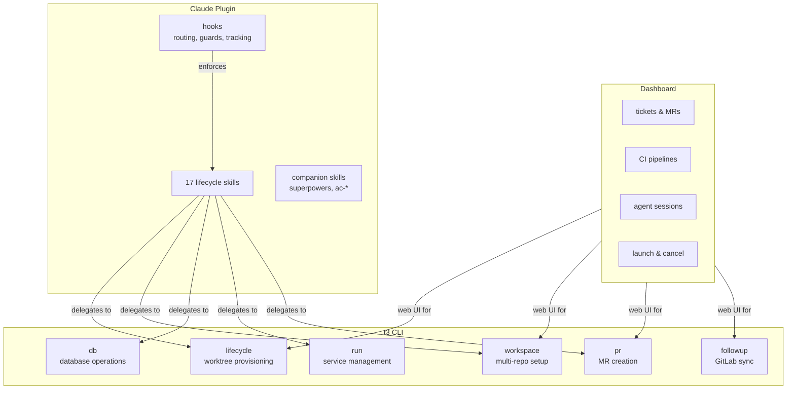
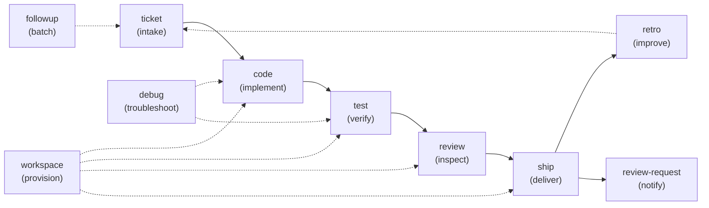

<!-- markdownlint-disable MD041 MD033 -->
<p align="center">
  
</p>

<p align="center">
  <a href="https://github.com/souliane/teatree/actions/workflows/ci.yml"></a>
  
  <a href="https://github.com/souliane/teatree/blob/main/LICENSE"></a>
</p>

Multi-repo worktree lifecycle manager for AI-assisted development.

Teatree coordinates development work across multiple repositories: creating worktrees, provisioning databases, allocating ports, running services, syncing with GitLab, and tracking tickets through their entire lifecycle. It's a Django project — overlays are lightweight Python packages that plug in project-specific behaviour via entry points.



## Three Tiers

### 1. t3 CLI

The core of teatree. Django management commands handle everything deterministic: state machines, port allocation, database provisioning, worktree creation, MR validation, CI sync. These are tested with 100% branch coverage — no prose, no model variance.

```bash
t3 lifecycle setup   # provision worktrees, DBs, ports for a ticket
t3 lifecycle start   # start all services
t3 workspace ticket  # create multi-repo worktrees from a ticket URL
t3 db refresh        # restore a database dump
t3 pr create         # create a merge request with metadata validation
t3 followup sync     # sync tickets and MRs from GitLab
```

### 2. Dashboard

A Django/HTMX web UI that surfaces everything the CLI manages: tickets, merge requests, pipeline statuses, agent sessions, and available actions. Launch it with `t3 dashboard` (auto-finds a free port). Supports SSE for live updates.

### 3. Claude Plugin

Skills and hooks that teach AI agents how to use the CLI. Each skill covers one phase of the development lifecycle — ticket intake, coding, testing, review, shipping. Skills declare dependencies (`requires:`) and optional companion skills (`companions:`) from third-party packages like [superpowers](https://github.com/obra/superpowers). Hooks handle automatic skill routing, branch protection, and session tracking.

Skills don't replace the CLI — they delegate to it. The agent reads the skill, then calls `t3 lifecycle setup` instead of manually running `docker compose`, `createdb`, `npm install` across five repos.

## What It Looks Like

Tell your AI agent what you want:

> `https://gitlab.com/org/repo/-/issues/1234`

The agent fetches the ticket, creates synchronized worktrees across all repos, provisions isolated databases and ports, implements the feature with TDD, writes a test plan, runs E2E tests, self-reviews, then pushes and creates the merge request.

> `Fix PROJ-5678`

The agent fetches the failed test report from CI, reproduces locally, fixes, pushes, and monitors the pipeline until green.

> `Review https://gitlab.com/org/repo/-/merge_requests/456`

The agent fetches the ticket for context, inspects every commit individually, and posts draft review comments inline on the correct file and line.

> `Follow up on my open tickets`

The agent batch-processes your assigned tickets, checks CI statuses, nudges stale MRs, and starts work on anything that's ready.

## Get Started

**Prerequisites:** Python 3.13+, [uv](https://docs.astral.sh/uv/).

### For users

```bash
pip install teatree
apm install -g souliane/teatree   # installs skills + companion dependencies
t3 startoverlay my-overlay ~/workspace/my-overlay
```

### For contributors

[Fork the repo](https://github.com/souliane/teatree/fork), then:

```bash
git clone git@github.com:YOUR_USERNAME/teatree.git ~/workspace/teatree
cd ~/workspace/teatree
uv sync
uv pip install -e .
t3 setup   # installs skills globally, respects local symlinks
```

`t3 setup` runs [APM](https://github.com/microsoft/apm) to install companion dependencies (superpowers, ac-django, etc.), symlinks teatree skills to `~/.claude/skills/`, and writes the skill metadata cache. It must be run from the main clone, not a worktree.

## Skills

Each skill teaches the agent one phase of development:



<!-- BEGIN SKILLS -->
| Skill | Phase |
|-------|-------|
| `code` | Writing code with TDD methodology |
| `contribute` | Push retro improvements to a branch, open a PR, and optionally create upstream issues |
| `debug` | Troubleshooting and fixing — something is broken, find and fix it |
| `followup` | Daily follow-up — batch process new tickets, check/advance ticket statuses, remind about MRs waiting for review |
| `handover` | Use when the user wants to transfer an in-flight TeaTree task from Claude to another runtime, or asks whether it is time to switch because Claude usage is getting high. |
| `next` | Wrap up the current session — retro, structured result, pipeline handoff. |
| `platforms` | Platform-specific API recipes for GitLab, GitHub, and Slack. Auto-loaded as a dependency by skills that interact with these platforms. |
| `retro` | Conversation retrospective and skill improvement |
| `review` | Code review — self-review before finalization, giving review, receiving review feedback |
| `review-request` | Batch review requests — discover open MRs, validate metadata, check for duplicates, post to review channels |
| `rules` | Cross-cutting agent safety rules — clickable refs, temp files, sub-agent limits, UX preservation. Auto-loaded as a dependency by other skills. |
| `setup` | Bootstrap and validate teatree for local use — prerequisites, config, skill symlinks, optional agent hooks, and Django project scaffolding |
| `ship` | Delivery — committing, pushing, creating MR/PR, pipeline monitoring, review requests |
| `teatree` | TeaTree agent lifecycle platform — installation, configuration, lifecycle phases, overlay concept, CLI reference, and skill loading |
| `test` | Testing, QA, and CI — running tests, analyzing failures, quality checks, CI interaction, test plans, and posting testing evidence |
| `ticket` | Ticket intake and kickoff — from zero to ready-to-code |
| `workspace` | Environment and workspace lifecycle — worktree creation, setup, DB provisioning, dev servers, cleanup |
<!-- END SKILLS -->

### Skill Dependencies

Skills declare hard dependencies (`requires:`) and optional companion skills (`companions:`) in their YAML frontmatter:

```yaml
---
name: code
requires:
  - workspace
companions:
  - test-driven-development
  - verification-before-completion
---
```

The `UserPromptSubmit` hook resolves these automatically — when it suggests loading `code`, it also loads `workspace` (required) and `test-driven-development` + `verification-before-completion` (companions, if installed). Missing companions produce a warning; missing requirements produce an error.

Companion skills come from third-party packages like [obra/superpowers](https://github.com/obra/superpowers) and are installed via [APM](https://github.com/microsoft/apm). Teatree skills are never modified — the `companions:` field lives in teatree's frontmatter, not in the companion's.

## Project Overlay

Teatree is generic — it doesn't know your repos, CI, or environment defaults. Project-specific behaviour lives in a lightweight overlay package that subclasses `OverlayBase`.

Create one with:

```bash
t3 startoverlay my-overlay ~/workspace/my-overlay
```

The overlay registers via a `teatree.overlays` entry point:

```toml
[project.entry-points."teatree.overlays"]
my-overlay = "myapp.overlay:MyOverlay"
```

Once installed (`pip install -e .`), the overlay is auto-discovered at startup. The overlay implements the narrow contract teatree needs: managed repos, provisioning steps, runtime metadata, and project-specific service hooks. See [docs/overlay-api.md](docs/overlay-api.md) for the full API.

## Configuration

Teatree reads its config from `~/.teatree.toml`:

```toml
[teatree]
workspace_dir = "~/workspace"
branch_prefix = "dev"        # prefix for worktree branches
contribute = false            # enable skill self-improvement
push = false                  # allow t3:contribute to push
auto_squash = false           # squash related commits before push
excluded_skills = ["my-custom-skill"]   # extra skills to exclude (on top of core exclusions)

[overlays.my-overlay]
path = "~/workspace/my-overlay"
protected_branches = ["development"]
```

Run `t3 setup` after editing `~/.teatree.toml` to apply changes to skill symlinks and caches.

## Contributing & Self-Improvement

After every non-trivial session, the `retro` skill runs a retrospective, extracts what went wrong, and writes fixes back into skill files. When contributors enable this (`contribute = true` in `~/.teatree.toml`), improvements flow back upstream through a fork-based model.

**Where improvements go:**

- `contribute = false` (default): improvements go to your project overlay only
- `contribute = true`: the agent also improves core skills, pushes to a branch, opens a PR

Nothing is ever pushed without explicit consent. The `contribute` skill shows exactly what will be pushed, runs privacy scans, and checks fork divergence before creating PRs.

```bash
# Run tests locally
uv run pytest               # 100% coverage required

# Pre-commit checks
prek run --all-files         # ruff, pytest, codespell, banned-terms
```

## Security Considerations

Skills are prompt instructions — they control what your AI agent does. This makes the supply chain a security surface.

**Safe defaults:** self-improvement is off, pushing is disabled, and there is no auto-update mechanism. All pushes go to branches (never main) and require a PR. APM dependencies are pinned to specific commit SHAs in `apm.yml`.

**Supply chain:** `t3 setup` verifies that skills are loaded via symlinks to your clone — not stale copies. If you use a fork from someone else, you are trusting that person's skill files as agent instructions. Review changes before pulling.

## Project Structure

```text
teatree/
  src/teatree/         # Django project (installed as `teatree`)
    cli/               #   Typer CLI package — bootstrap commands
    core/              #   Models, views, management commands, templates
    agents/            #   Agent runtime adapters (Claude Code, Codex)
    backends/          #   GitLab / Slack / Notion integrations
    utils/             #   Internal helpers (ports, git, DB)
    overlay_init/      #   `t3 startoverlay` templates
  skills/              # AI agent skills (SKILL.md + references)
  hooks/               # Agent platform hooks (routing, guards, statusline)
  scripts/             # Pre-commit hooks, utility scripts
  tests/               # Unit tests (100% branch coverage)
  docs/                # MkDocs documentation site
```

## FAQ

**Why Django management commands instead of just skills?**

Skills tell the agent *what to do*. Commands *do it*. A 15-step procedure for setting up a worktree is fragile — the model might skip a step, reorder things, or improvise. `t3 lifecycle setup` handles the complexity internally; the model just calls it.

**Is this overkill for my project?**

If you work in a single repo with a simple setup, probably. Teatree shines when your workflow has friction that the model can't solve from first principles: multi-repo synchronization, tenant-specific configuration, isolated worktree environments, or a CI/CD pipeline with project-specific quirks.

**Why do skills live in the same repo as the Django code?**

Because skills call management commands, reference the overlay API, and depend on the CLI. Keeping them together means a single `git clone` gives you everything, and skill improvements can be tested against the actual code in the same PR.

**Why "teatree"?**

**TEA**'s **E**xtensible **A**rchitecture for work**tree** management. Also: teatree oil cuts through grime, and that's what this does to multi-repo worktree friction.

## License

MIT
