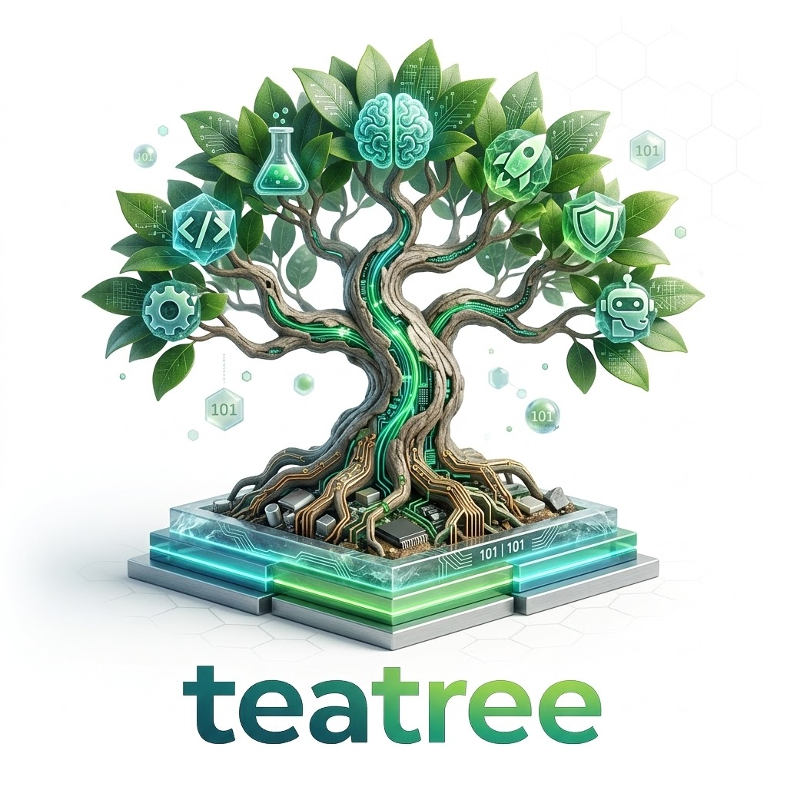
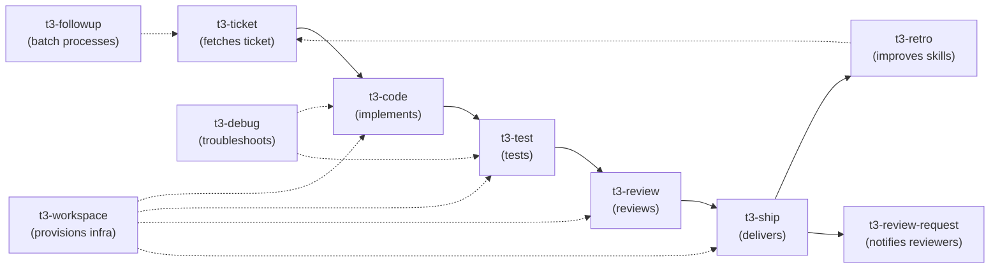

<!-- markdownlint-disable MD041 -->
<p align="center">
  
</p>

Multi-repo worktree lifecycle manager for AI-assisted development — with distributed self-improvement.

Teatree is now a Django-first extension package. Runtime code lives under `teetree/`, generated host projects are created with `t3 startproject`, and the legacy script workflow remains only as a migration bridge.

Teatree turns development automation into composable AI skills. Instead of shell scripts, CI configs, and tribal knowledge scattered across wikis, each workflow phase — from ticket intake to delivery — is a skill that any AI agent can learn, follow, and improve. Skills are plain markdown and scripts — any AI agent that can read files and run commands can use them. It has been tested most with [Claude Code](https://docs.anthropic.com/en/docs/claude-code).

Four things make teatree different:

1. **Multi-repo worktrees.** If your project spans several repos — backend, frontend, translations, configuration — starting work on a ticket means creating the same branch everywhere, setting up worktrees, remapping ports, provisioning databases, and wiring it all together. Teatree automates all of that and teaches your AI agent how to use it.

2. **Multi-tenant aware.** Teatree's variant system (`detect_variant()`) auto-detects the target tenant from ticket labels, descriptions, or external trackers — then provisions tenant-specific databases, environment variables, and configuration. Feature flag checks during code review ensure changes are properly scoped per tenant. The project overlay wires in your tenant-to-variant mapping; teatree handles the rest.

3. **Automation as skills.** Every workflow — TDD, code review, MR creation, E2E testing, CI debugging — is a structured skill file that the agent reads and follows. Skills are composable, overridable (via project overlays), and version-controlled. This means your automation is transparent, auditable, and improvable — not buried in opaque scripts.

4. **Distributed self-improvement.** After every non-trivial session, teatree runs a retrospective, extracts what went wrong, and writes fixes back into its own skill files — so the same mistake never happens twice. When contributors enable this, improvements flow back to the upstream project through a fork-based model: each user's AI agent pushes to their fork, then opens an issue upstream. The skill system evolves from the collective experience of everyone using it.

## Skill-Driven Development

Teatree follows a simple principle: **if you're going to do something more than once, write a skill for it first.**

This is Skill-Driven Development — a workflow where the human's primary job shifts from *executing tasks* to *transferring expertise*. Everything you know how to do — run tests, debug CI, set up environments, review code, ship features — you encode into a skill so your AI agent can do it for you. From that point on, the agent handles it — and gets better at it over time.

The parallel to Test-Driven Development is deliberate — and deeper than it first appears:

| | TDD | SDD |
|---|-----|-----|
| **Write** | Write the test first | Write the skill first |
| **Run** | Run the code | Let the agent produce the code |
| **Evaluate** | Test fails → fix the **code** | Output is wrong → fix the **skill** |
| **Loop** | Until green | Until the agent gets it right |

In TDD, tests define *what* correct output looks like. In SDD, skills define *how* to produce it. And just as you iterate on code until the tests pass, you iterate on skills until the agent's output meets your standards. The skill isn't a one-shot handoff — it's the thing you refine through use.

Combining TDD with SDD makes this concrete: write the tests, write the skill, let the agent produce the code. When tests fail, the question isn't just "what's wrong with the code?" — it's "what's missing from the skill that led the agent to produce wrong code?" Fix the skill, re-run, repeat. Over time, the skill encodes enough context that the agent gets it right on the first try.

**When it works best:** structured, repeatable processes with clear quality criteria — exactly the kind of work that eats hours but doesn't require creative judgment. Ticket intake, worktree setup, TDD cycles, code review, MR creation, CI debugging, retrospectives. These are teatree's core skills, and they started as things someone did manually and got tired of repeating.

**When it doesn't:** one-off creative decisions, ambiguous judgment calls, or tasks so novel that encoding them would take longer than doing them. The good news is that even novel tasks often reveal repeatable sub-patterns — and those are worth encoding.

The result is a living, version-controlled repository of everything you know about how to get work done — one that improves with every session.

## Get Started

**Prerequisites:** An AI coding agent, Python 3.13+, [uv](https://docs.astral.sh/uv/).

### Install

Teatree requires a local git clone — it has shared infrastructure (`src/teetree/`, `integrations/`, and the skill directories themselves) that lives outside any single installed skill, so `npx skills add` alone isn't enough.

[Fork the repo on GitHub](https://github.com/souliane/teatree/fork) (or just clone it directly if you don't plan to contribute back), then:

```bash
git clone git@github.com:YOUR_USERNAME/teatree.git ~/workspace/teatree
cd ~/workspace/teatree
uv sync
```

Then open your agent and run `/t3-setup` — it creates symlinks from your agent's skills directory to the clone, validates the local environment, creates `~/.teatree`, installs optional hooks, and walks you through `t3 startproject`.

### Self-improvement (optional)

If you want the retrospective loop to write improvements back into skill files, set `T3_CONTRIBUTE=true` in `~/.teatree` (created by `/t3-setup`). This requires a fork — the agent pushes to your fork, not to the upstream repo. See the Contributing section below for details.

## What It Looks Like

Tell your AI agent what you want. Teatree skills guide it through the entire lifecycle:

> `https://gitlab.com/org/repo/-/issues/1234`

The agent fetches the ticket, creates synchronized worktrees, provisions isolated databases and ports, implements the feature with TDD, writes a test plan, runs E2E tests, self-reviews, then pushes and creates the merge request.

> `Fix PROJ-5678`

The agent fetches the failed test report from CI, reproduces locally, fixes, pushes, and monitors the pipeline until green.

> `Review https://gitlab.com/org/repo/-/merge_requests/456`

The agent fetches the ticket for context, inspects every commit individually, and posts draft review comments inline on the correct file and line.

> `Run the test plan for !789`

The agent generates a test plan from the MR changes, runs E2E tests, and posts evidence screenshots on the MR.

> `Follow up on my open tickets`

The agent batch-processes your assigned tickets, checks CI statuses, nudges stale MRs, and starts work on anything that's ready.

### Dashboard

Teatree includes a Django/HTMX dashboard served via uvicorn that gives you a live overview of all in-flight work — tickets, merge requests, pipeline statuses, review states, and actions taken. Launch it with `t3 <overlay> dashboard` (auto-finds a free port). It supports SSE-based live updates and project overlays can customise the dashboard via the overlay API.

## Skills

Each skill teaches the agent one phase of development:



<!-- BEGIN SKILLS -->
| Skill | Phase |
|-------|-------|
| `t3-code` | Writing code with TDD methodology |
| `t3-contribute` | Push retro improvements to your fork and optionally open upstream issues |
| `t3-debug` | Troubleshooting and fixing — something is broken, find and fix it |
| `t3-followup` | Daily follow-up — batch process new tickets, check/advance ticket statuses, remind about MRs waiting for review |
| `t3-handover` | Use when the user wants to transfer an in-flight TeaTree task from Claude to another runtime, or asks whether it is time to switch because Claude usage is getting high. |
| `t3-next` | Wrap up the current session — retro, structured result, pipeline handoff. |
| `t3-platforms` | Platform-specific API recipes for GitLab, GitHub, and Slack. Auto-loaded as a dependency by skills that interact with these platforms. |
| `t3-retro` | Conversation retrospective and skill improvement |
| `t3-review` | Code review — self-review before finalization, giving review, receiving review feedback |
| `t3-review-request` | Batch review requests — discover open MRs, validate metadata, check for duplicates, post to review channels |
| `t3-rules` | Cross-cutting agent safety rules — clickable refs, temp files, sub-agent limits, UX preservation. Auto-loaded as a dependency by other skills. |
| `t3-setup` | Bootstrap and validate teatree for local use — prerequisites, config, skill symlinks, optional agent hooks, and Django project scaffolding |
| `t3-ship` | Delivery — committing, pushing, creating MR/PR, pipeline monitoring, review requests |
| `t3-test` | Testing, QA, and CI — running tests, analyzing failures, quality checks, CI interaction, test plans, and posting testing evidence |
| `t3-ticket` | Ticket intake and kickoff — from zero to ready-to-code |
| `t3-workspace` | Environment and workspace lifecycle — worktree creation, setup, DB provisioning, dev servers, cleanup |
<!-- END SKILLS -->

## Skill Dependencies & Token Economy

Skills declare dependencies in their YAML frontmatter via the `requires:` field:

```yaml
---
name: t3-code
requires:
  - t3-workspace
---
```

The `ensure-skills-loaded.sh` hook resolves these automatically — when it suggests loading `t3-code`, it also suggests `t3-workspace` if not already loaded. This eliminates wasted round-trips where the agent would read the skill, notice it says "Load `/t3-workspace` now", and then load it as a second step.

Skills are already lean (most are 80–160 lines). The main token economy levers are:

1. **Accurate auto-loading** — the hook detects intent from the prompt and suggests the right skill(s) on the first message, including dependencies.
2. **Reference files on demand** — detailed procedures live in `references/`, not in the main `SKILL.md`. The agent reads them when needed, not upfront.
3. **Overlay reference injections** — project overlays declare which references to inject per lifecycle phase via `hook-config/reference-injections.yml`, avoiding unnecessary context loading.

## Project Overlay

Teatree is generic — it doesn't know your repos, CI, or environment defaults. Project-specific behaviour now lives in a generated Django host project.

Create one with:

```bash
uv run t3 startproject t3-myproject ~/workspace/my-overlays --overlay-app myproject
```

The generated host project owns the real Django settings and points at one active overlay class:

```python
TEATREE_OVERLAY_CLASS = "acme.overlay.AcmeOverlay"
```

That overlay subclasses `OverlayBase` and implements the narrow contract TeaTree needs: managed repos, provisioning steps, runtime metadata, and any project-specific service hooks. See [docs/generated/overlay-extension-points.md](docs/generated/overlay-extension-points.md) for the current contract.

## Configuration

Teatree stores its config in `~/.teatree` (created by `/t3-setup`):

| Variable | Required | Default | Purpose |
|----------|----------|---------|---------|
| `T3_WORKSPACE_DIR` | Yes | — | Root workspace directory |
| `T3_REPO` | For contributors | Auto-detected | Path to your teatree fork/clone |
| `T3_CONTRIBUTE` | No | `false` | `false` or `true` — enable skill self-improvement |
| `T3_PUSH` | No | `false` | When `true`, retro prompts about pushing after commits |
| `T3_UPSTREAM` | No | None | Upstream GitHub repo (e.g., `souliane/teatree`). Enables upstream issue creation |
| `T3_PRIVATE_TESTS` | No | None | Path to a private test suite repo (E2E, integration) |
| `T3_BANNED_TERMS` | No | None | Comma-separated terms that must never appear in committed code |
| `T3_REVIEW_SKILL` | No | None | External skill review tool name (e.g., `ac-reviewing-skills`) |
| `T3_FOLLOWUP_PURGE_DAYS` | No | `14` | Auto-purge tickets from dashboard cache after all MRs merged for N days |
| `T3_BRANCH_PREFIX` | No | `dev` | Prefix for worktree branches (e.g., your initials) |
| `T3_AUTO_SQUASH` | No | `false` | Auto-squash related unpushed commits before push |

## Contributing & Self-Improvement

Teatree learns from every session. The `t3-retro` skill runs a retrospective after non-trivial work, extracts what went wrong, and writes fixes back into the skill system — new guardrails, updated playbooks, troubleshooting entries — so the same mistake never happens twice.

This isn't just local learning. When contributors enable self-improvement, their AI agents push skill fixes to their forks and open issues upstream. The upstream repo can then review and cherry-pick the best improvements. The result: **the skill system evolves from the collective experience of everyone using it** — each user's failures make the system better for all users.

**Where improvements go depends on `T3_CONTRIBUTE`:**

- **`false`** (default): Improvements go to your project overlay only. Core teatree skills are read-only.
- **`true`**: Your agent also improves core skills in your fork. It creates a **local commit** but never pushes automatically — you review and push with `/t3-contribute`, which handles push confirmation, divergence checks, and upstream issue creation.

This means:

- **Just using teatree?** Leave `T3_CONTRIBUTE=false`.
- **Want your fork to get smarter?** Set `T3_CONTRIBUTE=true`. No `T3_UPSTREAM` needed.
- **Want to contribute back?** Set `T3_CONTRIBUTE=true` and `T3_UPSTREAM=souliane/teatree`. After pushing, `/t3-contribute` opens an issue upstream.
- **Want to also be prompted about pushing?** Set `T3_PUSH=true`. Retro will ask after each commit whether to push now.

**To contribute directly:**

1. **Fork** `souliane/teatree` on GitHub and make your fork **public**
2. **Clone your fork** and point `T3_REPO` to it
3. Set `T3_UPSTREAM="souliane/teatree"` and `T3_CONTRIBUTE=true` in `~/.teatree`
4. Work normally — `t3-retro` creates local commits improving core skills
5. Run `/t3-contribute` to review, push, and optionally open an issue upstream — the upstream repo can review and cherry-pick if appropriate

Nothing is ever pushed without your explicit consent. `/t3-contribute` shows you exactly what will be pushed and posted, runs privacy scans, and checks fork divergence before creating issues.

**Privacy:** Before any upstream interaction, all changes are scanned for personal information (emails, paths, usernames, API keys, hostnames). Your fork must be public for upstream issues — `/t3-contribute` verifies this automatically.

```bash
# Run tests locally
uv run pytest               # 100% coverage required

# Optional but recommended: install pre-commit hooks
prek install                 # or: pre-commit install
prek run --all-files         # ruff, pytest, codespell, banned-terms
```

## Security Considerations

Teatree skills are prompt instructions — they control what your AI agent does. This makes the supply chain a security surface.

**Safe defaults:** Self-improvement is off (`T3_CONTRIBUTE=false`), pushing is disabled (`T3_PUSH=false`), and there is no auto-update mechanism. You opt in to each level of automation explicitly. See the Contributing section above for what each setting unlocks.

**Supply chain:** `/t3-setup` verifies that `T3_REPO` is a full git clone (not shallow) and that skills are loaded via symlinks to your clone — not stale copies. If you use a fork from someone else, you are trusting that person's skill files as agent instructions. Review changes before pulling. There is no auto-update — you control when and what you merge.

## Project Structure

```text
teatree/
  src/teetree/         # Django extension package (installed as `teetree`)
    core/              #   Models, selectors, views, management commands, templates
    agents/            #   Runtime adapters (Claude Code, Codex, etc.)
    backends/          #   GitLab / Slack / Notion / Sentry integrations
    utils/             #   Internal helpers (ports, git, DB, GitLab API)
    scaffold/          #   `t3 startproject` templates
  skills/t3-*/         # AI agent skills (SKILL.md files + references)
  integrations/        # Agent platform hooks (Claude Code statusline)
  scripts/             # Pre-commit hooks, utility scripts
  tests/               # Unit tests (100% branch coverage)
  docs/                # MkDocs documentation site
```

## FAQ

**Why are the skills so detailed? Shouldn't the model figure things out?**

For pure coding tasks, yes — modern models are excellent at writing code with minimal guidance. But teatree handles multi-repo infrastructure: worktree creation, port allocation, DB provisioning, tenant detection, CI interaction. This is private domain knowledge that no model will ever learn from training data. Without explicit instructions, the model burns tokens on trial and error — or worse, confidently does the wrong thing (uses outdated CLI flags, skips verification, mixes environments). The skills encode hard-won knowledge so the agent gets it right the first time.

That said, not all guardrails are permanent. Teatree distinguishes between *domain guardrails* (project-specific knowledge the model structurally can't have) and *model-limitation guardrails* (compensating for current weaknesses like spiraling or false completion). The latter are reviewed periodically and relaxed as models improve.

**Why are the skills interdependent instead of standalone?**

Because real development work isn't standalone. Implementing a ticket touches intake, coding, testing, review, and delivery — often across multiple repos. The skills mirror this reality: `t3-ticket` hands off to `t3-code`, which hands off to `t3-test`, which hands off to `t3-ship`. They share infrastructure through `t3-workspace` and share cross-cutting rules through common reference files. Making them fully independent would mean duplicating domain knowledge across every skill — which always diverges over time.

**Why Django management commands instead of just markdown instructions?**

Markdown instructions tell the agent *what to do*. Management commands *do it*. A 15-step procedure for setting up a worktree is fragile — the model might skip a step, reorder things, or improvise. `t3 lifecycle setup` handles the complexity internally; the model just calls it. The overlay system (`OverlayBase`) adds composability: project overlays override specific behaviours (how to start the backend, how to import a DB) without forking the core code.

**Is this overkill for my project?**

If you work in a single repo with a simple setup, probably. Teatree shines when your workflow has friction that the model can't solve from first principles: multi-repo synchronization, tenant-specific configuration, isolated worktree environments, or a CI/CD pipeline with project-specific quirks. Start with `/t3-setup` — it scaffolds only what you need.

**Is this production-ready?**

It works well for the author's workflow but hasn't been battle-tested by many users yet. Contributions are very welcome — if something doesn't click for your setup, open an issue or a PR and we'll sort it out. Or point your AI agent at the problem and let it fix things until it works for you. That's kind of the point.

**Should the project overlay be shared with the team or per-developer?**

Ideally shared — it encodes project-specific knowledge that benefits everyone. In practice, there's no built-in sync mechanism yet, so each developer maintains their own copy. You can share it via a git repo and use the same fork-based model that teatree itself uses (see `t3-contribute`). This is an area that will improve over time.

**Why do skills live in the same repo as the Django code?**

Because the skills and the code are tightly coupled — skills call management commands, reference the overlay API, and depend on the CLI. Keeping them together means a single `git clone` gives you everything, and skill improvements can be tested against the actual code in the same PR. The `/t3-setup` skill creates symlinks from your agent's skills directory into the `skills/` subdirectory of the clone.

**Does teatree work with bash or only zsh?**

Both. All scripts use `#!/usr/bin/env bash` and the shell helpers detect `$ZSH_VERSION` vs `$BASH_VERSION` automatically. The setup wizard configures whichever shell you use.

**Why "teatree"?**

**TEA**'s **E**xtensible **A**rchitecture for work**tree** management. Also: teatree oil cuts through grime, and that's what this does to multi-repo worktree friction.

## Installation

**System-wide (recommended):**

```bash
# Using pipx (isolated, available from any directory)
pipx install git+https://github.com/souliane/teatree.git

# Using uv tool
uv tool install git+https://github.com/souliane/teatree.git
```

**Development setup:**

```bash
git clone https://github.com/souliane/teatree.git
cd teatree
uv sync
uv run t3 --help
```

After installation, `t3` is available from any directory.

## License

MIT
