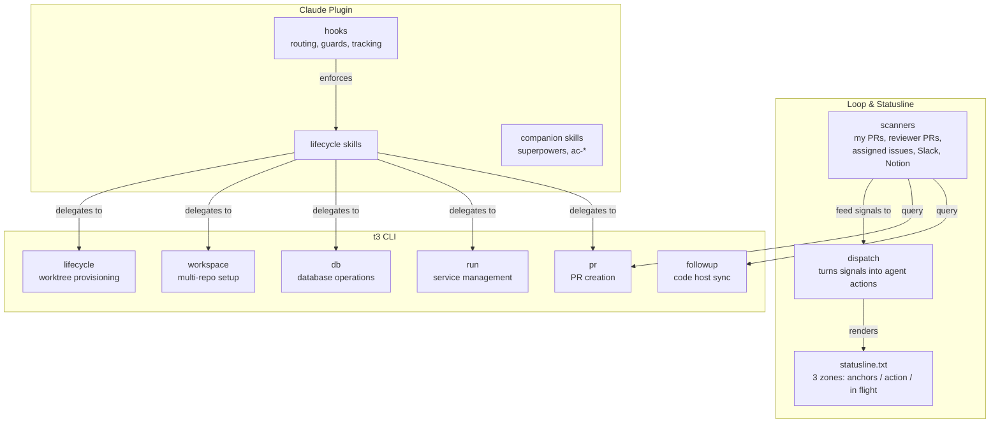
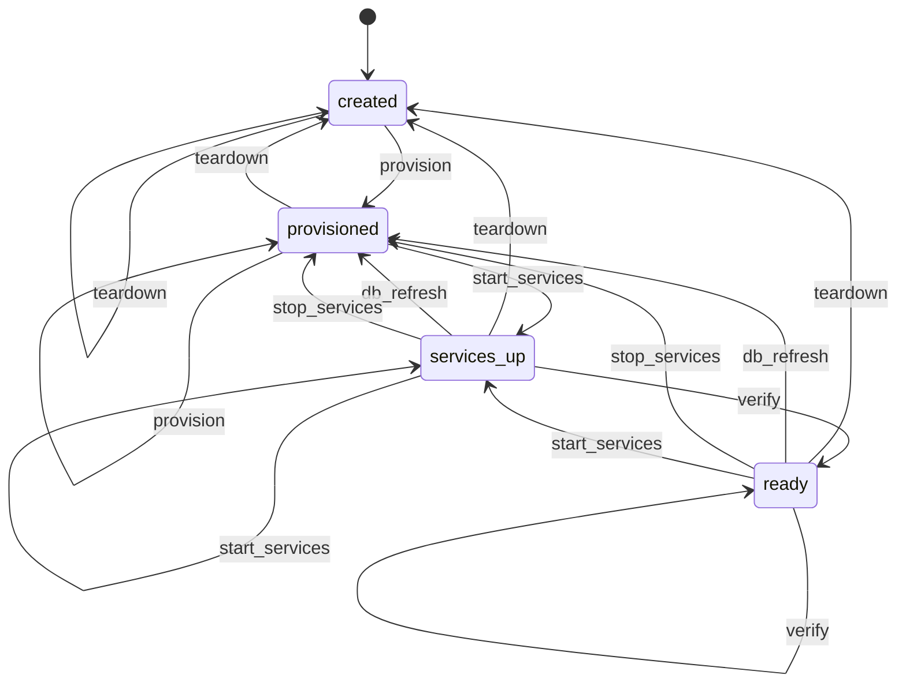
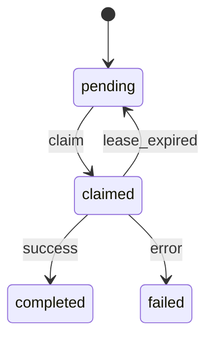
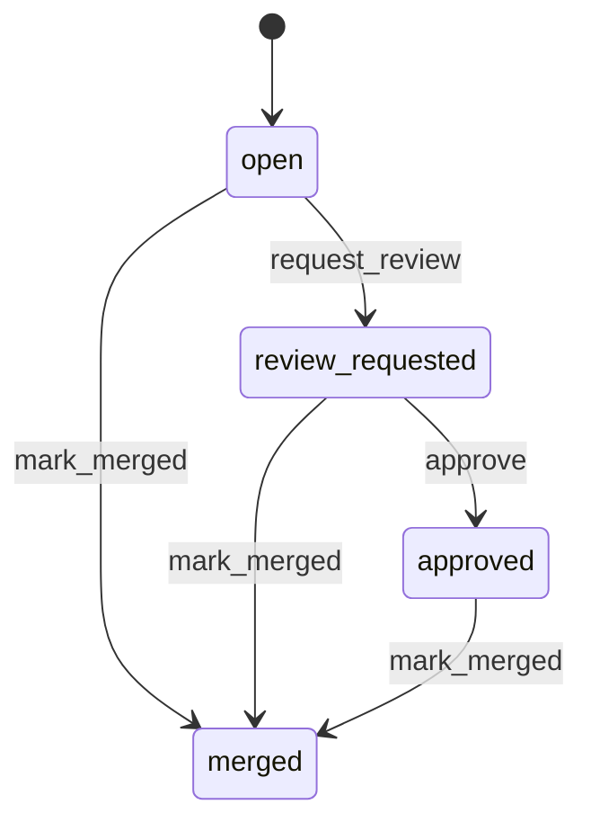
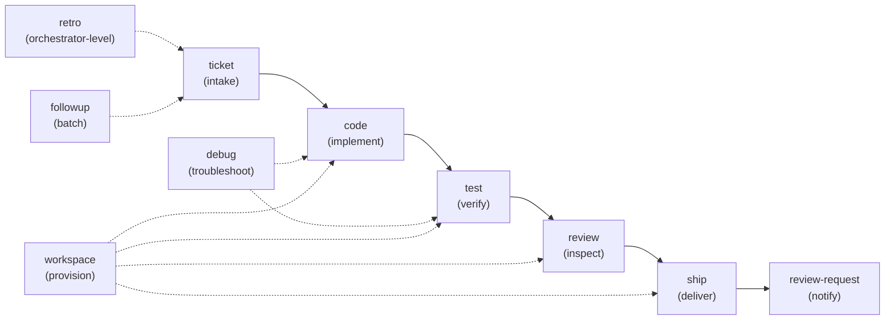

<!-- markdownlint-disable MD041 MD033 -->
<p align="center">
  
</p>

<p align="center">
  <a href="https://github.com/souliane/teatree/actions/workflows/ci.yml"></a>
  
  <a href="https://github.com/souliane/teatree/blob/main/LICENSE"></a>
</p>

A personal workflow harness wrapped around an AI coding agent. Single-author tool;
the code lives in a public repo in case any of it is useful to anyone else.

Experimental: APIs and config keys may change without backwards-compatibility guarantees — the only obligation is that all registered overlays are updated in the same change.

Teatree sits at the shell, alongside the editor. It turns a ticket URL into a
merged pull request by creating synchronized worktrees across the repos a ticket
touches, provisioning isolated databases and ports, driving the work through
code → test → review → ship phases, and keeping enough durable state to survive
context loss and long waits.

Under the hood it is a Django project with a plugin system (overlays) that adapts
it to a given set of repos, CI, and services.



## Gaps it tries to fill

Each section below names a piece of friction the author kept hitting and what
teatree does about it. None of these are framed as comparisons — other tools
solve some of the same shapes well, and teatree borrows from them where it can.

### A merge step that is neither a manual click nor a blind auto-merge

The author kept ending up at one of two extremes: either babysitting every
merge by hand (every PR a separate context switch back to the browser), or
flipping on full auto-merge and watching the agent merge PRs against branches
the reviewer had moved underneath. The first wastes the day; the second loses
trust in a single bad merge.

Teatree puts a two-step contract between "looks done" and "merged". An
orchestrator pass issues a per-diff CLEAR after an independent cold review;
a separate merge worker re-verifies the live HEAD SHA, the green checks, and
the non-draft state at the moment of merge, and refuses raw merge commands by
default. Two independent passes have to agree on the same SHA before the host
API gets called.

### Posting under your identity without losing track of what was posted

The author wanted the agent to handle Slack DMs, PR comments, MR approvals,
Notion writes — anything that normally needs a hand on the keyboard — without
the dread of finding out tomorrow that a message went to the wrong place or
under the wrong voice. Logs in `~/.shell_history` are not enough; the agent's
own claim about what it posted is the thing that needs verifying.

Every on-behalf write records an `OutboundClaim` row, then re-reads the target
surface (Slack permalink, GitLab note, Notion block) and compares the live
content against the claim. A drift means the post landed wrong, was edited, or
never made it; teatree surfaces those as actionable rows rather than silent
failures. Combined with an approval gate (`OnBehalfApproval`), nothing
colleague-facing ships unless the user has explicitly opted into either
per-action approval or end-to-end autonomy for that overlay.

### Workflow state that survives the session

The author kept losing the picture every time a conversation ended or
context got compacted — what was in flight, which PR was waiting on what,
which review was half-done. Rebuilding it from `gh pr list` and chat
history every morning gets old.

Teatree puts the state into a Django-backed SQLite/Postgres database:
`Ticket`, `Worktree`, `Task`, `PullRequest`, each with its own state
machine. Transitions are guarded methods (`Ticket.code()`, `Ticket.ship()`),
not free-form field writes — the predicates run, the dependent gates stay
aligned, illegal moves raise `InvalidTransitionError`. Snapshots before
context compaction get recovered automatically on the next session start.
Not perfect, but more reliable than picking up the picture from scratch.

### A chat-only operating model that does not block on a TTY

The author carries a laptop around and answers questions from a phone. Most
agent harnesses assume a TTY: when the agent has a question, the run blocks
until someone is in front of a terminal to answer. That makes long autonomous
sessions impossible — every clarifying question becomes a hard stop.

Teatree resolves an availability mode (`present` / `away` / `auto`). In `away`
mode, structured questions become durable `DeferredQuestion` rows instead of
blocking; the user answers them later from Slack, via `t3 teatree questions
answer`. The agent keeps working on whatever it can in the meantime. Replies
and prompts the user receives all happen in Slack DMs; no shared dashboard,
no shared SaaS, no DevOps onboarding.

### Multi-repo, multi-overlay worktree provisioning

The author's typical ticket is not "edit one file"; it is "change the backend,
the frontend, the translations bundle, and the CI config, all at once." Each
repo needs its own isolated worktree, its own database, its own ports, so two
tickets in flight do not collide on the same dev server.

`t3 <overlay> workspace ticket <url>` reads the ticket, decides which repos
are affected, creates one git worktree per repo under a single ticket
directory, allocates ports, provisions DBs, generates env files, and starts
the services. Each ticket runs in isolation; multiple tickets in flight share
no infrastructure. Overlay packages carry the project-specific glue
(which repos, which CI, which probes); the core stays generic.

### A long-running loop that turns signals into actions

The author kept noticing the agent only works while someone is actively
prompting it. PRs sit waiting for review nudges, CI failures go unreviewed,
ticket changes pile up in the inbox until someone glances at them.

A long-running `/loop` slot inside the interactive session ticks every ~12
minutes. Each tick fans out to scanners that watch assigned issues, open PRs,
PRs assigned for review, Slack mentions, the Notion bridge, and the local
task queue. Findings render to a statusline file the Claude Code statusline
hook reads in under 10ms, so live status sits at the top of every session
without polling. Lease-gated dispatch turns scanner findings into agent
actions when there is something to do, and keeps quiet when there is not.

## What teatree is NOT

A few honest scope statements, so anyone evaluating this knows what they are
looking at:

- **Not a shared corporate platform.** Single-author tool. No multi-tenant
  SaaS, no team dashboard, no SSO. It uses the user's own GitLab / GitHub /
  Slack credentials and runs on the user's laptop.
- **Not an IDE plugin.** It lives at the shell. The editor stays whatever
  editor the user prefers.
- **Not a replacement for the agent CLI.** Teatree wraps the agent CLI
  (currently Claude Code; the agent runtime is pluggable) with state, loops,
  integrations, and skills. The agent does the creative work; teatree does
  the mechanical work.
- **Not a stable, polished product.** It is in motion, expected to break,
  expected to change shape. The author dogfoods it daily on real client
  work; bugs surface fast because every broken edge stops a real ticket.

## Core concepts

Teatree coordinates work through **four state machines** — each transition is a
typed code path with tests, not a prompt the model might skip. The models live
in `src/teatree/core/models/` (`ticket.py`, `worktree.py`, `task.py`,
`pull_request.py`).

**Ticket** — tracks a unit of work from intake to delivery. The lifecycle phases
(ticket → code → test → review → ship) drive corresponding ticket states. The
full `Ticket.State` set is `not_started → scoped → started → planned → coded → tested →
reviewed → shipped → in_review → merged → retrospected → delivered`, plus
`ignored` for work that is consciously skipped. This diagram is generated from
the `Ticket` model's `@transition` decorators; edit the model, not the diagram
(`scripts/hooks/generate_fsm_diagrams.py`).

```mermaid
stateDiagram-v2
    [*] --> not_started
    not_started --> scoped : scope
    not_started --> reviewed : reconcile_reviewed
    not_started --> merged : reconcile_merged
    not_started --> delivered : mark_review_no_action
    not_started --> delivered : mark_reviewed_externally
    not_started --> ignored : ignore
    scoped --> started : start
    scoped --> reviewed : reconcile_reviewed
    scoped --> merged : reconcile_merged
    scoped --> delivered : mark_review_no_action
    scoped --> delivered : mark_reviewed_externally
    scoped --> ignored : ignore
    started --> started : start
    started --> planned : plan
    started --> reviewed : reconcile_reviewed
    started --> merged : reconcile_merged
    started --> delivered : mark_review_no_action
    started --> delivered : mark_reviewed_externally
    started --> ignored : ignore
    planned --> coded : code
    planned --> reviewed : reconcile_reviewed
    planned --> merged : reconcile_merged
    planned --> delivered : mark_review_no_action
    planned --> delivered : mark_reviewed_externally
    planned --> ignored : ignore
    coded --> started : rework
    coded --> tested : test
    coded --> reviewed : reconcile_reviewed
    coded --> merged : reconcile_merged
    coded --> delivered : mark_review_no_action
    coded --> delivered : mark_reviewed_externally
    coded --> ignored : ignore
    tested --> started : rework
    tested --> reviewed : reconcile_reviewed
    tested --> reviewed : review
    tested --> merged : reconcile_merged
    tested --> delivered : mark_review_no_action
    tested --> delivered : mark_reviewed_externally
    tested --> ignored : ignore
    reviewed --> started : rework
    reviewed --> reviewed : reconcile_reviewed
    reviewed --> shipped : ship
    reviewed --> merged : reconcile_merged
    reviewed --> delivered : mark_review_no_action
    reviewed --> delivered : mark_reviewed_externally
    reviewed --> ignored : ignore
    shipped --> started : reopen
    shipped --> shipped : ship
    shipped --> in_review : request_review
    shipped --> merged : reconcile_merged
    shipped --> ignored : ignore
    in_review --> started : reopen
    in_review --> reviewed : reconcile_reviewed
    in_review --> merged : mark_merged
    in_review --> merged : reconcile_merged
    in_review --> ignored : ignore
    merged --> started : reopen
    merged --> merged : mark_merged
    merged --> merged : reconcile_merged
    merged --> retrospected : retrospect
    merged --> ignored : ignore
    retrospected --> started : reopen
    retrospected --> reviewed : reconcile_reviewed
    retrospected --> retrospected : retrospect
    retrospected --> delivered : mark_delivered
    retrospected --> ignored : ignore
    delivered --> delivered : mark_review_no_action
```

<!-- BEGIN GENERATED: ticket-fsm -->

<!-- END GENERATED: ticket-fsm -->

**Worktree** — one repo checkout inside a ticket's workspace. This diagram is
generated from the `Worktree` model's `@transition` decorators; edit the model,
not the diagram (`scripts/hooks/generate_fsm_diagrams.py`).

<!-- BEGIN GENERATED: worktree-fsm -->

<!-- END GENERATED: worktree-fsm -->

**Task** — claimable work unit with lease and heartbeat. Unlike the others,
`Task` advances through guarded methods (`claim`, `complete`, `fail`, `reopen`)
that take a row lock and a lease rather than `@transition` decorators, so this
diagram is illustrative and maintained by hand, not generated.



**PullRequest** — tracks delivery state on the code host. This diagram is
generated from the `PullRequest` model's `@transition` decorators; edit the
model, not the diagram (`scripts/hooks/generate_fsm_diagrams.py`).

<!-- BEGIN GENERATED: pull-request-fsm -->

<!-- END GENERATED: pull-request-fsm -->

These models are surfaced in a small Django admin dashboard. A rendered HTML
snapshot of that dashboard is generated through Django's test client and
drift-checked in CI, so it stays an always-fresh "screenshot":
[docs/generated/dashboard/admin-index.html](docs/generated/dashboard/admin-index.html)
(`scripts/hooks/generate_dashboard_snapshot.py`).

The CLI gets the same treatment: the rendered output of the canonical `t3`
commands (`t3 --help`, `t3 loop --help`) is captured deterministically and
drift-checked, an always-fresh fixture that complements the exhaustive CLI
reference:
[docs/generated/cli/representative-output.md](docs/generated/cli/representative-output.md)
(`scripts/hooks/generate_cli_output_snapshot.py`).

Every state change goes through a method with code behind it. `Ticket`,
`Worktree`, and `PullRequest` use `django-fsm`-style `@transition` decorators
that declare the legal source and target states; `Ticket.code()` requires
`state == STARTED`, `Ticket.ship()` requires `state == REVIEWED`, and so on.
`Task` status moves through guarded methods (`claim`, `complete`, `fail`,
`reopen`) that take a row lock and a lease, raising `InvalidTransitionError`
on an illegal move. Agents do not write to these fields directly; they call
the transition, and the transition enforces its own preconditions. The same
rule applies to the CLI: any command that affects a state machine calls into
a transition, never mutates the field.

Agents read skills to do the *creative* work (writing code, reviewing a diff,
choosing how to test); the CLI owns the *mechanical* work (branching, ports,
DB refresh, pipeline waits, PR validation). Three interfaces sit on top:

- **CLI** (`t3 ...`) — the source of truth. Everything else is a view on top.
- **Loop & Statusline** — a long-running `/loop` slot scans signals,
  dispatches actions, renders a statusline file the Claude Code hook reads
  on every prompt.
- **Claude plugin** — skills and hooks that teach an agent how to drive the CLI.

## Three tiers

### 1. t3 CLI

The core of teatree. Django management commands handle everything
deterministic: state machines, port allocation, database provisioning,
worktree creation, PR validation, code host sync. Tested with >90% branch
coverage — no prose, no model variance.

```bash
t3 teatree worktree provision   # provision worktrees, DBs, ports for a ticket
t3 teatree worktree start       # start all services
t3 teatree workspace ticket     # create multi-repo worktrees from a ticket URL
t3 teatree db refresh           # restore a database dump
t3 teatree pr create            # create a pull request with metadata validation
t3 teatree followup sync        # sync tickets and PRs from code host
t3 cost                         # cycle-to-date SDK-equivalent spend + effective-token (ET) totals, split by subscription/metered lane
t3 capabilities --json          # machine-readable registry of which t3 commands emit JSON and their exit-code contract (a front-end drives teatree from this)
t3 speak                        # read text aloud on local speakers per [teatree.speak] (no-op unless local = all)
t3 recover                      # find/recover work stranded by a network-outage death (dry-run by default)
t3 mutation run                 # scoped mutation testing — mutate only the high-value safety modules a diff touches
t3 ui                           # browse and run the whole command tree in a terminal UI (needs `uv sync --group ui`)
t3 admin                        # run the Django admin for the teatree project on a local dev server
t3 mcp serve                    # serve teatree's structured search (tickets, worktrees, tasks, loop stats, incoming events) as a read-only MCP server over stdio
                                 # registered automatically via the plugin-bundled .mcp.json (surfaces as mcp__teatree__* tools) — `t3 setup`/`t3 doctor check` verify it
t3 dream run [--since <iso>] [--dry-run]  # run one memory-consolidation pass NOW (ignores cadence)
t3 dream tick                   # cadence-gated cron entry point (~04:00 schedule, decoupled from live loop)
```

> Replace `teatree` with your overlay's name (`t3 <overlay>`) when working in
> another overlay.

`t3 ui` is a [trogon](https://github.com/Textualize/trogon)-backed browser for
the full `t3` command tree (core plus every installed overlay). It is in the
optional `ui` dependency group — install it with `uv sync --group ui` before the
first run.

`t3 admin` runs the Django admin for the teatree project on a local dev server
(`http://127.0.0.1:8000/admin/` by default). It applies migrations, ensures a
superuser exists — creating one non-interactively when absent and printing its
generated password (override via `T3_ADMIN_USER` / `T3_ADMIN_PASSWORD`) — and
opens the browser at `/admin/` (`--no-browser` to skip; `--host` / `--port` to
override). The admin binds to the same teatree database every other `t3` command
reads, so no overlay context is needed.

### 2. Loop & Statusline

A set of long-running `/loop` slots in the interactive Claude Code session drives
the day — one `/loop` per enabled DB `Loop` row (#2650), each firing
`t3 loops tick --loop <name>` on its own cadence. Those ticks fan out to
scanners that watch assigned issues, open PRs, PRs assigned for review, Slack
mentions, the Notion → GitLab bridge, and the local task queue. Findings render
to `${XDG_DATA_HOME:-~/.local/share}/teatree/statusline.txt` (three zones:
anchors / action needed / in flight). The Claude Code statusline hook `cat`s
that file in <10ms, so live status sits at the top of every session without
polling.

```bash
# Spawn the loop-owner session (registers one /loop per enabled loop):
t3 loop start

# Or, from inside an existing session, register one loop's /loop manually:
/loop 12m Run `t3 loops tick --loop dispatch`.

# Out of band, run one by-hand full-scan tick or read the last-rendered statusline:
t3 loop tick
t3 loop status

# List the DB-configured autonomous loops (name, enabled, delay, last run, next due):
t3 loops list
```

The cadence is configurable via `T3_LOOP_CADENCE` (seconds), or by setting
`loop_cadence_seconds` in `~/.teatree.toml` (env wins; default `720`). To stop
the loop, run `/loop unregister t3-loop` in the Claude Code session.

**Wire up the Claude Code statusline hook** so the rendered file actually shows
in the bottom bar. This is a top-level `statusLine` key in
`~/.claude/settings.json` — enabling the `t3` plugin does **not** wire it for
you: a plugin's `settings.json` only honours the `agent` and
`subagentStatusLine` keys, so a `statusLine` declared there is silently ignored.
Point the command at an absolute path to the script (the user-level settings
file does not expand `${CLAUDE_PLUGIN_ROOT}`):

```json
{
  "statusLine": {
    "type": "command",
    "command": "bash /absolute/path/to/teatree/hooks/scripts/statusline.sh"
  }
}
```

### 3. Claude Plugin

Skills and hooks that drive AI-assisted development. Each skill covers one phase
of the development lifecycle — ticket intake, coding, testing, review, shipping
— and contains the methodology, guardrails, and domain knowledge the agent needs
to do the work well: TDD discipline, debugging process, review checklists, retro
learning, verification rules. Skills declare dependencies (`requires:`) and
optional companion skills (`companions:`) from third-party packages like
[superpowers](https://github.com/obra/superpowers). Hooks handle automatic skill
routing, branch protection, and session tracking.

Skills use the CLI for infrastructure (worktrees, databases, ports, CI), but the
actual development work — writing code, reasoning about architecture, reviewing
diffs, running retros — is guided by skill content, not CLI commands.

### Workflow guarantees

A few rules in the lifecycle skills are non-negotiable. They exist because each
one prevents a specific class of failure that has bitten a real session:

- **PRs go through `t3 <overlay> pr create`.** Raw `gh pr create` /
  `glab mr create` skips the shipping gate (testing + reviewing phases), the
  visual-QA gate, and the title/description validator. The CLI is the only path
  that runs every guard; using it is mandatory whenever the overlay exposes
  the subcommand.
- **The `reviewing` phase is satisfied by an independent sub-agent, not by
  self-review.** Before push, the implementing conversation spawns the
  `t3:reviewer` sub-agent (read-only, no edits) and applies its findings.
  Self-review against repo rules is a complement, not a substitute — the
  implementer's context carries the same blind spots that allowed the gap.
- **State machine changes happen via transitions, never via direct field
  writes.** This holds for both code and CLI: every command that affects a
  state machine must call into a transition (`Ticket.code()`,
  `Ticket.review()`, `Ticket.ship()`, etc.) so the predicates run and the
  dependent gates stay aligned.
- **Mass renames and cross-cutting refactors require an exhaustive sweep
  before "done".** A single `rg` pass is not enough — the agent runs every
  surface form (plain, quoted, attribute access, subscript, CamelCase
  variants, sibling repos) and confirms zero hits before claiming the rename
  is complete.
- **A PUBLIC-repo PR never auto-merges unless its author is trusted.** On a
  public repo anyone who is not the user is a potential malicious actor, so the
  merge keystone refuses to auto-merge a PR whose author is not one of the
  user's known identities (fail-closed: an unknown, empty, or unfetchable
  author is refused; an unresolvable repo visibility is treated as public).
  Private/internal repos skip the check entirely — the user owns access
  control there. The trusted set lives in the DB; manage it with
  `t3 identities {seed,add,list,remove}` (the configured `user_identity_aliases`
  is the fallback during the config-to-DB migration window). The same trust
  classifier flags an untrusted public-repo PR as adversarial across the
  reviewing scanners, so a malicious PR is never treated like a colleague's.

These rules live in the `ship`, `review`, `code`, and `rules` skills. The CLI
enforces what it can mechanically (gate checks, transition predicates); the
skills carry the rest.

## Get Started

**Prerequisites:** Python 3.13+, [uv](https://docs.astral.sh/uv/).

### For users

Teatree is not on PyPI. Install the `t3` CLI straight from the repo:

```bash
uv tool install --from git+https://github.com/souliane/teatree.git teatree   # installs `t3` globally
apm install -g souliane/teatree   # installs skills + companion dependencies
t3 setup                          # links plugin, syncs skills, migrates self-DB
t3 startoverlay my-overlay ~/workspace/my-overlay
```

`uv tool install` puts `t3` in `~/.local/bin/`. If that directory is not on your
`PATH`, add `export PATH="$HOME/.local/bin:$PATH"` to your shell rc.

Installing the plugin does **not** force teatree on. By default a fresh Claude
session does not auto-engage teatree — no skill auto-suggest, no load-block, no
loop scheduling — and just shows a one-line how-to. Run `/teatree` (or load any
`t3:` skill) to engage teatree for that session, or set `[teatree] autoload =
true` in `~/.teatree.toml` (env `T3_AUTOLOAD=1`) to auto-engage every session.

### For contributors

[Fork the repo](https://github.com/souliane/teatree/fork), then:

```bash
git clone git@github.com:YOUR_USERNAME/teatree.git ~/workspace/teatree
cd ~/workspace/teatree
uv tool install --editable .   # global `t3` binary, live-reloaded from this clone
t3 setup                       # installs skills globally, respects local symlinks
```

New here? [`docs/MAP.md`](docs/MAP.md) lists every package directory with a one-line
purpose and links to the relevant `BLUEPRINT.md` section — read it first to
find where something lives.

`uv tool install --editable .` produces the same global `~/.local/bin/t3` as
the user flow — edits in this clone take effect on the next invocation, no
`uv run` prefix. `t3 setup` runs [APM](https://github.com/microsoft/apm) to
install companion dependencies (superpowers, ac-django, etc.), symlinks teatree
skills to `~/.claude/skills/`, registers the Claude plugin in
`~/.claude/plugins/installed_plugins.json` with `installPath` pointing at the
clone so hooks and agents always read from the live checkout, applies any
pending self-DB migrations, and — if `t3` is not on `PATH` — re-runs
`uv tool install --editable .` to self-install. Must be run from the main
clone, not a worktree.

`t3 setup` also self-heals when teatree adds a new dep: editable installs do
not auto-resync their venv when `pyproject.toml` changes, so on every run
`t3 setup` compares the declared `[project].dependencies` against the dists in
the running interpreter and re-runs `uv tool install --editable . --reinstall`
automatically when anything is missing. After the reinstall, setup re-execs
itself against the refreshed venv. No manual `--reinstall` step is needed when
pulling teatree updates.

## Skills

Each skill teaches the agent one phase of development:



<!-- BEGIN SKILLS -->
| Skill | Phase |
|-------|-------|
| `answerer` | Draft a reply to an inbound question, DM the user for approval, post on confirmation |
| `architecture-design` | Architecture pre-check companion. Loaded transitively by implementation skills (code, ticket-for-features, retro-for-skill-changes) to force an architecture pass — BLUEPRINT alignment, FSM phase boundaries, extension-point contracts, component boundaries, dependency direction, test surface, resilience invariants — BEFORE any code is written. |
| `availability` | 24/7 dual question-mode — switch between asking the user now (present) and capturing questions as durable `DeferredQuestion` rows (away) |
| `checking` | A SHORT "what did I miss" report when the user checks in mid-loop — terse, grouped, clickable; then answer the pending deferred questions in-band |
| `cleanup-sweep` | Use when sweeping stale, lost, or abandoned worktrees, branches, or stashes that are NOT actively being worked — deciding per item whether to salvage unmerged work to a fresh PR, delete a shipped/superseded/redundant item, push post-merge commits to a new PR, or keep an uncertain one. The judgment layer over `t3 <overlay> workspace emit` / `salvage` / `clean-all` (the mechanical reaper is `/t3:workspace`) |
| `code` | Writing code with TDD methodology |
| `contribute` | Push retro improvements to a branch, open a PR, and optionally create upstream issues |
| `debug` | Troubleshooting and fixing — something is broken, find and fix it |
| `dogfooding-teatree` | Dogfooding teatree's own CLI, loop, and statusline — two modes sharing one mechanics section for reading a tick and the rendered statusline. "Verify a change" is the run-it-yourself checklist applied after modifying CLI/loop/statusline code, before declaring it done. "Hunt for bugs" is proactive self-QA — dogfood the deployed loop, find/dedupe/confirm real bugs, file them, then fix them in worktrees |
| `dreaming` | Runs the idle-time "dreaming" memory-consolidation pipeline end to end with one command — replay recent transcripts + curated memories, distil drift into the ConsolidatedMemory ledger, cross-link / re-index / decay the memory files, run the §4 acceptance gates, triage each row into keep-as-memory vs core-gap → drive each core gap to a MERGED fix under the standing umbrella issue, and promote/stage eval candidates |
| `e2e` | End-to-end testing with Playwright — writing tests, running them, visual snapshots, test-plan posting, and the pre-push visual QA gate |
| `e2e-review` | Reviewer-side quality gate for Playwright end-to-end specs. Load when reviewing a new or changed E2E test, deciding whether a spec is ready to land, or adopting an outside Playwright suite. Judges specs against Playwright's published best practices — user-visible behaviour over implementation, resilient role/label/test-id locators, web-first auto-retrying assertions instead of hard waits, per-test isolation, page-object structure, and runnable evidence — and tells the implementer what to fix before approval. |
| `followup` | Daily follow-up — batch process new tickets, check/advance ticket statuses, remind about PRs waiting for review |
| `handover` | Use when the user wants to hand all current work from one Claude session to another (or to a not-yet-existing session) with a single command, or to transfer an in-flight TeaTree task from Claude to another runtime, or asks whether it is time to switch because Claude usage is getting high. |
| `loops` | Show t3 loop status and trigger DB-configured loops — which loops are running vs stalled, the cadence/next-tick of each, loop ownership, and how to trigger a per-loop tick |
| `next` | Wrap up the current session — retro, structured result, pipeline handoff. |
| `platforms` | Platform-specific API recipes for GitLab, GitHub, Slack, and X (Twitter). Auto-loaded as a dependency by skills that interact with these platforms. |
| `prompts` | Trigger and manage reusable prompts — list the prompts in the DB, render one by name with its templated params, and point to the admin for authoring + version history |
| `retro` | Conversation retrospective and skill improvement |
| `review` | Code review — self-review before finalization, giving review, receiving review feedback |
| `review-request` | Batch review requests — discover open PRs, validate metadata, check for duplicates, post to review channels |
| `rules` | Cross-cutting agent safety rules — clickable refs, temp files, sub-agent limits, UX preservation. Auto-loaded as a dependency by other skills. |
| `running-evals` | Single in-session entrypoint that auto-orchestrates the whole eval picture — free deterministic lanes (skill-triggers, the eval-coverage gate `t3 eval coverage`, pinned-regressions) plus the transcript AI/trajectory lane (prepare → produce transcripts in-session → grade) — and prints one unified results table |
| `scanning-news` | Scans today's TLDR AI and The Rundown AI editions for ideas that could improve teatree, fetches the full article for promising items, queues each concrete t3-improvement candidate behind an ask-gate (PendingArticleSuggestion) for per-article user approval before any souliane/teatree issue is filed, and posts a terse Slack DM summary |
| `setup` | Bootstrap and validate teatree for local use — prerequisites, config, skill symlinks, optional agent hooks, and Django project scaffolding |
| `ship` | Delivery — committing, pushing, creating MR/PR, pipeline monitoring, review requests |
| `speed` | The parallel-work throughput dial — slow / medium / full / boost. `boost` runs one parallel-backlog-blast wave; `full` arms a self-sustaining boost loop; `medium` (baseline) and `slow` cap concurrency |
| `sweeping-prs` | Maintenance sweep across all your open PRs/PRs — merge the default branch, fix conflicts, monitor CI, push, and (per-repo policy) optionally squash-merge each PR before moving to the next. Never rebases |
| `sweeping-tickets` | Evidence-gated ticket/issue consolidation and triage — classify every open issue against current `main`, then consolidate by merging related tickets into a small set of tracking epics (never by discarding ideas) and close only what is demonstrably shipped or now folded into an epic. Always asks the operator for the maximum number of tickets/epics to keep before triaging — never assumes a number. Dry-run first; close only on user approval (or auto-close ONLY the high-confidence "shipped by merged PR #X" class), posting a one-line reason on every close |
| `teatree` | TeaTree agent lifecycle platform — core architecture, lifecycle phases, CLI reference, overlay API, skill loading, and plugin hooks |
| `teatree-batch` | Unattended batch ticket processing — work through a prioritized backlog one ticket at a time, sequentially. Create worktree, implement with TDD, self-review, push, merge, clean up. Skip tickets that need design decisions |
| `test` | Testing, QA, and CI — running tests, analyzing failures, quality checks, CI interaction, test plans, and posting testing evidence |
| `ticket` | Ticket intake and kickoff — from zero to ready-to-code |
| `todos` | List the current session's tasks/todos — terse, grouped pending / in_progress / completed, with clickable refs |
| `update` | WHEN to bring teatree core and registered overlays up to date with their default branch, and the safety guarantees of doing so |
| `workspace` | Environment and workspace lifecycle — worktree creation, setup, DB provisioning, dev servers, cleanup |
<!-- END SKILLS -->

### Extended `SKILL.md` frontmatter

Teatree adds a small schema on top of Claude Code's standard `SKILL.md`
frontmatter so skills can declare *when* they should load and *what* they need
alongside them:

```yaml
---
name: ship
triggers:
  priority: 20
  keywords: ['\b(commit|push|ship)\b']
  exclude: '\breview\b'
  end_of_session: true
requires: [rules, platforms]
companions: [verification-before-completion]
search_hints: [deliver, merge request, PR]
---
```

- `triggers` — deterministic auto-load rules (keywords, URLs, priority, exclude,
  end-of-session phrases)
- `requires` — hard dependencies, resolved transitively with cycle detection
- `companions` — optional third-party skills (e.g. from
  [obra/superpowers](https://github.com/obra/superpowers), installed via
  [APM](https://github.com/microsoft/apm), never modified by teatree)
- `search_hints` — keyword synonyms used to route headless tasks to the right
  skill

The `UserPromptSubmit` hook matches the prompt against a cached trigger index
and injects `LOAD THESE SKILLS NOW: ...`. `PreToolUse` blocks edits until the
injected skills are loaded. Matching is regex, not the model — skill loading
is no longer the agent's decision.

See [docs/skill-triggers.md](docs/skill-triggers.md) for the full schema and
[docs/claude-code-internals.md](docs/claude-code-internals.md) for how the
hooks wire into Claude Code.

## Overlays

Teatree's core is generic — it does not know about specific repos, CI, or
environment defaults. Project-specific behaviour lives in a lightweight overlay
package that subclasses `OverlayBase` and registers via the `teatree.overlays`
entry point. The overlay carries the project's repos, provisioning steps,
runtime metadata, and service hooks; the core stays the same across projects.

Create one with:

```bash
t3 startoverlay my-overlay ~/workspace/my-overlay
```

The overlay registers via a `teatree.overlays` entry point:

```toml
[project.entry-points."teatree.overlays"]
my-overlay = "myapp.overlay:MyOverlay"
```

Once installed (`pip install -e .`), the overlay is auto-discovered at startup.
The overlay implements the narrow contract teatree needs: managed repos,
provisioning steps, runtime metadata, and project-specific service hooks. See
[docs/overlay-api.md](docs/overlay-api.md) for the full API.

Overlays can live anywhere; they do not need to be vendored into this repo.
The author dogfoods this on a private client-codebase overlay; the same
extension point is what any other consumer would use.

## Configuration

Teatree reads its config from `~/.teatree.toml`. Every key is optional; the
table below lists the ones most users touch. The full set and their defaults
live in `UserSettings` in `src/teatree/config/settings.py`.

```toml
[teatree]
workspace_dir = "~/workspace"            # where ticket workspaces are created
mode = "interactive"                      # "interactive" (default) | "auto"
privacy = ""                              # privacy-scan profile name
contribute = false                        # enable skill self-improvement
excluded_skills = ["my-custom-skill"]     # extra skills to exclude
loop_cadence_seconds = 720                # /loop tick interval (default 12 min)
require_human_approval_to_merge = true    # auto mode: still gate merge on a 👍 / /merge
require_human_approval_to_answer = true   # gate t3:answerer behind a DM confirmation
agent_signature = false                   # append an AI signature to posts (default off)

[teams]
enabled = false                           # master agent-teams off switch (default)

[overlays.my-overlay]
path = "~/workspace/my-overlay"
```

| Key | Default | Effect |
|-----|---------|--------|
| `workspace_dir` | `~/workspace` | Root for per-ticket workspace directories |
| `mode` | `interactive` | `interactive` confirms before publishing; `auto` is end-to-end |
| `privacy` | `""` | Named privacy-scan profile applied before pushes |
| `contribute` | `false` | Allow `t3:retro` to write fixes into core skills |
| `excluded_skills` | `[]` | Skills excluded on top of the built-in exclusions |
| `loop_cadence_seconds` | `720` | Default cadence (seconds) for a loop's ticks |
| `require_human_approval_to_merge` | `true` | In `auto` mode, merge still needs a 👍 / `/merge` |
| `require_human_approval_to_answer` | `true` | `t3:answerer` drafts a reply and DMs for approval |
| `agent_signature` | `false` | Whether posts made on your behalf carry an AI signature |
| `teams.enabled` | `false` | Master agent-teams off switch — `false` (default) keeps the classic in-session sub-agent fan-out; toggle with `t3 teams on` / `t3 teams off` (`t3 teams status` to read) |

The `t3:contribute` skill's push gate is the `T3_PUSH` environment variable
(default `false`), not a TOML key — it exists as a deliberate stop for
privacy review before any skill improvement leaves the machine.

Run `t3 setup` after editing `~/.teatree.toml` to apply changes to skill
symlinks and caches.

### Operating mode

`teatree.mode` (or the `T3_MODE` env var) controls how much autonomy the agent
has for publishing actions:

- `interactive` *(default, conservative on security)* — the agent pauses for
  explicit approval before push, MR create, MR merge, Slack posts, or any other
  write that leaves the local machine.
- `auto` — opt-in end-to-end autonomy. The agent ships complete features
  without confirm prompts: push → MR create → pipeline watch → merge → clean up
  remote branches. Quality gates (lint, tests, migrations check) still run;
  they just do not depend on user confirmation. A small always-gated list
  remains regardless of mode: force-push to default branches, history rewrites
  on shared defaults, destructive shared-DB operations, and external writes the
  active overlay has not authorised.

Unknown values raise an error — a typo in `mode` will never silently downgrade
to a less-safe mode.

A subset of `[teatree]` keys can be **overridden per-overlay** in
`[overlays.<name>]`. The overridable set lives in
`OVERLAY_OVERRIDABLE_SETTINGS` in `src/teatree/config/settings.py`: `mode`,
`agent_runtime`, `contribute`, `excluded_skills`,
`loop_cadence_seconds`, `require_human_approval_to_merge`, and
`require_human_approval_to_answer`. For example, run `auto` mode on a personal
dogfooding overlay while keeping `interactive` on a client project:

```toml
[teatree]
mode = "interactive"

[overlays.my-project]
mode = "auto"
```

The resolution chain is, first match wins: `T3_*` env var → active overlay's
`[overlays.<name>]` override → global `[teatree]` value → `UserSettings`
default. See `BLUEPRINT.md` § 10.1.1 for the full details.

## Contributing & Self-Improvement

After every non-trivial session, the `retro` skill runs a retrospective,
extracts what went wrong, and writes fixes back into skill files. When
contributors enable this (`contribute = true` in `~/.teatree.toml`),
improvements flow back upstream through a fork-based model.

**Where improvements go:**

- `contribute = false` (default): improvements go to the project overlay only
- `contribute = true`: the agent also improves core skills, pushes to a
  branch, opens a PR

Nothing is ever pushed without explicit consent. The `contribute` skill shows
exactly what will be pushed, runs privacy scans, and checks fork divergence
before creating PRs.

```bash
# Run tests locally
uv run pytest               # full suite, parallel (-n auto), no coverage — fast default
bash dev/test-cov.sh        # coverage lane: --cov --doctest-modules, 93% floor (CI parity)

# Pre-commit checks
prek run --all-files         # ruff, codespell, banned-terms
```

### E2E Tests

E2E tests run via `t3 <overlay> e2e run`, which dispatches to the in-repo
pytest-playwright runner or an external playwright repo based on
`OverlayBase.get_e2e_config()`. Overlays declare `"runner": "project"` or
`"runner": "external"`; the runner is overlay-agnostic from the call site:

```bash
t3 <overlay> e2e run                          # CI default
t3 <overlay> e2e run --headed                 # interactive debug
t3 <overlay> e2e run --update-snapshots       # accept new snapshots
```

**Failure triage artifacts** (git-ignored, mounted writable into the e2e
container):

- `e2e/.logs/server-<ISO>-<worker>.log` — captured stdout/stderr from the
  live ASGI server. Path is printed on every test failure via
  `pytest_runtest_makereport`.
- `e2e/.videos/<test-name>/<rand>.webm` — Playwright video recording. Only
  retained for **failing** tests (passing tests delete their video on teardown
  to keep CI artifact size small).

In CI, attach the `e2e/.logs/` and `e2e/.videos/` directories as job artifacts
and link them from the failed run summary so reviewers can replay the failure
without rerunning the suite.

## Security Considerations

Skills are prompt instructions — they control what your AI agent does. This
makes the supply chain a security surface.

**Safe defaults:** self-improvement is off, pushing is disabled, and there is
no auto-update mechanism. All pushes go to branches (never main) and require
a PR. APM dependencies are pinned to specific commit SHAs in `apm.yml`.

**Supply chain:** `t3 setup` verifies that skills are loaded via symlinks to
the local clone — not stale copies. If you use a fork from someone else, you
are trusting that person's skill files as agent instructions. Review changes
before pulling.

**Leak backstop:** the banned-terms gate scans diffs, commit messages, and
publish-surface bodies — but a customer/tenant brand name already committed
never appears in a later diff, so it would stay hidden. `t3 banned-terms
scan-tree` is the full-tree backstop: it walks every git-tracked file (`git
ls-files`) and scans its content for the high-confidence brand list, exiting
non-zero with the offending `file:line` list. Its matcher is
underscore-tolerant — `wt_777_<brand>` and `<brand>_x` are caught where the
diff gate's word-boundary matcher misses them — while common-word entries keep
strict boundaries (no substring noise) and the email carve-out is preserved.
The brand list comes from `[teatree].banned_brands` in `~/.teatree.toml` or the
`$TEATREE_BANNED_BRANDS` environment variable; it is a curated high-confidence
subset (brand-only — common words stay in `banned_terms` so the
underscore-tolerant tree scan never substring-matches them). The public repo
ships with none, so the brand scan is a no-op — but it reports a loud
`brand backstop INERT: banned_brands is unpopulated` warning rather than a
silent clean line, so an operator who expected the backstop to be active can
tell it is not yet populated. A CI job runs the scan on push to `main` and on a
daily schedule.

## Project Structure

```text
teatree/
  src/teatree/         # Django project (installed as `teatree`)
    cli/               #   Typer CLI package — bootstrap commands
    core/              #   Models, FSM transitions, management commands
    agents/            #   Agent runtime adapters (Claude Code, Codex)
    backends/          #   Code-host (GitHub, GitLab) + messaging (Slack, Notion) Protocols
    loop/              #   Fat /loop tick — scanners, dispatch, statusline render
    utils/             #   Internal helpers (ports, git, DB)
    templates/overlay/ #   `t3 startoverlay` scaffolding
  skills/              # AI agent skills (SKILL.md + references)
  hooks/               # Agent platform hooks (routing, guards, statusline)
  scripts/             # Pre-commit hooks, utility scripts
  tests/               # Unit tests (>90% branch coverage)
  docs/                # MkDocs documentation site
```

## Where it is headed

Teatree stays a single-author tool for now. The plan is to keep dogfooding it
on real client work, let the rough edges surface through daily use, and only
broaden adoption once the patterns it relies on have been pushed through
enough sessions to be trustworthy. The public repo is a side effect of that
workflow — the code lives somewhere reachable in case any of the patterns
help someone else, not as a finished product looking for users.

**Why "teatree"?**

**TEA**'s **E**xtensible **A**rchitecture for work**tree** management.

## License

MIT
