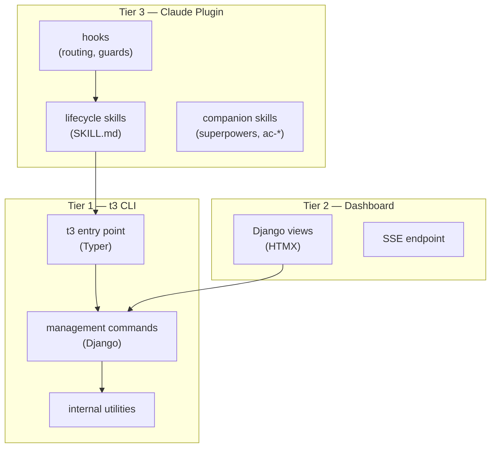

# Architecture

Teatree is structured in three tiers:



## Tier 1: t3 CLI

The command split has three levels:

1. **CLI commands** (`teatree/cli/`) — the `t3` entry point. Commands that don't need Django (like `startoverlay`, `ci`, `setup`, `review-request`) live here as plain Typer groups. Commands that need the database are bridged to management commands after Django bootstrap.

2. **Management commands** (`teatree/core/management/commands/`) — Django management commands that touch the database. These handle lifecycle transitions, workspace operations, DB refresh, MR validation, task queue processing, and follow-up. They use [django-typer](https://github.com/bckohan/django-typer) for a typed CLI interface.

3. **Internal utilities** (`teatree/utils/`) — helper modules for git operations, postgres interaction, and other low-level work. These are not exposed as commands; they're used by the layers above.

## Tier 2: Dashboard

A Django/HTMX web UI served via uvicorn. Views in `teatree/core/views/` surface tickets, MRs, pipelines, sessions, and actions. SSE provides live updates. Project overlays can customise the dashboard via the overlay API.

## Tier 3: Claude Plugin

Skills and hooks that drive AI-assisted development. Skills encode the methodology, guardrails, and domain knowledge for each lifecycle phase — the agent uses the CLI for infrastructure, but skills guide the actual coding, debugging, reviewing, and shipping. Installed as a Claude Code plugin via `t3 plugin install` or `apm install souliane/teatree`.

- **Skills** (`skills/`) — one per lifecycle phase, with `requires:` for hard dependencies and `companions:` for optional third-party skills
- **Hooks** (`hooks/`) — `UserPromptSubmit` (skill routing), `PreToolUse` (branch protection, skill enforcement), `PostToolUse` (repo tracking, skill tracking), statusline

## Models

Five models in `teatree/core/models/` track the state of ongoing work:

| Model | Purpose |
|-------|---------|
| **Ticket** | Tracks a unit of work through its lifecycle (not_started -> scoped -> started -> coded -> tested -> reviewed -> shipped -> merged -> delivered). Uses django-fsm for state transitions. |
| **Worktree** | Represents one repo checkout within a ticket's workspace. Tracks allocated ports, DB name, and its own lifecycle (created -> provisioned -> services_up -> ready). |
| **Session** | An agent session working on a ticket. Records which phases have been visited and enforces quality gates. |
| **Task** | A unit of work that can be claimed by an SDK worker or routed to a human for input. Supports lease-based claiming with heartbeats. |
| **TaskAttempt** | Records each execution attempt of a task, with exit code and artifact path. |

## The overlay pattern

Teatree is generic — it doesn't know your repos, CI setup, or environment. Project-specific behaviour lives in a separate Python package (the "overlay") that subclasses `OverlayBase`.

Overlays register via `teatree.overlays` entry points in their `pyproject.toml`:

```toml
[project.entry-points."teatree.overlays"]
my-overlay = "myapp.overlay:MyOverlay"
```

The overlay loader discovers all installed overlays from entry points at startup, instantiates each class, and caches them. Multi-overlay is supported — models carry an overlay field and the dashboard offers a selector when more than one overlay is present. Management commands call overlay hooks when they need project-specific information — which repos to manage, how to provision a worktree, what services to start, how to validate an MR.

See [Overlay API](overlay-api.md) for the full contract.

## Package layout

```
src/teatree/
  cli/               # Typer CLI package — bootstrap commands
  core/              # Models, managers, selectors, views, management commands, templates
  agents/            # Runtime adapters for AI agent platforms
  backends/          # Integration backends (GitLab, Slack, Notion)
  utils/             # Git, postgres, and other internal helpers
  overlay_init/      # Templates for `t3 startoverlay`
  config.py          # ~/.teatree.toml parsing, overlay discovery
  skill_loading.py   # Skill selection policy
  skill_deps.py      # Dependency and companion resolution
```
