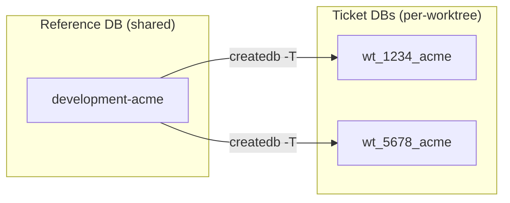
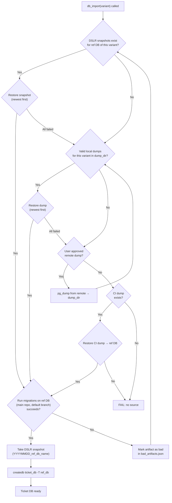
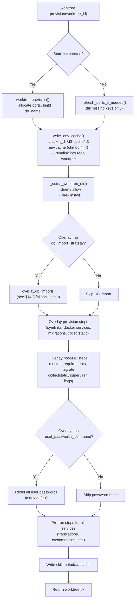
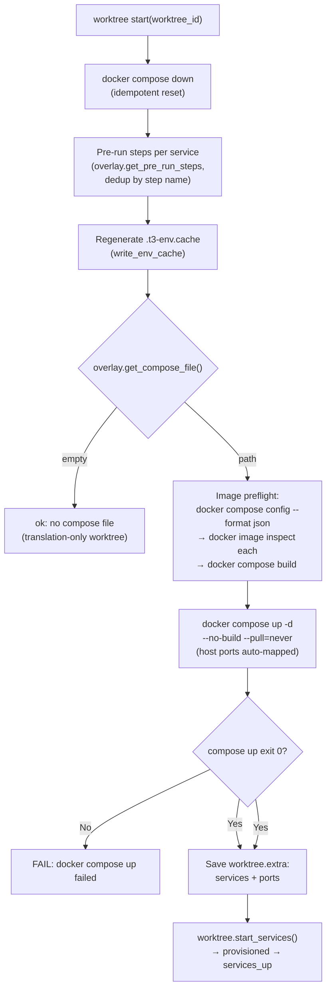
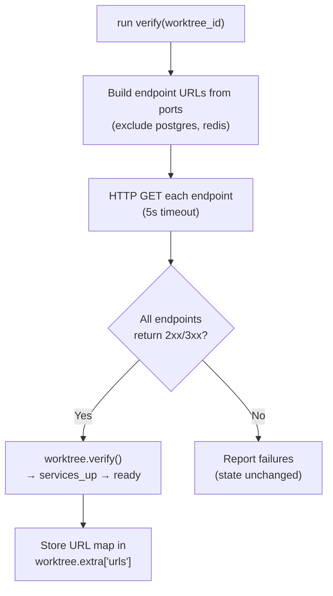

# BLUEPRINT Appendix — Django Project Workflows

Detail behind [BLUEPRINT.md](../../BLUEPRINT.md) §14 (DB provisioning, import fallback, migrations, post-import, DSLR, validation, worktree provision/start, state reconciler).

## 14. Django Project Workflows

Teatree provides a generic Django database provisioning engine in `teatree.utils.django_db`. This engine handles the full lifecycle of creating, importing, and maintaining per-worktree databases for Django projects. Overlays configure the engine; they do not reimplement it.

### 14.1 Reference DB Architecture

Teatree uses a **two-tier database pattern** for Django projects:

1. **Reference DB** — a long-lived local database (e.g., `development-acme`) that mirrors the dev/staging environment. Shared across all worktrees for the same variant. Updated infrequently (when a fresh dump is fetched or DSLR snapshot is taken).
2. **Ticket DB** — a per-worktree database (e.g., `wt_1234_acme`) created as a **Postgres template copy** (`createdb -T`) of the reference DB. Instant creation, full isolation.



**Why template copy:** `createdb -T` is a filesystem-level copy inside Postgres — it takes seconds regardless of DB size, versus minutes for a full dump-and-restore. Branch-specific migrations then run only on the ticket DB.

### 14.2 Import Fallback Chain

All operations are **scoped to a single variant** (e.g., `development-acme`). Each variant has its own reference DB, DSLR snapshots, and dump files. Different variants never share database artifacts.

The engine tries multiple sources to populate the reference DB, stopping at the first success:



**Uniform post-restore pipeline:** Every successful restore — whether from DSLR snapshot, local dump, remote dump, or CI dump — goes through the same pipeline: run `manage.py migrate` on the ref DB (bringing it to the current default branch level). If migrations fail, the engine warns the user to delete the bad artifact, then loops back to try the next available source. On success: take a fresh DSLR snapshot (capturing the migrated state), then `createdb -T` template copy to the ticket DB.

**Retry within strategy:** When a snapshot or dump fails (restore error or migration failure), the engine tries older ones for the same variant before falling through to the next strategy. This avoids expensive remote dumps when an older local artifact is still usable.

**Bad artifact tracking:** When an artifact fails (restore or migration), the engine marks it in `~/.local/share/teatree/bad_artifacts.json` and skips it on future runs. DSLR snapshots are keyed as `dslr:<name>`, dump files by absolute path. The engine prints the deletion command for each bad artifact. Cleanup of the actual files is deferred to an interactive task (see GitHub issue).

**Remote dump requires approval:** Fetching a fresh dump from a remote database (strategy 3) is slow and network-dependent. The engine only attempts this when the caller explicitly enables it (e.g., via `--force` or an interactive confirmation). Automated provisioning skips this strategy.

**Strategy details:**

| # | Strategy | Source | Speed | When used |
|---|----------|--------|-------|-----------|
| 1 | DSLR snapshot | Local DSLR store | ~5s + migrate | Default — fastest path after first import |
| 2 | Local dump | `{dump_dir}/*{ref_db}*.pgsql` | ~2min + migrate | After a manual dump download or previous remote fetch |
| 3 | Remote dump | `pg_dump` from dev/staging DB | ~5-15min + migrate | Requires explicit user approval (`allow_remote_dump=True`) |
| 4 | CI dump | `{ci_dump_glob}` in repo | ~2min + migrate | Last resort — often outdated but always available |

After **every** successful restore (including DSLR snapshots), the engine runs the same pipeline:

1. Runs `manage.py migrate` on the reference DB using the **main repo** (default branch) — bringing it to the latest master migration level
2. Takes a fresh DSLR snapshot — capturing the migrated state for instant restores next time
3. Creates the ticket DB via template copy

DSLR snapshots are not exempt from migrations — they may be days old while master has moved forward. Treating snapshots as "just a faster kind of dump" keeps the pipeline uniform and prevents stale-schema bugs.

### 14.3 Migration Retry with Selective Faking

Dev environment dumps often have schema ahead of the recorded `django_migrations` state (migrations applied directly on dev that the branch hasn't caught up with). The engine handles this:

1. Run `manage.py migrate --no-input`
2. If it fails with "already exists" or "does not exist" → extract the failing migration name → `migrate <app> <migration> --fake` → retry
3. If it fails with config errors (`ModuleNotFoundError`, `ImproperlyConfigured`) → abort (environment problem, not data problem)
4. Retry up to 20 times (handles cascading fake-then-retry chains)
5. `--fake` is **never** used for other failure types — those fail loudly

### 14.4 Post-Import Steps

After the ticket DB is created, the overlay's `get_post_db_steps()` run in order. Typical Django post-import steps:

1. **Branch migrations** — `manage.py migrate` on the ticket DB (applies branch-specific migrations on top of the master-level snapshot)
2. **Collectstatic** — `manage.py collectstatic --noinput` for admin assets
3. **Password reset** — reset all user passwords to a known dev value (so you can log in)
4. **Superuser** — ensure a local superuser exists
5. **Seed data** — project-specific feature flags, reference data, etc.

### 14.5 DjangoDbImportConfig (Configuration)

The engine is configured via a `DjangoDbImportConfig` dataclass. Overlays construct this in their `db_import()` method:

```python
@dataclass(frozen=True)
class DjangoDbImportConfig:
    ref_db_name: str                      # e.g., "development-acme"
    ticket_db_name: str                   # e.g., "wt_1234_acme"
    main_repo_path: str                   # path to main repo clone (for migrations)
    dump_dir: str                         # directory containing local dumps
    dump_glob: str                        # glob pattern for dump files, e.g., "*development-acme*.pgsql"
    ci_dump_glob: str                     # glob pattern for CI dumps, e.g., ".gitlab/dump_after_migration.*.sql.gz"
    snapshot_tool: str = "dslr"           # snapshot tool ("dslr" or "")
    remote_db_url: str = ""               # pg_dump source URL (empty = skip remote strategy)
    migrate_env_extra: dict[str, str] = field(default_factory=dict)  # extra env for migrate
    dump_timeout: int = 1800              # pg_dump timeout in seconds
```

**Calling convention:**

```python
django_db_import(cfg, skip_dslr=False, allow_remote_dump=False)
```

- `skip_dslr=True` — skip DSLR snapshots (used with `--force` to get a fresh dump)
- `allow_remote_dump=True` — enable the remote pg_dump strategy. Set **only** after a successful per-invocation approval (#777): `t3 <overlay> db refresh --fresh-dump` calls `teatree.core.db_approval_gate.require_approval` (the single approval entry point; the pure interactive-TTY primitive `require_interactive_approval` stays in `teatree.utils.approval`, with the recorded-approval orchestration in `teatree.core.db_approval_gate` because it depends on the `DbApproval`/`DbAudit` ORM models), which states the env + tenant + target DB. That one gate has **two sanctioned channels of the same approval** — not a gate plus a bypass:
  1. **Interactive TTY** (`require_interactive_approval`, unchanged) — a human at a real terminal confirms with `yes`. An unattended agent has no TTY and so cannot self-approve this channel.
  2. **Recorded per-invocation user approval** (`DbApproval`/`DbAudit`, #953) — a user records an explicit `DbApproval` row scoped to exactly this `op`+`tenant`; the caller re-presents it via `--user-authorized <id>` and a non-TTY caller may then execute that one op. This mirrors the `MergeClear`/`MergeAudit` keystone 1:1: the guarded `DbApproval.record` factory refuses a maker/coding-agent/loop approver id (the agent can never self-authorize — the same maker≠checker `is_non_reviewer_role()` guard as `MergeClear.issue`), the approval is `consumed_at` single-use (no standing approval survives one op), the scope is exact (an approval for one op+tenant authorizes nothing else), and a `DbAudit` row (who approved + op + tenant + timestamp) is written on use. No valid recorded approval ⇒ fall back to channel 1 unchanged.
  Both replace the old blanket `T3_ALLOW_REMOTE_DUMP` env-var prohibition (a defunct, now-blocked bypass).

**Overlay responsibility:** Provide the config values and forward the **existing** `approve_remote_dump` boolean (the post-approval flag from core's `db refresh --fresh-dump` gate) into `django_db_import(..., allow_remote_dump=...)`. The overlay must not hardcode the value or invent its own gate — the single sanctioned gate is core's `require_approval`, satisfiable through either of its two channels above. The recorded-approval decision is resolved **entirely in core's command layer**: the `db refresh` command builds an `ApprovalScope` from `--user-authorized` and passes it to `require_approval(...)`, which consumes the single-use `DbApproval` and writes the `DbAudit` row *before* the command ever calls `overlay.db_import(...)`. `--user-authorized` therefore never reaches the overlay, and `OverlayBase.db_import`'s signature is unchanged — it still receives only the pre-existing post-gate `approve_remote_dump` boolean (the same `approve_remote_dump` split as #130/#131), with no new parameter added by #953. The overlay invents no gate and threads no new `--user-authorized` value: that one already-present boolean carries the decision regardless of which sanctioned channel (interactive TTY or recorded `DbApproval`) satisfied core's `require_approval`.

### 14.6 DSLR Integration

[DSLR](https://github.com/mixxorz/DSLR) is a Postgres snapshot tool that creates/restores instant snapshots using filesystem-level copies. The engine uses it as an acceleration layer:

- **After every dump restore + migrate:** take a DSLR snapshot (keyed by date + ref DB name)
- **On subsequent imports:** restore from the latest matching snapshot (skips the slow restore + migrate cycle)
- **Snapshot naming:** `YYYYMMDD_{ref_db_name}` (e.g., `20260326_development-acme`)
- **Discovery:** `dslr list` → parse Rich table output → match by suffix → sort descending → take first

DSLR is optional. If not installed, the engine skips snapshot strategies and always does full restores.

### 14.7 Validation

Validation happens at two levels:

**Pre-checks (fast, before restore):**

- **Dump file size** — 0-byte files are skipped with a warning (failed downloads, VPN issues)
- **Dump integrity** — `pg_restore -l` detects truncated files before attempting a full restore

**Real validation (during restore):**

- **`manage.py migrate`** — this is the definitive check. A snapshot or dump that looks valid at the file level may contain incompatible schema, missing tables, or corrupt data that only surfaces when Django tries to apply migrations. When migrations fail (after exhausting the retry/fake loop), the engine tries the next older snapshot or dump for the same variant.
- **Template copy success** — verify `createdb -T` exit code

Invalid artifacts are reported with actionable messages ("delete and re-fetch"). On failure, the engine tries older artifacts before falling through to the next strategy.

### 14.8 Worktree Setup Workflow (`worktree provision`)

The `worktree provision` command provisions a worktree from scratch — allocating ports, writing env files, importing the database, and running overlay-specific preparation steps. This is the full pipeline from `created` to `provisioned`:



**Port allocation** is delegated to Docker. The overlay's compose override declares container ports with no host binding (`ports: ["<container_port>"]`), so Docker picks a free host port at compose-up time. After `compose up`, `WorktreeStartRunner` queries the running project via `docker compose -p <project> port <service> <container_port>` and stores the result on `Worktree.extra["ports"]` for downstream callers. Inter-service traffic uses compose service DNS (`web:8000`, `docgen:8080`) and never goes through the host port. Ports are **never written to files or the database** — the running containers are the single source of truth. Single-service overlays (CLI tools, doc generators, teatree itself) declare no compose services and skip the host-port query entirely. Redis is gated behind `OverlayBase.uses_redis() -> bool` (default `False`); overlays that opt in share the `teatree-redis` container on `localhost:6379`, with `Ticket.redis_db_index` providing logical isolation via Redis DBs 0..N-1.

**`.t3-env.cache` contents** (generated by `write_env_cache()`):

```
# GENERATED — regenerated on every `t3 <overlay> worktree start`.
# Edit the database via `t3 <overlay> env set` instead.  This file is chmod 444.
# Source of truth: the Django DB (Ticket, Worktree, WorktreeEnvOverride).
# Drift detection: `t3 <overlay> worktree start` refuses if file != DB render.
#
WT_VARIANT=<variant>
TICKET_DIR=<ticket_dir>
TICKET_URL=<issue_url>
WT_DB_NAME=<db_name>
COMPOSE_PROJECT_NAME=<repo_path>-wt<ticket_number>
# + overlay.get_env_extra() entries
# + WorktreeEnvOverride rows (user-declared via `t3 env set`)
```

**No port variables appear in the cache.** Ports are ephemeral runtime state, not configuration. Storing them in files causes stale-port bugs when services restart on different ports.

The file lives at `<ticket_dir>/.t3-cache/.t3-env.cache` (hidden directory, gitignored) and is **symlinked** into each repo worktree as `.t3-env.cache`. Sibling worktrees for different repos in the same ticket share the same cache file. The file is:

- **chmod 444** (read-only) after every write, to discourage manual edits.
- **Regenerated on every `t3 <overlay> worktree start`**, so manual edits are transient.
- **Drift-checked** by `t3 env check` (and at `worktree start`) — the command fails if the file diverges from a fresh DB render.
- **Read only by shell/direnv/docker-compose**. Python code should always call `render_env_cache(worktree)` (or `t3 env show`) against the DB, never parse the file.

### 14.9 Server Startup Workflow (`worktree start`)

The `worktree start` command brings up Docker infrastructure and application servers, transitioning the worktree from `provisioned` to `services_up`:



**Docker services** are started by `docker compose up` — Postgres and Redis live in the shared global containers (out of scope here), and per-worktree services (backend, sidecars, the pre-built frontend served by `nginx:alpine`) come up together from the worktree's compose file + override. The overlay's `get_services_config()` declares what must be in compose; the runner does not spawn anything on the host.

**Image preflight** (landed in [#660](https://github.com/souliane/teatree/pull/660)) catches the first-start case where a compose service builds from a sibling Dockerfile and its image isn't on the daemon yet. `compose config --format json` enumerates services that have a `build:` section, `docker image inspect` checks each image tag, and the runner runs `docker compose build <missing>` before the `up --no-build --pull=never` call. Best-effort: any failure of `compose config` falls through to the normal `up` path.

**Run-command metadata.** `OverlayBase.get_run_commands(worktree)` returns argv + cwd entries per service, used by other CLI verbs (`t3 <overlay> run tests`, `t3 <overlay> run backend`, `t3 <overlay> run build-frontend`). The runner does not iterate this dict to spawn host processes — that mode (`RunCommand(host=True)`, plus the `t3 <overlay> run frontend` host-spawn verb) was retired when overlays switched to pre-built frontends served by nginx in compose.

**Verification** is a separate step (`run verify`):



### 14.10 Module Location

```
teatree/utils/django_db.py      # DjangoDbImportConfig + import engine
teatree/utils/db.py             # Low-level pg helpers (db_restore, db_exists, pg_env)
teatree/utils/bad_artifacts.py  # Bad artifact cache (~/.local/share/teatree/bad_artifacts.json)
```

The `django_db` module depends only on `utils/db` and stdlib. It has no Django imports — it shells out to `manage.py` as a subprocess, so it works regardless of the overlay's Django settings.

### 14.11 State Reconciler (`t3 workspace doctor`)

`teatree.core.reconcile` walks every state store and returns a typed `Drift` bundle.
Seven finding dataclasses — `OrphanContainer`, `OrphanDB`, `StaleWorktreeDir`,
`MissingWorktreeDir`, `MissingEnvCache`, `EnvCacheDrift`, `MissingDB` — cover the
divergences between the Django models and the on-disk / docker / postgres world.

`reconcile_ticket(ticket)` checks, for each `Worktree` row:

- the claimed `worktree_path` exists on disk,
- the env cache file is present and matches a fresh render (`detect_drift`),
- `db_name` resolves to a real postgres database,
- docker containers for the compose project exist only while the worktree is live
  (post-teardown containers → orphan), and
- `git worktree list` doesn't carry stale paths for the ticket number.

`t3 workspace doctor [--ticket N] [--fix]` is the user-facing entry point. Without
`--fix` it prints `Drift.format()` and exits non-zero. With `--fix` it loudly
removes orphan containers (`run_checked`), drops missing DB records, regenerates
missing env caches, and clears stale `worktree_path` values.

`teatree.core.cleanup.cleanup_worktree` propagates overlay-step exceptions:
failures are collected into a `[with errors: ...]` suffix on the return label so
the caller can see exactly which step went wrong.

Before the destructive `git worktree remove`, `_remove_git_worktree` calls
`teatree.core.worktree_recovery.capture_recovery_artifact` (#835). When the
worktree has uncommitted changes OR unpushed commits — the `force=True`
`clean-all` / abandon reaping path that once destroyed a completed-but-uncommitted
change set — it writes a self-contained, restorable artifact to
`<system tempdir>/t3-recover-<ticket>-<UTC>-<rand>/`: a `git bundle` of the
branch (`branch.bundle`) plus a single `git diff` patch covering staged,
unstaged, and untracked changes (`working-tree.diff`). A clean, fully-pushed
worktree captures nothing — the hard-delete path is unchanged. A bundle is
preferred over relocating the worktree dir (a moved worktree leaves git's
worktree admin pointing at a stale path; a bundle restores via `git clone` /
`git fetch`). Capture failure is logged and surfaced in the label but never
blocks the prune — blocking would re-create the stuck-cleanup state #835
rejects. No TTL/quota/purge: artifacts live in the OS temp dir and are reaped by
the OS's own lifecycle.
