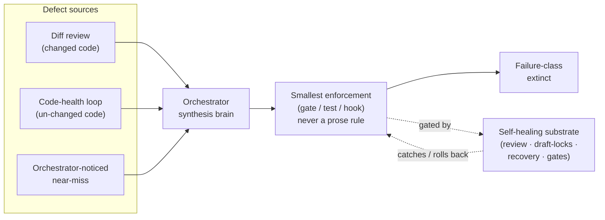

# BLUEPRINT Appendix — Self-Improving Factory Architecture (deep)

Detail behind [BLUEPRINT.md](https://github.com/souliane/teatree/blob/main/BLUEPRINT.md) §17. The §17.1 Invariants list stays in the top-level (it is parsed by `scripts/hooks/check_blueprint_invariant_numbering.py`). The flywheel diagram, components, orchestrator/loop topology, CLEAR record, gate placement, and orchestrator-as-keystone contract live here. Consumer cross-references such as `BLUEPRINT §17.3`, `§17.4`, `§17.4.2`, `§17.6`, `§17.6.3`, `§17.8` resolve here.

## 17. The Self-Improving Factory Architecture

Teatree is a durable self-healing **and** self-improving development factory. This section is the lasting architectural reference for that property; it is the umbrella under [#836](https://github.com/souliane/teatree/issues/836), and each component below is a separately tracked ticket implemented as deterministic teatree code (not skill prose).

The reason this architecture exists, observed repeatedly: durability comes from **enforcement encoded in code/structure**, not prose that decays. A behavioural rule kept in memory/skills and relied on by vigilance recurs anyway; the same rule encoded as a gate/test/hook does not. The invariants below are the structural form of that lesson — they are load-bearing and bind every change to teatree itself.

### 17.2 The flywheel

Self-improvement (the upper path: defect → synthesis → enforcement) only ever lands through the self-healing substrate (invariant 1). The substrate both feeds the flywheel (review caught the defect) and bounds it (it can catch or roll back the change the flywheel produces).

### 17.3 Components

Each component is its own tracked ticket, implemented as teatree code with TDD plus independent review; substrate-touching components require an explicit recorded human approval and are draft-locked (invariant 4) — the agent executes the merge once approval is recorded.

- **C1 — Retro → orchestrator-only, and remove the per-ticket retro phase-gate.** Sub-agents emit raw signal into durable state; the orchestrator does periodic synthesis biased to enforcement output. This removes the per-ticket retro ceremony (the bureaucracy) and catches systemic patterns only the orchestrator can see across tickets. (The per-ticket retro phase-gate and shipping-gate wording elsewhere in this document are owned by a separate ticket — [#837](https://github.com/souliane/teatree/issues/837) — not by the factory-architecture section.)

- **C2 — Code-health loop.** Extract *only* the deterministic *harness* — scoped scan + dedupe-against-open-tickets + severity-gating + ticket intake + pacing — into teatree code; the review *judgment* stays in the existing review skill (invariant 3: mechanics → code, judgment → skill). This is the latent-code sensor feeding the same flywheel on code no diff touched. It must be paced and deduped or it floods the backlog.

- **C3 — Availability (24/7 single-session).** Two question modes (ask-now vs. pile-while-away) plus a work-hours auto-switch and a manual toggle. Away-mode routes a would-be question into the durable backlog (`DeferredQuestion`); it never bypasses the structured-question gate (§ 5.6, `handle_enforce_structured_question`). This keeps the orchestrator brain available around the clock. **Status: shipped under [#58](https://github.com/souliane/teatree/issues/58)** — implementation owns the §17.1 invariant 9 guarantee, the cron-window schedule + manual-override resolver (`teatree.core.availability.resolve_mode`), and the durable `DeferredQuestion` + `DeferredQuestionAudit` rows. Full spec lives in §5.6.3.

### 17.4 Orchestrator-decides / loop-executes topology

This subsection formalises the division between *deciding to merge* and *executing a merge*, which are two distinct responsibilities that must not be held by the same agent.

**The anti-pattern this replaces.** In the previous arrangement the orchestrator both synthesised a merge decision and immediately ran the merge (gh merge / git push). This conflates judgment with execution, removes the independent post-merge audit, and makes the whole merge path as fragile as the orchestrator's compaction/restart window. That conflation is the named anti-pattern.

**Confirmed invariant: orchestrator never pushes.** Pushing and pre-push hooks are already fully delegated to `t3:shipper` sub-agents. The amendment below extends the same delegation principle to merge execution.

#### 17.4.1 Role boundaries

| Role | Responsibility | What it must NOT do |
|---|---|---|
| **Orchestrator** | Review synthesis; issue per-diff CLEARs; make merge decisions | Execute the merge; run gh/git commands post-CLEAR; self-issue a CLEAR on code it already reviewed in the same session |
| **Durable loop** | Receive CLEARs from orchestrator; validate them at merge time; execute merge; emit post-merge audit signal | Self-invoke a CLEAR; merge without a valid CLEAR; proceed on stale CLEAR |
| **t3:shipper** | Push branches, run pre-push hooks | Issue merge decisions; write CLEARs |

The loop is kept separate from the orchestrator **deliberately**: it survives compaction and restart independently (durability), it cannot be asked to rubber-stamp its own CLEARs (separation of concerns), and its audit signal is structurally independent of the orchestrator's synthesis (invariant 1: self-healing substrate catches/rolls back self-improvement).

#### 17.4.2 Per-diff CLEAR record

A CLEAR is a durable record that authorises execution of exactly one merge. It is **a dedicated Django DB row** — a `MergeClear` model alongside the other lifecycle models (§4.1), persisted through the same `transaction.atomic()` path that gets `BEGIN IMMEDIATE` write-serialization on the production SQLite engine (§4.3). It is explicitly **not** a session-volatile JSON file: the orchestrator that issued it may be compacted or restarted before the loop acts on it, so the record must survive in the canonical, compaction-surviving tier — the DB — exactly like `Ticket`/`Session`/`Task`. The loop re-reads the `MergeClear` row from the DB at merge time; it never trusts an in-memory copy carried across the handoff.

A `MergeClear` row must contain all of the following fields:

| Field | Content |
|---|---|
| `pr_id` | GitHub PR number (integer) |
| `reviewed_sha` | Exact HEAD SHA the orchestrator reviewed — not a branch ref |
| `reviewer_identity` | Reviewer agent/session identity string (non-empty) |
| `gh_verify_result` | **Audit-only snapshot** of `gh pr checks` at review time: `green`, `pending`, or the specific check name(s) that failed. This field records what the reviewer saw; it is **not** consulted as the merge-time gate (see §17.4.3 — re-validation is against GitHub's live required-checks list, not this saved value). |
| `blast_class` | One of: `substrate` (healing/gate substrate), `logic` (non-substrate business logic), `docs` (documentation/spec only) |
| `human_authorizer` | Empty for every non-substrate CLEAR and for a substrate CLEAR with no per-PR approval (which still merges when its overlay stands at `autonomy = full` — step 5 (b)). Set **only** for a substrate CLEAR a human/owner explicitly approved — re-presented at merge time (§17.4.3 step 5). It never auto-unlocks anything; it is the durable record of *who approved* (the gate); the agent still executes the merge (invariant 8). |
| `issued_at` | ISO-8601 timestamp of when the orchestrator issued the CLEAR |

No partial CLEAR is actionable. A `MergeClear` row missing any field is treated as absent.

**The issuance seam.** A CLEAR is created exclusively through the guarded factory `MergeClear.issue(ClearRequest)`, exposed as `t3 <overlay> ticket clear <pr_id> <slug> --reviewed-sha <sha> --reviewer-identity <id> --blast-class <substrate|logic|docs> [--ticket-id N] [--human-authorize <id>]`. This is the orchestrator's *only* merge output (§17.8 clause 3). The factory enforces the contract before any row is written and refuses (raising `ClearIssuanceError`, no partial row) when: `blast_class`/`gh_verify_result` is unknown; `reviewer_identity` is empty, equals the executing-loop identity, or is a maker/coding-agent/loop role (the author cannot self-attest its own review); `reviewed_sha` is not a hex commit id (a branch ref would not bind to the reviewed tree); or `--human-authorize` is given for a non-substrate `blast_class`. The maker/loop-role predicate is shared single-source with the `reviewing`-attestation guard (§17.6 candidate 13) so the two cannot drift.

A CLEAR records a `merge_safe` `ReviewVerdict` (keyed by `(slug, pr_id, reviewed_sha)`) as a by-product so the judgment is stored once, not re-derived; `review record`/`review status` are the standalone record + safe-to-approve-at-live-head lookup.

#### 17.4.3 Loop validation before merge

Before executing any merge the loop **must** perform all of the following checks in order:

0. **Branch-currency (conflict-only)** ([#940](https://github.com/souliane/teatree/issues/940)) — the feature branch must *merge cleanly* into the target; being merely behind is **not** a blocker (it squash-merges without a rebase, since GitHub re-applies the diff onto the live target at merge time and steps 2–3 still guard correctness). At **ship** time `branch_currency.require_current_branch` auto-merges a zero-conflict gap (so step 1's attestation binds to the post-merge SHA) and refuses only on conflict; at **CLEAR** time `sha_conflicts_with_target` predicts the merge via `git merge-tree --write-tree` (no mutation) and refuses only when the SHA both trails target AND conflicts. Remediation: merge target, resolve, re-attest.
1. **CLEAR exists** — a `MergeClear` row is present for this PR, re-read from the DB (not an in-memory copy), all fields populated.
2. **SHA still matches** — re-fetch the PR/MR's current HEAD SHA from the forge; it must equal `reviewed_sha`. If the branch has been force-pushed or new commits added, the CLEAR is stale. (Transport: `teatree.core.merge_execution` resolves the CLEAR's host kind from the ticket `issue_url` (`github.com` → GitHub, `gitlab*` → GitLab) and delegates the forge I/O to a `CodeHostBackend` built via `core.backend_registry` — the `gh`/`glab` argv lives on the backend impls; `merge_execution` keeps the verdict/transient/head-moved classification and error f-strings, so `core` never imports `teatree.backends`.)
3. **CI still green** — re-evaluate against **the forge's live required-checks** for the target branch (GitHub's branch-protection list, or GitLab's head pipeline status — the authoritative set at merge time), not the `gh_verify_result` snapshot saved on the `MergeClear` row. All currently-required checks must pass at the moment of merge execution, not just at CLEAR issuance. (A required check may have been added after the CLEAR was issued; the live list is the source of truth.)
4. **Not draft** — the PR must not be in draft state.
5. **blast_class respected** — a `blast_class == substrate` CLEAR is draft-locked and needs a per-PR human sign-off (invariant 4), satisfied by EITHER (a) a per-CLEAR `human_authorizer` re-presented via `--human-authorized <owner-id>`, OR (b) the CLEAR's overlay standing at `autonomy = full` — the standing grant stands in for `--human-authorized`. Either way the agent runs the keystone (never raw `gh`). The carve-out removes ONLY the per-PR sign-off; the floor (cold-review, SHA-bind, required-checks, not-draft, never-lockout) is unchanged. `--human-authorized` never unlocks a non-substrate CLEAR; below `full` the `human_authorizer` stays mandatory.

**Atomic merge — closing the TOCTOU window.** There is a time-of-check-to-time-of-use gap between step 2 (SHA re-check) and the actual merge call: a force-push landing in that window could otherwise slip a stale, unreviewed tree through. The loop **must** bind the merge call to the exact verified SHA so the merge is rejected if the head moved — concretely, the GitHub merge API `expected_head_oid` parameter (the Pull Request `merge` mutation / `PUT .../merges` with the SHA the loop verified in step 2). If GitHub reports the head moved (the `expected_head_oid` no longer matches), the merge is refused by GitHub and the loop treats it as a failed check, not a retry-with-new-head. This is the same staleness/replay class as the §4-family E10-style findings and is closed the same way: **bind execution to the exact verified SHA, fail closed** — never re-resolve the head and proceed.

If any check fails, or the atomic merge is rejected for a moved head: the loop writes a re-escalation entry into the **durable task backlog** (a `Task`/queue row, per §17.3 C3 — durable, not an in-memory signal), recording which check failed and the current observed state, and does **not** merge. The durable write is required precisely because the orchestrator may be compacted, restarted, or in away-mode and unreachable at that instant; the escalation must outlive that and be picked up when the orchestrator brain is next available. The loop never self-issues a replacement CLEAR.

**Solo-overlay carve-out for step 1** ([#1309](https://github.com/souliane/teatree/issues/1309)). On an overlay the user has explicitly declared end-to-end-trusted (`mode = "auto"` + `require_human_approval_to_merge = false`), the maker and reviewer are the same human identity. `MergeClear.issue` mechanically refuses a self-attested CLEAR via the `is_non_reviewer_role` guard, so step 1 is unsatisfiable by construction and the sweep would silently no-op every green+mergeable+clean PR. On such an overlay only — and only when no CLEAR exists — the scanner replaces step 1 with the SHA-bound `merge_pr_squash_bound` fallback path (#1985 — delegates to `execute_bound_merge`, so the no-CLEAR path re-runs the SHA-bind / not-draft / live-CI re-checks; the same path step 5 of the decision ladder authorises when the CLEAR keystone refuses on uv-audit). Every other step (0, 2 SHA-binding via `expected_head_oid`, 3 live required-checks, 4 not-draft, 5 blast_class refusal of substrate) stays in force unchanged. The carve-out applies to the scanner only; the `t3 ticket merge` keystone command still requires a CLEAR for every overlay regardless of opt-in.

#### 17.4.4 Post-merge audit

After every merge the loop writes a structured audit record to the same canonical DB tier (a `MergeAudit` row, or an audit FK off `MergeClear`) containing: merged SHA, merge timestamp, CLEAR reference (`pr_id` + `reviewed_sha`), and the re-verified live-required-checks status at merge time. The orchestrator may read these rows during retro synthesis; they are the loop's independent signal back into the flywheel and survive the orchestrator's compaction/restart by construction.

### 17.5 TODO-consolidation quick-wins triage

The per-session TODO-consolidation pass collects all open items (from the backlog, code-health loop, retro synthesis, and ad-hoc observations) and classifies each before acting. The classification drives whether the item is auto-dispatched immediately or escalated to the orchestrator.

#### 17.5.1 Classification axes

Every item is scored on two axes:

**Effort.** Estimated implementation scope:

- `low`: a single file change, no migration, no new dependency, implementation obviously fits in one short sub-agent session
- `high`: anything else — multi-file, schema change, new dependency, uncertain scope, requires coordination

**Blast radius.** Scope of potential harm if the item is wrong, defined in concrete module-scope terms (not the circular "caught by CI"):

- `low`: the change does **not** touch any of `teatree.loop`, `teatree.core` (lifecycle models, gates, FSM), the CLEAR/`MergeClear` path, `hooks.json`/pre-commit hook scripts, or any shared DB schema; and it does **not** modify state readable by another concurrent session. Typical members: a single non-substrate leaf module, a test file, a docstring, a doc page.
- `high`: touches the self-healing substrate (gates, locks, the `MergeClear`/CLEAR path, `teatree.loop`, `teatree.core` FSM/models, `hooks.json` or hook scripts, intake), shared state readable by other sessions, or anything subject to invariant 4

#### 17.5.2 Dispatch rule

| Effort | Blast radius | Action |
|---|---|---|
| `low` | `low` | **Auto-dispatch immediately** — create a coder sub-agent task without escalating to orchestrator. Drain bias: prefer dispatching these now over deferring. |
| `low` | `high` | **Escalate** — present to orchestrator with classification and rationale; do not auto-dispatch. |
| `high` | `low` | **Escalate** — scope is uncertain; orchestrator decides priority and sequencing. |
| `high` | `high` | **Escalate immediately** — block on orchestrator judgment; treat as substrate change candidate (invariant 4). |

The drain bias in the `low/low` quadrant is explicit: items that clear the classification gate are dispatched in the same pass that found them, not deferred to a future session. Accumulating safe quick wins wastes the pacing capacity the code-health loop already enforces.

Items that cannot be classified with confidence (ambiguous blast radius, unclear effort boundary) are treated as `high/high` until the orchestrator resolves the ambiguity.

### 17.6 Enforcement gate: anti-relaxation and sound module boundaries

This section is a design spec for the gate that protects code quality from two known failure modes: incremental relaxation of linting/coverage constraints, and tach configurations that appear clean without actually enforcing real module boundaries.

This is spec-only — §17.6.1 (anti-relaxation checks) and §17.6.2 (sound tach module boundaries) describe a gate-shape that is not yet implemented; the implementation is tracked as a separate ticket (see issues referenced at the end of this section). §17.6.4 below enumerates the gates from this family that ARE shipped (the `Stop` chain in `hooks/scripts/hook_router.py` and the per-diff `t3 tool …` gates wired into `PreToolUse`).

#### 17.6.1 Anti-relaxation checks

**SPEC ONLY — not yet implemented.** The seven checks below describe a gate-shape tracked under the issues referenced at the end of §17.6; none are wired into `hook_router.py` today. The shipped enforcement gates from this family are enumerated in §17.6.4.

The gate runs on every PR diff and blocks merge if any of the following are present **beyond the established boilerplate baseline**:

| Check | Trigger |
|---|---|
| New `# noqa` annotation | Any `# noqa` without an inline justification comment explaining *why* suppression is correct for this specific site |
| New per-file lint-rule ignore | Any addition to `[tool.ruff.lint.per-file-ignores]` in `pyproject.toml` or `ruff.toml` |
| Complexity suppression | Any new `# noqa: C901` or `# noqa: PLR09xx` annotation |
| Coverage omit addition | Any new entry in `[tool.coverage.report] omit` |
| Coverage floor lowering | Any reduction to `fail_under` in `[tool.coverage.report]` |
| `--no-verify` usage | Any occurrence of `--no-verify` in committed shell scripts, Makefile targets, or CI config |
| Test vacuity | A regression test that contains no assertions, or whose structure guarantees it passes regardless of the code under test (e.g., only `assert True`, empty test body, assertion unreachable due to early return) |

The "boilerplate baseline" is the set of `# noqa` / `per-file-ignores` / `omit` entries present in the repository at the time the gate is first deployed. New entries require an explicit justification accepted by a human reviewer before the gate is updated. The gate is not self-updating.

#### 17.6.2 Sound tach module boundaries

A `tach check` passing is a necessary condition for merge, but it is not sufficient. A tach configuration that passes its own check while being trivially permissive is not sound. The gate must distinguish between the two.

**Unsound patterns that must be blocked:**

- Any module with `interfaces = []` (empty public API) — this means tach enforces no actual encapsulation; the module's internals are effectively public
- Any dependency cycle laundered through a `tach.toml` exclusion or `ignore_type_checking_imports = true` blanket — cycles that the config hides rather than removes
- A dependency direction that violates the declared level ordering — an import from a lower layer to a higher layer (e.g., `teatree.config` importing from `teatree.cli`) without an explicit architectural justification in a comment. The level ordering is read from tach's own `layers:` directive in `tach.toml` (established as the level-ordering source under [#724](https://github.com/souliane/teatree/issues/724)); the gate does not invent its own ordering, it enforces the one tach already declares.

**What the gate requires:**

1. `tach check` passes (necessary but not sufficient)
2. The dependency graph is acyclic after removing any `ignore_type_checking_imports` exemptions
3. Any new `ignore_type_checking_imports = true` entry added in the diff is accompanied by a comment in `tach.toml` explaining why the TYPE_CHECKING-only import is unavoidable
4. The `layers:` ordering in `tach.toml` is respected (no lower→higher import without a justifying comment)

**Phasing of the non-empty-`interfaces` requirement (not a day-1 repo-wide block).** Requiring every public module to declare a non-empty `interfaces` list cannot be a day-1 gate: the existing modules do not yet have it, and defining those real interfaces is exactly the substantive work tracked under [#724](https://github.com/souliane/teatree/issues/724) and [#725](https://github.com/souliane/teatree/issues/725). A day-1 repo-wide enforcement would block the whole repo. The gate is therefore phased:

- **On deployment:** the non-empty-`interfaces` requirement applies **only to modules added or modified in the PR diff** — new code must declare its public API; touched code must not regress to an empty interface. Pre-existing modules without `interfaces` are not blocked.
- **As #724/#725 land:** each module that gets a real interface defined is moved from the grace list into full enforcement. The gate carries an explicit, shrinking allow-list of "interface-not-yet-defined" modules seeded from the repo state at deploy time; an item leaves the list only when its interface is genuinely defined (not when it is silenced). The end state — every public module enforced — is reached when #724/#725 complete, not on day one.

This gate protects the #724/#725 work from regressing once done and ratchets coverage forward as that work lands; it does not duplicate it and does not front-run it with a repo-wide block.

#### 17.6.3 Gate placement

The anti-relaxation and tach-soundness checks run as a pre-merge gate (same layer as the existing draft-lock and structured-question gates). They are code, not prose rules, per invariant 2. A PR that triggers either check is returned to draft automatically; the author must resolve the finding before re-requesting review.

**Branch-currency (#940) is the exit-point sibling of the clone-currency entry-point gate ([#948](https://github.com/souliane/teatree/issues/948), `teatree.core.clone_guard`).** Both refuse-and-explain on a real *conflict* (not a mere behind-count); both auto-merge / auto-sync the safe zero-conflict case. The entry-point gate fires before bug investigation reads any file; the exit-point gate fires before cold review / ship reads or pushes any commit. A base that is merely behind but conflict-free is blocked at neither end — it merges cleanly when the work lands. The two together cover both ends of the loop.

The same pre-merge placement applies to gate 12 (§17.6.4): its `PreToolUse` handler (`handle_block_uncovered_diff`, [#937](https://github.com/souliane/teatree/issues/937)) intercepts merge-class mutations (`gh pr ready` un-draft, non-draft `gh pr create` / `glab mr create`) and shells `t3 tool diff-coverage --json`, `deny`ing **only** on a successfully-computed finding (`passes` false); any crash/timeout/unparsable output **fails open** ([#122](https://github.com/souliane/teatree/issues/122) — `coverage` is a runtime dep so the env can run the gate). `gh pr ready --undo` is the remediation; `git commit` is not a trigger (gate 12 is pre-*merge*).

The gate implementation is tracked under the issues referenced below.

#### 17.6.4 Shipped gates in this family

The anti-relaxation/tach-soundness gate above (#850) is one member of the §17.6 enforcement-gate family under [#836](https://github.com/souliane/teatree/issues/836). Two further deterministic gates in the same family are implemented and run at the same pre-merge / pr-create-time layer (the `hook_router.py` `PreToolUse` chain and `t3 tool` commands), each converting a previously prose-only rule into code per invariant 2:

- **PR-body / commit AI-signature & banned-trailer scan.** `t3 tool ai-sig-scan` (`scripts/ai_signature_scan.py`) plus the `handle_block_ai_signature` `PreToolUse` gate refuse a `gh pr create` / `glab mr create`-update / `git commit` / MR-MCP mutation whose body or message carries an AI-signature trailer (`Generated with [Claude Code]`, a model/Anthropic `Co-Authored-By:`, `via Claude`, an emoji-bot footer). The matcher targets *trailer/footer position* (line-leading, inline-code blanked), so a doc that *describes* the banned trailer — including this rule's own definition — does not self-block. This codifies the "No AI Signature on Posts Made on the User's Behalf" rule that was prose-only in `/t3:rules` and unenforced at the PR-body layer.
- **Per-diff coverage + mutation/revert gate.** `t3 tool diff-coverage` (`teatree.utils.diff_coverage`) plus the `handle_block_uncovered_diff` `PreToolUse` gate ([#937](https://github.com/souliane/teatree/issues/937)) — which `deny`s a `gh pr ready` / non-draft `gh pr create` / `glab mr create` whose diff fails the gate, automatically holding the PR out of review (§17.6.3) until the finding is resolved. The check measures coverage on the *diff's* added production lines (scoped to the project's `[tool.coverage.run] source`/`omit`, so subprocess-only scripts are out of scope exactly as for the global floor) instead of trusting the global `fail_under`, and additionally requires every new/changed public top-level production symbol to be imported by a changed test (the structural anti-vacuity check). The structural check catches the "test-a-local-copy" mechanism a coverage gate alone cannot: a test that redefines the logic locally and never imports the shipped symbol stays red-flagged because reverting production would not turn it red. The symbol check is deliberately only an *import* check, paired with the line-coverage half: "imported-but-never-called" is intentionally left to the line-coverage check (an uncalled symbol's body lines stay uncovered), so the two halves are complementary by design — the import check defeats test-a-local-copy, the line-coverage check defeats import-without-exercise, and `measure_diff_coverage` always runs both because neither alone is sufficient.

Three further mechanizable gates in the same family, each replacing a prose-only rule (invariant 2):

- **§17.1 invariant-numbering integrity (gate 1).** `scripts/hooks/check_blueprint_invariant_numbering.py` parses the numbered invariant list under `### 17.1 Invariants` and fails the commit-msg/prek stage (same layer as `blueprint-sync`) when the numbers are not a gapless `1..N` with no repeats, evaluated on the tree being committed (including a merge result). This extinguishes a recurring collision class: concurrent PRs each appended "the next" §17.1 number against a stale base, so the merge silently duplicated or dropped one.
- **Orchestrator-execution-boundary guard (gate 2).** `handle_enforce_orchestrator_boundary` (`hook_router.py` `PreToolUse`) blocks the MAIN agent only from running a LONG / HEAVY foreground `Bash` command that would tie up its session — a **denylist** ([#115](https://github.com/souliane/teatree/issues/115), inverting the original over-blocking allow-list): test runners, `t3 … run`/`e2e`/`test`, dev servers (`runserver`, `nx serve`, `docker compose up`), `playwright test`, package install/sync, asset/language builds, long sleeps, and full-tree sweeps (`find … -exec`, `ls -R`). Everything else passes — quick orientation Bash, `git` reads/commits, `cat`/`ls`/`grep`, and the sanctioned orchestration verbs (Task/Agent dispatch, `AskUserQuestion`, messaging/`*view*` MCP reads). The denylist is HEURISTIC; the escape hatch is `run_in_background: true` or dispatching a sub-agent, and **sub-agents are unrestricted**. The main-vs-sub-agent signal is the PreToolUse payload's `agent_id` (non-empty ⇒ sub-agent), NOT the transcript's `isSidechain` marker — the payload's `transcript_path` always points at the PARENT session transcript even for a sub-agent's call, so the prior `isSidechain` read misdetected every sub-agent as the main agent and blocked it. A one-line kill-switch `[teatree] orchestrator_bash_gate_enabled = false` (default `true`, per-overlay overridable) disables the gate. **Self-rescue invariant ([#1474](https://github.com/souliane/teatree/issues/1474)):** `t3 <overlay> gate disable` always recovers the orchestrator — reachable even with the gate enabled, because `_ORCHESTRATOR_HEAVY_BASH_RE` never matches a `t3 …` command (pinned by `TestSelfRescueEscapeHatchNeverGated`); the kill-switch is out-of-repo in `~/.teatree.toml`, so it survives `t3 update`. The gate's foreground-`Agent`-dispatch deny ([#1442](https://github.com/souliane/teatree/issues/1442)) ships default-OFF behind `[teatree] orchestrator_boundary_agent_gate_enabled`: it is currently dead only because no `Agent` matcher is wired (the `Agent` tool DOES reach `PreToolUse`), and enabling it on the orchestrator's own foreground-dispatch path is a lockout risk to validate attended ([#1646](https://github.com/souliane/teatree/issues/1646)) — detail in `hooks/CLAUDE.md` + configuration.md.
- **AI-signature glued-short-flag hardening (gate 3).** `hook_router`'s file-based message-arg matcher (`_MSG_FILE_FLAG_RE`) now also matches the glued short form git's getopt accepts — `git commit -F<path>` / `-C<path>` with no space or `=` separator — closing a residual the gate-15 cold review found. Long flags still require a separator.
- **Answered-question Stop gate ([#1063]).** `handle_enforce_answered_questions` (`hook_router.py` `Stop` chain) soft-blocks turn-end while any heuristic-classified user question from the last hour still has `answered_at IS NULL`. Pairs with the §5.6 `slack_dm_inbound` drain and the §5.8 reactive Slack-answer loop: `consumed_at` proves the DM was surfaced, `loop_replied_at` proves the cheap loop acked, but only the agent's own reply (stamping `answered_at`) satisfies this gate.
- **Loop self-pump Stop gate.** `handle_loop_self_pump` (`hook_router.py` `Stop` chain) is the §5.6 invariant 2 enforcement: the singleton loop owner ticks the next `t3 loop tick` on its own session, so the cron-armed cadence never has to race with the interactive session for the lease.
- **Plan-before-code gate (gate 16, retired wall-clock → FSM).** The three retired wall-clock gates (`handle_enforce_plan_gate`, `handle_enforce_agent_plan_gate`, `handle_enforce_plan_gate_on_task_create`) are replaced by the `PLANNED` Ticket FSM state: `CODED` is unreachable from `STARTED` without a `PlanArtifact` DB record driving `ticket.plan()`. The early DX signal `handle_block_edit_before_planned` (`hook_router.py` `PreToolUse`) denies `Edit`/`Write` when the worktree's ticket is still in `STARTED` state, surfacing the exact remediation step. The `OverlayConfig.plan_gate` field is retired (kept for migration compatibility only).
- **Banned-terms posting gate ([#1415](https://github.com/souliane/teatree/issues/1415)).** `handle_banned_terms_pretool` (`hook_router.py` `PreToolUse`, `teatree.hooks.banned_terms_scanner`) is the sibling of the [#1213](https://github.com/souliane/teatree/issues/1213) quote-scanner gate: the commit-only `check-banned-terms.sh` pre-commit hook runs only on `git commit`, missing every non-commit write to a public surface (`gh issue/pr create|edit|comment`, `glab mr|issue note|create`, the `gh api` / `glab api` REST paths) — exactly where overlay/customer terms have leaked. The gate reuses the #1213 `teatree.hooks._command_parser` publish-surface detection + body extraction (`--body`, `--body-file`, `-d`/`--field` JSON, `-m`, heredocs), then delegates the *matching* to the same `check-banned-terms.sh` against the `~/.teatree.toml` term list — no new term config, no reimplemented matching. A match `deny`s the tool call naming the term; the override is `--allow-banned-term` (first segment), an `ALLOW_BANNED_TERM=1` inline env-assignment that leads the publish segment itself (so `cd <worktree> && ALLOW_BANNED_TERM=1 git commit …` is honoured, since bash scopes the assignment to that command, while a decoy override on an unrelated chained segment is not), or the `ALLOW_BANNED_TERM=1` process/tool env. Fails open on a missing config/script or subprocess error. Destination-aware via `internal_publish_namespaces` unioned with `private_repos` ([#1672](https://github.com/souliane/teatree/issues/1672)); both gates scan PUBLIC targets only (`teatree.hooks.publish_destination`), the SKIP decided per top-level segment so a chained / command-substituted public post or a raw-REST `gh api`/`glab api` segment is still SCANNED. A SECRET blocks on every surface before any skip/override; a bare `git commit` whose effective repo (cd/pushd + `.git` walk-up) is inside no git repo fails OPEN (local-only), but a PUBLIC-repo commit still hard-blocks.
- **Clickable-reference rule.** Enforced *in code* by the deterministic linkifier (`core/reference_linkifier.py`, [#1845](https://github.com/souliane/teatree/issues/1845)), which rewrites a bare `#NNNN`/`!NNNN` on a user-facing surface into a clickable link at the Slack chokepoint. The former PreToolUse/Stop bare-reference *blocking* gate ([#1530](https://github.com/souliane/teatree/issues/1530)) was removed: it over-blocked routine commands ([#107](https://github.com/souliane/teatree/issues/107)) and asked the model to rewrite refs non-deterministically; the linkifier replaces it with no block and no model round-trip.
- **Skill-loading-on-task-create gate (gate 17, [#1488](https://github.com/souliane/teatree/issues/1488)).** `handle_enforce_skill_loading_on_task_create` rides the `TaskCreated` event — the one seam the harness Workflow/Task fan-out vehicle (`ultracode`, teammate spawns) does NOT bypass (unlike `PreToolUse`, where its sibling `handle_enforce_skill_loading` lives), closing the loophole that let a bespoke review workflow run instead of `/t3:review`. It forces the matching teatree skill + transitive companions (`lifecycle_for_task_text(task_description)`, fail-open on stale names) onto the fanned-out task via the `{"continue": false, …}` deny envelope, enforcing skill-loading ONLY so ultracode keeps maximal fan-out room (the `TEATREE_PLAN_GATE_WINDOW_MINUTES = 0` sentinel relaxes gate 16's window for multi-wave fan-outs). Fail-open / self-rescue (never lock out): `[teatree] skill_loading_gate_enabled` kill-switch, `[skip-skill-gate: <reason>]` per-call token, and `t3 <overlay> gate skill-loading disable` — modelled on gate 2. Detail: handler docstring + `hooks/CLAUDE.md`.
- **No-commit sub-agent recorder (gate 18, [#1205](https://github.com/souliane/teatree/issues/1205)).** `handle_subagent_stop_no_commit` (`SubagentStop`) records a `terminated_without_commit` signal when `teatree.hooks.no_commit_detector` finds the sub-agent's worktree (harness `cwd`) on a work branch with 0 commits ahead of base. A DETECTOR, not a deny; fail-open. Detail: handler docstring + `hooks/CLAUDE.md`.

All are anti-vacuous by construction (reverting the production logic turns their own regression tests red, verified) and self-applied (the per-diff gate passes on its own diff; the §17.1 gate passes on this document's own contiguous list).

**Two complementary enforcement evals.** The gate-liveness corpus ([#168](https://github.com/souliane/teatree/issues/168), `tests/test_gate_liveness_corpus.py`) proves each gate is *reachable and decisive* — it fires on a synthetic must-DENY payload and clears a must-ALLOW one (catching under-fire and phantom gates). The transcript-replay conformance eval ([#169](https://github.com/souliane/teatree/issues/169), `teatree.eval.transcript_conformance` + `t3 eval transcript-replay`) replays the on-disk session JSONL and proves the behavioural invariants actually *held in real runs* (the gates did their job, or weren't needed). It is local-only, stdout-only, project-slug-scoped, and emits only invariant ids + event indexes — never tool inputs, prompts, hook output, or quotes. It ships four live GREEN-tier (`deterministic`, low-FP) invariants — worktree-first, no raw out-of-band merge / review-post / overlay-Slack-bypass — alongside AMBER/RED-tier and loop-signal-derived invariants and the [#166](https://github.com/souliane/teatree/issues/166) catalog linkage.

### 17.7 Enforcement-over-prose as a standing audit

This subsection is the detail behind invariant 6.

**The rule.** A user behavioural directive is any statement of the form "you should do X" / "the agent shouldn't Y" / "always Z" about agent behaviour. For each such directive:

1. **Codify it in teatree.** It must have a written home in the repo (skill, BLUEPRINT, or AGENTS/CLAUDE instruction file) — not live only in a chat transcript or one agent's personal memory.
2. **Mechanize it where mechanizable.** If the directive can be expressed as a deterministic check — a pre-commit/CI gate, a hook deny, an FSM condition, a CLI rejection, or a regression test — that check is the canonical enforcement, and the prose is reduced to a one-line pointer at the gate. A directive is "mechanizable" when a deterministic predicate over the repo/diff/command can decide compliance without judgment.
3. **Keep as prose only the genuinely-unmechanizable judgment.** Tone, design taste, "ask when ambiguous", and similar judgment calls stay as prose because no deterministic predicate captures them. These are the residue, not the default.

**Skills get lighter, not heavier.** The success metric is a *shrinking* prose corpus: each audit pass should convert at least the newly-added mechanizable directives into gates and leave the skill files smaller or pointer-only for those rules. A pass that only adds prose and mechanizes nothing is a flywheel failure (invariant 2).

**Standing responsibility, not a one-off.** This is a recurring retro/review duty in the same proactive-audit family as the retro skill's Simplification Pass (`retro/SKILL.md` § "3b. Simplification Pass (Auto-Cleaning)"). That section already governs *consolidating duplicate prose*; this invariant adds the orthogonal direction — *reclassifying mechanizable prose into a gate*. The two are referenced, not duplicated: consolidation removes redundancy, enforcement-over-prose removes the need for the prose at all by making the rule structural.

**Testable form (enumerable, not aspirational):**

- Every behavioural directive added to a skill/instruction file in a diff is, in the same change, either (a) accompanied by a deterministic gate that enforces it, or (b) explicitly tagged as judgment-only with a one-line reason it cannot be mechanized.
- The enforcement gate (§17.6, [#850](https://github.com/souliane/teatree/issues/850)) is the mechanism for (a); the `skill-prose-ban`-style hook is the structural check that a new imperative rule ships with companion code.
- The recurring audit ([#855](https://github.com/souliane/teatree/issues/855) for the existing-corpus backfill) re-walks the prose corpus and files the reclassification for any mechanizable rule still living only as prose.

### 17.8 Orchestrator-as-keystone contract

The orchestrator is the human-replacement keystone of the factory: the last human-equivalent piece in the loop before the system self-rolls a change. The deterministic loops and gates do the mechanical work; the orchestrator supplies the judgment they structurally cannot — architectural intent, blast-radius classification, staleness/replay reasoning, and the decision to *not* ship weak work. This subsection states that role as a contract with enumerable guarantees, so conformance is checkable rather than a matter of trust.

This is a contract, not a claim of superiority. The orchestrator is "keystone" only in the load-bearing sense — remove it and the arch (deterministic loops + gates) has no piece holding the judgment slot — not in any sense of being smarter than the people or tools around it.

**The contract (each clause is independently testable):**

1. **Holds architectural intent.** The orchestrator is the single place where "what this change is for" and "which invariant it must not violate" is reasoned about before a CLEAR is issued. Testable: every `MergeClear` row carries a `blast_class` set by orchestrator judgment (§17.4.2); a CLEAR without it is invalid.
2. **Performs the judgment the loops lack.** Synthesis (retro → smallest enforcement), blast-radius classification, and staleness/replay reasoning (the E10-class TOCTOU analysis in §17.4.3) are orchestrator responsibilities; the loop only executes deterministic checks. Testable: the loop has no synthesis or classification code path — it reads `blast_class`, it does not compute it.
3. **Issues per-diff CLEARs; never executes its own merges or pushes.** This is the §17.4 topology restated as a guarantee: the orchestrator's only merge output is a `MergeClear` row. Testable (enumerable): the orchestrator role has zero `gh pr merge` / `git push` / `git merge` call sites; pushing is `t3:shipper` (§17.4.1), merging is the durable loop (§17.4.3). Each CLEAR it issues is independently-reviewed (a `reviewer_identity` distinct from the executing loop), gh-verified (a `gh_verify_result` snapshot recorded), and blast-classed (`blast_class` set).
4. **Refuses weak work under pressure — explicitly.** Deadline or backlog pressure is not a reason to issue a CLEAR for work that fails review, has a stale SHA, or trips the enforcement gate (§17.6). "Refuse under pressure" is an explicit clause, not an implied virtue: the orchestrator does not relax the bar to drain a queue. Testable: there is no priority/urgency field that, when set, bypasses any §17.4.3 loop check or any §17.6 gate — the gates are unconditional, and a CLEAR issued against a still-red gate is invalid by construction, regardless of how the work was prioritized.

The contract is consistent with §17.4 (orchestrator-decides / loop-executes): §17.4 specifies the *mechanism* of the handoff; §17.8 states the *guarantees* the orchestrator side of that handoff must satisfy. Clause 3 is the same invariant as §17.4.1 viewed as a testable enumeration; clause 4 is what makes the enforcement gate (§17.6) non-negotiable in practice rather than only on paper.

---

*Implementation tickets for §17.4–§17.8 (spec only here; implementation is separate):*

- Orchestrator→loop merge-execution handoff: [#848](https://github.com/souliane/teatree/issues/848)
- Quick-wins triage in TODO-consolidation: [#849](https://github.com/souliane/teatree/issues/849)
- Anti-relaxation + tach enforcement gate: [#850](https://github.com/souliane/teatree/issues/850)
- Enforcement-over-prose backfill audit (existing-corpus reclassification): [#855](https://github.com/souliane/teatree/issues/855)
