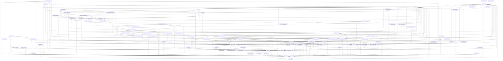

# Module Dependency Graph

```mermaid
graph TD
    teatree.project --> teatree.paths
    teatree.llm --> teatree.utils
    teatree.credential_config --> teatree.config
    teatree.credential_config --> teatree.core.models
    teatree.credential_config --> teatree.llm
    teatree.credential_config --> teatree.utils
    teatree.token_report --> teatree.core.models
    teatree.token_report --> teatree.credential_config
    teatree.token_report --> teatree.llm
    teatree.token_report --> teatree.utils
    teatree.teams --> teatree.core
    teatree.teams --> teatree.core.models
    teatree.teams --> teatree.core.loop_lease_manager
    teatree.teams --> teatree.config
    teatree.teams --> teatree.agents
    teatree.teams --> teatree.skill_support
    teatree.teams --> teatree.utils
    teatree.config --> teatree.paths
    teatree.config --> teatree.types
    teatree.config --> teatree.utils
    teatree.config --> teatree.update_check
    teatree.config --> teatree.config_speak
    teatree.config --> teatree.config_mr_reminder
    teatree.config_speak --> teatree.types
    teatree.config_agent --> teatree.config
    teatree.config_mr_reminder --> teatree.types
    teatree.update_check --> teatree.paths
    teatree.update_check --> teatree.utils
    teatree.utils --> teatree.paths
    teatree.self_update --> teatree.utils
    teatree.hooks --> teatree.utils
    teatree.timeouts --> teatree.config
    teatree.repo_mode --> teatree.paths
    teatree.repo_mode --> teatree.utils
    teatree.repo_mode --> teatree.config
    teatree.skill_support --> teatree.types
    teatree.skill_support --> teatree.utils
    teatree.skill_support --> teatree.project
    teatree.core --> teatree.types
    teatree.core --> teatree.paths
    teatree.core --> teatree.pricing
    teatree.core --> teatree.project
    teatree.core --> teatree.config
    teatree.core --> teatree.utils
    teatree.core --> teatree.timeouts
    teatree.core --> teatree.skill_support
    teatree.core --> teatree.hooks
    teatree.core --> teatree.on_behalf_gate
    teatree.core --> teatree.slack_mrkdwn
    teatree.core --> teatree.quality
    teatree.core --> teatree.core.modelkit
    teatree.core --> teatree.core.models.errors
    teatree.core --> teatree.core.models
    teatree.core --> teatree.core.session_identity
    teatree.core.loop_lease_manager --> teatree.utils
    teatree.core.managers --> teatree.config
    teatree.core.managers --> teatree.utils
    teatree.core.managers --> teatree.core.modelkit
    teatree.core.managers --> teatree.core.models.errors
    teatree.core.managers --> teatree.core.loop_lease_manager
    teatree.core.managers --> teatree.core.repair_loop
    teatree.core.managers --> teatree.core.session_handover_manager
    teatree.core.models --> teatree.core.modelkit
    teatree.core.models --> teatree.core.managers
    teatree.core.models --> teatree.core.models.errors
    teatree.core.models --> teatree.core.repair_loop
    teatree.core.models --> teatree.verification
    teatree.mcp --> teatree.core.models
    teatree.agents --> teatree.types
    teatree.agents --> teatree.core
    teatree.agents --> teatree.core.modelkit
    teatree.agents --> teatree.core.models
    teatree.agents --> teatree.credential_config
    teatree.agents --> teatree.skill_support
    teatree.agents --> teatree.utils
    teatree.agents --> teatree.config
    teatree.agents --> teatree.config_agent
    teatree.backends --> teatree.types
    teatree.backends --> teatree.utils
    teatree.backends --> teatree.core
    teatree.backends --> teatree.identity
    teatree.backends --> teatree.backends.errors
    teatree.backends --> teatree.backends.types
    teatree.backends --> teatree.backends.forge_merge_rpc
    teatree.backends --> teatree.backends.github
    teatree.backends --> teatree.backends.gitlab
    teatree.backends --> teatree.backends.slack
    teatree.backends.forge_merge_rpc --> teatree.types
    teatree.backends.forge_merge_rpc --> teatree.utils
    teatree.backends.forge_merge_rpc --> teatree.core
    teatree.backends.slack --> teatree.types
    teatree.backends.slack --> teatree.utils
    teatree.backends.slack --> teatree.core
    teatree.backends.slack --> teatree.core.models
    teatree.backends.slack --> teatree.identity
    teatree.backends.slack --> teatree.url_classify
    teatree.backends.gitlab --> teatree.types
    teatree.backends.gitlab --> teatree.utils
    teatree.backends.gitlab --> teatree.core
    teatree.backends.gitlab --> teatree.core.models
    teatree.backends.gitlab --> teatree.backends.errors
    teatree.backends.gitlab --> teatree.backends.types
    teatree.backends.gitlab --> teatree.backends.forge_merge_rpc
    teatree.backends.gitlab --> teatree.backends.slack
    teatree.backends.github --> teatree.types
    teatree.backends.github --> teatree.utils
    teatree.backends.github --> teatree.core
    teatree.backends.github --> teatree.core.models
    teatree.backends.github --> teatree.backends.errors
    teatree.backends.github --> teatree.backends.types
    teatree.backends.github --> teatree.backends.forge_merge_rpc
    teatree.contrib --> teatree.types
    teatree.contrib --> teatree.core
    teatree.contrib --> teatree.config
    teatree.contrib --> teatree.docker
    teatree.contrib --> teatree.utils
    teatree.contrib --> teatree.visual_qa
    teatree.cli --> teatree.paths
    teatree.cli --> teatree.project
    teatree.cli --> teatree.config
    teatree.cli --> teatree.config_agent
    teatree.cli --> teatree.core
    teatree.cli --> teatree.agents
    teatree.cli --> teatree.backends
    teatree.cli --> teatree.backends.gitlab
    teatree.cli --> teatree.backends.slack
    teatree.cli --> teatree.eval
    teatree.cli --> teatree.skill_support
    teatree.cli --> teatree.claude_sessions
    teatree.cli --> teatree.overlay_init
    teatree.cli --> teatree.loop
    teatree.cli --> teatree.utils
    teatree.cli --> teatree.self_update
    teatree.cli --> teatree.repo_mode
    teatree.cli --> teatree.triage
    teatree.cli --> teatree.memory_audit
    teatree.cli --> teatree.on_behalf_gate
    teatree.cli --> teatree.outbound_claim
    teatree.cli --> teatree.messaging
    teatree.cli --> teatree.quality
    teatree.cli --> teatree.hooks
    teatree.cli --> teatree.mcp
    teatree.cli --> teatree.cli.eval
    teatree.cli.eval --> teatree.cli._format_opts
    teatree.cli.eval --> teatree.core
    teatree.cli.eval --> teatree.credential_config
    teatree.cli.eval --> teatree.eval
    teatree.cli.eval --> teatree.utils
    teatree.cli.eval --> teatree.claude_sessions
    teatree.cli.eval --> teatree.llm
    teatree.eval --> teatree.core
    teatree.eval --> teatree.credential_config
    teatree.eval --> teatree.hooks
    teatree.eval --> teatree.pricing
    teatree.eval --> teatree.utils
    teatree.eval --> teatree.claude_sessions
    teatree.eval --> teatree.llm
    teatree.core.management --> teatree.core
    teatree.core.management --> teatree.core.modelkit
    teatree.core.management --> teatree.agents
    teatree.core.management --> teatree.backends
    teatree.core.management --> teatree.config
    teatree.core.management --> teatree.docker
    teatree.core.management --> teatree.eval
    teatree.core.management --> teatree.loop
    teatree.core.management --> teatree.loops
    teatree.core.management --> teatree.messaging
    teatree.core.management --> teatree.paths
    teatree.core.management --> teatree.token_report
    teatree.core.management --> teatree.types
    teatree.core.management --> teatree.utils
    teatree.core.management --> teatree.visual_qa
    teatree.loop --> teatree.types
    teatree.loop --> teatree.paths
    teatree.loop --> teatree.utils
    teatree.loop --> teatree.self_update
    teatree.loop --> teatree.config
    teatree.loop --> teatree.core
    teatree.loop --> teatree.core.modelkit
    teatree.loop --> teatree.backends
    teatree.loop --> teatree.backends.github
    teatree.loop --> teatree.backends.gitlab
    teatree.loop --> teatree.backends.slack
    teatree.loop --> teatree.notify
    teatree.loop --> teatree.messaging
    teatree.loop --> teatree.teams
    teatree.loop --> teatree.loop.loop_cadences
    teatree.loop --> teatree.loop.session_identity
    teatree.loop --> teatree.loop.loop_scoping
    teatree.loop --> teatree.loop.statusline
    teatree.loop --> teatree.loop.statusline_loops
    teatree.loop --> teatree.loop.statusline_palette
    teatree.loop --> teatree.loop.statusline_render
    teatree.loop --> teatree.loop.url_specificity
    teatree.loop --> teatree.loop.review_claim_signals
    teatree.loop --> teatree.loop.loop_state_db
    teatree.loop --> teatree.loop.review_request_tracker
    teatree.loop --> teatree.loop.dispatch_tables
    teatree.loop --> teatree.loop.pr_ticket_index
    teatree.loop --> teatree.loop.scanners
    teatree.loop --> teatree.loop.dispatch_reducer
    teatree.loop --> teatree.loop.dispatch_gates
    teatree.loop --> teatree.loop.dispatch
    teatree.loop --> teatree.loop.self_improve
    teatree.loop --> teatree.loop.rendering_items
    teatree.loop --> teatree.loop.rendering_dms
    teatree.loop --> teatree.loop.rendering_classification
    teatree.loop --> teatree.loop.rendering_permalinks
    teatree.loop --> teatree.loop.rendering_zones
    teatree.loop --> teatree.loop.rendering
    teatree.loop --> teatree.loop.slack_answer
    teatree.loop.statusline_render --> teatree.loop.statusline_palette
    teatree.loop.session_identity --> teatree.core.session_identity
    teatree.loop.loop_scoping --> teatree.core.loop_lease_manager
    teatree.loop.loop_scoping --> teatree.loop.session_identity
    teatree.loop.statusline_loops --> teatree.config
    teatree.loop.statusline_loops --> teatree.core
    teatree.loop.statusline_loops --> teatree.loop.loop_cadences
    teatree.loop.statusline_loops --> teatree.loop.loop_scoping
    teatree.loop.statusline_loops --> teatree.loop.statusline_palette
    teatree.loop.statusline --> teatree.loop.statusline_loops
    teatree.loop.statusline --> teatree.loop.statusline_render
    teatree.loop.review_request_tracker --> teatree.core.models
    teatree.loop.pr_ticket_index --> teatree.loop.dispatch_tables
    teatree.loop.review_claim_signals --> teatree.types
    teatree.loop.review_claim_signals --> teatree.core.models
    teatree.loop.review_claim_signals --> teatree.loop.loop_state_db
    teatree.loop.loop_state_db --> teatree.core.models
    teatree.loop.scanners --> teatree.types
    teatree.loop.scanners --> teatree.paths
    teatree.loop.scanners --> teatree.utils
    teatree.loop.scanners --> teatree.url_classify
    teatree.loop.scanners --> teatree.core
    teatree.loop.scanners --> teatree.core.models
    teatree.loop.scanners --> teatree.backends
    teatree.loop.scanners --> teatree.backends.errors
    teatree.loop.scanners --> teatree.backends.github
    teatree.loop.scanners --> teatree.backends.gitlab
    teatree.loop.scanners --> teatree.backends.slack
    teatree.loop.scanners --> teatree.teams
    teatree.loop.scanners --> teatree.loop.url_specificity
    teatree.loop.scanners --> teatree.loop.review_claim_signals
    teatree.loop.scanners --> teatree.loop.review_request_tracker
    teatree.loop.scanners --> teatree.loop.pr_ticket_index
    teatree.loop.dispatch_reducer --> teatree.url_classify
    teatree.loop.dispatch_reducer --> teatree.core.modelkit
    teatree.loop.dispatch_reducer --> teatree.loop.scanners
    teatree.loop.dispatch_reducer --> teatree.loop.dispatch_tables
    teatree.loop.dispatch_gates --> teatree.config
    teatree.loop.dispatch_gates --> teatree.core.models
    teatree.loop.dispatch_gates --> teatree.core.modelkit
    teatree.loop.dispatch_gates --> teatree.backends
    teatree.loop.dispatch_gates --> teatree.loop.scanners
    teatree.loop.dispatch_gates --> teatree.loop.dispatch_tables
    teatree.loop.dispatch_gates --> teatree.loop.dispatch_reducer
    teatree.loop.dispatch_gates --> teatree.loop.review_claim_signals
    teatree.loop.dispatch --> teatree.loop.scanners
    teatree.loop.dispatch --> teatree.loop.dispatch_tables
    teatree.loop.dispatch --> teatree.loop.dispatch_reducer
    teatree.loop.dispatch --> teatree.loop.dispatch_gates
    teatree.loop.self_improve --> teatree.core.models
    teatree.loop.self_improve --> teatree.utils
    teatree.loop.self_improve --> teatree.loop.scanners
    teatree.loop.self_improve --> teatree.loop.statusline_render
    teatree.loop.rendering_items --> teatree.url_classify
    teatree.loop.rendering_dms --> teatree.loop.dispatch
    teatree.loop.rendering_classification --> teatree.loop.dispatch
    teatree.loop.rendering_classification --> teatree.loop.rendering_dms
    teatree.loop.rendering_classification --> teatree.loop.rendering_items
    teatree.loop.rendering_classification --> teatree.loop.statusline
    teatree.loop.rendering_permalinks --> teatree.loop.dispatch
    teatree.loop.rendering_permalinks --> teatree.loop.rendering_classification
    teatree.loop.rendering_zones --> teatree.url_classify
    teatree.loop.rendering_zones --> teatree.loop.rendering_classification
    teatree.loop.rendering_zones --> teatree.loop.rendering_dms
    teatree.loop.rendering_zones --> teatree.loop.rendering_items
    teatree.loop.rendering_zones --> teatree.loop.statusline
    teatree.loop.rendering_zones --> teatree.loop.statusline_render
    teatree.loop.rendering --> teatree.config
    teatree.loop.rendering --> teatree.core
    teatree.loop.rendering --> teatree.core.models
    teatree.loop.rendering --> teatree.loop.dispatch
    teatree.loop.rendering --> teatree.loop.pr_ticket_index
    teatree.loop.rendering --> teatree.loop.statusline
    teatree.loop.rendering --> teatree.loop.rendering_classification
    teatree.loop.rendering --> teatree.loop.rendering_items
    teatree.loop.rendering --> teatree.loop.rendering_permalinks
    teatree.loop.rendering --> teatree.loop.rendering_zones
    teatree.loop.slack_answer --> teatree.backends.slack
    teatree.loop.slack_answer --> teatree.core
    teatree.loop.slack_answer --> teatree.core.models
    teatree.loop.slack_answer --> teatree.loop.self_improve
    teatree.loop.slack_answer --> teatree.loop.statusline
    teatree.loops --> teatree.config
    teatree.loops --> teatree.core
    teatree.loops --> teatree.loop
    teatree.loops --> teatree.loop.loop_state_db
    teatree.loops --> teatree.messaging
    teatree.loops --> teatree.notify
    teatree.loops --> teatree.utils
    teatree.docker --> teatree.types
    teatree.docker --> teatree.utils
    teatree.visual_qa --> teatree.core
    teatree.visual_qa --> teatree.utils
    teatree.identity --> teatree.config
    teatree.on_behalf_gate --> teatree.config
    teatree.missing_issue_policy --> teatree.config
    teatree.notify --> teatree.core
    teatree.messaging --> teatree.core
    teatree.messaging --> teatree.notify
    teatree.messaging --> teatree.backends
    teatree.outbound_claim --> teatree.core.models
    teatree.outbound_claim --> teatree.core.session_identity
    teatree.settings --> teatree.config
    teatree.settings --> teatree.paths
    teatree.settings --> teatree.timeouts
    teatree.cli_reference --> teatree.cli
    teatree.triage --> teatree.utils
    teatree.url_title_fetcher --> teatree.utils
    teatree.url_title_fetcher --> teatree.config
    teatree.url_classify --> teatree.utils
    teatree.quality --> teatree.utils
    teatree.paths
    teatree.types
    teatree.pricing
    teatree.verification
    teatree.templates
    teatree.claude_sessions
    teatree.overlay_init
    teatree.core.modelkit
    teatree.core.models.errors
    teatree.core.session_identity
    teatree.core.session_handover_manager
    teatree.core.repair_loop
    teatree.backends.errors
    teatree.backends.types
    teatree.cli._format_opts
    teatree.loop.statusline_palette
    teatree.loop.loop_cadences
    teatree.loop.url_specificity
    teatree.loop.dispatch_tables
    teatree.slack_mrkdwn
    teatree.memory_audit
```
