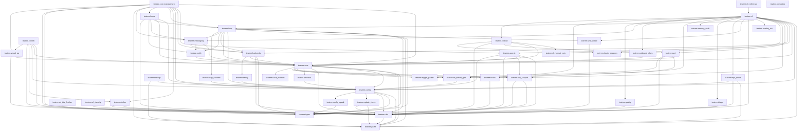

# Module Dependency Graph

```mermaid
graph TD
    teatree.config --> teatree.paths
    teatree.config --> teatree.types
    teatree.config --> teatree.utils
    teatree.config --> teatree.update_check
    teatree.config --> teatree.config_speak
    teatree.config_speak --> teatree.types
    teatree.update_check --> teatree.paths
    teatree.update_check --> teatree.utils
    teatree.utils --> teatree.paths
    teatree.self_update --> teatree.utils
    teatree.hooks --> teatree.utils
    teatree.timeouts --> teatree.config
    teatree.repo_mode --> teatree.paths
    teatree.repo_mode --> teatree.utils
    teatree.repo_mode --> teatree.config
    teatree.skill_support --> teatree.types
    teatree.skill_support --> teatree.utils
    teatree.core --> teatree.types
    teatree.core --> teatree.paths
    teatree.core --> teatree.config
    teatree.core --> teatree.utils
    teatree.core --> teatree.timeouts
    teatree.core --> teatree.skill_support
    teatree.core --> teatree.trigger_parser
    teatree.core --> teatree.hooks
    teatree.core --> teatree.on_behalf_gate
    teatree.core --> teatree.slack_mrkdwn
    teatree.agents --> teatree.types
    teatree.agents --> teatree.core
    teatree.agents --> teatree.skill_support
    teatree.agents --> teatree.utils
    teatree.agents --> teatree.config
    teatree.backends --> teatree.types
    teatree.backends --> teatree.utils
    teatree.backends --> teatree.core
    teatree.backends --> teatree.identity
    teatree.contrib --> teatree.types
    teatree.contrib --> teatree.core
    teatree.contrib --> teatree.config
    teatree.contrib --> teatree.docker
    teatree.contrib --> teatree.utils
    teatree.contrib --> teatree.visual_qa
    teatree.cli --> teatree.paths
    teatree.cli --> teatree.config
    teatree.cli --> teatree.core
    teatree.cli --> teatree.agents
    teatree.cli --> teatree.backends
    teatree.cli --> teatree.eval
    teatree.cli --> teatree.skill_support
    teatree.cli --> teatree.claude_sessions
    teatree.cli --> teatree.overlay_init
    teatree.cli --> teatree.loop
    teatree.cli --> teatree.utils
    teatree.cli --> teatree.self_update
    teatree.cli --> teatree.repo_mode
    teatree.cli --> teatree.triage
    teatree.cli --> teatree.memory_audit
    teatree.cli --> teatree.on_behalf_gate
    teatree.cli --> teatree.outbound_claim
    teatree.cli --> teatree.messaging
    teatree.cli --> teatree.quality
    teatree.cli --> teatree.hooks
    teatree.cli --> teatree.cli.eval
    teatree.cli.eval --> teatree.cli._format_opts
    teatree.cli.eval --> teatree.core
    teatree.cli.eval --> teatree.eval
    teatree.cli.eval --> teatree.utils
    teatree.cli.eval --> teatree.claude_sessions
    teatree.eval --> teatree.core
    teatree.eval --> teatree.hooks
    teatree.eval --> teatree.utils
    teatree.eval --> teatree.trigger_parser
    teatree.core.management --> teatree.core
    teatree.core.management --> teatree.agents
    teatree.core.management --> teatree.backends
    teatree.core.management --> teatree.config
    teatree.core.management --> teatree.docker
    teatree.core.management --> teatree.loop
    teatree.core.management --> teatree.loops
    teatree.core.management --> teatree.messaging
    teatree.core.management --> teatree.paths
    teatree.core.management --> teatree.types
    teatree.core.management --> teatree.utils
    teatree.core.management --> teatree.visual_qa
    teatree.loop_enabled --> teatree.config
    teatree.loop --> teatree.types
    teatree.loop --> teatree.paths
    teatree.loop --> teatree.utils
    teatree.loop --> teatree.self_update
    teatree.loop --> teatree.config
    teatree.loop --> teatree.core
    teatree.loop --> teatree.backends
    teatree.loop --> teatree.notify
    teatree.loop --> teatree.messaging
    teatree.loop --> teatree.loop_enabled
    teatree.loops --> teatree.config
    teatree.loops --> teatree.core
    teatree.loops --> teatree.loop
    teatree.loops --> teatree.messaging
    teatree.loops --> teatree.notify
    teatree.loops --> teatree.utils
    teatree.docker --> teatree.types
    teatree.docker --> teatree.utils
    teatree.visual_qa --> teatree.core
    teatree.visual_qa --> teatree.utils
    teatree.identity --> teatree.config
    teatree.on_behalf_gate --> teatree.config
    teatree.notify --> teatree.core
    teatree.messaging --> teatree.core
    teatree.messaging --> teatree.notify
    teatree.messaging --> teatree.backends
    teatree.outbound_claim --> teatree.core
    teatree.settings --> teatree.config
    teatree.settings --> teatree.paths
    teatree.cli_reference --> teatree.cli
    teatree.triage --> teatree.utils
    teatree.url_title_fetcher --> teatree.utils
    teatree.url_classify --> teatree.utils
    teatree.quality --> teatree.utils
    teatree.paths
    teatree.types
    teatree.templates
    teatree.claude_sessions
    teatree.overlay_init
    teatree.cli._format_opts
    teatree.slack_mrkdwn
    teatree.memory_audit
    teatree.trigger_parser
```
