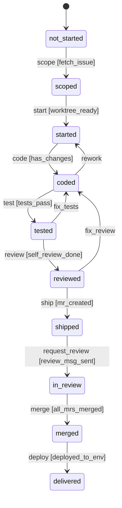
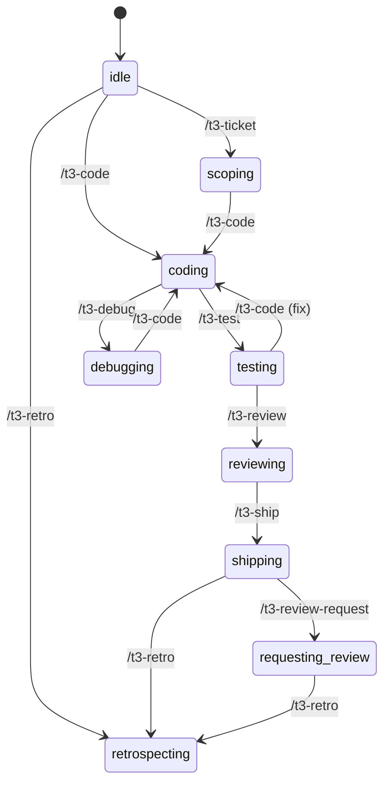

# Three-FSM Architecture — Design Document

## Status: Draft / Proposal

## Problem

1. **Two implicit state models that don't talk.** The worktree FSM (`lib/lifecycle.py`) tracks infrastructure; ticket transitions (`references/ticket-transitions.md`) track delivery. Neither is aware of the other, and the agent must manually coordinate.

2. **No session-level gates.** Nothing prevents the agent from shipping without testing, or requesting review without shipping. These quality gates are enforced by skill prose, which the agent can (and does) skip.

3. **Friction from multi-step operations.** Ticket intake requires 4+ decisions. Shipping requires 3-5 steps. The agent forgets steps or gets the order wrong.

4. **Commands don't produce observable state transitions.** Running `/t3-test` doesn't mark anything as "tested." The ticket stays "Doing" from first code to MR merged.

## Design

Three composable finite state machines, each modeling a different concern:

```
┌─────────────────────────────────────────────────────────────┐
│                    Ticket FSM (delivery)                    │
│  not_started → scoped → started → shipped → in_review →    │
│  merged → delivered                                         │
│                                                             │
│  Contains 0..N worktrees. Gates on aggregate worktree facts.│
└─────────────────────────────────────────────────────────────┘
        │ owns
        ▼
┌─────────────────────────────────────────────────────────────┐
│               Worktree FSM (infrastructure)                 │
│  created → provisioned → services_up → ready                │
│                                                             │
│  Per-worktree. Tracks infra state, ports, DB.               │
│  Already exists in lib/lifecycle.py.                        │
└─────────────────────────────────────────────────────────────┘

┌─────────────────────────────────────────────────────────────┐
│                  Session FSM (agent phase)                   │
│  idle → scoping → coding → testing → debugging →            │
│  reviewing → shipping → requesting_review → retrospecting   │
│                                                             │
│  Per-conversation. Ephemeral. Gates enforce quality.        │
│  Transitions triggered by /t3-* skill loading.              │
└─────────────────────────────────────────────────────────────┘
```

### Relationship between FSMs

- A **ticket** contains 0..N **worktrees** (one per repo in a multi-repo ticket).
- A **session** operates on one ticket at a time (switchable).
- The session FSM gates on worktree/ticket state where relevant (e.g., can't transition to `shipping` unless worktree is `ready`).

## FSM 1: Worktree (infrastructure)

**Already exists.** No rename needed. States are infrastructure-specific and clear.

```
created → provisioned → services_up → ready
              ↑                          │
              └──── db_refresh ──────────┘
  teardown: * → created
```

**Friction fix:** `t3 lifecycle setup --start` auto-chains `provision → start_services → verify`. Or: `start` auto-calls `setup` if state is `created`.

## FSM 2: Ticket (delivery)

**New.** Replaces the prose in `references/ticket-transitions.md` with code.



| State | Meaning | Entered by |
|---|---|---|
| `not_started` | Ticket exists, not touched | Initial |
| `scoped` | Requirements understood, design decided | `/t3-ticket` (or `t3 scope <URL>`) |
| `started` | Worktree created, environment ready | `/t3-workspace` (or `t3 start <URL>`) |
| `coded` | Implementation done, changes committed locally | `/t3-code` marks complete |
| `tested` | Tests pass (unit, integration, E2E) | `/t3-test` with green result |
| `reviewed` | Self-review passed | `/t3-review` self-review |
| `shipped` | MR created and pushed | `/t3-ship` (or `t3 ship`) |
| `in_review` | Review requested from humans | `/t3-review-request` |
| `merged` | All MRs merged to default branch | Auto-detected by followup |
| `delivered` | Deployed to target environment | Auto-detected by followup |

**Gates (conditions):**

| Transition | Gate |
|---|---|
| `scope` | Issue URL fetched successfully |
| `start` | At least one worktree in `ready` state |
| `code` | `git diff` shows changes |
| `test` | Test command exited 0 |
| `review` | Self-review checklist completed |
| `ship` | MR created successfully |
| `request_review` | Review message sent to channel |
| `merge` | All MRs in merged state |
| `deploy` | `ticket_check_deployed` extension returns True |

**Backward transitions** (rework loops): `coded → started`, `tested → coded`, `reviewed → coded` — triggered when fixes are needed.

## FSM 3: Session (agent phase)

**New.** Ephemeral per-conversation. Enforces quality gates within a single work session.



**Gates (the quality enforcement):**

| Transition | Gate | Rationale |
|---|---|---|
| `coding → shipping` | BLOCKED | Must test before shipping |
| `coding → reviewing` | BLOCKED | Must test before reviewing |
| `coding → requesting_review` | BLOCKED | Must ship before requesting review |
| `testing → shipping` | Only if tests passed | Can't ship broken code |
| `reviewing → shipping` | Only if review clean | Can't ship with open findings |

**`--force` override:** Every blocked transition can be forced with `--force`, but the agent MUST ask the user first. The hook/CLI prints a warning:

```
⚠ Cannot transition to shipping: session has not passed testing.
  Use --force to override (requires explicit user approval).
```

The agent must NOT use `--force` autonomously. This is enforced by:

1. The CLI printing the warning (visible to user)
2. A guardrail in the skill: "Never use --force without explicit user approval"
3. The hook can optionally block `--force` in CI environments

## Unified CLI Commands

**High-impact friction fixes from the table:**

### `t3 start <TICKET_URL>` — Zero to coding

Combines: fetch issue → detect repos → `ws_ticket` → `lifecycle setup --start`

```
t3 start https://gitlab.com/org/repo/-/issues/1234
# 1. Fetches issue context (t3-ticket)
# 2. Detects repos and tenant
# 3. Creates worktree (ws_ticket)
# 4. Provisions + starts services (lifecycle setup --start)
# 5. Transitions: ticket not_started→scoped→started, session idle→scoping→coding
```

### `t3 ship` — Code done to MR created

Combines: squash fixups → push → cancel stale pipelines → create MR

```
t3 ship
# 1. Self-review checklist (t3-review quick)
# 2. Squash unpushed fixup commits
# 3. Push to remote
# 4. Cancel stale pipelines
# 5. Create MR (with validated title format)
# 6. Transitions: ticket reviewed→shipped, session reviewing→shipping
```

### `t3 test` — Test with auto-setup

```
t3 test backend          # pytest with --reuse-db, auto Docker check
t3 test frontend         # nx test with correct project
t3 test e2e              # Playwright with full worktree
t3 test ci               # Trigger CI and poll results
```

### `t3 daily` — Daily followup batch

Combines: collect followup → check gates → advance tickets → remind reviewers

```
t3 daily
# 1. Collect all in-flight tickets
# 2. Check transition gates for each
# 3. Auto-advance where gates pass
# 4. Post review reminders for stale MRs
# 5. Generate HTML dashboard
```

### `t3 mr post-evidence <paths...>` — Post screenshots to MR

```
t3 mr post-evidence /tmp/screenshot1.png /tmp/screenshot2.png
# 1. Uploads to GitLab
# 2. Creates formatted note with images
# 3. Handles escaping correctly
```

## Command ↔ State ↔ Skill Mapping

| Command | Session transition | Ticket transition | Skill loaded |
|---|---|---|---|
| `t3 start <URL>` | `idle → scoping → coding` | `not_started → scoped → started` | t3-ticket + t3-workspace |
| `/t3-code` | `* → coding` | — | t3-code |
| `t3 test` | `coding → testing` | `started → tested` (if pass) | t3-test |
| `/t3-debug` | `* → debugging` | — | t3-debug |
| `/t3-review` | `testing → reviewing` | `tested → reviewed` | t3-review |
| `t3 ship` | `reviewing → shipping` | `reviewed → shipped` | t3-ship |
| `/t3-review-request` | `shipping → requesting_review` | `shipped → in_review` | t3-review-request |
| `/t3-retro` | `* → retrospecting` | — | t3-retro |
| `t3 daily` | — (batch, no session) | advances all eligible | t3-followup |

## Persistence

| FSM | Storage | Lifetime |
|---|---|---|
| Worktree | `$T3_DATA_DIR/tickets/<iid>/.state.json` | Until worktree deleted |
| Ticket | `$T3_DATA_DIR/tickets/<iid>/ticket.json` | Until ticket closed |
| Session | `/tmp/claude-statusline/<session_id>.session.json` | Per conversation |

## Implementation Plan

1. **`lib/ticket_fsm.py`** — TicketLifecycle class, same pattern as WorktreeLifecycle
2. **`lib/session_fsm.py`** — SessionPhase class, ephemeral, gates with `--force`
3. **`t3_cli.py`** — Add `t3 start`, `t3 ship`, `t3 test`, `t3 daily`, `t3 mr post-evidence`
4. **`ensure-skills-loaded.sh`** — On skill load, call session FSM transition; warn if blocked
5. **`references/ticket-transitions.md`** — Replace prose with pointer to `lib/ticket_fsm.py`
6. **Statusline** — Show all 3 states: `wt:ready | ticket:tested | session:reviewing`

## Open Questions

1. Should `/t3-debug` be gated or always allowed? (Current proposal: always allowed, `* → debugging`)
2. Should the session FSM gate on the ticket FSM? (e.g., can't `testing` if ticket is `not_started`)
3. Should `t3 start` require a URL or also accept `t3 start` in an existing worktree to just resume?
