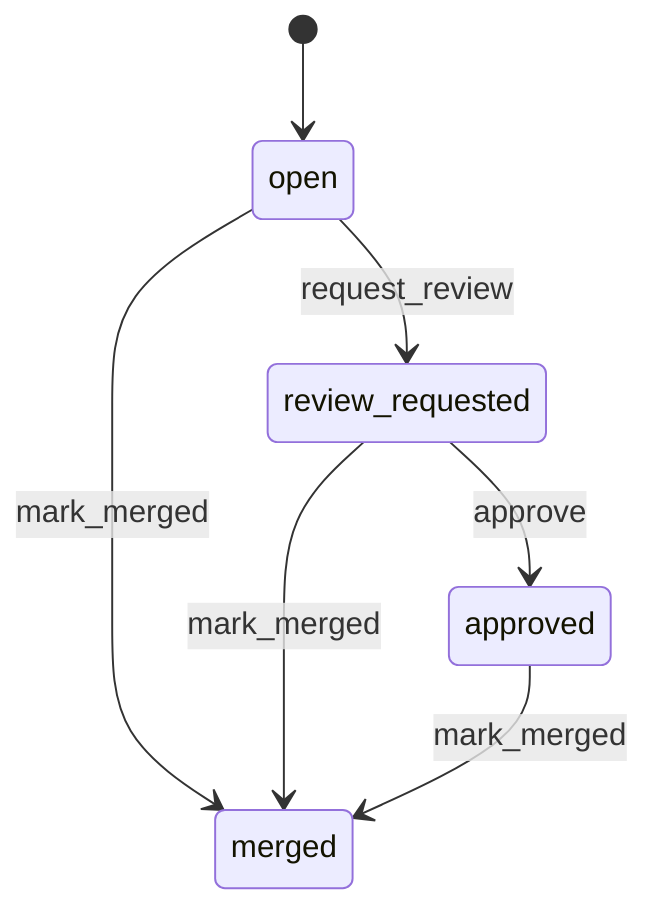

# PullRequest lifecycle

<!-- BEGIN GENERATED: pull-request-fsm -->

```mermaid
stateDiagram-v2
    [*] --> open
    open --> review_requested : request_review
    open --> merged : mark_merged
    review_requested --> approved : approve
    review_requested --> merged : mark_merged
    approved --> merged : mark_merged
```
<!-- END GENERATED: pull-request-fsm -->
