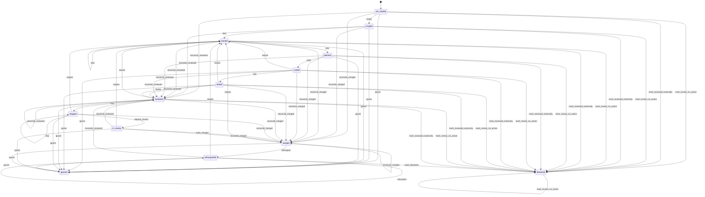

# Ticket lifecycle

<!-- BEGIN GENERATED: ticket-fsm -->

```mermaid
stateDiagram-v2
    [*] --> not_started
    not_started --> scoped : scope
    not_started --> reviewed : reconcile_reviewed
    not_started --> merged : reconcile_merged
    not_started --> delivered : mark_review_no_action
    not_started --> delivered : mark_reviewed_externally
    not_started --> ignored : ignore
    scoped --> started : start
    scoped --> reviewed : reconcile_reviewed
    scoped --> merged : reconcile_merged
    scoped --> delivered : mark_review_no_action
    scoped --> delivered : mark_reviewed_externally
    scoped --> ignored : ignore
    started --> started : start
    started --> planned : plan
    started --> reviewed : reconcile_reviewed
    started --> merged : reconcile_merged
    started --> delivered : mark_review_no_action
    started --> delivered : mark_reviewed_externally
    started --> ignored : ignore
    planned --> coded : code
    planned --> reviewed : reconcile_reviewed
    planned --> merged : reconcile_merged
    planned --> delivered : mark_review_no_action
    planned --> delivered : mark_reviewed_externally
    planned --> ignored : ignore
    coded --> started : rework
    coded --> tested : test
    coded --> reviewed : reconcile_reviewed
    coded --> merged : reconcile_merged
    coded --> delivered : mark_review_no_action
    coded --> delivered : mark_reviewed_externally
    coded --> ignored : ignore
    tested --> started : rework
    tested --> reviewed : reconcile_reviewed
    tested --> reviewed : review
    tested --> merged : reconcile_merged
    tested --> delivered : mark_review_no_action
    tested --> delivered : mark_reviewed_externally
    tested --> ignored : ignore
    reviewed --> started : rework
    reviewed --> reviewed : reconcile_reviewed
    reviewed --> shipped : ship
    reviewed --> merged : reconcile_merged
    reviewed --> delivered : mark_review_no_action
    reviewed --> delivered : mark_reviewed_externally
    reviewed --> ignored : ignore
    shipped --> started : reopen
    shipped --> shipped : ship
    shipped --> in_review : request_review
    shipped --> merged : reconcile_merged
    shipped --> ignored : ignore
    in_review --> started : reopen
    in_review --> reviewed : reconcile_reviewed
    in_review --> merged : mark_merged
    in_review --> merged : reconcile_merged
    in_review --> ignored : ignore
    merged --> started : reopen
    merged --> merged : mark_merged
    merged --> merged : reconcile_merged
    merged --> retrospected : retrospect
    merged --> ignored : ignore
    retrospected --> started : reopen
    retrospected --> reviewed : reconcile_reviewed
    retrospected --> retrospected : retrospect
    retrospected --> delivered : mark_delivered
    retrospected --> ignored : ignore
    delivered --> delivered : mark_review_no_action
```
<!-- END GENERATED: ticket-fsm -->
