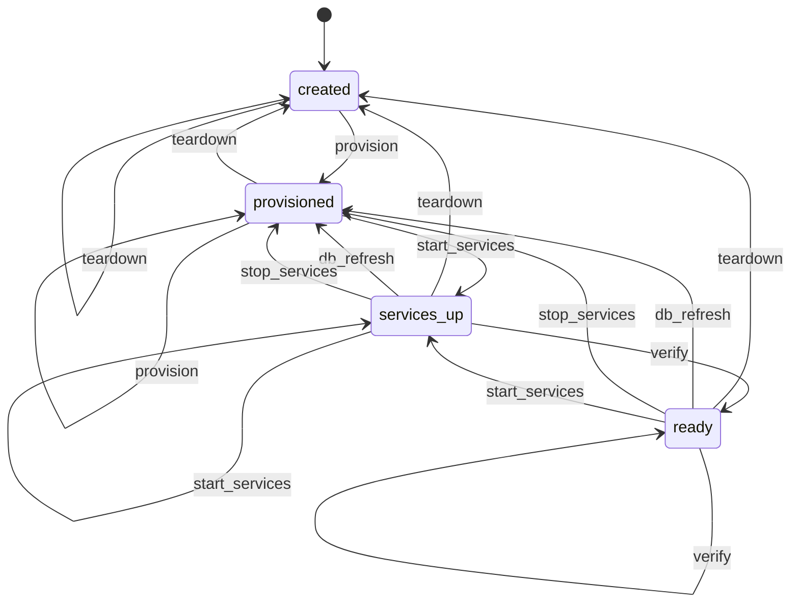

# Worktree lifecycle

<!-- BEGIN GENERATED: worktree-fsm -->

```mermaid
stateDiagram-v2
    [*] --> created
    created --> created : teardown
    created --> provisioned : provision
    provisioned --> created : teardown
    provisioned --> provisioned : db_refresh
    provisioned --> provisioned : provision
    provisioned --> services_up : start_services
    services_up --> created : teardown
    services_up --> provisioned : db_refresh
    services_up --> provisioned : stop_services
    services_up --> services_up : start_services
    services_up --> ready : verify
    ready --> created : teardown
    ready --> provisioned : db_refresh
    ready --> provisioned : stop_services
    ready --> services_up : start_services
    ready --> ready : verify
```
<!-- END GENERATED: worktree-fsm -->
