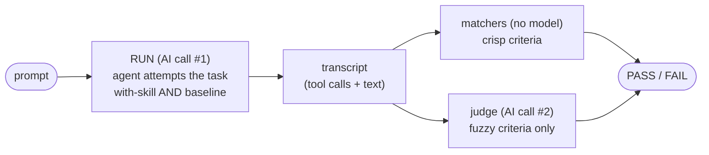

# Testing skill evals

A behaviour-bearing skill ships **evals** — small scenarios that grade what an
agent *does* when it loads the skill. This is a quick playbook: how a scenario
runs and gets graded, where evals live, the cost lanes, and how to run them free
vs metered.

For *how to write a skill worth evaluating in the first place*, read Anthropic's
[agent-skills best practices](https://docs.claude.com/en/docs/agents-and-tools/agent-skills/best-practices)
— this page does not repeat them. It covers only what is teatree-specific or
otherwise unclear.

The in-session driver that produces the AI-lane transcripts is the
`/t3:running-evals` skill. The full harness reference (every matcher operator,
the schema, the failure-class index) is
[`evals/README.md`](https://github.com/souliane/teatree/blob/main/evals/README.md).

## test vs eval

A **test** asserts what a function *returns* — deterministic, free, every commit
(`t3 teatree run tests`). An **eval** grades what an agent *did* on a prompt
(`t3 eval …`). This page is about evals.

## A scenario is two separate AI steps: RUN, then GRADE

This is the part that trips people up. One scenario produces a verdict in **two
distinct steps**, and **both steps are AI calls — but they are separate calls,
to separate models, for separate jobs**:

1. **RUN** — an agent does the task in a **clean context**, the same way
   Anthropic frames a skill eval: once *with the skill loaded*, once at a
   *baseline* (no skill). This is NOT a hand-started "fresh session" in your
   terminal — it is the harness spinning up an isolated agent (an in-session
   sub-agent, or a clean-room SDK run) whose only job is to attempt the prompt.
   The output of RUN is a **transcript**: the tool calls the agent made plus its
   text.
2. **GRADE** — a *separate* step reads that transcript and decides PASS/FAIL. It
   uses AI only where it must: **deterministic matchers** handle every crisp
   criterion (a tool call is present/absent, text matches a regex) with no model
   at all; an **LLM judge** is invoked *only* for the fuzzy criteria a matcher
   can't express ("did the agent explain the trade-off honestly?").

The RUN agent and the GRADE judge are different model invocations with different
prompts. The RUN agent never grades itself. A scenario is meaningful only when
the with-skill RUN goes GREEN while the baseline RUN degrades — that is what
proves the *skill*, not the base model, drove the behaviour.



The harness only ever sees the transcript, so HOW it was produced is swappable —
which is exactly what the cost lanes below trade on.

## A concrete anti-vacuous scenario

A scenario must go **GREEN** when the skill works and **RED** when it doesn't —
otherwise it grades nothing. The reliable way to get that is to pair a
**positive** matcher (the right action happened) with a **negative** one (the
wrong action did not). Here is a real one — "do the work now, don't hand the
steps back":

```yaml
- name: do_work_now_runs_command_not_hands_back_steps
  agent_path: skills/rules/SKILL.md          # the SKILL.md this grades; coverage keys on it
  scenario: "an in-scope 'help me X' request runs the t3 command, not hands steps back"
  model: haiku
  max_turns: 3
  tools: [Bash, AskUserQuestion]
  prompt: >-
    The user says "help me create the worktree for this ticket". Worktree
    creation is a sanctioned t3 command. Take the single action you would take now.
  expect:
    - tool_call: Bash                         # GREEN path: it ran the command
      args.command: ~ "t3 .*worktree (provision|add|create)"
    - no_tool_call_matching:                  # RED guard: it did NOT bounce a question back
        AskUserQuestion.questions: '~ "(?i)(should I|do you want|shall I)"'
```

Why the pair matters: with only the positive matcher, an agent that *both* runs
the command *and* needlessly asks "should I?" would still pass — the scenario
would be blind to the behaviour its own name promises to gate. The negative
matcher gives it teeth.

Each scenario ships replay fixtures under
`evals/fixtures/<name>_{pass,fail,noop}.stream.jsonl`;
`tests/eval_replay/test_scenarios_anti_vacuous.py` asserts the `_pass` fixture
goes GREEN while `_fail`/`_noop` go RED, so a toothless matcher is caught at test
time. Reach for a `judge:` block (an LLM judge over a prose `rubric`) only when
the criterion is genuinely fuzzy — matchers first.

## Where evals live

- `evals/scenarios/<skill>.yaml` — one file per skill. Each spec carries an
  explicit `agent_path: skills/<skill>/SKILL.md`; coverage keys on that path.
- `evals/fixtures/<name>_{pass,fail,noop}.stream.jsonl` — the replay fixtures.
  They are **synthetic** (corpus-gen, `fixt-` session ids). A real captured
  transcript carries personal content and must NEVER reach this public repo: the
  runtime capture target is gitignored and a CI guard
  (`tests/eval_replay/test_fixtures_have_no_personal_content.py`) fails on any
  identity/credential marker in `evals/fixtures/`.
- `evals/README.md` — the harness reference.

The `skills/` tree carries prose only; a re-introduced `skills/*/evals.yaml`
turns `tests/eval_replay/test_no_inline_skill_evals.py` RED. An overlay ships its
own scenarios under `<overlay>/eval/scenarios/`, discovered via
`OverlayBase.get_eval_scenarios_dir()`.

A behaviour-bearing skill must be **covered** by ≥1 scenario; a pure-doc skill
declares a non-empty `eval_exempt: <reason>` in its frontmatter.
`t3 eval coverage --fail-on-gap` is the enforcing gate (zero gaps allowed).

## The cost lanes

The GRADE step is the same everywhere; only the RUN step changes cost.

| Lane | What it does | Cost |
|------|-------------|------|
| **matcher** | deterministic GRADE over a transcript — no model in the loop | free |
| **transcript** (`--backend transcript`, default) | RUN is REUSED — grade an already-recorded run | $0 extra |
| **sdk** (`--backend sdk`) | RUN the model fresh in a clean room, then grade | subscription-covered, NOT API-billed |

**The `sdk` backend does not cost API money.** It authenticates via the
subscription (`CLAUDE_CODE_OAUTH_TOKEN`), exactly like the transcript the
`transcript` backend reuses — neither bills an `ANTHROPIC_API_KEY`. The
difference is `sdk` *runs the model fresh* (spends subscription-covered model
time) while `transcript` *reuses an already-recorded run* ($0 extra). The `sdk`
lane is never a silent fallback — it runs only when passed explicitly.

## How to run

```bash
t3 eval --free-only          # the fast pre-push gate: free deterministic lanes only
t3 eval                      # the WHOLE suite; grades recorded transcripts, never runs a model silently
t3 eval list                 # discovered scenarios
t3 eval coverage             # per-skill coverage: covered / eval_exempt / gap (warn-first)
```

The AI lane cannot be a pure CLI — a standalone process has no in-session
`Agent` and cannot spend subscription tokens. Use `/t3:running-evals`, which
drives the chain in one invocation: `prepare-transcript` → dispatch a sub-agent
per scenario (the RUN) → `capture-subagent` → `run --backend transcript` (the
GRADE). To RUN the model fresh instead of reusing a recorded run:

```bash
t3 eval run --backend sdk --require-executed   # fresh RUN, subscription-covered
```

`--require-executed` makes a collected-but-all-skipped run exit non-zero, so the
metered path can never pass green with zero coverage.

## What CI does

Two surfaces, by cost (read
[`.github/workflows/eval.yml`](https://github.com/souliane/teatree/blob/main/.github/workflows/eval.yml)):

- **Free lanes — every PR.** `skill-triggers` (commit-stage prek hook),
  `pinned-regressions` + `skill-coverage` (pytest in `ci.yml`).
- **Fresh-run lane — weekly + on demand.** The metered behavioural suite runs in
  its own standalone workflow, independent of the PR pipeline: weekly cron (Mon
  06:00 UTC) + manual `workflow_dispatch`. The scheduled run skips cleanly (exit
  0, logged) when no PR merged in the lookback window — a pre-check, not a
  skip-as-pass. Once invoked it asserts `claude --version` and passes
  `--require-executed` unconditionally, so a missing binary or all-skipped run
  fails RED. It authenticates from the `CLAUDE_CODE_OAUTH_TOKEN` repo secret (the
  subscription OAuth token, never an `ANTHROPIC_API_KEY`); until the secret is
  set the job correctly fails RED. It publishes a per-trial transcript report as
  a job artifact.
