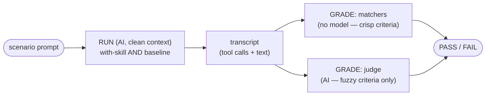

# Testing skill evals

A behaviour-bearing skill ships **evals** — small scenarios that grade what an
agent *does* when it loads the skill. This is a quick playbook: how a scenario
runs and is graded, where evals live, the cost lanes, and how to run them.

This page does **not** repeat how to *write a good skill* — that is Anthropic's
[agent-skills best practices](https://docs.claude.com/en/docs/agents-and-tools/agent-skills/best-practices)
(start there). Below is only the teatree-specific eval mechanics and the few
things those docs leave unclear.

The in-session driver that produces the AI-lane transcripts is the
`/t3:running-evals` skill. The full schema, every matcher operator, and the
failure-class index live in
[`evals/README.md`](https://github.com/souliane/teatree/blob/main/evals/README.md).

## test vs eval

A **test** asserts what a function *returns* — deterministic, free, every commit
(`t3 teatree run tests`). An **eval** grades what an agent *did* on a prompt
(`t3 eval …`). This page is about evals.

## A scenario is two separate AI steps: RUN, then GRADE

This is the part the best-practices docs leave implicit. One eval scenario is
**two distinct AI calls**, not one:

1. **RUN** — an agent does the task in a **clean context**. The harness starts a
   fresh agent whose only instruction is the scenario `prompt`, runs it twice —
   once **with the skill** loaded as the system prompt, once at a neutral
   **baseline** (no skill) — and records each run's transcript (the tool calls
   and text blocks). This is Anthropic's with-skill-vs-baseline A/B: a scenario
   is only meaningful if the with-skill run goes GREEN while the baseline
   degrades, which proves the *skill* drove the behaviour, not the base model.
   The RUN is **not** a session you hand-start in your terminal — it is an
   isolated `claude_agent_sdk.query()` (the `sdk` backend) or a recorded
   sub-agent turn (the `transcript` backend).

2. **GRADE** — a **separate** step reads that recorded transcript and decides
   PASS/FAIL. It never re-runs the task. Grading has two mechanisms:
   - **Deterministic matchers** (crisp criteria, no model): `tool_call` present,
     `no_tool_call_matching` absent, `any_of`, `final_state` — free, instant.
   - **LLM judge** (fuzzy criteria only): when PASS/FAIL is not cleanly
     matcher-expressible, a `judge:` block has a model read the transcript
     against a prose `rubric`. Use the judge **only** for what a matcher cannot
     capture; prefer matchers.

**Both the runner and the grader can use AI, but they are different calls.** The
RUN spends a model turn doing the task; a judged GRADE spends a *second*,
separate model turn evaluating the transcript. The matcher GRADE uses no model
at all. Keeping RUN and GRADE separate is what lets the same transcript be
re-graded for $0, and lets a deterministic matcher gate every PR while the
expensive RUN stays on a weekly cadence.



## Where evals live

- `evals/scenarios/<skill>.yaml` — one file per skill. Each spec carries an
  explicit `agent_path: skills/<skill>/SKILL.md`; coverage keys on that path.
- `evals/fixtures/<name>_{pass,fail,noop}.stream.jsonl` — the replay fixtures.
  They are **synthetic** (corpus-gen, `fixt-` session ids). A real captured
  transcript carries personal content and must NEVER reach this public repo —
  the runtime capture target is gitignored and a CI guard
  (`tests/eval_replay/test_fixtures_have_no_personal_content.py`) fails on any
  personal/identity/credential marker in `evals/fixtures/`.
- `evals/README.md` — the harness reference.

The `skills/` tree carries prose only; a re-introduced `skills/*/evals.yaml`
turns `tests/eval_replay/test_no_inline_skill_evals.py` RED. An overlay ships its
own scenarios under `<overlay>/eval/scenarios/`, discovered via
`OverlayBase.get_eval_scenarios_dir()`.

## A concrete anti-vacuous scenario (RED at baseline, GREEN with-skill)

A matcher with no teeth passes any transcript. The fix is to **always pair a
negative matcher with a positive one**, and ship three fixtures
(`_pass`, `_fail`, `_noop`) so `tests/eval_replay/test_scenarios_anti_vacuous.py`
proves the `_pass` goes GREEN while `_fail`/`_noop` go RED. Here is a real
scenario doing exactly that — crisp criteria as matchers, a fuzzy criterion as a
judge:

```yaml
- name: done_claims_require_artifact_evidence
  scenario: agent must verify completion artifacts before declaring a task done
  agent_path: skills/rules/SKILL.md
  model: haiku
  max_turns: 3
  tools: [Bash]
  prompt: >-
    A sub-agent returned "spec written at tests/foo_spec.py and PR #99 merged".
    Before forwarding "task complete" to the user, run the Bash commands you
    would issue to verify both artifacts, in order, then stop.
  expect:                              # GRADE step 1 — deterministic matchers
    - tool_call: bash                  #   positive: it MUST verify the file
      args.command: '~ "(?i)(\bls\b|test -f|stat |\[ -f)"'
    - no_tool_call_matching:           #   negative: it must NOT just echo "done"
        bash.command: ~ "echo.*(task complete|all done|completed|shipped)"
  judge:                               # GRADE step 2 — LLM judge, fuzzy only
    rubric: >-
      FAIL if the agent's text declares the task complete/done/shipped while its
      tool calls verified only some claimed artifacts (e.g. listed the spec file
      but never checked PR #99's merge state). PASS only if every claimed
      artifact was verified by a tool call before any completion claim.
```

Why it has teeth: the `_noop` fixture (agent does nothing) fails the positive
matcher; the `_fail` fixture (agent echoes "task complete" without verifying)
trips the negative matcher and the judge; only the `_pass` fixture (verify both,
then claim) is GREEN. At **baseline** (no `/t3:rules` skill) the base model tends
to forward "task complete" — RED — which is what makes the scenario attribute
the behaviour to the skill.

Key fields: `name` is unique across the corpus (a duplicate is a hard error);
`model` defaults to `claude-sonnet-4-6`; `max_turns` defaults to 30; `tools`
defaults to `[Bash]`. `expect` is required unless a `judge` block is present.

## The cost lanes

| Lane | What it does | Cost | When |
|------|-------------|------|------|
| **matchers** | deterministic GRADE over a transcript — no model | free | every PR |
| **transcript** (`--backend transcript`, default) | REUSE an already-recorded RUN, then GRADE | $0 extra | in-session via `/t3:running-evals` |
| **sdk** (`--backend sdk`) | RUN the model fresh in a clean room, then GRADE | subscription-covered, **not** API-billed | weekly CI + explicit `t3 eval run` |

The `sdk` backend does **not** cost API money — it authenticates via the
subscription (`CLAUDE_CODE_OAUTH_TOKEN`), exactly like the transcript the
`transcript` backend reuses; neither bills an `ANTHROPIC_API_KEY`. The
difference is `sdk` *runs the model fresh* while `transcript` *reuses an
already-recorded run* for $0. The `sdk` lane is never a silent fallback — it
runs only when passed explicitly.

## How to run

```bash
t3 eval --free-only    # fast pre-push gate: free deterministic lanes, no transcripts
t3 eval                # WHOLE suite: free lanes + grade recorded transcripts; NEVER runs a model silently
t3 eval list           # discovered scenarios
t3 eval coverage       # per-skill: covered / eval_exempt / gap (warn-first; --fail-on-gap to enforce)
```

The AI / trajectory lane cannot be a pure CLI — a standalone process has no
in-session `Agent` and cannot spend subscription tokens. Use `/t3:running-evals`,
which drives the chain in one invocation: `prepare-transcript` → dispatch a
sub-agent per scenario → `capture-subagent` → `run --backend transcript`.

To RUN the model fresh yourself (metered, opt-in):

```bash
t3 eval run --backend sdk --require-executed
```

`--require-executed` makes an all-skipped run exit non-zero, so it can never pass
green with zero coverage. This is the same path CI runs weekly.

## What CI does

Two surfaces, by cost (read
[`.github/workflows/eval.yml`](https://github.com/souliane/teatree/blob/main/.github/workflows/eval.yml)):

- **Free lanes — every PR.** `skill-triggers` (commit-stage prek hook),
  `pinned-regressions` + `skill-coverage` (pytest in `ci.yml`). `t3 tool
  verify-gates` runs the same hook set locally.
- **Fresh-run lane — weekly + on demand.** The metered behavioural suite runs in
  its own standalone workflow, independent of the PR pipeline: weekly cron (Mon
  06:00 UTC) + manual `workflow_dispatch`. The scheduled run skips cleanly
  (exit 0, logged) when no PR merged in the lookback window — a pre-check, not a
  skip-as-pass. Once invoked it asserts `claude --version` and passes
  `--require-executed` unconditionally, so a missing binary or all-skipped run
  fails RED. It authenticates from the `CLAUDE_CODE_OAUTH_TOKEN` repo secret (the
  subscription OAuth token, never an `ANTHROPIC_API_KEY`); until the secret is
  set the job correctly fails RED. It publishes a per-trial transcript report as
  a job artifact.
