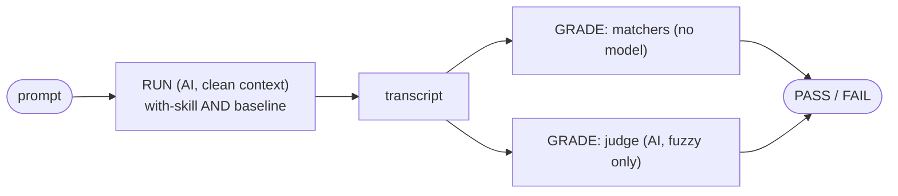

# Testing skill evals

A **test** checks what a function *returns* (deterministic, free, runs every
commit). An **eval** checks what an *agent does* when it loads a skill — given a
prompt, does it call the right tools, in the right order, and say the right
thing? Skills carry behavior, so they need behavioral tests. That is an eval.

This page is the contributor's guide: what an eval is, where they live, how they
run, and how to run them. The full schema, every matcher operator, and the
failure-class index live in [`evals/README.md`](../evals/README.md). For *how to
write a good skill*, start with Anthropic's
[agent-skills best practices](https://docs.claude.com/en/docs/agents-and-tools/agent-skills/best-practices).

## Where they live

- `evals/scenarios/<skill>.yaml` — one file per skill, one or more scenarios
  each. Every scenario names the skill it grades via `agent_path:
  skills/<skill>/SKILL.md`.
- `evals/fixtures/<name>_{pass,fail,noop}.stream.jsonl` — synthetic replay
  transcripts. They must stay free of personal content (a CI guard enforces it);
  real captured transcripts never reach this public repo.

Skills themselves carry prose only — a `skills/*/evals.yaml` is a hard error.
Overlays ship their own scenarios from the directory returned by
`OverlayBase.get_eval_scenarios_dir()`.

## A scenario, end to end

A scenario is two *separate* AI steps — keeping them apart is what makes
re-grading free and lets cheap checks gate every PR.

1. **RUN** — a fresh agent is given only the scenario `prompt`, run once **with
   the skill** loaded as its system prompt and once at a neutral **baseline** (no
   skill). The harness records each run's transcript (tool calls + text). This is
   the skill-creator A/B: a scenario is only meaningful if with-skill goes GREEN
   while baseline degrades — that proves the *skill* drove the behavior, not the
   base model. The RUN is an isolated `claude_agent_sdk.query()`, never a session
   you hand-start.

2. **GRADE** — a separate step reads the recorded transcript and decides
   PASS/FAIL. It never re-runs the task. Two mechanisms:
   - **Matchers** (no model, free, instant) for crisp criteria: `tool_call`
     present, `no_tool_call_matching` absent, `any_of`, `final_state`.
   - **LLM judge** (a second model call) only for fuzzy criteria a matcher can't
     express (tone, faithfulness). Prefer matchers; reach for a judge last.



## The scenario schema

teatree's `evals.yaml` is a **superset of Anthropic's skill-creator
`evals.json`**: same core idea (input prompt + expected behavior + grader),
plus the extras that let it run automatically and gate CI. A minimal scenario:

```yaml
- name: checking_is_read_only          # unique across the corpus
  scenario: "/t3:checking is a read-only glance — never posts or transitions"
  agent_path: skills/checking/SKILL.md
  model: haiku                         # defaults to claude-sonnet-4-6
  max_turns: 3                         # defaults to 30
  tools: [Bash]                        # defaults to [Bash]
  prompt: >-
    The user said "checking — what did I miss?". Run the ONE Bash command you
    would issue to gather the read-only report. One command only, no narration.
  expect:                              # matchers — required unless a `judge:` is present
    - tool_call: Bash                  #   positive: it MUST gather the report
      args.command: '~ "t3 .*checking"'
    - no_tool_call_matching:           #   negative: it must NOT post or transition
        bash.command: '~ "((gh|glab) (pr|mr|issue) (comment|create|merge)|notify send)"'
```

Beyond Anthropic's `prompt` / `expected_output` / `files`, teatree's `EvalSpec`
adds: `agent_path` (which skill to load + coverage attribution), `expect`
matchers (machine-checkable, not only a prose rubric), an optional `judge:`
block, `model` / `max_turns` / `tools` (run controls), `agent_sections` (send
only some `##` sections of the SKILL.md to cut token cost), and `lane`
(`clean_room` default, or `under_load` to reproduce real-session context drift).
The cost-bounds, pass@k trials, and ratchets live alongside in `evals/`.

## Make an eval that can fail (anti-vacuous)

A matcher with no teeth passes any transcript. So **pair every negative matcher
with a positive one**, and ship three fixtures — `_pass`, `_fail`, `_noop`. A
CI test (`tests/eval_replay/test_scenarios_anti_vacuous.py`) proves `_pass` goes
GREEN while `_fail`/`_noop` go RED. In the example above: `_noop` (agent does
nothing) fails the positive matcher; `_fail` (agent posts a comment) trips the
negative; only `_pass` is GREEN.

## The cost lanes

| Lane | What it does | Cost | When |
|------|-------------|------|------|
| **matchers** | GRADE a transcript, no model | free | every PR |
| **transcript** (default) | REUSE an already-recorded RUN, then GRADE | $0 extra | in-session via `/t3:running-evals` |
| **sdk** | RUN the model fresh, then GRADE | subscription-covered, **not** API-billed | weekly CI + explicit `t3 eval run` |

Neither AI backend bills an `ANTHROPIC_API_KEY` — both authenticate via the
subscription (`CLAUDE_CODE_OAUTH_TOKEN`). The `sdk` lane never runs silently;
it runs only when passed explicitly.

## How to run

```bash
t3 eval --free-only    # fast pre-push gate: free deterministic lanes only
t3 eval                # whole suite: free lanes + grade recorded transcripts
t3 eval list           # discovered scenarios
t3 eval coverage       # per-skill covered / exempt / gap (--fail-on-gap to enforce)
```

The AI lane can't be a pure CLI — a standalone process has no in-session `Agent`
to spend subscription tokens. Use `/t3:running-evals`, which chains
`prepare-transcript` → dispatch a sub-agent per scenario → `capture-subagent` →
`run --backend transcript`.

To RUN the model fresh yourself (metered, opt-in — the same path CI runs weekly):

```bash
t3 eval run --backend sdk --require-executed
```

`--require-executed` makes an all-skipped run exit non-zero, so it can never pass
green with zero coverage.

## What CI does

- **Free lanes — every PR.** `skill-triggers` (prek hook), `pinned-regressions`
  - `skill-coverage` (pytest). `t3 tool verify-gates` runs the same set locally.
- **Fresh-run lane — weekly + on demand.** A standalone workflow
  ([`eval.yml`](../.github/workflows/eval.yml)), off the PR path: weekly cron +
  manual dispatch. It skips cleanly (exit 0, logged) when no PR merged in the
  lookback window, asserts `claude --version`, and passes `--require-executed`
  unconditionally, so a missing binary or all-skipped run fails RED. It
  authenticates from the `CLAUDE_CODE_OAUTH_TOKEN` secret and publishes a
  per-trial transcript report as an artifact.
