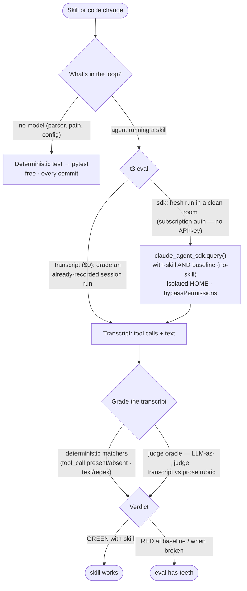

# Testing skill evals

A behaviour-bearing skill ships **evals** — small scenarios that grade what an
agent *does* when it loads the skill. This is the end-to-end guide: where evals
live, how grading works, the three cost tiers, how to run them, and what CI does.

For methodology — how to write a skill worth evaluating in the first place — see
Anthropic's
[skill-creator SKILL.md](https://github.com/anthropics/skills/blob/main/skills/skill-creator/SKILL.md)
and
[agent-skills best practices](https://docs.claude.com/en/docs/agents-and-tools/agent-skills/best-practices).
The in-session driver that produces the AI-lane transcripts is the
`/t3:running-evals` skill. The harness reference (full schema, every matcher
operator, failure-class index) is
[`evals/README.md`](https://github.com/souliane/teatree/blob/main/evals/README.md).

## test vs eval

A **test** asserts what a function *returns* — deterministic, free, every commit
(`t3 teatree run tests`). An **eval** grades what an agent *did* on a prompt
(`t3 eval …`). This page is about evals.



## Where evals live

- `evals/scenarios/<skill>.yaml` — one file per skill. Each spec carries an
  explicit `agent_path: skills/<skill>/SKILL.md`; coverage keys on that path.
- `evals/fixtures/<name>_{pass,fail,noop}.stream.jsonl` — the replay fixtures.
  They are **synthetic** (corpus-gen, `fixt-` session ids). A real captured
  transcript carries personal content and must NEVER reach this public repo —
  the runtime capture target is gitignored and a CI guard
  (`tests/eval_replay/test_fixtures_have_no_personal_content.py`) fails on any
  personal/identity/credential marker in `evals/fixtures/`.
- `evals/README.md` — the harness reference.

The `skills/` tree carries prose only; a re-introduced `skills/*/evals.yaml`
turns `tests/eval_replay/test_no_inline_skill_evals.py` RED. An overlay ships its
own scenarios under `<overlay>/eval/scenarios/`, discovered via
`OverlayBase.get_eval_scenarios_dir()`.

## How grading works

The harness only ever sees a captured transcript — tool calls and text blocks —
so HOW the transcript was produced is swappable. Two grading mechanisms run over
it:

- **Deterministic matchers** (every scenario): `tool_call` present, `no_tool_call_matching`
  absent, `any_of` disjunction, `final_state` on the terminal message — each
  with a `contains "<substr>"` or `~ "<regex>"` operator. Free, no model. Always
  pair a negative with a positive matcher so a no-op transcript cannot pass
  vacuously.
- **`judge:` LLM oracle** (opt-in per scenario): when pass/fail is not cleanly
  matcher-gradeable, a judge model reads the transcript against a prose `rubric`
  and returns PASS/FAIL. Runs the model, so it is gated like the `sdk` lane.

## The three cost tiers

| Tier | What it does | Cost |
|------|-------------|------|
| **matcher** | deterministic assertion over a transcript — no model in the loop | free |
| **transcript** (`--backend transcript`, default) | REUSE an already-recorded run by grading its on-disk transcript | $0 extra |
| **sdk** (`--backend sdk`) | RUN the model fresh in a clean room, then grade | subscription-covered, NOT API-billed |

**The `sdk` backend does not cost API money.** It authenticates via the
subscription (`CLAUDE_CODE_OAUTH_TOKEN`), exactly like the transcript the
`transcript` backend reuses — neither bills an `ANTHROPIC_API_KEY`. The
difference is `sdk` *runs the model fresh* (spends model time, subscription-
covered) while `transcript` *reuses an already-recorded run* ($0 extra). The
`sdk` lane is never a silent fallback — it runs only when passed explicitly.

## With-skill AND baseline

The `sdk` lane runs each scenario **twice**: once with the skill loaded as the
system prompt, once with a neutral baseline (no skill). A scenario is meaningful
only if it goes GREEN with-skill while the baseline degrades — that proves the
skill, not the base model, drove the behaviour. The report surfaces both
verdicts. A scenario that is not skill-attributable can opt out of the baseline,
but baseline is ON by default.

## How to run

```bash
t3 eval --free-only          # the fast pre-push gate: free deterministic lanes, no transcripts needed
t3 eval                      # the WHOLE suite (free lanes + AI lane); grades recorded transcripts, never runs a model silently
t3 eval list                 # discovered scenarios
t3 eval coverage             # per-skill coverage: covered / eval_exempt / gap (warn-first)
```

The AI / trajectory lane cannot be a pure CLI — a standalone process has no
in-session `Agent` and cannot spend subscription tokens. Use `/t3:running-evals`,
which drives the chain in one invocation: `prepare-transcript` → dispatch a
sub-agent per scenario → `capture-subagent` → `run --backend transcript`. To run
the model fresh instead:

```bash
t3 eval run --backend sdk --require-executed   # fresh run, subscription-covered; --require-executed fails an all-skipped run loud
```

## Benchmark and where results live

`t3 eval benchmark --models <a>,<b>` runs the suite per model/effort variant and
renders a cost/pass-rate comparison. Every run persists into the run-history
ledger (`t3 eval history`) unless `--no-persist`; `--baseline` marks a run as the
per-model reference `--gate-regressions` / `--gate-cost-regression` diff against.
The benchmark engine is `src/teatree/eval/benchmark.py`.

## What CI does

Two surfaces, by cost (read
[`.github/workflows/eval.yml`](https://github.com/souliane/teatree/blob/main/.github/workflows/eval.yml)):

- **Free lanes — every PR.** `skill-triggers` (commit-stage prek hook),
  `pinned-regressions` + `skill-coverage` (pytest in `ci.yml`).
- **Fresh-run lane — weekly + on demand.** The metered behavioural suite runs in
  its own standalone workflow, independent of the PR pipeline: weekly cron (Mon
  06:00 UTC) + manual `workflow_dispatch`. The scheduled run skips cleanly (exit
  0, logged) when no PR merged in the lookback window — a pre-check, not a
  skip-as-pass. Once invoked it asserts `claude --version` and passes
  `--require-executed` unconditionally, so a missing binary or all-skipped run
  fails RED. It authenticates from the `CLAUDE_CODE_OAUTH_TOKEN` repo secret (the
  subscription OAuth token, never an `ANTHROPIC_API_KEY`); until the secret is
  set the job correctly fails RED. It publishes a per-trial transcript report
  (`--transcript-html`) as a job artifact.
