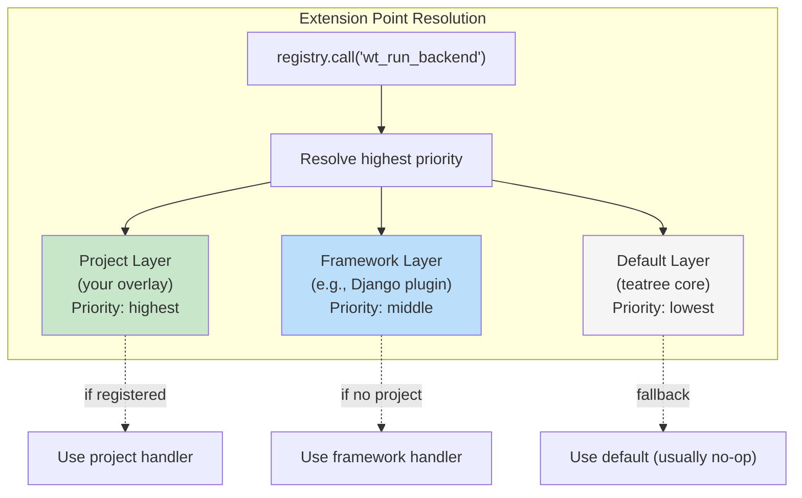

# Extension Points

Project skills override these via the `lib/registry.py` mechanism.
Each Python invocation is a fresh process. `lib/init.py` re-registers defaults + framework at startup, then the project skill (e.g. `lib/project_hooks.py`) registers at the 'project' layer.

Priority: **default** (no-op) < **framework** (Django) < **project** (project-specific).



**Prefix convention (intentional):** Most extension points use the `wt_` prefix (worktree-scoped). This includes delivery operations (`wt_create_mr`, `wt_monitor_pipeline`, `wt_send_review_request`) that conceptually operate beyond a single worktree — but they always run *from within* a worktree context and use its branch/env. The `ticket_*` and `followup_*` prefixes are reserved for operations that span multiple worktrees or operate at the workspace level.

| Point | Default | Django Plugin | Override in project skill for... |
|---|---|---|---|
| `wt_symlinks` | Replicate symlinks from main repo + share `.venv`, `node_modules`, `.python-version`, `.data` | — | Additional project-specific symlinks |
| `wt_env_extra` | No-op | `DJANGO_SETTINGS_MODULE`, `POSTGRES_DB` | Project-specific env vars |
| `wt_services` | `docker compose up -d` from main repo | — | Different service selection |
| `wt_db_import` | Return False (no default) | — | Project-specific dump discovery + restore |
| `wt_post_db` | No-op | `migrate` + `createsuperuser` | Custom post-restore steps |
| `wt_detect_variant` | Read `$WT_VARIANT` or `.env.worktree` | — | Project-specific variant detection |
| `wt_run_backend` | Print "not configured" | `manage.py runserver` + Docker up | Custom backend startup |
| `wt_run_frontend` | Print "not configured" | — | Custom frontend startup |
| `wt_build_frontend` | Print "not configured" | — | Custom frontend build |
| `wt_run_tests` | Print "not configured" | `pytest` or `manage.py test` | Custom test runner |
| `wt_create_mr` | Print "not configured" | — | MR/PR creation (GitLab, GitHub, etc.) |
| `wt_monitor_pipeline` | Print "not configured" | — | CI pipeline polling (GitLab CI, GitHub Actions, etc.) |
| `wt_send_review_request` | Print "not configured" | — | Review notification (Slack, Teams, email, etc.) |
| `wt_fetch_failed_tests` | Print "not configured" | — | Failed test extraction from CI |
| `wt_restore_ci_db` | Print "not configured" | — | Restore DB from a CI-produced dump |
| `wt_reset_passwords` | Print "not configured" | — | Reset all user passwords to a known dev value |
| `wt_trigger_e2e` | Print "not configured" | — | Trigger E2E tests on CI |
| `wt_quality_check` | Print "not configured" | — | Quality analysis (SonarQube, CodeClimate, etc.) |
| `wt_fetch_ci_errors` | Print "not configured" | — | Fetch error logs from CI (distinct from failed test IDs) |
| `wt_start_session` | Print "not configured" | — | Full dev session entrypoint: self-heal (`t3_setup` if needed) + start everything |
| `ticket_check_deployed` | Return False | — | Check if merged code is deployed to target env (CI pipeline, GCP, k8s) |
| `ticket_update_external_tracker` | No-op (log warning) | — | Update ticket status in Notion/Jira/external tracker |
| `ticket_get_mrs` | List MRs by branch name via issue tracker CLI | — | Custom MR discovery for multi-repo tickets |
| `followup_enrich_data` | No-op | — | Add project-specific fields to `followup.json` entries (e.g., Notion status, tenant) |
| `followup_enrich_dashboard` | No-op | — | Inject extra columns/sections into the HTML dashboard |

## How the Override Chain Works

```bash
# Sourcing order in .zshrc:
source $T3_REPO/scripts/lib/bootstrap.sh
# ↑ defines thin bash wrappers: t3_ticket, t3_setup, etc.
# ↑ each wrapper calls: PYTHONPATH=<scripts_dir> python3 <script>.py

source <agent-skills-dir>/<project-skill>/scripts/lib/bootstrap.sh  # project overrides
# ↑ overrides: t3_start, t3_backend, etc. (project-specific)
# ↑ each wrapper calls _ensure_env first, then Python
```

Inside each Python script:

```python
import lib.init; lib.init.init()                    # registers defaults + auto-detects Django framework
from lib.project_hooks import register_project      # (only in project skill scripts)
register_project()                                  # registers project overrides at 'project' layer
from lib.registry import call as ext
ext("wt_post_db", project_dir)                      # calls highest-priority handler
```

## Creating a Project Skill

Minimal example — create a `my_hooks.py` and register at 'project' layer:

```python
# lib/my_hooks.py
from lib.db import db_restore
from lib.registry import register

def my_env_extra(envfile: str) -> None:
    with open(envfile, "a") as f:
        f.write("MY_PROJECT_VAR=value\n")

def my_db_import(db_name: str, variant: str, main_repo: str) -> bool:
    db_restore(db_name, f"{main_repo}/dumps/latest.sql")
    return True

def my_post_db(project_dir: str) -> None:
    import subprocess
    subprocess.run(["python", "manage.py", "migrate"], cwd=project_dir, check=True)
    subprocess.run(["python", "manage.py", "loaddata", "fixtures/dev.json"], cwd=project_dir, check=True)

def register_my_project() -> None:
    register("wt_env_extra", my_env_extra, "project")
    register("wt_db_import", my_db_import, "project")
    register("wt_post_db", my_post_db, "project")
```
