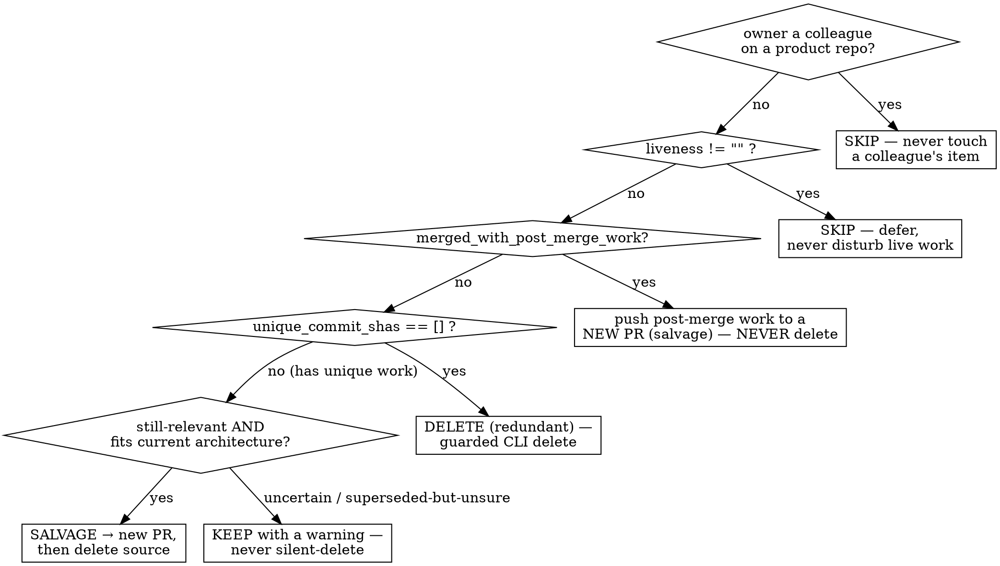

# Cleanup Sweep — Judgment Over Stale Worktrees, Branches, and Stashes

## Overview

The CLI (`/t3:workspace` § "Cleanup Patterns") does the **mechanical** cleanup:
it enumerates items, applies the ownership + liveness + done guards, detects
canonical squash-merges, **auto-deletes the provably-redundant**, and EMITs every
item it could NOT auto-decide as a machine-readable record. This skill is the
**judgment** layer over that EMIT: for each uncertain item it decides
**salvage-to-fresh-PR**, **delete-redundant**, **post-merge-to-new-PR**, **skip**,
or **keep-with-warning** — then calls the CLI to do the destructive step. It is the
worktree/branch/stash counterpart of `/t3:sweeping-tickets` (issues) and
`/t3:sweeping-prs` (open PRs).

**Core principle — the outcome invariant.** Every stale item the sweep ACTS on (one
the user owns and that is NOT live) ends **GONE**: salvaged-to-a-PR-then-removed, or
removed-with-no-PR. For a `kind:"worktree"` item, "removed" means the worktree dir is
gone via `worktree teardown` — `workspace salvage` alone only opens the PR (its
`git branch -D` can't delete a branch checked out in a worktree), so a salvage is not
complete until the teardown runs. Nothing the user owns is left rotting in place. The
ONLY thing kept in place is a genuinely **uncertain** item — kept **with a warning**,
never silently deleted. A colleague's item and a live item are **skipped** (deferred),
not acted on at all.

**You never hand-roll git deletion.** `rm -rf`, `git worktree remove`, `git branch
-D`, `git stash drop` are FORBIDDEN here — the destructive steps go through the CLI's
guarded verbs (`workspace salvage`, `worktree teardown`, `workspace clean-all`), which
carry the #706/#835 data-loss guards. The skill owns the *decision*; the CLI owns the
*destruction*.

## When to Use

- The user asks to sweep / clean up stale, lost, or abandoned worktrees, branches, or
  stashes — anything left behind that is NOT being actively worked.
- You are triaging the JSON from `t3 <overlay> workspace emit`.
- A periodic burndown surfaces accumulated worktrees a CLI `clean-all` kept-with-warning.

**When NOT to use:** plain "create a worktree" / "start the servers" / "refresh the DB"
(that is `/t3:workspace`); updating open PRs (`/t3:sweeping-prs`); triaging the issue
tracker (`/t3:sweeping-tickets`). This skill is only the *judgment over stale local items*.

## The Workflow

### 1. Get the EMIT list

```bash
t3 <overlay> workspace emit
```

This prints a JSON **array** of the items the CLI did NOT auto-delete — one
`EmitRecordDict` per item (schema in `teatree.core.cleanup_emit`, `schema_version: 1`):

| field | meaning you route on |
|---|---|
| `path` | on-disk worktree/clone location (`""` for a bare branch/stash) |
| `branch` | the branch ref — the `<source_ref>` you pass to `salvage`/`teardown` |
| `kind` | `"worktree"` \| `"branch"` \| `"stash"` |
| `unique_commit_shas` | commits whose **content** is NOT provably on target. **`[]` ⇒ nothing unique ⇒ redundant.** |
| `merged_with_post_merge_work` | forge-merged BUT the current tip has unique content (commits added AFTER the merge) |
| `banned_terms_status` | `"clean"` \| `"contains"` \| `"unknown"` — `"contains"` ⇒ clean before any push |
| `banned_terms_found` | the distinct banned terms hit |
| `liveness` | `""` when not live; otherwise the keep-reason phrase the CLI's liveness guard produced |
| `owner` | the tip author identity |

`emit` is **read-only** — it removes nothing. `clean-all` already removed the
provably-redundant; this surfaces the rest for you to route.

### 2. Route each record, in this order



**Gate A — ownership (skip a colleague's item).** If `owner` is NOT one of your
identities AND the repo is a colleague-facing **product/service** repo (one whose slug
matches the overlay's configured `colleague_repo_url_pattern`), **SKIP** — never salvage
and never delete another person's branch or worktree. Your own solo repos (teatree and
your own overlay repos) carry no such pattern, so every item there is yours → sweep
freely. The CLI's ownership guard already excludes a colleague's item from auto-deletion;
the gate here is the never-touch-a-colleague rule applied to *your* salvage/delete actions
too. See `/t3:rules` § "Three Orthogonal Repo Axes".

**Gate B — liveness (skip live/concurrent/dirty work).** If `liveness` is non-empty,
the CLI flagged the item as actively worked — a live session, an active/claimed task, a
git `index.lock`, the current CWD, an active-delivery lease, or a fresh HEAD commit.
**SKIP and defer** — only LOST work is swept; never disturb a working agent. (Uncommitted
changes are part of this: the CLI keeps a dirty worktree, so a dirty item never reaches a
delete decision.)

**Then route the lost item (owned, not live):**

- **`merged_with_post_merge_work == true` → push the post-merge work to a NEW PR, NEVER
  delete.** The branch was forge-merged, but commits were added AFTER the merge. Those
  post-merge commits are unique work — salvage them to a fresh PR, then dispose of the
  worktree (step 3 — for a `kind:"worktree"` item that is `workspace salvage` **then**
  `worktree teardown`). Do NOT treat "the PR is merged" as "the branch is redundant".

- **`unique_commit_shas == []` (and not post-merge) → DELETE (redundant).** The tip has
  no content that is not already on target — this is the **shipped-to-master** case
  (including work cleaned / de-branded and merged under a *different SHA*, which
  content-equivalence still resolves to empty) and the **superseded** case. Delete via the
  guarded CLI (step 3, delete).

- **`unique_commit_shas != []` → the item has unique unmerged work. Judge relevance:**
  - **Still-relevant AND fits the current architecture → SALVAGE** to a fresh PR, then
    dispose of the source (step 3 — `workspace salvage` **then** `worktree teardown` for a
    `kind:"worktree"` item).
  - **Superseded by a different approach / no longer relevant → DELETE (redundant)** (step
    3, delete).
  - **Genuinely uncertain whether it is still needed → KEEP with a warning.** The CLI
    already kept it; leave it kept and say why. Re-sweep later or ask the user. **Never
    silent-delete an uncertain item** — that bypasses the data-loss guard.

**Banned/customer terms are NEVER a reason to keep OR to delete.** A `banned_terms_status
== "contains"` item is still routed by the rules above. When the route is salvage (or
post-merge-to-new-PR), **CLEAN the terms first** — edit the offending files in the
worktree, replace each customer/internal string with a neutral placeholder, commit — THEN
salvage. `workspace salvage`'s banned-terms check is a final **safety gate that REFUSES a
dirty push** (it does not auto-clean); cleaning is your step. Never abandon work because
it carries banned terms, and never delete it *to avoid* cleaning.

### 3. Do the destructive step via the CLI

**Salvage a worktree-kind item is TWO commands** — capture to a new PR, THEN remove the
worktree dir. Run from the repo/clone the branch lives in:

```bash
# clean banned terms FIRST if banned_terms_status == "contains", commit, then:
t3 <overlay> workspace salvage <branch>            # branch = the record's `branch`
#   [--salvage-branch <name>]   default: salvage/<branch>
#   [--target origin/main]      base the salvage PR opens against
#   [--allow-banned]            ONLY after you cleaned + committed the terms yourself
t3 <overlay> worktree teardown --path <path>       # THEN remove the worktree dir + branch
```

`salvage` captures the unique content onto a fresh `salvage/<branch>`, pushes it, opens a
PR, and **forge-verifies the landing**. Its built-in source-delete is `git branch -D
<branch>`, which git **refuses on a branch checked out in a worktree** — so for a
`kind:"worktree"` item salvage prints `deleted=False errors=git branch -D … failed`. That
is **EXPECTED, not a failure**: the PR is up and verified, the content is safe on
`salvage/<branch>`. Finish the disposal with `worktree teardown --path <path>` — it removes
the worktree checkout AND the branch, and its #706 unpushed-guard passes **without
`--force`** because the commits are now on `origin/salvage/<branch>` (same SHAs). Only after
the teardown is a worktree-kind item actually GONE — salvage alone never removes the dir.

Read salvage's printed line — there are TWO distinct `deleted=False` causes, and NEITHER
means re-run salvage (a second salvage opens a SECOND PR):

- `salvaged=True deleted=True … pr=<url>` → the source was a bare branch and is gone; done.
- `salvaged=True deleted=False … errors=git branch -D … failed` → a worktree-kind source:
  **EXPECTED**. The PR is up + verified. Do NOT re-salvage — run
  `worktree teardown --path <path>` to finish.
- `salvaged=True deleted=False … errors=could not verify…` → the forge landing was not
  confirmed: the source is kept on purpose. Do NOT delete by hand and do NOT re-salvage;
  confirm the PR on the forge, then `worktree teardown`.
- `salvaged=False … errors=…` (push/open/banned) → nothing was created; this is the only
  case that re-runs salvage — fix the cause (e.g. clean banned terms) and retry.

**Delete (redundant)** — shipped/superseded, no unique work to keep:

```bash
# a redundant WORKTREE (kind == "worktree") — guarded per-worktree teardown:
t3 <overlay> worktree teardown --path <path>       # refuses unpushed-unique work without --force
# bare redundant BRANCHES / STASHES, orphan DBs, and done worktrees in bulk:
t3 <overlay> workspace clean-all                    # re-runs the guarded reaper; keeps anything uncertain
```

`worktree teardown` (no `--force`) is the guarded delete — it **refuses** a worktree
whose branch carries unpushed-unique commits, so a redundant teardown can never destroy
real work. `clean-all` is the bulk guarded delete for bare branches (gone-remote /
fully-merged / squash-merged-by-subject), source-gone stashes, orphan DBs, and
done+proven-redundant worktrees; it keeps every uncertain item with a warning.

### 4. Confirm the invariant

After resolving the emitted items, re-run `t3 <overlay> workspace emit`. Every item that
remains must be either **a colleague's** (skipped by Gate A), **live** (skipped by Gate
B), or **explicitly kept-with-a-warning** (uncertain). No owned, not-live, lost item
should remain un-routed.

## Worked scenarios — the decision tree applied

Given `t3 <overlay> workspace emit` returns these records, the routing is fixed:

```jsonc
// A. colleague's branch on a product repo → Gate A: SKIP (never touch).
{ "kind": "worktree", "branch": "fix-invoice", "owner": "a-colleague",
  "path": "/wk/product-repo/fix-invoice", "unique_commit_shas": ["a1b2"],
  "merged_with_post_merge_work": false, "banned_terms_status": "clean", "liveness": "" }
// → SKIP. Owner is a colleague on a product repo. Do nothing — not even salvage.

// B. live worktree → Gate B: SKIP/defer (an agent is mid-task).
{ "kind": "worktree", "branch": "feat-x", "owner": "souliane", "path": "/wk/feat-x",
  "unique_commit_shas": ["c3d4"], "merged_with_post_merge_work": false,
  "banned_terms_status": "clean",
  "liveness": "ticket has a live session or active/claimed task" }
// → SKIP. liveness != "". Never disturb live work. Re-sweep when it goes idle.

// C. merged PR + commits added AFTER the merge → push post-merge work to a NEW PR, NEVER delete.
{ "kind": "worktree", "branch": "feat-y", "owner": "souliane", "path": "/wk/feat-y",
  "unique_commit_shas": ["e5f6"], "merged_with_post_merge_work": true,
  "banned_terms_status": "clean", "liveness": "" }
// → t3 <overlay> workspace salvage feat-y               (post-merge commits → fresh salvage/feat-y PR, verified)
//   then t3 <overlay> worktree teardown --path /wk/feat-y  (removes the worktree dir+branch → GONE)
//   salvage prints deleted=False (branch checked out) — EXPECTED; do NOT re-salvage (no 2nd PR).

// D. unique unmerged work, still relevant, carries customer terms → CLEAN then salvage.
{ "kind": "worktree", "branch": "feat-z", "owner": "souliane", "path": "/wk/feat-z",
  "unique_commit_shas": ["7a8b","9c0d"], "merged_with_post_merge_work": false,
  "banned_terms_status": "contains", "banned_terms_found": ["credential"], "liveness": "" }
// → edit /wk/feat-z to replace the banned terms with placeholders, commit;
//   t3 <overlay> workspace salvage feat-z                  (banned gate now passes; salvage/feat-z PR verified)
//   then t3 <overlay> worktree teardown --path /wk/feat-z  (worktree dir+branch GONE)

// E. nothing unique — shipped via a different SHA → DELETE (redundant).
{ "kind": "worktree", "branch": "old-fix", "owner": "souliane", "path": "/wk/old-fix",
  "unique_commit_shas": [], "merged_with_post_merge_work": false,
  "banned_terms_status": "clean", "liveness": "" }
// → t3 <overlay> worktree teardown --path /wk/old-fix   (guarded; deleted-no-PR; invariant met)
```

## Rationalization table — STOP if you catch yourself thinking…

| Rationalization | Reality |
|---|---|
| "The PR is merged, so the branch is redundant — delete it." | Check `merged_with_post_merge_work`. `true` ⇒ there is work added AFTER the merge → push it to a **new PR**, never delete. |
| "It's a colleague's stale branch but I'll tidy it up." | `owner` not yours on a product repo ⇒ **SKIP**. Never salvage and never delete another person's work. |
| "It has customer/banned terms — safest to just delete it." | Banned terms are **never** a reason to keep OR delete. **Clean** them, then route by the actual rules. |
| "The worktree looks abandoned, I'll just `git worktree remove` it." | **Never hand-roll git deletion.** Use `worktree teardown` / `clean-all` — they carry the data-loss guard. |
| "I can't tell if it's still needed, I'll delete it to be safe." | Uncertain ⇒ **keep with a warning**. Silent-delete-on-uncertainty is the one forbidden outcome. |
| "There's a live session but the work looks done, I'll reap it." | `liveness != ""` ⇒ **SKIP**. A live/dirty worktree is never reaped — only LOST work is swept. |
| "`salvage` said `deleted=False`, I'll re-run salvage / delete the source myself." | For a worktree-kind item `deleted=False` + `git branch -D … failed` is **EXPECTED** (the branch is checked out) — the PR is up. Finish with `worktree teardown --path <path>`; never re-salvage (that opens a 2nd PR) and never hand-delete. |
| "Salvage made the PR but didn't remove the worktree — I'll `rm -rf` the dir." | **No.** A worktree-kind salvage is two steps: `workspace salvage` then `worktree teardown --path <path>`. The teardown removes the dir+branch safely (commits are on `salvage/<branch>`); never hand-`rm` a worktree. |

## Red Flags — STOP and re-route

- About to `rm -rf`, `git worktree remove`, `git branch -D`, or `git stash drop` **by hand** → STOP, use the CLI verb.
- About to delete an item whose `owner` is not you → STOP (Gate A).
- About to delete/salvage an item with a non-empty `liveness` → STOP (Gate B).
- About to delete an item with `merged_with_post_merge_work == true` → STOP, salvage to a new PR.
- About to abandon/delete an item *because* it has banned terms → STOP, clean it.
- About to delete "because uncertain / to be safe" → STOP, keep-with-warning.
- About to **re-run `workspace salvage`** because the first run said `deleted=False` → STOP: that opens a 2nd PR. Finish a worktree-kind salvage with `worktree teardown --path <path>`.
- Salvaged a worktree but its dir is still on disk → NOT done. Run `worktree teardown --path <path>` — salvage alone never removes the dir.

## Delegation

- `/t3:workspace` § "Cleanup Patterns" — the mechanical reaper (`clean-all`), manual
  branch/stash triage, and the orphan-worktree disposal this skill sits on top of.
- `/t3:rules` § "Three Orthogonal Repo Axes" — visibility / ownership / collaboration;
  Gate A is the collaboration axis.
- `/t3:ship` § "Bundle Into an Existing Open PR" — the alternative delivery path when
  salvaged work belongs in an already-open PR rather than a fresh one.
- `/t3:sweeping-tickets`, `/t3:sweeping-prs` — the issue and open-PR counterparts of this sweep.
