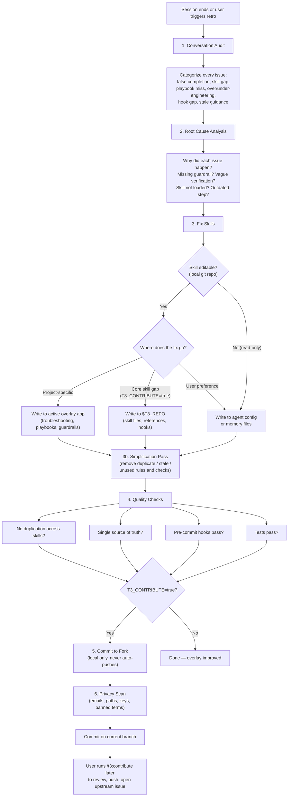

# Retro — Retrospective & Skill Improvement

## References

- [Compound Engineering](https://every.to/guides/compound-engineering) — Avery Pennarun

## Dependencies

- **rules** (required) — cross-cutting agent safety rules. Auto-loaded via `requires:`.
- **workspace** (required) — provides worktree context and `t3` CLI commands. **Load `/t3:workspace` now** if not already loaded.

Optional: If `T3_REVIEW_SKILL` is configured (e.g., `ac-reviewing-codebase`), retro recommends running it after skill modifications for deeper architectural quality assurance. Retro is lightweight and tactical; the review skill is methodical and systematic.

## Configuration

Retro's behavior depends on these `~/.teatree` variables and on whether the current repo contains an overlay package:

- **Active overlay / overlay app** — when the current repo contains an overlay package, retro writes project-specific improvements there. If no overlay is detectable, retro writes to the nearest repo-level agent instructions or user memory/config fallback.
- **`T3_CONTRIBUTE`** — `false` (default) or `true`:
  - `false`: only improve the active project overlay. Core skill gaps are noted in conversation but not acted on.
  - `true`: also improve core skills in the user's fork at `$T3_REPO`. Retro creates a local commit but **never pushes automatically**. Use `/t3:contribute` to review and push when ready.
- **`T3_PUSH`** — `false` (default) or `true`. When `false`, retro never asks about pushing — it only commits locally and reminds the user to run `/t3:contribute` later. Set to `true` to be prompted about pushing after each retro commit.
- **`T3_AUTO_PUSH_FORK`** — `false` (default) or `true`. When `true` **and** `T3_PUSH=true` **and** `origin` differs from `T3_UPSTREAM` (i.e. pushing lands on the user's fork, not upstream), retro pushes automatically after the privacy scan passes, without prompting. Upstream issue creation still requires explicit confirmation.
- **`T3_UPSTREAM`** — upstream GitHub repo (e.g., `souliane/teatree`). Used by `/t3:contribute` to open issues upstream after pushing. When `origin` matches `T3_UPSTREAM`, pushes already land directly on upstream.
- **`T3_PRIVACY`** — privacy check strictness: `strict` (default) or `relaxed`. See § Privacy Scan.
- **`T3_REVIEW_SKILL`** — name of an external skill review tool (e.g., `ac-reviewing-codebase`). If set, retro recommends running it after skill improvements. If not set, retro suggests installing one during first run and storing the preference.

### Agent Compatibility

Retro is agent-platform neutral. The workflow, `~/.teatree` variables, and teatree slash commands stay the same across platforms.

- Platform-specific files and commands remain valid where documented.
- Prefer the closest equivalent repo-level instructions file plus any user-level agent config or memory file available in the environment.
- When this skill mentions repo instructions or memory files, treat them as examples of agent config/memory locations, not the only supported targets.

Systematic review of the current conversation to extract failures, near-misses, and lessons learned, then improve the skill system so they never recur.

**When to run (proactively — do NOT wait for the user to ask):**

- User types `/t3:retro`
- End of a non-trivial work session (multi-file, multi-repo, or multi-hour) — **self-trigger this**
- After discovering that "done" wasn't actually done
- After a failure mode that existing skills didn't prevent
- **Before context compaction** — if the conversation is getting long, run retro first to capture lessons before they're lost to compression

### Pre-Compaction Persistence

If retro is in progress when compaction is imminent (long conversation, many tool calls), **write findings to a temporary file immediately** before they are lost. Use the `t3-snapshot-` prefix so the `PostCompact` hook can find and inject the file back into context automatically:

```bash
cat > /tmp/t3-snapshot-${CLAUDE_SESSION_ID:-manual}-$(date +%Y%m%d-%H%M).md <<'EOF'
# Retro Findings (pre-compaction snapshot)
<paste categorized findings here>
EOF
```

**Recovery is automatic.** The teatree `PostCompact` hook scans for `t3-snapshot-*.md` files and injects their content as `additionalContext` after compaction. You do not need to remember to read the file — it will appear in your context. Delete the temp file once findings are persisted to durable skill files.

## Scope & Editability

Retro works from **any conversation** — not just teatree-managed projects. It identifies which skills were used in the session and determines where improvements should go.

### 1. Identify used skills

Scan the conversation for loaded skills (skill tool invocations, system reminders mentioning skills, explicit `/skill` calls). Build a list of every skill that influenced the session.

### 2. Check editability

For each skill, resolve its real path (follow symlinks) and check whether it lives in a git repository:

```bash
real_path=$(readlink -f "<skill_dir>")
git -C "$real_path" rev-parse --git-dir >/dev/null 2>&1 && echo "editable" || echo "read-only"
```

| Editability | Where to write improvements |
|---|---|
| **Editable** (symlink → local git repo) | Improve the skill files directly (following the write rules in § Fix Skills) |
| **Read-only** (no git repo, installed copy, or remote-only) | Write to the best available fallback: repo-level agent instructions, user-level agent config, or user memory files. Choose whichever is closest to the point of use. |

When writing to fallback locations, clearly mark the entry as originating from a retro finding: include the skill name and a brief rationale so the entry can be promoted to the skill later if it becomes editable.

### 3. Ask when unsure

If you can't determine whether a skill is editable, or if you're unsure whether an improvement belongs in the skill vs. the agent config vs. memory — **ask the user**. Retro is meta-work; human-in-the-loop is expected.

## Persistence First

Retro is not complete until every confirmed finding is written to a durable home in the same retro pass. Conversation output is not durable storage.

- If a finding is project-specific, write it to the overlay or repo-level agent config now.
- If a finding is cross-project and editable, write it to the skill or reference file now.
- If a finding is environment- or user-specific, write it to the appropriate agent config/memory location now.
- If a helper script was required to diagnose or fix a recurring issue, save the script path and purpose in the durable docs so the next run does not start from scratch.
- Never end retro with “remember this later” or “note this in the summary” as the only persistence mechanism.

**Retro output must include a persistence summary**:

- what was learned
- where it was saved
- any helper scripts created or reused
- what still requires human follow-up, if anything

## Mark Phase Visited (Ticket-Scoped Sessions)

When retro runs for a teatree-managed ticket, mark the `retro` phase on the active session so the `t3 <overlay> pr create` shipping gate can enforce retro-before-push:

```bash
t3 <overlay> lifecycle visit-phase <ticket_id> retro
```

Skip this step when retro runs outside a ticket context (no session exists). The shipping gate fails open when no session is found, so skipping is safe — the marker only matters when a session is already tracking phases.

## Fastest Reliable Tool

Retro should optimize for **speed with repeatability**. Use AI for judgment and synthesis; use scripts for deterministic evidence gathering and bulk transformations.

### Use shell/Python when

- collecting file lists, diffs, paths, commit metadata, or editability status
- scanning many files for duplicate guidance or stale rules
- extracting structured evidence from logs, PDFs, JSON, test output, or config
- generating repeatable summaries from mechanical data
- applying the same transformation across multiple files or validating a repeated invariant

### Use AI when

- classifying failures and root causes
- deciding the canonical destination for a finding
- rewriting guidance concisely without losing meaning
- merging overlapping rules into a single source of truth
- choosing the smallest durable fix that prevents recurrence

### Decision rule

- **Deterministic and repetitive**: prefer shell/Python.
- **Ambiguous, semantic, or judgment-heavy**: prefer AI.
- **Likely to recur twice**: save or update a helper script/reference instead of relying on manual re-analysis.
- **Single one-line wording fix**: edit directly; do not build automation for trivia.

## Workflow



### 1. Conversation Audit

**Check dashboard server logs first.** Before reviewing the conversation, inspect the teatree dashboard log for errors that may not have surfaced in the conversation:

```bash
LOG="$HOME/.local/share/teatree/$(basename "$PWD")/logs/dashboard.log"
[ -f "$LOG" ] && grep -i "error\|traceback\|exception\|critical" "$LOG" | tail -30
```

Errors in the log (500s, tracebacks, failed task launches) are retro findings even if the user didn't mention them. Categorize them alongside conversation issues below.

Review the full conversation and categorize every issue:

| Category | Description | Example |
|---|---|---|
| **False completion** | Claimed "done" without verifying all requirements | Declared feature complete without running the full test suite |
| **Skill not loaded** | A relevant skill existed but wasn't loaded | Didn't load the active project overlay skill when working in project context |
| **Playbook not consulted** | A playbook covered the task but wasn't read | Didn't check the relevant playbook for the translation checklist |
| **Over-engineering** | Did unnecessary work because of wrong assumptions | Planned enum/migration/serializer changes when admin config sufficed |
| **Under-engineering** | Missed required work | Only updated the backend without the corresponding frontend changes |
| **Hook gap** | Auto-loading didn't trigger when it should have | Hook didn't suggest project overlay in matching context |
| **Stale guidance** | Followed outdated instructions | Playbook described pre-refactoring patterns |
| **Paradigm mismatch** | The architecture itself is the bottleneck, not a missing skill or guardrail | Repeatedly refining skill prose for a workflow that should be deterministic code; 3+ retro findings pointing to the same structural limitation; system untestable without an LLM |
| **Overhead without value** | A rule, check, or procedure added friction this session without preventing a real failure | Verification step that never flagged anything; duplicated guardrail across skills; step-by-step commands the CLI already handles. Fed into § 3b Simplification Pass. |

### 2. Root Cause Analysis

For each issue, determine **why** it happened:

- Missing guardrail in a skill/playbook?
- Existing guardrail not specific enough?
- Skill not loaded (hook gap)?
- Verification step missing or too vague?
- Playbook outdated after codebase evolution?
- **Architecture itself is the problem?** When 3+ findings across retros point to the same structural limitation (e.g., untestable logic, fragile state coordination, prose re-interpretation failures), stop fixing symptoms and flag the paradigm. Ask: "Would this project be better served by moving this logic out of skills into deterministic code (CLI, application framework, database-backed state)?" Present the pattern to the user with a concrete alternative.

### 3. Fix Skills

**Pre-write editability check:** Before writing to ANY skill, verify it is editable (see § Scope & Editability). For teatree-specific paths:

```bash
# Check core (when T3_CONTRIBUTE=true)
git -C "$T3_REPO" rev-parse --git-dir >/dev/null 2>&1 || echo "STOP: T3_REPO is not a git repo"
```

If a skill is not editable (no local git repo), write improvements to the best fallback location — repo-level agent instructions, user config, or memory files. See § Scope & Editability for the full decision table. In standalone mode with no overlay project, skip the overlay check.

**Load coding skills before implementing:** Retro fixes often involve writing code (Python, Django, shell). Load the appropriate coding skill (`/ac-django`, `/ac-python`, etc.) before implementing — not just for model/view work but for any code: settings, logging, CLI commands, hook scripts. Retro is not exempt from coding standards.

**Determine the target** based on `T3_CONTRIBUTE` and the nature of the fix:

#### Always: project overlay improvements (active overlay)

These go to the overlay regardless of contribution level:

| What to fix | Where to write | Format |
|---|---|---|
| Non-obvious fix or recurring failure | `<overlay app>/references/troubleshooting.md` or repo `AGENTS.md` if no overlay refs exist | symptom -> root cause -> fix -> prevention |
| New repeatable multi-step pattern | `<overlay app>/references/playbooks/<topic>.md` + update `README.md` | step-by-step guide |
| Outdated playbook step | Update the overlay playbook directly | delete/replace stale instructions |
| "Do this, not that" guardrail | `<overlay app>/references/playbooks/archive-derived-guardrails.md` | do this / not that pair |

#### When `T3_CONTRIBUTE=false` (default)

**Do NOT modify files under `$T3_REPO`.** If you detect a gap in a core skill, note it in conversation output so the user is aware, but take no action on core files.

#### When `T3_CONTRIBUTE=true`

Retro can also modify core teatree skills in the user's fork:

| What to fix | Where to write |
|---|---|
| Infrastructure/worktree failure | `$T3_REPO/skills/workspace/references/troubleshooting.md` |
| Hook should have triggered | `$T3_REPO/hooks/scripts/hook_router.py` or the relevant hook script |
| Missing verification step | The core skill that owns that workflow phase |
| Stale or incorrect guidance in a core skill | The affected skill's `SKILL.md` or reference file |

**After modifying core skills:** follow § Commit to Fork.

### 3b. Simplification Pass (Auto-Cleaning)

Retro should **remove** overhead with the same confidence it **adds** guardrails. Most skill drift comes from accumulation — rules layered on over time, each defensible in isolation, collectively expensive. Every retro must ask: **did any rule or check create friction this session without preventing a real failure?** If yes, simplify in the same commit as the other findings.

#### Qualifies for removal / consolidation

- **Duplicate rules** — the same guardrail stated in multiple skills, memory files, or `CLAUDE.md`. Keep one canonical home; replace others with a one-line cross-reference.
- **Stale instructions** — steps describing a workflow the CLI now handles automatically, or referencing removed commands/flags/paths.
- **Procedural sprawl** — step-by-step commands where `t3` already does the work (see § "Never write CLI procedures into skills" above).
- **Unused checks** — verification steps that slowed the session down but did not catch a real issue, and never fired across prior retros.
- **Over-verbose prose** — multi-paragraph explanations where a one-line rule suffices.

#### Never remove

- **Destructive-action rules** — push confirmations, force-push gates, `--no-verify` bans, deletion approvals. Cost is ~0 tokens per turn; blast radius is real.
- **Rules that prevented a real failure** (this session or a prior retro). When uncertain, leave it.
- **Rules backed by an explicit user preference** (saved feedback memory, `CLAUDE.md` entry). Ask before removing.

#### How to simplify

- **Prefer consolidation over deletion.** Move the rule to one canonical home (typically `rules/SKILL.md` or the most relevant dedicated skill); replace duplicates with one-line pointers (`See <skill>/SKILL.md § <anchor>`). Keep anchors stable so cross-references don't break.
- **Delete only when the rule is stale or unused.** A deletion must be justified in the commit message: either "handled by `t3 <command>`" (stale) or "never triggered across N retros" (unused).
- **Measure the change.** Include the before/after line count delta for touched files in the commit message.

#### Commit convention

Use `refactor(<skill>): simplify <what>` (not `fix(<skill>)`). One commit per coherent simplification so reverts stay surgical. Example: `refactor(ship): drop duplicate push-confirmation rule — canonical in rules/SKILL.md`.

#### When in doubt, ask

If a rule looks like overhead but you cannot confirm it is unused, ask with `AskUserQuestion`. Show the rule, show grep evidence of recent invocations, and propose remove vs. keep. The cost of asking is low; the cost of removing a load-bearing rule is high.

### 4. Quality Rules

- **Ask when ambiguous.** Retro involves design decisions (what to promote, where to put it, which repos to touch). When a choice has multiple valid options or the scope is unclear, **stop and ask the user**. Do not assume. Daily coding workflows can be autonomous; meta-work (retro, review, skill editing) requires human-in-the-loop.
- **No duplication.** Before writing, search all skills for existing coverage. Merge into existing sections.
- **Single source of truth.** Each piece of guidance lives in exactly one place. Other skills reference it.
- **Skills ≠ repo config.** Do not duplicate rules from a repo's agent instruction files into skill files. Reference the repo file instead. If the skill adds extra detail (rationale, examples, edge cases), write the detail in the skill and reference the repo file for the base rule. Duplication is tolerated ONLY when fully acknowledged — mark it with `(Source: AGENTS.md § <section>)` or equivalent. A duplicate without a reference is a duplication bug that will drift silently.
- **Be concise.** Include exact error messages and symptoms for searchability. No verbose explanations.
- **Include prevention.** Every troubleshooting entry must say how to avoid the issue, not just how to fix it.
- **Save findings immediately.** The durable write happens during the retro, not after it and not “next time”.
- **Never change `version:`** in YAML frontmatter — that's auto-managed.
- **Respect content publication status.** Blog posts and articles with `draft: false` in frontmatter are published — never modify them. Draft content (`draft: true` or no frontmatter) may be improved.
- **Defer structural changes to review skill.** When your fixes involve merging, splitting, or restructuring skills, suggest running the review skill first — retro is tactical; the review skill provides systematic analysis before structural changes.
- **Never write CLI procedures into skills.** Skills must contain WHEN/WHY/WHAT (judgment, guardrails, domain knowledge) — never HOW (step-by-step commands that `t3` already executes). Before writing a finding that includes a command or procedure, check: does `t3` already handle this? If yes, the skill should say "use `t3 <command>`" — not reproduce the steps the CLI performs internally. Procedural documentation belongs in BLUEPRINT.md, AGENTS.md, CLAUDE.md, README.md, or docs/ — not in skills. Violating this tempts agents to follow the documented manual steps instead of calling the CLI.
- **Skills over personal config.** When fixing an issue, always prefer updating **skill files** (`SKILL.md`, `references/`) over writing to user-specific config (the agent's personal config and memory files). Skills benefit ALL users; personal config only helps one machine. Memory/config files are only for: user preferences (formatting, tone), environment-specific facts (paths, usernames, credentials), and user-specific workflow choices. Guardrails, troubleshooting, patterns, and "do this not that" rules belong in skills. **Checklist before writing to memory/config:** "Would another user of these skills need this too?" — if yes, put it in a skill. When in doubt, prefer skill files over personal config — skills are portable, personal config is not.
- **Scan personal config for promotable entries.** During every retro, read the agent's memory and personal config files. Any entry that encodes a guardrail, pattern, or "do this not that" rule (not a user preference or env-specific fact) should be **promoted to the appropriate skill file**. However, always-loaded agent config/memory files serve as a safety net — critical guardrails that are already in skills may still deserve a one-line reminder there, because skills are only available when loaded. When keeping a duplicate, mark it clearly as "Safety net — source: `<skill> § <section>`" to prevent drift. Only fully remove entries that are truly redundant (pure cross-references with no actionable content).
- **Prefer deterministic helpers over repeated manual work.** If the same audit or extraction step is likely to recur, capture it in a shell/Python helper or reusable command snippet and document where it lives.
- **Ask about backward compatibility before adding compat shims.** When a retro fix involves renaming, removing, or changing an API, ask the user whether backward compatibility matters before adding wrappers, re-exports, or deprecation paths. Clean code is preferred over compat shims unless the user explicitly needs them.

### 5. Playbook Lifecycle

**WHEN to create a new playbook:**

- A ticket required 4+ files across 2+ repos with a repeatable pattern
- A new integration point was discovered (webhook, API, document pipeline)

**WHEN to update an existing playbook:**

- A step was missing or wrong, discovered during implementation
- The codebase evolved and a step is now unnecessary (e.g., config-driven instead of code-driven)

**WHERE to create playbooks:**

- `<project-skill>/references/playbooks/<scope>-<topic>.md`
- Scope prefixes: `<project>-` (backend), `frontend-` (frontend), `cross-repo-` (multi-repo), none (process)
- **After creating/updating:** update the playbook `README.md` index with the new entry

**Playbook staleness check:** Before following any playbook, verify instructions against current code. If the codebase has moved to a config-driven approach or the referenced pattern no longer exists, the playbook is stale — fix it immediately.

### 5b. Unpushed Commits & Dirty Repos Check

After completing all retro changes, check for unpushed work across ALL repos touched during the session. The goal is to ensure no work is forgotten — orphaned branches, stashes, and uncommitted changes are all risks.

For each touched repo, collect and display:

1. **Unpushed commits:** `git log --oneline @{u}..HEAD`
2. **Non-main branches:** detect the main branch via `git config init.defaultBranch` (fallback: `main`), then list all other local branches with `git branch --no-merged <main>` — these may contain in-progress work
3. **Stashes:** `git stash list` — stashes are easy to forget and may contain important WIP
4. **Uncommitted changes:** `git status --short` — show the summary, not just "dirty"
5. Flag any commits with `Co-Authored-By` trailers (should be removed per user's global config)
6. Flag merge commits that could be rebased away
7. Suggest consolidating multiple commits targeting the same skill into one
8. Present a concrete consolidation proposal and ask before acting

#### Squash-merge cross-check (Non-Negotiable)

Before treating any local branch as "unpushed work", **cross-reference against the default branch**. Squash-merges create new SHAs, so `git log --not --remotes` by SHA alone will flag merged branches as unsynced.

Delegate this to the CLI: **run `t3 teatree workspace clean-all`**. It classifies each branch's unsynced commits into `squash_merged` (subject matches a commit on `origin/main` after stripping `(#NNN)` suffix and conventional-commit type prefix), `merge_commits` (multi-parent — safe to discard), and `genuinely_ahead` (real pending work). Only genuinely-ahead branches block cleanup.

Inside a TTY, `clean-all` prompts for each blocked worktree — `[P]ush to remote / [A]bandon (force delete) / [S]kip`. In a non-TTY context it preserves the old skip-and-report behaviour. Reach for the subject-matching Python recipe only when you need to classify raw stashes or stray local branches outside a tracked worktree.

### 6. Verification

After applying all fixes:

- Run `prek run --all-files` to validate
- **Smoke test changed scripts** — if shell scripts or hook scripts were modified, run them end-to-end (linting alone does not catch runtime failures like Bash version incompatibility or platform-specific commands)
- Verify no duplicate guidance across skills
- Confirm updated playbooks match current codebase reality
- Verify that every confirmed finding from the audit was saved to a durable location
- If helper scripts were created or reused for recurring work, verify their paths and usage are recorded in the relevant durable docs
- **Definition of Done check:** Re-run the conversation audit (§ 1) on your own changes. If the re-run produces new findings, you are not done — fix them before claiming completion.
- **No “conversation-only” findings.** If a lesson exists only in the final response and not in a file, retro is not done.
- **Commit before declaring done.** After completing all retro changes, commit them immediately before declaring done. Never declare "done" with uncommitted skill modifications — this is the most common retro failure mode.

## Commit to Fork (`T3_CONTRIBUTE=true`)

When `T3_CONTRIBUTE=true` and retro modified files under `$T3_REPO`, commit automatically on the session's working branch inside a worktree (never the main clone, never `main`). The commit is local-only — `/t3:contribute` handles the push.

See [`references/commit-to-fork.md`](references/commit-to-fork.md) for pre-flight checks, branch selection rules, the confirmation template, and the `T3_AUTO_PUSH_FORK` exception.

## Privacy Scan

Before committing to the fork or creating an upstream issue, scan all changed content:

```bash
git -C "$T3_REPO" diff @{upstream}..HEAD | t3 tool privacy-scan -
```

Use `--no-strict` for relaxed mode (warn instead of block). Use `--json` for machine-readable output. The CLI reads `T3_BANNED_TERMS` from the environment automatically.

**Scans for:** emails, home directory paths (`/Users/`, `/home/`), private IPs, API keys (`glpat-`, `sk-`, `ghp_`), internal hostnames, and banned terms.

### `T3_PRIVACY` levels

- **`strict`** (default): Exit 1 on ANY finding. Require user to manually resolve before proceeding.
- **`relaxed`**: Warn on findings but exit 0. Pass `--no-strict` to the script.

When `T3_PRIVACY` is not set, default to `strict`.

## What NOT to Do

- Do not create a new playbook for a one-off fix. Only document repeatable patterns.
- Do not scatter the same guidance across multiple skills. Pick one home and reference it.
- Do not copy repo agent-instruction rules into skills. Reference the repo file; add detail in the skill only with a clear source attribution.
- Do not add verbose explanations. Concise symptoms + fixes are more searchable.
- Do not skip the conversation audit. The point is to catch ALL issues, not just the obvious one.
- Do not update skills speculatively. Only document confirmed patterns from actual failures.
- Do not write step-by-step CLI procedures into skills. If `t3` handles it, say "use `t3 <command>`" — don't reproduce the steps. Procedural docs belong in BLUEPRINT.md/AGENTS.md/docs, not skills.
- Do not push retro commits directly. Always use `/t3:contribute` for push + upstream issue creation.

### 7. Clean Personal Config

During every retro, scan the agent's personal config and memory files.

**Discovery:** Memory files are platform-specific. Discover them dynamically:

- **Claude Code:** glob `~/.claude/projects/*/memory/MEMORY.md` — each match is an index file; read it to find individual memory files in the same directory.
- **Repo-level:** check for `CLAUDE.md`, `.cursorrules`, `AGENTS.md`, or similar agent config in the project root.
- If no memory files are found, skip this step and note it in the retro output.

**Actions:**

1. **Promote to skills:** Any guardrail, pattern, or "do this not that" entry that would help other users → move to the appropriate skill file. Leave a one-line safety-net reminder if the rule is critical enough to need early loading.
2. **Scan for promotable entries:** Read the discovered memory/config files for entries marked `(Also in: ...)` or containing domain knowledge that belongs in a skill file. Propose promoting them — the `(Also in: ...)` marker indicates the entry was intentionally duplicated as a safety net, but the authoritative source should be verified and kept current.
3. **Remove stale entries:** If a memory entry references old paths, deleted features, or outdated patterns — update or remove it.
4. **Deduplicate:** If the same rule appears in both a skill AND memory/config, verify the skill version is current, then trim the config copy to a one-line reference.

### 8. Recommend Review Skill

If `T3_REVIEW_SKILL` is configured and skill files were modified during this retro:

1. Suggest running the review skill (a systematic multi-phase audit for deeper quality assurance) on the changed skills (e.g., `/$T3_REVIEW_SKILL`).
2. If `T3_REVIEW_SKILL` is NOT configured, include this note in the retro output: "Consider installing a skill review tool for periodic deep quality audits. Set `T3_REVIEW_SKILL` in `~/.teatree` to enable integration."
