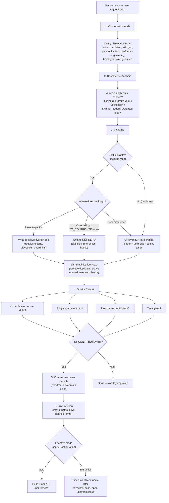

# Retro — Retrospective & Skill Improvement

## References

- [Compound Engineering](https://every.to/guides/compound-engineering) — Avery Pennarun

## Dependencies

- **rules** (required) — cross-cutting agent safety rules. Auto-loaded via `requires:`.
- **workspace** (required) — provides worktree context and `t3` CLI commands. **Load `/t3:workspace` now** if not already loaded.

Optional: If `T3_REVIEW_SKILL` is configured (e.g., `ac-reviewing-codebase`), retro recommends running it after skill modifications for deeper architectural quality assurance. Retro is lightweight and tactical; the review skill is methodical and systematic.

## Configuration

Retro's behavior depends on these environment variables and on whether the current repo contains an overlay package:

- **Active overlay / overlay app** — when the current repo contains an overlay package, retro writes project-specific improvements there. If no overlay is detectable, retro writes to the nearest repo-level agent instructions.
- **`T3_CONTRIBUTE`** — `false` (default) or `true`:
  - `false`: only improve the active project overlay. Core skill gaps are noted in conversation but not acted on.
  - `true`: also improve core skills in `$T3_REPO`. Retro creates a local commit; whether it then pushes is governed by the mode resolution below.
- **Push behavior is mode-conditional — defer to `t3:rules § Publishing Actions Are Mode-Conditional`.** Resolve the effective mode in the prescribed order (`T3_MODE` env → active overlay's per-overlay `mode` value → global `mode` value → per-repo memory overrides → default `interactive`). Both per-overlay and global `mode` values live in the `ConfigSetting` DB store (`config_setting set mode … [--overlay <name>]`), not in TOML.
  - **`auto`**: push immediately after the privacy scan passes — no prompt, no "your call", no deferral to `/t3:contribute`. Open the PR if one doesn't already exist.
  - **`interactive`**: commit locally and remind the user to run `/t3:contribute`.
  - The legacy `T3_PUSH` / `T3_AUTO_PUSH_FORK` env vars are honored only when no `mode` is configured anywhere; the `mode` setting subsumes them and wins on conflict. **Do not gate retro pushes on `T3_PUSH` when `mode` resolves to `"auto"` (set via `config_setting set mode auto` or `T3_MODE`).** A fork-vs-upstream split (origin ≠ `T3_UPSTREAM`) does not change the push decision; it only affects whether `/t3:contribute` opens an upstream issue afterward.
- **`T3_UPSTREAM`** — upstream GitHub repo (e.g., `souliane/teatree`). Used by `/t3:contribute` to open issues upstream after pushing. When `origin` matches `T3_UPSTREAM`, pushes already land directly on upstream.
- **`T3_PRIVACY`** — privacy check strictness: `strict` (default) or `relaxed`. See § Privacy Scan.
- **`T3_REVIEW_SKILL`** — name of an external skill review tool (e.g., `ac-reviewing-codebase`). If set, retro recommends running it after skill improvements. If not set, retro suggests installing one during first run and storing the preference.

### Agent Compatibility

Retro is agent-platform neutral. The workflow, environment variables, and teatree slash commands stay the same across platforms.

- Platform-specific files and commands remain valid where documented.
- Prefer the closest equivalent repo-level instructions file plus any user-level agent config available in the environment.
- When this skill mentions repo instructions, treat them as examples of agent config locations, not the only supported targets.

Systematic review of the current conversation to extract failures, near-misses, and lessons learned, then improve the skill system so they never recur.

**When to run (proactively — do NOT wait for the user to ask):**

- User types `/t3:retro`
- End of a non-trivial work session (multi-file, multi-repo, or multi-hour) — **self-trigger this**
- After discovering that "done" wasn't actually done
- After a failure mode that existing skills didn't prevent
- **Before context compaction** — if the conversation is getting long, run retro first to capture lessons before they're lost to compression

### Pre-Compaction Persistence

Pre-compaction state survival does **not** depend on you remembering to do this: the teatree `PreCompact` hook always writes a durable-state snapshot automatically, with zero agent action. This manual step only adds *retro findings* not yet in durable state. Use the `t3-snapshot-` prefix so the recovery path can find and inject the file back into context automatically:

```bash
cat > /tmp/t3-snapshot-${CLAUDE_SESSION_ID:-manual}-$(date +%Y%m%d-%H%M).md <<'EOF'
# Retro Findings (pre-compaction snapshot)
<paste categorized findings here>
EOF
```

**Recovery is automatic.** After compaction, Claude Code fires `SessionStart` with `source=="compact"`; the teatree hook scans for `t3-snapshot-*.md` files and injects their content as `additionalContext` then (issue #845 — `PostCompact` output is discarded by the harness, so recovery runs on the `SessionStart`/compact event instead). You do not need to remember to read the file — it will appear in your context. Delete the temp file once findings are persisted to durable skill files.

## Scope & Editability

Retro works from **any conversation** — not just teatree-managed projects. It identifies which skills were used in the session and determines where improvements should go.

### 1. Identify used skills

Scan the conversation for loaded skills (skill tool invocations, system reminders mentioning skills, explicit `/skill` calls). Build a list of every skill that influenced the session.

### 2. Check editability

For each skill, resolve its real path (follow symlinks) and check whether it lives in a git repository:

```bash
real_path=$(readlink -f "<skill_dir>")
git -C "$real_path" rev-parse --git-dir >/dev/null 2>&1 && echo "editable" || echo "read-only"
```

| Editability | Where to write improvements |
|---|---|
| **Editable** (symlink → local git repo) | Improve the skill files directly (following the write rules in § Fix Skills) |
| **Read-only** (no git repo, installed copy, or remote-only) | Record the finding with `t3 <overlay> retro finding`, naming the read-only skill in `--destination`. It lands on the gap ledger as a deduped umbrella checkbox plus a scheduled coding fix. |

When writing to a repo-level fallback, clearly mark the entry as originating from a retro finding: include the skill name and a brief rationale so the entry can be promoted to the skill later if it becomes editable.

### 3. Ask when unsure

If you can't determine whether a skill is editable, or if you're unsure whether an improvement belongs in the skill vs. the overlay vs. an enforcement gate — **ask the user**. Retro is meta-work; human-in-the-loop is expected.

## Persistence First

Retro is not complete until every confirmed finding reaches a durable home in the same retro pass. Conversation output is not durable storage, and neither is a memory file — an entry that is re-read only when an agent happens to load it is the vigilance that already failed.

- If a finding is project-specific, write it to the overlay or repo-level agent config now.
- If a finding is cross-project and editable, write it to the skill or reference file now.
- If a finding is environment- or user-specific, set it with `config_setting set`. If no documented knob exists, that missing knob **is** the finding — emit it with `t3 <overlay> retro finding`.
- If a helper script was required to diagnose or fix a recurring issue, save the script path and purpose in the durable docs so the next run does not start from scratch.
- Never end retro with “remember this later” or “note this in the summary” as the only persistence mechanism.

**Retro output must include a persistence summary**:

- what was learned
- where it was saved
- any helper scripts created or reused
- what still requires human follow-up, if anything

## Orchestrator-Only — Sub-Agents Emit Signal, Don't Self-Retro (#837)

Retro is an **orchestrator-level periodic synthesis**, not a per-ticket sub-agent step, and the shipping gate no longer enforces a per-ticket `retro` visit before `pr create`.

- **Sub-agents** (per-ticket implementers/reviewers/shippers): do **not** run this skill as a per-ticket judgment step. As a lesson surfaces during the work, emit it as structured signal into durable state — task metadata or a `/tmp/t3-snapshot-*.md` snapshot — and keep going. Do not call `lifecycle visit-phase <ticket_id> retro` to satisfy a shipping gate; there is no such gate anymore.
- **The orchestrator**: runs this skill periodically over the *accumulated durable signal across the whole session* (the snapshots and task metadata the sub-agents emitted), synthesises the cross-cutting pattern, and biases the output to the **smallest enforcement artifact** — a gate, a test, or a hook — rather than another prose rule. Prose that no agent reliably loads is the least-effective level; a deterministic check is the most-effective.

`retro` remains a recordable phase for audit (`teatree.core.modelkit.phases`); recording it is optional and never gates shipping. The durability discipline below (snapshots, durable task state, save-findings-immediately) is load-bearing and unchanged — it is exactly the channel the orchestrator's synthesis reads from.

## Fastest Reliable Tool

Retro should optimize for **speed with repeatability**. Use AI for judgment and synthesis; use scripts for deterministic evidence gathering and bulk transformations.

### Use shell/Python when

- collecting file lists, diffs, paths, commit metadata, or editability status
- scanning many files for duplicate guidance or stale rules
- extracting structured evidence from logs, PDFs, JSON, test output, or config
- generating repeatable summaries from mechanical data
- applying the same transformation across multiple files or validating a repeated invariant

### Use AI when

- classifying failures and root causes
- deciding the canonical destination for a finding
- rewriting guidance concisely without losing meaning
- merging overlapping rules into a single source of truth
- choosing the smallest durable fix that prevents recurrence

### Decision rule

- **Deterministic and repetitive**: prefer shell/Python.
- **Ambiguous, semantic, or judgment-heavy**: prefer AI.
- **Likely to recur twice**: save or update a helper script/reference instead of relying on manual re-analysis.
- **Single one-line wording fix**: edit directly; do not build automation for trivia.

## Workflow


```mermaid
flowchart TD
  A["Session ends or user triggers retro"] --> B["1. Conversation Audit"]
  B --> C["Categorize every issue:<br/>false completion, skill gap,<br/>playbook miss, over/under-engineering,<br/>hook gap, stale guidance"]

  C --> D["2. Root Cause Analysis"]
  D --> E["Why did each issue happen?<br/>Missing guardrail? Vague verification?<br/>Skill not loaded? Outdated step?"]

  E --> F["3. Fix Skills"]
  F --> EA{"Skill editable?<br/>(local git repo)"}

  EA -->|"Yes"| G{"Where does the fix go?"}
  EA -->|"No (read-only)"| J["t3 &lt;overlay&gt; retro finding<br/>(ledger + umbrella + coding task)"]

  G -->|"Project-specific"| H["Write to active overlay app<br/>(troubleshooting, playbooks, guardrails)"]
  G -->|"Core skill gap<br/>(T3_CONTRIBUTE=true)"| I["Write to $T3_REPO<br/>(skill files, references, hooks)"]
  G -->|"User preference"| J

  H & I & J --> SIMP["3b. Simplification Pass<br/>(remove duplicate / stale /<br/>unused rules and checks)"]
  SIMP --> K["4. Quality Checks"]
  K --> L["No duplication across skills?"]
  K --> M["Single source of truth?"]
  K --> N["Pre-commit hooks pass?"]
  K --> O["Tests pass?"]

  L & M & N & O --> P{"T3_CONTRIBUTE=true?"}
  P -->|"Yes"| Q["5. Commit on current branch<br/>(worktree, never main clone)"]
  P -->|"No"| R["Done — overlay improved"]

  Q --> S["6. Privacy Scan<br/>(emails, paths, keys, banned terms)"]
  S --> MODE{"Effective mode<br/>(see § Configuration)"}
  MODE -->|"auto"| PUSH["Push + open PR<br/>(per t3:rules)"]
  MODE -->|"interactive"| CONTRIB["User runs /t3:contribute later<br/>to review, push, open upstream issue"]
```

### 1. Conversation Audit

**Scope-match check first (Non-Negotiable).** Before auditing individual failures, re-open the ticket/issue body that framed this session and map every acceptance criterion, phase, or deliverable to what actually shipped. If ANY AC is unshipped and the session was declared complete (PR merged with `Closes/Fixes`, `/t3:next` run, ticket marked done), that is a **False completion** finding and it outranks every tactical finding below. Re-reading the issue body is not optional — scoping→implementation drift is invisible from the conversation alone.

Review the full conversation and categorize every issue:

| Category | Description | Example |
|---|---|---|
| **False completion** | Claimed "done" without verifying all requirements | Declared feature complete without running the full test suite |
| **Skill not loaded** | A relevant skill existed but wasn't loaded | Didn't load the active project overlay skill when working in project context |
| **Playbook not consulted** | A playbook covered the task but wasn't read | Didn't check the relevant playbook for the translation checklist |
| **Over-engineering** | Did unnecessary work because of wrong assumptions | Planned enum/migration/serializer changes when admin config sufficed |
| **Under-engineering** | Missed required work | Only updated the backend without the corresponding frontend changes |
| **Hook gap** | Auto-loading didn't trigger when it should have | Hook didn't suggest project overlay in matching context |
| **Stale guidance** | Followed outdated instructions | Playbook described pre-refactoring patterns |
| **Paradigm mismatch** | The architecture itself is the bottleneck, not a missing skill or guardrail | Repeatedly refining skill prose for a workflow that should be deterministic code; 3+ retro findings pointing to the same structural limitation; system untestable without an LLM |
| **Overhead without value** | A rule, check, or procedure added friction this session without preventing a real failure | Verification step that never flagged anything; duplicated guardrail across skills; step-by-step commands the CLI already handles. Fed into § 3b Simplification Pass. |

### 2. Root Cause Analysis

For each issue, determine **why** it happened:

- Missing guardrail in a skill/playbook?
- Existing guardrail not specific enough?
- Skill not loaded (hook gap)?
- Verification step missing or too vague?
- Playbook outdated after codebase evolution?
- **Architecture itself is the problem?** When 3+ findings across retros point to the same structural limitation (e.g., untestable logic, fragile state coordination, prose re-interpretation failures), stop fixing symptoms and flag the paradigm. Ask: "Would this project be better served by moving this logic out of skills into deterministic code (CLI, application framework, database-backed state)?" Present the pattern to the user with a concrete alternative.

#### Recurrence → Escalation (classification step)

Before deciding the destination for a behavioral finding, retro classifies it by *recurrence*, because the destination changes once a rule has already failed once:

- **First occurrence** — the rule did not yet exist as durable guidance. A skill edit is the appropriate fix; a memory entry never is.
- **Recurrence of a standing rule** — the finding is "the agent didn't do X" and an equivalent rule already lives in a skill, reference, or memory file and recurred anyway. This is not a missing-memory finding; it is an **enforcement-gap** finding. Re-writing the same behavioral entry is the recurrence engine, not the fix — memory-as-vigilance demonstrably loses, while a deterministic gate compounds.

For an enforcement-gap finding, retro routes it differently from a first occurrence:

- Treat the deliverable as the **smallest tooling-enforced gate**, not another prose rule — a non-bypassable hook, a CI/pre-commit check, a test, or a scoped issue dispatched to add one (see § "Orchestrator-Only" on biasing toward the smallest enforcement artifact).
- Update — do not duplicate — the existing entry so it *points at the enforcement* and is explicitly marked a known-weak stopgap until the gate lands.
- Record the escalation in the persistence summary: which gate/issue was filed or dispatched, and which existing entry now references it. A recurrence closed only by re-persisting prose is an incomplete retro.

#### Tooling: `t3 <overlay> retro review-findings <pr-url>`

The three-step review-findings lane — list fingerprinted findings, classify each A/B/C into a JSON verdict file, re-run to file one deduped enforcement issue per class-C finding — is in [`skills/retro/references/recurrence-escalation-tooling.md`](references/recurrence-escalation-tooling.md).

#### Tooling: `t3 <overlay> retro gate-failures` (#2024)

The three-step gate-failures lane — read the transcript's gate BLOCKs, classify each preventable or environmental, add the anti-vacuous eval, then `--escalate` — plus its privacy boundary, is in [`skills/retro/references/recurrence-escalation-tooling.md`](references/recurrence-escalation-tooling.md).

#### Tooling: `t3 <overlay> retro finding`

The lane retro persists a lesson WITH when no skill edit can hold it — a read-only skill, a missing config knob, an enforcement gap. It records the rule plus its cited mistake in the consolidation ledger and drives it onto the standing umbrella as a deduped checkbox and a scheduled coding fix; the prose retires itself when that fix merges. The dedup is over the rule's text, so re-emitting a lesson whose fix is still open rides the existing gap rather than scheduling a second one. `--dry-run` previews without writing.

`--destination` must name a teatree fix path (`skills/`, `src/teatree`, `scripts/`, `BLUEPRINT.md`); anything else is refused, because the ledger row is stamped a core gap and a user-specific home would make that stamp a lie. The umbrella write itself is the default-OFF `memory_promote` mechanism ([`skills/dreaming/SKILL.md`](../dreaming/SKILL.md)), so on an installation that has not opted in the finding is still recorded and the result reports `deferred` — the gap waits in the drain queue the next enabled pass reads, and nothing lands on the umbrella.

### 3. Fix Skills

**Pre-write editability check:** Before writing to ANY skill, verify it is editable (see § Scope & Editability). For teatree-specific paths:

```bash
# Check core (when T3_CONTRIBUTE=true)
git -C "$T3_REPO" rev-parse --git-dir >/dev/null 2>&1 || echo "STOP: T3_REPO is not a git repo"
```

If a skill is not editable (no local git repo), record the finding with `t3 <overlay> retro finding` — a read-only skill's gap is a scheduled fix, not a memory note. See § Scope & Editability for the full decision table. In standalone mode with no overlay project, skip the overlay check.

**Load coding skills before implementing:** Retro fixes often involve writing code (Python, Django, shell). Load the appropriate coding skill (`/ac-django`, `/ac-python`, etc.) before implementing — not just for model/view work but for any code: settings, logging, CLI commands, hook scripts. Retro is not exempt from coding standards.

**Determine the target** based on `T3_CONTRIBUTE` and the nature of the fix:

#### Always: project overlay improvements (active overlay)

These go to the overlay regardless of contribution level:

| What to fix | Where to write | Format |
|---|---|---|
| Non-obvious fix or recurring failure | `<overlay app>/references/troubleshooting.md` or repo `AGENTS.md` if no overlay refs exist | symptom -> root cause -> fix -> prevention |
| New repeatable multi-step pattern | `<overlay app>/references/playbooks/<topic>.md` + update `README.md` | step-by-step guide |
| Outdated playbook step | Update the overlay playbook directly | delete/replace stale instructions |
| "Do this, not that" guardrail | `<overlay app>/references/playbooks/archive-derived-guardrails.md` | do this / not that pair |

#### When `T3_CONTRIBUTE=false` (default)

**Do NOT modify files under `$T3_REPO`.** If you detect a gap in a core skill, note it in conversation output so the user is aware, but take no action on core files.

#### When `T3_CONTRIBUTE=true`

Retro can also modify core teatree skills in the user's fork:

| What to fix | Where to write |
|---|---|
| Infrastructure/worktree failure | `$T3_REPO/skills/workspace/references/troubleshooting.md` |
| Hook should have triggered | `$T3_REPO/hooks/scripts/hook_router.py` or the relevant hook script |
| Missing verification step | The core skill that owns that workflow phase |
| Stale or incorrect guidance in a core skill | The affected skill's `SKILL.md` or reference file |

**After modifying core skills:** follow § Commit to Fork.

### 3b. Simplification Pass (Auto-Cleaning)

Retro should **remove** overhead with the same confidence it **adds** guardrails. Most skill drift comes from accumulation — rules layered on over time, each defensible in isolation, collectively expensive. Every retro must ask: **did any rule or check create friction this session without preventing a real failure?** If yes, simplify in the same commit as the other findings.

What qualifies for removal or consolidation, what is never removed, how to simplify (consolidate over delete, justify a deletion, measure the delta), the `refactor(<skill>): simplify <what>` commit convention, and the when-in-doubt ask are in [`skills/retro/references/simplification-pass.md`](references/simplification-pass.md).

### 4. Quality Rules

- **Ask when ambiguous.** Retro involves design decisions (what to promote, where to put it, which repos to touch). When a choice has multiple valid options or the scope is unclear, **stop and ask the user**. Do not assume. Daily coding workflows can be autonomous; meta-work (retro, review, skill editing) requires human-in-the-loop.
- **No duplication.** Before writing, search all skills for existing coverage. Merge into existing sections.
- **Single source of truth.** Each piece of guidance lives in exactly one place. Other skills reference it.
- **Skills ≠ repo config.** Do not duplicate rules from a repo's agent instruction files into skill files. Reference the repo file instead. If the skill adds extra detail (rationale, examples, edge cases), write the detail in the skill and reference the repo file for the base rule. Duplication is tolerated ONLY when fully acknowledged — mark it with `(Source: AGENTS.md § <section>)` or equivalent. A duplicate without a reference is a duplication bug that will drift silently.
- **Be concise.** Include exact error messages and symptoms for searchability. No verbose explanations.
- **Include prevention.** Every troubleshooting entry must say how to avoid the issue, not just how to fix it.
- **Save findings immediately.** The durable write happens during the retro, not after it and not “next time”.
- **Never change `version:`** in YAML frontmatter — that's auto-managed.
- **Respect content publication status.** Blog posts and articles with `draft: false` in frontmatter are published — never modify them. Draft content (`draft: true` or no frontmatter) may be improved.
- **Defer structural changes to review skill.** When your fixes involve merging, splitting, or restructuring skills, suggest running the review skill first — retro is tactical; the review skill provides systematic analysis before structural changes.
- **Never write CLI procedures into skills.** Skills must contain WHEN/WHY/WHAT (judgment, guardrails, domain knowledge) — never HOW (step-by-step commands that `t3` already executes). Before writing a finding that includes a command or procedure, check: does `t3` already handle this? If yes, the skill should say "use `t3 <command>`" — not reproduce the steps the CLI performs internally. Procedural documentation belongs in BLUEPRINT.md, AGENTS.md, CLAUDE.md, README.md, or docs/ — not in skills. Violating this tempts agents to follow the documented manual steps instead of calling the CLI.
- **Skills or the ledger — never personal memory.** Retro has two durable homes: an editable **skill file** (`SKILL.md`, `references/`), and `t3 <overlay> retro finding` when the skill is read-only or the gap needs enforcement rather than prose. Retro never writes a memory file — a skill is portable and a ledger row becomes a merging fix, while personal config helps one machine and re-reading it is the vigilance that already lost. A user preference or environment fact with a documented knob goes to `config_setting set`; one without a knob is itself a finding.
- **A promotable rule in personal config belongs in a skill.** An entry that encodes a guardrail, pattern, or "do this not that" rule — rather than a user preference or an environment fact — belongs in the appropriate skill file. Retro never adds a safety-net duplicate alongside it: the enforcement artifact **is** the safety net, and a duplicate only drifts. Surfacing such entries out of the memory corpus is the weekly `memory_skim` loop's job (§ 7), never retro's.
- **Prefer deterministic helpers over repeated manual work.** If the same audit or extraction step is likely to recur, capture it in a shell/Python helper or reusable command snippet and document where it lives.
- **Ask about backward compatibility before adding compat shims.** When a retro fix involves renaming, removing, or changing an API, ask the user whether backward compatibility matters before adding wrappers, re-exports, or deprecation paths. Clean code is preferred over compat shims unless the user explicitly needs them.
- **Rule, not narrative.** When promoting a session lesson to a skill, write the **rule** the lesson produced — not the lesson itself. Date-stamped incident citations (`Past failure (2026-MM-DD): …`, `Known failure (#NNN): …`), "I did X / the user did Y" anecdotes, and PR-specific case studies are session narrative; they identify a specific session and accumulate as noise in a public skills repo. The rule's value is intrinsic — it should read coherently to a reader who never saw the incident. If a one-line anti-pattern bullet captures the failure mode (e.g., "returning an error string from a management command instead of raising"), keep that; otherwise, drop the citation entirely and trust the rule.

### 5. Playbook Lifecycle

When to create a playbook, when to update one, where playbooks live and how they are named, and the staleness check are in [`skills/retro/references/playbook-and-branch-hygiene.md`](references/playbook-and-branch-hygiene.md).

### 5b. Unpushed Commits & Dirty Repos Check

After completing all retro changes, check for unpushed work across ALL repos touched during the session. The goal is to ensure no work is forgotten — orphaned branches, stashes, and uncommitted changes are all risks.

#### Squash-merge cross-check (Non-Negotiable)

Before treating any local branch as "unpushed work", **cross-reference against the default branch**. Squash-merges create new SHAs, so `git log --not --remotes` by SHA alone flags already-merged branches as unsynced — and acting on that reading is how real work gets discarded.

Delegate the classification to the CLI: **run `t3 <overlay> workspace clean-all`**. It sorts each branch's unsynced commits into `squash_merged` (the subject matches a commit on `origin/main` once the `(#NNN)` suffix and conventional-commit prefix are stripped), `merge_commits` (multi-parent, safe to discard), and `genuinely_ahead` (real pending work). Only genuinely-ahead branches block cleanup.

The eight per-repo collection steps, the TTY prompt behaviour, and the raw subject-matching recipe for stray stashes are in [`skills/retro/references/playbook-and-branch-hygiene.md`](references/playbook-and-branch-hygiene.md).

### 6. Verification

After applying all fixes:

- Run `t3 tool verify-gates` to validate (runs both commit- and push-stage hooks; a bare `prek run --all-files` skips the push-stage gates CI re-runs)
- **Smoke test changed scripts** — if shell scripts or hook scripts were modified, run them end-to-end (linting alone does not catch runtime failures like Bash version incompatibility or platform-specific commands)
- Verify no duplicate guidance across skills
- Confirm updated playbooks match current codebase reality
- Verify that every confirmed finding from the audit was saved to a durable location
- If helper scripts were created or reused for recurring work, verify their paths and usage are recorded in the relevant durable docs
- **Definition of Done check:** Re-run the conversation audit (§ 1) on your own changes. If the re-run produces new findings, you are not done — fix them before claiming completion.
- **No “conversation-only” findings.** If a lesson exists only in the final response and not in a file, retro is not done.
- **Commit before declaring done.** After completing all retro changes, commit them immediately before declaring done. Never declare "done" with uncommitted skill modifications — this is the most common retro failure mode.

## Commit to Fork (`T3_CONTRIBUTE=true`)

When `T3_CONTRIBUTE=true` and retro modified files under `$T3_REPO`, commit automatically on the session's working branch inside a worktree (never the main clone, never `main`). The commit is local-only — `/t3:contribute` handles the push.

See [`references/commit-to-fork.md`](references/commit-to-fork.md) for pre-flight checks, branch selection rules, and the confirmation template; the `T3_AUTO_PUSH_FORK` exception is in [`../contribute/SKILL.md`](../contribute/SKILL.md) § 4 "Push Confirmation".

## Privacy Scan

Before committing to the fork or creating an upstream issue, scan **all public-facing content the agent has authored or is about to author this session** — not just the diff of newly-staged files.

**Scan the whole branch, never just the cache (Non-Negotiable).** The diff you scan must be `git diff @{upstream}..HEAD` — the branch carries commits from prior sessions and compacted work the agent never re-read, and only that range covers every commit between the pushed base and HEAD. `git diff --cached` (and `git diff HEAD~..HEAD`) is **not enough**: it shows the most recent work only, so a leak committed earlier on the branch passes the scan unseen.

The four surfaces to scan (branch-vs-base diff, commit subjects and bodies, PR/issue/comment bodies, and any memory/config writes the session made — retro itself makes none), the detector set plus the Streisand-effect word grep, and the `strict` / `relaxed` `T3_PRIVACY` levels are in [`skills/retro/references/privacy-scan.md`](references/privacy-scan.md).

## What NOT to Do

- Do not create a new playbook for a one-off fix. Only document repeatable patterns.
- Do not scatter the same guidance across multiple skills. Pick one home and reference it.
- Do not copy repo agent-instruction rules into skills. Reference the repo file; add detail in the skill only with a clear source attribution.
- Do not add verbose explanations. Concise symptoms + fixes are more searchable.
- Do not skip the conversation audit. The point is to catch ALL issues, not just the obvious one.
- Do not update skills speculatively. Only document confirmed patterns from actual failures.
- Do not write step-by-step CLI procedures into skills. If `t3` handles it, say "use `t3 <command>`" — don't reproduce the steps. Procedural docs belong in BLUEPRINT.md/AGENTS.md/docs, not skills.
- Do not push retro commits in `interactive` mode — use `/t3:contribute` for push + upstream issue creation. In `auto` mode, push directly per § Configuration.

### 7. The Memory Corpus Belongs to `memory_skim`, Not to Retro

Retro never discovers, writes, or edits a memory file. Entries already on disk stay exactly where they are — retro deletes nothing and prunes nothing; it stops adding.

Two lanes own that corpus, and neither is retro. `t3 tool audit-memory` is the manual read-only view, available any time. The `memory_skim` mini-loop is the scheduled one: enabled, it raises one owner-facing promote-or-drop question per ISO week for every entry that reads as factory behaviour. It ships **default-OFF in every mode**, so on an installation that has not enabled it nothing sweeps the corpus on a cadence — enable the loop, or run `t3 tool audit-memory` when you want the promotable set.

What retro still does with a repo-level agent config file it can read, and the three promotion classes that decide where a finding goes, are in [`skills/retro/references/personal-config-hygiene.md`](references/personal-config-hygiene.md).

### 8. Recommend Review Skill

If `T3_REVIEW_SKILL` is configured and skill files were modified during this retro:

1. Suggest running the review skill (a systematic multi-phase audit for deeper quality assurance) on the changed skills (e.g., `/$T3_REVIEW_SKILL`).
2. If `review_skill` is NOT configured, include this note in the retro output: "Consider installing a skill review tool for periodic deep quality audits. Set `review_skill` with the `mcp__teatree__config_setting_set` MCP tool — or `t3 <overlay> config_setting set review_skill <skill-name>` when the MCP server isn't connected, or the `T3_REVIEW_SKILL` env var — to enable integration."

### 9. Consolidation over Drift

During every retro pass, actively scan for behavior encoded **outside** the teatree framework and consider promoting it in.

The scope includes: personal `~/.claude/settings.json` permissions/hooks, dotfiles hooks, shell rc files, and overlay-local ad-hoc config that encodes patterns other users would benefit from. The scan is a read; its output is a `t3 <overlay> retro finding`, never an edit to the corpus § 7 owns.

The (P) promote / (C) model-as-config / (K) keep-personal classification table, the decision rule for divergent behaviour, and how this scan complements § 7 are in [`skills/retro/references/personal-config-hygiene.md`](references/personal-config-hygiene.md).
