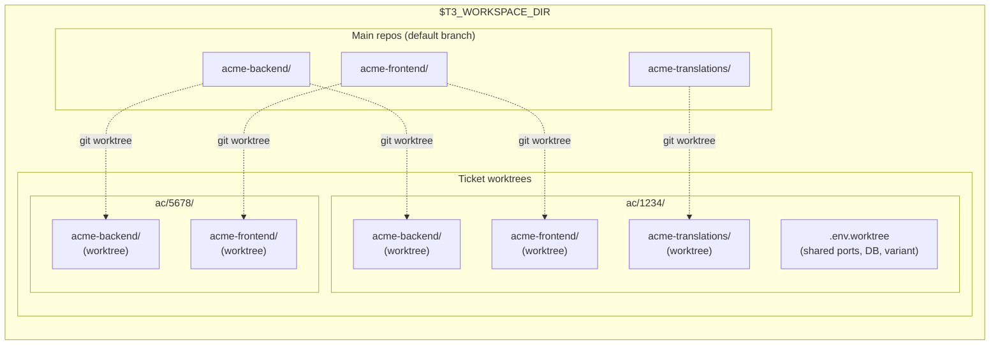
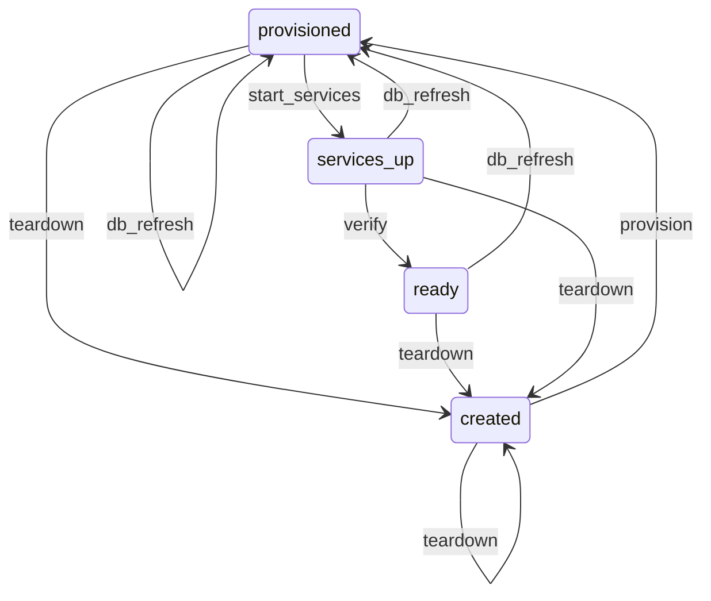

# Environment & Workspace Lifecycle

The infrastructure foundation. Every other `t3-*` skill depends on this one.

Manages **multi-repo worktree workspaces** — creating synchronized git worktrees across multiple independent repositories for a single ticket, then provisioning each with isolated ports, databases, env files, and services so they're ready to use immediately.



Each ticket gets its own directory with one git worktree per affected repo and a shared `.env.worktree` for port allocation, database name, and variant configuration. Worktrees share the `.git` directory with the main clone but have their own branch and working tree.

## Dependencies

None — this is the foundation skill.

## Configuration (`~/.teatree`)

Key variables used by this skill (see `/t3-setup` for the full config reference):

| Variable | Required | Purpose |
|----------|----------|---------|
| `T3_REPO` | Yes | Path to the teatree repo clone |
| `T3_WORKSPACE_DIR` | Yes | Root workspace directory |
| `T3_BRANCH_PREFIX` | No | Prefix for worktree branches (default: initials from `git config user.name`) |
| `T3_AUTO_SQUASH` | No | Auto-squash related unpushed commits before push (default: `false`) |
| `T3_SHARE_DB_SERVER` | No | Share one Postgres server across worktrees (default: `true`). Each worktree gets its own DB name but connects to the same server. When `false`, each worktree starts its own Postgres container. |

### Data Directory (XDG-Compliant)

Teatree stores runtime data (ticket cache, MR reminders, followup dashboard) in:

```text
$T3_DATA_DIR  (default: ${XDG_DATA_HOME:-$HOME/.local/share}/teatree)
```

`~/.teatree` is the **config file** — never use it as a data directory. Set `T3_DATA_DIR` in `~/.teatree` to override the default location.

## Setup Verification

If the environment seems incomplete (missing `uv`, hooks not firing, generated host project absent), load `/t3-setup` to run the bootstrap validator.

## Workflows

> **Convention:** Overlay commands below are shown without the `<overlay>` prefix for brevity. In practice, run `t3 <overlay> <command>` (e.g., `t3 acme lifecycle setup`).

### Worktree Creation

- `t3 workspace ticket` — creates a ticket directory with git worktrees for each affected repo.
- Convention: one directory per ticket, one worktree per repo.
- **NEVER use raw `git worktree add`, `git checkout -b`, or `git branch` directly.** Always use `t3 workspace ticket` — it creates the correct directory structure (`<ticket>/<repo>/`) and handles branch naming. Raw git commands produce flat worktrees that break the ticket-directory convention and confuse subsequent tooling.

### Worktree Setup

- `t3 lifecycle setup` — full environment provisioning for a worktree:
  - Symlinks (`.venv`, `node_modules`, `.python-version`, `.data`, project-specific)
  - Environment files (`.env`, `.env.worktree`, `.env.local.*`)
  - DB provisioning (create DB, import from DSLR/dump, run migrations)
  - direnv integration
  - Frontend dependencies

### Database Management

- `t3 db refresh` — refresh worktree DB from DSLR snapshots or dump files.
- `t3 db restore-ci` — restore from the latest CI dump (extension point: `wt_restore_ci_db`).
- `t3 db reset-passwords` — reset all user passwords to a known value (extension point: `wt_reset_passwords`).

### Dev Servers

- `t3 lifecycle start` — full-stack startup (Docker services + migrations + backend + frontend).
- `t3 run backend` — start backend dev server only.
- `t3 run frontend` — start frontend dev server only.
- `t3 run build-frontend` — build frontend app for production/testing.

### Cleanup

- `t3 workspace clean-all` — prune merged worktrees, drop orphan DBs, remove stale directories.

## Rules

### Plan Before Executing (Non-Negotiable)

Before starting any multi-step task, **create a TODO list** using the task tracking tools. This applies to all phases (setup, coding, testing, shipping) — not just coding. Never tackle work without a visible plan. The plan keeps the user informed and prevents forgetting steps.

- **Simple tasks** (1-2 steps): a brief bullet list in the response is sufficient.
- **Complex tasks** (3+ steps): use `TaskCreate` for each step, update status as you go.
- **Never skip this.** If you find yourself doing 3+ things without a plan, stop and create one.

### Fix the CLI, Never Work Around It (Non-Negotiable)

When a `t3` command fails, **fix the CLI code first** — never manually run the underlying commands (`docker compose`, `manage.py runserver`, `npm run`, `createdb`, `cp`, `ln -s`, etc.) as a workaround. Manual workarounds invariably miss steps (translations, symlinks, settings files, CORS, SSL flags) and create a broken environment that wastes more time than fixing the CLI would have.

1. **Stop** — do not run the underlying command manually.
2. **Investigate** the overlay or core code to find why the command failed.
3. **Fix** the code, add a test, and commit.
4. **Re-run** the `t3` command to verify the fix.

### Never Hand-Edit Generated Files (Non-Negotiable)

Setup tools (`t3 lifecycle setup`, etc.) generate configuration files (`.env.worktree`, docker overrides, port allocations). **Manual edits create drift** and are overwritten on the next setup run.

When a generated file is wrong or incomplete, **re-run the setup tool** — don't manually patch the file. If setup fails, diagnose the root cause in the setup script (see `/t3-debug`), don't work around it.

### Never Run Infrastructure Commands Directly (Non-Negotiable)

Use the `t3` CLI (`t3 lifecycle start`, `t3 run backend`, `t3 run frontend`, etc.) instead of running `docker compose`, language-specific dev servers, or build tools directly. The CLI commands handle:

- Environment variable loading from generated files
- Service ordering (data store → migrations → application)
- Port isolation between worktrees
- Health checks after startup

Direct commands bypass these safeguards, causing subtle failures (wrong DB, port collisions, missing migrations).

### Never Edit Files in the Main Clone (Non-Negotiable)

Before editing **any** project file, verify you are working in a **worktree**, not the main clone. The main repo clone (the directory directly under `$T3_WORKSPACE_DIR` with the default branch) is for `git fetch`, branch management, and worktree creation — never for code changes.

**Pre-edit check:** If the file you are about to edit lives directly under `$T3_WORKSPACE_DIR/<repo>/` (not under a ticket subdirectory like `$T3_WORKSPACE_DIR/<ticket>/<repo>/`), **stop** — you are in the main clone. Find or create the correct worktree first via `t3 workspace ticket`.

Common failure: the main clone happens to be on the MR branch (from a previous checkout). Editing there "works" but pollutes the shared clone, risks merge conflicts for other worktrees, and violates isolation.

### Full Worktree Isolation (Non-Negotiable)

Each worktree gets its own **isolated environment** — dedicated database, ports, containers, and env files. Never share infrastructure between worktrees:

- Never point one worktree's frontend at another worktree's backend
- Never use the main repo's database for worktree work
- Never manually set ports — let `t3 lifecycle setup` allocate them via `find_free_ports()`

When testing an MR, create a full worktree (`t3 workspace ticket` + `t3 lifecycle setup` + `t3 lifecycle start`).

### Validate After Provisioning (Non-Negotiable)

After importing a database or downloading an artifact, always validate it:

- **Check file sizes** — 0-byte files indicate failed downloads (often VPN/network issues)
- **Spot-check data** — empty seed/reference tables indicate a corrupt import; the application will crash on every request with lookup errors
- If validation fails, **delete the corrupt artifact and re-run provisioning**. Never try to manually fix corrupt data — interdependent reference tables make this a losing game.

### Service Startup Ordering (Non-Negotiable)

Setup tools enforce ordering: **data store → migrations → application server**. Starting the application before migrations causes "relation does not exist" errors. Always use the orchestration functions (`t3 lifecycle start`) rather than starting services individually.

### Never Delegate Skill-Dependent Work to Sub-Agents (Non-Negotiable)

See [`../t3-rules/SKILL.md`](../t3-rules/SKILL.md) § "Sub-Agent Limitations". If parallelism is needed, pass the **full skill file contents** in the sub-agent prompt — but prefer sequential main-conversation execution.

### Verify Services Before Declaring Running (Non-Negotiable)

After starting dev servers, **verify each service responds via HTTP** before reporting success. Check that frontend, backend, and API endpoints return expected status codes (2xx/3xx). If any check fails (000, 500, connection refused), diagnose before reporting — see troubleshooting docs.

Project skills define the specific endpoints to check (e.g., admin login, API version, frontend index).

## Extension Points

For the full extension points table, override chain, and project skill creation guide, see [`references/extension-points.md`](references/extension-points.md).

Summary: 23 extension points with 3-layer priority (**default** < **framework** < **project**). Key points: `wt_db_import`, `wt_post_db`, `wt_env_extra`, `wt_run_backend`, `wt_run_frontend`, `wt_create_mr`, `wt_monitor_pipeline`, `wt_send_review_request`.

## `t3` CLI (Unified Entry Point)

All worktree operations go through the packaged `t3` command. Run it with `uv run t3 ...`. State is persisted in the Django database (SQLite by default).

**Command types:** The CLI has two levels:

- **Global commands** (`t3 ci`, `t3 review-request`, `t3 tool`, `t3 info`) — work from any directory, no Django needed.
- **Overlay commands** (`t3 <overlay> ...`) — require the overlay prefix (e.g., `t3 acme lifecycle setup`). This includes lifecycle shortcuts: `t3 <overlay> start-ticket`, `t3 <overlay> ship`, `t3 <overlay> daily`, `t3 <overlay> agent`.



### Global Commands

| Command | Purpose |
|---------|---------|
| `t3 info` | Show t3 entry point, teatree/overlay sources, editable status |
| `t3 ci cancel` | Cancel stale CI pipelines |
| `t3 ci divergence` | Check fork divergence from upstream |
| `t3 ci trigger-e2e` | Trigger E2E tests on CI |
| `t3 ci fetch-errors` | Fetch error logs from CI |
| `t3 ci fetch-failed-tests` | Extract failed test IDs from CI |
| `t3 ci quality-check` | Run quality analysis |
| `t3 review-request discover` | Discover open MRs awaiting review |
| `t3 tool privacy-scan` | Scan for privacy-sensitive patterns |
| `t3 tool analyze-video` | Decompose video into frames |
| `t3 tool bump-deps` | Bump pyproject.toml deps from uv.lock |

### Overlay Commands (`t3 <overlay> ...`)

#### Shortcuts

| Command | Purpose |
|---------|---------|
| `t3 <overlay> start-ticket <ISSUE_URL>` | Zero to coding — create ticket, provision worktree, start services |
| `t3 <overlay> ship <TICKET_ID>` | Code to MR — create merge request for the ticket |
| `t3 <overlay> daily` | Daily followup — sync MRs, check gates, remind reviewers |
| `t3 <overlay> full-status` | Show ticket, worktree, and session state summary |
| `t3 <overlay> agent [TASK]` | Launch Claude Code with overlay context |
| `t3 <overlay> dashboard` | Start the dashboard dev server |

#### `lifecycle` — Lifecycle state machine

| Command | Purpose |
|---------|---------|
| `t3 <overlay> lifecycle status [--json]` | Show current state, ports, DB, available transitions |
| `t3 <overlay> lifecycle setup [VARIANT]` | Provision worktree: ports, env, symlinks, DB |
| `t3 <overlay> lifecycle start` | Start dev servers (backend + frontend), then verify |
| `t3 <overlay> lifecycle clean` | Teardown worktree — stop services, drop DB, clean state |
| `t3 <overlay> lifecycle diagram` | Print state diagram as Mermaid |

#### `workspace` — Workspace management

| Command | Purpose |
|---------|---------|
| `t3 <overlay> workspace ticket <NUM> <DESC> <REPO...>` | Create ticket workspace with git worktrees |
| `t3 <overlay> workspace finalize [MSG]` | Squash worktree commits + rebase on default branch |
| `t3 <overlay> workspace clean-all` | Prune merged/gone worktrees and branches across all repos |

#### `run` — Dev servers and test runners

| Command | Purpose |
|---------|---------|
| `t3 <overlay> run backend` | Start backend dev server |
| `t3 <overlay> run frontend` | Start frontend dev server |
| `t3 <overlay> run build-frontend` | Build frontend app |
| `t3 <overlay> run tests` | Run project tests |
| `t3 <overlay> run verify` | Verify dev services respond via HTTP |

#### `db` — Database operations

| Command | Purpose |
|---------|---------|
| `t3 <overlay> db refresh` | Re-import database from dump/DSLR |
| `t3 <overlay> db restore-ci` | Restore database from CI dump |
| `t3 <overlay> db reset-passwords` | Reset all user passwords to a known value |

#### `pr` — Merge request and ticket workflow

| Command | Purpose |
|---------|---------|
| `t3 <overlay> pr create` | Create merge request |
| `t3 <overlay> pr check-gates` | Check transition gates for ticket status |
| `t3 <overlay> pr fetch-issue` | Fetch issue context from tracker |
| `t3 <overlay> pr detect-tenant` | Detect tenant variant |

#### `followup` — Follow-up and dashboard

| Command | Purpose |
|---------|---------|
| `t3 <overlay> followup sync` | Sync followup data from MRs |
| `t3 <overlay> followup refresh` | Return counts of tickets and tasks |
| `t3 <overlay> followup remind` | Return list of pending user input tasks |
| `t3 <overlay> dashboard` | Start the Django dashboard dev server |

### Project-specific Commands

Project-specific command surfaces belong in the generated TeaTree host project as Django management commands or overlay methods, not as dynamically injected `t3` subcommand groups.

## Troubleshooting

Before any setup or server operation, check [`references/troubleshooting.md`](references/troubleshooting.md) for known failure modes matching the current operation.

## Skill File Locations & Symlink Chain

```text
<agent-skills-dir>/t3-* → $T3_REPO/t3-*
                            (SOURCE OF TRUTH)
```

The agent skills directory varies by platform (for example `~/.claude/skills/`, `~/.codex/skills/`, `~/.cursor/skills/`, or `~/.copilot/skills/`).

- **NEVER** replace a symlink with a real file/directory. If unsure, run `ls -la` first.
- **Before writing to any skill file**, resolve the real path: `readlink -f <path>`.

## Reference Index

| When you need to... | Read |
|---|---|
| Check tool requirements or first-time setup | [`references/prerequisites.md`](references/prerequisites.md) |
| Find available shell functions, scripts, or COMPOSE_PROJECT_NAME details | [`references/scripts-and-functions.md`](references/scripts-and-functions.md) |
| Understand extension points, override chain, or create a project skill | [`references/extension-points.md`](references/extension-points.md) |
| Diagnose worktree setup failures, DB errors, port conflicts | [`references/troubleshooting.md`](references/troubleshooting.md) |
| Cross-cutting agent rules (clickable refs, token extraction, temp files) | [`../t3-rules/SKILL.md`](../t3-rules/SKILL.md) |
