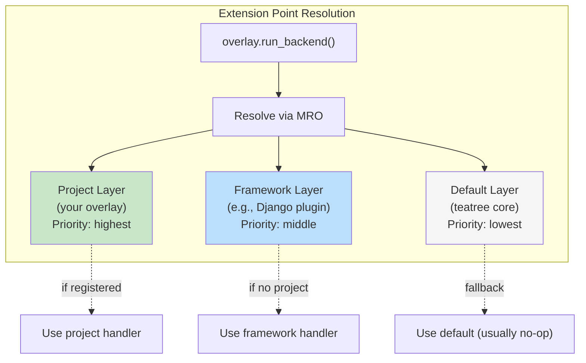

# Extension Points

> **Current system:** Project overlays subclass `OverlayBase` (see `teetree.core.overlay`) and override methods like `get_repos()`, `get_provision_steps()`, `get_env_extra()`, `get_run_commands()`. The `wt_*` names below are the **conceptual extension point names** used in skill documentation — they map to `OverlayBase` methods, not to a function registry.

Project-specific behavior lives in the generated TeaTree Django host project. The active overlay class subclasses `OverlayBase`, and runtime code calls overlay methods directly.

Priority: **default** (no-op) < **framework** (Django) < **project** (project-specific).



**Prefix convention (intentional):** Most extension points use the `wt_` prefix (worktree-scoped). This includes delivery operations (`wt_create_mr`, `wt_monitor_pipeline`, `wt_send_review_request`) that conceptually operate beyond a single worktree — but they always run *from within* a worktree context and use its branch/env. The `ticket_*` and `followup_*` prefixes are reserved for operations that span multiple worktrees or operate at the workspace level.

| Point | Default | Django Plugin | Override in overlay for... |
|---|---|---|---|
| `wt_symlinks` | Replicate symlinks from main repo + share `.venv`, `node_modules`, `.python-version`, `.data` | — | Additional project-specific symlinks |
| `wt_env_extra` | No-op | `DJANGO_SETTINGS_MODULE`, `POSTGRES_DB` | Project-specific env vars |
| `wt_services` | `docker compose up -d` from main repo | — | Different service selection |
| `wt_db_import` | Return False (no default) | — | Project-specific dump discovery + restore |
| `wt_post_db` | No-op | `migrate` + `createsuperuser` | Custom post-restore steps |
| `wt_detect_variant` | Read `$WT_VARIANT` or `.env.worktree` | — | Project-specific variant detection |
| `wt_run_backend` | Print "not configured" | `manage.py runserver` + Docker up | Custom backend startup |
| `wt_run_frontend` | Print "not configured" | — | Custom frontend startup |
| `wt_build_frontend` | Print "not configured" | — | Custom frontend build |
| `wt_run_tests` | Print "not configured" | `pytest` or `manage.py test` | Custom test runner |
| `wt_create_mr` | Print "not configured" | — | MR/PR creation (GitLab, GitHub, etc.) |
| `wt_monitor_pipeline` | Print "not configured" | — | CI pipeline polling (GitLab CI, GitHub Actions, etc.) |
| `wt_send_review_request` | Print "not configured" | — | Review notification (Slack, Teams, email, etc.) |
| `wt_fetch_failed_tests` | Print "not configured" | — | Failed test extraction from CI |
| `wt_restore_ci_db` | Print "not configured" | — | Restore DB from a CI-produced dump |
| `wt_reset_passwords` | Print "not configured" | — | Reset all user passwords to a known dev value |
| `wt_trigger_e2e` | Print "not configured" | — | Trigger E2E tests on CI |
| `wt_quality_check` | Print "not configured" | — | Quality analysis (SonarQube, CodeClimate, etc.) |
| `wt_fetch_ci_errors` | Print "not configured" | — | Fetch error logs from CI (distinct from failed test IDs) |
| `wt_start_session` | Print "not configured" | — | Full dev session entrypoint: self-heal (`t3 lifecycle setup` if needed) + start everything |
| `ticket_check_deployed` | Return False | — | Check if merged code is deployed to target env (CI pipeline, GCP, k8s) |
| `ticket_update_external_tracker` | No-op (log warning) | — | Update ticket status in Notion/Jira/external tracker |
| `ticket_get_mrs` | List MRs by branch name via issue tracker CLI | — | Custom MR discovery for multi-repo tickets |
| `followup_enrich_data` | No-op | — | Add project-specific fields to `followup.json` entries (e.g., Notion status, tenant) |
| `followup_enrich_dashboard` | No-op | — | Inject extra columns/sections into the HTML dashboard |

## How the Override Chain Works

TeaTree packages the generic runtime. The generated host project owns the project layer:

Inside each Python script:

```python
from teetree.core.overlay_loader import get_overlay

overlay = get_overlay()
overlay.post_db_setup(project_dir)  # example project-layer hook
```

Use `uv run t3 startproject ...` to create the host project, set `TEATREE_OVERLAY_CLASS` in settings, and implement the required hooks on the generated overlay app.

## Legacy Note

The old `scripts/lib/registry.py` bridge has been removed. New project integrations use `OverlayBase` subclasses exclusively — do not add `project_hooks.py`, shell bootstraps, or custom `t3` subcommand groups.
