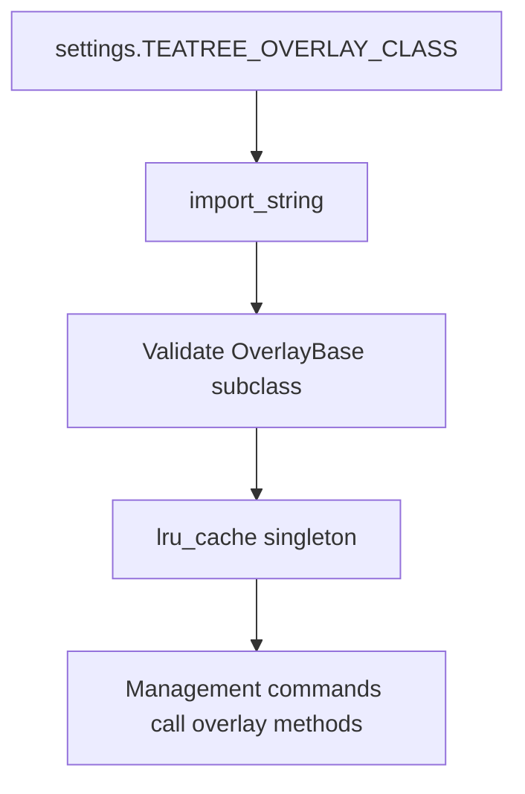

# Overlay Extension Points

*Updated to match the current `OverlayBase` API. See BLUEPRINT.md §6.1 for full documentation.*

## OverlayBase Methods

| Method | Required | Purpose |
|--------|----------|---------|
| `get_repos()` | Yes | Declare repositories for provisioning |
| `get_provision_steps(worktree)` | Yes | Ordered setup steps |
| `get_env_extra(worktree)` | No | Extra environment variables |
| `get_run_commands(worktree)` | No | Named service run commands |
| `get_pre_run_steps(worktree, service)` | No | Per-service preparation steps |
| `get_test_command(worktree)` | No | Test suite command |
| `get_db_import_strategy(worktree)` | No | DB provisioning strategy |
| `db_import(worktree)` | No | Custom DB import logic |
| `get_post_db_steps(worktree)` | No | Post-DB-setup callbacks |
| `get_reset_passwords_command(worktree)` | No | Dev password reset |
| `get_envrc_lines(worktree)` | No | .envrc additions (for direnv) |
| `get_symlinks(worktree)` | No | Extra symlinks |
| `get_services_config(worktree)` | No | Service metadata |
| `validate_mr(title, description)` | No | MR validation rules |
| `get_followup_repos()` | No | GitLab project paths to sync |
| `get_skill_metadata()` | No | Active skill path + companions |
| `get_ci_project_path()` | No | GitLab project path for CI |
| `get_e2e_config()` | No | E2E trigger configuration |
| `detect_variant()` | No | Tenant detection |
| `get_workspace_repos()` | No | Repos for workspace ticket creation |
| `get_tool_commands()` | No | Overlay-specific CLI tools |

## Resolution Flow

The legacy `wt_*` function-based extension system with 3-layer priority is removed. Overlays are resolved via Django settings and Python's MRO.
