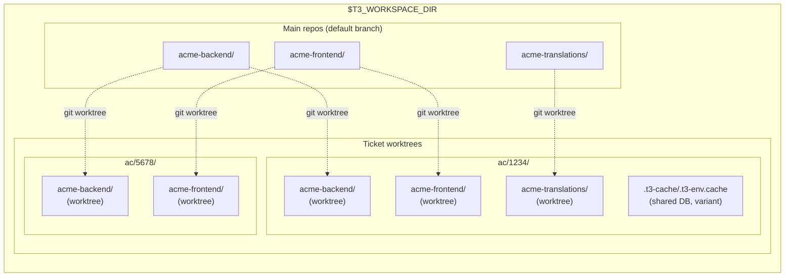
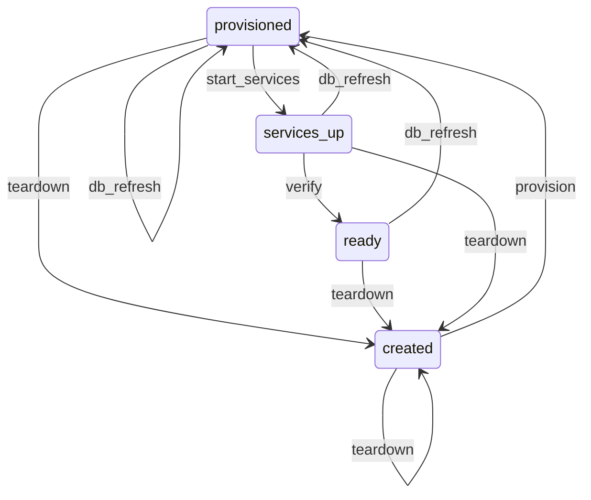

# Environment & Workspace Lifecycle

The infrastructure foundation. Every other teatree skill depends on this one.

Manages **multi-repo worktree workspaces** — creating synchronized git worktrees across multiple independent repositories for a single ticket, then provisioning each with isolated ports, databases, env files, and services so they're ready to use immediately.



Each ticket gets its own directory with one git worktree per affected repo and a shared `.t3-cache/.t3-env.cache` (symlinked into each repo worktree as `.t3-env.cache`) for database name and variant configuration. Ports are ephemeral — allocated at `worktree start` time and passed via runtime env only. Worktrees share the `.git` directory with the main clone but have their own branch and working tree.

## Dependencies

None — this is the foundation skill.

## Configuration (`~/.teatree`)

Key variables used by this skill (see `/t3:setup` for the full config reference):

| Variable | Required | Purpose |
|----------|----------|---------|
| `T3_REPO` | Yes | Path to the teatree repo clone |
| `T3_WORKSPACE_DIR` | Yes | Root workspace directory |
| `T3_BRANCH_PREFIX` | No | Prefix for worktree branches (default: initials from `git config user.name`) |
| `T3_AUTO_SQUASH` | No | Auto-squash related unpushed commits before push (default: `false`) |
| `T3_SHARE_DB_SERVER` | No | Share one Postgres server across worktrees (default: `true`). Each worktree gets its own DB name but connects to the same server. When `false`, each worktree starts its own Postgres container. |

### Concurrent Local Stacks (`max_concurrent_local_stacks`, #1397)

A locally-running worktree (state `services_up` or `ready`) holds a
docker stack, language servers, browsers, and CI processes. On a memory-
constrained host, running two stacks in parallel can OOM the machine and
abort both. The setting `max_concurrent_local_stacks` in `~/.teatree.toml`
caps how many distinct tickets can be in those states at once for a
given overlay:

```toml
[teatree]
max_concurrent_local_stacks = 1   # 0 = unbounded (default, no behaviour change)

[overlays.heavy-overlay]
max_concurrent_local_stacks = 1   # per-overlay override is supported
```

When the cap is set and the limit would be exceeded, `t3 <overlay>
worktree start` and `t3 <overlay> workspace start` refuse with an
error naming each blocking worktree path. Resolve by tearing the
blocker down first:

```bash
t3 <overlay> worktree teardown <path-from-the-error>
# then re-run start on the new worktree
```

Sibling worktrees of the *same* ticket (a multi-repo workspace) count
as one logical stack; the cap is per distinct ticket, not per worktree
row. Re-firing `start` against an already-running worktree is allowed
(the candidate row is excluded from its own count, preserving FSM
idempotence). The cap is scoped per overlay, so a heavy overlay can
cap to `1` while a cheap dogfood overlay stays unbounded.

### Data Directory (XDG-Compliant)

Teatree stores runtime data (ticket cache, PR reminders, followup state) in:

```text
$T3_DATA_DIR  (default: ${XDG_DATA_HOME:-$HOME/.local/share}/teatree)
```

`~/.teatree` is the **config file** — never use it as a data directory. Set `T3_DATA_DIR` in `~/.teatree` to override the default location.

## Setup Verification

If the environment seems incomplete (missing `uv`, hooks not firing, overlay absent), load `/t3:setup` to run the bootstrap validator.

## Commands

All workspace operations go through the `t3` CLI. Run `t3 <overlay> --help` for the full command list. Key command groups: `lifecycle` (setup/start/restart/teardown), `workspace` (ticket/finalize/clean-all), `run` (backend/frontend/tests), `db` (refresh/restore-ci/reset-passwords).

## Cleanup Patterns

`t3 <overlay> workspace clean-all` is the entry point for all cleanup. It tears down **Worktree rows whose branch is squash-merged** (any FSM state, via the forge merged-PR signal with a patch-id `git cherry` fallback — a squash-merge is NOT an ancestor of `origin/<default>`, so is-ancestor / three-dot-diff alone misses it — not just `CREATED` rows), prunes merged worktrees, drops orphaned databases, reaps per-worktree docker images/containers for compose projects with no live worktree, reaps DB-unreferenced auto-isolated worktree env roots (the per-worktree `db.sqlite3` dirs under `~/.local/share/teatree-worktrees` left behind when a checkout is gone — never one holding a `.git` checkout), classifies and removes stale local branches (gone-remote, fully-merged, **squash-merged via subject match**), reaps **orphaned RAW git worktrees** (a real `git worktree` with no teatree `Worktree` DB row — created by a sub-agent's bare `git worktree add`, the accumulation source that reached 183 on a real host; #2361), drops orphaned stashes, recursively removes empty workspace/ticket dirs (including multi-repo ticket dirs left holding only empty repo subdirs), and prunes old DSLR snapshots. The squash-merge classifier handles `(#NNN)` suffixes and `relax:` → `feat(scope):` prefix rewrites, so squash-merged branches don't appear as "unsynced".

Branch names matching a `clean_ignore` glob in `~/.teatree.toml` (`[teatree] clean_ignore = ["spike/*", "dev-override"]`, per-overlay overridable) are never reaped on **any** deletion path — the squash-merged-row reaper, the `CREATED`-state row loop, and every branch-prune pass (gone-remote, fully-merged, squash-merged) — for never-merge dev overrides and long-lived spikes. One shared predicate enforces this, resolving the patterns through the row's own overlay (`[overlays.<name>].clean_ignore` → global `[teatree] clean_ignore`) for worktree rows, and through the active overlay for the repo-scoped branch passes. When the squash signal is uncertain (no merged PR, non-empty diff, forge CLI absent) the worktree is **kept with a warning**, never deleted — the data-loss guards (#706/#835/#1506) are never bypassed. `clean-all` runs **fully unattended by default** (#2361): it never blocks on stdin and never prompts per worktree — an uncertain or unsynced worktree is kept with a warning, not a question. Pass `--interactive` to opt into the per-worktree push/abandon/skip prompt; the flag takes effect only when stdin/stdout are real TTYs, so it still runs unattended in a pipe or loop tick. A worktree with **uncommitted changes** (a live one an agent may be mid-task in) is always kept, never bundle-and-reaped on a merged signal (#2243) — only `force`/explicit-abandon bundles and reaps a dirty worktree.

**Orphaned RAW worktrees (#2361).** A `git worktree` with no teatree `Worktree` row is invisible to the DB-row reaper, so they pile up indefinitely. `clean-all` discovers them by listing each known main clone's `git worktree` registry and subtracting the DB-tracked set, then disposes of each one safety-first: a worktree whose branch is already on a remote (or a detached one with no unique commit) is reaped; one with **uncommitted changes** is always kept (a live mid-task worktree); one with **unpushed unique work** is governed by `--reap-unsynced` — `keep` (default, safe — leave it with a warning) or `snapshot` (capture a recovery bundle+diff via the shared `worktree_snapshot` mechanism FIRST, verify the artifact materialised, and only THEN reap, so the commits stay recoverable). The #706/#835 data-loss guard is never bypassed: unique work is never reaped without a successful snapshot, and an inconclusive pushed-state probe keeps the worktree. Because reaping 183 worktrees that may hold unpushed work is high-stakes, the snapshot-and-reap of unsynced orphans is an explicit `--reap-unsynced=snapshot` opt-in — the owner triggers the mass reap.

Each per-worktree teardown funnels through one resilient seam (`reap_one_worktree`), so a single bad row never aborts the whole run. A row whose `overlay` is no longer registered (a foreign/unregistered overlay, or a sibling-repo worktree whose overlay was uninstalled) is **skipped with a warning and the run continues** — the documented crash where `get_overlay_for_worktree` raised `ImproperlyConfigured` mid-loop is fixed. A sibling clone that cannot be classified (corrupt or origin-less, so `git default-branch`/squash detection raises) is likewise skipped, not fatal.

### Free disk space — `workspace reclaim-disk` (never raw docker)

On a "free disk space" request, run `t3 <overlay> workspace reclaim-disk` — THE sanctioned disk-reclaim path. Do **not** hand-roll raw docker. It runs exactly the three zero-data-loss prunes and STOPS:

- `docker builder prune -af` — build cache (rebuildable, usually the largest)
- `docker image prune -f` — **dangling images only, never `-a`**
- `docker volume prune -f` — **unreferenced volumes only**

It reports per-step and total reclaimed bytes. `--dry-run` plans the set without removing anything. Running stacks, tagged application images, and attached DB volumes backing a live worktree all survive. The danger this forecloses: `docker image prune -af` (the `-a`) reaps every unused image including the application images (forcing full rebuilds), and pruning right after a stack is stopped makes that stack's images "unused" so `-af` reaps them — the auto-mode classifier blocks `clean-all` but does **not** guard raw `docker image prune -af`. Removing application images or tearing down worktrees/DBs stays a separate, explicitly-targeted action (`workspace teardown` / `clean-all`), never bundled into `reclaim-disk`.

### Single-repo cleanup

From the overlay or main clone:

```bash
t3 <overlay> workspace clean-all
```

### Multi-repo cleanup

`clean-all` operates on the current working directory for branch and stash pruning. When a session has touched multiple independent repos (overlay repo, `$T3_REPO`, skills/dotfiles repos), loop:

```bash
for repo in "$T3_REPO" ~/workspace/<overlay>/<overlay-repo> ~/workspace/<skills-repo>; do
  (cd "$repo" && t3 <overlay> workspace clean-all)
done
```

Worktree pruning, orphan databases, and DSLR snapshots are global to the overlay's DB and only need to run once. Branch and stash pruning needs to run **per repo**.

### Triage of "WARNING: branch X has N unpushed commits" output

When `clean-all` skips a branch with this warning, the branch has commits the classifier could not match to anything on `origin/main`. Triage manually:

1. **Enumerate** the unique commits: `git log --oneline origin/main..<branch>`
2. **For each commit**, classify:
   - **Already on main via different SHA** — verify by grepping `git log --all --oneline --grep="<subject>"` or by comparing changed file paths. If the content is reachable from main, the branch is safe to delete.
   - **Already shipped via a different open PR** — search `gh pr list --search "<file path>"` or `git log --oneline --all -- <changed-file>`. If shipped, branch is safe to delete.
   - **Unique unpushed work** — keep, then choose a delivery path: bundle into an open related PR (see [`../ship/SKILL.md`](../ship/SKILL.md) § "Bundle Into an Existing Open PR"), open a dedicated PR, or explicitly mark as a never-merge dev override.
3. **After verification**, force-delete: `git branch -D <branch>` and `git worktree remove --force <path>` if a worktree exists.

### Orphan stash verification

`clean-all` drops only stashes whose source branch is gone. For stashes you encounter on existing branches, verify before dropping:

```bash
git stash show -p stash@{N}  # inspect the diff
# Grep main for the changed lines/sections to confirm content is on main
```

If the content is on `main` (typical for stashes that pre-date a squash-merged branch), drop with `git stash drop stash@{N}`.

## Rules

### Plan Before Executing

Canonical rule: see [`../rules/SKILL.md`](../rules/SKILL.md) § "Always Create Tasks". Covers simple vs complex task thresholds and the "never skip" clause.

### Fix the CLI, Never Work Around It (Non-Negotiable)

When a `t3` command fails, **fix the CLI code first** — never manually run the underlying commands (`docker compose`, `manage.py runserver`, `npm run`, `createdb`, `cp`, `ln -s`, etc.) as a workaround. Manual workarounds invariably miss steps (translations, symlinks, settings files, CORS, SSL flags) and create a broken environment that wastes more time than fixing the CLI would have.

1. **Stop** — do not run the underlying command manually.
2. **Investigate** the overlay or core code to find why the command failed.
3. **Fix** the code, add a test, and commit.
4. **Re-run** the `t3` command to verify the fix.

#### Investigating t3 Failures (the ONLY debug path)

When a `t3` command fails, diagnose **through `t3` itself** — do **not** drop to raw `docker`, `psql`, or `manage.py`. These are the sanctioned diagnostic surfaces, in order:

```bash
# 1. Re-run the failing command with the subcommand's --verbose / -v flag
#    (shows matched patterns, resolved paths, and the underlying invocation)
t3 <overlay> worktree provision --verbose

# 2. Structured per-worktree health checklist (what provisioned, what didn't)
t3 <overlay> worktree diagnose
t3 <overlay> worktree status        # FSM state, branch, allocated host ports

# 3. Cross-store drift across every worktree in the ticket (optionally --fix)
t3 <overlay> workspace doctor

# 4. Global install health — clone path, .pth, tools, MCP connectors
t3 doctor check

# 5. Installation report — versions, registered overlays, config resolution
t3 info
```

Read the diagnostic output, find the root cause in the overlay or core code, fix it, add a test, then re-run the original `t3` command. Never reach for a raw workaround to "get unblocked" — a manual `docker compose up` or `createdb` produces a half-provisioned environment that hides the real bug.

#### Worked example: fix the CLI, never the workaround

```bash
# WRONG — agent sees `t3 <overlay> worktree provision` fail on a DB import,
# then hand-rolls the underlying steps and ends up with a broken env:
createdb my_wt_db
pg_restore -d my_wt_db dump.sql        # misses env cache, direnv, prek, symlinks

# RIGHT — diagnose through t3, fix the code, re-run the canonical command:
t3 <overlay> worktree provision --verbose   # surfaces the failing step
t3 <overlay> worktree diagnose              # confirm which invariant is red
# ...locate + fix the failing provision step in the overlay/core code, add a test...
t3 <overlay> worktree provision             # re-run; now green end-to-end
```

### Never Hand-Edit Generated Files

Setup tools (`t3 <overlay> worktree provision`, etc.) generate configuration files (`.t3-cache/.t3-env.cache`, docker overrides, port allocations). The env cache is regenerated on every `t3 <overlay> worktree start`; **manual edits create drift** and the next env-dependent command refuses with "env cache stale". Mutate it only via `t3 <overlay> env set KEY=VALUE`.

When a generated file is wrong or incomplete, **re-run the setup tool** — don't manually patch the file. If setup fails, diagnose the root cause in the setup script (see `/t3:debug`), don't work around it.

### Never Run Infrastructure Commands Directly

Use the `t3` CLI (`t3 <overlay> worktree start`, `t3 <overlay> run backend`, `t3 <overlay> run build-frontend`, etc.) instead of running `docker compose`, language-specific dev servers, or build tools directly. The CLI commands handle:

- Environment variable loading from generated files
- Service ordering (data store → migrations → application)
- Port isolation between worktrees
- Health checks after startup

Direct commands bypass these safeguards, causing subtle failures (wrong DB, port collisions, missing migrations).

### Never Edit Files in the Main Clone (Non-Negotiable)

Canonical rule: see [`../rules/SKILL.md`](../rules/SKILL.md) § "Worktree-First Work". Covers the pre-edit path check and collision detection.

The main clone (default branch) is for `git worktree` to branch from — it is **never** an edit target, not even for a "quick one-line hotfix". A live edit on the main clone's working tree pollutes the base every worktree shares and is invisible to the FSM. Do **not** open or patch a file under the main clone. Instead, always branch a worktree first:

```bash
# WRONG — never hot-fix in the main clone's working tree:
cd ~/workspace/<overlay>/<overlay-repo>      # this is the MAIN clone
$EDITOR src/app/thing.py                     # FORBIDDEN — pollutes the shared base

# RIGHT — create the ticket workspace, provision it, then edit IN the worktree:
t3 <overlay> workspace ticket <issue-url-or-id>   # creates the worktree(s) on a branch
t3 <overlay> worktree provision                   # DB import + env cache + direnv + prek + overlay setup
cd <printed-worktree-path>                         # the per-ticket worktree, NOT the main clone
$EDITOR src/app/thing.py                            # edit here — isolated branch + env
```

Before any edit, confirm you are not in the main clone: `git rev-parse --show-toplevel` must resolve to a ticket worktree path, never the main clone root.

### Full Worktree Isolation (Non-Negotiable)

Each worktree gets its own **isolated environment** — dedicated database, ports, containers, and env files. Never share infrastructure between worktrees:

- Never point one worktree's frontend at another worktree's backend
- Never use the main repo's database for worktree work
- Never manually set ports — let `t3 <overlay> worktree provision` allocate them via `find_free_ports()`

#### Canonical provisioning command (always overlay-scoped)

Provisioning a worktree's database, env, and setup steps goes through exactly **one** command. It is `worktree`-scoped (one worktree) or `workspace`-scoped (every worktree in the ticket), and the `<overlay>` token is **mandatory** — dropping it (a bare `worktree provision` with no `<overlay>` prefix) does not resolve the overlay's repos, ports, or DB import strategy and is the recorded failure mode:

```bash
# Provision ONE worktree — "Run DB import + env cache + direnv + prek + overlay setup steps":
t3 <overlay> worktree provision

# Provision EVERY worktree in a multi-repo ticket workspace:
t3 <overlay> workspace provision
```

Do **not** drop the `<overlay>`, and do **not** hand-roll the underlying steps (`createdb` / `pg_restore` / `direnv allow` / `prek install`) — the single command sequences them in the right order and records FSM state. When testing a PR, run the full sequence:

```bash
t3 <overlay> workspace ticket <issue-url-or-id>   # create the worktree(s) on a branch
t3 <overlay> worktree provision                   # DB import + env cache + direnv + prek + overlay setup
t3 <overlay> worktree start                        # boot docker compose + allocate ports
t3 <overlay> worktree ready                        # readiness probes — the truth-teller
```

### Validate After Provisioning (Non-Negotiable)

After importing a database or downloading an artifact, always validate it:

- **Check file sizes** — 0-byte files indicate failed downloads (often VPN/network issues)
- **Spot-check data** — empty seed/reference tables indicate a corrupt import; the application will crash on every request with lookup errors
- If validation fails, **delete the corrupt artifact and re-run provisioning**. Never try to manually fix corrupt data — interdependent reference tables make this a losing game.

### Service Startup Ordering

Setup tools enforce ordering: **data store → migrations → application server**. Starting the application before migrations causes "relation does not exist" errors. Always use the orchestration functions (`t3 <overlay> worktree start`) rather than starting services individually.

### Agent Worktree Commits (Non-Negotiable)

When using `isolation: "worktree"` for parallel agents, the worktree is cleaned up automatically if the agent makes no git commits. Agents that only edit files lose all work. Before launching parallel agents for code changes: (1) verify the current state first (grep for the pattern — it may already be fixed), (2) instruct agents to commit before finishing, (3) run the full test suite without `--exitfirst` (`-x`) when assessing migration scope to see ALL failures, not just the first.

### Never Delegate Skill-Dependent Work to Sub-Agents

See [`../rules/SKILL.md`](../rules/SKILL.md) § "Sub-Agent Limitations". If parallelism is needed, pass the **full skill file contents** in the sub-agent prompt — but prefer sequential main-conversation execution.

### Verify Services Before Declaring Running

After starting dev servers, **verify each service responds via HTTP** before reporting success. Check that frontend, backend, and API endpoints return expected status codes (2xx/3xx). If any check fails (000, 500, connection refused), diagnose before reporting — see troubleshooting docs.

Project skills define the specific endpoints to check (e.g., admin login, API version, frontend index).

### Health Checks vs Readiness Probes (Non-Negotiable)

Two distinct gates run on a worktree, with two different overlay hooks:

- `OverlayBase.get_health_checks(worktree)` — **post-provision invariants**. Did `worktree provision` finish its job? (symlinks valid, env cache populated, compose override generated.) Run by `worktree provision` to fail fast on broken setup.
- `OverlayBase.get_readiness_probes(worktree)` — **post-start runtime checks**. Is the started worktree actually serving? (HTTP probes against allocated ports, health endpoints, dependent services responding.) Run by `worktree ready` and `workspace ready` to gate "ready to use" claims.

**Decision rule for overlay authors:**

- If the check makes sense before any service starts (file present, symlink target reachable, env var set), implement it as a `HealthCheck`.
- If the check requires a running process (HTTP probe, command exit code, service round-trip), implement it as a `Probe` via `http_probe()` / `command_probe()` — see `teatree.core.readiness`.

**Agent rule when starting a worktree:**

- After `worktree start` succeeds, run `worktree ready` (or `workspace ready` for a multi-repo ticket) before declaring services "running". A green `start` only proves containers/processes launched — `ready` is the truth-teller. If `ready` is red, treat it like a CI failure: diagnose root cause, never bypass.

## Extension Points

For the full extension points table, override chain, and project skill creation guide, see [`references/extension-points.md`](references/extension-points.md).

Key methods on `OverlayBase`: `get_repos()`, `get_required_ports()`, `get_port_env()`, `get_provision_steps()`, `get_db_import_strategy()`, `get_env_extra()`, `get_run_commands()`, `get_services_config()`, `get_verify_endpoints()`, `get_health_checks()`, `get_readiness_probes()`. See the reference for the full list.

## Lifecycle State Machine



The `services_up → ready` transition runs `OverlayBase.get_readiness_probes()`. A worktree is **only** "ready to use" once probes pass — `services_up` alone proves processes launched, not that they serve traffic.

## Troubleshooting

Before any setup or server operation, check [`references/troubleshooting.md`](references/troubleshooting.md) for known failure modes matching the current operation.

## Skill File Locations & Symlink Chain

```text
<agent-skills-dir>/* → $T3_REPO/skills/*
                            (SOURCE OF TRUTH)
```

The agent skills directory varies by platform (for example `~/.claude/skills/`, `~/.codex/skills/`, `~/.cursor/skills/`, or `~/.copilot/skills/`).

- **NEVER** replace a symlink with a real file/directory. If unsure, run `ls -la` first.
- **Before writing to any skill file**, resolve the real path: `readlink -f <path>`.

## Reference Index

| When you need to... | Read |
|---|---|
| Check tool requirements or first-time setup | [`references/prerequisites.md`](references/prerequisites.md) |
| Find available shell functions, scripts, or COMPOSE_PROJECT_NAME details | [`references/scripts-and-functions.md`](references/scripts-and-functions.md) |
| Understand extension points, override chain, or create a project skill | [`references/extension-points.md`](references/extension-points.md) |
| Diagnose worktree setup failures, DB errors, port conflicts | [`references/troubleshooting.md`](references/troubleshooting.md) |
| Cross-cutting agent rules (clickable refs, token extraction, temp files) | [`../rules/SKILL.md`](../rules/SKILL.md) |
