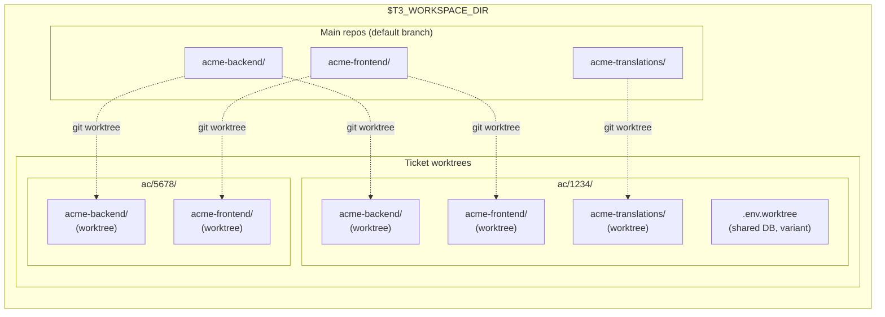
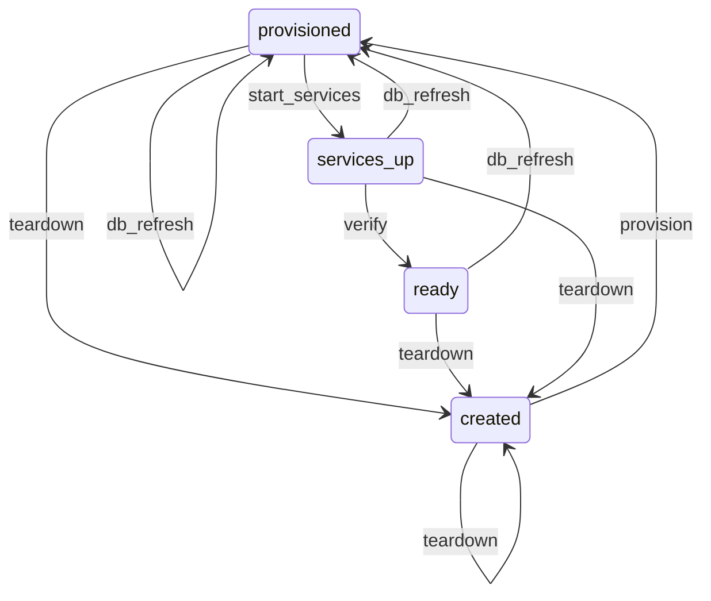

# Environment & Workspace Lifecycle

The infrastructure foundation. Every other teatree skill depends on this one.

Manages **multi-repo worktree workspaces** — creating synchronized git worktrees across multiple independent repositories for a single ticket, then provisioning each with isolated ports, databases, env files, and services so they're ready to use immediately.



Each ticket gets its own directory with one git worktree per affected repo and a shared `.env.worktree` for database name and variant configuration. Ports are ephemeral — allocated at `lifecycle start` time and passed via runtime env only. Worktrees share the `.git` directory with the main clone but have their own branch and working tree.

## Dependencies

None — this is the foundation skill.

## Configuration (`~/.teatree`)

Key variables used by this skill (see `/t3:setup` for the full config reference):

| Variable | Required | Purpose |
|----------|----------|---------|
| `T3_REPO` | Yes | Path to the teatree repo clone |
| `T3_WORKSPACE_DIR` | Yes | Root workspace directory |
| `T3_BRANCH_PREFIX` | No | Prefix for worktree branches (default: initials from `git config user.name`) |
| `T3_AUTO_SQUASH` | No | Auto-squash related unpushed commits before push (default: `false`) |
| `T3_SHARE_DB_SERVER` | No | Share one Postgres server across worktrees (default: `true`). Each worktree gets its own DB name but connects to the same server. When `false`, each worktree starts its own Postgres container. |

### Data Directory (XDG-Compliant)

Teatree stores runtime data (ticket cache, MR reminders, followup dashboard) in:

```text
$T3_DATA_DIR  (default: ${XDG_DATA_HOME:-$HOME/.local/share}/teatree)
```

`~/.teatree` is the **config file** — never use it as a data directory. Set `T3_DATA_DIR` in `~/.teatree` to override the default location.

## Setup Verification

If the environment seems incomplete (missing `uv`, hooks not firing, overlay absent), load `/t3:setup` to run the bootstrap validator.

## Commands

All workspace operations go through the `t3` CLI. Run `t3 <overlay> --help` for the full command list. Key command groups: `lifecycle` (setup/start/restart/teardown), `workspace` (ticket/finalize/clean-all), `run` (backend/frontend/tests), `db` (refresh/restore-ci/reset-passwords).

## Cleanup Patterns

`t3 <overlay> workspace clean-all` is the entry point for all cleanup. It prunes merged worktrees, drops orphaned databases, classifies and removes stale local branches (gone-remote, fully-merged, **squash-merged via subject match**), drops orphaned stashes, removes empty workspace dirs, and prunes old DSLR snapshots. The squash-merge classifier handles `(#NNN)` suffixes and `relax:` → `feat(scope):` prefix rewrites, so squash-merged branches don't appear as "unsynced".

### Single-repo cleanup

From the overlay or main clone:

```bash
t3 <overlay> workspace clean-all
```

### Multi-repo cleanup

`clean-all` operates on the current working directory for branch and stash pruning. When a session has touched multiple independent repos (overlay repo, `$T3_REPO`, skills/dotfiles repos), loop:

```bash
for repo in "$T3_REPO" ~/workspace/<overlay>/<overlay-repo> ~/workspace/<skills-repo>; do
  (cd "$repo" && t3 <overlay> workspace clean-all)
done
```

Worktree pruning, orphan databases, and DSLR snapshots are global to the overlay's DB and only need to run once. Branch and stash pruning needs to run **per repo**.

### Triage of "WARNING: branch X has N unpushed commits" output

When `clean-all` skips a branch with this warning, the branch has commits the classifier could not match to anything on `origin/main`. Triage manually:

1. **Enumerate** the unique commits: `git log --oneline origin/main..<branch>`
2. **For each commit**, classify:
   - **Already on main via different SHA** — verify by grepping `git log --all --oneline --grep="<subject>"` or by comparing changed file paths. If the content is reachable from main, the branch is safe to delete.
   - **Already shipped via a different open PR** — search `gh pr list --search "<file path>"` or `git log --oneline --all -- <changed-file>`. If shipped, branch is safe to delete.
   - **Unique unpushed work** — keep, then choose a delivery path: bundle into an open related PR (see [`../ship/SKILL.md`](../ship/SKILL.md) § "Bundle Into an Existing Open PR"), open a dedicated PR, or explicitly mark as a never-merge dev override.
3. **After verification**, force-delete: `git branch -D <branch>` and `git worktree remove --force <path>` if a worktree exists.

### Orphan stash verification

`clean-all` drops only stashes whose source branch is gone. For stashes you encounter on existing branches, verify before dropping:

```bash
git stash show -p stash@{N}  # inspect the diff
# Grep main for the changed lines/sections to confirm content is on main
```

If the content is on `main` (typical for stashes that pre-date a squash-merged branch), drop with `git stash drop stash@{N}`.

## Rules

### Plan Before Executing

Canonical rule: see [`../rules/SKILL.md`](../rules/SKILL.md) § "Always Create Tasks". Covers simple vs complex task thresholds and the "never skip" clause.

### Fix the CLI, Never Work Around It (Non-Negotiable)

When a `t3` command fails, **fix the CLI code first** — never manually run the underlying commands (`docker compose`, `manage.py runserver`, `npm run`, `createdb`, `cp`, `ln -s`, etc.) as a workaround. Manual workarounds invariably miss steps (translations, symlinks, settings files, CORS, SSL flags) and create a broken environment that wastes more time than fixing the CLI would have.

1. **Stop** — do not run the underlying command manually.
2. **Investigate** the overlay or core code to find why the command failed.
3. **Fix** the code, add a test, and commit.
4. **Re-run** the `t3` command to verify the fix.

### Never Hand-Edit Generated Files

Setup tools (`t3 <overlay> lifecycle setup`, etc.) generate configuration files (`.env.worktree`, docker overrides, port allocations). **Manual edits create drift** and are overwritten on the next setup run.

When a generated file is wrong or incomplete, **re-run the setup tool** — don't manually patch the file. If setup fails, diagnose the root cause in the setup script (see `/t3:debug`), don't work around it.

### Never Run Infrastructure Commands Directly

Use the `t3` CLI (`t3 <overlay> lifecycle start`, `t3 <overlay> run backend`, `t3 <overlay> run frontend`, etc.) instead of running `docker compose`, language-specific dev servers, or build tools directly. The CLI commands handle:

- Environment variable loading from generated files
- Service ordering (data store → migrations → application)
- Port isolation between worktrees
- Health checks after startup

Direct commands bypass these safeguards, causing subtle failures (wrong DB, port collisions, missing migrations).

### Never Edit Files in the Main Clone

Canonical rule: see [`../rules/SKILL.md`](../rules/SKILL.md) § "Worktree-First Work". Covers the pre-edit path check and collision detection.

### Full Worktree Isolation (Non-Negotiable)

Each worktree gets its own **isolated environment** — dedicated database, ports, containers, and env files. Never share infrastructure between worktrees:

- Never point one worktree's frontend at another worktree's backend
- Never use the main repo's database for worktree work
- Never manually set ports — let `t3 <overlay> lifecycle setup` allocate them via `find_free_ports()`

When testing an MR, create a full worktree (`t3 <overlay> workspace ticket` + `t3 <overlay> lifecycle setup` + `t3 <overlay> lifecycle start`).

### Validate After Provisioning (Non-Negotiable)

After importing a database or downloading an artifact, always validate it:

- **Check file sizes** — 0-byte files indicate failed downloads (often VPN/network issues)
- **Spot-check data** — empty seed/reference tables indicate a corrupt import; the application will crash on every request with lookup errors
- If validation fails, **delete the corrupt artifact and re-run provisioning**. Never try to manually fix corrupt data — interdependent reference tables make this a losing game.

### Service Startup Ordering

Setup tools enforce ordering: **data store → migrations → application server**. Starting the application before migrations causes "relation does not exist" errors. Always use the orchestration functions (`t3 <overlay> lifecycle start`) rather than starting services individually.

### Never Delegate Skill-Dependent Work to Sub-Agents

See [`../rules/SKILL.md`](../rules/SKILL.md) § "Sub-Agent Limitations". If parallelism is needed, pass the **full skill file contents** in the sub-agent prompt — but prefer sequential main-conversation execution.

### Verify Services Before Declaring Running

After starting dev servers, **verify each service responds via HTTP** before reporting success. Check that frontend, backend, and API endpoints return expected status codes (2xx/3xx). If any check fails (000, 500, connection refused), diagnose before reporting — see troubleshooting docs.

Project skills define the specific endpoints to check (e.g., admin login, API version, frontend index).

## Extension Points

For the full extension points table, override chain, and project skill creation guide, see [`references/extension-points.md`](references/extension-points.md).

Key methods on `OverlayBase`: `get_repos()`, `get_provision_steps()`, `get_db_import_strategy()`, `get_env_extra()`, `get_run_commands()`, `get_services_config()`, `get_verify_endpoints()`. See the reference for the full list.

## Lifecycle State Machine



## Troubleshooting

Before any setup or server operation, check [`references/troubleshooting.md`](references/troubleshooting.md) for known failure modes matching the current operation.

## Skill File Locations & Symlink Chain

```text
<agent-skills-dir>/* → $T3_REPO/skills/*
                            (SOURCE OF TRUTH)
```

The agent skills directory varies by platform (for example `~/.claude/skills/`, `~/.codex/skills/`, `~/.cursor/skills/`, or `~/.copilot/skills/`).

- **NEVER** replace a symlink with a real file/directory. If unsure, run `ls -la` first.
- **Before writing to any skill file**, resolve the real path: `readlink -f <path>`.

## Reference Index

| When you need to... | Read |
|---|---|
| Check tool requirements or first-time setup | [`references/prerequisites.md`](references/prerequisites.md) |
| Find available shell functions, scripts, or COMPOSE_PROJECT_NAME details | [`references/scripts-and-functions.md`](references/scripts-and-functions.md) |
| Understand extension points, override chain, or create a project skill | [`references/extension-points.md`](references/extension-points.md) |
| Diagnose worktree setup failures, DB errors, port conflicts | [`references/troubleshooting.md`](references/troubleshooting.md) |
| Cross-cutting agent rules (clickable refs, token extraction, temp files) | [`../rules/SKILL.md`](../rules/SKILL.md) |
