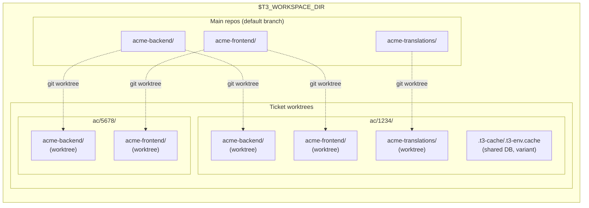
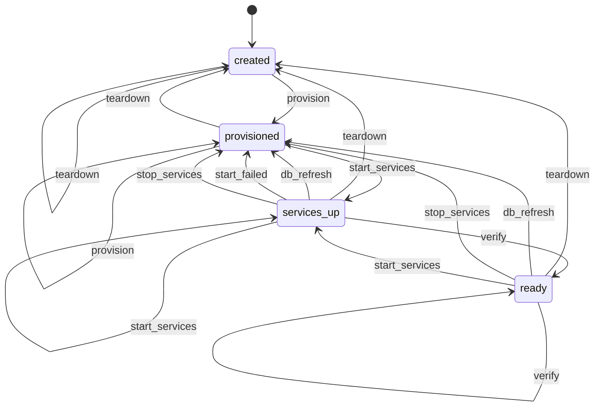

# Environment & Workspace Lifecycle

The infrastructure foundation. Every other teatree skill depends on this one.

Manages **multi-repo worktree workspaces** — creating synchronized git worktrees across multiple independent repositories for a single ticket, then provisioning each with isolated ports, databases, env files, and services so they're ready to use immediately.


```mermaid
graph TD
  subgraph "$T3_WORKSPACE_DIR"
    direction TB
    subgraph "Main repos (default branch)"
      main_be["acme-backend/"]
      main_fe["acme-frontend/"]
      main_tr["acme-translations/"]
    end
    subgraph "Ticket worktrees"
      subgraph "ac/1234/"
        wt_be["acme-backend/<br/>(worktree)"]
        wt_fe["acme-frontend/<br/>(worktree)"]
        wt_tr["acme-translations/<br/>(worktree)"]
        envfile[".t3-cache/.t3-env.cache<br/>(shared DB, variant)"]
      end
      subgraph "ac/5678/"
        wt2_be["acme-backend/<br/>(worktree)"]
        wt2_fe["acme-frontend/<br/>(worktree)"]
      end
    end
  end

  main_be -.->|"git worktree"| wt_be
  main_fe -.->|"git worktree"| wt_fe
  main_tr -.->|"git worktree"| wt_tr
  main_be -.->|"git worktree"| wt2_be
  main_fe -.->|"git worktree"| wt2_fe
```

Each ticket gets its own directory with one git worktree per affected repo and a shared `.t3-cache/.t3-env.cache` (symlinked into each repo worktree as `.t3-env.cache`) for database name and variant configuration. Ports are ephemeral — allocated at `worktree start` time and passed via runtime env only. Worktrees share the `.git` directory with the main clone but have their own branch and working tree.

## Dependencies

None — this is the foundation skill.

## Configuration

Key environment variables used by this skill (see `/t3:setup` for the full config reference):

| Variable | Required | Purpose |
|----------|----------|---------|
| `T3_REPO` | Yes | Path to the teatree repo clone |
| `T3_WORKSPACE_DIR` | Yes | Root workspace directory |
| `T3_BRANCH_PREFIX` | No | Prefix for worktree branches (default: initials from `git config user.name`) |
| `T3_AUTO_SQUASH` | No | Auto-squash related unpushed commits before push (default: `false`) |
| `T3_SHARE_DB_SERVER` | No | Share one Postgres server across worktrees (default: `true`). Each worktree gets its own DB name but connects to the same server. When `false`, each worktree starts its own Postgres container. |

### One Agent Per Checkout (`worktree_occupancy_gate_enabled`, #3952)

Two agents in one working tree interleave commits and stage each other's
in-progress files. A dispatched agent therefore CLAIMS its checkout for the
length of its run, and a second requester is refused with the holder named
instead of being handed the same tree.

The claim is advisory: it refuses a second requester and never evicts the
first. Nothing deletes, reaps or kills a checkout on the strength of it, and a
lapsed lease grants the next requester without touching the previous holder's
process, files or branch.

```bash
t3 <overlay> worktree occupancy                     # who holds what right now
t3 <overlay> worktree claim-occupancy <path> --holder <id>   # take it for a hand-driven lane
t3 <overlay> worktree release-occupancy <path>      # hand it back, naming whose claim was freed
```

A dispatched agent needs none of these — `run_headless` takes and releases the
claim around the run. Use them when you work a branch OUTSIDE the lifecycle
(raw `git`, a hand-driven fix), so the factory sees the tree as occupied rather
than walking into it.

When a request is refused, the answer is to wait, work a different ticket, or —
once you have CONFIRMED the holder is gone — `release-occupancy`. Never delete
the checkout to clear a claim. `t3 <overlay> workspace ticket` refuses an
occupied checkout too; `--take-over` is the explicit override. The DB-home
`worktree_occupancy_gate_enabled` is the kill switch, and
`worktree_occupancy_lease_seconds` (default 1800) bounds a claim whose holder
died without releasing.

### Concurrent Local Stacks (`max_concurrent_local_stacks`, #1397)

A locally-running worktree (state `services_up` or `ready`) holds a
docker stack, language servers, browsers, and CI processes. On a memory-
constrained host, running two stacks in parallel can OOM the machine and
abort both. The DB-home setting `max_concurrent_local_stacks` caps how
many distinct tickets can be in those states at once for a given overlay
— set it in the `ConfigSetting` store:

```bash
t3 <overlay> config_setting set max_concurrent_local_stacks 1   # default 1 (single in-flight stack, headless-safe); 0 = unbounded
t3 <overlay> config_setting set max_concurrent_local_stacks 1 --overlay heavy-overlay   # per-overlay override is supported
```

When the cap is set and the limit would be exceeded, `t3 <overlay>
worktree start` and `t3 <overlay> workspace start` refuse with an
error naming each blocking worktree path. Resolve by tearing the
blocker down first:

```bash
t3 <overlay> worktree teardown <path-from-the-error>
# then re-run start on the new worktree
```

Sibling worktrees of the *same* ticket (a multi-repo workspace) count
as one logical stack; the cap is per distinct ticket, not per worktree
row. Re-firing `start` against an already-running worktree is allowed
(the candidate row is excluded from its own count, preserving FSM
idempotence). The cap is scoped per overlay, so a heavy overlay can
cap to `1` while a cheap dogfood overlay stays unbounded.

This cap covers docker stacks only. The sibling bound — concurrent
**test workers**, where each dispatched agent's `-n auto` pool multiplies
by the number of agents — is `/t3:rules` § "Sub-Agent Limitations", and it
is set per brief, not per overlay.

### Data Directory (XDG-Compliant)

Teatree stores runtime data (ticket cache, PR reminders, followup state) in:

```text
$T3_DATA_DIR  (default: ${XDG_DATA_HOME:-$HOME/.local/share}/teatree)
```

`T3_DATA_DIR` (an environment variable) overrides the default data-directory location — it is data storage, not config; teatree's settings live in the DB `ConfigSetting` store.

## Setup Verification

If the environment seems incomplete (missing `uv`, hooks not firing, overlay absent), load `/t3:setup` to run the bootstrap validator.

## Commands

All workspace operations go through the `t3` CLI. Run `t3 <overlay> --help` for the full command list. Key command groups: `lifecycle` (setup/start/restart/teardown), `workspace` (ticket/finalize/clean-all/relocate), `run` (backend/frontend/tests), `db` (refresh/restore-ci/reset-passwords).

### Per-overlay workspace dir + `workspace relocate`

Worktrees regroup under a dedicated dir PER OVERLAY. Two DISTINCT roots — conflating them breaks provisioning:

- **WORKTREE root** `config.worktree_root()` (where NEW worktrees are created) resolves, first match wins: the `T3_WORKSPACE_DIR` env var / Django setting (explicit back-compat override), then a DB-home `ConfigSetting` `workspace_dir` row (overlay scope, then global — set with `t3 <overlay> config_setting set workspace_dir <path> [--overlay <name>]`), then the sound default `~/workspace/t3-workspaces/<overlay>/`. A `[teatree] workspace_dir` TOML value is DB-home and ignored on read — it is warned about on load and migrated once with `config_setting import`.
- **CLONE root** `config.clone_root()` (`~/workspace`, where main repo clones live) is what `find_clone_path` and every clone-discovery caller use. It resolves: `T3_WORKSPACE_DIR` env / Django setting, then `~/workspace`. Provisioning DISCOVERS clones under this root and CREATES the worktree under the worktree root — passing the worktree root to `find_clone_path` would scan the wrong dir and fail "No git clone found".

**One canonical root, alternates drained (#3583).** `core/worktree/worktree_roots.py` is the single answer to "which roots hold teatree worktrees?". Only the canonical worktree root is ever written to; the SCANNED set additionally covers every root existing registered worktrees actually live in, so an alternate root an ad-hoc `git worktree add` created is DRAINED by `clean-all` rather than left to accumulate — and once drained it is never written to again, collapsing the split with no manual migration. `t3 doctor check` reports the state: it FAILs on a registered worktree PROVED never to have been a checkout, WARNs UNVERIFIED on one this venue simply cannot resolve, and WARNs on a namespace split across roots — all over the same three-valued `probe_checkout` the reapers use, so the reaper, the doctor and the setup-time warning can never disagree about which dirs are broken. Physically deleting an emptied alternate root directory is a deployment action, not something `clean-all` does.

**A checkout is only DEAD when a single venue can prove it (#3912, #3853).** A linked checkout records its admin dir as an ABSOLUTE path written by whichever execution context created it. Read from a context that reaches the clone elsewhere, that path resolves to nothing and `git rev-parse` fails with the SAME wording it uses for a directory that never held a repository — so "dead" and "not visible from here" are the same bytes, and a healthy in-flight worktree reads as reapable. `probe_checkout` therefore reports `NOT_A_CHECKOUT` only when the dir carries no `.git` at all AND git agrees there is no repository; it reports `CHECKOUT` when the caller hands it a source clone that still holds the checkout's admin entry (looked up by name, which is context-free) — a caller that cannot resolve the clone gets UNKNOWN, not a verdict; everything else is UNKNOWN too. `CHECKOUT` means "live, hands off", not "git works here": a clone-vouched checkout still fails every git command run inside it. UNKNOWN never reaps, exactly as in the reviewer orphan sweep. So `release-dead-rows` and `clean-all` act on nothing they cannot positively prove dead, and the broken-DIR pass REPORTS unresolvable dirs instead of removing them — recover their work with `t3 <overlay> workspace salvage`.

**A `git worktree prune` cannot tell "not mounted here" from "deleted", so it is gated (#4287).** The prune deregisters every registration whose checkout it cannot stat IN THE READING VENUE, and a checkout mounted only where it was created is absent here in the same `ENOENT` a deleted one produces — measured: one containerised pass deregistered 86 host checkouts, which then answered `fatal: not a git repository`. Every prune call site therefore routes through `core/worktree/venue_safe_registry.prune_worktrees`, which runs the prune only when each registration it would drop lies under `config.worktree_root()` — the one root this venue provisions into — AND sits in a directory readable here. A readable neighbourhood alone is not enough: a host checkout directly under `$HOME` is absent-with-a-readable-parent from inside the container. The prune takes no per-entry scope, so one unvouchable registration withholds the whole prune and the refusal names the offenders; release it by pruning from the venue that owns them, or by `git worktree lock`-ing each one so the prune skips it. The same predicate answers the #706 work guard, which reports UNKNOWN — never "no work" — for a checkout it cannot read, so no branch delete proceeds on an unreadable path.

**Provisioning may not re-create what it cannot prove disposable (#3967).** Clearing a worktree slot is a deletion like any other, so `worktree provision` asks `core/worktree/checkout_disposal.disposal_refusal` before it removes anything. Two things authorise disposal and nothing else does: a directory carrying no `.git` at all (a `git worktree add` that died before writing one), or a checkout the acting clone itself vouches for by admin-entry name. A checkout whose gitdir names a root absent here is refused as a VIEW MISMATCH — act from the context that resolves that root — and one no reachable clone holds is refused as unproven, to be disposed of from the clone whose registry holds it. Occupancy overrides both: a path a busy ticket holds is never re-created, whatever git says about it. Provisioning fails loudly on a refusal rather than clearing the slot, so the operator sees the reason instead of losing the work.

**A dead registered checkout has ONE owner (#3583 follow-up).** A registered `Worktree` row whose dir is provably not a git repo is released by the ROW reaper (`core/worktree/broken_checkout.py`). The release is decided from the BRANCH in the source clone under the #706 standard: released only when the checkout is PROVABLY not a repo AND the branch holds nothing that exists on no remote. The clone is resolved BEFORE the dir is probed, because it is what tells a checkout that is live in another context from one that is dead everywhere. An unresolvable clone, an unreadable push state, or genuinely unpushed commits KEEP the row with a reason — recover those with `t3 <overlay> workspace salvage`. The DIRECTORY is never removed on this evidence; disposing of it stays an explicit operator decision.

To move an overlay's EXISTING teatree-managed worktrees onto the new per-overlay dir:

```bash
t3 <overlay> workspace relocate            # move existing worktrees under the resolved per-overlay dir
t3 <overlay> workspace relocate --dry-run  # list the moves without touching anything
```

It uses `git worktree move` (never a raw `mv` — git's worktree admin must update so the moved worktree stays linked to its clone), then rewrites each `Worktree` row's stored path. It **SKIPS and reports** any worktree that is git-locked, has uncommitted changes, or is a live mid-task one (its ticket has a live session/active task, or the process CWD is inside it); it is **idempotent** (a worktree already there is a no-op) and **continues past a single failed move** (reporting git's own stderr, never aborting the run).

**A move across a MOUNT-POINT boundary is refused by name, not attempted (#4368).** `git worktree move` is a `rename(2)`, which returns `EXDEV` between distinct mount points — including two bind mounts of ONE filesystem, which report the same `st_dev`. So a guard keyed on the device concludes the move is safe and it fails anyway with a bare `rc=128`; `core/worktree/relocation.py` therefore keys on the mount table (`utils/mount_points.py`, `/proc/self/mountinfo`) and refuses with both mount points named. A venue that cannot read that table gets UNKNOWN and the move goes ahead, so git's stderr still speaks. The boundary is reported ahead of the transient refusals (dirty, busy, locked) because it is the only one no operator action can clear — "uncommitted changes" on a cross-boundary worktree invites a commit-and-retry that cannot succeed.

That policy is the SAME one `t3 doctor check`'s split-namespace WARN consults: it prescribes `workspace relocate` only for the rows relocate would actually move, and NAMES each refused row with its reason instead of counting it. A count that includes an un-relocatable row prescribes a remedy that provably cannot discharge the finding, so the WARN recurs at that number on every run forever.

## Is this branch landed? One canonical answer

Never hand-roll it. `git cherry origin/main HEAD`, `git branch --merged`, `git merge-base --is-ancestor` and `git log … --not origin/main` all answer by SHA or ancestry, and a squash-merge rewrites the branch's commits into a new SHA on the default branch — so every one of them reports already-landed work as unmerged. That misread once escalated three merged branches to the owner as false completions and dispatched a shipper to push them.

```bash
t3 <overlay> workspace branch-verdict <branch> [<branch> …] [--repo <path>] [--json]
```

Read-only, works on any local branch (no `Worktree` row needed), and the sweep across N worktrees is ONE call. It serializes the three-layer content classifier: `redundant` + the deciding `source` (`cherry-zero-unique` / `synthetic-squash` / `branch-merged`), plus `forge_merged`, `merged_with_post_merge_work` and `unique_shas` **together** — a branch the forge calls merged whose tip still carries unique commits is reported NOT redundant with those SHAs named, so "merged" is never readable on its own as "safe to delete". An inconclusive probe answers NOT landed, so an uncertain branch is kept.

A fourth field, `content_present_on_target`, is the present-tense question the other three structurally cannot ask: `git cherry` reads a patch's PRIOR appearance on the target, and a REVERT there does not erase it, so a squash-merged-then-reverted branch reads `redundant` on every patch-id layer. The report carries both, and the human line says so; the boolean `branch_is_landed` (what `ship`'s duplicate-PR refusal consumes) requires BOTH, so a reverted branch ships a fresh PR instead of being refused one. Post-merge drift on unrelated files stays LANDED; drift that re-edits the same region reads NOT LANDED — an unmergeable region is not proof of presence, and a needless PR is the cheap direction to be wrong in.

`workspace landscape` cannot answer this: its `has_unpushed` is SHA-based and deliberately fail-open (it asks "might something be in flight?"). `workspace emit` signals a landed branch only by ABSENCE. A `PreToolUse` advisory (`t3 <overlay> gate merged-detect`) nudges a hand-rolled probe back here.

## Cleanup Patterns

`t3 <overlay> workspace clean-all` is the entry point for all cleanup. It tears down **Worktree rows whose branch is squash-merged** (any FSM state, via the forge merged-PR signal with a patch-id `git cherry` fallback — a squash-merge is NOT an ancestor of `origin/<default>`, so is-ancestor / three-dot-diff alone misses it — not just `CREATED` rows), prunes merged worktrees, drops orphaned databases, reaps per-worktree docker images/containers for compose projects with no live worktree (only projects teatree itself provisioned — those named `<repo>-wt<ticket-pk>`; the deploy stack and unrelated user projects are never candidates), reaps the auto-isolated worktree env roots **whose own stamp names a checkout this venue can see is gone** (the per-worktree `db.sqlite3` dirs under `~/.local/share/teatree-worktrees` — never one holding a `.git` checkout, never an unstamped one), classifies and removes stale local branches (gone-remote, fully-merged, **squash-merged via subject match**), reaps **orphaned RAW git worktrees** (a real `git worktree` with no teatree `Worktree` DB row — created by a sub-agent's bare `git worktree add`, the accumulation source that reached 183 on a real host; #2361), REPORTS **unresolvable checkouts** as UNKNOWN and removes none (#3912 — a dir that CARRIES a `.git` entry yet fails `git rev-parse` is either a corrupted worktree or a perfectly healthy one created in another execution context, and no venue can tell those apart; a dir with NO `.git` was never a checkout and belongs to the auto-isolated env-dir reaper above), drops orphaned stashes, recursively removes empty workspace/ticket dirs (including multi-repo ticket dirs left holding only empty repo subdirs), and prunes old DSLR snapshots. The squash-merge classifier handles `(#NNN)` suffixes and `relax:` → `feat(scope):` prefix rewrites, so squash-merged branches don't appear as "unsynced".

**Every reaping pass captures a checkout's unshipped work first, and `restore` reads it back (#4435).** Ahead of any disposition, `core/cleanup/unshipped_work.py` writes a salvage bundle — the staged + unstaged + untracked delta, plus a patch per unpushed commit — and an `UnshippedWorkRecord` row pointing at it. Two properties make it recoverable rather than merely present: the patches are captured VERBATIM (a stripped patch is one `git apply` rejects as `corrupt patch`), and a read this venue could not complete writes its cause to a distinct `.unreadable` key instead of overwriting a good capture with zero bytes. Apply one back with:

```bash
t3 <overlay> workspace restore <checkout-path-or-bundle-prefix> --into <checkout> --dry-run   # report only
t3 <overlay> workspace restore <checkout-path-or-bundle-prefix> --into <checkout>             # apply
```

`--into` is never inferred, the commits patch applies before the uncommitted one (the latter is the delta on top), and each part is reported on its own line — `git apply` is all-or-nothing per invocation, so a part that fails leaves the target exactly as it was. `t3 doctor check` names the recorded checkouts to restore.

**The judgment layer is a separate skill.** `clean-all` is the mechanical reaper — it auto-deletes the provably-redundant and EMITs every item it could not auto-decide (`t3 <overlay> workspace emit` → a JSON array). Deciding what to DO with each emitted item — salvage unmerged work to a fresh PR (`workspace salvage`), delete a shipped/superseded item, push post-merge commits to a new PR, skip a colleague's or a live item, or keep an uncertain one — is the **`/t3:sweeping-worktrees`** skill. Load it when sweeping stale/lost worktrees, branches, or stashes, or triaging `workspace emit`.

Branch names matching a `clean_ignore` glob (the DB-home `clean_ignore` setting in the `ConfigSetting` store, per-overlay overridable — set with `t3 <overlay> config_setting set clean_ignore '["spike/*", "dev-override"]'`; a `[teatree] clean_ignore` TOML value is ignored on read) are never reaped on **any** deletion path — the squash-merged-row reaper, the `CREATED`-state row loop, and every branch-prune pass (gone-remote, fully-merged, squash-merged) — for never-merge dev overrides and long-lived spikes. One shared predicate enforces this, resolving the patterns through the row's own overlay (the overlay-scope `ConfigSetting` row → the global-scope row) for worktree rows, and through the active overlay for the repo-scoped branch passes. When the squash signal is uncertain (no merged PR, non-empty diff, forge CLI absent) the worktree is **kept with a warning**, never deleted — the data-loss guards (#706/#835/#1506) are never bypassed. `clean-all` runs **fully unattended by default** (#2361): it never blocks on stdin and never prompts per worktree — an uncertain or unsynced worktree is kept with a warning, not a question. Pass `--interactive` to opt into the per-worktree push/abandon/skip prompt; the flag takes effect only when stdin/stdout are real TTYs, so it still runs unattended in a pipe or loop tick. A worktree with **uncommitted changes** (a live one an agent may be mid-task in) is always kept, never bundle-and-reaped on a merged signal (#2243) — only `force`/explicit-abandon bundles and reaps a dirty worktree.

**Env-dir ownership is one answer, and the FILESYSTEM is its primary source (#3852).** "Does a live checkout own this env dir?" is resolved from a scan of every directory carrying a `.git` under the scanned roots, UNION every checkout `git worktree list` reports across the discoverable clones, UNION the `Worktree` rows (`_workspace.checkout_registry` — the same seam the raw-orphan pass below asks, not a second answer to one question), plus each dir's own `owner-checkout.path` stamp, which inverts the one-way slug hash so liveness is proven rather than inferred. The slug is `sha256(checkout_path)`, so whether that path exists on disk IS the question; a registry answer is only a proxy. Registries alone were not enough in two ways: `paths.resolve_data_dir` mints an env dir for ANY checkout (so an unregistered agent worktree read as an orphan), and clone discovery found 1 of the clones actually present, with a never-discovered clone producing no gap at all. Every pass also stamps the env dir of each checkout it discovered, so the durable mapping grows instead of covering only newly-minted dirs.

**The scan covers everything it does not explicitly exclude (#3872).** It walks INTO checkouts (agent worktrees nest inside their own clone) and THROUGH symlinked dirs (the host reaches its own teatree clone that way), deduplicating recursion on the resolved path so a symlink loop terminates. Only a fixed set of package/venv/tool-cache dirs is excluded, because none can hold a checkout the resolver mints an env dir for. Every other uncovered path is a gap, so a miss can never present as `complete` — a silent skip drops live checkouts from the keep-set while the answer still reads complete, which is the whole evidence the deletion rests on.

Two fail-closed guards. Any gap — an unreadable directory, a subtree past the walk's runaway depth cap, or a clone whose `git worktree list` exits non-zero — keeps EVERY dir and reports the gap. And a dir modified at or after the instant the keep-set was computed is kept: the box provisions continuously, so a snapshot-then-delete loop would otherwise reap an env dir minted mid-pass, while live. `--dry-run` prints a per-dir `KEPT '<slug>': <reason>` / `WOULD Remove …` line for every dir, so the preview is a full account rather than a list of deletions.

**A scan that skipped nothing can still be blind, so only the STAMP is venue-independent (#3872).** Making every skip record a gap closes the case where the walk declined to look; it cannot close the case where there was nothing there to look at. Run `clean-all` in the container the project mandates `t3` runs in and the isolated-env root is bind-mounted while the clone owning those dirs is not: the walk reads every root that exists, skips nothing, records **no gap**, reports `complete` — and every host-owned env dir reads as an orphan. The blindness is bidirectional (measured: the host proposes removing 43 dirs, the container 102, and two dirs the container keeps as owned appear in the host's removal list), so no venue's scan result is a sound liveness test on its own. A dir is therefore reclaimable in exactly one shape: **its own stamp names a checkout that does not exist AND lies within a root this venue walked**, judged by `venue_can_observe` (the path is under a scanned root, and the directory that would contain it is readable). A stamp naming a path this venue cannot see, and a dir carrying **no stamp at all**, are both missing evidence — kept, with the reason on the dir's own `KEPT` line.

Every new env dir is stamped at birth (`IsolatedEnvDir.open_for` writes the stamp before the control DB is seeded, so a startup that dies mid-copy still leaves a claimed dir). Dirs predating that are reclaimed by backfill — and because stamping is itself venue-limited, run it **in every venue that can see checkouts**, host and container both:

```bash
t3 <overlay> workspace stamp-owners   # deletes nothing; stamps what THIS venue can see
```

Until a dir is stamped the reclaim is deliberately conservative and frees less; that is the intended trade against a command that offered to delete a live agent's control DB.

**Orphaned RAW worktrees (#2361).** A `git worktree` with no teatree `Worktree` row is invisible to the DB-row reaper, so they pile up indefinitely. `clean-all` discovers them by listing each known main clone's `git worktree` registry and subtracting the DB-tracked set, then disposes of each one safety-first: a worktree whose branch is already on a remote (or a detached one with no unique commit) is reaped; one with **uncommitted changes** is always kept (a live mid-task worktree); one with **unpushed unique work** is kept with a warning and salvaged only by an explicit push of the branch. The #706/#835 data-loss guard is never bypassed: unique work is never reaped, and an inconclusive pushed-state probe keeps the worktree.

**Remote-state freshness gates the whole pass.** The "is it on a remote?" probe reads local `refs/remotes/*`, which go stale when a branch is deleted upstream by anything other than this clone — the ordinary forge auto-delete-on-merge. Against a stale ref, unpushed work reads as pushed and the last copy gets reaped. So each clone's tracking refs are refreshed (`git fetch --all --prune`) before any of its orphans is classified, and a **failed refresh fails closed**: the clone is skipped whole (`SKIPPED clone <path>: could not refresh remote refs`) and nothing in it is touched. On an offline host the pass therefore reaps nothing rather than reaping wrongly.

Each per-worktree teardown funnels through one resilient seam (`reap_one_worktree`), so a single bad row never aborts the whole run. A row whose `overlay` is no longer registered (a foreign/unregistered overlay, or a sibling-repo worktree whose overlay was uninstalled) is **skipped with a warning and the run continues** — the documented crash where `get_overlay_for_worktree` raised `ImproperlyConfigured` mid-loop is fixed. A sibling clone that cannot be classified (corrupt or origin-less, so `git default-branch`/squash detection raises) is likewise skipped, not fatal.

### Free disk space — `workspace reclaim-disk` (never raw docker)

On a "free disk space" request, run `t3 <overlay> workspace reclaim-disk` — THE sanctioned disk-reclaim path. Do **not** hand-roll raw docker. It runs exactly the three zero-data-loss prunes and STOPS:

- `docker builder prune -af` — build cache (rebuildable, usually the largest)
- `docker image prune -f` — **dangling images only, never `-a`**
- `docker volume prune -f` — **unreferenced volumes only**

It reports per-step and total reclaimed bytes. `--dry-run` plans the set without removing anything. Running stacks, tagged application images, and attached DB volumes backing a live worktree all survive. The danger this forecloses: `docker image prune -af` (the `-a`) reaps every unused image including the application images (forcing full rebuilds), and pruning right after a stack is stopped makes that stack's images "unused" so `-af` reaps them — the auto-mode classifier blocks `clean-all` but does **not** guard raw `docker image prune -af`. Removing application images or tearing down worktrees/DBs stays a separate, explicitly-targeted action (`workspace teardown` / `clean-all`), never bundled into `reclaim-disk`.

**It fails loud, and `0B` means `0B`.** A prune that docker actively refuses is marked `FAILED — <reason>` on its step and exits the command **non-zero**. Every step still runs, so one refusal never forfeits the reclaim the others can do. So a clean exit reporting `Total reclaimed: 0B` genuinely means there was nothing left to reclaim — treat it as such, and never read a `FAILED` line as "already clean".

**A venue that cannot reach docker refuses UP FRONT and names the route (#4585).** The daemon is probed before anything is planned or run, so a venue that cannot act attempts no prune, prints no `Total reclaimed:` line, and exits **non-zero** — a reclaim that never happened can no longer read as one that found nothing. That covers an absent docker CLI too: three `reclaimed 0B` lines and a clean exit used to be indistinguishable from a genuinely clean box.

The refusal carries the route out, because the venue split is real but not absolute:

- `deploy/docker-compose.yml` mounts `/var/run/docker.sock` into **every** service and grants it — via `group_add` — to **`teatree-worker` alone**. So in `teatree-admin` the socket node is present and every connect on it is denied.
- `deploy/t3` prefers `teatree-worker` and falls back to `teatree-admin`, which is how an operator lands in the socket-less one.
- `teatree-worker` reaches **both** the daemon and the control DB, so it is the venue that can do the whole job. A refusal in any other service names it: `deploy/t3 <overlay> workspace reclaim-disk` from the host, or `docker compose -f deploy/docker-compose.yml exec teatree-worker t3 <overlay> workspace reclaim-disk`.

Refused **inside** the worker, the grant itself is missing (a stack brought up from a compose file predating it, or a `TEATREE_DOCKER_SOCKET_GID` that does not match the socket's owner inside the container). Fix the grant — re-deploy so `deploy/deploy.sh` re-resolves the socket gid — rather than routing around it. If you must free space before that lands, running the prunes yourself is correct rather than a workaround: execute **exactly** the three commands listed above, on a host that reaches dockerd, in that order — no `-a` on the image or volume prune, and nothing else. Report the freed bytes and STOP. Everything the sanctioned path forbids stays forbidden.

### The checkout pool's retention policy (#4244)

Docker cache is not where the disk goes. The pool of checkouts is: each carries a
`.venv` and a `.venv-hook` at roughly 1.1 GB together, and they accumulate across every
ticket ever worked — measured at ~82 GB across two locations on a box that was 92% full,
about half of it in ad-hoc session checkouts (`wt-*`, `fix<NNNN>`, `cold<NNNN>`) that
appear in **no** ledger, so `workspace emit` never surfaces them.

The policy is enforced by the `resource_pressure` loop, not by a human running a command:

- **A venv untouched for `venv_idle_days` (default 2) is evicted as the cache it is.** `uv
  sync` rebuilds it, so the checkout recovers with no manual step and no work is at risk —
  the tree, the commits and every uncommitted change live outside the venv. Set the
  retention with `t3 <overlay> config_setting set venv_idle_days <days>`.
- **Nothing is evicted from a checkout a process is working in.** Idleness only narrows the
  candidate set; a live process decides. The guard reads the HOST's process table
  (bind-mounted into the container at `/host-proc`) and refuses the whole pass when it
  cannot — a container's own PID namespace shows none of the host's agents. The same
  refusal now governs the heuristic worktree GC, which until [#4244](https://github.com/souliane/teatree/issues/4244)
  read an unusable table's empty answer as "nobody is inside".
- **The guard is re-established immediately before each deletion, not at plan time.** Minutes
  of walks and prunes separate the two, and a checkout is matched under both its written and
  its resolved spelling — a symlinked one never matched the kernel's canonical `/proc/<pid>/cwd`.
  What the delete-time guard stopped is named in the persisted plan.
- **Steady state is therefore one venv per checkout worked inside the window** — on this
  box's cadence, single-digit GB rather than tens. A pool materially above that means the
  pass is being refused; read `t3 loop status`'s persisted plan, which reports
  considered/evicting/kept counts and names what it could not see.
- Worktrees whose ticket is done are swept on the same pass (the `clean-merged` predicate),
  so a merged ticket's checkout does not wait for someone to remember.

### Single-repo cleanup

From the overlay or main clone:

```bash
t3 <overlay> workspace clean-all
```

### Multi-repo cleanup

`clean-all` operates on the current working directory for branch and stash pruning. When a session has touched multiple independent repos (overlay repo, `$T3_REPO`, skills/dotfiles repos), loop:

```bash
for repo in "$T3_REPO" ~/workspace/<overlay>/<overlay-repo> ~/workspace/<skills-repo>; do
  (cd "$repo" && t3 <overlay> workspace clean-all)
done
```

Worktree pruning, orphan databases, and DSLR snapshots are global to the overlay's DB and only need to run once. Branch and stash pruning needs to run **per repo**.

### Triage of "WARNING: branch X has N unpushed commits" output

When `clean-all` skips a branch with this warning, the branch has commits the classifier could not match to anything on `origin/main`. Triage manually:

1. **Enumerate** the unique commits: `git log --oneline origin/main..<branch>`
2. **For each commit**, classify:
   - **Already on main via different SHA** — verify by grepping `git log --all --oneline --grep="<subject>"` or by comparing changed file paths. If the content is reachable from main, the branch is safe to delete.
   - **Already shipped via a different open PR** — search `gh pr list --search "<file path>"` or `git log --oneline --all -- <changed-file>`. If shipped, branch is safe to delete.
   - **Unique unpushed work** — keep, then choose a delivery path: bundle into an open related PR (see [`../ship/SKILL.md`](../ship/SKILL.md) § "Bundle Into an Existing Open PR"), open a dedicated PR, or explicitly mark as a never-merge dev override.
3. **After verification**, force-delete: `git branch -D <branch>` and `git worktree remove --force <path>` if a worktree exists.

### Orphan stash verification

`clean-all` drops only stashes whose source branch is gone. For stashes you encounter on existing branches, verify before dropping:

Every worktree of a repo shares ONE stash stack, so `stash@{N}` names a different
entry the moment any other worktree pushes or drops one. Resolve the entry to a
SHA and work from that:

```bash
sha=$(git rev-parse "stash@{N}")   # pin the identity before doing anything else
git stash show -p "$sha"           # inspect by SHA, never by index
# Grep main for the changed lines/sections to confirm content is on main
```

If the content is on `main` (typical for stashes that pre-date a squash-merged
branch), drop it — but re-check that the index still resolves to the SHA you
inspected, because the drop is the step that destroys the wrong entry:

```bash
[ "$(git rev-parse "stash@{N}")" = "$sha" ] && git stash drop "stash@{N}"
```

## Rules

### Plan Before Executing

Canonical rule: see [`../rules/SKILL.md`](../rules/SKILL.md) § "Always Create Tasks". Covers simple vs complex task thresholds and the "never skip" clause.

### Fix the CLI, Never Work Around It (Non-Negotiable)

When a `t3` command fails, **fix the CLI code first** — never manually run the underlying commands (`docker compose`, `manage.py runserver`, `npm run`, `createdb`, `cp`, `ln -s`, etc.) as a workaround. Manual workarounds invariably miss steps (translations, symlinks, settings files, CORS, SSL flags) and create a broken environment that wastes more time than fixing the CLI would have.

1. **Stop** — do not run the underlying command manually.
2. **Investigate** the overlay or core code to find why the command failed.
3. **Fix** the code, add a test, and commit.
4. **Re-run** the `t3` command to verify the fix.

#### Investigating t3 Failures (the ONLY debug path)

When a `t3` command fails, diagnose **through `t3` itself** — do **not** drop to raw `docker`, `psql`, or `manage.py`. These are the sanctioned diagnostic surfaces, in order:

```bash
# 1. Re-run the failing command with the subcommand's --verbose / -v flag
#    (shows matched patterns, resolved paths, and the underlying invocation)
t3 <overlay> worktree provision --verbose

# 2. Structured per-worktree health checklist (what provisioned, what didn't)
t3 <overlay> worktree diagnose
t3 <overlay> worktree status        # FSM state, branch, allocated host ports

# 3. Cross-store drift across every worktree in the ticket (optionally --fix)
t3 <overlay> workspace doctor

# 4. Global install health — clone path, .pth, tools, MCP connectors
t3 doctor check

# 5. Installation report — versions, registered overlays, config resolution
t3 info
```

Read the diagnostic output, find the root cause in the overlay or core code, fix it, add a test, then re-run the original `t3` command. Never reach for a raw workaround to "get unblocked" — a manual `docker compose up` or `createdb` produces a half-provisioned environment that hides the real bug.

#### Worked example: fix the CLI, never the workaround

```bash
# WRONG — agent sees `t3 <overlay> worktree provision` fail on a DB import,
# then hand-rolls the underlying steps and ends up with a broken env:
createdb my_wt_db
pg_restore -d my_wt_db dump.sql        # misses env cache, direnv, prek, symlinks

# RIGHT — diagnose through t3, fix the code, re-run the canonical command:
t3 <overlay> worktree provision --verbose   # surfaces the failing step
t3 <overlay> worktree diagnose              # confirm which invariant is red
# ...locate + fix the failing provision step in the overlay/core code, add a test...
t3 <overlay> worktree provision             # re-run; now green end-to-end
```

### Never Hand-Edit Generated Files

Setup tools (`t3 <overlay> worktree provision`, etc.) generate configuration files (`.t3-cache/.t3-env.cache`, docker overrides, port allocations). The env cache is regenerated on every `t3 <overlay> worktree start`; **manual edits create drift** and the next env-dependent command refuses with "env cache stale". Mutate it only via `t3 <overlay> env set-var KEY=VALUE`.

When a generated file is wrong or incomplete, **re-run the setup tool** — don't manually patch the file. If setup fails, diagnose the root cause in the setup script (see `/t3:debug`), don't work around it.

### Never Run Infrastructure Commands Directly

Use the `t3` CLI (`t3 <overlay> worktree start`, `t3 <overlay> run backend`, `t3 <overlay> run build-frontend`, etc.) instead of running `docker compose`, language-specific dev servers, or build tools directly. The CLI commands handle:

- Environment variable loading from generated files
- Service ordering (data store → migrations → application)
- Port isolation between worktrees
- Health checks after startup

Direct commands bypass these safeguards, causing subtle failures (wrong DB, port collisions, missing migrations).

### Cut Every Branch From Fresh `origin/main` (Non-Negotiable)

A local `main` is stale the moment anything merges upstream, so a branch forked from it carries a base nobody else shares and conflicts on every later merge. Every new branch starts from a freshly-fetched `origin/main` — never from whatever the local ref happens to hold.

```bash
# RIGHT — the sanctioned path: it fast-forwards the clone's default branch, then forks the branch off that:
t3 <overlay> workspace ticket <issue-url-or-id>

# RIGHT — no ticket, ad-hoc branch: name origin/main as the start point explicitly.
# `--no-track` is load-bearing: without it the branch tracks origin/main, so `git push`
# refuses confusingly — and aims at main under push.default=upstream.
git fetch origin main -q && git worktree add -b <branch> --no-track ../<repo>-wt-<slug> origin/main

# WRONG — forks whatever the local ref holds:
git checkout -b <branch>     # FORBIDDEN — stale local main
git fetch origin main        # FORBIDDEN as the whole answer — refreshes the ref, branches nothing
```

### Never Edit Files in the Main Clone (Non-Negotiable)

Canonical rule: see [`../rules/SKILL.md`](../rules/SKILL.md) § "Worktree-First Work". Covers the pre-edit path check and collision detection.

The main clone (default branch) is for `git worktree` to branch from — it is **never** an edit target, not even for a "quick one-line hotfix". A live edit on the main clone's working tree pollutes the base every worktree shares and is invisible to the FSM. Do **not** open or patch a file under the main clone. Instead, always branch a worktree first:

```bash
# WRONG — never hot-fix in the main clone's working tree:
cd ~/workspace/<overlay>/<overlay-repo>      # this is the MAIN clone
$EDITOR src/app/thing.py                     # FORBIDDEN — pollutes the shared base

# RIGHT — create the ticket workspace, provision it, then edit IN the worktree:
t3 <overlay> workspace ticket <issue-url-or-id>   # creates the worktree(s) on a branch
t3 <overlay> worktree provision                   # DB import + env cache + direnv + prek + overlay setup
cd <printed-worktree-path>                         # the per-ticket worktree, NOT the main clone
$EDITOR src/app/thing.py                            # edit here — isolated branch + env
```

Before any edit, confirm you are not in the main clone: `git rev-parse --show-toplevel` must resolve to a ticket worktree path, never the main clone root.

#### Urgent relief from a misbehaving gate — kill switch, never a live clone edit

When a teatree gate running in the main clone is **actively blocking you** and you need immediate relief while the durable fix is prepared in a worktree, the answer is the **out-of-repo kill switch**, not a live edit to the clone's `src/` or `hooks/`. The kill switch flips a config flag in the DB `ConfigSetting` store (out-of-repo) — it touches no tracked file, so it gives instant relief without polluting the shared base:

```bash
# RIGHT — disable the gate out-of-repo (kill switch / config), no clone edit:
t3 <overlay> gate disable                  # sets orchestrator_bash_gate_enabled = false in the DB store
# the command is unconditionally runnable EVEN WHEN the gate is enabled (it never
# matches the heavy-Bash denylist), so it is the always-available self-rescue.
# re-enable once the durable fix lands:
t3 <overlay> gate enable

# WRONG — never sed/edit the gate code in the running main clone for relief:
sed -i 's/raise/pass/' ~/workspace/<overlay>/teatree/hooks/gate.py   # FORBIDDEN — live clone edit
```

If even `t3 … gate disable` is somehow blocked, the kill-switch value can be written straight into the DB store (table `teatree_config_setting`) with the `sqlite3` CLI — it is out-of-repo and needs no repo edit. The control DB lives in the `teatree_control_db` named volume, so that write runs INSIDE the container (`docker compose -f deploy/docker-compose.yml exec teatree-worker sqlite3 /var/lib/teatree/control-db/db.sqlite3 …`); there is no host path to reach it by, which is what keeps host processes from contending for it. Other gates have their own switches: `t3 <overlay> gate skill-loading disable` for the skill-loading gate. See [`references/troubleshooting.md`](references/troubleshooting.md) § self-rescue for the full recovery path. The durable fix still goes through a worktree off `origin/main` (above) — the kill switch buys time, it is not the fix.

### Full Worktree Isolation (Non-Negotiable)

Each worktree gets its own **isolated environment** — dedicated database, ports, containers, and env files. Never share infrastructure between worktrees:

- Never point one worktree's frontend at another worktree's backend
- Never use the main repo's database for worktree work
- Never manually set ports — let `t3 <overlay> worktree provision` allocate them via `find_free_ports()`

#### Canonical provisioning command (always overlay-scoped)

Provisioning a worktree's database, env, and setup steps goes through exactly **one** command. It is `worktree`-scoped (one worktree) or `workspace`-scoped (every worktree in the ticket), and the `<overlay>` token is **mandatory** — dropping it (a bare `worktree provision` with no `<overlay>` prefix) does not resolve the overlay's repos, ports, or DB import strategy and is the recorded failure mode:

```bash
# Provision ONE worktree — "Run DB import + env cache + direnv + prek + overlay setup steps":
t3 <overlay> worktree provision

# Provision EVERY worktree in a multi-repo ticket workspace:
t3 <overlay> workspace provision
```

Do **not** drop the `<overlay>`, and do **not** hand-roll the underlying steps (`createdb` / `pg_restore` / `direnv allow` / `prek install`) — the single command sequences them in the right order and records FSM state. When testing a PR, run the full sequence:

```bash
t3 <overlay> workspace ticket <issue-url-or-id>   # create the worktree(s) on a branch
t3 <overlay> worktree provision                   # DB import + env cache + direnv + prek + overlay setup
t3 <overlay> worktree start                        # boot docker compose + allocate ports
t3 <overlay> worktree ready                        # readiness probes — the truth-teller
```

### Validate After Provisioning (Non-Negotiable)

After importing a database or downloading an artifact, always validate it:

- **Check file sizes** — 0-byte files indicate failed downloads (often VPN/network issues)
- **Spot-check data** — empty seed/reference tables indicate a corrupt import; the application will crash on every request with lookup errors
- If validation fails, **delete the corrupt artifact and re-run provisioning**. Never try to manually fix corrupt data — interdependent reference tables make this a losing game.

### Service Startup Ordering

Setup tools enforce ordering: **data store → migrations → application server**. Starting the application before migrations causes "relation does not exist" errors. Always use the orchestration functions (`t3 <overlay> worktree start`) rather than starting services individually.

### Agent Worktree Commits (Non-Negotiable)

When using `isolation: "worktree"` for parallel agents, the worktree is cleaned up automatically if the agent makes no git commits. Agents that only edit files lose all work. Before launching parallel agents for code changes: (1) verify the current state first (grep for the pattern — it may already be fixed), (2) instruct agents to commit before finishing, (3) run the full test suite without `--exitfirst` (`-x`) when assessing migration scope to see ALL failures, not just the first.

### Never Delegate Skill-Dependent Work to Sub-Agents

See [`../rules/SKILL.md`](../rules/SKILL.md) § "Sub-Agent Limitations". If parallelism is needed, pass the **full skill file contents** in the sub-agent prompt — but prefer sequential main-conversation execution.

### Verify Services Before Declaring Running

After starting dev servers, **verify each service responds via HTTP** before reporting success. Check that frontend, backend, and API endpoints return expected status codes (2xx/3xx). If any check fails (000, 500, connection refused), diagnose before reporting — see troubleshooting docs.

Project skills define the specific endpoints to check (e.g., admin login, API version, frontend index).

### Health Checks vs Readiness Probes (Non-Negotiable)

Two distinct gates run on a worktree, with two different overlay hooks:

- `overlay.provisioning.health_checks(worktree)` (`OverlayProvisioning`) — **post-provision invariants**. Did `worktree provision` finish its job? (symlinks valid, env cache populated, compose override generated.) Run by `worktree provision` to fail fast on broken setup.
- `overlay.runtime.readiness_probes(worktree)` (`OverlayRuntime`) — **post-start runtime checks**. Is the started worktree actually serving? (HTTP probes against allocated ports, health endpoints, dependent services responding.) Run by `worktree ready` and `workspace ready` to gate "ready to use" claims.

**Decision rule for overlay authors:**

- If the check makes sense before any service starts (file present, symlink target reachable, env var set), implement it as a `HealthCheck`.
- If the check requires a running process (HTTP probe, command exit code, service round-trip), implement it as a `Probe` via `http_probe()` / `command_probe()` — see `teatree.core.worktree.readiness`.

**Agent rule when starting a worktree:**

- After `worktree start` succeeds, run `worktree ready` (or `workspace ready` for a multi-repo ticket) before declaring services "running". A green `start` only proves containers/processes launched — `ready` is the truth-teller. If `ready` is red, treat it like a CI failure: diagnose root cause, never bypass.

## Extension Points

For the full extension points table, override chain, and project skill creation guide, see [`references/extension-points.md`](references/extension-points.md).

Key hooks: `get_repos()` and `get_provision_steps()` are the mandatory hooks on `OverlayBase`. The rest are grouped on composed providers — provisioning hooks on `overlay.provisioning` (`env_extra()`, `db_import_strategy()`, `services_config()`, `compose_file()`, `health_checks()`, …) and run hooks on `overlay.runtime` (`run_commands()`, `verify_endpoints()`, `readiness_probes()`, …), with NO `get_` prefix. See the reference and the generated [`overlay-extension-points.md`](../../docs/generated/overlay-extension-points.md) for the full list.

## Lifecycle State Machine

Generated from the `Worktree` model's `@transition` decorators — edit the model,
not this block (`scripts/hooks/generate_fsm_diagrams.py`).

<!-- BEGIN GENERATED: worktree-fsm -->

```mermaid
stateDiagram-v2
    [*] --> created
    created --> created : teardown
    created --> provisioned : provision
    provisioned --> created : teardown
    provisioned --> provisioned : db_refresh
    provisioned --> provisioned : provision
    provisioned --> services_up : start_services
    services_up --> created : teardown
    services_up --> provisioned : db_refresh
    services_up --> provisioned : start_failed
    services_up --> provisioned : stop_services
    services_up --> services_up : start_services
    services_up --> ready : verify
    ready --> created : teardown
    ready --> provisioned : db_refresh
    ready --> provisioned : stop_services
    ready --> services_up : start_services
    ready --> ready : verify
```
<!-- END GENERATED: worktree-fsm -->

The `services_up → ready` transition runs `overlay.runtime.readiness_probes()`. A worktree is **only** "ready to use" once probes pass — `services_up` alone proves processes launched, not that they serve traffic.

## Troubleshooting

Before any setup or server operation, check [`references/troubleshooting.md`](references/troubleshooting.md) for known failure modes matching the current operation.

## Skill File Locations & Symlink Chain

```text
<agent-skills-dir>/* → $T3_REPO/skills/*
                            (SOURCE OF TRUTH)
```

The agent skills directory varies by platform (for example `~/.claude/skills/`, `~/.codex/skills/`, `~/.cursor/skills/`, or `~/.copilot/skills/`).

- **NEVER** replace a symlink with a real file/directory. If unsure, run `ls -la` first.
- **Before writing to any skill file**, resolve the real path: `readlink -f <path>`.

## Reference Index

| When you need to... | Read |
|---|---|
| Check tool requirements or first-time setup | [`references/prerequisites.md`](references/prerequisites.md) |
| Find available shell functions, scripts, or COMPOSE_PROJECT_NAME details | [`references/scripts-and-functions.md`](references/scripts-and-functions.md) |
| Understand extension points, override chain, or create a project skill | [`references/extension-points.md`](references/extension-points.md) |
| Diagnose worktree setup failures, DB errors, port conflicts | [`references/troubleshooting.md`](references/troubleshooting.md) |
| Cross-cutting agent rules (clickable refs, token extraction, temp files) | [`../rules/SKILL.md`](../rules/SKILL.md) |
