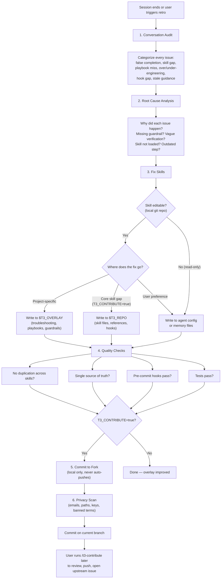

# Retro — Retrospective & Skill Improvement

## References

- [Compound Engineering](https://every.to/guides/compound-engineering) — Avery Pennarun

## Dependencies

Core: None — standalone. Works best after other lifecycle skills but has no hard dependencies.

Optional: If `T3_REVIEW_SKILL` is configured (e.g., `ac-reviewing-skills`), retro recommends running it after skill modifications for deeper architectural quality assurance. Retro is lightweight and tactical; the review skill is methodical and systematic.

## Configuration

Retro's behavior depends on these `~/.teatree` variables:

- **`T3_OVERLAY`** — path to the project overlay skill. If set, retro writes project-specific improvements here. If empty, retro writes to the nearest agent memory/config fallback, such as the repo-level agent instructions file or the user's agent memory/config file.
- **`T3_CONTRIBUTE`** — `false` (default) or `true`:
  - `false`: only improve the overlay. Core skill gaps are noted in conversation but not acted on.
  - `true`: also improve core skills in the user's fork at `$T3_REPO`. Retro creates a local commit but **never pushes automatically**. Use `/t3-contribute` to review and push when ready.
- **`T3_PUSH`** — `false` (default) or `true`. When `false`, retro never asks about pushing — it only commits locally and reminds the user to run `/t3-contribute` later. Set to `true` to be prompted about pushing after each retro commit.
- **`T3_UPSTREAM`** — upstream GitHub repo (e.g., `souliane/teatree`). Used by `/t3-contribute` to open issues upstream after pushing. When `origin` matches `T3_UPSTREAM`, pushes already land directly on upstream.
- **`T3_PRIVACY`** — privacy check strictness: `strict` (default) or `relaxed`. See § Privacy Scan.
- **`T3_REVIEW_SKILL`** — name of an external skill review tool (e.g., `ac-reviewing-skills`). If set, retro recommends running it after skill improvements. If not set, retro suggests installing one during first run and storing the preference.

### Agent Compatibility

Retro is agent-platform neutral. The workflow, `~/.teatree` variables, and teatree slash commands stay the same across platforms.

- Platform-specific files and commands remain valid where documented.
- Prefer the closest equivalent repo-level instructions file plus any user-level agent config or memory file available in the environment.
- When this skill mentions repo instructions or memory files, treat them as examples of agent config/memory locations, not the only supported targets.

Systematic review of the current conversation to extract failures, near-misses, and lessons learned, then improve the skill system so they never recur.

**When to run (proactively — do NOT wait for the user to ask):**

- User types `/t3-retro`
- End of a non-trivial work session (multi-file, multi-repo, or multi-hour) — **self-trigger this**
- After discovering that "done" wasn't actually done
- After a failure mode that existing skills didn't prevent
- **Before context compaction** — if the conversation is getting long, run retro first to capture lessons before they're lost to compression

### Pre-Compaction Persistence (Non-Negotiable)

If retro is in progress when compaction is imminent (long conversation, many tool calls), **write findings to a temporary file immediately** before they are lost:

```bash
cat > /tmp/retro-$(date +%Y%m%d-%H%M).md <<'EOF'
# Retro Findings (pre-compaction snapshot)
<paste categorized findings here>
EOF
```

After compaction, read the temp file to resume. This prevents the most common retro failure: findings identified but lost to context compression before being written to durable skill files.

## Scope & Editability

Retro works from **any conversation** — not just teatree-managed projects. It identifies which skills were used in the session and determines where improvements should go.

### 1. Identify used skills

Scan the conversation for loaded skills (skill tool invocations, system reminders mentioning skills, explicit `/skill` calls). Build a list of every skill that influenced the session.

### 2. Check editability

For each skill, resolve its real path (follow symlinks) and check whether it lives in a git repository:

```bash
real_path=$(readlink -f "<skill_dir>")
git -C "$real_path" rev-parse --git-dir >/dev/null 2>&1 && echo "editable" || echo "read-only"
```

| Editability | Where to write improvements |
|---|---|
| **Editable** (symlink → local git repo) | Improve the skill files directly (following the write rules in § Fix Skills) |
| **Read-only** (no git repo, installed copy, or remote-only) | Write to the best available fallback: repo-level agent instructions, user-level agent config, or user memory files. Choose whichever is closest to the point of use. |

When writing to fallback locations, clearly mark the entry as originating from a retro finding: include the skill name and a brief rationale so the entry can be promoted to the skill later if it becomes editable.

### 3. Ask when unsure

If you can't determine whether a skill is editable, or if you're unsure whether an improvement belongs in the skill vs. the agent config vs. memory — **ask the user**. Retro is meta-work; human-in-the-loop is expected.

## Persistence First (Non-Negotiable)

Retro is not complete until every confirmed finding is written to a durable home in the same retro pass. Conversation output is not durable storage.

- If a finding is project-specific, write it to the overlay or repo-level agent config now.
- If a finding is cross-project and editable, write it to the skill or reference file now.
- If a finding is environment- or user-specific, write it to the appropriate agent config/memory location now.
- If a helper script was required to diagnose or fix a recurring issue, save the script path and purpose in the durable docs so the next run does not start from scratch.
- Never end retro with “remember this later” or “note this in the summary” as the only persistence mechanism.

**Retro output must include a persistence summary**:

- what was learned
- where it was saved
- any helper scripts created or reused
- what still requires human follow-up, if anything

## Fastest Reliable Tool

Retro should optimize for **speed with repeatability**. Use AI for judgment and synthesis; use scripts for deterministic evidence gathering and bulk transformations.

### Use shell/Python when

- collecting file lists, diffs, paths, commit metadata, or editability status
- scanning many files for duplicate guidance or stale rules
- extracting structured evidence from logs, PDFs, JSON, test output, or config
- generating repeatable summaries from mechanical data
- applying the same transformation across multiple files or validating a repeated invariant

### Use AI when

- classifying failures and root causes
- deciding the canonical destination for a finding
- rewriting guidance concisely without losing meaning
- merging overlapping rules into a single source of truth
- choosing the smallest durable fix that prevents recurrence

### Decision rule

- **Deterministic and repetitive**: prefer shell/Python.
- **Ambiguous, semantic, or judgment-heavy**: prefer AI.
- **Likely to recur twice**: save or update a helper script/reference instead of relying on manual re-analysis.
- **Single one-line wording fix**: edit directly; do not build automation for trivia.

## Workflow



### 1. Conversation Audit

Review the full conversation and categorize every issue:

| Category | Description | Example |
|---|---|---|
| **False completion** | Claimed "done" without verifying all requirements | Declared feature complete without running the full test suite |
| **Skill not loaded** | A relevant skill existed but wasn't loaded | Didn't load the project overlay skill when working in project context |
| **Playbook not consulted** | A playbook covered the task but wasn't read | Didn't check the relevant playbook for the translation checklist |
| **Over-engineering** | Did unnecessary work because of wrong assumptions | Planned enum/migration/serializer changes when admin config sufficed |
| **Under-engineering** | Missed required work | Only updated the backend without the corresponding frontend changes |
| **Hook gap** | Auto-loading didn't trigger when it should have | Hook didn't suggest project overlay in matching context |
| **Stale guidance** | Followed outdated instructions | Playbook described pre-refactoring patterns |

### 2. Root Cause Analysis

For each issue, determine **why** it happened:

- Missing guardrail in a skill/playbook?
- Existing guardrail not specific enough?
- Skill not loaded (hook gap)?
- Verification step missing or too vague?
- Playbook outdated after codebase evolution?

### 3. Fix Skills

**Pre-write editability check (Non-Negotiable):** Before writing to ANY skill, verify it is editable (see § Scope & Editability). For teatree-specific paths:

```bash
# Check overlay (only when T3_OVERLAY is set — empty means standalone mode)
[ -z "$T3_OVERLAY" ] || git -C "$T3_OVERLAY" rev-parse --git-dir >/dev/null 2>&1 || echo "STOP: overlay is not a git repo"

# Check core (when T3_CONTRIBUTE=true)
git -C "$T3_REPO" rev-parse --git-dir >/dev/null 2>&1 || echo "STOP: T3_REPO is not a git repo"
```

If a skill is not editable (no local git repo), write improvements to the best fallback location — repo-level agent instructions, user config, or memory files. See § Scope & Editability for the full decision table. In standalone mode (`T3_OVERLAY` empty), skip the overlay check.

**Determine the target** based on `T3_CONTRIBUTE` and the nature of the fix:

#### Always: project overlay improvements (`$T3_OVERLAY`)

These go to the overlay regardless of contribution level:

| What to fix | Where to write | Format |
|---|---|---|
| Non-obvious fix or recurring failure | `$T3_OVERLAY/references/troubleshooting.md` | symptom -> root cause -> fix -> prevention |
| New repeatable multi-step pattern | `$T3_OVERLAY/references/playbooks/<topic>.md` + update `README.md` | step-by-step guide |
| Outdated playbook step | Update the overlay playbook directly | delete/replace stale instructions |
| "Do this, not that" guardrail | `$T3_OVERLAY/references/playbooks/archive-derived-guardrails.md` | do this / not that pair |

#### When `T3_CONTRIBUTE=false` (default)

**Do NOT modify files under `$T3_REPO`.** If you detect a gap in a core skill, note it in conversation output so the user is aware, but take no action on core files.

#### When `T3_CONTRIBUTE=true`

Retro can also modify core teatree skills in the user's fork:

| What to fix | Where to write |
|---|---|
| Infrastructure/worktree failure | `$T3_REPO/references/troubleshooting.md` |
| Hook should have triggered | `$T3_REPO/integrations/.../ensure-skills-loaded.sh` |
| Missing verification step | The core skill that owns that workflow phase |
| Stale or incorrect guidance in a core skill | The affected `t3-*/SKILL.md` or reference file |

**After modifying core skills:** follow § Commit to Fork.

### 4. Quality Rules (Non-Negotiable)

- **Ask when ambiguous (Non-Negotiable).** Retro involves design decisions (what to promote, where to put it, which repos to touch). When a choice has multiple valid options or the scope is unclear, **stop and ask the user**. Do not assume. Daily coding workflows can be autonomous; meta-work (retro, review, skill editing) requires human-in-the-loop.
- **No duplication.** Before writing, search all skills for existing coverage. Merge into existing sections.
- **Single source of truth.** Each piece of guidance lives in exactly one place. Other skills reference it.
- **Skills ≠ repo config.** Do not duplicate rules from a repo's agent instruction files into skill files. Reference the repo file instead. If the skill adds extra detail (rationale, examples, edge cases), write the detail in the skill and reference the repo file for the base rule. Duplication is tolerated ONLY when fully acknowledged — mark it with `(Source: AGENTS.md § <section>)` or equivalent. A duplicate without a reference is a duplication bug that will drift silently.
- **Be concise.** Include exact error messages and symptoms for searchability. No verbose explanations.
- **Include prevention.** Every troubleshooting entry must say how to avoid the issue, not just how to fix it.
- **Save findings immediately.** The durable write happens during the retro, not after it and not “next time”.
- **Never change `version:`** in YAML frontmatter — that's auto-managed.
- **Respect content publication status.** Blog posts and articles with `draft: false` in frontmatter are published — never modify them. Draft content (`draft: true` or no frontmatter) may be improved.
- **Defer structural changes to review skill.** When your fixes involve merging, splitting, or restructuring skills, suggest running the review skill first — retro is tactical; the review skill provides systematic analysis before structural changes.
- **Skills over personal config (Non-Negotiable).** When fixing an issue, always prefer updating **skill files** (`SKILL.md`, `references/`) over writing to user-specific config (the agent's personal config and memory files). Skills benefit ALL users; personal config only helps one machine. Memory/config files are only for: user preferences (formatting, tone), environment-specific facts (paths, usernames, credentials), and user-specific workflow choices. Guardrails, troubleshooting, patterns, and "do this not that" rules belong in skills. **Checklist before writing to memory/config:** "Would another user of these skills need this too?" — if yes, put it in a skill.
- **Scan personal config for promotable entries.** During every retro, read the agent's memory and personal config files. Any entry that encodes a guardrail, pattern, or "do this not that" rule (not a user preference or env-specific fact) should be **promoted to the appropriate skill file**. However, always-loaded agent config/memory files serve as a safety net — critical guardrails that are already in skills may still deserve a one-line reminder there, because skills are only available when loaded. When keeping a duplicate, mark it clearly as "Safety net — source: `<skill> § <section>`" to prevent drift. Only fully remove entries that are truly redundant (pure cross-references with no actionable content).
- **Prefer deterministic helpers over repeated manual work.** If the same audit or extraction step is likely to recur, capture it in a shell/Python helper or reusable command snippet and document where it lives.

### 5. Playbook Lifecycle

**WHEN to create a new playbook:**

- A ticket required 4+ files across 2+ repos with a repeatable pattern
- A new integration point was discovered (webhook, API, document pipeline)

**WHEN to update an existing playbook:**

- A step was missing or wrong, discovered during implementation
- The codebase evolved and a step is now unnecessary (e.g., config-driven instead of code-driven)

**WHERE to create playbooks:**

- `<project-skill>/references/playbooks/<scope>-<topic>.md`
- Scope prefixes: `<project>-` (backend), `frontend-` (frontend), `cross-repo-` (multi-repo), none (process)
- **After creating/updating:** update the playbook `README.md` index with the new entry

**Playbook staleness check:** Before following any playbook, verify instructions against current code. If the codebase has moved to a config-driven approach or the referenced pattern no longer exists, the playbook is stale — fix it immediately.

### 6. Verification

After applying all fixes:

- Run `pre-commit run --all-files` (or the repo's equivalent) to validate
- **Smoke test changed scripts** — if shell scripts or hook scripts were modified, run them end-to-end (linting alone does not catch runtime failures like Bash version incompatibility or platform-specific commands)
- Verify no duplicate guidance across skills
- Confirm updated playbooks match current codebase reality
- Verify that every confirmed finding from the audit was saved to a durable location
- If helper scripts were created or reused for recurring work, verify their paths and usage are recorded in the relevant durable docs
- **Definition of Done check:** Re-run the conversation audit (§ 1) on your own changes. If the re-run produces new findings, you are not done — fix them before claiming completion. See [`../references/agent-rules.md`](../references/agent-rules.md) § "Definition of Done".
- **No “conversation-only” findings.** If a lesson exists only in the final response and not in a file, retro is not done.
- **Commit before declaring done (Non-Negotiable).** After completing all retro changes, commit them immediately before declaring done. Never declare "done" with uncommitted skill modifications — this is the most common retro failure mode.

## Commit to Fork (`T3_CONTRIBUTE=true`) — Automatic

When `T3_CONTRIBUTE=true` and retro modified files under `$T3_REPO`, **proceed to commit automatically** — do not wait for the user to ask. The commit is local-only (never pushes), so it is safe to create without confirmation. This ensures improvements are captured immediately rather than forgotten.

### Pre-Flight Checks (all must pass)

1. **Repo is a full clone:** `git -C "$T3_REPO" rev-parse --is-shallow-repository` → `false`
2. **Pre-commit passes:** `cd "$T3_REPO" && prek run --all-files` — if it fails, fix first.
3. **All tests pass:** `cd "$T3_REPO" && uv run pytest` — must be green.
4. **Privacy scan passes:** see § Privacy Scan.

### Commit (No Push)

Commit directly on the **current branch** — do not create a dedicated `retro/` branch. Retro commits are small, incremental improvements that belong on the working branch.

```bash
cd "$T3_REPO"
git add <changed files>
git commit -m "fix(<skill>): <what was learned>"
```

### After Committing

**Always inform the user:**

```text
════════════════════════════════════════════════════════════════
  SKILL IMPROVEMENT COMMITTED (not pushed)

  Branch: <current-branch>
  Commit: <hash> — fix(<skill>): <what was learned>

  To review and push, run: /t3-contribute
  Do NOT use "git push" directly — /t3-contribute handles
  push confirmation, upstream issues, and divergence checks.
════════════════════════════════════════════════════════════════
```

**If `T3_PUSH=false` (default):** stop here, do not ask about pushing.

**If `T3_PUSH=true`:** ask the user if they'd like to push now. If they say yes, load `/t3-contribute` and run it. If they decline, remind them to run `/t3-contribute` later.

## Privacy Scan

Before committing to the fork or creating an upstream issue, scan all changed content for personal information.

### What to scan

1. **Git diff** of all changes about to be committed
2. **Issue body** (if creating an upstream issue)
3. **Branch name** (should not contain personal identifiers)

### What to flag

| Pattern | Examples | Action |
|---|---|---|
| Email addresses | `user@company.com` | Block — replace with `user@example.com` or remove |
| Home directory paths | `/Users/jane/`, `/home/bob/` | Block — replace with `$HOME/` or `~/` |
| Internal hostnames/IPs | `10.0.0.5`, `gitlab.internal.corp` | Block — replace with `example.com` or remove |
| API keys / tokens | `glpat-...`, `sk-...`, `ghp_...` | Block — remove entirely |
| Company / project names | Anything in `$T3_BANNED_TERMS` | Block — replace with generic terms |
| Usernames / personal names | Git author info, Slack handles | Block in issue body (OK in git commits on fork) |

### `T3_PRIVACY` levels

- **`strict`** (default): Block on ANY flagged pattern. Require user to manually resolve each one before proceeding.
- **`relaxed`**: Warn on flagged patterns but allow the user to proceed after confirmation. Git author info and home paths are auto-replaced silently.

When `T3_PRIVACY` is not set, default to `strict`.

## What NOT to Do

- Do not create a new playbook for a one-off fix. Only document repeatable patterns.
- Do not scatter the same guidance across multiple skills. Pick one home and reference it.
- Do not copy repo agent-instruction rules into skills. Reference the repo file; add detail in the skill only with a clear source attribution.
- Do not add verbose explanations. Concise symptoms + fixes are more searchable.
- Do not skip the conversation audit. The point is to catch ALL issues, not just the obvious one.
- Do not update skills speculatively. Only document confirmed patterns from actual failures.
- Do not push retro commits directly. Always use `/t3-contribute` for push + upstream issue creation.

### 7. Clean Personal Config

During every retro, scan the agent's personal config and memory files:

1. **Promote to skills:** Any guardrail, pattern, or "do this not that" entry that would help other users → move to the appropriate skill file. Leave a one-line safety-net reminder if the rule is critical enough to need early loading.
2. **Scan for promotable entries:** Read the agent's personal config and memory files (for example the repo-level instructions file plus user-level agent memory/config files) for entries marked `(Also in: ...)` or containing domain knowledge that belongs in a skill file. Propose promoting them — the `(Also in: ...)` marker indicates the entry was intentionally duplicated as a safety net, but the authoritative source should be verified and kept current.
3. **Remove stale entries:** If a memory entry references old paths, deleted features, or outdated patterns — update or remove it.
4. **Deduplicate:** If the same rule appears in both a skill AND memory/config, verify the skill version is current, then trim the config copy to a one-line reference.

### 8. Recommend Review Skill

If `T3_REVIEW_SKILL` is configured and skill files were modified during this retro:

1. Suggest running the review skill (a systematic multi-phase audit for deeper quality assurance) on the changed skills (e.g., `/$T3_REVIEW_SKILL`).
2. If `T3_REVIEW_SKILL` is NOT configured, include this note in the retro output: "Consider installing a skill review tool for periodic deep quality audits. Set `T3_REVIEW_SKILL` in `~/.teatree` to enable integration."
