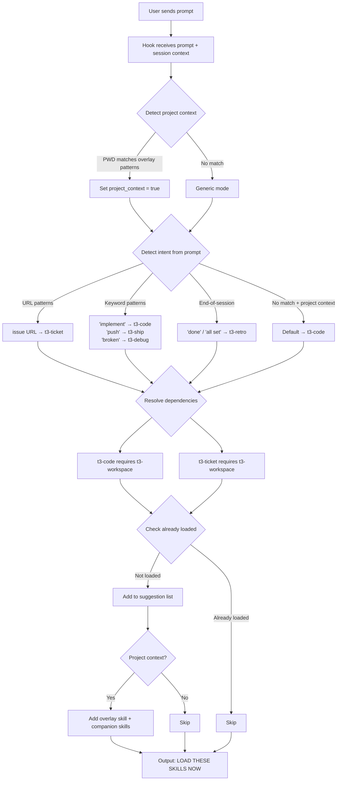

# Teatree Skills — Interactive Setup Wizard

Self-contained setup for the teatree skills system. Run each check in order and report results to the user as you go. Stop at the first failure and help fix it before continuing.

## Dependencies

None — this is the bootstrapping skill. Do NOT suggest loading `t3-workspace` or any other skill.

## Configuration File: `~/.teatree`

Teatree uses a single config file at `~/.teatree` to store user-specific settings. This file is a simple `KEY=VALUE` shell file (sourceable from `.zshrc`).

**Required variables:**

| Variable | Purpose | Example |
|----------|---------|---------|
| `T3_REPO` | Path to the teatree repo clone | `$HOME/workspace/teatree` |
| `T3_WORKSPACE_DIR` | Root workspace directory | `$HOME/workspace` |

**Platform variables:**

| Variable | Purpose | Values | Default |
|----------|---------|--------|---------|
| `T3_ISSUE_TRACKER` | Issue/MR platform | `gitlab`, `github` | Auto-detected from `git remote -v` |
| `T3_CHAT_PLATFORM` | Team chat for review requests | `slack`, `teams`, `none` | `none` |

Skills use these to select the correct platform reference file (e.g., `references/platforms/gitlab.md`). If not set, `t3-setup` auto-detects from git remotes and asks the user to confirm.

**Optional variables:**

| Variable | Purpose | Default |
|----------|---------|---------|
| `T3_OVERLAY` | Path to the project overlay skill | None (standalone mode) |
| `T3_UPSTREAM` | Upstream GitHub repo for contributions | None |
| `T3_CONTRIBUTE` | Self-improvement scope: `false` or `true` | `false` |
| `T3_PUSH` | Enable auto-pushing (prompt to push after retro commits) | `false` |
| `T3_PRIVATE_TESTS` | Path to a private test suite repo (E2E, integration) | None |
| `T3_PRIVACY` | Privacy scan strictness: `strict` or `relaxed` | `strict` |
| `T3_BRANCH_PREFIX` | Prefix for worktree branches | Auto-detected from `git config user.name` initials |
| `T3_BANNED_TERMS` | Comma-separated terms that must never appear in the teatree repo (pre-commit hook) | None |
| `T3_MR_VALIDATE_SCRIPT` | Path to a project-specific MR validation script | None (validation skipped) |
| `T3_REVIEW_SKILL` | Name of an external skill review tool (e.g., `ac-reviewing-skills`) | None |
| `T3_SKILL_OWNERSHIP_FILE` | Path to the skill ownership config file (shared with the review skill) | `$HOME/.ac-reviewing-skills` |
| `T3_FOLLOWUP_CHANNEL` | Team chat channel for periodic followup summaries | None (stdout only) |
| `T3_FOLLOWUP_INTERVAL` | Minimum interval between MR review reminders | `24h` |
| `T3_FOLLOWUP_PURGE_DAYS` | Auto-purge tickets from cache after all MRs merged for N days | `14` |

The setup wizard creates this file interactively.

## Setup Checklist

Run these checks sequentially, reporting pass/fail to the user after each one.

### Step 1: Prerequisites

Verify required tools are installed:

```bash
# Required — all must pass
bash --version | head -1          # Need Bash 5+ (macOS: brew install bash)
python3 --version                 # Need 3.12+
uv --version                     # uv package manager
git --version                    # git
jq --version                    # JSON processing (hooks need this)
which lsof                      # Port checks

# Recommended — warn if missing, don't block
docker --version                 # Docker (for DB provisioning)
docker compose version           # compose plugin
direnv --version                # direnv (auto-loads .env.worktree)
psql --version                  # PostgreSQL client
which createdb dropdb pg_restore # PostgreSQL CLIs

# Optional — inform if missing
which dslr 2>/dev/null           # Fast DB snapshots
which glab 2>/dev/null           # GitLab CLI
which gh 2>/dev/null             # GitHub CLI
```

**Critical (macOS):** the system `/bin/bash` is 3.x. Hooks require Bash 5+ (`brew install bash`). The hook shebangs use `#!/usr/bin/env bash` to pick up the PATH-resolved version.

Report a summary table: tool, required version, found version, pass/fail.

### Step 1b: Platform CLI & Integration Setup

After checking prerequisites, help the user install and configure platform-specific CLIs. **Always prefer CLI over MCP** — CLIs are faster, scriptable, and work in cron jobs.

**Issue tracker CLI (required for t3-followup, t3-ticket, t3-ship):**

| Platform | CLI | Install | Auth |
|----------|-----|---------|------|
| GitLab | `glab` | `brew install glab` (macOS) / [manual](https://gitlab.com/gitlab-org/cli) | `glab auth login` |
| GitHub | `gh` | `brew install gh` (macOS) / [manual](https://cli.github.com) | `gh auth login` |

Verify auth: `glab auth status` or `gh auth status`. If not authenticated, walk the user through the login flow.

**Team chat (recommended for t3-review-request, t3-followup MR reminders):**

| Platform | Preferred | Fallback | Setup |
|----------|-----------|----------|-------|
| Slack | CLI (none available) | MCP server (`claude_ai_Slack`) | See MCP note below |
| Teams | CLI (none available) | MCP server or webhook | Project-specific |

**MCP server setup** — when no CLI exists (e.g., Slack), guide MCP configuration:

1. Check if an MCP server is already configured: inspect `~/.claude/settings.json` for existing MCP entries.
2. If the agent platform supports managed MCP servers (e.g., Claude Code with `claude_ai_Slack`), these require no local setup — they're available via the platform's MCP integration. Verify with: "Do you see Slack tools in your available tools?"
3. For self-hosted MCP servers, guide the user through the server-specific setup docs.

**Note:** MCP servers run in the agent's process — they are NOT available in cron jobs or `--periodic` mode. Periodic followup uses CLI commands only. If a platform has no CLI, periodic mode skips that integration and logs a warning.

### Step 2: Create `~/.teatree`

Ask the user for each required variable. Provide sensible defaults based on the current environment:

```bash
# Detect defaults
default_t3_repo="$(cd "$(dirname "$0")/../.." 2>/dev/null && pwd)" # if running from skill
default_workspace="$HOME/workspace"
```

**Ask one question at a time** (auto-detect defaults, confirm each before moving on):

1. "Where is your teatree repo cloned?" → `T3_REPO` (default: auto-detect or `$HOME/workspace/teatree`)
2. "Where is your workspace root?" → `T3_WORKSPACE_DIR` (default: `$HOME/workspace`)
3. "Branch prefix for worktrees?" → `T3_BRANCH_PREFIX` (default: initials from `git config user.name`)
4. **Platform detection** → `T3_ISSUE_TRACKER` and `T3_CHAT_PLATFORM`:
   - Auto-detect from `git remote -v` in any workspace repo: `gitlab.com` → `gitlab`, `github.com` → `github`.
   - Confirm with the user: "I detected GitLab from your remotes. Is that correct?"
   - Then ask for team chat platform: "Which team chat do you use for review requests?" → `slack`, `teams`, or `none`.
5. "Do you have an existing project overlay skill, or should I scaffold one?" → see Step 2b
6. "Would you like teatree to self-improve over time?" → `T3_CONTRIBUTE`

For question 5, explain the two levels:

- **`false`** (recommended for most users): Improvements only go to your project overlay. Core skills are read-only. Choose this if you just want to use teatree.
- **`true`**: Retro also improves core skills in your fork, commits, and pushes. If `T3_UPSTREAM` is set and your fork's `origin` is a different repo, retro also opens issues on the upstream repo referencing your fork's branch.

**Default to `false`.** Only suggest `true` if the user explicitly expresses interest in contributing.

**Validation when `true`:**

- `$T3_REPO` is a full git clone (not shallow): `git -C "$T3_REPO" rev-parse --is-shallow-repository` must be `false`
- The repo has a push remote: `git -C "$T3_REPO" remote -v` shows a push URL
- If any check fails, warn the user and set `T3_CONTRIBUTE=false`.

**If the user wants to contribute upstream**, also ask:

- `T3_UPSTREAM` (default: `souliane/teatree`)
- `gh` CLI is authenticated: `gh auth status` succeeds
- Verify the fork is public: `gh repo view <fork> --json isPrivate -q '.isPrivate'` → `false`
- If the fork is private, warn: "Your fork must be public for the upstream repo to see your changes. Set it to public on GitHub or leave `T3_UPSTREAM` empty."

7. **Banned terms** → `T3_BANNED_TERMS` in `~/.teatree`:
   Ask the user if there are terms that should never appear in public repos (e.g., internal project codenames, client names). These are enforced by a pre-commit hook that reads from a user-local config file.

   **Important guidance for the user:** banned terms use word-boundary matching (`\b`), so short terms can cause false positives. For example, banning `proj` would also flag `project`. Prefer full, distinctive terms:
   - `my-internal-tool` instead of `internal`
   - `t3-acme` instead of `acme` (if `acme` appears in common words)
   - `client-name-corp` instead of `corp`

   If the user provides terms, set `T3_BANNED_TERMS="term1,term2,term3"` in `~/.teatree`. Other repos that use the same hook point to their own config file (e.g., `~/.skills` with `BANNED_TERMS=`). The hook's `--config` argument in `.pre-commit-config.yaml` specifies which file to read.

   **Never put banned terms in a repo file** — that defeats the purpose by publishing the exact terms you're trying to hide.

8. **Auto-squash** → `T3_AUTO_SQUASH`:
   Ask: "Should the agent automatically squash related unpushed commits before pushing? This keeps git history clean without manual confirmation."
   - `true` — automatically group and squash related unpushed commits by topic (e.g., retro fixes, same-issue fixes). Never rewrites commits already pushed to origin.
   - `false` (default) — suggest squashing and wait for confirmation.

9. **Skill ownership** → `~/.ac-reviewing-skills`:
   Generate the `~/.ac-reviewing-skills` config file with a `MAINTAINED_SKILLS` regex. This file is shared between teatree (`agent-rules.md § Skill Ownership Check`) and the review skill (configured via `T3_REVIEW_SKILL`). Both use it to decide whether a skill can be modified or requires user confirmation.

   **Auto-detection:**

   ```bash
   # Extract distinctive directory names from configured paths
   t3_dir=$(basename "$(readlink -f "$T3_REPO")")       # e.g., "teatree" or "my-fork"
   overlay_parent=""
   if [ -n "$T3_OVERLAY" ]; then
     # Overlay may be nested (e.g., project-skills/internal/my-overlay)
     # Use the repo root, not the overlay subdir
     overlay_repo=$(git -C "$T3_OVERLAY" rev-parse --show-toplevel 2>/dev/null)
     overlay_parent=$(basename "$overlay_repo")           # e.g., "project-skills"
   fi
   ```

   Build the regex from these paths, then ask the user to review:

   - **Core skills** (`$T3_REPO`): always owned by the contributor. Pattern: `<t3_dir>/`
   - **Overlay and siblings** (`$T3_OVERLAY` parent repo): may contain skills from other contributors. List all skill directories under the overlay's repo and ask: "Which of these do you maintain?"

   **Example interaction:**

   ```text
   I detected these skill directories in your overlay repo:
     ✅ my-overlay/      (your overlay — auto-included)
     ❓ team-frontend/   (do you maintain this?)
     ❓ team-backend/    (do you maintain this?)
     ❓ onboarding/      (do you maintain this?)

   Which ones are yours? [enter names or "none"]
   ```

   Write `~/.ac-reviewing-skills` from user answers:

   ```bash
   cat > ~/.ac-reviewing-skills << 'EOF'
   # Skill ownership configuration
   # Loaded by the review skill (hardcoded path) and teatree (via T3_SKILL_OWNERSHIP_FILE)

   # Regex matched against resolved skill paths.
   # Skills whose real path matches are owned by the user and can be modified.
   # Non-matching skills require explicit user confirmation before modification.
   MAINTAINED_SKILLS="<auto-generated regex>"
   EOF
   ```

   Example for a contributor with `T3_REPO=~/workspace/teatree`, personal skills in `jdoe/skills`, and overlay in `project-skills/internal/my-overlay`:

   ```text
   MAINTAINED_SKILLS="teatree/|jdoe/skills/|project-skills/internal/(my-overlay/|onboarding/)"
   ```

   Then set `T3_SKILL_OWNERSHIP_FILE="$HOME/.ac-reviewing-skills"` in `~/.teatree`.

   **If `~/.ac-reviewing-skills` is not created**, both teatree and the review skill fall back to asking the user for any skill outside `$T3_REPO` and `$T3_OVERLAY`.

10. **Companion skill installation:**
   Based on the project's framework (detected from overlay scaffolding or user answers), suggest relevant companion skills. These are NOT teatree core skills — they are optional framework/language skills from external repos (e.g., `souliane/skills`):

- **Django projects:** suggest `ac-django` and `ac-python`
- **Python (non-Django):** suggest `ac-python`
- **Angular/React/Vue:** suggest relevant frontend convention skills if available

   **Pre-install check (Non-Negotiable):** Before installing any companion skill, check whether it already exists:

   ```bash
   for skill in <suggested-skills>; do
     target="$HOME/.agents/skills/$skill"
     if [ -L "$target" ]; then
       echo "SKIP  $skill — already installed (symlink → $(readlink "$target"))"
     elif [ -d "$target" ]; then
       echo "WARN  $skill — exists as a copy (not symlink). Skipping to avoid data loss."
     else
       echo "INSTALL  $skill — not found"
     fi
   done
   ```

   **Never overwrite existing symlinks.** A symlink typically points to a git-cloned repo where the user maintains the skill. Overwriting it with `npx skills add` would replace the symlink with a static copy, silently breaking the git workflow.

   **Install missing skills** in consumer mode using `npx skills add`:

   ```bash
   npx skills add <git-remote-or-local-path> --skill <skill-name> -g -y
   ```

   Let `npx skills add` auto-detect the current runtime when possible. If the user wants one command to install into multiple runtimes at once, pass them explicitly with `--agent claude-code codex cursor github-copilot`.

   Available companion skills by stack:

   | Stack | Skill(s) | Source |
   |-------|----------|--------|
   | Django | `ac-django`, `ac-python` | `souliane/skills` |
   | FastAPI | `fastapi-expert` | `Jeffallan/claude-skills` |
   | Python (generic) | `ac-python` | `souliane/skills` |
   | Angular | `angular-skills` | `analogjs/angular-skills` |

   Install from their respective repos:

   ```bash
   # Django/Python stack
   npx skills add souliane/skills --skill ac-django --skill ac-python -g -y

   # Angular frontend
   npx skills add analogjs/angular-skills --skill angular-skills -g -y

   # FastAPI backend
   npx skills add Jeffallan/claude-skills --skill fastapi-expert -g -y
   ```

   **After installation**, configure the overlay's `hook-config/context-match.yml` `companion_skills` section so teatree auto-loads them when relevant:

   ```yaml
   companion_skills:
     ac-django:
       - "<backend-repo>"
     ac-python:
       - "<backend-repo>"
     angular-skills:
       - "<frontend-repo>"
   ```

   This is how teatree "remembers" companion skills — not through installation state, but through the overlay config. The `companion_skills` config controls **auto-loading** (the hook suggests these skills when the user works in matching directories). Installation state lives in the agent runtime skill directories. Both are needed: the skill must be installed AND configured in `companion_skills` for seamless auto-loading.

Write the config file:

```bash
cat > ~/.teatree << 'EOF'
# teatree configuration — sourced by .zshrc and teatree scripts
T3_REPO="<value>"
T3_WORKSPACE_DIR="<value>"
T3_BRANCH_PREFIX="<value>"
T3_ISSUE_TRACKER="<gitlab|github>"
T3_CHAT_PLATFORM="<slack|teams|none>"
T3_OVERLAY="<value or empty>"
T3_UPSTREAM="<value or empty>"
T3_CONTRIBUTE=false
T3_SKILL_OWNERSHIP_FILE="$HOME/.ac-reviewing-skills"
T3_PUSH=false
T3_PRIVATE_TESTS=""
T3_PRIVACY=strict
EOF
```

### Step 2a: `.python-version` Check

Check if the workspace has a `.python-version` file (used by pyenv/uv to pin the Python version):

```bash
cat "$T3_WORKSPACE_DIR/.python-version" 2>/dev/null || echo "not found"
python3 --version
```

**If `.python-version` exists:** verify it matches the installed Python. If it doesn't, warn the user — version mismatch causes venv creation failures and confusing import errors.

**If `.python-version` doesn't exist:** ask the user if they want to create one. Recommend pinning to the major.minor version they have installed (e.g., `3.12`). Note: `.python-version` should NOT be committed to teatree itself (it's user-specific), but it's useful in the workspace root or in project repos.

### Step 2b: Project Overlay Setup

**Option A — Existing overlay:** Ask for the path, verify `SKILL.md` exists there, set `T3_OVERLAY`.

**Option B — Scaffold a new overlay:** Ask the user:

1. "What's your project name?" (e.g., `acme`) → used for directory and skill naming
2. "Which repos does your project use?" (e.g., `acme-backend acme-frontend`) → list of repo names
3. "What's your backend framework?" (e.g., Django, Rails, Express, none)

Then scaffold the overlay:

```text
$T3_WORKSPACE_DIR/<project-name>-overlay/
├── SKILL.md                    # Skill description + dependency on teatree
├── scripts/
│   └── lib/
│       ├── bootstrap.sh        # Shell wrappers (sources after teatree)
│       └── project_hooks.py    # Extension point overrides (register at 'project' layer)
└── references/
    ├── troubleshooting.md      # Project-specific troubleshooting
    ├── upstream-suggestions.md # Logged suggestions for teatree core improvements
    └── playbooks/
        └── README.md           # Playbook index
```

The scaffolded `SKILL.md` should include:

- YAML frontmatter with project name and description
- Dependencies section pointing to teatree lifecycle skills
- Loading order (teatree bootstrap → overlay bootstrap)
- Placeholder sections for project-specific rules

The scaffolded `project_hooks.py` should include:

- Skeleton `register_project()` function
- Commented-out examples of extension point overrides for the user's framework
- Import of `lib.registry.register`

The scaffolded `bootstrap.sh` should include:

- Guard that teatree was sourced first (`_T3_SCRIPTS_DIR` check)
- `_OVERLAY_SCRIPTS_DIR` export
- Placeholder wrapper functions

After scaffolding, set `T3_OVERLAY` in `~/.teatree` and run `scripts/install_skills.sh` to symlink the overlay in contributor mode.

**Option C — Skip for now:** Leave `T3_OVERLAY` empty. Teatree works standalone — the user can add an overlay later.

**After overlay setup:** If a project overlay is configured, add the sourcing line to the shell config instructions in Step 3:

```bash
source "$T3_OVERLAY/scripts/lib/bootstrap.sh"   # project overlay
```

### Step 3: Shell Config

Detect the user's shell (`$SHELL`) and configure accordingly:

- **zsh:** edit `~/.zshrc`
- **bash:** edit `~/.bashrc`

Both are supported — all teatree scripts use `#!/usr/bin/env bash` and the shell helpers detect `$ZSH_VERSION` vs `$BASH_VERSION` automatically.

Check that these lines exist in the shell config:

```bash
# For zsh:
grep -n 'teatree\|T3_REPO' ~/.zshrc
# For bash:
grep -n 'teatree\|T3_REPO' ~/.bashrc
```

**Expected (in this order):**

```bash
source ~/.teatree                                    # load config
export T3_REPO T3_WORKSPACE_DIR T3_BRANCH_PREFIX T3_ISSUE_TRACKER T3_CHAT_PLATFORM T3_OVERLAY T3_UPSTREAM T3_CONTRIBUTE T3_PUSH T3_PRIVATE_TESTS T3_PRIVACY T3_SKILL_OWNERSHIP_FILE  # export
source "$T3_REPO/scripts/lib/bootstrap.sh"           # teatree core functions
[[ -n "$T3_OVERLAY" && -f "$T3_OVERLAY/scripts/lib/bootstrap.sh" ]] && \
  source "$T3_OVERLAY/scripts/lib/bootstrap.sh"      # project overlay (if configured)
```

If missing, tell the user exactly what to add. After adding, they need `source ~/.zshrc` (or `~/.bashrc`) or a new terminal.

**Verify functions are available:**

```bash
type t3_ticket 2>/dev/null && echo "OK  t3_ticket" || echo "MISSING  t3_ticket"
type t3_setup 2>/dev/null && echo "OK  t3_setup" || echo "MISSING  t3_setup"
type t3_finalize 2>/dev/null && echo "OK  t3_finalize" || echo "MISSING  t3_finalize"
```

### Step 4: Skill Symlinks

Install skills and verify:

```bash
"$T3_REPO/scripts/install_skills.sh"
```

Verify the symlink chain:

```bash
for skill_md in "$T3_REPO"/t3-*/SKILL.md; do
    skill=$(basename "$(dirname "$skill_md")")
    found=false
    for root in "$HOME/.claude/skills" "$HOME/.codex/skills" "$HOME/.cursor/skills" "$HOME/.copilot/skills" "$HOME/.agents/skills"; do
        target="$root/$skill"
        if [ -L "$target" ]; then
            echo "OK  $skill -> $(readlink "$target")"
            found=true
        fi
    done
    $found || echo "MISSING  $skill"
done
```

**Contributor mode extra check** (`T3_CONTRIBUTE=true`): verify that symlinks point into a git repository, not a stale copy. This ensures retro commits land in a real clone:

```bash
for target in "$HOME/.claude/skills"/t3-*; do
    [ -L "$target" ] || continue
    resolved=$(readlink "$target")
    if git -C "$resolved" rev-parse --git-dir >/dev/null 2>&1; then
        echo "OK  $target -> git repo"
    else
        echo "WARN  $target -> NOT a git repo (retro commits won't work)"
    fi
done
```

### Step 4b: Third-Party Skill Installation

There are only two install modes:

- **Consumer mode** — use `npx skills add` for skills you want to consume as-is.
- **Contributor mode** — clone the repo you want to improve and wire the agent runtime directly to that clone, either with a repo-local installer script or manual symlinks.

If the user has additional skills from external repos (not teatree core), consumer mode uses `npx skills add`:

```bash
npx skills add <git-remote-or-local-path> --skill <name> -g -y
```

Let `npx skills add` auto-detect the current runtime when possible. If the user wants one command to target multiple runtimes at once, pass them explicitly with `--agent claude-code codex cursor github-copilot`.

**`npx skills add` manages an installed copy or managed symlink tree — it does NOT point at your live git clone.** This means:

- Edits in the source repo are NOT reflected in the installed skill.
- Running `npx skills add` on a skill that was previously wired in contributor mode can replace that live symlink setup with a managed install, silently breaking the git workflow.

**When to use `npx skills add`:**

- You are a **consumer** — you want to use the skill as-is, without editing the source.
- The skill comes from a remote repo you don't maintain.

**When to use contributor mode instead:**

- You are a **contributor** — you cloned the skill repo and want edits to take effect immediately.
- You want retro/review improvements to land in a git-tracked directory.
- Use a repo-local installer script if the repo ships one, otherwise create manual symlinks to the cloned repo.

**Bulletproofing checklist after `npx skills add`:**

1. **Verify contributor-mode links were not overwritten.** Check the runtime skill dir you care about (`~/.claude/skills/<name>`, `~/.codex/skills/<name>`, `~/.cursor/skills/<name>`, `~/.copilot/skills/<name>`, or `~/.agents/skills/<name>`). If you expected a live symlink into a clone and see a managed copy or a different target, restore the symlink to the clone.
2. **Check for collisions.** If a skill name matches an existing teatree skill (e.g., both repos have `t3-code`), the last install wins. Avoid name collisions — project skills should use a distinct prefix.
3. **Verify the resolved target.** The active runtime entry should resolve either to the managed install created by `npx skills add` or to your live clone in contributor mode. Do not assume a specific two-hop chain.

### Step 5: Claude Code Hooks (`~/.claude/settings.json`)

The auto-loading hook is the glue that makes skills load at the right time without the user having to remember:



Read the settings file and verify all hooks + statusline are configured:

```bash
cat ~/.claude/settings.json 2>/dev/null || echo "{}"
```

**Required hooks** — replace paths with the user's actual `$T3_REPO` value:

| Hook | Script | Purpose |
|------|--------|---------|
| UserPromptSubmit | `$T3_REPO/integrations/claude-code-statusline/ensure-skills-loaded.sh` | Auto-detects intent and suggests lifecycle skills |
| PreToolUse (Bash) | `$T3_REPO/integrations/claude-code-statusline/validate-mr-metadata.sh` | Validates MR title/description before creation |
| PostToolUse (files) | `$T3_REPO/integrations/claude-code-statusline/track-active-repo.sh` | Tracks active repos for statusline |
| PostToolUse (skills) | `$T3_REPO/integrations/claude-code-statusline/track-skill-usage.sh` | Tracks loaded skills for statusline |
| statusLine | `$T3_REPO/integrations/claude-code-statusline/statusline-command.sh` | Shows tickets, repos, dirty state, loaded skills |

Show the user the JSON block with their actual `T3_REPO` path substituted. **Do NOT edit `~/.claude/settings.json` without explicit user consent.**

### Step 5b: Clean Stale Symlinks

Remove broken skill symlinks left behind by renamed or deleted skills:

```bash
for link in "$HOME/.claude/skills"/t3-*; do
    [ -L "$link" ] || continue
    if [ ! -e "$link" ]; then
        echo "BROKEN: $link -> $(readlink "$link")"
        rm "$link"
        echo "  Removed."
    fi
done
```

### Step 6: Claude Code Instructions (`~/.claude/CLAUDE.md`)

Check that the skill-loading block exists with the **correct, forceful wording**:

```bash
grep -c "BLOCKING REQUIREMENT" ~/.claude/CLAUDE.md 2>/dev/null
```

**Required block** (must contain "BLOCKING REQUIREMENT" — weaker wording like "Suggested" or "MANDATORY" is insufficient, the LLM ignores it):

```markdown
## BLOCKING REQUIREMENT: Load Skills Before ANY Work

**This is non-negotiable. Violating this rule wastes hours of user time and tokens.**

On EVERY user prompt, BEFORE doing anything else:

1. **Read the UserPromptSubmit hook output** (appears as system-reminder). It tells you which skills to load.
2. **Call the Skill tool** for EACH suggested skill. Do this FIRST, before reading files, running commands, or responding.
3. **If the hook doesn't fire**, pick the right skill yourself from this list:

| Skill | When to load |
|-------|-------------|
| `/t3-ticket` | Starting work on a new ticket, fetching context |
| `/t3-workspace` | Worktree creation, setup, servers, DB, cleanup |
| `/t3-code` | Implementing features, writing code |
| `/t3-debug` | Troubleshooting, fixing errors |
| `/t3-test` | Running tests, E2E, CI, QA, test plans |
| `/t3-review` | Code review (self-review, giving, receiving) |
| `/t3-review-request` | Requesting human review, batch MR notifications |
| `/t3-ship` | Committing, pushing, creating MR, pipeline |
| `/t3-retro` | Retrospective, skill improvement, lessons learned |
| `/t3-followup` | Daily follow-up, batch tickets, status checks, MR reminders |
| `/t3-contribute` | Push skill improvements to fork, open upstream issues |

4. **When a project overlay is loaded**, ALSO load the lifecycle skill for the current phase.
5. **Skills contain the procedures you MUST follow.** Without them you will improvise, fail, and waste hours.

**2-minute troubleshooting time-box (Non-Negotiable):** If environment setup or test execution hits unexpected errors, do NOT spend more than 2 minutes troubleshooting. Instead: stop, check the loaded skills for documented solutions, and if not found, ask the user with specific details.
```

If missing or using old wording ("Follow Hook Skill Suggestions"), show the corrected block and tell the user to replace it. Do NOT edit without consent.

#### Step 6b: Commit Preferences

Ask the user about commit message preferences that override agent defaults:

1. **Co-Authored-By trailers:** "Do you want AI-generated commits to include a `Co-Authored-By` trailer? (most agents add one by default)"

If the user says **no**, ensure the global agent config contains the rule. Check first:

```bash
grep -c "Co-Authored-By" ~/.claude/CLAUDE.md 2>/dev/null
```

If missing, show the block and ask to add it:

```markdown
## No Co-Authored-By in Commits (Non-Negotiable)

**NEVER** add `Co-Authored-By` trailers to git commit messages. This applies to ALL repos, ALL commits.
```

If the user says **yes** (or wants to keep the default), no action needed — agents add it by default.

**Do NOT edit without explicit user consent.** Show the proposed change and let the user approve.

### Step 7: Smoke Test

```bash
# 1. Hook script parses
bash -n "$T3_REPO/integrations/claude-code-statusline/ensure-skills-loaded.sh" && echo "OK  Hook parses"

# 2. Statusline runs
"$T3_REPO/integrations/claude-code-statusline/statusline-command.sh" && echo "OK  Statusline runs"

# 3. Python imports work
python3 -c "
import sys; sys.path.insert(0, '$T3_REPO/scripts')
from lib import registry; print('OK  lib.registry')
from lib import env; print('OK  lib.env')
"
```

Report results and flag failures.

## Scaffold a Project Overlay

When the user chooses "Option B — Scaffold a new overlay" in Step 2b, run the full interactive workflow documented in [`references/overlay-templates.md`](../references/overlay-templates.md). Ask each question in order, then generate all files from the templates.

## Health Check Mode

`/t3-setup` can also run as a **health check** on an existing installation. When the config already exists, skip the interactive prompts and instead:

1. **Validate `~/.teatree`** — check that ALL variables listed in the config table are present (not just required ones). Warn on any missing variable that has operational impact:
   - `T3_ISSUE_TRACKER` missing → skills can't select the correct platform reference; auto-detect from `git remote -v` and ask user to confirm
   - `T3_CHAT_PLATFORM` missing → review requests can't be sent; ask user
   - `T3_OVERLAY` missing → retro can't write project-specific improvements
   - `T3_PRIVATE_TESTS` missing → E2E test repo undiscoverable by skills
   - `T3_CONTRIBUTE` missing → defaults to `false`, skill self-improvement disabled
   - `T3_SKILL_OWNERSHIP_FILE` missing → agent will ask before modifying any skill outside `$T3_REPO`/`$T3_OVERLAY`; run Step 8 to generate the ownership file
2. **Check for broken symlinks** — run Step 5b
3. **Verify CLAUDE.md wording** — run Step 6 (check for "BLOCKING REQUIREMENT", not stale wording)
4. **Check commit preferences** — run Step 6b (verify Co-Authored-By preference is configured)
5. **Run smoke test** — Step 7

Report a summary: `N checks passed, M warnings, K failures`. Fix what can be auto-fixed, report the rest.

## Post-Setup

Once all checks pass:

1. **Restart Claude Code** (or start a new conversation) so hooks take effect.
2. Try: "start working on ticket 1234" — the hook should suggest `/t3-ticket` + `/t3-workspace`.
3. The statusline should show loaded skills.

Run `/t3-setup` periodically as a health check, or after any session where skills didn't load correctly.
