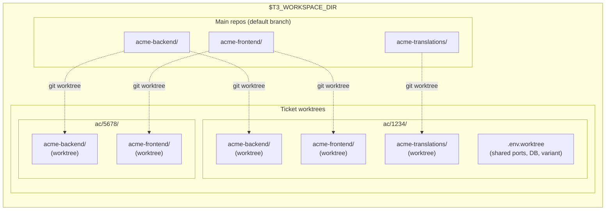

# Environment & Workspace Lifecycle

The infrastructure foundation. Every other `t3-*` skill depends on this one.

Manages **multi-repo worktree workspaces** — creating synchronized git worktrees across multiple independent repositories for a single ticket, then provisioning each with isolated ports, databases, env files, and services so they're ready to use immediately.



Each ticket gets its own directory with one git worktree per affected repo and a shared `.env.worktree` for port allocation, database name, and variant configuration. Worktrees share the `.git` directory with the main clone but have their own branch and working tree.

## Dependencies

None — this is the foundation skill.

## Configuration (`~/.teatree`)

Key variables used by this skill (see `/t3-setup` for the full config reference):

| Variable | Required | Purpose |
|----------|----------|---------|
| `T3_REPO` | Yes | Path to the teatree repo clone |
| `T3_WORKSPACE_DIR` | Yes | Root workspace directory |
| `T3_OVERLAY` | No | Path to the project overlay skill (project-specific overrides) |
| `T3_BRANCH_PREFIX` | No | Prefix for worktree branches (default: initials from `git config user.name`) |
| `T3_AUTO_SQUASH` | No | Auto-squash related unpushed commits before push (default: `false`) |

### Data Directory (XDG-Compliant)

Teatree stores runtime data (ticket cache, MR reminders, followup dashboard) in:

```text
$T3_DATA_DIR  (default: ${XDG_DATA_HOME:-$HOME/.local/share}/teatree)
```

`~/.teatree` is the **config file** — never use it as a data directory. Set `T3_DATA_DIR` in `~/.teatree` to override the default location.

## Setup Verification

If the environment seems incomplete (missing shell functions, hooks not firing, statusline absent), load `/t3-setup` to run the interactive setup wizard.

## Workflows

### Worktree Creation

- `t3_ticket` — creates a ticket directory with git worktrees for each affected repo.
- Convention: one directory per ticket, one worktree per repo.
- **NEVER use raw `git worktree add`, `git checkout -b`, or `git branch` directly.** Always use `t3_ticket` — it creates the correct directory structure (`<ticket>/<repo>/`) and handles branch naming. Raw git commands produce flat worktrees that break the ticket-directory convention and confuse subsequent tooling.

### Worktree Setup

- `t3_setup` — full environment provisioning for a worktree:
  - Symlinks (`.venv`, `node_modules`, `.python-version`, `.data`, project-specific)
  - Environment files (`.env`, `.env.worktree`, `.env.local.*`)
  - DB provisioning (create DB, import from DSLR/dump, run migrations)
  - direnv integration
  - Frontend dependencies

### Database Management

- `t3_db_refresh` — refresh worktree DB from DSLR snapshots or dump files.
- `t3_restore_ci_db` — restore from the latest CI dump (extension point: `wt_restore_ci_db`).
- `t3_reset_passwords` — reset all user passwords to a known value (extension point: `wt_reset_passwords`).

### Dev Servers

- `t3_start` — full-stack startup (Docker services + migrations + backend + frontend).
- `t3_backend` — start backend dev server only.
- `t3_frontend` — start frontend dev server only.
- `t3_build_frontend` — build frontend app for production/testing.

### Cleanup

- `t3_clean` — prune merged worktrees, drop orphan DBs, remove stale directories.

## Rules

### Never Hand-Edit Generated Files (Non-Negotiable)

Setup tools (`t3_setup`, etc.) generate configuration files (`.env.worktree`, docker overrides, port allocations). **Manual edits create drift** and are overwritten on the next setup run.

When a generated file is wrong or incomplete, **re-run the setup tool** — don't manually patch the file. If setup fails, diagnose the root cause in the setup script (see `/t3-debug`), don't work around it.

### Never Run Infrastructure Commands Directly (Non-Negotiable)

Use the provided shell functions (`t3_start`, `t3_backend`, `t3_frontend`, etc.) instead of running `docker compose`, language-specific dev servers, or build tools directly. The shell functions handle:

- Environment variable loading from generated files
- Service ordering (data store → migrations → application)
- Port isolation between worktrees
- Health checks after startup

Direct commands bypass these safeguards, causing subtle failures (wrong DB, port collisions, missing migrations).

### Full Worktree Isolation (Non-Negotiable)

Each worktree gets its own **isolated environment** — dedicated database, ports, containers, and env files. Never share infrastructure between worktrees:

- Never point one worktree's frontend at another worktree's backend
- Never use the main repo's database for worktree work
- Never manually set ports — let `t3_setup` allocate them via `find_free_ports()`

When testing an MR, create a full worktree (`t3_ticket` + `t3_setup` + `t3_start`).

### Validate After Provisioning (Non-Negotiable)

After importing a database or downloading an artifact, always validate it:

- **Check file sizes** — 0-byte files indicate failed downloads (often VPN/network issues)
- **Spot-check data** — empty seed/reference tables indicate a corrupt import; the application will crash on every request with lookup errors
- If validation fails, **delete the corrupt artifact and re-run provisioning**. Never try to manually fix corrupt data — interdependent reference tables make this a losing game.

### Service Startup Ordering (Non-Negotiable)

Setup tools enforce ordering: **data store → migrations → application server**. Starting the application before migrations causes "relation does not exist" errors. Always use the orchestration functions (`t3_start`) rather than starting services individually.

### Never Delegate Skill-Dependent Work to Sub-Agents (Non-Negotiable)

See [`../references/agent-rules.md`](../references/agent-rules.md) § "Sub-Agent Limitations". If parallelism is needed, pass the **full skill file contents** in the sub-agent prompt — but prefer sequential main-conversation execution.

### Verify Services Before Declaring Running (Non-Negotiable)

After starting dev servers, **verify each service responds via HTTP** before reporting success. Check that frontend, backend, and API endpoints return expected status codes (2xx/3xx). If any check fails (000, 500, connection refused), diagnose before reporting — see troubleshooting docs.

Project skills define the specific endpoints to check (e.g., admin login, API version, frontend index).

## Extension Points

For the full extension points table, override chain, and project skill creation guide, see [`../references/extension-points.md`](../references/extension-points.md).

Summary: 23 extension points with 3-layer priority (**default** < **framework** < **project**). Key points: `wt_db_import`, `wt_post_db`, `wt_env_extra`, `wt_run_backend`, `wt_run_frontend`, `wt_create_mr`, `wt_monitor_pipeline`, `wt_send_review_request`.

## Script Reference

| Script | Purpose |
|--------|---------|
| `t3_ticket` | Create ticket worktrees |
| `t3_setup` | Full worktree environment setup |
| `t3_db_refresh` | Refresh DB from DSLR/dumps |
| `t3_restore_ci_db` | Restore from CI dump (ext: `wt_restore_ci_db`) |
| `t3_reset_passwords` | Reset all user passwords (ext: `wt_reset_passwords`) |
| `t3_start` | Full-stack startup |
| `t3_backend` | Backend dev server |
| `t3_frontend` | Frontend dev server |
| `t3_build_frontend` | Build frontend app |
| `t3_clean` | Prune stale worktrees |

## Troubleshooting

Before any setup or server operation, check [`../references/troubleshooting.md`](../references/troubleshooting.md) for known failure modes matching the current operation.

## Skill File Locations & Symlink Chain

```text
<agent-skills-dir>/t3-* → $T3_REPO/t3-*
                            (SOURCE OF TRUTH)
```

The agent skills directory varies by platform (for example `~/.claude/skills/`, `~/.codex/skills/`, `~/.cursor/skills/`, or `~/.copilot/skills/`).

- **NEVER** replace a symlink with a real file/directory. If unsure, run `ls -la` first.
- **Before writing to any skill file**, resolve the real path: `readlink -f <path>`.

## Reference Index

| When you need to... | Read |
|---|---|
| Check tool requirements or first-time setup | [`../references/prerequisites.md`](../references/prerequisites.md) |
| Find available shell functions, scripts, or COMPOSE_PROJECT_NAME details | [`../references/scripts-and-functions.md`](../references/scripts-and-functions.md) |
| Understand extension points, override chain, or create a project skill | [`../references/extension-points.md`](../references/extension-points.md) |
| Diagnose worktree setup failures, DB errors, port conflicts | [`../references/troubleshooting.md`](../references/troubleshooting.md) |
| Cross-cutting agent rules (clickable refs, token extraction, temp files) | [`../references/agent-rules.md`](../references/agent-rules.md) |
